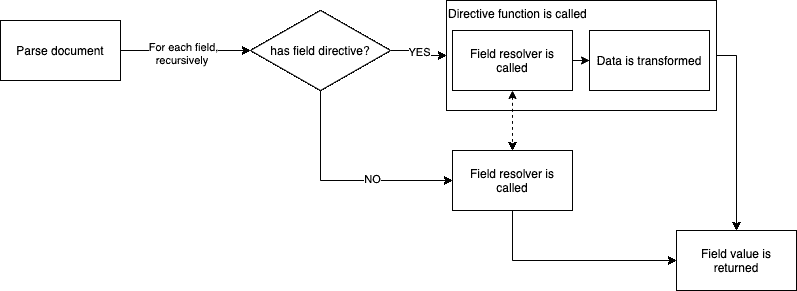
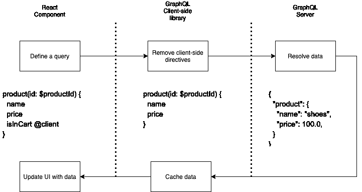
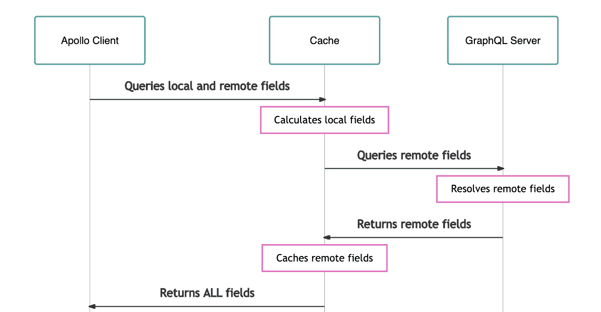

# 在 GraphQL schema - LogRocket 博客中使用的 3 个注释

> 原文：<https://blog.logrocket.com/3-annotations-to-use-in-your-graphql-schema/>

### 介绍

GraphQL 的描述性查询语言和并行解析器架构已经帮助许多公司，如 Shopify 和 Github，向他们的用户提供强大的数据 API。

GraphQL 的一个鲜为人知的特性叫做注释，现在被 Apollo 或 Relay 等库广泛使用，以提供更好的开发人员体验。

本文将向您介绍注释，并引导您了解 3 种有用注释的最常见用法。

## 什么是注释？

### 句法

帮助您遵循官方 GraphQL 规范的注释或**指令**是 GraphQL 语言的一个官方特性。

指令很容易被字符`@`识别，如下所示:

```
<code>
query Hero($episode: Episode, $withFriends: Boolean!) {
  hero(episode: $episode) {
    name
    friends @include(if: $withFriends) {
      name
    }
  }
}
</code>
```

在本例中，[取自官方 GraphQL 文档](https://graphql.org/learn/queries/#directives)，该指令的名称是“include”。

正如 GraphQL 文档中所写的，指令可以接收参数，并且可以应用于 GraphQL 文档中的许多地方。

**应用于查询字段的指令(Apollo 客户端)**

```
<code>
query GetCartItems {
    cartItems @client
}
</code>
```

**应用于类型定义的指令(阿波罗联盟)**

```
<code>
type User @key(fields: "id") {
  id: ID!
  username: String!
}
</code>
```

为简单起见，本文只涵盖了指令可能位置的一个子集(主要是操作的字段)。

完整的可能位置列表可以在[这个优秀的堆栈溢出答案](https://stackoverflow.com/a/61755619)中找到。

### 目的

指令可以被看作是 GraphQL 语法的缩写，它向 GraphQL 服务器或客户机传递额外的信息，以便执行查询或变异。

**GraphQL Server @include 指令**

```
<code>
query Hero($episode: Episode, $withFriends: Boolean!) {
  hero(episode: $episode) {
    name
    friends @include(if: $withFriends) {
      name
    }
  }
}
</code>

```

`@include`指令指示 GraphQL 服务器何时应该在响应`data` JSON 主体中包含或不包含这些字段。

**阿波罗客户端`@client`指令**

```
<code>
query GetCartItems {
    cartItems @client
}
</code>

```

Apollo 客户端“提供”指令`@client`作为指示字段值是应该在本地获取还是在 GraphQL API 上远程获取的简写。

我们将在下一节仔细研究一下`@client`指令。

### 它是如何工作的？

让我们分析一下`@include`指令在应用于以下查询时是如何工作的:

```
<code>
query Hero($episode: Episode, $withFriends: Boolean!) {
  hero(episode: $episode) {
    name
    friends @include(if: $withFriends) {
      name
    }
  }
}
</code>
```



当解析传入的操作(`Hero`查询)时，服务器浏览每个字段，调用解析器来获取适当的数据。

当到达`friends`字段时，GraphQL 服务器会遇到`include`指令并调用它，以及字段定义和相关的解析器。

只有当`if`参数值为真时，`include`指令才会调用`friends`解析器。

总而言之，在服务器端，指令将字段解析器“包装”为:

*   跳过解析器(例如:`@skip`或`@include`指令——见下一节)
*   调用解析程序后转换数据

注释还允许您为操作(查询、突变)添加新的行为，或者为类型定义添加额外的信息。

* * *

### 更多来自 LogRocket 的精彩文章:

* * *

现在让我们通过回顾许多类型的指令变得更加实际，包括标准指令、Apollo 定制指令和社区驱动指令。

## 适用于您的应用的通用指令

我们现在已经熟悉了指令语法和它们的内部工作方式。让我们来看看一些你可能已经使用过而没有注意到的。

### 模式的标准指令

以下指令由 [GraphQL 规范](https://spec.graphql.org/draft/#sec-Type-System.Directives)定义，旨在被任何 GraphQL 服务器(任何遵循 GraphQL 规范的服务器库，不仅仅是 Apollo)支持。

该规范定义了三个指令，包括上一节中看到的`@include`指令。

### `@skip`

只有当`if`参数值为假时，该指令才与`@include`指令相反，包括目标字段。

```
<code>
query Hero($episode: Episode, $onlyHero: Boolean!) {
  hero(episode: $episode) {
    name
    friends @skip(if: $onlyHero) {
      name
    }
  }
}
</code>
```

### `@deprecated`

与我们之前看到的指令不同，该指令旨在用于类型定义，而不是操作(查询/变异)，以提供关于类型本身的额外信息。

```
<code>
type Hero {
    name: String!
    friends: [Hero!]!
    appearsIn: [Movie!]!
    appearsOn: [Movie!]! @deprecated(reason: "Use `appearsIn`.")
}
</code>
```

使用此指令来指示不推荐使用的字段有许多优点:

### 客户端指令的现代用例

Apollo Client 在客户端使用了一些有趣的指令。客户端的指令行为与服务器端的稍有不同。

它是如何工作的？

客户端指令只在客户端定义，这意味着目标 GraphQL 服务器不应该接收它们。



上图中未显示的一个额外步骤是客户端指令可能会执行:

*   在向 GraphQL 服务器发送查询之前
*   在从 GraphQL 服务器获得响应之后，在将结果传播到缓存和组件(钩子)之前

总之，客户端指令可以与缓存数据交互，并提供缓存管理功能。

## 客户端指令

现在让我们看一些 Apollo Client 的客户端指令带来的特性的例子。

### 阿波罗客户端`@client`指令

如上所述，下面的 GraphQL 查询使用了一个名为`@client`的客户端指令。

```
<code>
product(id: $productId) {
  name
  price
  isInCart @client
}
</code>
```

Apollo Clien t 提供的`@client`指令[表示`isInCart`字段是本地的，这意味着不需要向 GraphQL 服务器请求来获取它的值。](https://www.apollographql.com/docs/tutorial/local-state/)

如下图所示，我们的查询将分许多步骤执行:

*   Apollo 客户端从查询中提取本地字段(`@client`字段)
*   获取本地字段值
*   请求 API(没有`@client`字段)
*   缓存来自 API 响应的远程字段
*   将所有字段返回给客户端(或`useQuery()`钩子)



[图来自官方 Apollo React 客户端文档](https://www.apollographql.com/docs/react/local-state/local-state-management/)

关于`@client`的使用，Apollo 客户端有一些改进。以下查询仅使用本地字段，不会触发对 GraphQL 服务器的请求(因为没有远程字段):

```
<code>
query GetCartItems {
    cartItems @client
}
</code>
```

`GetCartItems`查询是 Apollo GraphQL 的“本地状态”用法的一个完美例子，由于 directives 语法带来了令人愉快的体验。

### 阿波罗客户端`@export`指令

另一个提供优秀开发人员体验的聪明用法是客户端`@export`指令:

```
<code>
query CurrentUserPostCount($userId: Int!) {
  currentUserId @client @export(as: "userId")
  postCount(user: $userId)
}
</code>
```

这个指令由 Apollo Client 提供，允许您重用任何本地字段值(通过`@client`)作为字段的变量或当前操作的子查询。

`CurrentUserPostCount`查询是 Apollo 提供的关于 GraphQL 状态管理的另一个流畅体验的例子。

如果不使用`@export`,就需要一个单独的查询和附加的逻辑来实现相同的 GraphQL 查询。

## 3 个强大的模式注释

我们看到了由官方规范和主要库在客户端和服务器端提供的指令的好例子。

现在让我们关注 3 个强大的服务器端指令，您可以开始使用它们来增强您的 GraphQL 模式。

### **`@computed`指令**

由 [GraphQL 社区组织](https://github.com/graphql-community)提供的`@computed`指令在解决一个普遍存在的问题上特别方便:重复和搭建。

很多时候，在现实世界的应用中，一些属性是简单地从现有的属性中计算或推导出来的。

为这些计算属性编写解析器既麻烦又不必要。

让我们来看看`@computed`的行动:

```
<code>
type User {
  firstName: String
  lastName: String
  fullName: String @computed(value: "$firstName $lastName")
}

type Query {
  me: User
}

</code>
```

这里，`User.fullName`属性不需要 resolver 方法。`@computed`会在需要时自动计算适当的值。

完整的安装细节可在官方资料库中找到:

> 指令允许从定义了的字段创建计算属性。yarn add graphql-directive-computed-property 该包需要 graph QL 和 graphql-tools 作为对等依赖查询:Result:Example:admin:String @ rest(URL:" $ { URL _ TO _ API } ")@ computed(value:"你是 admin 吗？$admin ")指令参数:计算值。它可以包含定义它的类型中的其他字段。

在您的模式上使用这个指令将有助于您保持解析器的伸缩性。

### **认证指令**

现在让我们来解决一个更重要的挑战，再次借助于 [GraphQL 社区组织](https://github.com/graphql-community)包: [graphql-directive-auth](https://github.com/graphql-community/graphql-directive-auth) 。

指令为认证和授权 GraphQL APIs 设计挑战提供了一个优雅的解决方案。

[graphql-directive-auth](https://github.com/graphql-community/graphql-directive-auth) 包提供了两个强大的指令:

*   `@isAuthenticated`
*   ``@hasRole(role: String)``

 `这两个指令都适用于字段定义，如下图所示:

```
<code>
type Query {
  currentUser: User @isAuthenticated
  users: [User] @isAuthenticated
}

type User {
  id
  first_name
  last_name
  purchases: [Product!]! @hasRole('self', 'admin')
}
</code>
```

通过阅读该模式，我们了解到:

*   只有经过身份验证的用户才能访问用户(当前用户和列表用户)
*   用户的购买只能由列出
*   管理
*   用户本身(“自我”)

只有管理员才能运行以下查询，因为他是唯一可以访问所有用户的购买列表的用户:

```
<code>
query {
  users {
    id
    first_name
    purchases {
      title
      price
    }
  }
}
</code>
```

graphql-directive-auth 依赖于 JWT，以两种模式运行:

*   [默认模式](https://github.com/graphql-community/graphql-directive-auth#default)期望每个请求携带一个带有 JWT 令牌的`Authorization`报头，该令牌携带一些`role`属性
*   [自定义模式](https://github.com/graphql-community/graphql-directive-auth#custom-behaviour-of-authentication-functions)允许您定义一个自定义方法来定义如何认证用户(`@isAuthenticated`)以及一个自定义方法来定义角色检查行为(`hasRole(role)`)。

多亏了 GraphQL 指令，这个库提供了一种简单的方法来为您的 GraphQL API 添加可扩展的身份验证层。

完整的安装和自定义配置详细信息可在官方存储库中找到:

> graphql-directive-auth 的创建是为了帮助完成几乎每个 API 都面临的常见身份验证任务。yarn add graphql-directive-auth 我们能够以两种不同的方式使用指令:要使用默认的指令行为，您需要设置 APP_SECRET 环境变量，仅此而已。

格式化指令

### 大多数前端应用程序选择在客户端进行所有的数据格式化，从而产生了数 kb 的第三方格式化库。

[@ saeris/graph QL-directives](https://github.com/Saeris/graphql-directives#formatcurrenc)包提供了一组 30 个指令，允许您的前端让 API 完成所有繁重的格式化工作。

让我们强调一下最有趣的指令:

考虑到货币格式化这个复杂的主题，`@formatCurrency`尤其有趣。

```
<code>
type Example {
  # Int | Float => String
  hourlyRate: Int @formatCurrency(
    defaultFormat = "$0,0.00" # String!
    defaultRoundingMode = HALF_AWAY_FROM_ZERO # RoundingMode!
  )
}

query ExampleQuery {
  getPerson {
    # Raw => Default Format => Requested Format
    # 1150 => $11.50 => EUR 11.5
    hourlyRate(format: "USD0,0.0", currency: "EUR") # => EUR 11.5
  }
}
</code>
```

有趣的是，作为一个类型定义指令，`@formatCurrency`增强了应用的字段解析器，允许客户在查询时传递可选的格式参数，如`format`或`currency`。

这同样适用于日期、数字、电话号码格式，以及 20 多条字符串和测量指令！

这个包绝对是现代 GraphQL API 的必备包。花点时间看看官方知识库:[https://github.com/Saeris/graphql-directives#formatdate](https://github.com/Saeris/graphql-directives#formatdate)

更进一步

## 指令是扩展类型定义能力和 GraphQL 操作(查询和突变)执行的一种直观而灵活的方式。

在服务器端，指令允许您向类型添加元数据(`@deprecated`，Apollo Federation 指令)，优化查询(`@include`，`@skip`，以及转换数据(`@computed`)。

在客户端，指令主要用于定制缓存行为和添加一些本地状态管理功能(`@client`)。

然而，创建有用的通用指令是复杂的。

因此，指令的主要功能是编写自己的指令，以便:

避免在解析器之间重复逻辑，并将其作为指令重用(验证)

*   向您的客户端公开自定义逻辑操作(格式化、自定义 ACL)
*   构建指令是通过使用 graphql-tools 的[SchemaDirectiveVisitor API](https://www.graphql-tools.com/docs/legacy-schema-directives/#declaring-schema-directives)实现的。

学习这个 API 的一个很好的起点是专门针对这个主题的 [great Apollo 文档页面](https://www.apollographql.com/docs/apollo-server/schema/creating-directives/#uppercasing-strings)。

结论

### 我希望这篇文章中推荐的三个注释能启发你写自己的注释。请注意，在 GraphQL 生态系统中，指令才刚刚开始，因为将来会有更多的特性出现[、@defer、@live、@specifiedBy](https://www.youtube.com/watch?v=sMTNTy_aOU0) 。

监控生产中失败和缓慢的 GraphQL 请求

## 虽然 GraphQL 有一些调试请求和响应的特性，但确保 GraphQL 可靠地为您的生产应用程序提供资源是一件比较困难的事情。如果您对确保对后端或第三方服务的网络请求成功感兴趣，

.

[try LogRocket](https://lp.logrocket.com/blg/graphql-signup)

LogRocket 就像是网络和移动应用的 DVR，记录下你网站上发生的每一件事。您可以汇总并报告有问题的 GraphQL 请求，以快速了解根本原因，而不是猜测问题发生的原因。此外，您可以跟踪 Apollo 客户机状态并检查 GraphQL 查询的键值对。

[](https://lp.logrocket.com/blg/graphql-signup)[https://logrocket.com/signup/](https://lp.logrocket.com/blg/graphql-signup)

LogRocket 检测您的应用程序以记录基线性能计时，如页面加载时间、到达第一个字节的时间、慢速网络请求，还记录 Redux、NgRx 和 Vuex 操作/状态。

.

[Start monitoring for free](https://lp.logrocket.com/blg/graphql-signup)

.`