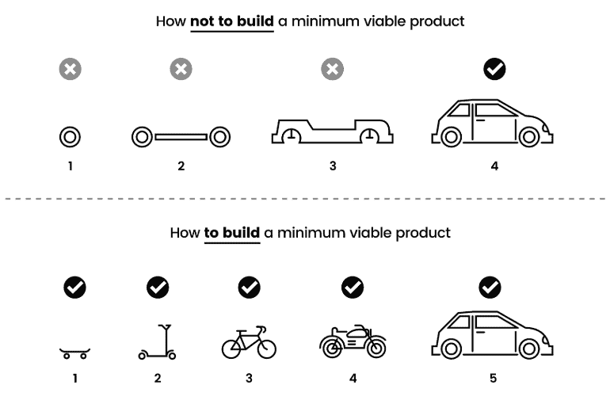

# 精益 UX 和原则驱动设计的 5 个关键

> 原文：<https://blog.logrocket.com/ux-design/5-keys-lean-ux-principle-driven-design/>

关于软件开发团队管理过程的争论和技术本身一样古老，这并不奇怪。软件开发在概念上是复杂的，高度协作的，并且需要精通不断发展的市场、期望和技术。敏捷和[精益](https://www.lean.org/explore-lean/what-is-lean/)长期以来一直是主流的方法，不用讨论两者之间的区别，只需说它们都旨在帮助团队以尽可能少的浪费尽可能快地创造价值。

过程应该总是遵从上下文。团队不应该遵循规定的软件方法，而应该定期检查他们的方法是否对他们有用——对他们的产品、他们的客户和他们的行业。

在这里，我将分享一些经验法则，这些法则在我作为一名产品设计师的经历中很有帮助，无论是在代理机构还是在团队结构的内部。这些原则本身并不是一个过程，而是你实践精益时的考虑因素。虽然我在精益 UX(一种面向设计的方法论解释)方面有更多的经验，但这些也适用于敏捷环境。

## 什么是精益 UX？

借鉴丰田在本世纪中期使用的汽车生产原则，精益是一种优先考虑效率、迭代和假设驱动实验的管理方法。精益通常与瀑布管理方法形成对比，在瀑布管理方法中，解决方案是在开始时定义的，然后随着团队相互移交工作，在连续的阶段中设计和构建(“瀑布”)。通过精益，团队接受他们从一开始就不知道解决方案，并把产品开发过程视为一个不断学习的过程，同时他们测试小规模的想法，以确定给定的环境和手头的约束条件下的最佳解决方案。

精益试图降低将资源投入到可能不会成功的解决方案中的风险。事实上，它假设大多数想法都会失败，因此强调快速、迭代开发和客户验证的需要。

精益 UX 引入了帮助团队理解他们的用户的实践；创造想法来测试、原型化和验证这些想法；并决定如何进行。该方法鼓励跨学科协作，因为设计人员、开发人员、项目经理和其他人员在验证过程的每个阶段一起工作，利用他们各自的优势和见解，避免瀑布方法中经常出现的工作和思维的分散。

要了解更多关于精益 UX 的信息，我推荐交互设计基金会的“[精益 UX 简单介绍”，](https://www.interaction-design.org/literature/article/a-simple-introduction-to-lean-ux)以及杰夫·戈瑟尔夫的 [*精益 UX*](https://www.amazon.com/Lean-UX-Creating-Great-Products/dp/1098116305) 和埃里克·里斯的 [*精益创业*](https://www.amazon.com/Lean-Startup-Entrepreneurs-Continuous-Innovation/dp/0307887898/) 。

## 1.用散文开始设计

在解决复杂问题时，设计师的视觉天赋往往是一个优势，也是一个弱点。渴望看到和分享进展，我们经常被诱惑立即开始在视觉媒体中工作，无论是勾画想法，制作线框，还是高保真地使用已建立的设计系统。

虽然从我们的头脑中获得最初的想法是有帮助的，但我们不可避免地会对我们的第一次创造产生偏见；随后的想法往往是最初主题的变体。最好从文字开始，文字让我们看到我们最初可能没有想到的可能性。

对问题的背景、问题本身以及建议的解决方案的简明、浅显的语言描述有几个目的。要向别人解释一个想法，需要我们发现关于问题和解决方案的假设，而我们可能只是一知半解。

写得好的问题和解决方案陈述也可以作为评估设计想法的参考点，要求设计满足自身之外的标准*。它们是设计师在处理手头的复杂设计时，让自己负责解决已定义问题的一种方式。我可以想起我花了几个小时完成一个复杂的交互设计，却发现自己完全偏离了另一个问题领域。*

 *无论书面文档是以产品简介、功能定位还是团队独有的形式出现，设计师自己参与写作和思考都很重要，因为设计过程早在像素排列在屏幕上之前就开始了。

并且文档应该以对话的方式编写；不是要点式的咕哝，不是用户故事中生硬的语言。平实的语言迫使我们避免行话，理清思路。

## 2.将想法提炼为最小的有价值的部分

精益方法强调尽可能快地运送产品，以快速了解什么是有价值的，并相应地进行迭代——从一个[最小可行产品](https://blog.logrocket.com/product-management/what-is-minimum-viable-product-mvp-how-to-define/)开始并详细说明。

然而，这适用于功能以及整体产品。这意味着即使是离散的特性也应该总是被分解成最便宜的实现，这些实现可以有意义地用于推断它们对用户的价值。

滑板经常被用来比喻适当的 MVP 发展。如果你的目标是造车，不要从做轮子开始；从滑板开始，看看人们是否以及如何使用它，然后将其改进为踏板车，然后是自行车，等等。

[Image source: Very Possible.](https://www.verypossible.com/insights/how-we-work-agile-lean-methodologies)

在滑板层面定义解决方案要求设计者能够舒服地创建看起来不完整的解决方案。然而，这种方法的好处是，他们避免了设计没人想骑的摩托车可能浪费的时间。

例如，假设您正在为一个写作应用程序设计一个入职流程，并希望向新用户推荐模板。您为目标受众创建一组模板，并开始概述一份问卷，询问新注册的用户他们的预期用例。

然后，与工程师一起构建推荐这些模板的界面和逻辑可能是有意义的，但是有没有一种更便宜的方法来测试新用户是否会发现这些模板有价值呢？也许包含模板的自动化电子邮件流可以提供人们真正使用什么的线索。或者在应用程序中更有效地显示模板也可以做到这一点。

一些功能可能需要大量的设计和工程来测试它们的价值。然而，团队需要记住，每一个特性都是关于什么会起作用的假设，从小的、可测试的假设着手是比大的、高风险的投资更可持续的方法(对于产品的财务和团队士气来说)。

## 3.当心滑板方法泛滥

当然，滑板思想的风险在于，产品可能会被最低价值的功能淹没，从而损害整体产品体验。称之为滑板雪球效应。

任何产品都是由其相互作用的累积效应来定义的。只要对产品的需求足够高，用户可能会容忍最低价值的功能。然而，面对竞争对手，它将变得越来越脆弱。Craigslist 就是一个很好的例子，它的功能永远遵循“足够好”的原则，可能只有在免费的情况下才会存在。

对滑板扩散的敏感性可以帮助团队决定何时重构个人或集体特征。随着不一致或缺点的积累，正如它们不可避免的那样，团队可以识别重新设计、系统化和整合产品部分的临界点。

## 4.根据兴趣而不是评估来确定工作范围

37Signals 的人们对精益的重新诠释, [Shape Up](https://basecamp.com/shapeup) 的一个见解是，工作不应该通过估计来划分，而应该通过团队愿意投入的时间量来划分*。*

 *团队不应该依赖容易出错的估计，而应该决定一个特性的重要性或价值，然后花时间构建该特性的最佳版本。

继续编写应用程序的例子，假设您希望允许人们对文件提出修改建议。该功能的完整版本可能需要数月或更长时间来设计、测试和构建。

然而，它比你用那段时间建造的其他东西更有价值吗？假设你觉得花一个月的时间是值得的。月底之前构建的评论功能可能不是最好的版本，但那时你有机会决定是继续完善它还是关注潜在的更有价值的东西。

这种思维方式与“[可承受损失](https://innovationenglish.sites.ku.dk/model/sarasvathy-effectuation/#phases)”的概念相一致，这种概念鼓励企业家考虑投资时，不要基于他们认为自己会获得什么——结果最终超出了他们的控制——而是基于他们愿意失去什么。团队不能控制他们工作的结果，但是他们可以控制他们愿意投入多少时间。

## 5.抓住问题不放，而不是解决方案

精益 UX 的核心是强调不断发现，即学习什么可行什么不可行的开明过程。该方法假设我们从一开始就对问题空间或受众了解不够，无法提出成功的解决方案，而是假设解决方案是在团队测试产品假设的过程中通过反复试验得出的。

马蒂·卡甘(Marty Cagan)在他的《受 *[启发的](https://www.svpg.com/books/inspired-how-to-create-tech-products-customers-love-2nd-edition/)* 一书中质疑长期路线图的价值，他甚至说:“(产品开发)最重要的一课是爱上问题，而不是解决方案。”

对问题空间的投入，无论是在医疗保健、教育、分析、个人金融，还是企业服务的任何利基领域，都是激励团队继续完成构建、测试和抛弃没有解决问题的好想法的困难工作的动力。

基于团队愿意投入的时间来构建最小价值的特性是减轻对任何特定解决方案的依赖的一种方式。但是对问题的好奇心，通过一轮又一轮经过测试的假设得到发展和澄清，是看到任何单一解决方案缺点的可靠方式。好奇心是批判性思维的基础，帮助我们找到下一个可能的解决方案。

## 最后的想法

不管你的团队遵循什么样的产品过程，它都应该足够灵活，以帮助你优先处理下一个最有价值的事情，同时提供足够的结构，以允许你的团队与组织的其他部分同步运作。这需要很大程度的自主性，并且只在团队被信任去测试那些很可能会失败的想法，并相应地学习的环境中有效。

在一个组织中培养这种心理安全感是一项困难却又无价的任务。但另一种选择是精益 UX 所要反对的那种思想狭隘。

## [LogRocket](https://lp.logrocket.com/blg/signup) :无需采访即可获得 UX 洞察的分析

[LogRocket](https://lp.logrocket.com/blg/signup) 让您可以回放用户的产品体验，以可视化竞争，了解影响采用的问题，并结合定性和定量数据，以便您可以创建令人惊叹的数字体验。

查看设计选择、交互和问题如何影响您的用户— [立即尝试 LogRocket】。](hhttps://lp.logrocket.com/blg/signup)**