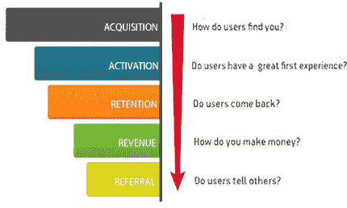
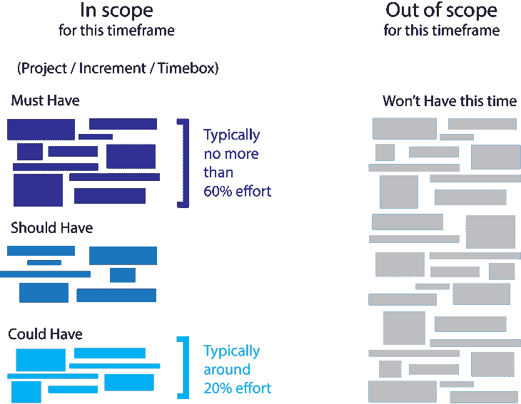
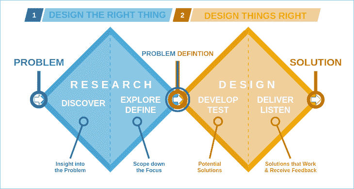
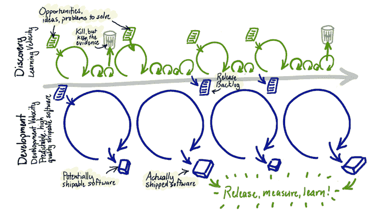

# 你应该知道的 6 个可靠的产品管理框架

> 原文：<https://blog.logrocket.com/product-management/6-product-management-frameworks-you-should-know/>

产品管理框架为产品团队提供了一个制定战略决策、对功能和待办事项进行优先级排序以及发现产品想法或问题的过程。

在考虑采用哪种产品管理框架时，您应该选择最适合提高盈利能力、保持产品与消费者群相关以及帮助简化流程的框架。

在本指南中，我们将介绍一系列旨在帮助项目经理改进和完善产品开发方法的框架。

* * *

## 目录

* * *

## 为什么公司要开发和使用产品管理框架？

产品管理框架的开发和实现有多种原因。最明显的是，[产品经理的角色](https://blog.logrocket.com/product-management/what-does-a-product-manager-do-role-responsibilities/)涵盖了广泛的责任和职能，包括内部和外部。跟踪不断变化的变量是一个必要的过程，但有时会带来压力和资源消耗。

产品管理框架可以更容易地跟上市场和消费者的变化，并提供开发新产品以填补空白的机会。这些方法也有助于降低产品失败的风险，因为战略决策是基于对硬数据的全面分析。

## 3 种产品管理框架

通常，产品管理框架分为三类:

1.  **战略框架**旨在帮助产品经理收集数据、分析问题、重新审视他们的[产品战略](https://blog.logrocket.com/product-management/what-is-a-product-vision-statement-examples/)，并为产品的未来做出决策
2.  帮助您的团队确定处理特性和待办事项的顺序的优先级框架
3.  **发现框架**有助于发现过程，包括探索产品的新机会、验证想法和解决问题

让我们回顾一下六个最流行的产品管理框架——上述每个类别两个。

## 战略框架

### AARRR 指标

[AARRR](https://www.product-frameworks.com/AARRR-Metrics.html) ，也称为 pirate metrics，从客户旅程的每个阶段获取数据。它跟踪以下指标:

*   获得物ˌ获得
*   激活
*   保留
*   介绍
*   收入

虽然这个框架是面向初创公司的，但任何公司都可以从了解客户如何与他们的产品交互中受益。



Source: [Product Frameworks](https://www.product-frameworks.com/AARRR-Metrics.html)

500 Startups 的创始人戴夫·麦克卢尔(Dave McClure)在注意到初创公司往往专注于无意义的指标，如他们最新的社交媒体帖子获得了多少赞后，开发了 AARRR 框架。AARRR 指标被战略性地选择来帮助初创公司以产品增长为重点。

通过遵循这一框架，产品经理可以回答如下问题:

*   顾客通过什么渠道发现产品？
*   人们喜欢第一次产品体验吗？
*   顾客多久回来一次？
*   什么样的用户行为才是创收？
*   顾客是否与他们的同事分享产品？

该框架遵循客户的旅程，并衡量每个阶段的成功。它监控用户行为，并可以帮助组织确定他们在哪里失去客户。运行 A/B 测试可以帮助组织发现哪种策略最适合他们的客户。

### 向后工作

亚马逊被认为开发了逆向工作方法，该方法首先在科林·布亚尔和比尔·卡尔的书《逆向工作[】中提出。](https://www.workingbackwards.com/)

顾名思义，这个框架鼓励产品经理首先在发布产品的最后一步工作。你先写一篇假设的新闻稿，宣布你打算开发的新产品或新功能的发布。写新闻稿的行为应该可以帮助你决定这件事是否值得去做。


Source: [Jamie Mill](https://jamiemill.com/blog/work-backwards/)

逆向工作迫使产品经理考虑客户对他们想要制造的产品的反应。新闻稿通常包含有新闻价值的信息，如产品将如何解决特定问题，以及它给消费者带来什么价值。如果你写不出令人信服的新闻稿，你应该考虑放弃这个想法。

亚马逊以开发易于理解的产品为核心原则。写一篇新闻稿是一个很好的方式来集中你的产品想法，并加强你向公司领导、开发团队以及最终向客户展示的方式。如果在开发的早期阶段很难描述，那么将很难向消费者推销和销售产品。

如果你能想出一个诱人的新闻稿，产品团队应该批准这个想法，并随后开始构建产品。

## 优先顺序框架

### 莫斯科优先化

产品领导者和利益相关者经常使用[莫斯科方法](https://www.agilebusiness.org/page/ProjectFramework_10_MoSCoWPrioritisation)来区分用户故事和任务的优先级。它可以帮助涉众理解正在处理哪些待办事项的重要性。

计划分为四类:

1.  **必须具有** *—* 不可转让的特征，并且是完成项目所必需的
2.  **应具备** *—* 增加重要价值的特性，但不是成功完成项目所必需的
3.  **可能具有不属于核心部分的**—特征；虽然包含这些特性可能很好，但它们并不是产品所必需的
4.  **不会有** *—* 低优先级特性，不会在下一个版本中构建，但在将来的版本中可能会提高优先级

莫斯科优先化方法帮助团队和利益相关者关注任务如何适应整体产品战略和目标。



Source: [AgileBusiness.org](https://www.agilebusiness.org/page/ProjectFramework_10_MoSCoWPrioritisation)

使用莫斯科方法有一些缺点。如果处理不当，可能会导致错误的功能被优先化。

对于产品经理来说，拥有一个客观的评分系统，包括所有关键的利益相关者，并与每个人分享结果是很重要的。这将使它成为区分特性优先级的透明而可靠的过程。

### 赖斯评分模型

[RICE model](https://www.intercom.com/blog/rice-simple-prioritization-for-product-managers/) 是一个评分系统，旨在帮助产品经理优先考虑[产品路线图](https://blog.logrocket.com/product-management/how-to-build-product-roadmap-overview-examples/)上的项目，并改善决策过程。


Source: [Intercom](https://www.intercom.com/blog/rice-simple-prioritization-for-product-managers/)

在 RICE 模型中，当讨论产品的潜在特性时，有四个因素需要考虑。每个因素都有自己的分数，然后用莱斯公式来确定最终分数。

RICE 评分的四个考虑因素是:

*   **达到** *—* 在给定的时间范围内，一项计划将达到的人数。数字越大，分数越高
*   **影响** *—* 特性的预期影响(分数范围从 0.25 到 5)
*   **信心***——*团队对冲击分数的确定性；你应该考虑废弃任何低于 50%的分数
*   **工作** *—* 基于“人-月”的数量或构建一个功能需要多长时间。例如，如果你估计两个月，你的分数是 2

一旦你收集了所有的分数，最后的分数是用下面的公式计算的:

```
(Reach * Impact * Confidence) / Effort
```

RICE 评分模型为做出客观和复杂的决策提供了具体的策略。当提出证据来支持为什么一个特性应该被优先考虑时，这尤其有用。

* * *

订阅我们的产品管理简讯
将此类文章发送到您的收件箱

* * *

## 发现框架

### 双菱形

[双钻石模型](https://en.wikipedia.org/wiki/Double_Diamond_(design_process_model))最初是一个设计过程模型，后来发展成为一个通用的创新框架。



双钻石工艺分为四个阶段:

*   **发现** *—* 这一阶段包括与客户互动和调查，以发现他们的问题和痛点。带着开放的心态进入这一阶段将有助于你了解市场中缺少什么
*   **定义** *—* 利用在发现阶段产生的洞察力，开发解决问题的方法
*   **开发** *—* 利用跨职能团队，成员们可以集思广益，找出流程早期确定的解决方案。这个开发阶段将需要收集客户的反馈，以快速确定哪种解决方案可部署到大众中
*   **交付** *—* 一旦收集到反馈，就会选择一个解决方案并为产品全面开发

双钻石模型有助于产品团队关注客户，并合作交付他们需要的解决方案。客户反馈对确保你的功能或产品解决用户的痛点大有帮助。

### 双轨敏捷

[双轨敏捷](https://medium.com/@daviddenham07/dual-track-agile-the-secret-sauce-to-outcome-based-development-601f6003ea73)旨在帮助组织以最快、最廉价的方式验证产品创意。

双轨敏捷框架中有两个工作流程:发现和开发。发现工作流程侧重于验证产品创意，而开发工作流程则将这些创意转化为产品。



Source: [Jeff Patton](https://www.jpattonassociates.com/dual-track-development/)

这个过程源自于[敏捷开发方法](https://blog.logrocket.com/product-management/12-agile-manifesto-principles-how-to-adopt-them/)，它表明迭代和快速开发会带来更好的产品。虽然团队是跨职能的，但是某些成员在双轨敏捷下有不同的关注点。

发现工作流包括执行市场调查、进行采访和开发用户案例等任务。一旦一个想法被确认，它就被转移到开发工作流程中。然后，开发团队构建原型，收集用户反馈，并进行测试。

双轨敏捷可以帮助你提高产品开发的速度。这个框架中的工作是协作性和非线性的，这使得跨职能团队能够成功地合作。

## 选择正确的产品管理框架

有几十种[产品管理](https://blog.logrocket.com/product-management/)框架可用。根据您公司的需求，一个框架可能提供您需要的结果，而其他框架可能不适合。

请记住，仅仅因为一个框架受欢迎，并不意味着它是你的产品团队的最佳方法。您可能想要尝试一些不同的框架，以找到最适合您的团队成员偏好的框架。

产品管理框架可以帮助你始终如一地推出优秀的产品，并建立一个愿意向你的产品朋友、家人和同事推荐的忠诚客户群。

*精选图片来源:[icon scout](https://iconscout.com/icon/frame-corners-3603471)*

## [LogRocket](https://lp.logrocket.com/blg/pm-signup) 产生产品见解，从而导致有意义的行动

[](https://lp.logrocket.com/blg/pm-signup)

[LogRocket](https://lp.logrocket.com/blg/pm-signup) 确定用户体验中的摩擦点，以便您能够做出明智的产品和设计变更决策，从而实现您的目标。

使用 LogRocket，您可以[了解影响您产品的问题的范围](https://logrocket.com/for/analytics-for-web-applications)，并优先考虑需要做出的更改。LogRocket 简化了工作流程，允许工程和设计团队使用与您相同的[数据进行工作](https://logrocket.com/for/web-analytics-solutions)，消除了对需要做什么的困惑。

让你的团队步调一致——今天就试试 [LogRocket](https://lp.logrocket.com/blg/pm-signup) 。

[Sara Nguyen Follow](https://blog.logrocket.com/author/saranguyen/) My greatest career achievement was when I was recognized as "GIF Master" for my GIFs in the company Slack channel. A close second is that I've written over 600,000 words in the past two years.