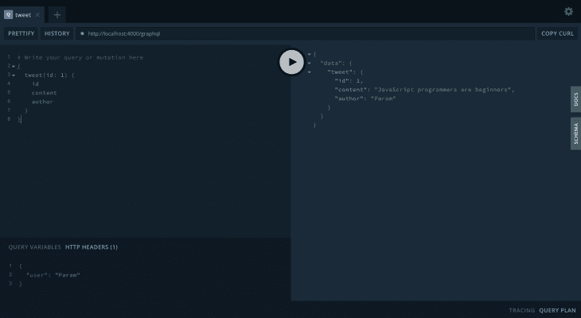
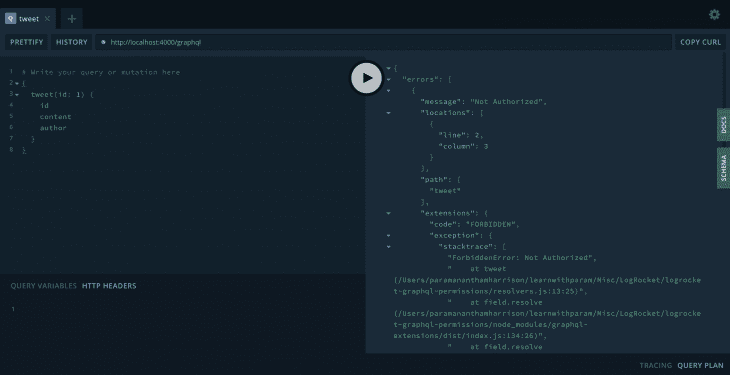
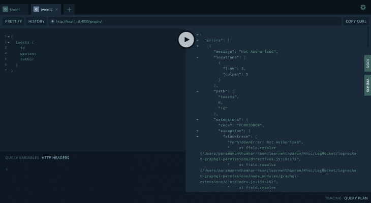
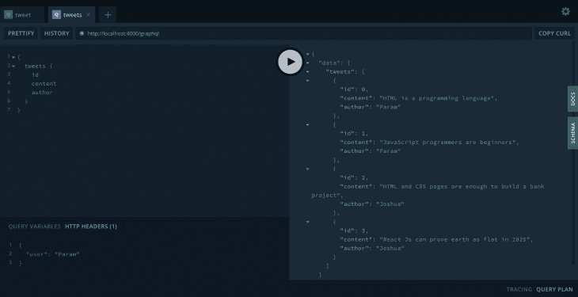
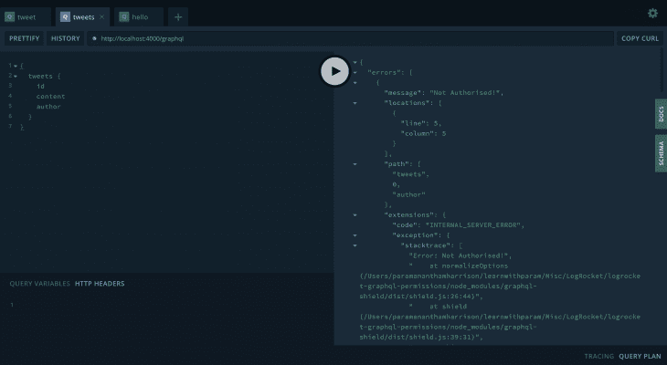
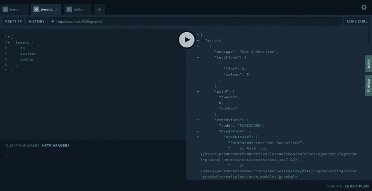
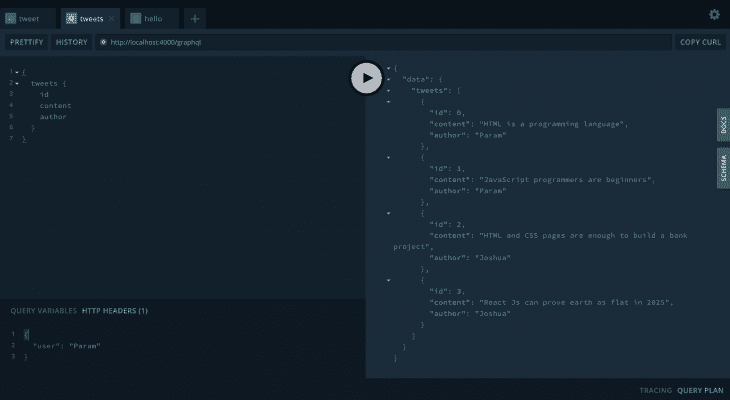

# GraphQL API - LogRocket 博客中的权限完整指南

> 原文：<https://blog.logrocket.com/a-complete-guide-to-permissions-in-a-graphql-api/>

## 介绍

GraphQL 已经成为开发 API 的新常态。它有自己的优势和灵活性。其中一个优点是，它允许您在 API 中实现权限和粒度访问控制。

在大型 REST APIs 中，获得粒度访问控制是一大难题。在 GraphQL 中，您可以非常容易地实现粒度。

在本文中，我们将看到在 GraphQL API 中实现权限的不同模式。

### 访问控制和权限的基础知识

**访问控制**–检查用户是否被授权访问 API。

通常，如果一个用户没有登录，但是 API 端点需要一个登录的用户，API 会抛出一个身份验证错误。

如果用户已经登录，但是没有足够的权限来执行操作，API 将抛出一个禁止的错误或一个未授权的错误。

**Permissions**–Permissions 是一组规则，有助于决定用户是否可以访问特定的 API。

让我们检查一些权限的示例用例。

想想 Twitter 应用程序:

*   用户可以写一条推文
*   写推文的作者可以删除
*   其他用户可以喜欢、转发或分享这条推文
*   其他用户可以报告推文
*   推文的作者和其他用户都可以参与推文上的评论线程

如您所见，作者和其他用户拥有不同级别的权限，尽管授权级别是相同的。他们都被授权为用户，但根据活动，他们有不同的访问权限。

## GraphQL 中的权限

您可以在 GraphQL API 中以不同的方式实现权限。例如，您可以通过模式中的 GraphQL 指令或者通过检查 GraphQL 中间件(如解析器)中的权限来实现权限。

**权限深度**

在 GraphQL 中，可以深入到任何深度来实现权限。

您可以拥有查询级权限、对象级权限和字段级权限。

**在 GraphQL 中实现权限的不同方式**

实现这些权限有不同的技术:指令、中间件解析器和 GraphQL shield 库。

我们将在示例中看到所有这些技术。现在，让我们构建一个简单的 GraphQL 服务器示例。

## 构建简单的 GraphQL API

首先，创建一个新的 npm 项目:

```
npm init
```

添加您的`express`、`apollo-server-express`和`graphql`套餐。

```
npm i express apollo-server-express
```

接下来，使用示例 GraphQL 服务器创建一个`index.js`文件:

```
const express = require('express');
const { ApolloServer, gql } = require('apollo-server-express');

// Construct a schema, using GraphQL schema language
const typeDefs = gql`
  type Query {
    hello: String
  }
`;

// Provide resolver functions for your schema fields
const resolvers = {
  Query: {
    hello: () => 'Hello world!',
  },
};

const server = new ApolloServer({ typeDefs, resolvers });
const app = express();
server.applyMiddleware({ app });

app.listen({ port: 4000 }, () =>
  console.log(`🚀 Server ready at http://localhost:4000${server.graphqlPath}`)
);
```

让我们添加 nodemon 来本地运行服务器。Nodemon 通过在开发过程中观察文件的变化来帮助重新加载服务器:

```
npm i -D nodemon
```

在`package.json`文件中添加运行服务器的脚本:

```
"scripts": {
    "start": "node index.js",
    "dev": "nodemon index.js"
},
```

让我们在终端中启动服务器:

```
npm run dev
```

服务器将在端口`4000`打开。

* * *

### 更多来自 LogRocket 的精彩文章:

* * *

让我们再创建几个文件并拆分代码。我们将使用一个`schema.js`文件来定义 GraphQL 类型:

```
// schema.js

const { gql } = require("apollo-server-express");
// Construct a schema, using GraphQL schema language
module.exports = gql`
  type Query {
    hello: String
  }
`;
```

和`resolver.js`文件用于解析器:

```
// schema.js

const { gql } = require("apollo-server-express");
// Construct a schema, using GraphQL schema language
module.exports = gql`
  type Query {
    hello: String
  }
`;
```

让我们为一个简单的 Tweet 应用程序创建一些数据和相应的查询和解析器。

`data.js`文件将是:

```
// data.js

module.exports = [
  {
    id: 0,
    content: "HTML is a programming language",
    author: "Param",
  },
  {
    id: 1,
    content: "JavaScript programmers are beginners",
    author: "Param",
  },
  {
    id: 2,
    content: "HTML and CSS pages are enough to build a bank project",
    author: "Joshua",
  },
  {
    id: 3,
    content: "React Js can prove earth as flat in 2025",
    author: "Joshua",
  },
];
```

现在，我们将创建查询和解析器来显示这条 Tweet 数据:

```
// schema.js

const { gql } = require("apollo-server-express");
// Construct a schema, using GraphQL schema language
module.exports = gql`
  type Query {
    hello: String
    tweets: [Tweet]!
    tweet(id: Int!): Tweet!
  }

  type Tweet {
    id: Int!
    content: String!
    author: String!
  }
`;
```

`tweets`和`tweet`查询的解析器:

```
// resolvers.js

const { ApolloError } = require("apollo-server-express");
const tweets = require("./data");

// Provide resolver functions for your schema fields
module.exports = {
  Query: {
    hello: () => "Hello world!",
    tweets: () => {
      return tweets;
    },
    tweet: (_, { id }) => {
      const tweetId = tweets.findIndex((tweet) => tweet.id === id);
      if (tweetId === -1) return new ApolloError("Tweet not found");
      return tweets[tweetId];
    },
  },
};
```

我们现在已经准备好了基本的 GraphQL 服务器。让我们通过例子进入 graphQL 权限。

### 查询级别权限:只有登录的用户才能访问 tweet

> 这些例子是假设的，仅供学习之用。在真实的应用程序中，这些场景中的大多数都没有意义。

对于这个例子，首先我们需要从 HTTP 请求中获取登录用户的详细信息。

这种许可可以用不同的方式实现。

**解析器内部的简单解决方案**

首先，我们将用户添加到请求上下文中。为了简单起见，我们只将头用户传递给请求。

```
// index.js
...
const server = new ApolloServer({
  typeDefs,
  resolvers,
  context: ({ req }) => {
    return {
      user: req.headers.user || "",
    };
  },
});
...
```

然后，添加逻辑以确保只有登录的用户才能看到 Tweet 查询:

```
// resolvers.js
const { ApolloError, ForbiddenError } = require("apollo-server-express");

...
tweet: (_, { id }, { user }) => {
      // Check whether user is logged-in
      if (!user) return new ForbiddenError("Not Authorized");

      const tweetId = tweets.findIndex((tweet) => tweet.id === id);
      if (tweetId === -1) return new ApolloError("Tweet not found");
      return tweets[tweetId];
}
...
```

如果你在操场上经过用户，它会显示推文:



如果头中没有传入用户，就会抛出一个`ForbiddenError`:



这种保护方式不具有可扩展性和可重用性。但是它仍然适用于这个用例。

### 使用 GraphQL 指令

让我们创建一个 GraphQL 指令`isLoggedin`并将其应用于`tweet`查询:

```
// schema.js

const { gql } = require("apollo-server-express");

// Construct a schema, using GraphQL schema language
module.exports = gql`
  directive @isLoggedin on FIELD_DEFINITION
  type Query {
    hello: String
    tweets: [Tweet]!
    tweet(id: Int!): Tweet! @isLoggedin
  }
  ...
`;
```

然后，在 GraphQL 服务器上添加该指令的逻辑。创建一个`directives.js`文件:

```
// directives.js

const {
  ForbiddenError,
  SchemaDirectiveVisitor,
} = require("apollo-server-express");
const { defaultFieldResolver } = require("graphql");

class isLoggedinDirective extends SchemaDirectiveVisitor {
  visitFieldDefinition(field) {
    const originalResolve = field.resolve || defaultFieldResolver;
    field.resolve = async function (...args) {
      const context = args[2];
      const user = context.user || "";
      if (!user) {
        throw new ForbiddenError("Not Authorized");
      }
      const data = await originalResolve.apply(this, args);
      return data;
    };
  }
}

module.exports = { isLoggedinDirective };
```

创建指令的语法有点荒谬。你可以在阿波罗[文档](https://www.apollographql.com/docs/apollo-server/schema/creating-directives/)中探索更多。我们需要链接服务器上的指令:

```
// index.js

const { isLoggedinDirective } = require("./directives");

...
const server = new ApolloServer({
  typeDefs,
  resolvers,
  schemaDirectives: {
    isLoggedin: isLoggedinDirective,
  },
  context: ({ req }) => {
    return {
      user: req.headers.user || "",
    };
  },
});
...
```

运行服务器并检查 GraphQL playground 中的`with`和`without user`头。该指令的工作方式与我们简单的解决方案完全一样，但是由于逻辑是解耦的，所以很容易在多个地方重用。

### 使用 GraphQL 中间件

中间件也是一个解析器。不是直接解析查询，而是首先在中间件解析器中进行检查，然后传递给下一个解析器。您可以使用这种技术组合多个解析器。

为此，我们将使用名为`graphql-resolvers`的包。

```
npm i graphql-resolvers
```

让我们在`middlewares.js`文件中创建我们的`isLoggedin`中间件解析器:

```
// middlewares.js

const { ForbiddenError } = require("apollo-server-express");

// Middleware resolver
const isLoggedin = (parent, args, { user }, info) => {
  if (!user) throw new ForbiddenError("Not Authorized");
};

module.exports = { isLoggedin };
```

现在，我们可以将这个中间件添加到`tweet`解析器中:

```
// resolvers.js
...
const { combineResolvers } = require("graphql-resolvers");
const { isLoggedin } = require("./middlewares");

...
tweet: combineResolvers(isLoggedin, (_, { id }) => {
      const tweetId = tweets.findIndex((tweet) => tweet.id === id);
      if (tweetId === -1) return new ApolloError("Tweet not found");
      return tweets[tweetId];
})
...
```

使用`combineResolvers`，我们能够在解析实际查询之前组合多个中间件解析器。

这个方法也是可重用的，因为我们从真正的解析器中提取逻辑。

## 对象级权限

对于同一个示例，我们将该指令应用于整个 Tweet 类型。然后，我们将启用对象级权限。我们可以跨所有查询保护整个对象，而不是只保护查询。

让我们把它看作一个例子。该示例类似于我们的模式指令示例:

```
// schema.js

const { gql } = require("apollo-server-express");

// Construct a schema, using GraphQL schema language
module.exports = gql`
  directive @isLoggedin on OBJECT

  type Query {
    hello: String
    tweets: [Tweet]!
    tweet(id: Int!): Tweet!
  }

  type Tweet @isLoggedin {
    id: Int!
    content: String!
    author: String!
  }
`;
```

指令附加在类型`Tweet`上。如果你注意到了，我们改变了`OBJECT`上的指令声明。这需要对`directives.js`进行一些修改:

```
// directives.js

const {
  ForbiddenError,
  SchemaDirectiveVisitor,
} = require("apollo-server-express");
const { defaultFieldResolver } = require("graphql");

class isLoggedinDirective extends SchemaDirectiveVisitor {
  visitObject(obj) {
    const fields = obj.getFields();
    Object.keys(fields).forEach((fieldName) => {
      const field = fields[fieldName];
      const originalResolve = field.resolve || defaultFieldResolver;
      field.resolve = async function (...args) {
        const context = args[2];
        const user = context.user || "";
        if (!user) {
          throw new ForbiddenError("Not Authorized");
        }
        const data = await originalResolve.apply(this, args);
        return data;
      };
    });
  }
}

module.exports = { isLoggedinDirective };
```

如果您在没有登录的情况下检查`tweets`查询，那么它将抛出一个错误，因为`tweets`查询返回一个 Tweets 数组。

标题中没有用户:



标题中包含用户:



## 字段级权限

我们还可以实现字段级的粒度权限。例如，具有管理员角色的用户可以查看某些字段。同时，具有普通访问权限的用户不会看到这样的字段。

这种情况的典型例子是计费和订阅信息。只有管理员可以看到这些信息，其他用户看不到。您可以在 GraphQL API 上以这样的粒度授予权限。

对于上一个例子，我们使用了指令。我们将使用一种新技术来实现我们的字段级权限。正如我之前提到的，您可以用许多不同的方式实现权限。由你选择一个，这取决于项目。

### 使用 GraphQL 屏蔽库

GraphQL shield 可用于在 GraphQL API 中进行非常广泛或详尽的权限设置。我们将看到如何使用`graphql-shield`来实现粒度权限。

让我们安装它:

```
npm i graphql-shield graphql-middleware @graphql-tools/schema
```

接下来，创建一个`permissions.js`文件。让我们拒绝所有请求，只允许一个`hello`查询:

```
// permissions.js

const { allow, deny, shield } = require("graphql-shield");

const permissions = shield({
  Query: {
    "*": deny,
    hello: allow,
  },
});

module.exports = permissions;
```

通配符将拒绝每个请求，然后精确地允许`hello`查询。现在，在服务器中应用权限:

```
// index.js

const express = require("express");
const { ApolloServer } = require("apollo-server-express");
const { applyMiddleware } = require("graphql-middleware");
const { makeExecutableSchema } = require("@graphql-tools/schema");

const typeDefs = require("./schema");
const resolvers = require("./resolvers");
const permissions = require("./permissions");

const schema = makeExecutableSchema({
  typeDefs,
  resolvers,
});

const server = new ApolloServer({
  schema: applyMiddleware(schema, permissions),
  resolvers,
  context: ({ req }) => {
    return {
      user: req.headers.user || "",
    };
  },
});

const app = express();
server.applyMiddleware({ app });

app.listen({ port: 4000 }, () =>
  console.log(`🚀 Server ready at http://localhost:4000${server.graphqlPath}`)
);
```

去检查`tweets`或`tweet`查询。它会抛出一个`Not Authorized!`错误。只有一个`hello`查询可以工作。

现在让我们允许每个查询，并且只拒绝`Tweet`类型中的字段`author`:

```
// permissions.js

const { allow, shield, deny } = require("graphql-shield");

const permissions = shield({
  Query: {
    "*": allow,
  },
  Tweet: {
    author: deny,
  },
});

module.exports = permissions;
```

如果您发送一个带有`author`字段的查询，它将显示如下错误:



如果您发送没有作者的请求，那么它将显示`tweets`数据:


现在，我们将添加一条规则，仅在用户登录时显示作者，而不是完全拒绝。否则，我们将拒绝那些查询字段`author`的请求。

GraphQL shield 库有大量方法来创建规则。wW 可以创建我们的`isLoggedin`规则:

```
// permissions.js

const { ForbiddenError } = require("apollo-server-express");
const { allow, shield, rule } = require("graphql-shield");

// Rule for shield
const isLoggedin = rule({ cache: "contextual" })(
  async (parent, args, { user }, info) => {
    if (user) return true;
    return new ForbiddenError("Not Authorized");
  }
);

const permissions = shield({
  Query: {
    "*": allow,
  },
  Tweet: {
    author: isLoggedin,
  },
});

module.exports = permissions;
```

如果字段被请求，那么 GraphQL shield 将为用户检查。如果用户出现在标题中，那么它允许`tweet`结果。否则，它会拒绝请求。

标题中没有用户:



标题中有用户:



## 结论

我们讨论了在 GraphQL API 中实现权限。如果您觉得这篇文章对在 GraphQL API 中实现权限有用，请在评论中告诉我。

你可以在这里找到源代码[。您需要寻找不同的分支来查看每个示例。所有的都有一个数字前缀，以便于导航。](https://github.com/learnwithparam/logrocket-grpahql-permissions)

## 监控生产中失败和缓慢的 GraphQL 请求

虽然 GraphQL 有一些调试请求和响应的特性，但确保 GraphQL 可靠地为您的生产应用程序提供资源是一件比较困难的事情。如果您对确保对后端或第三方服务的网络请求成功感兴趣，

[try LogRocket](https://lp.logrocket.com/blg/graphql-signup)

.

[](https://lp.logrocket.com/blg/graphql-signup)[https://logrocket.com/signup/](https://lp.logrocket.com/blg/graphql-signup)

LogRocket 就像是网络和移动应用的 DVR，记录下你网站上发生的每一件事。您可以汇总并报告有问题的 GraphQL 请求，以快速了解根本原因，而不是猜测问题发生的原因。此外，您可以跟踪 Apollo 客户机状态并检查 GraphQL 查询的键值对。

LogRocket 检测您的应用程序以记录基线性能计时，如页面加载时间、到达第一个字节的时间、慢速网络请求，还记录 Redux、NgRx 和 Vuex 操作/状态。

[Start monitoring for free](https://lp.logrocket.com/blg/graphql-signup)

.