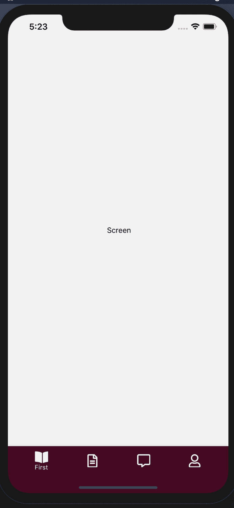
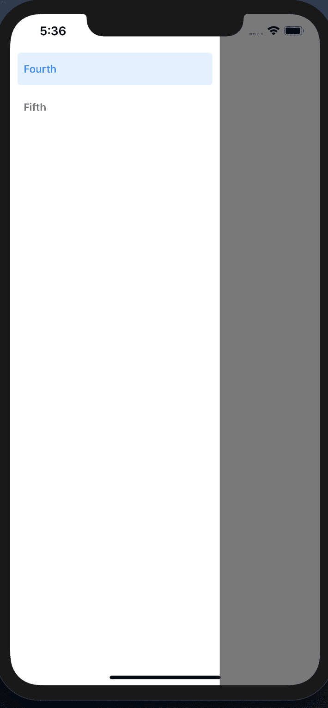
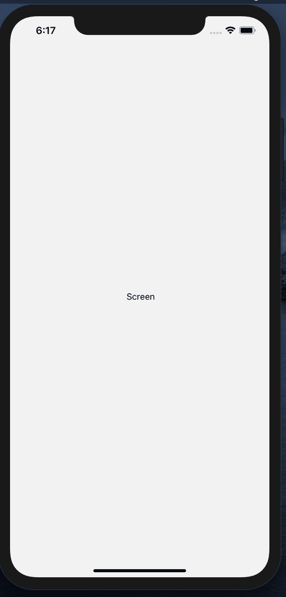
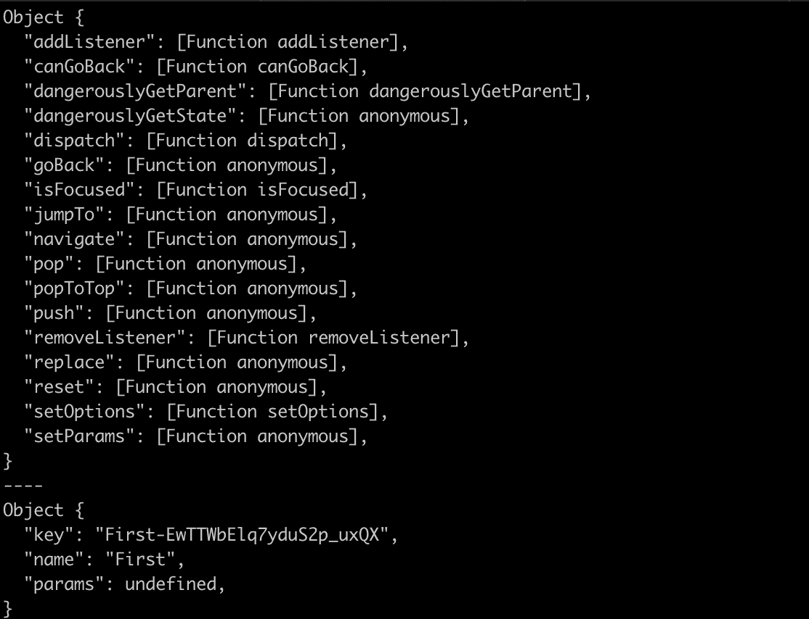

# 反应导航的完整指南 5 - LogRocket 博客

> 原文：<https://blog.logrocket.com/a-complete-guide-to-react-navigation-5/>

## 介绍

开发移动应用程序涉及许多移动部件。从样式、功能、认证和会话持久性到导航。本文的目标是用必要的技能和知识武装你，让你使用 React Navigation 5 在 React 原生应用中构建简单和复杂的导航系统。

React Navigation 是一个由组件组成的库，它使得在 React Native 中构建和连接屏幕变得很容易。了解移动应用程序中的导航是如何工作的，以及基于移动设备的导航和基于网络的导航之间存在哪些主要差异，这一点非常重要。

如果您以前设计和开发过网站，那么通过锚标签`<a>`可以在不同的网页之间以及同一网页内导航，锚标签由各种属性组成，允许开发人员操作网页中的导航。开发人员不必显式定义页面的行为，因为这可以由浏览器来处理。对于移动应用程序，导航需要在开发的早期阶段被明确地处理和定义。从定义导航类型到嵌套导航，移动应用程序中的导航需要更多的工作，有时可能相当复杂。

## React 导航中的导航类型

### 抽屉导航

这是由导航模式组成的，它要求你从左侧(有时是右侧)使用一个抽屉在屏幕间导航。通常，它由提供在屏幕之间移动的网关的链接组成。这类似于基于 web 的应用程序中的侧边栏。Twitter 是一个利用抽屉导航的流行应用程序。

### 标签导航

这是大多数移动应用程序中最常见的导航形式。可以通过基于选项卡的组件进行导航。它由底部和顶部选项卡组成。Instagram 是一个流行的应用程序，它使用基于标签的导航。您可以使用主页屏幕进行底部导航，使用个人资料屏幕进行顶部选项卡导航。

### 堆栈导航

屏幕之间的转换以堆栈的形式成为可能。各种屏幕相互堆叠，屏幕之间的移动包括用一个屏幕替换另一个屏幕。WhatsApp 聊天屏幕是一个利用堆栈导航的流行应用。

大多数时候，移动应用程序利用所有类型的导航器来构建应用程序的各种屏幕和功能。这被称为嵌套导航器。利用这一概念的一个流行应用是 Twitter。主屏幕包含一个抽屉导航类型，您可以通过它导航到其他屏幕。搜索选项卡包含一个顶部选项卡导航，允许您从直接消息(DMs)屏幕移动到基于所选 Tweet 的聊天。这是通过堆栈导航实现的。

本文介绍了如何一个接一个地创建这些导航。然后，我们将继续通过嵌套来组合它们。

### 先决条件

*   Nodejs LTS 版本或更高版本
*   博览会(安装在下方)
*   Mac 用户的守夜人

出于本教程的目的，我们将使用 Expo。Expo 使得使用 React Native 开发移动应用程序变得非常容易。还有很多其他好处，所以你应该在这里查看文档。

使用以下命令安装 Expo cli:

```
npm install expo-cli --global
```

我已经提供了一个 GitHub 库，其中包含了完成本教程所需的基本设置。我们将一起安装各种 React 导航包。在这里克隆仓库。

使用以下命令安装 React 导航:

```
npm install @react-navigation/native
```

使用 Expo 安装我们的依赖项:

```
expo install react-native-gesture-handler react-native-reanimated react-native-screens react-native-safe-area-context @react-native-community/masked-view
```

注意:您可以将依赖项安装到一个不基于 Expo 的项目中。因为我们在使用 Expo，所以需要使用 Expo 来安装这些依赖项。Expo 将确保安装的依赖项版本与我们应用程序的 React 本地版本兼容。对于非 Expo 应用中的安装，查看[文档](https://reactnavigation.org/docs/getting-started)。

让我们花一点时间来理解我们刚刚安装的包。我们安装了`react-native-gesture-handler`来提供本地驱动的手势管理 API，以便在 React Native 中构建最佳的基于触摸的体验。

我们还安装了`react-native-reanimated`来处理基于手势的动画，`react-native-screens`来提供本地导航容器组件，以及`react-native-safe-area-context`来为我们的组件提供安全区域或边界。

您可以跳过安装，从该过程的第一步开始。在里面，你会找到我们上面安装的所有东西。运行`npm` i 继续。

### 项目结构

首先，您将找到一个 App.js 文件。这是我们应用程序的入口。

您还将找到一个 babel.config.js 文件，其中包含 Expo Babel 配置。你不需要为此烦恼，因为世博会会自动处理这件事。

还将出现一个 app.json 文件，其中包含我们的应用程序在 IOS、Android 和其他 web 平台上的共享配置。在这里，您可以处理闪屏配置、方向、版本等。您应该查看本[指南](https://docs.expo.io/versions/latest/config/app/)以获取可用配置的详细列表。

在根目录中，创建一个名为 src 的新文件夹。

**mkdir src**

在内部，又创建了 3 个目录:`mkdir {components,screens,navigation}` 
组件目录将保存组件，屏幕将保存每个屏幕，导航目录将保存导航配置。

## 选项卡导航演示

在我们继续之前，让我们了解我们需要构建什么。

我们有 5 个不同导航类型的屏幕:堆栈，标签和抽屉。从表面上看，我们正在组合各种导航类型来创建应用程序。容纳第四和第五个屏幕的抽屉导航，第二个屏幕中组合的顶部和底部标签导航，第一个屏幕的共享底部导航，第三个屏幕的堆栈导航。

现在我们已经了解了我们需要做什么，让我们创建四个文件。三个用于保存我们拥有的三种导航类型，一个索引将作为我们导航的入口，将这三种导航结合在一起。

* * *

### 更多来自 LogRocket 的精彩文章:

* * *

我们的三个文件:

**CD src/navigation** touch { index，appStackNavigator，appTabNavigator，appDrawerNavigator}。js
**CD—**

React Navigation 5 中的导航是通过将导航容器中的导航屏幕配置映射到应用程序的特定屏幕来实现的。为了成功地创建导航，我们必须有连接它们的屏幕。

运行以下命令:

```
cd src/screens
```

```
touch {FirstScreen,SecondScreen,ThirdScreen,FourthScreen,FifthScreen}.js
```

导航到每个屏幕，粘贴下面的代码。

确保根据文件名定义和导出正确的屏幕:

```
import React from 'react'
import { View, Text } from 'react-native'

const FirstScreen = ({navigation, route}) => {
    return (
        <View>
            <Text>{} Screen</Text>
        </View>
    )
}

export default FirstScreen
```

让我们将`react-native-elements`包用于样式和图标。

```
npm install react-native-elements
```

让我们继续将选项卡导航映射到选项卡屏幕。安装选项卡导航所需的依赖项:

```
npm install @react-navigation/material-bottom-tabs react-native-paper @react-navigation/material-top-tabs react-native-tab-view
```

接下来，您会发现已经安装了这些包。运行`npm i`。

我们将同时使用顶部和底部导航器。将它们与第一个和第二个屏幕一起导入到`appTabNavigator.js`文件中。我们还需要底部标签的图标。我们从随 Expo 预装的`react-native-vector-icons`导入吧。我们的底部选项卡导航也使用图标。让我们也从`react-native-vector-icons`导入图标。

```
import React from "react";
import { createMaterialTopTabNavigator } from "@react-navigation/material-top-tabs";
import
 { createMaterialBottomTabNavigator } from "@react-navigation/material-bottom-tabs";
import Icon from "react-native-vector-icons/FontAwesome5";

import FirstScreen from "../screens/FirstScreen";
import SecondScreen from "../screens/SecondScreen";
```

创建一个`materialtoptabnavigator`和`materialbottomtabnavigator`的实例。

```
const AppBottomNavigator = createMaterialBottomTabNavigator();
const AppTopNavigator = createMaterialTopTabNavigator();
```

第二个屏幕包含顶部的选项卡导航器，让我们来处理它。

```
const SecondScreenTopTabNavigator = () => (
  <AppTopNavigator.Navigator
    initialRouteName="CHATS"
    tabBarOptions={{
      style: { backgroundColor: "#490222" },
      labelStyle: { fontSize: 14, fontWeight: "bold" },
      activeTintColor: "#ffffff",
      indicatorStyle: { height: 3, backgroundColor: "#fff", paddingBottom: 6 },
      inactiveTintColor: "#adadad",
      tabStyle: { height: 100, justifyContent: "flex-end" }
    }}
  >
    <AppTopNavigator.Screen component={SecondScreen} name="CHATS" />
    <AppTopNavigator.Screen component={SecondScreen} name="REQUESTS" />
  </AppTopNavigator.Navigator>
);
```

每个导航都是隐式返回的 React 组件。各种样式和配置可以应用于组件。我们将上面定义的选项卡导航实例提供给我们的屏幕包装在一个 navigator 组件中，并使用`tabBarOptions`道具定义样式。导航器包装器具有各种用于样式化和配置导航的配置。

在这里，我们将背景设置为 UI 的颜色，并更改了每个选项卡的活动和非活动状态。请参考每种导航类型的文档，以查看可用于配置的选项列表。`initialRouteName`道具是导航组件用来识别我们想要导航到的特定屏幕的东西。这对于所有屏幕都必须是唯一的。

顶部选项卡 navigator 的实例也为我们提供了一个屏幕组件，它将我们定义的屏幕连接到导航包装器。它可以使用各种道具，其中之一是持有屏幕的组件，以及作为每个屏幕的唯一标识符的名称。有关其他配置选项，请参考文档。

让我们继续创建底部导航。回想一下，我们之前为底部导航创建了一个实例。底部的导航器会有所不同，因为它有图标。

```
const AllScreenTabNavigator = () => (
  <AppBottomNavigator.Navigator
    initialRouteName="First"
    screenOptions={{
      tabBarColor: "#490222"
    }}
  >
    <AppBottomNavigator.Screen
      name="First"
      component={FirstScreen}
      options={{
        tabBarIcon: () => <Icon name="book-open" size={25} color="#fff" />
      }}
    />
    <AppBottomNavigator.Screen
      name="First Two"
      component={FirstScreen}
      options={{
        tabBarIcon: () => <Icon name="file-alt" size={25} color="#fff" />
      }}
    />
    <AppBottomNavigator.Screen
      name="Second"
      children={SecondScreenTopTabNavigator}
      options={{
        tabBarIcon: () => <Icon name="comment-alt" size={25} color="#fff" />
      }}
    />
    <AppBottomNavigator.Screen
      name="Second Two"
      children={SecondScreenTopTabNavigator}
      options={{
        tabBarIcon: () => <Icon name="user" size={25} color="#fff" />
      }}
    />
  </AppBottomNavigator.Navigator>
);

export { AllScreenTabNavigator };
```

我们已经成功完成了选项卡导航。我们通过选项道具使用图标，并通过子道具连接第二个屏幕的顶部选项卡导航器。我们使用子属性而不是组件属性，因为第二个屏幕也包含导航组件，并且是底部导航器的子元素。

转到 index.js 并粘贴它来查看我们现在拥有的工作演示。我们将重新查看该文件，以了解稍后会发生什么:

```
import React from "react";
import { NavigationContainer } from "@react-navigation/native";
import { AllScreenTabNavigator } from "./appTabNavigator";

const RootNavigator = () => (
  <NavigationContainer>
    <AllScreenTabNavigator />
  </NavigationContainer>
);
export default RootNavigator;
```

此外，用以下代码替换 App.js 文件中的代码:

```
import "react-native-gesture-handler";
import React from "react";
import { StyleSheet } from "react-native";
import RootNavigator from "./src/navigation/index";

export default function App() {
  return (
    <>
      <RootNavigator />
    </>
  );
}

const styles = StyleSheet.create({
  container: {
    flex: 1,
    backgroundColor: "#fff",
    alignItems: "center",
    justifyContent: "center"
  }
});
```

现在，一旦您使用 Expo start 运行您的项目，您应该能够看到这一点:



转到 tab-navigation 分支，查看完整的代码。

## 抽屉导航演示

安装抽屉导航包:

```
npm install @react-navigation/drawer
```

导入所需的包并创建抽屉导航器的实例:

```
import React from 'react';
import { createDrawerNavigator } from '@react-navigation/drawer';
import FourthScreen from '../screens/FourthScreen'
import FifthScreen from '../screens/FifthScreen'

const Drawer = createDrawerNavigator();
```

我们将选项卡导航器定义为 React 组件的方式与我们创建抽屉导航器的方式相同:

```
const AllDrawerNavigation = () => (
    <Drawer.Navigator initialRouteName='Fourth'>
        <Drawer.Screen component={FourthScreen} name='Fourth' />
        <Drawer.Screen component={FifthScreen} name='Fifth' />
    </Drawer.Navigator>
)

export default AllDrawerNavigation;
```

导出它。

将它导入到 navigation/index.js 文件中，并将`AllScreenTabNavigator`替换为`AllDrawerNavigation`以查看它的运行情况。



检查抽屉导航分支，查看完整的代码。

## 堆栈导航演示

最后一个屏幕是堆栈导航器。

安装所需的软件包:

```
npm install @react-navigation/stack
```

导入所需的依赖项，并创建堆栈导航器的实例:

```
import React from 'react'
import { createStackNavigator } from "@react-navigation/stack";

import ThirdScreen from '../screens/ThirdScreen'

const StackNavigator = createStackNavigator();
```

通过上面创建的 StackNavigator 实例连接第三个屏幕，并将其导出:

```
const ThirdScreenNavigation = () => (
  <StackNavigator.Navigator
    initialRouteName="Third"
    screenOptions={{
      header: () => null
    }}
  >
    <StackNavigator.Screen component={ThirdScreen} name="Third" />
  </StackNavigator.Navigator>
);

export default ThirdScreenNavigation;
```

用导出的`ThirdScreenNavigation`替换 index.js 中的`AllDrawerNavigation`,查看它的运行情况。

检查堆栈导航分支，看看它是如何工作的。



### 组合导航(嵌套)

现在让我们结合所有的导航器。这将在 index.js 文件中完成。在继续之前，让我们对屏幕进行一些重大改进，将它们之间的共享 ui 导出到一个名为 Layout.js 的单独组件中。

在组件目录中，创建一个 Layout.js 文件:

```
import React from "react";
import { View, Text } from "react-native";

const Layout = props => {
  const { name = "" } = props;
  return (
    <View
      style={{
        justifyContent: "center",
        alignItems: "center",
        flex: 1
      }}
    >
      <Text>{name} Screen</Text>
    </View>
  );
};

export default Layout;
```

我们将屏幕之间的共享 UI 移到了一个单独的文件中。布局组件应该有一个名称属性。我们从 props 中析构并传递一个默认值给它，以防没有名字传递给它。

用以下代码替换屏幕中您的退货声明中的所有代码:

```
<>
      <Layout />
 </>
```

现在让我们结合我们所有的导航器。

检查预组合导航分支，从这里跟进。

导入以前在 React 中创建的所有导航。此外，导入将包装整个应用程序的导航容器。这个导航容器包装了以前创建的整个导航，并充当应用程序的入口:

```
import React from "react";
import { NavigationContainer } from "@react-navigation/native";
import { AllScreenTabNavigator } from "./appTabNavigator";
import AllDrawerNavigation from "./appDrawerNavigator";
import ThirdScreenNavigation from "./appStackNavigator";
```

我们来思考一下 app 是如何架构的。第一和第二屏幕是选项卡导航类型，包含第三屏幕的堆栈导航类型的条目。

该屏幕还提供了进入第四和第五屏幕的入口，这是抽屉导航类型。从外观上看，很明显，所有 5 个屏幕都由一个共同的导航类型连接在一起:堆栈导航。

从标签到堆栈导航再到抽屉导航，需要用一种导航类型替换另一种导航类型。因此，整个应用程序将通过导航容器包装的堆栈导航连接起来。

导入`createStackNavigation`并粘贴下面的代码:

```
const AllAppNavigation = createStackNavigator();

const RootNavigator = () => (
  <NavigationContainer>
    <AllAppNavigation.Navigator
      initialRouteName="tab"
      screenOptions={{
        header: () => null
      }}
    >
      <AllAppNavigation.Screen name="tab" children={AllScreenTabNavigator} />
      <AllAppNavigation.Screen name="stack" children={ThirdScreenNavigation} />
      <AllAppNavigation.Screen name="drawer" children={AllDrawerNavigation} />
    </AllAppNavigation.Navigator>
  </NavigationContainer>
);
export default RootNavigator;
```

转到 App.js 文件，将其中的代码替换为:

```
import "react-native-gesture-handler";
import React from "react";
import { StyleSheet } from "react-native";
import RootNavigator from "./src/navigation/index";

export default function App() {
  return (
    <>
      <RootNavigator />
    </>
  );
}
```

我们已经命名了每个导航组件，并分别创建了选项卡、堆栈和抽屉组件，以便在需要时能够导航到每个组件。可以使用不同的标签来表示导航子节点，但是为了方便起见，我们使用这些标签。立即查看应用程序。一切都是相互联系和起作用的。

### 在屏幕间导航

在第一个屏幕中，记录从导航包装器传递给我们的导航和路由对象。

navigation 对象有方法和事件使屏幕之间的转换成为可能，而 route 对象包含关于我们的屏幕和屏幕之间共享状态的信息(如果有的话)(params)。



将 route 对象上的`route.name`键传递给布局组件。导航道具将用于移动到其他屏幕。如果您记录这两个对象，您将会看到以下内容。我们不会涵盖所有这些，但我们会涵盖一些我们需要在不同屏幕之间移动。

navigate 方法用于移动到另一个屏幕。

`goBack`方法用于移至上一个屏幕。

push 方法的工作方式与 navigate 类似。

`setParams`用于向其他屏幕传递参数。一个例子是传递一篇文章的`id`以在评论屏幕上获得该文章的评论。

路线上的名称值是赋予屏幕的名称。

在屏幕之间传递的参数可以在 route 对象上获得。

让我们在第一个屏幕中添加一个按钮，移动到第三个屏幕，在文件的顶部，添加:

```
import { Button } from "react-native-elements";
```

在布局组件下，添加:

```
<Button
        type="solid"
        title="Third Screen"
        containerStyle={{
          justifyContent: "center",
          alignItems: "center",
          height: 200
        }}
        buttonStyle={{
          borderColor: "#490222",
          backgroundColor: "#490222",
          width: 160,
          borderWidth: 1.3
        }}
        titleStyle={{
          color: "#fff"
        }}
        onPress={() => navigation.navigate("stack")}
      />
```

当将我们的屏幕组合到导航对象上的 navigate 方法时，我们将赋予第三个屏幕的标签传递给它。

在第三个屏幕中，让我们添加一个按钮来移动到第四个屏幕。重复上面的步骤，但是将按钮的标题改为第四个屏幕，并将抽屉作为参数传递给 navigate 方法。

## 结论

我们已经成功地介绍了在 React Native 中创建屏幕和在屏幕之间导航。本指南为您提供了为项目构建简单和复杂导航所需的大部分知识和工具。记住，定义和构建导航应该是你首先要做的事情。

你有什么问题吗？你有什么想让我说的吗？欢迎发表评论。

## [LogRocket](https://lp.logrocket.com/blg/react-signup-general) :全面了解您的生产 React 应用

调试 React 应用程序可能很困难，尤其是当用户遇到难以重现的问题时。如果您对监视和跟踪 Redux 状态、自动显示 JavaScript 错误以及跟踪缓慢的网络请求和组件加载时间感兴趣，

[try LogRocket](https://lp.logrocket.com/blg/react-signup-general)

.

[ ](https://lp.logrocket.com/blg/react-signup-general) [](https://lp.logrocket.com/blg/react-signup-general) 

LogRocket 结合了会话回放、产品分析和错误跟踪，使软件团队能够创建理想的 web 和移动产品体验。这对你来说意味着什么？

LogRocket 不是猜测错误发生的原因，也不是要求用户提供截图和日志转储，而是让您回放问题，就像它们发生在您自己的浏览器中一样，以快速了解哪里出错了。

不再有嘈杂的警报。智能错误跟踪允许您对问题进行分类，然后从中学习。获得有影响的用户问题的通知，而不是误报。警报越少，有用的信号越多。

LogRocket Redux 中间件包为您的用户会话增加了一层额外的可见性。LogRocket 记录 Redux 存储中的所有操作和状态。

现代化您调试 React 应用的方式— [开始免费监控](https://lp.logrocket.com/blg/react-signup-general)。