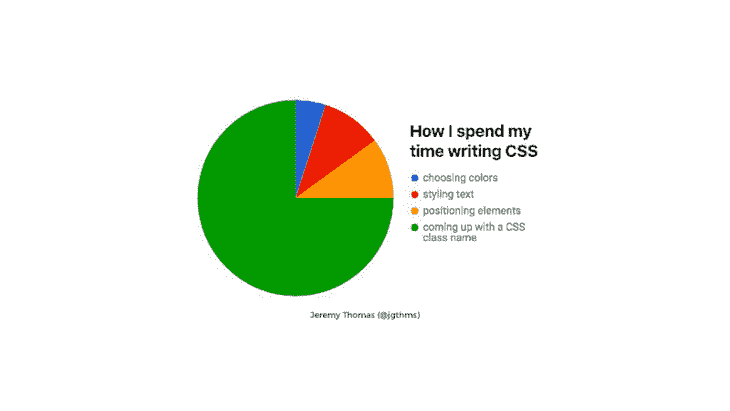
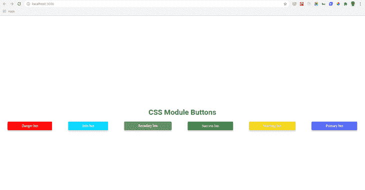

# 深入 CSS 模块

> 原文：<https://blog.logrocket.com/a-deep-dive-into-css-modules/>

## 介绍

根据[官方 CSS 模块 GitHub 库](https://github.com/css-modules/css-modules)的定义，CSS 模块是一个 CSS 文件，默认情况下所有的类名和动画名都在本地作用域。相比之下，在典型的 CSS 文件中，所有的 CSS 选择器都位于全局范围内。

在本教程中，我们将研究编写 CSS 时经常出现的一些常见问题，并了解 CSS 模块如何帮助我们避免这些问题。然后，我们将 CSS 模块集成到 React 应用程序中。

我们开始吧！

## 先决条件

*   HTML 和 CSS 知识
*   React 的工作知识

熟悉 CSS 模块是一个额外的奖励！

## 了解常见的 CSS 问题

CSS 中的所有选择器都是全局变量。随着应用程序的扩展，处理全局变量和管理依赖关系变得越来越困难。当几个开发者一起开发这个应用时，事情变得更加棘手。

原因如下:

### 名称冲突

假设在设计博客时，我们添加了类名`post`来表示主页上的帖子。另一个开发人员创建了侧边栏，并为侧边栏上的帖子添加了类名`post`。像这样的错误会导致名称冲突，如下所示:

```
/* styles */
.main .post {
  color: #000000;
  font-size: 2rem;
}

.sidebar .post {
  color: #FFFFFF;
  font-size: 1rem;
}

```

作为 一个 应用 s cales ， 你更容易遇到 n ame 碰撞 ( 潜在的 危害性表现。

### 清除死代码的困难

当从我们的代码中删除一个元素或一个 React 组件时，我们也需要删除它的样式。然而，在大型应用程序中，很难确定一个类是否在使用中。CSS 没有提供现成的解决方案。

### 依赖性管理

当处理全局变量时，没有明确定义依赖关系，这使得很难确定哪些样式将通过[合成](https://github.com/css-modules/css-modules#composition)来继承或应用。

CSS 中还有其他隐含的依赖关系，仅仅通过扫描代码是不容易识别的。例如，带有`position: absolute`的元素与其带有`position: relative`的父元素相关。

依赖关系是一个很大的问题，维护 CSS 代码的容易程度很大程度上取决于依赖关系的结构。

## 评估解决方案

BEM-Block Element 修饰符是 HTML 和 CSS 中一种流行的类命名约定，旨在帮助开发人员理解两种语言之间的关系。BEM 通过提供严格的命名规则解决了上述问题。

在 BEM 中，`Block`是一个独立的元素，它本身就有意义；往往是类似`.btn{}`的父元素。一个`Element`是指一个`Block`的子元素；它没有独立的含义，由跟在`Block`(例如`.btn__text`)名称后面的两个下划线表示。

修改器是`Block`或`Element`上的一个标志，用于设置样式。它由`Block`或`Element`(如`.btn--primary {}`)名称的两个连字符表示。

```
// Block Element
.btn {}

// Element that depends on the Block often a child element
.btn__text {
  // rules
}

// Modifiers that changes the styles of the block
.btn--primary {}
.btn--small {}

```

BEM 命名方法的好处是，尽管所有的选择器都是全局的，但它们都被修饰符限定了作用域。然而，手动添加 BEM 命名是重复的、相当乏味的，并且容易出现人为错误。

你可能最终会花费大量的时间来判断某样东西是`Block`还是`Element`。在我看来，[布尔玛 CSS](https://bulma.io/) 的创作者，[杰瑞米·托马斯](https://twitter.com/jgthms)完美地总结了这个问题:



开发包括自动化困难的问题，所以我们应该能够用正确的工具轻松地自动化命名。

> 注意:虽然 CSS 模块使我们能够确定样式的范围，但是我们仍然可以通过在类名前面加上`:global:`来声明全局类

```
:global .title {
font-size: 2rem;
}
```

## CSS 模块的优势

大多数现代的 JavaScript 和 CSS 工作流已经趋向于基于组件的架构，但是 CSS 的发展一直是纯传统的，并没有得到该语言的实际支持。

如前所述，边界元法是一个完美的例子。众所周知的软件工程基本定理宣称“计算机科学中的每个问题都可以通过一个额外的抽象层来解决”。

CSS 模块是一个抽象的薄层，它封装了引入到语言中的新概念。因此，CSS 模块就像普通 CSS 一样编写，如下面的代码片段所示:

```
/* styles.css */
.title {
  font-size: 2rem;
  font-weight: bold;
  color: red;
}
.text {
  font-size: 1.2rem;
  font-weight: 500;
  color: blue;
}

```

一个不同之处是，在 CSS 模块中，我们所有的标记都是在一个类似`index.js`的 JavaScript 文件中编写的:

```
import styles from "./styles.css";
document.getElementById("app").innerHTML = `
<h1 class=${styles.title}>Hello Vanilla!</h1>
<div class=${styles.text}>
  We use the same configuration as Parcel to bundle this sandbox, you can find more
  info about Parcel 
</div>
`;

```

当我们从`index.js`文件导入 CSS 模块时，CSS 模块导出一个对象，该对象具有从本地名称到全局名称的映射:

```
{
  title: "_src_styles__title",
  text: "_src_styles__text"
}

```

我们可以看到 CSS 模块动态生成唯一的类名，为我们整个团队自动命名。

## CSS 模块如何工作

像 webpack、Browsify 和 JSPM 这样的现代工具使我们能够明确定义跨语言依赖。因此，我们可以明确地描述每个文件的依赖关系，而不管源文件的类型。

在下面的代码片段中，每当加载或捆绑`MyComponent`时，相应的 CSS 就像任何其他依赖项一样被加载:

```
import './my-component-name.css';
const MyComponent = () => {
  // component codes
}
export default MyComponent;

```

CSS 模块包含了这项新技术，这是现代装载机的关键功能。然而，在基本层面上，需要一个新的规范来描述这些符号是如何被共享的。

### 了解 ICSS

虽然 CSS 模块编写得像普通的 CSS，但它实际上编译成一种低级的可互换格式，称为 ICSS [(I](https://github.com/css-modules/icss) [不可操作的 CSS](https://github.com/css-modules/icss) [)](https://github.com/css-modules/icss) ，它是为加载器实现者而不是最终用户设计的。它是标准 CSS 的超集，是增强 CSS 的低级文件格式。

你可以将 CSS 模块整合到一个[广泛的应用程序](https://github.com/css-modules/css-modules/blob/master/docs/get-started.md#setting-up-css-modules)中，但是，我们将设计一个 React 应用程序。

## 用 CSS 模块设计 React 应用程序的样式

[创建 React App v2](https://github.com/facebook/create-react-app) (及更高版本)支持开箱即用的 CSS 模块。我们所要做的就是使用以下命名约定:

```
[name].module.css

```

让我们通过构建一个简单的 React 应用程序来看看它的实际应用吧！首先，让我们引导并运行我们的应用程序:

```
npx create-react-app button-stack
cd botton-stack
npm start

```

接下来，我们将通过简单地将`App.css`文件重命名为`App.module.css`来为我们的应用程序添加 CSS 模块支持。更新`App.js`文件中的导入语句以避免错误:

```
.shadow {
  box-shadow: rgba(50, 50, 50, 0.2) 0 5px 5px 0;
}
.app {
  display: flex;
  justify-content: space-around;
}
.title {
  margin-top: 25%;
  text-align: center;
}

```

将`Index.css`文件更新为`Index.module.css`，以及`Index.js`文件中的导入语句。接下来，在我们的`App.js`文件中，添加以下代码:

```
import { title, app } from './App.module.css';
import Button from './components/Button';
function App() {
    return (
        <div>
            <h1 className={title}>CSS Module Buttons</h1>
            <article className={app}>
                <Button />
            </article>
        </div>
    );
}
export default App;

```

虽然大部分代码应该是熟悉的，但有几件事我们需要注意。首先，我们正在析构`title`和`app`。我们需要的样式来自于由 CSS 模块导出的`styles`对象。

现在，我们需要创建`Button component`。在`src`目录下，创建一个`components`文件夹。在文件夹内，创建一个`Button.js`和一个`Button.module.css`文件；在`Button.module.css`文件中添加以下代码:

```
.normal-button {
    display: inline-flex;
    line-height: 2;
    text-align: center;
    padding: 1px 60px;
    font-family: "IBM Plex Sans";
    font-size: 1rem;
    font-weight: 500;
    border-radius: 4px;
    cursor: pointer;
    composes: shadow from "../App.module.css"
  }

  .danger {
    composes: normal-button;
    background-color: rgb(255, 8, 8);
    border: 2px solid rgb(255, 8, 8);
    color: white;
  }

  .secondary {
    composes: normal-button;
    background-color: rgb(128, 118, 118);
    border: 2px solid rgb(128, 118, 118);
    color: white;
  }

  .info {
    composes: normal-button;
    background-color: rgb(6, 218, 255);
    border: 2px solid rgb(6, 218, 255);
    color: white;
  }

  .warning {
    composes: normal-button;
    background-color: rgb(248, 202, 49);
    border: 2px solid rgb(248, 202, 49);
    color: #ffffff;
  }

  .success {
    composes: normal-button;
    background-color: rgba(30, 156, 41, 0.966);
    border: 2px solid rgba(30, 156, 41, 0.966);
    color: white;
  }

  .primary {
    composes: normal-button;
    background-color: rgba(33, 124, 243, 0.849);
    border: 2px solid rgba(33, 124, 243, 0.849);
    color: #FFFFFF;
  }

```

在这个文件中，我们有一个普通的按钮类`.normal-button`，它由`App.module.css`组成`shadow class`。

组合是 CSS 模块中的一个特性，它使我们能够组合选择器。因此，我们可以通过从另一个类继承样式来构建一个类，但是这些`composes`规则必须在其他规则之前。

例如，`.danger`、`.info`、`.primary`、`.warning`、`.success`类都是通过 composition 从`.normal-botton`继承样式。

我们的`App.js`文件现在应该看起来像下面的代码:

```
import { title, app } from './App.module.css';
import Button from './components/Button';
function App() {
    return (
        <div>
            <h1 className={title}>CSS Module Buttons</h1>
            <article className={app}>
                <Button />
            </article>
        </div>
    );
}
export default App;

```

我们的应用程序显示应该如下图所示:



可以查看[完整代码](https://github.com/lawrenceagles/css-module-demo)进行教程。

## 结论

毫无疑问，CSS 模块为 CSS 语言提供了多年来最重要的改进之一！CSS 模块最大的好处之一就是我们可以编写优秀的老 CSS，并且可以集成到各种应用程序中。它只是给 CSS 增加了更多的功能！

如果您的 React 应用程序不使用 Create React 应用程序，或者它使用低于版本 2 的版本，您仍然可以通过使用`[babel-plugin-react-css-module](https://github.com/gajus/babel-plugin-react-css-modules)`添加对 CSS 模块的支持。

## 你的前端是否占用了用户的 CPU？

随着 web 前端变得越来越复杂，资源贪婪的特性对浏览器的要求越来越高。如果您对监控和跟踪生产环境中所有用户的客户端 CPU 使用情况、内存使用情况等感兴趣，

[try LogRocket](https://lp.logrocket.com/blg/css-signup)

.

[](https://lp.logrocket.com/blg/css-signup)[https://logrocket.com/signup/](https://lp.logrocket.com/blg/css-signup)

LogRocket 就像是网络和移动应用的 DVR，记录你的网络应用或网站上发生的一切。您可以汇总和报告关键的前端性能指标，重放用户会话和应用程序状态，记录网络请求，并自动显示所有错误，而不是猜测问题发生的原因。

现代化您调试 web 和移动应用的方式— [开始免费监控](https://lp.logrocket.com/blg/css-signup)。