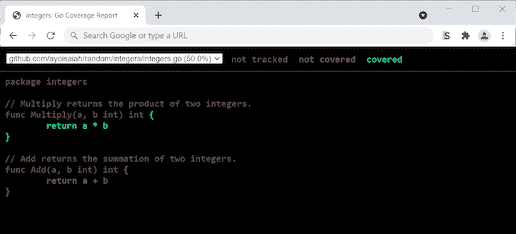

# Go - LogRocket 博客中对单元测试的深入探讨

> 原文：<https://blog.logrocket.com/a-deep-dive-into-unit-testing-in-go/>

在单元测试中，开发人员测试单个的功能、方法、模块和包来验证它们的正确性。单元测试有助于在开发周期的早期找到并修复 bug，并防止重构时出现倒退。一个好的单元测试也可以作为项目新手开发人员的一种文档形式。

在本教程中，我们将介绍如何使用内置测试包和几个外部工具在 [Go](https://blog.logrocket.com/error-handling-in-golang/) 中编写单元测试。到本文结束时，您将理解诸如表驱动测试、依赖注入和代码覆盖率等概念。

我们开始吧！

## 在 Go 中编写您的第一个测试

为了理解 Go 中的测试，我们将编写一个计算两个整数乘积的基本程序。然后，我们将编写一个测试来验证其输出的正确性。

首先，在文件系统上创建一个目录，并导航到该目录。在根目录中，创建一个名为`integers.go`的文件，并添加以下代码:

```
// integers.go
package main

import (
    "fmt"
)

// Multiply returns the product of two integers
func Multiply(a, b int) int {
    return a * b
}

```

让我们编写一个测试来验证`Multiply()`函数是否正常工作。在当前目录中，创建一个名为`integers_test.go`的文件，并向其中添加以下代码:

```
// integers_test.go
package main

import "testing"

func TestMultiply(t *testing.T) {
    got := Multiply(2, 3)
    want := 6

    if want != got {
        t.Errorf("Expected '%d', but got '%d'", want, got)
    }
}

```

## 围棋测试剖析

在 Go 中命名测试文件的惯例是以后缀`_test.go`结束文件名，并将文件放在与它测试的代码相同的目录中。在上面的例子中，`Multiply`函数在`integers.go`中，所以它的测试放在`integers_test.go`中。

请注意，Go 不会在它生成的任何二进制文件中发布测试文件，因为代码运行不需要它们。在 Go 中，测试函数必须始终使用以下签名:

```
func TestXxx(*testing.T) 

```

测试名称以前缀`Test`开头，后面是被测试函数的名称`Xxx`。它接受一个参数，这是一个类型为`testing.T`的指针。该类型为报告错误、记录中间值和指定帮助器方法等任务导出了几种方法。

在我们上一节的例子中，`TestMultiply()`函数中的`got`变量被赋给了`Multiply(2, 3)`函数调用的结果。`want`被分配到预期结果`6`。

测试的后半部分检查`want`和`got`的值是否相等。如果没有，调用`Errorf()`方法，测试失败。

## 运行 Go 测试

现在，让我们使用`go test`命令在终端中运行我们的测试。只要安装了 Go，`go test`命令就已经在你的机器上可用了。

`go test`命令编译当前目录中的源代码、文件和测试，然后运行生成的测试二进制文件。当测试完成时，测试的摘要，或者是`PASS`或者是`FAIL`，将被打印到控制台，如下面的代码块所示:

```
$ go test
PASS
ok      github.com/ayoisaiah/random 0.003s

```

当您像上面一样使用`go test`时，缓存被禁用，所以每次都执行测试。

您还可以通过使用`go test .`选择进入包列表模式，这将缓存成功的测试结果并避免不必要的重新运行。

您可以通过传递包的相对路径来运行特定包中的测试，例如，`go test ./package-name`。此外，您可以使用`go test ./...`来运行代码库中所有包的测试:

```
$ go test .
ok      github.com/ayoisaiah/random (cached)

```

如果您将`-v`标记附加到`go test`上，测试将会打印出所有被执行的测试函数的名称以及它们执行所花费的时间。此外，测试显示打印到错误日志的输出，例如，当您使用`t.Log()`或`t.Logf()`时:

```
$ go test -v
=== RUN   TestMultiply
--- PASS: TestMultiply (0.00s)
PASS
ok      github.com/ayoisaiah/random 0.002s

```

让我们通过将`want`改为`7`来使我们的测试失败。再次运行`go test`，检查其输出:

```
$ go test -v
--- FAIL: TestMultiply (0.00s)
    integers_test.go:10: Expected '7', but got '6'
FAIL
exit status 1
FAIL    github.com/ayoisaiah/random 0.003s

```

如您所见，测试失败了，传递给`t.Errorf()`函数的消息出现在失败消息中。如果您将`want`值返回到`6`，测试将再次通过。

## Go 中的表格驱动测试

上面的测试示例只包含一个案例。然而，任何合理全面的测试都有多个测试用例，确保每个代码单元都根据一定范围的值进行了充分的审计。

在 Go 中，我们使用表驱动测试，它允许我们在一个切片中定义所有的测试用例，迭代它们，并执行比较来确定测试用例是成功还是失败:

```
type testCase struct {
    arg1 int
    arg2 int
    want int
}

func TestMultiply(t *testing.T) {
    cases := []testCase{
        {2, 3, 6},
        {10, 5, 50},
        {-8, -3, 24},
        {0, 9, 0},
        {-7, 6, -42},
    }

    for _, tc := range cases {
        got := Multiply(tc.arg1, tc.arg2)
        if tc.want != got {
            t.Errorf("Expected '%d', but got '%d'", tc.want, got)
        }
    }
}

```

在上面的代码片段中，我们使用了`testCase`结构来定义每个测试用例的输入。`arg1`和`arg2`属性表示`Multiply`的参数，而`want`是测试用例的预期结果。

`cases`切片用于设置`Multiply`函数的所有测试用例。注意，为了简单起见，省略了属性名。

为了测试每个案例，我们需要迭代`cases`切片，将每个案例的`arg1`和`arg2`传递给`Multiply()`，然后确认返回值是否等于`want`指定的值。使用这种设置，我们可以根据需要测试任意多的案例。

如果您再次运行测试，它将成功通过:

```
$ go test -v
=== RUN   TestMultiply
--- PASS: TestMultiply (0.00s)
PASS
ok      github.com/ayoisaiah/random     0.002s

```

## 信号测试失败

在上面的例子中，我们使用了`t.Errorf()`方法来使测试失败。使用`t.Errorf()`相当于调用`t.Logf()`，它会在测试失败时或者在提供了`-v`标志时将文本记录到控制台，然后调用`t.Fail()`，它会将当前函数标记为失败，而不会停止其执行。

当我们暂停函数时，使用`t.Errorf()`可以防止测试失败，允许我们收集更多的信息来修复问题。此外，在表驱动测试中，`t.Errorf()`允许我们在不影响其他测试执行的情况下，使一个特定的案例失败。

* * *

### 更多来自 LogRocket 的精彩文章:

* * *

如果测试功能不能从故障中恢复，您可以通过调用`t.Fatal()`或`t.Fatalf()`立即停止它。这两种方法都将当前函数标记为失败，立即停止执行。这些方法相当于先叫`t.Log()`或`t.Logf()`，后叫`t.FailNow()`。

## 使用子测试

使用表驱动测试是有效的，但是，有一个主要的缺陷——不能有选择地运行一个单独的测试用例而不运行所有的测试用例。

这个问题的一个解决方案是注释掉所有此刻不相关的测试用例，稍后再取消注释。然而，这样做既繁琐又容易出错。在这个场景中，我们将使用子测试！

在 Go 1.7 中，我们可以通过向`testing.T`类型添加一个`Run()`方法，将每个测试用例分割成一个在单独的 goroutine 中运行的唯一测试。`Run()`方法将子测试的名称作为第一个参数，将子测试函数作为第二个参数。您可以使用测试名称来识别和单独运行子测试。

为了查看它的运行情况，让我们更新我们的`TestMultiply`测试，如下所示:

```
func TestMultiply(t *testing.T) {
    cases := []testCase{
        {2, 3, 6},
        {10, 5, 50},
        {-8, -3, 24},
        {0, 9, 0},
        {-7, 6, -42},
    }

    for _, tc := range cases {
        t.Run(fmt.Sprintf("%d*%d=%d", tc.arg1, tc.arg2, tc.want), func(t *testing.T) {
            got := Multiply(tc.arg1, tc.arg2)
            if tc.want != got {
                t.Errorf("Expected '%d', but got '%d'", tc.want, got)
            }
        })
    }
}

```

现在，当您运行带有`-v`标志的测试时，每个单独的测试用例都将在输出中报告。因为我们从每个测试用例中的值构造了每个测试的名称，所以很容易识别失败的特定测试用例。

为了命名我们的测试用例，我们将向`testCase`结构添加一个`name`属性。值得注意的是，`TestMultiply`函数直到它的所有子测试都退出后才结束运行:

```
$ go test -v
=== RUN   TestMultiply
=== RUN   TestMultiply/2*3=6
=== RUN   TestMultiply/10*5=50
=== RUN   TestMultiply/-8*-3=24
=== RUN   TestMultiply/0*9=0
=== RUN   TestMultiply/-7*6=-42
--- PASS: TestMultiply (0.00s)
    --- PASS: TestMultiply/2*3=6 (0.00s)
    --- PASS: TestMultiply/10*5=50 (0.00s)
    --- PASS: TestMultiply/-8*-3=24 (0.00s)
    --- PASS: TestMultiply/0*9=0 (0.00s)
    --- PASS: TestMultiply/-7*6=-42 (0.00s)
PASS
ok      github.com/ayoisaiah/random 0.003s

```

## 测量代码覆盖率

代码覆盖率统计测试套件运行时成功执行的代码行数，表示测试套件覆盖的代码的百分比。例如，如果您有 80%的代码覆盖率，这意味着 20%的代码库缺少测试。

### Go 内置的代码覆盖方法

Go 提供了一个检查代码覆盖率的内置方法。从 Go v1.2 开始，开发人员可以使用`-cover`选项和`go test`来生成代码覆盖报告:

```
$ go test -cover
PASS
coverage: 100.0% of statements
ok      github.com/ayoisaiah/random 0.002s

```

我们已经成功实现了代码 100%的测试覆盖率，但是，我们只全面测试了一个功能。让我们在`integers.go`文件中添加一个新函数，而不为它编写测试:

```
// integers.go

// Add returns the summation of two integers
func Add(a, b int) int {
  return a + b
}
```

当我们使用`-cover`选项再次运行测试时，我们将看到覆盖率仅为 50 %:

```
$ go test -cover
PASS
coverage: 50.0% of statements
ok      github.com/ayoisaiah/random 0.002s

```

## 检查我们的代码库

虽然我们知道我们的代码库被覆盖的百分比，但是我们不知道我们的代码库的哪些部分没有被覆盖。让我们使用`--coverprofile`选项将覆盖率报告转换成一个文件，这样我们可以更仔细地检查它:

```
$ go test -coverprofile=coverage.out
PASS
coverage: 50.0% of statements
ok      github.com/ayoisaiah/random 0.002s

```

在上面的代码块中，测试像以前一样运行，代码覆盖率被打印到控制台。
但是，测试结果也会保存到当前工作目录中一个名为`coverage.out`的新文件中。为了研究这些结果，让我们运行下面的命令，它将覆盖率报告按照功能进行分解:

```
$ go tool cover -func=coverage.out
github.com/ayoisaiah/random/integers.go:4:    Multiply    100.0%
github.com/ayoisaiah/random/integers.go:9:    Add     0.0%
total:                            (statements)    50.0%

```

上面的代码块显示了`Multiply()`函数被完全覆盖，而`Add()`函数只有 50%的覆盖率。

### HTML 覆盖方法

查看结果的另一种方式是通过 HTML 表示。下面的代码块将自动打开默认的 web 浏览器，用绿色显示已覆盖的行，用红色显示未覆盖的行，用灰色显示未计数的语句:

```
$ go tool cover -html=coverage.out

```

使用 HTML 覆盖方法可以很容易地将您尚未覆盖的内容可视化。如果被测试的包有多个文件，您可以从右上角的输入中选择每个文件来查看它的覆盖率:



让我们通过为`Add()`函数添加一个测试来让代码覆盖率回到 100%，如下所示:

```
func TestAdd(t *testing.T) {
    cases := []test{
        {1, 1, 2},
        {7, 5, 12},
        {-19, -3, -22},
        {-1, 8, 7},
        {-12, 0, -12},
    }

    for _, tc := range cases {
        got := Add(tc.arg1, tc.arg2)
        if tc.want != got {
            t.Errorf("Expected '%d', but got '%d'", tc.want, got)
        }
    }
}

```

再次运行测试应该显示 100%的代码覆盖率:

```
$ go test -cover
PASS
coverage: 100.0% of statements
ok      github.com/ayoisaiah/random/integers    0.003s

```

## 运行特定测试

假设您有许多测试文件和函数，但是您想只隔离一个或几个来执行。我们可以使用`-run`选项来实现。例如，如果我们只想运行对`Add`函数的测试，我们将把测试函数名作为参数传递给`-run`:

```
$ go test -v -run=TestAdd
=== RUN   TestAdd
--- PASS: TestAdd (0.00s)
PASS
ok      github.com/ayoisaiah/random/integers    0.003s

```

从上面的输出可以看出，只执行了`TestAdd`方法。注意，`-run`的参数被解释为一个正则表达式，所以所有匹配所提供的正则表达式的测试都将被运行。

如果您有一组以相同前缀开头的测试函数，比如`TestAdd_NegativeNumbers`和`TestAdd_PositiveNumbers`，您可以通过将前缀`TestAdd`传递给`-run`来单独运行它们。

现在，假设我们只想运行`TestAdd`和`TestMultiply`，但是我们有其他测试函数。我们可以在`-run`的参数中使用管道字符来分隔它们的名称:

```
$ go test -v -run='TestAdd|TestMultiply'
=== RUN   TestMultiply
--- PASS: TestMultiply (0.00s)
=== RUN   TestAdd
--- PASS: TestAdd (0.00s)
PASS
ok      github.com/ayoisaiah/random/integers    0.002s

```

您还可以通过将名称传递给`-run`来运行特定的子测试。例如，我们可以运行`TestMultiply()`函数中的任何子测试，如下所示:

```
$ go test -v -run='TestMultiply/2*3=6'
=== RUN   TestMultiply
=== RUN   TestMultiply/2*3=6
--- PASS: TestMultiply (0.00s)
    --- PASS: TestMultiply/2*3=6 (0.00s)
PASS
ok      github.com/ayoisaiah/random 0.003s

```

## 依赖注入

假设我们有一个函数将一些输出打印到控制台，如下所示:

```
// printer.go
func Print(text string) {
    fmt.Println(text)
}

```

上面的`Print()`函数将其字符串参数输出到控制台。为了测试它，我们必须捕获它的输出，并将其与期望值进行比较。然而，因为我们无法控制`fmt.Println()`的实现，所以在我们的例子中使用这种方法是行不通的。相反，我们可以重构`Print()`函数，使其更容易捕捉输出。

首先，让我们将对`Println()`的调用替换为对`Fprintln()`的调用，它将一个`io.Writer`接口作为其第一个参数，指定其输出应该写入何处。在我们下面的例子中，这个位置被指定为`os.Stdout`。现在，我们可以匹配`Println`提供的行为:

```
func Print(text string) {
    fmt.Fprintln(os.Stdout, text)
}

```

对于我们的函数来说，在哪里打印文本并不重要。因此，我们应该接受一个`io.Writer`接口并将其传递给`fmt.Fprintln`，而不是硬编码`os.Stdout`:

```
func Print(text string, w io.Writer) {
    fmt.Fprintln(w, text)
}

```

现在，我们可以控制在哪里编写`Print()`函数的输出，这使得测试我们的函数变得容易。在下面的示例测试中，我们将使用一个字节缓冲区来捕获`Print()`的输出，然后将其与预期结果进行比较:

```
// printer_test.go
func TestPrint(t *testing.T) {
    var buf bytes.Buffer

    text := "Hello, World!"

    Print(text, &buf)

    got := strings.TrimSpace(buf.String())

    if got != text {
        t.Errorf("Expected output to be: %s, but got: %s", text, got)
    }
}

```

当在您的源代码中使用`Print()`时，您可以很容易地注入一个具体类型并写入标准输出:

```
func main() {
    Print("Hello, World!", os.Stdout)
}

```

尽管上面的例子很简单，但它说明了一种从专用功能转移到通用功能的方法，允许注入不同的依赖项。

## 结论

编写单元测试可以确保每个代码单元正常工作，从而增加应用程序作为一个整体按计划运行的机会。

拥有足够的单元测试在重构时也很方便，有助于防止回归。内置的测试包和`go test`命令为您提供了可观的单元测试能力。可以参考[官方文档](https://pkg.go.dev/testing)了解更多。

感谢您的阅读，祝您编码愉快！

## 使用 [LogRocket](https://lp.logrocket.com/blg/signup) 消除传统错误报告的干扰

[](https://lp.logrocket.com/blg/signup)

[LogRocket](https://lp.logrocket.com/blg/signup) 是一个数字体验分析解决方案，它可以保护您免受数百个假阳性错误警报的影响，只针对几个真正重要的项目。LogRocket 会告诉您应用程序中实际影响用户的最具影响力的 bug 和 UX 问题。

然后，使用具有深层技术遥测的会话重放来确切地查看用户看到了什么以及是什么导致了问题，就像你在他们身后看一样。

LogRocket 自动聚合客户端错误、JS 异常、前端性能指标和用户交互。然后 LogRocket 使用机器学习来告诉你哪些问题正在影响大多数用户，并提供你需要修复它的上下文。

关注重要的 bug—[今天就试试 LogRocket】。](https://lp.logrocket.com/blg/signup-issue-free)