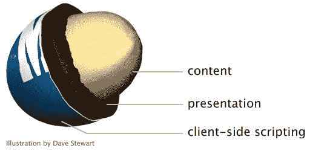

# 渐进式增强的快速介绍- LogRocket 博客

> 原文：<https://blog.logrocket.com/a-quick-introduction-to-progressive-enhancement/>

在构建 web 应用程序时，您通常希望确保它们可以在尽可能多的浏览器上使用。这非常符合 web 最初的设计目标。

关于网络，我最喜欢的一点是，它被设计成最普遍可访问和表达的平台，不管硬件、软件、网络基础设施、语言、文化、地理位置或身体和精神能力如何。

这就是渐进式改进发挥作用的地方。

## 什么是渐进增强？

为 web 构建时，首先想到的是搞清楚谁是您的应用程序的可能用户。渐进式改进侧重于这些用户在不同设备上的体验，并确保他们可以从您的网站获得他们想要的价值，而不管他们使用的是什么设备。

作为一个概念，渐进式增强包括在用户体验的基础上构建应用程序，然后在浏览器支持时添加功能增强。如今，浏览器几乎嵌入了所有东西——手机、笔记本电脑、游戏机、冰箱、手表等等。

这些设备都有不同的屏幕尺寸、浏览器支持的功能等。让体验变得独一无二。

## 渐进增强与优雅降级

“如果目标是为尽可能多的用户提供服务，为什么不首先尽可能打造最佳体验，然后再开始支持其他浏览器？”这是我经常遇到的一个问题，这种方法被称为优雅退化。

适度降级是指为现代浏览器构建一个应用程序，同时确保它在尽可能多的旧浏览器中保持功能。在某种程度上，你可以把优雅的降级称为渐进增强的相反方法，因为它首先关注现代浏览器，然后试图确保旧浏览器的基本功能。

在适度降级的情况下，主要关注的是主要浏览器的早期版本，并尽可能地对这些浏览器进行了小的修复。任何比这些旧的或不同的东西都可能提供糟糕的体验。

然而，随着逐渐增强，焦点从内容开始。当内容在添加额外的功能和增强功能之前就可以随时使用时，更多的用户可以从您的网站获得更多的价值，无论他们使用什么设备。

这就是为什么渐进式改进是一个更值得推荐的概念。

## 渐进式增强的工作原理

描述渐进增强的一个流行类比是花生 M T2 M T1。花生 M & M 有三层。有些人只喜欢花生，有些人喜欢巧克力的组合，有些人喜欢硬糖外壳的整个包装。

花生是您的内容，巧克力涂层是您的表示层，您的 JavaScript 是硬糖壳。



在 web 开发中，这些层包括 HTML、CSS 和 JavaScript。

### 超文本标记语言

第一层是干净的语义 HTML，可以在任何浏览器或设备上工作；它在任何地方都有效。这是你可以确定依赖的一层，因为浏览器总是会显示一些东西。顾名思义，HTML 负责内容的结构和标记。

让你的内容结构合理，意味着即使没有 CSS 和 JavaScript，它仍然有价值。

### 半铸钢ˌ钢性铸铁(Cast Semi-Steel)

有了 CSS，我们改进了内容的视觉设计，并继续赋予它更多的意义。不同浏览器对 CSS 的支持程度不同，用户也可以禁用或指定不同于您的样式表。默认情况下，CSS 是逐步增强的，所以当浏览器遇到它不识别的属性时，它会忽略它。

您的应用程序的布局甚至可以得到极大的增强，为支持它的浏览器提供改进的体验，而不会破坏那些不支持它的浏览器。

* * *

### 更多来自 LogRocket 的精彩文章:

* * *

### Java Script 语言

JavaScript 是所有这些层中最不可靠的。首先，许多人出于安全原因禁用 JavaScript。使用 JavaScript，您可以继续为支持它的浏览器提供增强的功能。这里推荐的方法是特征检测而不是浏览器检测；这意味着您检查浏览器是否有此功能，而不是试图检测它是哪个浏览器。

## 为什么要使用渐进式增强？

浏览器在不断发展，试图去迎合每一种浏览器是疯狂的。渐进式增强帮助您将应用程序规划为一个以内容为优先的功能系统，使您能够构建一个稳定的应用程序，该应用程序可以在任何设备和浏览器上工作，甚至是您不知道的设备和浏览器。

### 提高性能

这些年来，网站的规模不断扩大。根据 [HTTP Archive](https://www.httparchive.org) 的数据，2017 年的平均网页大小是 3MB。与 2014 年 1.6MB 的平均值相比，这是一个巨大的增长。页面大小的增加会导致加载时间的增加。

性能优化不仅重要，而且必要。渐进式改进优先考虑您的内容，确保用户可以尽快开始使用您的网站。

### 提高可访问性

渐进式改进包括从一开始就使用语义 HTML 来标记您的内容。这不仅可以确保您的内容始终被提供，而且可以始终被搜索引擎爬虫和屏幕阅读器读取。

## 逐步增强网站的技术

### 避免内嵌样式

为了确保 HTML 的整洁和语义，我们还必须将样式与标记分开。这允许以多种方式设计页面和内容，并根据各种浏览器和设备的支持进行更改。

### 不引人注目的 JavaScript

这是一个尚未正式定义的基本原则。但是它涉及到确保任何依赖于 JavaScript 的行为或功能与实际的内容或表示完全分离。为了分离表示，我们应该避免用 JavaScript 格式化内容，而使用 CSS。另一个例子是将行为与标记分开，如下所示:

```
<input type="text" name="date" onchange="validateDate()" />
```

`onchange`属性已经绑定到这里的标记，并且不是渐进式的。推荐的方法是将两者分开:

```
<input type="text" name="date" id="date" />
```

然后向元素添加一个事件处理程序:

```
window.addEventListener("DOMContentLoaded", function(event) {
    document.getElementById('date').addEventListener("change", validateDate);
});
```

对于不显眼的 JavaScript，你也应该把你的 JavaScript 移到外部文件中，而不是嵌入到`<script>`标签中。

### 预加载字体

现在很多网站使用网络字体，这是可以理解的，因为它们可以很漂亮。然而，当用户在慢速网络上时，它们将花费更长的时间来加载，并且肯定会降低用户的体验，因为内容直到字体被加载后才会显示。

处理这一问题的渐进方法是将系统字体设置为默认字体，作为呈现内容的备用字体，然后在完成加载后将其更改为 web 字体。

### 回应和媒体询问

构建 web 解决方案时，让您的应用程序在不同设备上良好显示的重要性怎么强调都不为过。一个推荐的做法是遵循移动优先的方法，从构建移动布局开始，然后逐步发展到更大的屏幕。

这允许你最大化你可以重用的 CSS 数量，因为桌面布局通常比移动更复杂。Web 响应是通过使用 CSS 媒体查询实现的，这个来自 internetingishard.com 的[伟大资源](https://internetingishard.com/html-and-css/responsive-design/#mobile-first-development)很好地解释了这一点。使用 CSS 媒体查询，您可以在不同的布局中呈现相同的内容。

### 渐进式延迟加载图像

延迟加载图像是一种通过减少呈现初始页面所需的请求和数据数量来提高网页性能的技术。使用延迟加载，图像在进入浏览器的视窗之前不会加载。这对性能很有好处，但是通常需要使用 JavaScript 库来动态加载这些图像。

对于没有启用 JavaScript 的设备，这就成了一个问题，我们必须找到一种方法来确保下载图像时没有 JavaScript。为了实现渐进式增强的延迟加载，您可以在浏览器可以依赖的`<noscript>`标签中包含一个回退``元素。

```
</img>
<noscript>
    </img>
</noscript>
```

我还发现了一个[惰性加载器](https://github.com/tvler/lazy-progressive-enhancement)，它被设计用来执行渐进式增强和有效的 HTML，你可以选择使用它。

### 特征检测

同样重要的是，要确保当我们试图执行特定操作或加载脚本时，我们会检查这些功能是否可用，以便我们不会加载不必要的脚本或如果设备不支持它们就会失败的脚本。

通过检查某个功能是否存在，我们能够为那些使用支持所需功能的新浏览器的用户定制增强的体验。

Modernizr 是一个流行的工具，你也可以用它来做这件事。它会自动检测用户浏览器中下一代网络技术的可用性。这样，我们可以避免在不需要的时候加载额外的脚本。

## 摘要

渐进增强并不是一个新概念。这是一个重要的实践，它帮助我们构建可以在尽可能多的设备上使用的网站和应用程序，同时仍然能够扩展、更改和实现新功能。在我们继续构建 web 解决方案的过程中，记住渐进增强是很重要的。

## 你的前端是否占用了用户的 CPU？

随着 web 前端变得越来越复杂，资源贪婪的特性对浏览器的要求越来越高。如果您对监控和跟踪生产环境中所有用户的客户端 CPU 使用、内存使用等感兴趣，

[try LogRocket](https://lp.logrocket.com/blg/css-signup)

.

[](https://lp.logrocket.com/blg/css-signup)[https://logrocket.com/signup/](https://lp.logrocket.com/blg/css-signup)

LogRocket 就像是网络和移动应用的 DVR，记录你的网络应用或网站上发生的一切。您可以汇总和报告关键的前端性能指标，重放用户会话和应用程序状态，记录网络请求，并自动显示所有错误，而不是猜测问题发生的原因。

现代化您调试 web 和移动应用的方式— [开始免费监控](https://lp.logrocket.com/blg/css-signup)。