# 使用 FlutterFire 插件将 Firebase 添加到您的 Flutter 应用程序中

> 原文：<https://blog.logrocket.com/add-firebase-to-your-flutter-app-with-flutterfire-plugins/>

Firebase 帮助您开发、测量、改进和发展您的移动应用程序。它得到了谷歌的支持，涵盖了广泛的服务，包括实时数据库、认证、崩溃监控、分析、推送通知等。Firebase 以服务的形式提供了所有这些与平台相关的后端工具，因此您可以更专注于构建应用程序的核心功能。

FlutterFire 是一套官方插件，可以让你在你的 Flutter 应用中实现 Firebase 服务。稳定版已经提供了各种关键插件，预计在不久的将来会有更多的插件推出。

在本教程中，我们将演示如何集成一些最有用的 FlutterFire 插件，包括:

我们还将浏览一些实际的例子，这样你就可以看到这些 FlutterFire 插件在运行。

在我们开始我们的教程之前，让我们分解一下我们将如何在我们的示例应用程序中使用每个 FlutterFire 插件:

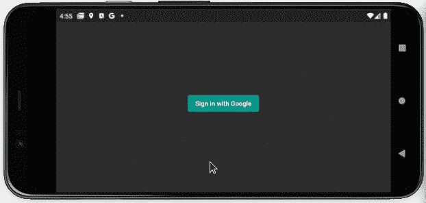

我们将构建一个虚拟操场游戏，其中通过认证插件认证的用户控制一个角色在蹦床上跳跃。跳转计数将被同步到云 Firestore。我们将使用远程配置来更改背景，而无需推送应用程序更新。最后，我们将分别使用 Analytics 和 Crashlytics 插件处理重要事件和崩溃。

## 创建并配置您的 Firebase 项目

第一步是在 Firebase 控制台中创建一个项目，并配置原生 Android/iOS 和 Flutter 应用程序以使用 Firebase 服务。

要在 Firebase 控制台中创建项目，请执行以下操作:

1.  前往[消防基地控制台](https://console.firebase.google.com/)
2.  点击**添加项目**
3.  输入项目名称并点击**继续**
4.  保持**启用此项目的谷歌分析**并点击**继续**
5.  选择谷歌分析账户，点击**创建项目**


### 配置 Android 应用程序

一旦创建了项目，您应该能够看到项目仪表板。要设置 Android 项目:

1.  点击 Android 图标
2.  输入包名和 SHA-1 密钥，在**注册**区点击**注册 app**
3.  下载`google-services.json`文件，放在 Android app 目录下。应该是这样的:`android/app/google-services.json`
4.  添加 Firebase 依赖项，如**添加 Firebase SDK 部分**所述
5.  点击**继续控制台**

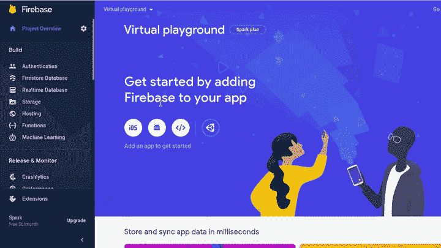

### 配置 iOS 应用程序

由于 Flutter 是为跨平台应用程序开发而设计的，所以让我们也为原生 iOS 应用程序配置它:

1.  在项目仪表盘中，点击**添加应用**按钮
2.  单击 iOS 图标
3.  输入捆绑 ID，点击**注册**部分的**注册应用**
4.  打开 Xcode，下载`GoogleService-Info.plist` **文件，拖放到 Runner** 子文件夹
5.  按照“添加 Firebase SDK”和“添加初始化代码”小节中的说明进行操作
6.  点击**继续控制台**

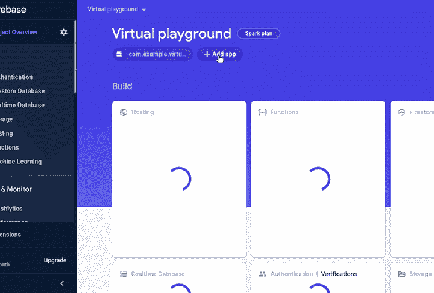

### 建立一个颤振项目

要使用任何 Firebase 服务，您首先需要安装的最重要的插件是 [`firebase_core`](https://pub.dev/packages/firebase_core) ，它使应用程序能够与 Firebase 通信。

```
dependencies:
  flutter:
    sdk: flutter
  cupertino_icons: ^1.0.2
  firebase_core: ^1.0.1 

```

在`pubspec.yaml`文件中添加如上图所示的 [`firebase_core`](https://pub.dev/packages/firebase_core) 依赖项，并输入`pub get`命令:

```
flutter pub get

```

## 证明

对于任何移动应用程序来说，身份验证都是一个非常重要的功能。用户可能会上传个人和潜在的敏感信息到你的应用程序，所以能够验证用户的身份是至关重要的。

Firebase Authentication 提供后端服务和易于使用的 SDK 来验证您的应用程序的用户。它支持使用密码、电话号码以及通过第三方平台(如谷歌、脸书、Twitter、GitHub 和苹果)进行身份验证。我们将使用 [firebase_auth](https://pub.dev/packages/firebase_auth) 插件在我们的应用程序中实现认证。

### 在 Firebase 控制台中启用身份验证

在我们开始将 firebase_auth 插件集成到我们的应用程序之前，我们首先需要在 firebase 控制台中启用身份验证:

1.  点击左侧菜单中的**认证**
2.  选择**登录**方式选项卡
3.  点击 **Google** ，打开**使能**开关，然后从列表中选择支持邮件。除了本教程的目的之外，您可以选择任何登录方法；我们选择了**谷歌**，因为我们将实现谷歌登录
4.  点击**下一个**

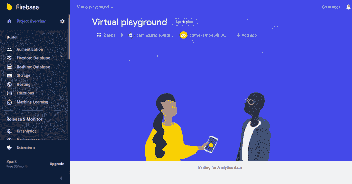

启用认证后，您需要再次下载`google-services.json`和`GoogleService-Info.plist`。您可以找到这两个文件，如下所示:


### 添加依赖关系

在`pubspec.yaml`中添加 [`firebase_auth`](https://pub.dev/packages/firebase_auth) 和 [`google_sign_in`](https://pub.dev/packages?q=google_sign_in) 的依赖关系，如下所示:

```
dependencies:
  flutter:
    sdk: flutter
  cupertino_icons: ^1.0.2
  firebase_core: ^1.0.1 
  firebase_auth: ^1.0.1 #new
  google_sign_in: ^5.0.0 #new

```

### 实现代码以进行身份验证

在应用程序启动时初始化 Firebase 服务，如下所示:

```
void main() async {
  WidgetsFlutterBinding.ensureInitialized();
  await Firebase.initializeApp();
  runApp(MyApp()),
}

```

添加通过 Google 登录的方法:

```
static Future<User?> signInWithGoogle() async {
  FirebaseAuth _auth = FirebaseAuth.instance;
  try {
    UserCredential userCredential;

    if (kIsWeb) {
      var googleProvider = GoogleAuthProvider();
      userCredential = await _auth.signInWithPopup(googleProvider);
    } else {
      final GoogleSignInAccount googleUser = (await GoogleSignIn().signIn())!;
      final GoogleSignInAuthentication googleAuth =
          await googleUser.authentication;
      final googleAuthCredential = GoogleAuthProvider.credential(
        accessToken: googleAuth.accessToken,
        idToken: googleAuth.idToken,
      );
      userCredential = await _auth.signInWithCredential(googleAuthCredential);
    }

    final user = userCredential.user;
    return user;
  } catch (e) {
    print(e);
  }
}

```

我们还需要构建一个注销方法:

```
static Future<void> signOut({required BuildContext context}) async {
  final GoogleSignIn googleSignIn = GoogleSignIn();

  try {
    if (!kIsWeb) {
      await googleSignIn.signOut();
    }
    await FirebaseAuth.instance.signOut();
  } catch (e) {
    print(e);
  }
}

```

这一切是如何协同工作的:

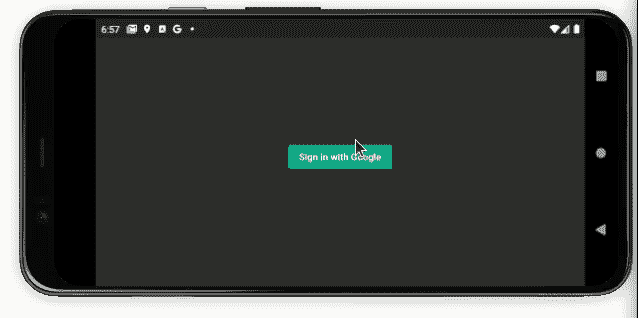

## 云风暴

Cloud Firestore 是一个灵活、可扩展的 NoSQL 云数据库，可以实时存储和同步数据。 [cloud_firestore](https://pub.dev/packages/cloud_firestore) 插件为移动和网络提供实时监听器和离线支持。无论您的互联网连接如何，它在任何情况下都能正常工作。它也被称为 Firestore 数据库。

**在 Firebase 控制台中创建数据库**
在我们项目的 Firebase 控制台中创建数据库:

1.  点击左侧菜单中的 **Firestore 数据库** *
2.  点击**创建数据库**按钮
3.  选择**在测试模式下开始**选项
4.  点击**启用**

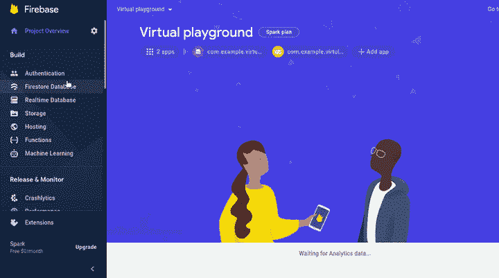

**设置访问数据库的规则**

我们不想让数据库保持打开状态，所以让我们通过设置以下规则，将数据库访问权限仅限于经过身份验证的用户:

```
rules_version = ‘2’;
service cloud.firestore {
 match /databases/{database}/documents {
 match /{document=**} {
 allow read, write: if request.auth != null;
  }
 }
}

```

### 添加依赖关系

在`pubspec.yaml`中添加 [`cloude_firestore`](https://pub.dev/packages/cloud_firestore) 依赖项，如下图所示:

```
dependencies:
  flutter:
    sdk: flutter
  cupertino_icons: ^1.0.2
  firebase_core: ^1.0.1 
  firebase_auth: ^1.0.1 
  google_sign_in: ^5.0.0 
  cloud_firestore: ^2.2.0 #new

```

### 实施准则

在演示应用程序中，一旦用户登录，我们就会将用户数据存储在 Cloud Firestore 中，如下所示。

```
User? user = await Authentication.signInWithGoogle();

if (user != null) {
  database.storeUserData(user: user);
  Navigator.of(context).pushReplacement(
    MaterialPageRoute(
      builder: (context) => Home(
        user: user,
      ),
    ),
  );
}
//----------------------------------------------------
storeUserData({required User user}) async {
  AppUser appUser = AppUser(uid: user.uid, name: user.displayName, jumps: 0);

  await userCollection
      .doc(user.uid)
      .set(appUser.toJson())
      .then((value) => print("User Added"))
      .catchError((error) => print("Failed to add user: $error"));
}

```

我们将使用以下方法将登录用户的跳转次数存储并同步到 Firestore 数据库中:

```
ElevatedButton(
  style: ElevatedButton.styleFrom(primary: Colors.red),
  onPressed: () async {
    _jumpCount++;
    _datebase.updateJumpCount(
        user: _user, jumpCount: _jumpCount);
  },
  child: Text(
    'Jump',
    style: TextStyle(fontSize: 34),
  ),
),
//---------------
updateJumpCount({required User user, required int jumpCount}) async {
  await userCollection
      .doc(user.uid)
      .update({'jumps': jumpCount})
      .then((value) => print("User Added"))
      .catchError((error) => print("Failed to add user: $error"));
}

```

现在让我们添加代码，使用实时监听器在仪表板中显示跳转计数:

```
Container(
  width: 200,
  height: 100,
  decoration: BoxDecoration(
      color: Colors.grey.withOpacity(0.5),
      border: Border.all(width: 1, color: Colors.black)),
  child: StreamBuilder<QuerySnapshot>(
    stream: _usersStream,
    builder: (BuildContext context,
        AsyncSnapshot<QuerySnapshot> snapshot) {
      if (snapshot.hasError) {
        return Text('Something went wrong');
      }

      if (snapshot.connectionState == ConnectionState.waiting) {
        return Text("Loading");
      }

      return Expanded(
        child: new ListView(
          children: snapshot.data!.docs
              .map((DocumentSnapshot document) {
            return Text(
              '${(document.data() as Map)['name']} : ${(document.data() as Map)['jumps']}',
              style:
                  TextStyle(fontSize: 18, color: Colors.black),
            );
          }).toList(),
        ),
      );
    },
  ),
)

```

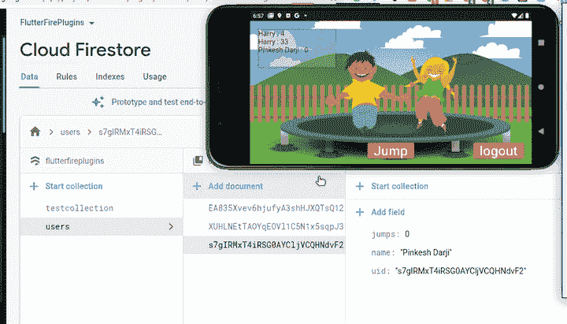

正如您在上面看到的，跳转计数在 Firestore 数据库中更新，并实时显示在仪表板中。

## 远程配置

通过[远程配置](https://pub.dev/packages/firebase_remote_config)插件，您可以动态更改移动应用的行为和外观。这意味着您几乎可以更改应用程序中的任何内容，而无需发布新的应用程序更新。

最初，应用程序将从应用程序中可用的远程配置中读取默认值。稍后，它可以在需要时从远程配置中获取新值。您可以控制需要更改的内容，并将更改应用于所有用户或特定部分的用户。

### 在 Firebase 控制台中设置远程配置值

在我们的演示应用程序中，我们将使用远程配置来控制后台。以下是设置这些值的步骤:

1.  从项目仪表板中，向下滚动并选择**远程配置**
2.  添加关键字为**背景**，值为**山脉**，打开应用时加载山脉背景
3.  点击**发布变更**两次

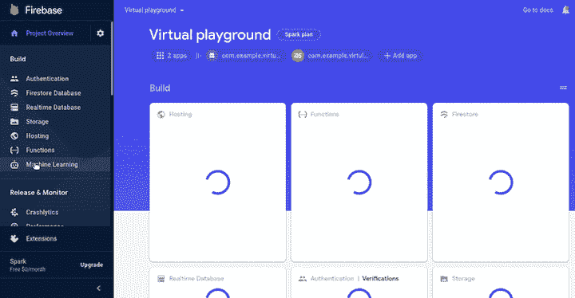

### 添加依赖关系

在`pubspec.yaml`中添加 [`firebase_remote_config`](https://pub.dev/packages/firebase_remote_config) 依赖项，如下图所示:

```
dependencies:
  flutter:
    sdk: flutter
  cupertino_icons: ^1.0.2
  firebase_core: ^1.0.1 
  firebase_auth: ^1.0.1 
  google_sign_in: ^5.0.0 
  cloud_firestore: ^2.2.0
  firebase_remote_config: ^0.10.0+2 #new

```

### 获取代码中的远程配置值

现在，让我们编写一些代码来设置应用程序中的远程配置。以下代码还设置了默认值，以便应用程序可以在首次启动时读取和运行:

```
Future<RemoteConfig> setupRemoteConfig() async {
  await Firebase.initializeApp();
  final RemoteConfig remoteConfig = RemoteConfig.instance;
  await remoteConfig.setConfigSettings(RemoteConfigSettings(
    fetchTimeout: const Duration(seconds: 10),
    minimumFetchInterval: Duration.zero,
  ));
  await remoteConfig
      .setDefaults(<String, dynamic>{'background': 'mountains'});
  RemoteConfigValue(null, ValueSource.valueStatic);
  return remoteConfig;
}

```

添加以下代码来获取和加载键背景的新值。用户界面会相应地反映出来。

```
FutureBuilder<RemoteConfig>(
  future: _datebase.setupRemoteConfig(),
  builder: (BuildContext context,
      AsyncSnapshot<RemoteConfig> snapshot) {
    if (snapshot.hasData) {
      _fetchLatestRemoteConfig(snapshot.requireData);
      return Image.asset(
        snapshot.requireData.getString('background') ==
                'mountains'
            ? 'assets/images/green_background.png'
            : 'assets/images/beach.png',
        fit: BoxFit.fill,
      );
    } else {
      return Image.asset(
        'assets/images/green_background.png',
        fit: BoxFit.fill,
      );
    }
  },
),

```

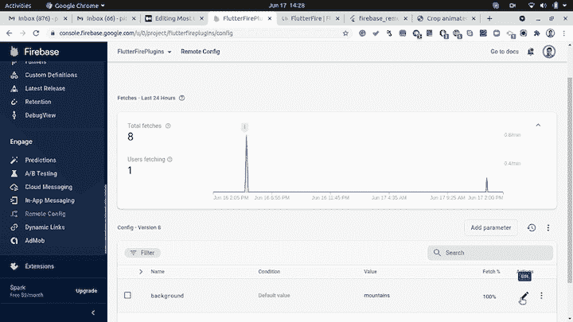

如上所述，这将背景从山脉更改为海滩，并在重启时更改应用程序中的图像背景。

## Crashlytics

在开发移动应用程序时，你不可能捕捉到所有的错误，这就是崩溃监控系统的用武之地。 [Crashlytics](https://pub.dev/packages/firebase_crashlytics) 插件帮助你实时捕捉致命错误。

### 在 Firebase 控制台中启用崩溃分析

从左侧菜单中，点击**防撞系统**，然后点击**启用**按钮。

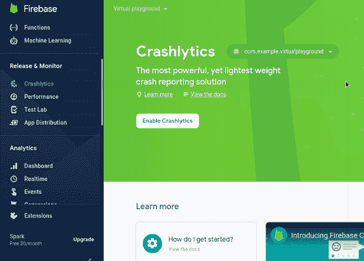

### 添加依赖关系

在`pubspec.yaml`中添加 [`firebase_crashlytics`](https://pub.dev/packages/firebase_crashlytics) 依赖关系，如下图所示:

```
dependencies:
  flutter:
    sdk: flutter
  cupertino_icons: ^1.0.2
  firebase_core: ^1.0.1 
  firebase_auth: ^1.0.1 
  google_sign_in: ^5.0.0 
  cloud_firestore: ^2.2.0
  firebase_remote_config: ^0.10.0+2
  firebase_crashlytics: ^2.0.6 #new

```

### 添加代码来捕获错误

下面是初始化 Crashlytics 并捕获任何未捕获的错误的代码:

```
//Crashlytics
await FirebaseCrashlytics.instance.setCrashlyticsCollectionEnabled(true);
// Pass all uncaught errors to Crashlytics.
Function originalOnError = FlutterError.onError as Function;
FlutterError.onError = (FlutterErrorDetails errorDetails) async {
  await FirebaseCrashlytics.instance.recordFlutterError(errorDetails);
  // Forward to original handler.
  originalOnError(errorDetails);
};

```

您可以通过简单地在任何地方编写以下代码来测试错误捕获:

```
//Force crash
FirebaseCrashlytics.instance.crash();

```

在 Firebase 控制台中，它看起来会像这样:

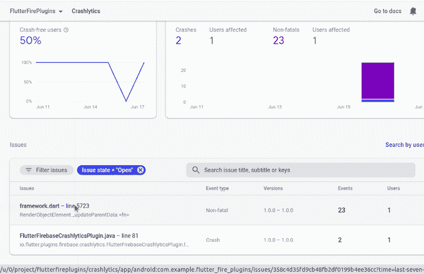

## 分析学

[分析](https://pub.dev/packages/firebase_analytics)插件帮助你发现用户实际上是如何使用你的应用程序的，并提供你可以用来改善用户体验的数据。该插件提供多达 500 个不同事件的无限报告。

我们已经选择为我们的演示应用程序启用 to analytics，因此我们将开始在我们的应用程序中集成。

**添加依赖关系**

在`pubspec.yaml`中添加 [`firebase_anlytics`](https://pub.dev/packages/firebase_analytics) 依赖关系，如下图所示:

```
dependencies:
  flutter:
    sdk: flutter
  cupertino_icons: ^1.0.2
  firebase_core: ^1.0.1 
  firebase_auth: ^1.0.1 
  google_sign_in: ^5.0.0 
  cloud_firestore: ^2.2.0
  firebase_remote_config: ^0.10.0+2
  firebase_crashlytics: ^2.0.6
  firebase_analytics: ^8.1.2 #new

```

### 记录事件

有许多预定义的事件要记录，如购买、添加到购物车、登录等。对于我们的示例，让我们尝试添加一个登录事件:

```
ElevatedButton(
  onPressed: () async {
    User? user = await Authentication.signInWithGoogle();

    if (user != null) {
      database.storeUserData(user: user);
      Navigator.of(context).pushReplacement(
        MaterialPageRoute(
          builder: (context) => Home(
            user: user,
          ),
        ),
      );
      await analytics.logLogin();
    }
  },
  child: Text('Sign in with Google'),
)

```

您也可以记录自定义事件，如下所示:

```
Future<void> _testSetCurrentScreen() async {
  await analytics.setCurrentScreen(
    screenName: 'Analytics Demo',
    screenClassOverride: 'AnalyticsDemo',
  );
}

```

以下是查看所有记录事件的方式:

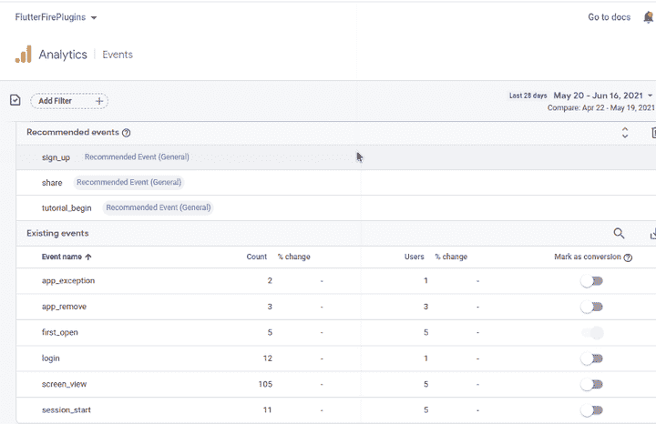

完整的源代码可以在 [GitHub](https://github.com/pinkeshdarji/flutter_fire_plugins) 上获得。

## 结论

在本教程中，我们学习了如何在 Flutter app 中集成 FlutterFire 插件认证、云 Firestore、远程配置、Crashlytics 和分析。然后，我们构建了一个示例应用程序来展示这些 FlutterFire 插件如何在实际应用程序中协同工作。最后，我们展示了如何使用 FlutterFire 插件来测试您的应用程序的错误，并收集数据来帮助您改善用户体验。

## 使用 [LogRocket](https://lp.logrocket.com/blg/signup) 消除传统错误报告的干扰

[](https://lp.logrocket.com/blg/signup)

[LogRocket](https://lp.logrocket.com/blg/signup) 是一个数字体验分析解决方案，它可以保护您免受数百个假阳性错误警报的影响，只针对几个真正重要的项目。LogRocket 会告诉您应用程序中实际影响用户的最具影响力的 bug 和 UX 问题。

然后，使用具有深层技术遥测的会话重放来确切地查看用户看到了什么以及是什么导致了问题，就像你在他们身后看一样。

LogRocket 自动聚合客户端错误、JS 异常、前端性能指标和用户交互。然后 LogRocket 使用机器学习来告诉你哪些问题正在影响大多数用户，并提供你需要修复它的上下文。

关注重要的 bug—[今天就试试 LogRocket】。](https://lp.logrocket.com/blg/signup-issue-free)