# 使用 Firebase 云消息添加 Flutter 推送通知- LogRocket 博客

> 原文：<https://blog.logrocket.com/add-flutter-push-notifications-firebase-cloud-messaging/>

***编者按**:本教程最后一次更新于 2022 年 3 月 15 日，以解决最新版本 Dart 触发的源代码中的弃用警告。*

用户参与对任何移动应用的成功都至关重要。推送通知有助于吸引用户的注意力，当与高质量的内容一起适当实施时，可以有助于取得重大的营销成功。

在本教程中，我们将演示如何使用 Firebase 提供的一项名为 [Firebase Cloud Messaging](https://firebase.google.com/docs/cloud-messaging) 的出色服务，将推送通知集成并交付给 Flutter 应用程序。它是免费的，容易上手，而且你不需要管理你的后端基础设施。

我们将通过详细的示例和逐步说明来涵盖以下内容:

您也可以在 GitHub 资源库中查看示例的[完整代码。我们开始吧！](https://github.com/sbis04/notify)

## 什么是推送通知？

如果你使用智能手机，你几乎肯定每天都会遇到推送通知。推送通知是出现在用户设备上的可点击弹出消息，无论他们当时是否正在使用特定的应用程序。

即使当设备空闲或用户正在使用另一个应用程序时，只要设备在线并且授予了通知权限，用户就会收到推送通知。推送通知可用于通知用户状态更新、消息请求、提醒、警报等。

在本教程中，我们将使用 Firebase 云消息发送推送通知。

## 设置 Firebase

要开始使用 Firebase，您必须创建新的 Firebase 项目。登录你的谷歌账户，导航到 [Firebase 控制台](https://console.firebase.google.com/)，点击**添加项目**:

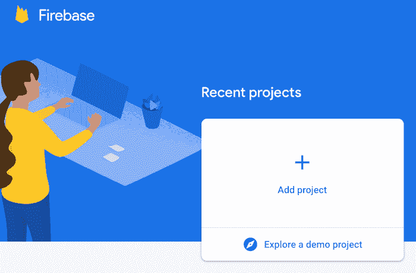

输入项目名称，点击**继续**:


禁用谷歌分析；我们的示例项目不需要它。然后，点击**创建项目**:

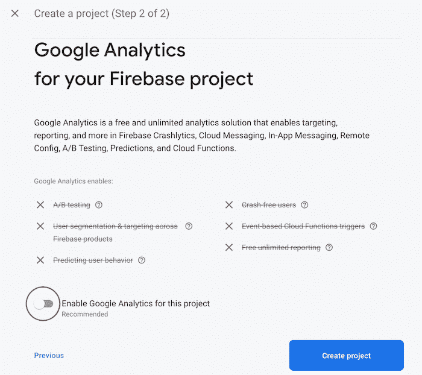

项目初始化后，点击**继续**:

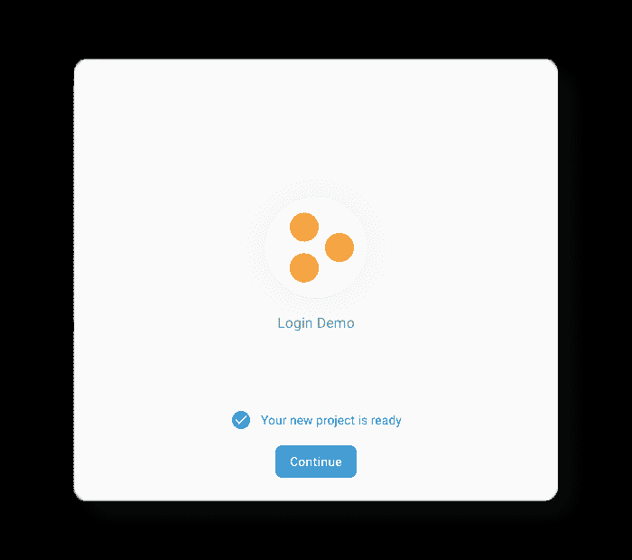

这将带您进入**项目概述**屏幕。在这里，您可以找到将 Firebase 项目与您的 Android 和 iOS 应用程序集成的选项:

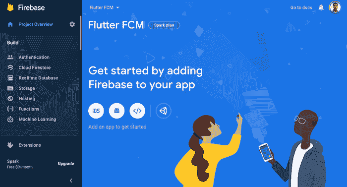

## 将 Firebase 与您的 Flutter 应用程序集成

现在，我们的 Firebase 项目已经准备好与移动应用程序集成。尽管我们使用的是跨平台框架的 [Flutter，但我们仍然必须为两个平台分别执行初始 Firebase 设置。](https://blog.logrocket.com/why-flutter-is-overtaking-react-native/)

首先，创建一个新的颤振应用程序:

```
flutter create notify

```

接下来，在您最喜欢的 IDE 上打开 Flutter 项目。要在 VS 代码中打开它，可以使用下面的命令:

```
code notify

```

### 整合 Firebase 和 Flutter: Android

要将 Firebase 项目与应用程序的 Android 端集成，首先，单击项目概述页面上的 Android 图标:

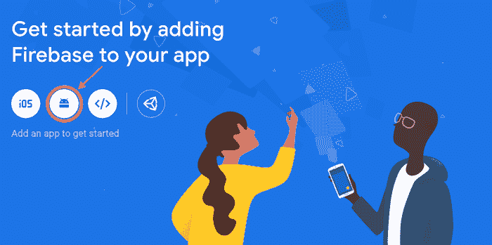

你应该被引导到一个表格。首先，输入 Android 包名。你可以在你的`project directory` → `android` → `app` → `src` → `main` → `AndroidManifest.xml`中找到这一点。在第二行，您将看到您的包名。复制并粘贴到表单中即可。

或者，您可以为您的应用程序选择昵称。如果将此字段留空，将使用自动生成的应用程序名称:


你必须输入 SHA-1 散列。悬停在帮助图标**上即可？**点击**查看此页面，**将带您进入**认证您的客户**页面:

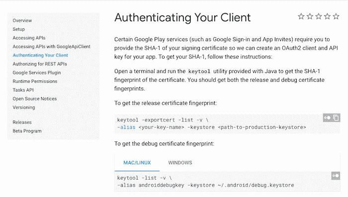

从这里，您将得到生成 SHA-1 散列的命令。将这个命令粘贴到您的终端中，然后将生成的 SHA-1 散列复制并粘贴到表单中。点击**注册 app** ，进入下一步。

下载`google-services.json`文件，拖放到你的`project directory` → `android` → `app`，然后点击**下一个**:

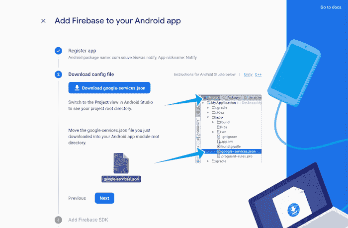

按照说明，在指定位置添加代码片段。然后，点击下一个的**:**

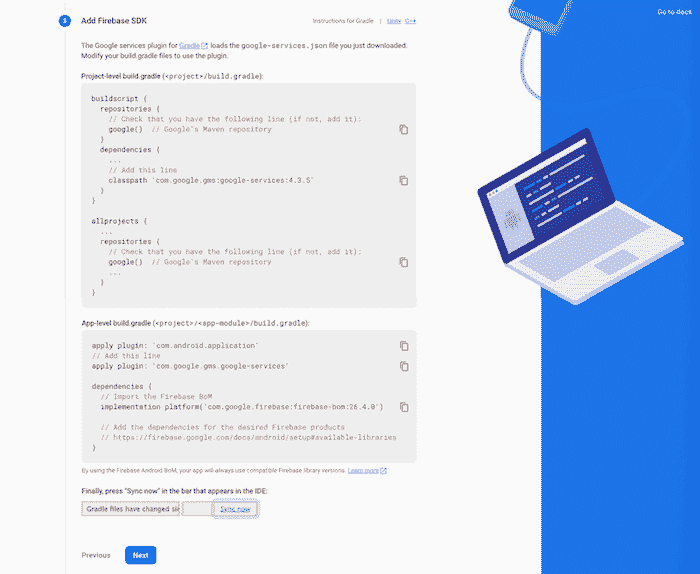

最后，点击**继续控制台**:

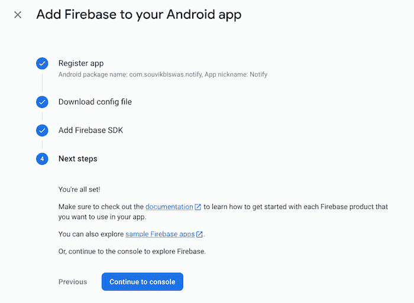

至此，您已经完成了应用程序 Android 端的 Firebase 设置。

### 整合 Firebase 和 Flutter: iOS

要将您的 Firebase 项目与您的应用程序的 iOS 端集成，首先，在项目概述页面上单击**添加应用程序**按钮，然后选择 **iOS** :

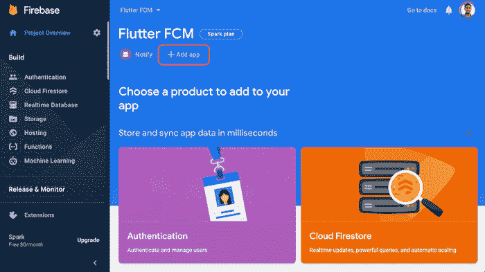

输入 **iOS 捆绑 ID** 和你的**应用昵称**。然后，点击**注册 app** 。你可以暂时将应用商店 ID 留空；当您将应用程序部署到 iOS 应用程序商店时，您将获得以下信息:

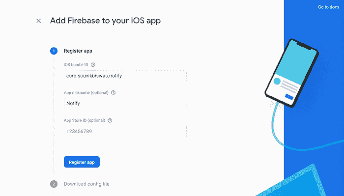

搜索`PRODUCT_BUNDLE_IDENTIFIER`可以找到`ios` → `Runner.xcodeproj` → `project.pbxproj`里面的捆绑 ID:


接下来，选择**下载`GoogleService-Info.plist`** :

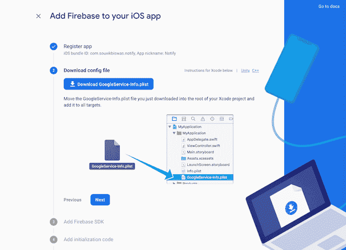

在 Xcode 中打开项目目录的`ios`文件夹。将下载的文件拖放到`Runner`子文件夹中。当出现对话框时，确保勾选了`Destination`属性的**复制项目(如果需要)**，并且在**添加到目标**框中选择了**流道**。然后，点击**完成**:

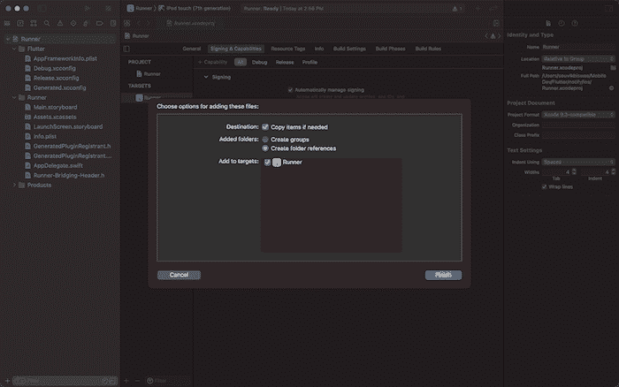

您现在可以关闭 Xcode 了。您可以跳过第三和第四步，添加 Firebase SDK 并添加初始化代码。这些将由 Flutter Firebase 插件处理，我们很快会添加它。然后，点击**继续操控**。

在潜入颤振代码之前，需要在 Firebase 中再完成一步；
进入**项目设置**:


在**常规**选项卡下，输入您的**支持电子邮件:**

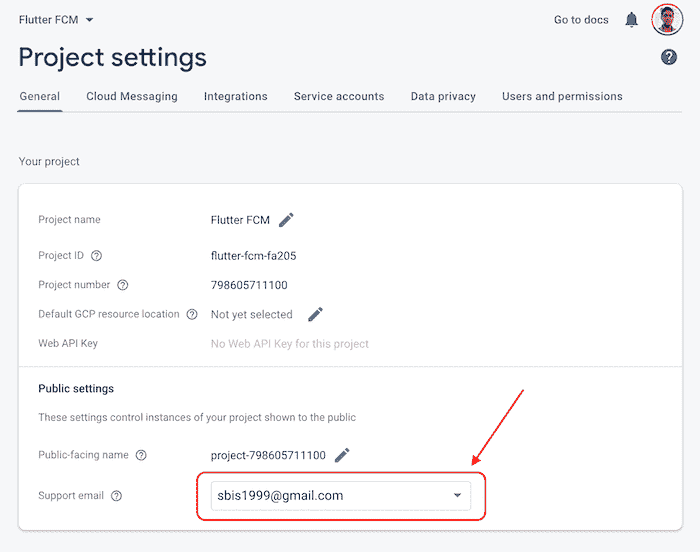

现在，Firebase 的设置和集成已经完成。让我们继续讨论颤振代码。

## 安装 Flutter 插件

我们需要这个项目的下列颤振插件:

你可以从 [pub.dev](https://pub.dev/) 获得这些包的最新版本。将它们添加到颤振项目的`pubspec.yaml`文件中:

```
flutter pub add firebase_core //installs firebase core
flutter pub add firebase_messaging //installs firebase massaging package
flutter pub add overlay_support //installs overlay support

```

如果查看您的`pubspec.yaml`文件，您应该看到添加了以下依赖项:

```
dependencies:
  firebase_core: ^1.13.1
  firebase_messaging: ^11.2.11
  overlay_support: ^1.2.1

```

## 构建 Flutter UI

我们将保持 Flutter 应用程序的 UI 简单，这样我们就可以专注于推送通知的功能。该应用程序将在一个`Column`中包含一个`AppBar`和一些`Text`小部件，以显示通知内容:


从 Dart 代码所在的根项目目录导航到`lib`文件夹。用以下代码替换整个代码:

```
void main() {
  runApp(MyApp());
}

class MyApp extends StatelessWidget {
  @override
  Widget build(BuildContext context) {
    return MaterialApp(
      title: 'Notify',
      theme: ThemeData(
        primarySwatch: Colors.deepPurple,
      ),
      debugShowCheckedModeBanner: false,
      home: HomePage(),
    );
  }
}

```

现在，我们必须定义`HomePage`小部件，它将是一个`StatefulWidget`，因为我们需要在通知生成后立即更新 UI:

```
class HomePage extends StatefulWidget {
  @override
  _HomePageState createState() => _HomePageState();
}

class _HomePageState extends State {
  late int _totalNotifications;

  @override
  void initState() {
    _totalNotifications = 0;
    super.initState();
  }

  @override
  Widget build(BuildContext context) {
    return Scaffold(
      appBar: AppBar(
        title: Text('Notify'),
        brightness: Brightness.dark,
      ),
      body: Column(
        mainAxisAlignment: MainAxisAlignment.center,
        children: [
          Text(
            'App for capturing Firebase Push Notifications',
            textAlign: TextAlign.center,
            style: TextStyle(
              color: Colors.black,
              fontSize: 20,
            ),
          ),
          SizedBox(height: 16.0),
          NotificationBadge(totalNotifications: _totalNotifications),
          SizedBox(height: 16.0),
          // TODO: add the notification text here
        ],
      ),
    );
  }
}

```

这里，我们有一个包含一个 T1 和一个 T2 的 T0。该列包含一个基本的`Text`小部件，后跟一个用于显示收到的通知总数的`NotificationBadge`小部件。您可能已经注意到了`TODO`，这是我们将显示通知信息的地方。

`NotificationBadge`的代码如下:

```
class NotificationBadge extends StatelessWidget {
  final int totalNotifications;

  const NotificationBadge({required this.totalNotifications});

  @override
  Widget build(BuildContext context) {
    return Container(
      width: 40.0,
      height: 40.0,
      decoration: new BoxDecoration(
        color: Colors.red,
        shape: BoxShape.circle,
      ),
      child: Center(
        child: Padding(
          padding: const EdgeInsets.all(8.0),
          child: Text(
            '$totalNotifications',
            style: TextStyle(color: Colors.white, fontSize: 20),
          ),
        ),
      ),
    );
  }
}

```

## 通过 Firebase 云消息添加推送通知功能

现在，是时候为我们的推送通知添加功能了。要开始使用 Firebase 云消息服务，首先要为`FirebaseMessaging`定义一个变量:

```
class _HomePageState extends State {
  late final FirebaseMessaging _messaging;
  // ...

  @override
  Widget build(BuildContext context) {
    // ...
  }
}

```

在`_HomePageState`类中创建一个名为`registerNotification()`的方法。`registerNotification()`将初始化 Firebase 应用程序，请求通知访问，这仅在 iOS 设备上需要，最后，配置消息以接收和显示推送通知:

```
void registerNotification() async {
  // 1\. Initialize the Firebase app
  await Firebase.initializeApp();

  // 2\. Instantiate Firebase Messaging
  _messaging = FirebaseMessaging.instance;

  // 3\. On iOS, this helps to take the user permissions
  NotificationSettings settings = await _messaging.requestPermission(
    alert: true,
    badge: true,
    provisional: false,
    sound: true,
  );

  if (settings.authorizationStatus == AuthorizationStatus.authorized) {
    print('User granted permission');
    // TODO: handle the received notifications
  } else {
    print('User declined or has not accepted permission');
  }
}

```

在上面的代码中，我们首先初始化了 Firebase 应用程序，没有它，我们将无法访问应用程序中的任何 Firebase 服务。之后，我们实例化了 Firebase 消息传递。`requestPermission()`方法需要 iOS 设备上的用户同意。如果应用程序在 Android 设备上运行，这将被忽略。

要接收到达设备的推送通知并根据通知执行 UI 更改，请使用以下代码:

```
void registerNotification() async {
  //...

  if (settings.authorizationStatus == AuthorizationStatus.authorized) {
    print('User granted permission');

    // For handling the received notifications
    FirebaseMessaging.onMessage.listen((RemoteMessage message) {
      // Parse the message received
      PushNotification notification = PushNotification(
        title: message.notification?.title,
        body: message.notification?.body,
      );

      setState(() {
        _notificationInfo = notification;
        _totalNotifications++;
      });
    });
  } else {
    print('User declined or has not accepted permission');
  }
}

```

`PushNotification`是用于存储通知内容的模型类。
`PushNotification`模型类看起来像下面的代码:

```
class PushNotification {
  PushNotification({
    this.title,
    this.body,
  });
  String? title;
  String? body;
}

```

## 对推送通知做出反应

要在 UI 上显示通知，可以使用我们之前添加的`overlay_support`插件。当任何通知到达设备时，您可以轻松地创建一个简单的甚至是自定义的 UI 效果。

用`OverlaySupport`小部件包装`MaterialApp`小部件:

```
class MyApp extends StatelessWidget {
  @override
  Widget build(BuildContext context) {
    return OverlaySupport(
      child: MaterialApp(
        // ...
      ),
    );
  }
}

```

然后，使用`showSimpleNotification()`方法在应用程序中显示通知:

```
void registerNotification() async {
  //...

  if (settings.authorizationStatus == AuthorizationStatus.authorized) {
    FirebaseMessaging.onMessage.listen((RemoteMessage message) {
      // ...
      if (_notificationInfo != null) {
        // For displaying the notification as an overlay
        showSimpleNotification(
          Text(_notificationInfo!.title!),
          leading: NotificationBadge(totalNotifications: _totalNotifications),
          subtitle: Text(_notificationInfo!.body!),
          background: Colors.cyan.shade700,
          duration: Duration(seconds: 2),
        );
      }
    });
  } else {
    print('User declined or has not accepted permission');
  }
}

```

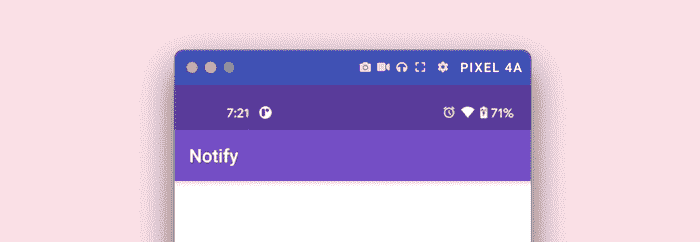

您可能还记得，我们留下了一个需要完成的`TODO`,我们必须在屏幕上显示通知数据。您可以使用`_notificationInfo`和`_totalNotifications`变量来显示信息:

```
class _HomePageState extends State {
  late int _totalNotifications;
  PushNotification? _notificationInfo;

  //...

  @override
  Widget build(BuildContext context) {
    return Scaffold(
      appBar: AppBar(
        title: Text('Notify'),
        brightness: Brightness.dark,
      ),
      body: Column(
        mainAxisAlignment: MainAxisAlignment.center,
        children: [
          //...

          _notificationInfo != null
              ? Column(
                  crossAxisAlignment: CrossAxisAlignment.start,
                  children: [
                    Text(
                      'TITLE: ${_notificationInfo!.title}',
                      style: TextStyle(
                        fontWeight: FontWeight.bold,
                        fontSize: 16.0,
                      ),
                    ),
                    SizedBox(height: 8.0),
                    Text(
                      'BODY: ${_notificationInfo!.body}',
                      style: TextStyle(
                        fontWeight: FontWeight.bold,
                        fontSize: 16.0,
                      ),
                    ),
                  ],
                )
              : Container(),
        ],
      ),
    );
  }
}

```

如您所见，我们显示了一个带有两个`Text`小部件的`Column`，以显示通知的标题和正文。当`_notificationInfo`为空时，我们只显示一个空的`Container`:

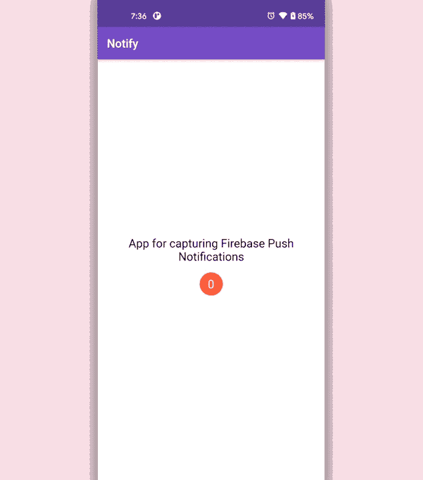

如果您尝试将应用程序置于后台，您仍会收到通知。由于我们尚未配置如何处理后台通知，当您点击通知打开应用程序时，您不会在 UI 中看到任何变化:


## 处理后台通知

为了处理后台通知，我们必须定义一个名为`_firebaseMessagingBackgroundHandler()`的顶级函数，并将其传递给`registerNotification()`方法中的`onBackgroundMessage()`。

您可以如下定义`_firebaseMessagingBackgroundHandler()`功能:

```
Future _firebaseMessagingBackgroundHandler(RemoteMessage message) async {
  print("Handling a background message: ${message.messageId}");
}

```

请记住，您必须将它定义为顶级函数，这意味着它应该在任何类之外。

调用`onBackgroundMessage()`方法:

```
void registerNotification() async {
  await Firebase.initializeApp();
  _messaging = FirebaseMessaging.instance;

  // Add the following line
  FirebaseMessaging.onBackgroundMessage(_firebaseMessagingBackgroundHandler);

  // ...
}

```

如果您只是定义它，您将无法在应用程序中检索和显示数据。

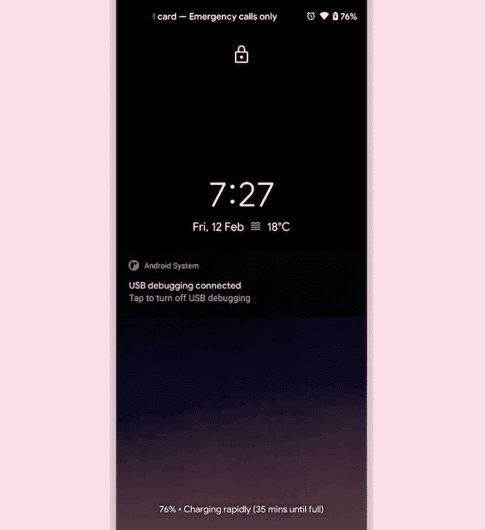

要在应用程序处于后台并且通知被点击时处理操作，您必须将以下代码添加到`initState()`方法中:

```
@override
void initState() {
  //...

  // For handling notification when the app is in background
  // but not terminated
  FirebaseMessaging.onMessageOpenedApp.listen((RemoteMessage message) {
    PushNotification notification = PushNotification(
      title: message.notification?.title,
      body: message.notification?.body,
    );
    setState(() {
      _notificationInfo = notification;
      _totalNotifications++;
    });
  });

  super.initState();
}

```

但是，如果应用程序处于终止状态并通过点击通知返回，那么`initState()`方法不足以检索信息。定义一个名为`checkForInitialMessage()`的方法，并向其中添加以下代码:

```
// For handling notification when the app is in terminated state
checkForInitialMessage() async {
  await Firebase.initializeApp();
  RemoteMessage? initialMessage =
      await FirebaseMessaging.instance.getInitialMessage();

  if (initialMessage != null) {
    PushNotification notification = PushNotification(
      title: initialMessage.notification?.title,
      body: initialMessage.notification?.body,
    );
    setState(() {
      _notificationInfo = notification;
      _totalNotifications++;
    });
  }
}

```

从`initState()`方法中调用`checkForInitialMessage()`:

```
@override
void initState() {
  // ...

  // Call here
  checkForInitialMessage();

  // ...
  super.initState();
}

```

## 从消息中检索数据

您可以使用 Firebase Cloud Messaging 控制台以[键-值对的格式发送一些附加数据。我们将通过发送以下键值对来演示这一点:](https://blog.logrocket.com/using-firebase-cloud-messaging-as-a-pub-sub-service/)


`title`和`body`是键。它们各自的值列在左边。为了存储这些数据，您必须对模型类做一个小的修改:

```
class PushNotification {
  PushNotification({
    this.title,
    this.body,
    this.dataTitle,
    this.dataBody,
  });

  String? title;
  String? body;
  String? dataTitle;
  String? dataBody;
}

```

我们为数据消息定义了两个额外的字段。现在，按如下方式检索数据:

```
PushNotification notification = PushNotification(
  title: message.notification?.title,
  body: message.notification?.body,
  dataTitle: message.data['title'],
  dataBody: message.data['body'],
);

setState(() {
  _notificationInfo = notification;
  _totalNotifications++;
});

```

要在 UI 中显示数据，您可以对显示该信息的`Text`小部件进行以下修改:

```
Text(
  'TITLE: ${_notificationInfo!.dataTitle ?? _notificationInfo!.title}',
  // ...
),
Text(
  'BODY: ${_notificationInfo!.dataBody ?? _notificationInfo!.body}',
  // ...
),

```

这样做将显示数据消息中的信息。如果为空，将显示通知消息信息:


## Android 和 iOS 上的 Flutter 推送通知

现在我们已经完成了带有推送通知的示例 Flutter 应用程序，是时候运行它了。为此，我们需要在应用程序的 Android 和 iOS 端都添加一些配置。

当第一次在 iOS 上运行应用程序时，请确保将您的部署目标设置为`10.0`，因为`firebase_messaging: ^11.2.11`要求它有效运行而不出错。

### Android 推送通知

要在您的 Android 设备上运行该应用程序，请前往`android` → `app` → `build.gradle`，并启用 multidex 支持:

```
android {
    defaultConfig {
        // ...
        multiDexEnabled true
    }
}

```

在`android` → `app` → `src` → `main` → `AndroidManifest.xml`内，在`<activity>`内添加`<intent-filter>`标签:

```
<manifest xmlns:android="http://schemas.android.com/apk/res/android"
    package="<your_package_name>">
   <application
        android:label="notify"
        android:icon="@mipmap/ic_launcher">
        <activity
            android:name=".MainActivity"
            <!-- ... -->
            <!-- Add this tag -->
            <intent-filter>
              <action android:name="FLUTTER_NOTIFICATION_CLICK" />
              <category android:name="android.intent.category.DEFAULT" />
            </intent-filter>
        </activity>
        <!-- ... -->
    </application>
</manifest>

```

当通知到达时,`<intent-filter>`标签将帮助检索数据消息。

### iOS 推送通知

如果你在 iOS 设备上运行应用程序，你需要执行一些额外的设置，包括在 Xcode 中启用推送通知和后台模式。

另外，你必须有一个[苹果开发者](https://idmsa.apple.com/IDMSWebAuth/signin?appIdKey=891bd3417a7776362562d2197f89480a8547b108fd934911bcbea0110d07f757&path=%2Faccount%2F&rv=1)账号。由于 Firebase Cloud Messaging 与 Apple Push Notification service(仅适用于真实设备)相集成，因此您还需要访问物理 iOS 设备来接收推送通知。

关于如何配置 iOS 应用程序以接收推送通知，您可以在[官方 find 旋舞文档](https://firebase.flutter.dev/docs/messaging/apple-integration/)中找到详细的分步指南。

## 使用 Firebase 云消息在 Flutter 中发送推送通知

您可以直接从 Firebase 云消息控制台发送通知。从项目概述页面的左侧菜单进入**云消息**部分，点击**发送您的第一条消息:**

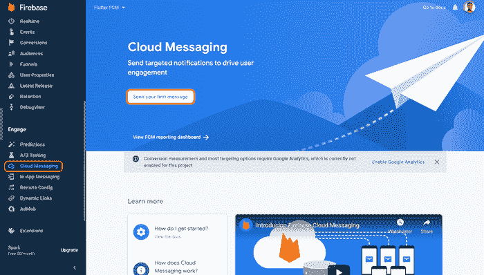

输入通知标题、文本和名称，然后点击下一个的**:**

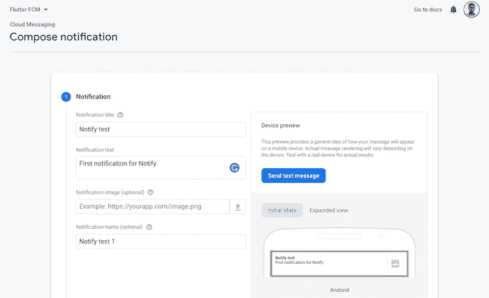

将**目标**设置为您的 Android 或 iOS 应用，或者两者都是。点击**下一个**:

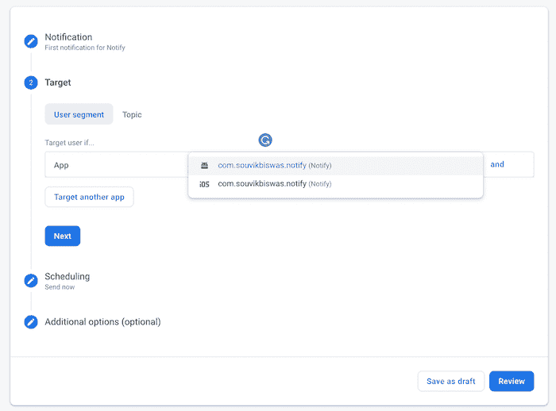

将**排班**指定为`Now`。点击**下一个**:

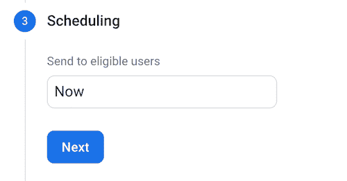

对于一个简单的通知，您不需要在**附加选项**字段中提供任何内容。点击**查看**:

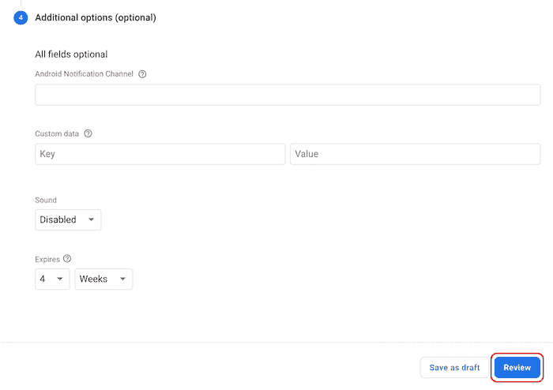

点击**发布**发送通知。不用担心顶部的警告；它告诉我们，我们还没有为这个项目设置谷歌分析:

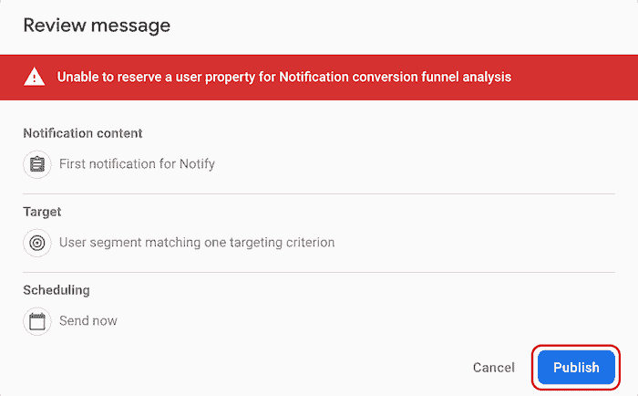

您可以通过在**附加选项**中指定以下选项来发送数据。值为`FLUTTER_NOTIFICATION_CLICK`的`click_action`键是必需的。否则，您的应用将无法在设备上检索数据信息:


点击**审核**，然后**发布**发送数据通知。

## 结论

如果你已经做到了这一点，你应该对什么是推送通知，如何将推送通知功能与 Flutter 应用程序集成，以及如何使用 Firebase 云消息发送推送通知有了坚实的理解。

在 Flutter 中实现推送通知时，您可以探索无数其他定制。为了继续构建本文中的 [Flutter 示例，我建议添加 Firebase 认证](https://blog.logrocket.com/implementing-firebase-authentication-in-a-flutter-app/)。

我希望你喜欢这篇文章，如果你有任何问题，一定要留下评论！

## 使用 [LogRocket](https://lp.logrocket.com/blg/signup) 消除传统错误报告的干扰

[](https://lp.logrocket.com/blg/signup)

[LogRocket](https://lp.logrocket.com/blg/signup) 是一个数字体验分析解决方案，它可以保护您免受数百个假阳性错误警报的影响，只针对几个真正重要的项目。LogRocket 会告诉您应用程序中实际影响用户的最具影响力的 bug 和 UX 问题。

然后，使用具有深层技术遥测的会话重放来确切地查看用户看到了什么以及是什么导致了问题，就像你在他们身后看一样。

LogRocket 自动聚合客户端错误、JS 异常、前端性能指标和用户交互。然后 LogRocket 使用机器学习来告诉你哪些问题正在影响大多数用户，并提供你需要修复它的上下文。

关注重要的 bug—[今天就试试 LogRocket】。](https://lp.logrocket.com/blg/signup-issue-free)