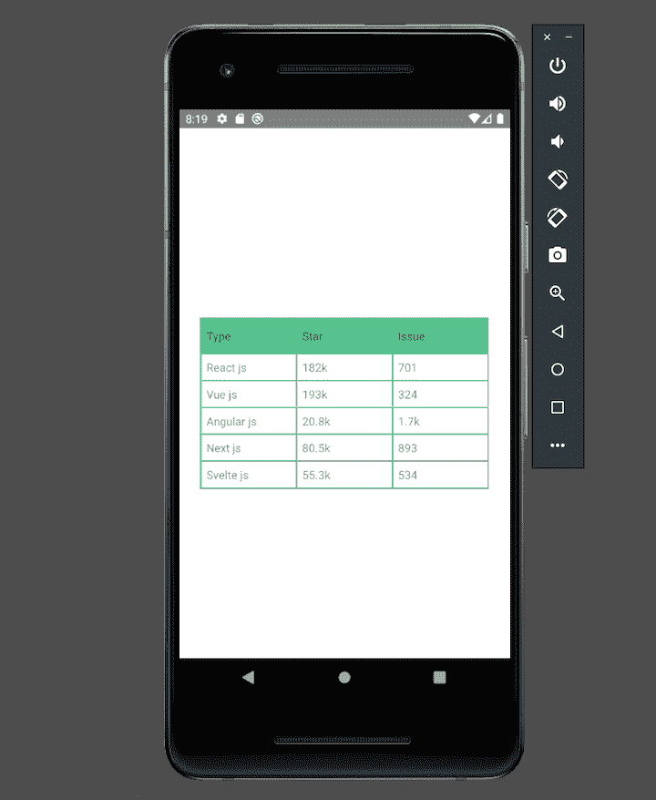
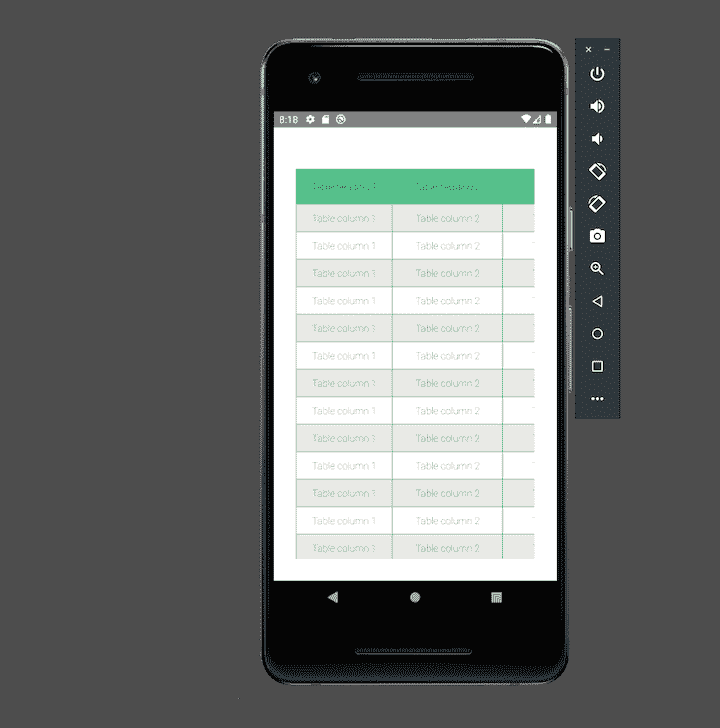

# 将复选框和表格添加到 React Native app 

> 原文：<https://blog.logrocket.com/adding-checkboxes-tables-react-native-app/>

复选框和表格是许多移动应用程序的有用补充。复选框可以增加应用程序的交互性，而表格有利于显示数据。不幸的是，从头开始创建复选框和表格组件可能是一个冗长乏味的过程。

在本文中，我们将演示如何轻松地为 React 原生 iOS 或 Android 应用程序创建和样式化表格和复选框。我们将回顾 React 本地复选框和表的各个组件和属性。我们还将演示如何向 React 本机应用程序添加不同类型的复选框和表格。

作为本文的先决条件，完成运行 React 本机应用程序所需的基本设置。关于如何在本地机器上设置 React Native 开发环境的概述，请参考[官方文档](https://reactnative.dev/docs/environment-setup)。你可能还希望[使用一个工具链，比如 Create React App](https://blog.logrocket.com/getting-started-with-create-react-app-d93147444a27/) 。

## 创建 React 本机项目

运行以下命令来初始化 React 本机项目:

```
npx react-native init tablechekboxExample

```

这将创建一个带有基本模板的新 RN 项目。

根据您想要在 iOS 还是 Android 上运行项目，使用以下命令之一:

```
yarn run ios or npm run ios

yarn run android or npm run android

```

## 在 React Native 中构建复选框

让我们看看如何在 React Native 中创建复选框。

首先，通过运行以下命令安装 [`@react-native-community/checkbox`](https://www.npmjs.com/package/@react-native-community/checkbox) 包:

```
yarn add @react-native-community/checkbox or npm install @react-native-community/checkbox

```

### 检查复选框属性

在将复选框添加到应用程序之前，让我们先回顾一下 React Native 中的复选框通用属性:

*   `onChange`是一个函数属性。它用于触发本机输入事件
*   `value`是一个布尔属性。它用于为复选框赋值。当复选框的`value`发生变化时，它会更新。复选框的默认`value`为`false`
*   `disabled`是一个布尔属性。它用于验证复选框是否已启用。该属性的默认值为`false`
*   `onValueChange`是一个回调函数。它更新`value`属性来反映用户的动作。

以下是 iOS 应用程序的一些 React 原生复选框属性:

*   `hideBox`是一个布尔属性，用于指定该框是否应该隐藏。该属性的默认值为`false`
*   `lineWidth`是一个数字属性。它用于指定复选标记和框线的宽度。该属性的默认值是 2.0 像素
*   `boxType`是圆形或方形的属性。它用于指定要使用的框的类型。该属性默认为圆形
*   `tintColor`是一个布尔属性，用于在复选框关闭时添加框的颜色。它的默认值是#aaaaaa
*   `onCheckColor`用于检查复选标记颜色。该属性默认为#007aff
*   `onFillColor`用于检查复选框的内部颜色。该属性默认为透明
*   `animationDuration`用于添加任何动画的持续时间。该属性默认为 0.5 秒
*   `onAnimationType`用于指定复选框被选中时应使用的动画类型。该属性默认为`stroke`
*   `offAnimationType`用于指定复选框未选中时应使用的动画类型

以下是 Android 应用程序的 React 本机复选框属性:

*   `tintColors`是一个布尔属性。当复选框被选中时，`true`有一个颜色值，当复选框未被选中时，`false`有一个颜色值

有关 React 本地复选框属性的更多信息，请参考[官方文档](https://github.com/react-native-checkbox/react-native-checkbox)。

### 向 React 本机应用程序添加复选框

既然我们已经查看了复选框属性，那么让我们将复选框添加到 React 本地应用程序示例中。在我们的例子中，用户将从流行的前端框架列表中进行选择，然后单击多个复选框来保存结果。

以下是 React Native 复选框示例的代码:

```
import React, {Component} from 'react';
import {Platform, StyleSheet, Text, View, Button} from 'react-native';
import CheckBox from '@react-native-community/checkbox';
const initialState = {
  react: false,
  next: false,
  vue: false,
  angular: false,
};
export default function Checkbox() {
  const [state, setState] = React.useState(initialState);
  const [toggleButton, setToggleButton] = React.useState(false);
  return (
    <View style={styles.container}>
      <View>
        <View>
          <View style={styles.checkboxWrapper}>
            <CheckBox
              value={state.react}
              onValueChange={value =>
                setState({
                  ...state,
                  react: value,
                })
              }
            />
            <Text>React js</Text>
          </View>
          <View style={styles.checkboxWrapper}>
            <CheckBox
              value={state.next}
              onValueChange={value =>
                setState({
                  ...state,
                  next: value,
                })
              }
            />
            <Text>Next js</Text>
          </View>
          <View style={styles.checkboxWrapper}>
            <CheckBox
              value={state.vue}
              onValueChange={value =>
                setState({
                  ...state,
                  vue: value,
                })
              }
            />
            <Text>Vue js</Text>
          </View>
          <View style={styles.checkboxWrapper}>
            <CheckBox
              value={state.angular}
              onValueChange={value =>
                setState({
                  ...state,
                  angular: value,
                })
              }
            />
            <Text>Angular js</Text>
          </View>
        </View>
        <Button
          onPress={() => setToggleButton(toggleButton => !toggleButton)}
          title="Save"
        />
      </View>
      {toggleButton && (
        <View style={styles.resultContainer}>
          {Object.entries(state).map(([key, value]) => {
            return (
              value && (
                <View key={key} style={{paddingHorizontal: 5}}>
                  <Text>{key}</Text>
                </View>
              )
            );
          })}
        </View>
      )}
    </View>
  );
}
const styles = StyleSheet.create({
  textInput: {
    borderColor: 'gray',
    borderWidth: 1,
  },
  resultContainer: {
    flexDirection: 'row',
    padding: 10,
  },
  container: {
    flex: 1,
    justifyContent: 'center',
    alignItems: 'center',
    backgroundColor: '#F5FCFF',
  },
  checkboxWrapper: {
    flexDirection: 'row',
    alignItems: 'center',
    paddingVertical: 5,
  },
});

```

React 本机应用程序中的复选框如下:


## 在 React Native 中构建表格

现在，让我们回顾一下如何使用 [`react-native-table-component`](https://www.npmjs.com/package/react-native-table-component) npm 包在 React 本机应用程序中构建一个表。

通过运行以下命令安装 [`react-native-table-component`](https://www.npmjs.com/package/react-native-table-component) 包:

```
yarn add react-native-table-component or npm install react-native-table-component

```

### 查看 React 本机表属性

React 原生表由几个组件组成:`Table`、`TableWrapper`、`Row`、`Rows`、`Col`、`Cols`和`Cell`。可以使用以下属性在 React 本机应用程序中配置每个组件:

*   `data`有一个数组的数据显示在`Table`中
*   `widthArr`增加每列的宽度
*   `heightArr`增加每列的高度
*   `style`为`Table`容器添加 CSS 样式
*   `textStyle`为`Table`单元格内的文本添加样式
*   `borderStyle`指定`Table`外部线条的颜色和宽度

### 设置基本表

现在，我们将创建一个显示表数据的基本示例表 UI。

下面是 React 本机表组件的代码:

```
import React from 'react';
import {StyleSheet, View} from 'react-native';
import {Table, Row, Rows} from 'react-native-table-component';
const tableData = {
  tableHead: ['Type', 'Stars', 'Issues'],
  tableData: [
    ['React js', '182k', '701'],
    ['Vue js', '193k', '324'],
    ['Angular js', '20.8k', '1.7k'],
    ['Next js', '80.5k', '893'],
    ['Svelte js', '55.3k', '534'],
  ],
};
function TableSample() {
  const [data, setData] = React.useState(tableData);
  return (
    <View style={styles.container}>
      <Table borderStyle={{borderWidth: 2, borderColor: '#42b983'}}>
        <Row
          data={data.tableHead}
          style={styles.head}
          textStyle={styles.text}
        />
        <Rows data={data.tableData} textStyle={styles.text} />
      </Table>
    </View>
  );
}
export default TableSample;
const styles = StyleSheet.create({
  container: {
    flex: 1,
    padding: 10,
    justifyContent: 'center',
    backgroundColor: '#fff',
    paddingTop: 20,
  },

  head: {height: 44, backgroundColor: '#42b983'},
  text: {margin: 6},
});

```

React 原生应用中的基本表格如下:



现在，我们将创建一个带有固定标题以及水平和垂直滚动条的表格 UI。我们将使用 React Native 的`ScrollView`来添加滚动功能。

下面是可滚动表格示例的代码:

```
import React from 'react';
import {StyleSheet, View, ScrollView} from 'react-native';
import {Table, Row} from 'react-native-table-component';
const tableDataSample = {
  tableHead: [
    'Table heading 1',
    'Table heading 2',
    'Table heading 3',
    'Table heading 4',
    'Table heading 5',
    'Table heading 6',
    'Table heading 7',
    'Table heading 8',
    'Table heading 9',
  ],
  widthArr: [140, 160, 180, 100, 120, 140, 160, 180, 200],
  tableData: [['Table column 1', 'Table column 2', 'Table column 3', 'Table column 4', 'Table column 5', 'Table column 6', 'Table column 7', 'Table column 8', 'Table column 9'],
        ['Table column 1', 'Table column 2', 'Table column 3', 'Table column 4', 'Table column 5', 'Table column 6', 'Table column 7', 'Table column 8', 'Table column 9'],
        ['Table column 1', 'Table column 2', 'Table column 3', 'Table column 4', 'Table column 5', 'Table column 6', 'Table column 7', 'Table column 8', 'Table column 9'],
        ['Table column 1', 'Table column 2', 'Table column 3', 'Table column 4', 'Table column 5', 'Table column 6', 'Table column 7', 'Table column 8', 'Table column 9'],
        ['Table column 1', 'Table column 2', 'Table column 3', 'Table column 4', 'Table column 5', 'Table column 6', 'Table column 7', 'Table column 8', 'Table column 9'],
        ['Table column 1', 'Table column 2', 'Table column 3', 'Table column 4', 'Table column 5', 'Table column 6', 'Table column 7', 'Table column 8', 'Table column 9'],
        ['Table column 1', 'Table column 2', 'Table column 3', 'Table column 4', 'Table column 5', 'Table column 6', 'Table column 7', 'Table column 8', 'Table column 9'],
        ['Table column 1', 'Table column 2', 'Table column 3', 'Table column 4', 'Table column 5', 'Table column 6', 'Table column 7', 'Table column 8', 'Table column 9'],
        ['Table column 1', 'Table column 2', 'Table column 3', 'Table column 4', 'Table column 5', 'Table column 6', 'Table column 7', 'Table column 8', 'Table column 9'],
        ['Table column 1', 'Table column 2', 'Table column 3', 'Table column 4', 'Table column 5', 'Table column 6', 'Table column 7', 'Table column 8', 'Table column 9'],
        ['Table column 1', 'Table column 2', 'Table column 3', 'Table column 4', 'Table column 5', 'Table column 6', 'Table column 7', 'Table column 8', 'Table column 9'],
        ['Table column 1', 'Table column 2', 'Table column 3', 'Table column 4', 'Table column 5', 'Table column 6', 'Table column 7', 'Table column 8', 'Table column 9'],
        ['Table column 1', 'Table column 2', 'Table column 3', 'Table column 4', 'Table column 5', 'Table column 6', 'Table column 7', 'Table column 8', 'Table column 9'],
    ],
};
export default function ScrollableTable() {
  const [data, setData] = React.useState(tableDataSample);
  return (
    <View style={styles.container}>
      <ScrollView horizontal={true}>
        <View>
          <Table borderStyle={{borderWidth: 1, borderColor: '#42b983'}}>
            <Row
              data={data.tableHead}
              widthArr={data.widthArr}
              style={styles.header}
              textStyle={styles.text}
            />
          </Table>
          <ScrollView style={styles.scrollContainer}>
            <Table borderStyle={{borderWidth: 1, borderColor: '#42b983'}}>
              {data.tableData.map((rowData, index) => (
                <Row
                  key={index}
                  data={rowData}
                  widthArr={data.widthArr}
                  style={[
                    styles.rowSection,
                    index % 2 && {backgroundColor: '#fff'},
                  ]}
                  textStyle={styles.text}
                />
              ))}
            </Table>
          </ScrollView>
        </View>
      </ScrollView>
    </View>
  );
}
const styles = StyleSheet.create({
  container: {flex: 1, padding: 16, paddingTop: 30, backgroundColor: '#fff'},
  rowSection: {height: 40, backgroundColor: '#E7E6E1'},
  header: {height: 50, backgroundColor: '#42b983'},
  text: {textAlign: 'center', fontWeight: '100', color: 'black'},
  scrollContainer: {},
});

```

React 原生应用中的可滚动表格如下:



## 结论

在本文中，我们研究了如何在 React Native 中构建和样式化复选框和表格。我们回顾了单独的 React Native 复选框和表属性。我们还演示了如何向 React 本机应用程序添加复选框、一个基本表格和一个具有固定标题以及水平和垂直滚动的表格。

本文中使用的项目的完整代码可以在这个 [GitHub repo](https://github.com/mukeshmandiwal/tablechekboxExample) 中获得。

## [LogRocket](https://lp.logrocket.com/blg/react-native-signup) :即时重现 React 原生应用中的问题。

[](https://lp.logrocket.com/blg/react-native-signup)

[LogRocket](https://lp.logrocket.com/blg/react-native-signup) 是一款 React 原生监控解决方案，可帮助您即时重现问题、确定 bug 的优先级并了解 React 原生应用的性能。

LogRocket 还可以向你展示用户是如何与你的应用程序互动的，从而帮助你提高转化率和产品使用率。LogRocket 的产品分析功能揭示了用户不完成特定流程或不采用新功能的原因。

开始主动监控您的 React 原生应用— [免费试用 LogRocket】。](https://lp.logrocket.com/blg/react-native-signup)