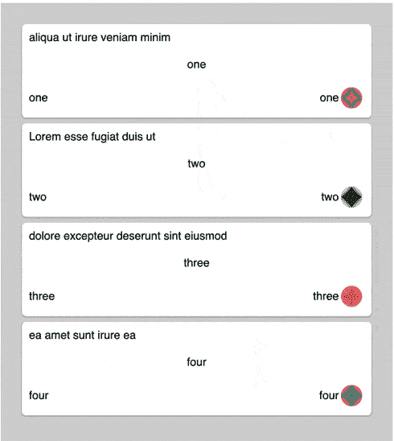

# 添加拖放功能与反应-美丽-dnd-log 火箭博客

> 原文：<https://blog.logrocket.com/adding-drag-and-drop-functionality-with-react-beautiful-dnd/>

如果您曾经使用过吉拉、Trello、Confluence 或任何其他 Atlassian 产品，您可能会遇到拖放功能，该功能允许用户在多个(有时是巨大的)列表中拖动项目。这是一个非常有用的功能，似乎总是很顺利，但将这一功能构建到应用程序中可能是一个挑战。

## 什么是 react-beautiful-dnd？

进入 [react-beautiful-dnd](https://github.com/atlassian/react-beautiful-dnd) ，Atlassian 的开源库允许 web 开发人员轻松地将拖放功能集成到他们的应用程序中。react-beautiful-dnd 是 react 世界中目前最流行的拖放库，如果您想在自己的站点上实现拖放功能，这是一个不错的选择。

首先，我们来看看 react-beautiful-dnd 的一些重要特性，看看是什么让它如此受欢迎。

1.  它是高度可定制的。库尽量做到无头，也就是说动画周围只有一些基本的样式。它们是可调整的，可以由您自己的实现来替换。你甚至可以实现自己的传感器，用鼠标以外的其他输入源来控制拖放列表，比如键盘(没有限制，如示例中的[所示)](https://github.com/atlassian/react-beautiful-dnd/blob/master/docs/sensors/sensor-api.md)
2.  没有创建额外的 DOM 节点，这意味着构建布局是简单且可预测的，确保您可以轻松地设计您的拖放项目和列表
3.  除了第一点，react-beautiful-dnd 还提供了广泛的选项和元数据，允许您用它创建无限的组合和不同的用例

查看来自[官方文档](https://github.com/atlassian/react-beautiful-dnd#currently-supported-feature-set-)的所有特性的综合列表。

## 使用 react-beautiful-dnd 组件实现拖放功能

该库深度集成到 React 生态系统中，这意味着所有功能都是围绕关键的 React 组件构建和控制的。

这是包含关于拖放列表的所有信息的上下文。它基于 React 上下文，所以您应该用这个元素包装所有与拖放相关的内容，以使它正常工作。此外，它接受`onDrag`函数，这是控制列表数据的关键回调函数。我们将在稍后讨论更多细节。

此元素包含您的列表和放置区域，当放置元素时，该区域将成为源。它必须用一个`droppableId`来标识，并且必须包装在一个返回 React 元素的函数中。这个函数用一些内部参数和一个包含列表状态信息的`snapshot`参数来调用。这可用于围绕该元素的事件的样式化或回调。

这是所有列表元素的容器。您必须用这个元素包装列表中的每一项。类似于`Droppable`元素，`Children`元素是一个用`Snapshot`属性调用的函数。

为了演示如何使用这些元素，我将向您展示一些示例。我们将创建两个基本示例来演示该库的主要特性。第一个将是简单的，将显示元素如何一起工作。第二个将更先进，包含多个列表，类似于一个 Trello 板，以展示这个库的能力。

## 用 react-beautiful-dnd 构建一个拖放列表

### 数据结构

首先，我们需要一些数据来进行演示:

```
interface DataElement {
    id: string;
    content: string;
}

type List = DataElement[]

```

在这个结构中，我们希望可视化一个`DataElements`的列表，并可以在列表中拖放元素。

### 设置拖放元素

让我们首先创建我们需要的元素，以便为拖放操作准备好列表。正如我们在上面学到的，第一步是创建一个`DragDropContext`来包含我们想要的列表中的所有内容。

在其中，我们创建一个可拖放的容器并映射到我们的`DataElements`，然后为每个容器呈现一个`Draggable`元素。为每个元素渲染什么由您决定。为了简单起见，我们将呈现一个准备好的`ListElement`组件，该组件在内部仅采用元素的样式来使其漂亮，但与文章无关。

```
function DragAndDropList() {
    return (
        <DragDropContext>  
            <Droppable droppableId="droppable" >  
                {(provided, snapshot) => (  
                    <div  
                        {...provided.droppableProps}  
                        ref={provided.innerRef}  
                    >  
                        {elements.map((item, index) => (  
                            <Draggable draggableId={item.id} index={index}>  
                                {(provided, snapshot) => (  
                                   <div  
                                     ref={provided.innerRef}  
                                     {...provided.draggableProps}  
                                     {...provided.dragHandleProps}  
                                   >  
                                    <ListItem item={item} />
                                   </div>  
                                )}  
                            </Draggable>  
                        ))}  
                    </div>  
                )}  
            </Droppable>  
        </DragDropContext>
    )
}
```

出于示例的目的，我们还将省略对列表的样式设置，但这实际上是将数据显示在一个列表中，一个在另一个下面。使用 react-beautiful-dnd 的神奇之处在于，仅仅通过编写这段代码，就已经可以抓取元素了。列表和元素也能正确显示。

但是，正如您在下面的示例中看到的，如果您将元素移动到不同的位置，该元素将短暂地停留在正确的位置，但是列表将跳回其先前的状态，并且该元素将处于其原始位置。



这样做的原因是底层数据数组中元素的顺序保持不变，因为 react-beautiful-dnd 不处理您的数据，也不应该对此负责。相反，react-beautiful-dnd 只会激活状态，并给你适当的回调来处理数据。

我们的工作是在正确的时间以正确的形式存储数据。所以，现在我们需要在项目被放下时设置一个钩子，并正确地操作我们的数据。

首先，让我们将数据置于 React 状态，以便于更改和操作:

```
function DragAndDropList() {
    const [items, setItems] = useState(baseData)
    return (...)
}

```

为了进入拖放动画的生命周期，我们可以在我们的`DragDropContext`中添加一个`onDragEnd`函数:

```
<DragDropContext onDragEnd={onDragEnd}>

```

现在，我们需要在组件内部实现这个函数，以便在调用这个函数时以正确的方式塑造我们的状态。为了获得我们需要的所有信息，该函数接收以下结果对象作为参数。该对象具有以下结构和属性:

```
interface DraggableLocation {
    droppableId: string;
    index: number;
}

interface Combine {
    draggableId: string;
    droppableId: string;
}

interface DragResult {
    reason: 'DROP' | 'CANCEL';
    destination?: DraggableLocation;
    source: DraggableLocation;
    combine?: Combine;
    mode: 'FLUID' | 'SNAP';
    draggableId: DraggableId;
}

```

这个结果对象包含了关于我们需要如何操作数据的所有信息，这样它就不会跳回到先前的位置。

这里最重要的两个属性是`destination`和`source`。顾名思义，`source`包含元素之前所在位置的信息，而`destination`包含元素被丢弃的位置。

这两个属性都包含了`droppableId`和`index`，我们需要这两个属性来操作我们的数据数组。现在我们已经拥有了所需的一切，让我们写下我们希望如何改变数据阵列的逻辑。

* * *

### 更多来自 LogRocket 的精彩文章:

* * *

```
function DragAndDropList() {
    const [items, setItems] = useState(baseData)

    function onDragEnd(result) {
        const newItems = [...items];
        const [removed] = newItems.splice(result.source.index, 1);
        newItems.splice(result.destination.index, 0, removed);
        setItems(newItems)
    }

    return (...)
}

```

这里，我们使用了`source.index`和`destination.index`在正确的地方修改我们的数据。

一般来说，这就是我们拥有一个全功能的拖放列表所需要的。但是在我们继续之前，让我们添加一个小功能，使它不容易出错。从定义中可以看出，`destination`属性可以是`undefined`。这意味着该元素没有被放入`droppable`元素中。

只需添加几行代码来防止这种行为:

```
function onDragEnd(result) {
    if (!result.destination) {
        return;
    }
    const newItems = [...items];
    const [removed] = newItems.splice(result.source.index, 1);
    newItems.splice(result.destination.index, 0, removed);
    setItems(newItems)
}

```

就是这样！这是整个工作流程。

## 用 react-beautiful-dnd 构建多个拖放列表

现在我们已经看到了基本的功能，让我们来看一个稍微高级一点，但使用频率更高的用例。

也许您有多个列表，并且希望不仅在每个列表中，而且在列表之间拖放项目，就像在看板上一样。有了 react-beautiful-dnd，你可以做到这一点。让我们首先呈现多个列表，并使从一个列表到另一个列表的拖放成为可能。

与第一个例子类似，我们需要将所有东西都包装在`DragDropContext`中。此外，我们需要创建一个常量，它包含关于我们想要什么列表的信息，并对其进行迭代以呈现所有需要的`lists`元素:

```
const lists = ['todo', 'inProgress', "done"];

function DragList() {  
    return (  
        <DragDropContext>  
            <ListGrid>
                {lists.map((listKey) => (  
                    <List elements={elements[listKey]} key={listKey} prefix={listKey} />  
                ))}
            </ListGrid>  
        </DragDropContext>
    );  
}

```

我们为数组中的每个元素返回的`list`元素几乎与上面的例子相同，唯一的例外是它不包含数据的状态或操作数据的功能。

因此，我们将只使用列表的渲染部分，它看起来像这样:

```
const DraggableElement = ({ prefix, elements }) => (  
    <Droppable droppableId={`${prefix}`}>  
        {(provided) => (  
            <div  
                {...provided.droppableProps}  
                ref={provided.innerRef}  
            \>  
                {elements.map((item, index) => (  
                        <ListItem key={item.id} item={item} index={index}/>  
                ))}  
                {provided.placeholder}
            </div>  
        )}  
    </Droppable>  
 )

```

给每个`list`和`Droppable`元素一个惟一的属性 ID，称为`droppableId`，这很关键。有了这个 ID，我们以后就可以识别这个元素来自哪个列表，以及它被放入了哪个列表。

### 管理状态

棘手的部分是决定在哪里以及如何保持我们的状态。因为我们可以拥有从一个列表到另一个列表变化的条目，所以我们需要将状态向上移动到保存所有列表的包装组件中。让我们从在`DragList`组件中创建一个状态开始，它看起来像这样:

```
const data = {
    todo: [
        {
            id: '91583f67-0617-4df2-bd74-3c018460da6c'
            listId: 'todo',
            content: 'random content'
        }, 
        ...

    ]: 
    inProgress: [...]
    done: [...]
}

```

理想情况下，我们可能会对状态使用一个`reducer`函数，但是为了让例子简短，我们将使用`useState`钩子。请注意，我们有一个包含所有列表数据的大对象。正如我们在单个拖放列表示例中所做的那样，我们还创建了函数`onDrag`:

```
const removeFromList = (list, index) => {  
    const result = Array.from(list);  
    const [removed] = result.splice(index, 1);  
    return [removed, result]  
}  

const addToList = (list, index, element) => {  
    const result = Array.from(list);  
    result.splice(index, 0, element);  
    return result  
}

const onDragEnd = (result) => {  
    if (!result.destination) {  
        return;  
    }  
    const listCopy = { ...elements }  

    const sourceList = listCopy[result.source.droppableId]  
    const [removedElement, newSourceList] = removeFromList(sourceList, result.source.index)  
    listCopy[result.source.droppableId] = newSourceList  

    const destinationList = listCopy[result.destination.droppableId\]  
    listCopy[result.destination.droppableId] = addToList(destinationList, result.destination.index, removedElement)  

    setElements(listCopy)  
}

```

正如您所看到的，代码本身看起来非常类似于单个列表的例子，但是我们现在必须考虑用`destination`和`source`属性标识的相应列表。

对我们来说幸运的是，`result`对象总是用`draggableId`属性提供这些信息，这对于了解元素来自哪个列表以及它们下一步要去哪里非常有用。您现在也可以在列表之间拖放项目。

这是完整的例子。

结论

## 拖放是一种广泛使用的功能，它可以使您的应用程序变得强大。react-beautiful-dnd 库提供了将拖放功能整合到应用程序中所需的所有功能。它是灵活的，非个人化的，动画效果非常好。

正如开源编程中的许多事情一样，大多数问题都可以被准确地解决。)使用库的开发者。很高兴看到像 Atlassian 这样的公司将他们的解决方案提供给世界其他地方，这样 web 开发人员就不必不断地从头开始构建功能。

使用 LogRocket 消除传统反应错误报告的噪音

## 是一款 React analytics 解决方案，可保护您免受数百个误报错误警报的影响，只针对少数真正重要的项目。LogRocket 告诉您 React 应用程序中实际影响用户的最具影响力的 bug 和 UX 问题。

[LogRocket](https://lp.logrocket.com/blg/react-signup-issue-free)

自动聚合客户端错误、反应错误边界、还原状态、缓慢的组件加载时间、JS 异常、前端性能指标和用户交互。然后，LogRocket 使用机器学习来通知您影响大多数用户的最具影响力的问题，并提供您修复它所需的上下文。

[ ](https://lp.logrocket.com/blg/react-signup-general) [  ](https://lp.logrocket.com/blg/react-signup-general) [LogRocket](https://lp.logrocket.com/blg/react-signup-issue-free)

关注重要的 React bug—[今天就试试 LogRocket】。](https://lp.logrocket.com/blg/react-signup-issue-free)

Focus on the React bugs that matter — [try LogRocket today](https://lp.logrocket.com/blg/react-signup-issue-free).