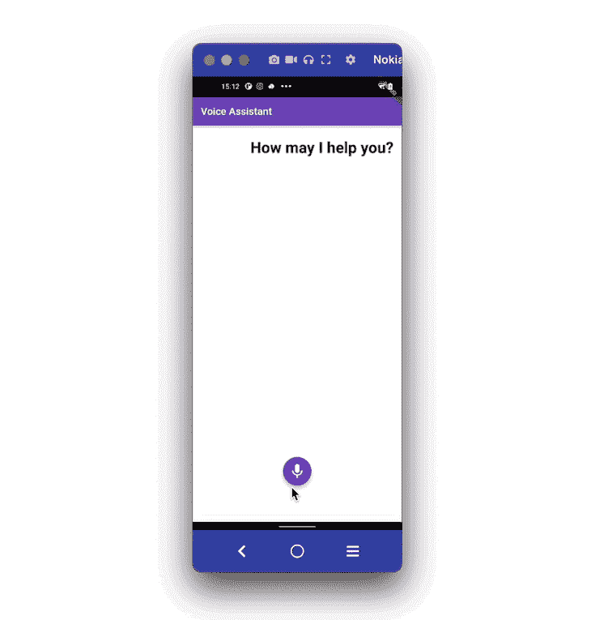
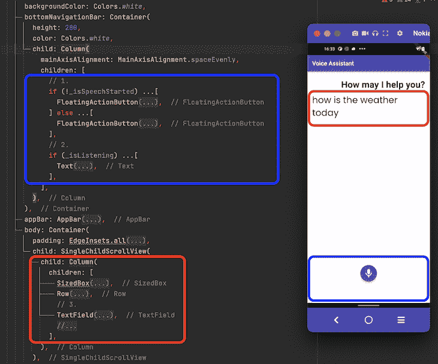
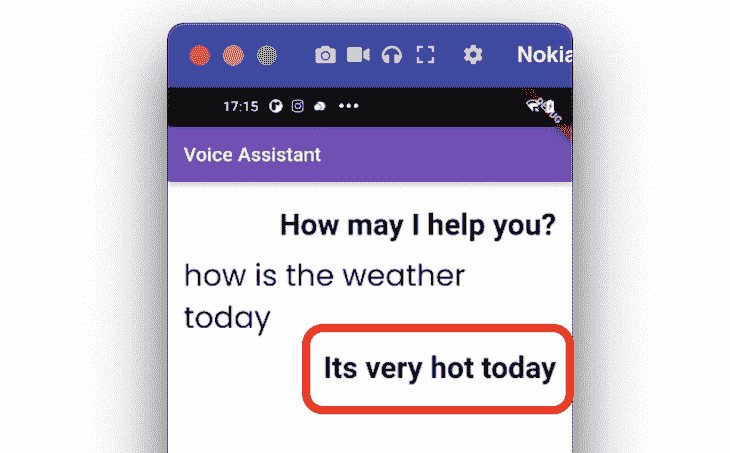
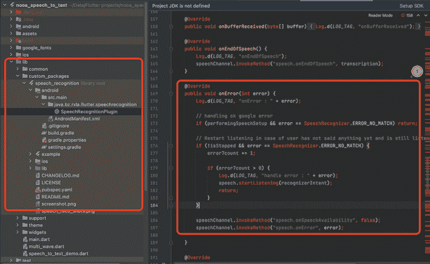

# 在 Flutter app 中添加语音到文本和文本到语音的支持

> 原文：<https://blog.logrocket.com/adding-speech-to-text-text-to-speech-support-flutter-app/>

语音到文本功能将您的语音转换为文本，文本到语音功能大声朗读文本。通过添加这一功能，用户可以通过语音(除了用户手势之外)与您的应用程序进行交互，从而增强用户体验。这可以帮助你建立一个类似谷歌助手的应用程序。

它的工作方式是，你说点什么或者问 app 点什么，app 处理你的请求，然后说出结果。

在本教程中，我们将使用[语音识别](https://pub.dev/packages/speech_recognition)和[文本到语音转换](https://pub.dev/packages/text_to_speech)插件构建一个例子。

我们将一步一步地介绍这个示例，为您构建语音助手应用程序打下基础。我们还将介绍插件默认不处理的情况，比如在 Android 设备上持续监听。

这是它完成后的样子:



以下是我们将在本教程中介绍的内容:

## 在 Flutter 应用程序中添加语音到文本

在示例应用程序中，当用户点击麦克风按钮时，应用程序开始监听。当用户开始说话时，语音被转换成文本并显示在屏幕上。用户可以通过单击停止按钮来停止监听服务。

您可以通过利用[语音识别](https://pub.dev/packages/speech_recognition)插件来实现这样的需求。在内部，它在 iOS 上使用[语音 API](https://developer.apple.com/reference/speech) ，在 Android 上使用[语音识别器](https://developer.android.com/reference/android/speech/SpeechRecognizer.html)。它允许您为支持 iOS10+和 Android 4.1+的设备添加任何语言环境的语音识别。

这个插件提供了几个有用的方法，你可以用来开始、停止和取消监听。

以下是在 Flutter 中添加语音到文本支持的分步说明。

### 步骤 1:添加依赖关系

第一步从在`pubspec.yaml`文件中添加依赖关系开始。

文件`pubspec.yaml`中的内容应该是这样的:

```
dependencies:
  flutter:
    sdk: flutter
  cupertino_icons: ^1.0.2
  speech_recognition: ^0.3.0+1 #NEW

```

### 步骤 2:添加权限

对于录制音频的插件，您需要获得 Android 和 iOS 平台的许可。为此，您可以更新特定于平台的文件。

#### **安卓系统**

在`your_project/android/app/src/main/AndroidManifest.xml`处找到`AndroidManifest.xml`文件，并按如下方式更新文件:

```
<manifest xmlns:android="http://schemas.android.com/apk/res/android"
    package="com.example.speech_to_text_demo">

    <!-- 1\. Permission -->
    <uses-permission android:name="android.permission.RECORD_AUDIO" />

    <!-- 2\. To overcome bind to recognition service failed issue -->
    <queries>
        <package android:name="com.google.android.googlequicksearchbox"/>
    </queries>

   <application
        android:label="speech_to_text_demo"
        android:name="${applicationName}"
        android:icon="@mipmap/ic_launcher">
        <activity
            android:name=".MainActivity"
            android:exported="true"
            android:launchMode="singleTop"
            android:theme="@style/LaunchTheme"
            android:configChanges="orientation|keyboardHidden|keyboard|screenSize|smallestScreenSize|locale|layoutDirection|fontScale|screenLayout|density|uiMode"
            android:hardwareAccelerated="true"
            android:windowSoftInputMode="adjustResize">
    </application>
</manifest>

```

下面是上面代码中的内容:

1.  添加`android.permission.RECORD_AUDIO`以录制音频
2.  这有助于您修复某些 Android 设备上的“绑定到识别服务失败问题”。

#### **对于 iOS**

在`your_project/ios/Runner/info.plist`找到`info.plist`文件，并添加以下权限:

```
<key>NSMicrophoneUsageDescription</key>
<string>This application needs to access your microphone</string>
<key>NSSpeechRecognitionUsageDescription</key>
<string>This application needs the speech recognition permission</string>

```

(注意:上述权限将在开始语音识别之前向用户显示一条消息)

### 步骤 3:添加必需的变量

在这一步中，您将添加维护应用程序状态所需的变量。例如，您必须需要一个变量来知道语音识别是否启动。这将有助于根据各种情况显示和隐藏小部件。

以下是您需要的一些重要变量:

```
// 1.
late SpeechRecognition _speech;
// 2.
bool _isSpeechStarted = false;
// 3.
bool _isListening = false;
// 4.
String transcription = '';
String currentText = '';
// 5.
bool _isEndOfSpeech = false;

```

1.  这将用于创建`SpeechRecognition`的实例，并在以后访问它来开始和停止监听
2.  这将用于显示/隐藏麦克风和停止按钮
3.  这将用于显示/隐藏“收听…”文本。虽然我们可以使用之前的变量(即`_isSpeechStarted`)，但是这个变量有助于了解用户是否在实际说话
4.  这是为了知道语音识别已经停止

### 步骤 4:构建页面 UI

页面 UI 由两个主要部分组成。第一部分显示语音助手和用户之间的对话；第二部分显示开始和停止语音识别的区域。

下面是这种情况下最少的代码:

```
SafeArea(
  child: Scaffold(
    backgroundColor: Colors.white,
    bottomNavigationBar: Container(
      height: 200,
      color: Colors.white,
      child: Column(
        mainAxisAlignment: MainAxisAlignment.spaceEvenly,
        children: [
          // 1\. <-- SEE HERE
          if (!_isSpeechStarted) ...[
            FloatingActionButton(
              backgroundColor: const Color(0xff764abc),
              child: Icon(
                Icons.mic,
                size: 35,
              ),
              onPressed: () {
                _startSpeechRecognition();
              },
            ),
          ] else ...[
            FloatingActionButton(
              backgroundColor: const Color(0xff764abc),
              child: Icon(
                Icons.stop,
                size: 35,
              ),
              onPressed: () {
                _stopSpeechRecognition();
              },
            ),
          ],
          // 2\. <-- SEE HERE
          if (_isListening) ...[
            Text(
              kListening,
              style: GoogleFonts.nunito(
                  textStyle:
                      TextStyle(color: Colors.black, fontSize: 22.5)),
            ),
          ],
        ],
      ),
    ),
    appBar: AppBar(
      title: Text('Voice Assistant'),
      backgroundColor: const Color(0xff764abc),
    ),
    body: Container(
      padding: EdgeInsets.all(16),
      child: SingleChildScrollView(
        child: Column(
          children: [
            SizedBox(
              height: 10,
            ),
            Row(
              mainAxisAlignment: MainAxisAlignment.end,
              children: [
                Text(
                  _ttsGreet,
                  style: GoogleFonts.poppins(
                    textStyle: TextStyle(
                        fontSize: 30.5, fontWeight: FontWeight.bold),
                  ),
                ),
              ],
            ),
            // 3\. <-- SEE HERE
            TextField(
              controller: _myController,
              readOnly: true,
              onChanged: (String text) {
                setState(() {
                  _isContentsPresent = text.isNotEmpty;
                });
              },
              //focusNode: _nodeText1,
              cursorColor: Colors.grey,
              style:
                  GoogleFonts.poppins(textStyle: TextStyle(fontSize: 30.5)),
              keyboardType: TextInputType.multiline,
              maxLines: null,
              decoration: InputDecoration(
                border: InputBorder.none,
                hintStyle: GoogleFonts.nunito(),
              ),
            ),
          ],
        ),
      ),
    ),
  ),
);

```

下面是上面代码的简要概述:

1.  该部分包含两个[浮动动作按钮](https://api.flutter.dev/flutter/material/FloatingActionButton-class.html)；一个启动语音识别，另一个停止。但是，基于`_isSpeechStarted`变量只显示一个
2.  这用于显示/隐藏“Listening…”文本
3.  语音到文本的结果(实际的用户语音命令)显示在这里。这里使用了`TextField`小部件，而不是`Text`小部件，使用户能够编辑语音命令(如果需要的话)

下面是如何将代码翻译到设计中:



### 步骤 5:添加语音识别方法

设置完变量和页面 UI 后，就该调用负责驱动语音识别特性的插件方法了。

下面是您将用来启动和停止识别服务的一些重要方法。

```
// 1.
void _activateSpeechRecognizer() {
  _requestPermission();
  _speech = new SpeechRecognition();
  _speech.setAvailabilityHandler(onSpeechAvailability);
  _speech.setRecognitionStartedHandler(onRecognitionStarted);
  _speech.setRecognitionResultHandler(onRecognitionResult);
  _speech.setRecognitionCompleteHandler(onRecognitionComplete);
  _speech
      .activate()
      .then((res) => setState(() => _speechRecognitionAvailable = res));
}
// 2.
void onRecognitionResult(String text) {
  if (_isEndOfSpeech) {
    _isEndOfSpeech = false;
    return;
  }
  setState(() {
    transcription = text;
    _isListening = true;
    print('recognized text is- $transcription');
    _myController.text = transcription;
    _myController.selection = TextSelection.fromPosition(
        TextPosition(offset: _myController.text.length));
  });
}
// 3.
void onRecognitionComplete() {
  print('Recognition Completed');

  if (transcription.isNotEmpty) {
    _isContentsPresent = true;
    _processRequest(transcription);
    _toggleSpeechRecognitionStatus(isSpeechStarted: false);
  }
}

```

1.  这将在后台激活语音识别器。页面一加载，就必须调用这个函数
2.  这将在`TextField`小工具上输出识别结果
3.  当用户完成提供语音命令时，将调用这个函数。在这里，您可以获取转录(语音转换为文本)并执行业务逻辑或任何您想对转录执行的操作

厉害！您现在知道如何添加语音到文本支持。让我们假设您已经处理了请求，是时候说出结果了。让我们看看如何做到这一点。

## 在 Flutter 应用程序中添加文本到语音

在示例应用中，在屏幕上显示用户的语音命令后，语音命令被处理，结果由语音助手读出(除了在屏幕上显示之外)。

您可以通过利用[文本到语音](https://pub.dev/packages/text_to_speech) (TTS)插件来实现这样的需求。它可以在 iOS、Android、web 和 macOS 上运行。有了这个插件，你还可以改变声音的**音量**、**速率、**和**音高**。

以下是添加文本到语音转换支持的分步说明:

### 步骤 1:添加依赖关系

在`pubspec.yaml`文件中添加[文本到语音](https://pub.dev/packages/text_to_speech)的依赖关系。

`pubspec.yaml`文件中的内容应该是这样的:

```
dependencies:
  flutter:
    sdk: flutter
  cupertino_icons: ^1.0.2
  speech_recognition: ^0.3.0+1 
  text_to_speech:  #NEW

```

### 步骤 2:添加权限

对于朗读文本的插件，您只需启用 Android 平台的权限。

下面是`AndroidManifest.xml`(位于 your _ project/Android/app/src/main/Android manifest . XML)文件的样子:

```
<manifest xmlns:android="http://schemas.android.com/apk/res/android"
    package="com.example.speech_to_text_demo">

    <queries>
        <package android:name="com.google.android.googlequicksearchbox"/>
        <intent>
            <action android:name="android.intent.action.TTS_SERVICE" />
        </intent>
    </queries>

   <application
    </application>
</manifest>

```

### 步骤 3:添加必需的变量

在这一步中，您将添加启动并将消息传递给 TTS(文本到语音)服务所需的变量。

以下是您需要的一些变量:

```
// 1.
TextToSpeech tts = TextToSpeech();
// 2.
String _ttsGreet = 'How may I help you?';
// 3.
String _ttsStaticResult = 'Its very hot today';

```

1.  这将创建一个`TextToSpeech`实例，您可以用它来触发 TTS 服务
2.  这是页面加载后显示的问候消息
3.  这是为了显示和说出一个假消息

### 步骤 4:构建页面 UI

页面 UI 只是在一个文本小部件中显示一条问候消息和一条回答用户查询的消息(在用户查询下方)。

为了简单起见，页面 UI 保持简单。您可以扩展它并使用 ListView 来构建最符合您需求的灵活的 UI。

代码如下所示:

```
if (_isShowResult)
  Row(
    mainAxisAlignment: MainAxisAlignment.end,
    children: [
      Text(
        _ttsStaticResult,
        //textAlign: TextAlign.end,
        style: GoogleFonts.poppins(
          textStyle: TextStyle(
              fontSize: 30.5, fontWeight: FontWeight.bold),
        ),
      ),
    ],
  ),

```



### 步骤 5:添加文本

如果您已经设置了变量和页面 UI，那么您可以通过在`TextToSpeech`的实例上调用`speak()`方法，在处理用户查询之后触发语音。

你可以这样做:

```
_processRequest(String transcription) {
  // Process request here
  /// Your business logic here
  //Speak out the result
  setState(() {
    _isShowResult = true;
  });
  _tts(_ttsStaticResult);
}

_tts(String message) {
  tts.speak(message); //<-- SEE HERE
}

```

恭喜你！现在您知道如何添加文本到语音的支持。

## 在 Android 上实现持续收听

当你运行带有语音识别插件的应用程序时，你可能会发现 Android 中的语音识别与 iOS 略有不同。

在安卓系统中，当你启动服务，一会儿不说话，系统会自动停止监听(在 iOS 系统中不是这样的)。

从技术上来说，它应该保持服务开放，直到用户开始说话——插件目前没有解决方案，所以我会解释如何自己修复它。

在 Android 上启用持续监听的步骤如下:

1.  下载插件代码并将其放在 lib/custom_package 文件夹中
2.  在 lib/custom package/package folder/Android/src/main/Java/BZ/rxla/flutter/speech recognition 打开`SpeechRecognitionPlugin`文件。
3.  用以下代码替换 onError 方法

```
@Override
public void onError(int error) {
Log.d(LOG_TAG, "onError : " + error);
// handling ok google error
if (performingSpeechSetup && error == SpeechRecognizer.ERROR_NO_MATCH) return;

// Restart listening in case of user has not said anything yet and is still listening i.e not stopped by user
if (!isStopped && error == SpeechRecognizer.ERROR_NO_MATCH) {
    error7count += 1;
if (error7count &gt; 0) {
    Log.d(LOG_TAG, "handle error : " + error);
    speech.startListening(recognizerIntent);
    return;
}
}
speechChannel.invokeMethod("speech.onSpeechAvailability", false);
speechChannel.invokeMethod("speech.onError", error);
}

```

这里的想法是当遇到`SpeechRecognizer.ERROR_NO_MATCH`错误(当服务自动停止时弹出)时重新启动语音识别。

按照上面的代码进行更改后，只要用户手动停止，语音识别服务就会一直运行(这正是我们想要的)。

它看起来是这样的:



完整的源代码可以在[这里](https://github.com/pinkeshdarji/speech_to_text_and_text_to_speech)找到。

## 结论

添加语音到文本和文本到语音功能可以为用户提供与您的应用程序交互的附加功能。

在本教程中，我们首先看了如何添加语音到文本，然后探讨了添加文本到语音服务。

我们通过一步一步的说明来设置变量、UI 和方法。我们还学习了如何为 Android 设备启用持续监听。

## 使用 [LogRocket](https://lp.logrocket.com/blg/signup) 消除传统错误报告的干扰

[](https://lp.logrocket.com/blg/signup)

[LogRocket](https://lp.logrocket.com/blg/signup) 是一个数字体验分析解决方案，它可以保护您免受数百个假阳性错误警报的影响，只针对几个真正重要的项目。LogRocket 会告诉您应用程序中实际影响用户的最具影响力的 bug 和 UX 问题。

然后，使用具有深层技术遥测的会话重放来确切地查看用户看到了什么以及是什么导致了问题，就像你在他们身后看一样。

LogRocket 自动聚合客户端错误、JS 异常、前端性能指标和用户交互。然后 LogRocket 使用机器学习来告诉你哪些问题正在影响大多数用户，并提供你需要修复它的上下文。

关注重要的 bug—[今天就试试 LogRocket】。](https://lp.logrocket.com/blg/signup-issue-free)