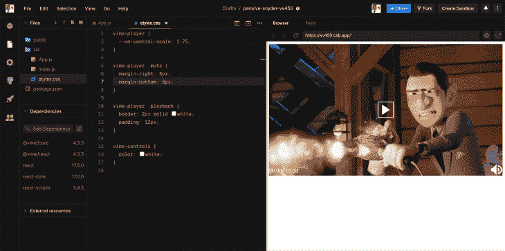

# 用 Vime.js 添加视频

> 原文：<https://blog.logrocket.com/adding-video-with-vime-js/>

## 介绍

Vime.js 是一个现代的框架无关的媒体播放器。它支持视频托管服务，如 Youtube、Vimeo、Dailymotion、HTML5 等。它允许使用 [HTMLMediaElement](https://developer.mozilla.org/en-US/docs/Web/API/HTMLMediaElement) 加载、播放和控制媒体文件。所以它支持添加本地视频文件。

自托管视频有许多缺点，包括性能问题、存储挑战等。网络视频也没有单一的文件格式标准，因此，不同的主流浏览器支持不同的格式。

火狐支持`Ogg`或`WebM`视频，但不支持`H.264`。Safari 支持`H.264 (MP4)`视频，但不支持`WebM`或`Ogg`。谢天谢地，Chrome 支持所有主要的视频格式。这些可以通过使用 YouTube 或 Vimeo 这样的视频共享平台来调和。然而，这种方法也有其局限性。

在我们想要来自多个平台的视频的场景中，我们可能必须为每个平台编写不同的逻辑。因此，我们的代码不是干的。Vime.js 解决了这些问题。

它消除了与各种视频托管平台交互的麻烦，给了我们一个易于使用的 API。这意味着无论我们想用多少视频托管平台，我们只需要学习 Vime.js。

此外，Vime.js 处理跨浏览器兼容性问题。而且它的可扩展性、可定制性和可访问性更强。

我们已经看到了 Vime.js 的重要性以及为什么我们应该立即采用它。有趣的是，我们仅仅触及了它的皮毛。以下是它的一些特点:

*   适用于所有平台的 API(学习一个 API 并将其用于所有平台)
*   支持多视频托管平台(Youtube、Vimeo、HTML 5、Dailymotion 等。)
*   没有跨浏览器兼容性挑战(解决浏览器差异)
*   为移动和桌面平台提供支持
*   轻量级和高性能
*   可扩展(构建和扩展您的 Vime)
*   CSS 模块(允许自定义主题和样式)
*   用 TypeScript 构建
*   React、Vue、Svelte、Stencil 和 Angular 的框架特定绑定

## Vime.js 入门

### 装置

首先，Vime.js 是一个框架无关的库。你可以把它插入到你的反应、角度、Vue 和苗条项目中。这也意味着每个框架的安装是不同的。

这不是问题，因为安装是由`npm`处理的。然而，必须注意到每个`npm script`中的细微差别。

在这篇文章中，我将关注两个用例——React 和 HTML 5。然而，我将把必要的链接留给其他框架上的文档。

## 加拿大

如果你不想处理不同的`npm`安装脚本的细节，这是使用 Vime.js 最简单的方法。当使用`CDN` js [时，推荐使用 Delivr](https://www.jsdelivr.com/) 以获得最佳性能。

只需将这段代码插入 HTML 5 文档的`<head>`标签中:

```
<!-- Default theme. ~960B -->
<link
  rel="stylesheet"
  href="https://cdn.jsdelivr.net/npm/@vime/[email protected]^4/themes/default.css"
/>

<!-- Optional light theme (extends default). ~400B -->
<link
  rel="stylesheet"
  href="https://cdn.jsdelivr.net/npm/@vime/[email protected]^4/themes/light.css"
/>

<!-- Library and all of its components are lazy loaded, so nothing to sweat about here. ~3kB -->
<script
  type="module"
  src="https://cdn.jsdelivr.net/npm/@vime/[email protected]^4/dist/vime/vime.esm.js"
></script>
```

## 反应

首先通过将这些添加到`root`组件来加载`CSS`:

```
// Default theme. ~960B
import '@vime/core/themes/default.css';

// Optional light theme (extends default). ~400B
import '@vime/core/themes/light.css';
```

然后运行:

```
npm i @vime/react
```

以下是其他框架的链接:

## Vime.js 核心

Vime.js 有两个核心组件，它们是播放器、提供者和 UI 组件。

让我们单独处理它们。

### 播放器组件

这个组件保存玩家的`state`，比如是`autoplay`还是`show control`。还装有`media playback`的`state`，如`current time`或`duration`。

它作为根组件，包装 UI 和提供者组件。此外，它还是您将与之交互的主要组件，用于设置播放器的属性、监听事件和调用方法。

在这里获得更多它的属性、事件和方法。

下面是一个简单的播放器组件实现:

```
<vime-player>
    <!-- Provider component is placed here. -->
    <!-- UI components are placed here. -->
</vime-player>
```

### 提供商组件

这是播放器组件直接与之交互的唯一组件。它通过使用`[MediaProviderAdapter](https://github.com/vime-js/vime/blob/master/packages/core/src/components/providers/MediaProvider.ts#L5)`接口来实现这一点。提供商负责加载和控制播放器/媒体。

例如，`Youtube Provider`将设置 [YouTube 播放器嵌入](https://developers.google.com/youtube/player_parameters)，并通过它加载视频。然后可以通过播放器组件控制该视频。

请考虑下面`Youtube provider`的代码示例:

```
<vime-player controls>
  <vime-youtube video-id="DyTCOwB0DVw"></vime-youtube>
  <!-- ... -->
</vime-player>
```

从上面的例子中，我们可以看到`vime-youtube`提供者获取了一个名为`video-id`的属性。该属性保存要加载的视频的资源`ID`。

了解更多关于 vime-youtube 的信息。

### UI 组件

这些是媒体播放器上可以交互的可视组件。旋转器就是一个很好的例子。

考虑下面的代码:

```
<vime-player>
  <!-- ... -->
  <vime-ui>
    <!-- ... -->
    <vime-spinner></vime-spinner>
  </vime-ui>
</vime-player>
```

上面的代码示例在`UI`中抛出了一个`spinner`。这是一个方便的实用程序，用于增强用户体验。

下图显示了当视频为`buffering`时用作`loading indicator`的旋转器。


## 使用 Vime.js

在本节中，我们将使用 Vime.js 加载并播放一个视频，并将自定义 styles.css。

为视频播放器设置一个完整的界面是相当具有挑战性的，所以我们将从一个简单的 React.js 设置开始。

如前所述，Vime 是框架不可知的，因此在本节中，我们将使用 React.js。由于 Vime.js API 在各种框架中是一致的，因此我们可以学习一次，并在任何地方使用它。此外，每个框架实现之间的细微差别非常小，因此人们可以轻松地切换到不同的框架，而不会有任何麻烦。

## 使用 Vime.js

考虑下面的代码:

```
import "./styles.css";
import React from "react";
import { VimePlayer, VimeYoutube } from "@vime/react";
export default function APP() {
  return (
    <VimePlayer controls>
      <VimeYoutube videoId="1GFbKYQhDMU" />
      {/* ... */}
    </VimePlayer>
  );
}
```

上面这个虚构的例子使用`VimeYoutube`提供者从 [LogRocket 的 YouTube](https://www.youtube.com/c/logrocket) 频道加载了一个视频。你可以在这里观看演示[。](https://codesandbox.io/s/fervent-https-5d8ek?fontsize=14&hidenavigation=1&theme=dark)

让我们做一些更有趣的事情:

```
import React from 'react';
import { VimePlayer, VimeVideo } from '@vime/react';

function Player() {
  return (
    <VimePlayer controls>
      <VimeVideo crossOrigin="" poster="https://media.vimejs.com/poster.png">
        <source
          data-src="https://media.vimejs.com/720p.mp4"
          type="video/mp4"
        />
        <track
          default
          kind="subtitles"
          src="https://media.vimejs.com/subs/english.vtt"
          srcLang="en"
          label="English"
        />
      </VimeVideo>

      {/* ... */}
    </VimePlayer>
  );
}
```

在上面的例子中，我们使用`VimeVideo`组件加载图像。该组件允许使用 HTML 5 video 元素加载、播放和控制视频。在我们的例子中，它有几个类似于`crossorigin`和`poster`的属性。这些属性被传递给底层的 HTML 5 元素。

在上面的例子中，`VimeVideo`组件有两个子 HTML 5 媒体元素，它们是`[source](https://developer.mozilla.org/en-US/docs/Web/HTML/Element/source)`元素和`[track](https://developer.mozilla.org/en-US/docs/Web/HTML/Element/track)`元素。在 HTML 5 [source](https://developer.mozilla.org/en-US/docs/Web/HTML/Element/source) 元素中，我们将`data-src`作为属性传递，这是为了允许`lazy-loading`；正常的`src`也可以。

元素用于处理我们视频的字幕。

另外，请注意，我们向该组件传递了一个`controls`属性。这个属性打开播放器`controls`，比如播放、音量、全屏等等。你可以在这里查看代码。

## 样式和主题

Vime.js 自带明暗主题。我们可以通过将`theme`属性传递给播放器组件来在这两者之间进行切换:

```
<!-- Default is 'dark'. -->
<vime-player theme="light">
  <!-- ... -->
</vime-player>
```

对于样式，Vime.js 为其组件使用了[自定义 CSS 属性](https://developer.mozilla.org/en-US/docs/Web/CSS/Using_CSS_custom_properties)。以下是可用的`selectors`列表:

```
vime-player.mobile {
  /* Add styles here for when the player is loaded on a mobile device. */
}

vime-player.live {
  /* Add styles here for when the media is a live stream. */
}

vime-player.audio {
  /* Add styles here for when the media is of type `audio`. */
}

vime-player.video {
  /* Add styles here for when the media is of type `video`. */
}

/* You can replace 'light' with 'dark' or any custom theme name you'd like. */
vime-player[theme="light"] {
  /* Add styles here for when the theme is set to `light`.  */
}
```

您可以在这里找到更多特定于组件的样式属性[。](https://vimejs.com/getting-started/styling)

您还可以添加自定义类名或 id，以正确地将项目定位到样式，如下图所示:



玩代码[这里](https://codesandbox.io/s/pensive-snyder-vv450?fontsize=14&hidenavigation=1&theme=dark)。

## 结论

毫无疑问，Vime.js 是一个令人惊叹的库。并且可以做比我们讨论的更多的事情。然而，通过这篇文章，你应该可以毫无困难地开始使用 Vime.js。对于更高级的东西，我建议查看他们的官方文档。

## 您是否添加了新的 JS 库来提高性能或构建新特性？如果他们反其道而行之呢？

毫无疑问，前端变得越来越复杂。当您向应用程序添加新的 JavaScript 库和其他依赖项时，您将需要更多的可见性，以确保您的用户不会遇到未知的问题。

LogRocket 是一个前端应用程序监控解决方案，可以让您回放 JavaScript 错误，就像它们发生在您自己的浏览器中一样，这样您就可以更有效地对错误做出反应。

[](https://lp.logrocket.com/blg/javascript-signup)[https://logrocket.com/signup/](https://lp.logrocket.com/blg/javascript-signup)

[LogRocket](https://lp.logrocket.com/blg/javascript-signup) 可以与任何应用程序完美配合，不管是什么框架，并且有插件可以记录来自 Redux、Vuex 和@ngrx/store 的额外上下文。您可以汇总并报告问题发生时应用程序的状态，而不是猜测问题发生的原因。LogRocket 还可以监控应用的性能，报告客户端 CPU 负载、客户端内存使用等指标。

自信地构建— [开始免费监控](https://lp.logrocket.com/blg/javascript-signup)。