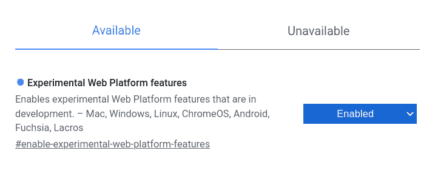

# CSS :has()选择器的高级指南

> 原文：<https://blog.logrocket.com/advanced-guide-css-has-selector/>

CSS 伪类多年来一直是人们最期待的特性之一。这是一个 4 级 CSS 选择器，现在在 [Chrome 105 和](http://caniuse.com/css-has)中作为一个完全支持的功能提供，并且很可能很快也会成为其他浏览器的一个常规功能。

CSS 中的`:has()`是一个关系伪类，允许您检查给定的元素是否包含某些子元素，如果找到任何匹配就选择它，然后相应地对其进行样式化。

本文解释了对`:has()`选择器的需求、它的一般用法、从简单到高级的各种应用程序和用例、浏览器兼容性以及回退。

### 内容

## 为什么需要`:has()`选择器？

大多数开发人员依赖 JavaScript 来实现 CSS 默认不支持的某些特性。然而，今天的 web 浏览器比以往任何时候都更强大，这为许多新的有趣的 CSS 特性打开了大门。

`:has()`选择器就是这样一个功能。它作用于父元素而不是子元素，使用逗号分隔的选择器列表作为参数，然后在它所代表的元素的子元素中寻找匹配。它的功能类似于 jQuery `has()`方法。

让我们回顾一下前端开发中对`:has()`选择器的一些一般需求，这解释了为什么这个特性多年来如此受欢迎。

首先，可以检查一个元素是否包含某些其他元素，然后对其进行相应的样式化。JavaScript 是以前实现这一点的唯一方法，正如您在这里看到的:

```
let content = document.querySelector("#content"),
    headings = [] 

if(content) {
  headings = content.querySelectorAll("h1, h2, h3")
}

if(headings.length) {
  // do something
}

```

在上面的代码中，我们使用了`querySelectorAll`，这是一个 Web API 方法，用于检查 division 元素的标题。该方法返回所提供元素的节点列表。

空节点列表意味着直接父节点中没有元素。上面的实现可以在[这里](https://codepen.io/_rahul/pen/eYVQGwE)找到。或者，你可以[在这里](#checking-multiple-children)看 CSS `:has()`备选。

其次是从子元素中选择父元素的能力。同样，在缺乏 CSS 工具的情况下，开发人员依赖于 Web API 的 parentNode 属性:

```
let el = document.querySelector(".someElement"),
    elParent = null

if(el) {
  elParent = el.parentNode
}

```

在这里查看上面代码的 [CodePen 演示，在这里](https://codepen.io/_rahul/pen/vYdQPMN)查看`:has()`选择器如何实现这个[。](#selecting-parent)

最后，可以选择给定元素的前一个兄弟元素。CSS 中的同级选择器允许您选择下一个同级，但是没有 CSS 专用的方法来选择上一个同级。JavaScript 实现如下所示([点击此处查看 CodePen 演示](https://codepen.io/_rahul/pen/oNEQKyz)):

```
let el = document.querySelector(".someElement"),
    elPs = null

if(el) {
  elPs = el.previousElementSibling
}

```

你可以在这里看到如何用[选择器`:has()`执行这个动作。](#selecting-previous-sibling)

我们在上面用 JavaScript 做的一切现在都可以用 CSS `:has()`来实现。在了解如何在 Google Chrome 上启用和测试这一功能后，我们将在下一节中逐一介绍它们。

## 启用对`:has()`选择器的支持

如果你使用的是较旧的 Chrome 版本(v.101-104)，你可以从 Chrome 标志中启用这个功能。确保你有 Chrome 101+并从浏览器的地址栏导航到 chrome://flags。

将**实验网络平台特性**设置为**启用**，您就可以开始了。重新启动浏览器，你就可以在 Chrome 浏览器中使用 CSS `:has()`了。



## CSS `:has()`选择器是做什么的？

让我们探索一下`:has()`伪类、它的用法和属性。因为它是一个伪类，所以可以用冒号将其附加到任何选择器上，并接受类、id 和 HTML 标记作为参数。

下面的代码解释了它的一般用法和语法。只有当类`.selector`包含使用`has()`伪类作为参数传递给它的元素时，它才会被选中:

```
.selector:has(.class) { ... }
.selector:has(#id) { ... }
.selector:has(div) { ... }

```

### 可链接性

只要您认为合适，就可以一个接一个地链接多个`:has()`伪类。下面的代码演示了这种链接的工作方式:

```
.selector:has(div):has(.class):has(#id) {
  ...
}

```

### 多重选择的参数列表

您还可以提供多个元素选择器的列表，类似于链接，但更有效:

```
.selector:has(div, .class, #id) {
  ...
}

```

### 灵活性

假设您不小心向`:has()`伪类提供了一个无效的元素选择器。明智的做法是忽略这一点，只考虑有效的选择器:

```
.selector:has(div, accordion, .class, ::lobster, #id) {
  ...
}

```

`accordion`和`::lobster`是无效的选择器，在上述情况下将被忽略。在开发者工具中你不会看到 CSS 错误或警告。

## 使用场景

让我们看一些 CSS' `:has()`选择器派上用场的示例场景。

### 选择父项

这可能是`:has()`选择器最常见的用法，因为它的默认行为是选择包含一组特定元素的内容。但是如果我们只知道子元素呢？

通用选择器(`*`)可以在这里与`:has()`和子组合子(`>`)一起使用，以快速选择父对象，而无需了解它的任何信息。

> 没有描述

检查多个孩子

### 正如上面的属性部分所讨论的，`:has()`允许您传递多个实体的列表，这意味着您可以在一个给定的元素中检查任意多个选择器。

Lorem ipsum 疼痛静坐 amet 结果肥胖精英。从巴黎出发，堕落的控告者别名减重复 itaque amet 自由腐败的更大后果几乎！我选择了 EAC 口粮和 tenetur assumenda neque。我是说，我不知道，我不知道为什么，我不知道，我不知道，我不知道，我不知道，我不知道，我不知道，我不知道，我不知道，我不知道，我不知道，我不知道，我不知道，我不知道，我不知道，我不知道，我不知道，我不知道，我不知道，我不知道，我不知道，我不知道，我不知道，我不知道。

> Lorem ipsum dolor sit amet consectetur adipisicing elit. Ab pariatur, obcaecati accusantium alias minus repellat itaque amet libero corrupti maiores consectetur quasi! Eligendi ratione eaque et tenetur assumenda neque reprehenderit. Unde, nemo cumque molestiae mollitia impedit voluptate quisquam laborum ut, vitae aliquid totam numquam possimus dignissimos beatae quos corporis alias quod magnam quidem.

选择上一个同级

### 通过组合 CSS 相邻兄弟组合符和`:has()`伪类，可以选择前一个兄弟。

您可能已经知道，相邻兄弟组合子选择给定元素的下一个兄弟。我们可以将这个行为与`has()`一起使用，以获得前一个兄弟。简单地说，如果一个元素有下一个兄弟元素，那么用`:has()`和`+`组合子选择它就很容易了！

我是一个段落元素，而我的下一个兄弟是一个无序列表或带有一些虚拟内容的

> 有条件的装饰

使用`:has()`选择器可以避免分别设计带有和不带有某些子元素的样式。有标题和没有标题的图元素就是一个很好的例子。

### 没有描述

如果有一个`figcaption`元素，但是不包含任何文本，该怎么办？在这种情况下，我们可以使用`:not`和`:empty`选择器来检查内容。

> 类似于图装饰，我们可以很容易地切换超过一个段落的块引号的文本对齐。在这里看看它的作用[。](https://codepen.io/_rahul/pen/MWQZXoY)

样式化空状态

我们已经有了一个名为`:empty`的伪类，用于设计不包含任何内容的元素。就以空状态为目标而言，它并不像预期的那样工作。内部的一个空格足以让它识别出一个非空的元素。

这种情况下用`:empty`不太理想。让我们创建一个卡片网格，其中也包含一些没有内容的卡片。我们将使用`:has()`选择器来设计空卡的状态。

### 没有描述

类型和块调整

在为文章设计样式时，保持类型和块元素对齐是一项棘手的工作。考虑一个将代码块、图形和块引号与通用类型元素混合的例子。

> 块元素应该有更多的垂直间距和装饰，以便在不同的印刷实体中脱颖而出。这里有一些 CSS 来处理这个问题。

上面的代码片段会在标题和块元素之间产生不均匀的垂直间距，如下所示。但是可以使用前面的兄弟选择黑客来弥补这些不规则性。

### Lorem，ipsum pain sit amet 后果性肥胖精英。逃之夭夭，贪腐之徒 quod laborum 解释说，他的配给量是鸦片剂欧迪亚斯·维塔尼亚，谁想吃，谁想吃，谁就吃谁，谁就吃谁，谁就吃谁，谁就吃谁，谁就吃谁，谁就吃谁，谁就吃谁，谁就吃谁，谁就吃谁就吃谁，谁就吃谁就吃谁，谁就吃谁就吃谁，谁就吃谁。于是特图拉模式解释说，伊塔伊塔伊坦特、奥布卡地逃了出来，结果逃了出来，阿斯匹灵、伊乌斯，一直到乌拉姆·尤恩达。又烦又恨！

图标化 CTA

假设您在 CSS 中创建一个 CTA 或按钮组件，有两种变化:第一种是默认的普通按钮，第二种是带有图标的按钮。

```
p {
  margin: 0;
}

p:not(:last-child) {
  margin-bottom: 1.5em;
}

h1,
h2,
h3,
h4,
h5,
h6 {
  line-height: 1.3;
  margin: 1.5em 0 1.5rem;
  color: #111;
}

pre,
figure,
blockquote {
  margin: 3em 0;
}

figcaption {
  margin-top: 1em;
  font-size: 0.75em;
  color: #888;
  text-align: center;
}

```

现在，如果您计划为此编写两个单独的类，使用`:has()`选择器可以很容易地避免这种情况。关键是简单地检查`.btn-icon`子元素的`.btn`元素，然后相应地设置样式。

> 没有描述

布局调整

### 假设一个 header 组件有两种布局变化:一种是固定宽度的，另一种当然是流动的。

为了将标题的内容保持在固定的宽度内，我们必须在其中添加一个内容包装器元素。这两个标头版本的标记之间的唯一区别是包装元素。

然后我们可以将`:has()`与`:not()`选择器配对，并添加 CSS 类，如下面的演示所示。

> 没有描述

调整布局的另一个例子是，当一个网格中的列数达到一定数量时，就修改它。

### 当您不使用`minmax()`函数来确定最佳宽度以适合网格中的列时，这将非常方便。

更多来自 LogRocket 的精彩文章:

没有描述

正如您在上面看到的，一旦超过两项的标记，网格就会自动调整为三列。

> 更好的表单可用性

当交互性与反馈恰当地联系在一起时，它是最好的定义。对于交互式 HTML 表单，向用户提供关于输入的反馈是你能做的最好的事情。

在`:has()`、`:valid`和`:invalid`伪类的帮助下，我们可以使表单更加动态，并且不需要 JavaScript。

没有描述

* * *

### 检查浏览器支持

* * *

> 如果没有找到对`:has()`选择器的支持，上面讨论的例子会显示一个错误对话框。这可以使用`@supports` CSS 规则来完成，如下面的代码片段所示:

以上是检查支持并根据需要设置元素样式的渐进方法。如果一个代码库直接使用一些新特性，有一种方法可以编写相同特性的向后兼容版本:

如果没有找到支持，也可以使用同样的方法来提示用户。

### 您还可以使用 JavaScript 中的支持 API 来检测浏览器对不同特性的支持。下面是一个纯粹用 JavaScript 检查`:has()`支持的例子:

结论

在上面的文章中，我们学习了 4 级 CSS 选择器`:has()`。我们讨论了它的需求，它可以在你的前端项目中取代 JavaScript 的一些情况，以及一般到高级的用例。

> 我们还讨论了不同浏览器当前提供的支持，并学习了如何检查浏览器支持。

谢谢你从头到尾的阅读。我希望你通过这个学到了新的东西。欢迎在评论中分享更多关于`:has()`如何有用的例子。

## 你的前端是否占用了用户的 CPU？

随着 web 前端变得越来越复杂，资源贪婪的特性对浏览器的要求越来越高。如果您对监控和跟踪生产环境中所有用户的客户端 CPU 使用情况、内存使用情况等感兴趣，

```
@supports (selector(:has(*))) {
  .selector:has(...) {
    ...  
  }
}

```

.

```
@supports not (selector(:has(*))) {
  .selector {
    ...  
  }
}

```

LogRocket 就像是网络和移动应用的 DVR，记录你的网络应用或网站上发生的一切。您可以汇总和报告关键的前端性能指标，重放用户会话和应用程序状态，记录网络请求，并自动显示所有错误，而不是猜测问题发生的原因。

现代化您调试 web 和移动应用的方式— [开始免费监控](https://lp.logrocket.com/blg/css-signup)。

```
if(!CSS.supports('selector(html:has(body))'))) { // if not supported
  // Use the conventional JavaScript ways to emulate :has()
}

```

## Conclusion

In the article above, we learned about `:has()`, a level 4 CSS selector. We covered its needs, some cases where it can replace JavaScript in your frontend projects, and general to advanced use cases.

We also discussed the current support offered to it by different browsers, and learned how to check for the browser support.

Thanks for reading all the way through. I hope you learned something new through this. Feel free to share more examples of how `:has()` can be useful in the comments.

## Is your frontend hogging your users' CPU?

As web frontends get increasingly complex, resource-greedy features demand more and more from the browser. If you’re interested in monitoring and tracking client-side CPU usage, memory usage, and more for all of your users in production,

[try LogRocket](https://lp.logrocket.com/blg/css-signup)

.

[](https://lp.logrocket.com/blg/css-signup)[https://logrocket.com/signup/](https://lp.logrocket.com/blg/css-signup)

[LogRocket](https://lp.logrocket.com/blg/css-signup) is like a DVR for web and mobile apps, recording everything that happens in your web app or site. Instead of guessing why problems happen, you can aggregate and report on key frontend performance metrics, replay user sessions along with application state, log network requests, and automatically surface all errors.

Modernize how you debug web and mobile apps — [Start monitoring for free](https://lp.logrocket.com/blg/css-signup).