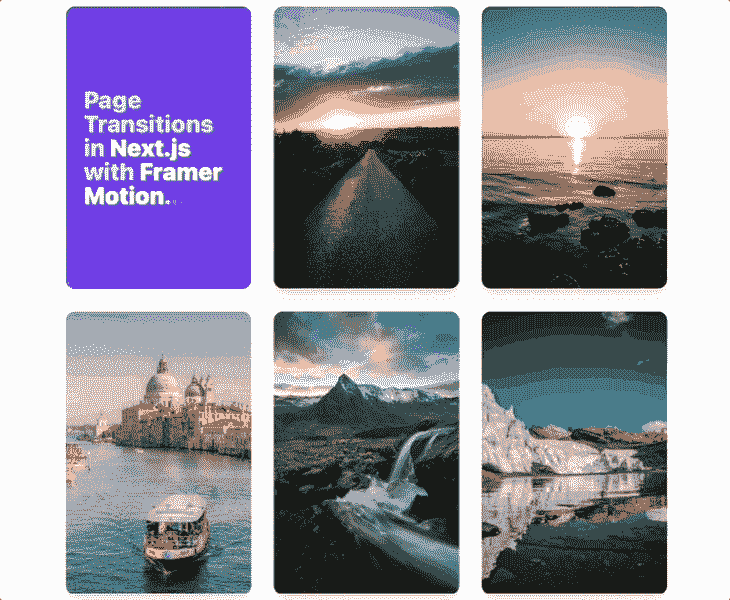
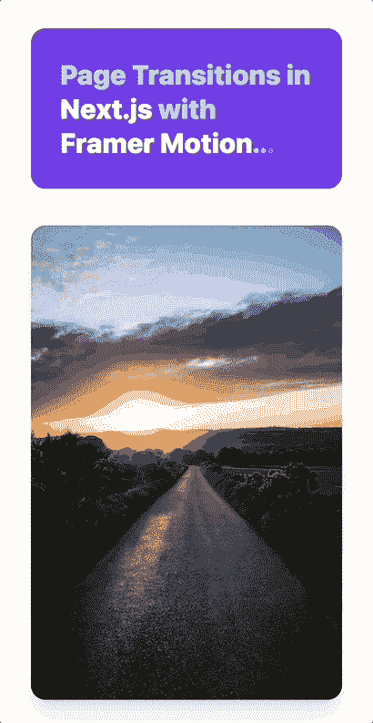

# 使用 Next.js 和 Framer Motion 实现高级页面过渡

> 原文：<https://blog.logrocket.com/advanced-page-transitions-next-js-framer-motion/>

网络变得越来越互动。用户已经开始期望更高水平的交互性来抓住他们的注意力，并诱导他们与页面上的信息互动。吸引注意力的一个关键方法是使用移动和页面转换。这可能听起来像一个内置剪贴画类型页面过渡的 PowerPoint 幻灯片，但我可以向你保证，这不是我指的！

本文将演示如何使用 Next.js 和 Framer Motion 来应用微妙、优雅的页面过渡，为您的站点添加个性和风格。

*向前跳转:*

## 指示装载状态

页面过渡只是前端开发人员工具箱中的几个工具之一。如果使用得当，页面过渡可以增加用户参与度，甚至在页面加载过程中吸引用户的注意力。

一般来说，网页内容加载速度很快，但是如果你依赖于从服务器上获取数据，应用合适的运动水平的页面过渡可以帮助保持用户参与。

一种选择是添加一个快速加载栏；这为用户提供了反馈，当内容需要额外的几秒钟来加载时，通知他们留在原地，不要离开。

任何超过 200 毫秒的时间都会被大脑感知为瞬间。然而，让一个页面加载那么快真的很难。通过添加 0.5-2 秒的页面过渡，您实际上是在为自己争取时间来加载数据并做好准备，这样当下一页出现时，您就可以交付用户请求的内容。

## 确定何时使用页面过渡

为了提供最好的 UX 网站，你需要把用户放在体验的中心，从他们的角度考虑问题。当访问你的网站时，考虑用户需求的背景，并使用这些信息来评估什么级别的页面过渡是可接受的。

前面提到的加载栏几乎可以用于任何类型的网站。加载栏的架构可以是全页面体验，也可以是仅在网页顶部可见的细长组件。但是，不管加载栏的外观如何，它的目的是在加载下一页时指示系统状态。

当用户访问一个信息丰富的网站来消费内容时，他们不希望由于页面转换而变慢。对于用户浏览多个页面的网站来说尤其如此。所以，不要太兴奋，给你的公司网站添加页面过渡！更华丽的页面过渡应该留给本质上更有创造力的网站，因为他们的网站访问者可能期望更多的娱乐。

### 我添加了一些页面过渡，完成了吗？

一般来说，当动画很微妙，感觉很自然，并且与整个用户体验很好地融合时，它们是最成功的。简单地添加页面过渡可能会感觉不合适，你需要考虑整个页面体验。您可能希望为进入页面的元素添加一些移动效果、交互式悬停效果等等，以便让用户在访问您的网站时保持专注。

## 构建页面过渡

页面过渡几乎可以构建在任何前端框架或技术中，但是在这个演示中，我们将使用 [Next.js](https://nextjs.org/) 来提供页面过渡触发动画的提示，并使用[成帧器动作](https://www.framer.com/motion/)来实际执行页面过渡。

Framer Motion 将自己称为“React 的生产就绪运动库”，使用起来很不错。我最喜欢这个库的一点是它实现动画的声明方式。使用“成帧器运动”,您可以声明想要的开始和结束外观，然后库会填充间隙。

从头开始创作动画真的很难。如果你曾经尝试过使用 CSS，或者几乎任何其他语言，在 React 中制作动画，这将变得非常棘手。React 会立即卸载正在退出 DOM 的元素，并且由于该元素已被删除，因此不能在“退出”的过程中对其进行动画处理。当页面改变时，如果有突然的跳跃，页面转换会感觉不正确。这是 Framer Motion 自动为我们处理的魔法的一部分，尽管有一个实现它的技巧，我将在下面介绍。

好了，让我们投入使用吧！

## 页面过渡演示

为了演示如何创建页面过渡，我们将使用 Framer Motion 构建一个 Next.js 站点。我们将使用我喜欢的方法来设计站点的样式:Tailwind CSS。

这是我们最终会得到的结果。在 Next.js 中，每个照片页面都是一个新的(动态)页面，当我们在列表和详细信息页面之间导航时，您可以看到页面转换:



如果您愿意，您也可以获取上面示例的[源代码](https://github.com/fbrill/react-page-transitions)来浏览和跟随。

### 设置场景

为了设置我们的页面转换演示，我们需要理解 Next.js 的内部工作原理:

*   首先，在页面加载之间有一个持久化的`_app.js`文件
*   其次，我们需要使用 Next.js `<Link>`组件来链接页面。这样，Next.js 执行了一个浅层呈现，并在卸载之前的组件时装载了新的页面组件，给我们一种类似 SPA 的感觉，并且能够在页面之间切换，而无需重新加载页面。我们需要这个功能来实现页面转换
*   如前所述，试图动画化离开 DOM 的 React 组件最困难的部分是它们就这样消失了，使得它们几乎不可能被动画化。Framer Motion 用一个`<AnimatePresence>`组件解决了这个问题，这个组件变了一些魔术，使得声明一个可以被动画化的`exit`状态成为可能

### 开始新的 Next.js 站点

为了展示我们如何实现动画页面过渡，让我们用 Tailwind CSS starter 创建一个 [quick Next.js 站点](https://tailwindcss.com/docs/guides/nextjs)来处理我们的样式。

接下来，我们需要安装帧运动，就像这样:

```
yarn add framer-motion

```

### 添加`AnimatePresence`

现在，我们将设置页面过渡。首先，我们将动画演示添加到`_app.js`:

```
// _app.js

import { AnimatePresence } from 'framer-motion'

function MyApp({ Component, pageProps, router }) {
  return (
    <AnimatePresence mode="wait" initial={false}>
      <Component {...pageProps} key={router.asPath} />
    </AnimatePresence>
  );
}

```

接下来，我们需要用`<AnimatePresence>`包装我们的`<Component>`。

这里是我在这个演示中启用的另外两个可选设置:

1.  `mode="wait"`:这只是告诉 Framer Motion 在新组件上开始新动画(新页面)之前完成任何退出动画(退出页面)。
2.  `initial`:设置为`false`意味着在第一次页面加载时不会播放动画，这样感觉更好。

这里的一个关键点是确保你的动画元素是`AnimatePresence`的直接子元素，这样在从 React 树中移除元素之前，它可以接管并动画化任何退出事件。

因为我们在`_app.js`中声明了`AnimatePresence`并且`AnimatePresence`激活了直接子元素，所以我们需要提供我们要返回唯一键的`<Component>`。最初，这让我犯了一个错误。我通过添加页面路径作为键来解决这个问题，以确保它总是唯一的。这样，React 会将每个页面注册为一个不同的组件，并且可以在动画显示新组件的入口之前动画显示出口。

### 创建共享布局组件

一旦包装器在`_app.js`中就位，我们将需要创建实际上是动画的子页面元素。我们可以创建一个共享的`<Layout>`组件来包装我们想要制作动画的所有页面，而不是在每个页面上都这样做:

```
// components/Layout/index.js

import { motion } from "framer-motion";

const Layout = ({ children }) => (
  <motion.div
    initial={{ x: 300, opacity: 0 }}
    animate={{ x: 0, opacity: 1 }}
    exit={{ x: 300, opacity: 0 }}
    transition={{
      type: "spring",
      stiffness: 260,
      damping: 20,
    }}
  >
    {children}
  </motion.div>
);
export default Layout;

```

这些是很好的默认设置，但是你也可以[探索](https://www.framer.com/docs/component/)其他的声明性属性。例如，您可以使用`initial`来指定一个过渡起点，元素应该“来自”那里，而`animate`将指定您希望事情结束的“结束状态”，`exit`用于指定动画组件应该结束的目标位置。

这些属性可以用来微调任何页面过渡，以及`transition`属性本身。如果这些名字听起来令人困惑，您也可以定义自己的`[variants](https://www.framer.com/docs/component/###variants)`以便更容易理解。

### 使用布局组件

接下来，我们需要在所有想要制作动画的页面上使用布局组件；这些可以是静态页面，也可以是动态路径——这真的无关紧要。

Make this 是包装任何子组件的第一个组件，以确保它是`<AnimatePresence>`的直接后代:

```
// pages/index.js

import Layout from "../components/Layout";

export default function Home() {
  return (
    <Layout>
        // ....
        // Page content goes here
        // ....
    </Layout>
  );
}

```

有了上面的主页的简化标记，我只是向你展示了让页面过渡工作所需的东西。在多个页面上执行此操作并链接到它们将导致页面转换，并且实际组件中的任何内容都将随着页面转换而动画化。

在我的例子中，很难看出过渡在开始时是否有效，因为页面没有那么长。但是看看移动体验，很清楚发生了什么。一旦我们向下滚动并转换到新页面，Next.js 就保持这个位置，并且我们到达新页面的中间。这显然不是很好的用户体验:



修复这个问题很容易，因为我们可以在根`<AnimatePresence>`上添加任何`onExitComplete`函数。我们只需在退出动画完成后将窗口滚动回顶部，无论页面长度如何，新页面都将从顶部开始:

```
// _app.js

<AnimatePresence
  mode="wait"
  initial={false}
  onExitComplete={() => window.scrollTo(0, 0)}
>

```

## 额外提示:加载页面过渡

正如我在本指南开头提到的，页面转换也可以作为页面加载器，有助于在获取数据时保持用户的注意力。

Next.js 为我们提供了一些`Router`事件，我们可以使用这些事件来创建这个:

```
// _app.js

import { useState, useEffect } from "react"
import Router from "next/router"
import PageLoader from "../components/PageLoader"

const App = ({ Component, pageProps }) => {
  const [loading, setLoading] = useState(false)
  useEffect(() => {
    // Used for page transition
    const start = () => {
      setLoading(true)
    }
    const end = () => {
      setLoading(false)
    }
    Router.events.on("routeChangeStart", start)
    Router.events.on("routeChangeComplete", end)
    Router.events.on("routeChangeError", end)
    return () => {
      Router.events.off("routeChangeStart", start)
      Router.events.off("routeChangeComplete", end)
      Router.events.off("routeChangeError", end)
    }
  }, [])

  return loading ? <PageLoader /> : <Component {...pageProps} />
}
export default App

```

我们使用 Next.js `Router`事件来设置一个本地状态变量，以指示加载状态。从那里，我们可以决定如何处理该指标。在这个例子中，有一个不同的组件将被呈现为一个完整的页面加载器，它可以被分别设置样式和动画。

## 结论

在这篇文章中，我们研究了何时以及为什么你会考虑在你的站点上添加页面过渡。我们演示了如何使用 Next.js 和 Framer Motion 创建和添加页面过渡。我们还研究了一种不同的方法，使用页面加载器作为间隙加载状态，作为页面转换。如果你尝试这种方法，用下面的评论让我知道你是如何找到它的！

## [LogRocket](https://lp.logrocket.com/blg/nextjs-signup) :全面了解生产 Next.js 应用

调试下一个应用程序可能会很困难，尤其是当用户遇到难以重现的问题时。如果您对监视和跟踪状态、自动显示 JavaScript 错误、跟踪缓慢的网络请求和组件加载时间感兴趣，

[try LogRocket](https://lp.logrocket.com/blg/nextjs-signup)

.

[](https://lp.logrocket.com/blg/nextjs-signup)[](https://lp.logrocket.com/blg/nextjs-signup)

LogRocket 就像是网络和移动应用的 DVR，记录下你的 Next.js 应用上发生的一切。您可以汇总并报告问题发生时应用程序的状态，而不是猜测问题发生的原因。LogRocket 还可以监控应用程序的性能，报告客户端 CPU 负载、客户端内存使用等指标。

LogRocket Redux 中间件包为您的用户会话增加了一层额外的可见性。LogRocket 记录 Redux 存储中的所有操作和状态。

让您调试 Next.js 应用的方式现代化— [开始免费监控](https://lp.logrocket.com/blg/nextjs-signup)。