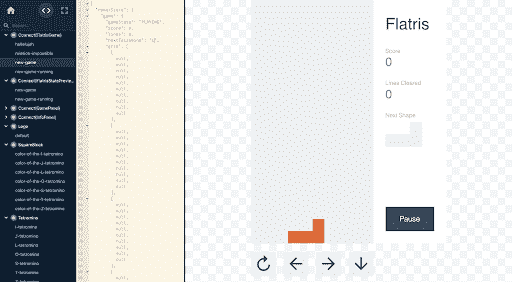
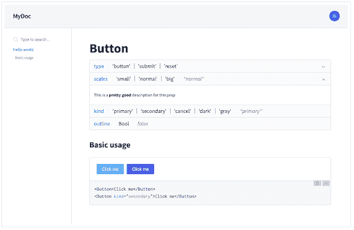
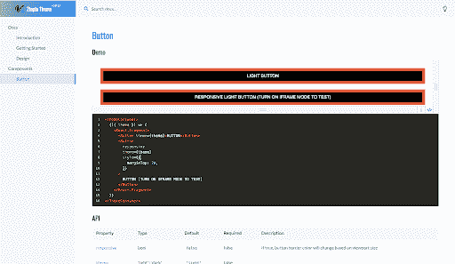
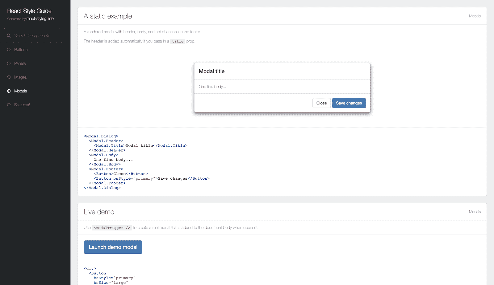
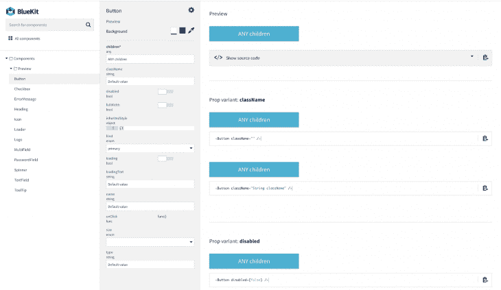

# React Storybook - LogRocket 博客的替代方案

> 原文：<https://blog.logrocket.com/alternatives-to-react-storybook/>

[React Storybook](https://storybook.js.org/docs/guides/guide-react/) 是一个用户界面开发环境，也是 UI 组件的游乐场。它允许开发人员开发他们的组件，并在一个隔离的环境中交互展示它们。

Storybook 还允许开发人员提供组件使用的代码示例，这些示例反过来可以作为组件的文档。Storybook 被世界各地的工程师广泛用于加速 UI 开发并为他们的组件提供文档。

故事书也有惊人的文档，这个[演练](https://www.learnstorybook.com/react/en/get-started/)将从头开始设置。他们还在[现场演示了故事书是如何运作的。你可能也想看看](https://storybooks-official.netlify.com/?path=/story/ui-panel--default)[这篇关于故事书如何简化组件测试的文章](https://blog.logrocket.com/react-storybook/)。

很有用吧？它变得越来越好，因为有许多其他方式来实现类似于故事书提供的结果。在这篇文章中，我们将寻找故事书的其他替代方案，用于 [React](https://blog.logrocket.com/popular-react-hook-libraries/) 应用程序。这些替代方案包括:

*   阿提勒
*   反应宇宙
*   甜言蜜语
*   全权委托
*   反应样式向导生成器
*   反应 bluekit 工作室

## Atellier 可能是我们列表中更多样的选择之一。Atellier 由 [Scup](https://www.scup.com/social/en/) 开发，允许你预览和共享组件，同时提供编辑属性、状态和附加到组件的功能以及操纵样式的能力。使用这个[现场演示](http://scup.github.io/atellier/material-ui-atellier/)，你可以看到这有多详细，它的材料用户界面展示了各种组件。

工作室也很容易设置。为此，如下安装`react-attelier package`:

接下来，让我们导入它并在我们的项目中设置它:

```
npm install react-atellier
```

就这样，在你的应用程序的 atellier 路径上，你会找到演示中呈现的组件，其中包含 Atellier 的所有可用功能。

```
import ReactAtellier from 'react-atellier';
import myComponent from 'myComponent';
//import other components here

const componentList = [{
  componentName : myComponent.displayName,
  component : myComponent
  },
  //...map other components
];

//pass the list of components to atellier via props 
var AtellierWrapper = React.createClass({
  render: function() {
    return (
      <ReactAtellier components={componentList} />
    );
  }
});

//render atellier somewhere in your app
render((
  <Router history={browserHistory}>
    <Route path="/" component={App}>
      <Route path="atellier" component={AtellierWrapper}/>
    </Route>
  </Router>
), document.body)
```

Atellier 是开源的，他们对开发者开放贡献，目前正在开发 CLI 以改善开发体验。

需要注意的是，这个包从 2016 年开始就没有更新过。


反应宇宙

## React Cosmos 是另一个很好的选择。Cosmos 扫描您的项目，使您能够执行以下操作:

在道具、上下文和状态的任意组合下呈现组件

*   模仿每一个外部依赖(例如 API 响应、本地存储等)
*   在与正在运行的实例交互时，查看应用状态的实时变化
*   Cosmos 首先是一个开发工具，旨在改进所有组件，无论大小，而不仅仅是无状态的 UI 位。 [fixture](https://github.com/react-cosmos/react-cosmos#fixtures) 和 [proxy](https://github.com/react-cosmos/react-cosmos#proxies) 架构兼作[自动化测试工具](https://github.com/react-cosmos/react-cosmos#headless-testing)，为开发健壮且可重用的组件提供完整的解决方案。Cosmos 还使创建生活方式指南变得容易，但这是次要目标，如果这是你的主要关注点，你可能会从备选方案中获得更多价值。

工作中的宇宙的现场演示可以在这里找到。



docx

## Docz 是一个神奇的工具，可以零配置和实时预览地记录你的组件。《Docz》由[盖茨比](https://www.gatsbyjs.org/)驱动，速度极快。它建立在五个主要原则之上:

**零配置且易于学习**–没有不必要的构建步骤和混乱的设置

*   **超快的速度**–它从一开始就考虑到了性能
*   **易于定制**–创造易于使用和定制的东西
*   **基于 MDX 的**–编写文档的最佳标准
*   **可插拔**–当您需要定制和灵活的解决方案时，插件是最佳选择
*   Docz 还提供插件和主题支持，从而提高了定制和可用性。





全权委托

## [全权委托](https://github.com/carteb/carte-blanche)是一个隔离的开发空间，为您的组件集成了模糊测试。单独查看它们，在不同状态下探索它们，并快速自信地开发它们。

设置全权委托是一个简单的两步过程:

1.  用`npm install --save-dev carte-blanche`安装插件
    1.  将它添加到您的开发 webpack 配置中的插件，在 componentRoot 选项中指定您的组件所在文件夹的相对路径:
    2.  就是这样，现在启动你的开发环境，去/全权委托看看你的全权委托。该团队非常友好地提供了这个[短片](https://www.youtube.com/watch?v=6g3-TQ6aaw8)来展示可用的功能。

```
var CarteBlanche = require('carte-blanche');
/* … */
plugins: [
  new CarteBlanche({
    componentRoot: './src/components'
  })
],

```

和 Atellier 一样，需要注意的是，这个包从 2016 年开始就没有更新过。

反应样式向导生成器

## [React 样式指南生成器](https://github.com/pocotan001/react-styleguide-generator)用于通过向 React 项目添加一些文档来轻松生成好看的样式指南。

你可以在这里找到一个用 React-Bootstrap 创建的演示,展示了许多组件的文档。



反应 Bluekit

## 由 [Blueberry](https://www.blueberry.io/) 、 [Bluekit](http://bluekit.blueberry.io/) 创建，是一个看起来很棒的组件文档工具，可以与 [gulp](https://gulpjs.com/) 无缝集成。

要安装它，请运行`npm install react-bluekit --save`。

将以下几行添加到 gulp 文件中:

然后运行`gulp build-bluekit`来生成关于组件的信息。

```
import createBlueKit from 'react-bluekit/lib/createBlueKit';

createBlueKit({
 // your directory where components are located
 baseDir: `${__dirname}/src/browser`,
 // relative paths from base dir where to look for components
 paths: ['./components', './auth']
});

```

您还可以设置在应用程序启动时构建 BlueKit，然后使用`gulp watch-bluekit`任务观察组件的变化:

```
import Bluekit from 'react-bluekit';
import componentsIndex from './componentsIndex';

<BlueKit
 componentsIndex={componentsIndex}
 inline // display inline (not full page)
/>

```



```
gulp.task('default', ['build-bluekit', 'server', 'watch-bluekit']);
```

结论

## 文档甚至对 UI 组件也很重要，因为它有助于创建一个环境，让开发人员可以轻松协作并更快地构建应用程序。上面的工具可以帮助实现这一点。如果你有一个开源的 UI 组件库，这也可以帮助你的用户更快地熟悉你的工具。

[LogRocket](https://lp.logrocket.com/blg/react-signup-general) :全面了解您的生产 React 应用

## 调试 React 应用程序可能很困难，尤其是当用户遇到难以重现的问题时。如果您对监视和跟踪 Redux 状态、自动显示 JavaScript 错误以及跟踪缓慢的网络请求和组件加载时间感兴趣，

.

[try LogRocket](https://lp.logrocket.com/blg/react-signup-general)

LogRocket 结合了会话回放、产品分析和错误跟踪，使软件团队能够创建理想的 web 和移动产品体验。这对你来说意味着什么？

[ ](https://lp.logrocket.com/blg/react-signup-general) [](https://lp.logrocket.com/blg/react-signup-general) 

LogRocket 不是猜测错误发生的原因，也不是要求用户提供截图和日志转储，而是让您回放问题，就像它们发生在您自己的浏览器中一样，以快速了解哪里出错了。

不再有嘈杂的警报。智能错误跟踪允许您对问题进行分类，然后从中学习。获得有影响的用户问题的通知，而不是误报。警报越少，有用的信号越多。

LogRocket Redux 中间件包为您的用户会话增加了一层额外的可见性。LogRocket 记录 Redux 存储中的所有操作和状态。

现代化您调试 React 应用的方式— [开始免费监控](https://lp.logrocket.com/blg/react-signup-general)。

Modernize how you debug your React apps — [start monitoring for free](https://lp.logrocket.com/blg/react-signup-general).