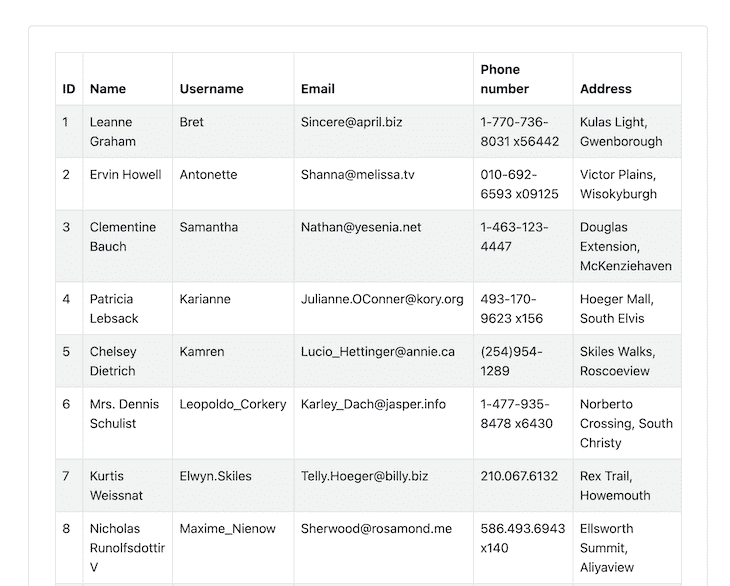
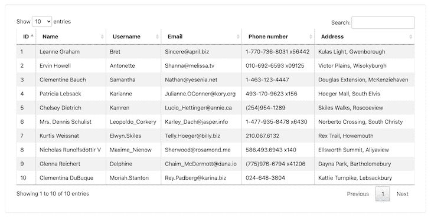
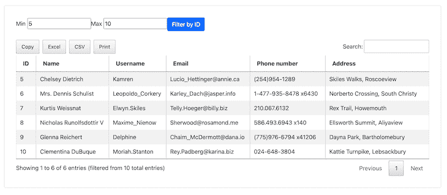

# 使用角度数据表构建功能丰富的表格

> 原文：<https://blog.logrocket.com/angular-datatables-feature-rich-tables/>

引入数据表是为了简化可视化、分组、查询和排序数据的过程。通常，表只是数据的表格形式，并没有什么特别之处。但是数据表可以提供多种功能，包括数据排序、数据查询、数据更新、分页、打印和数据导出等等。

在像 Angular 这样的[框架中使用数据表，对其代码库进行持续更新，这带来了一些复杂性:](https://blog.logrocket.com/angular-11-what-to-expect/)

*   **弃用的代码** : [Angular 数据表](https://l-lin.github.io/angular-datatables/#/welcome)，我们将在本文中使用，它不支持旧版本的 Angular CLI (Angular 8 及以下版本)。甚至旧版本的 Node 和 npm 也使用不推荐使用的代码，因此无法使用该服务
*   **配置**:每个开发人员都会同意，有些配置确实很麻烦，Angular 中的数据表配置也不例外

## 什么是角度数据表？

Angular DataTables 是一个使用 jQuery 的[数据表插件](https://datatables.net/)构建复杂 HTML 表格的库。它被配置为支持 TypeScript，并针对 Angular 2+进行了优化。

角度数据表将在以下情况下派上用场:

*   您有一个来自一个或多个 API 端点的非常大的数据集
*   您需要定制的数据排序/过滤
*   您需要从表格中导出并打印数据

角度数据表功能可以大致分为两组:基本和高级。由此，Angular 数据表也支持许多扩展。

### 基本特征

*   使用 AJAX 调用直接加载数据
*   角度组件中的列渲染等选项
*   使用自定义函数`dtTrigger`进行表格渲染
*   服务器端处理(尽管您需要覆盖 AJAX 选项)

### 高级功能

*   自定义过滤，包括按数字、字符串、布尔值等进行过滤。
*   单独的列筛选，按列对数据进行排序
*   数据表的重新呈现
*   可以同时显示多个表格
*   可以在角度组件中添加路由器链接，这可以在新页面中显示单个数据实例
*   管道被添加到数据表中，以将数据转换为所需的格式

## 安装角度数据表

现在让我们深入安装和使用角度数据表。首先，我们将安装我们的 Angular 应用程序，然后将数据表安装到应用程序中:

```
ng new angular-datatable
```

Angular 安装完成后，您可以进入终端中的目录并安装数据表:

```
cd angular-datable

ng add angular-datatables
```

这将把 jQuery 和 DataTables 插件添加到您的`angular.json`文件和应用程序中。安装完成后，您可以在`app.module.ts`中导入您的数据表模块，以便在应用程序中全局使用它:

```
// src/app/app.module.ts

import {DataTablesModule} from 'angular-datatables';

imports: [
  BrowserModule,
  AppRoutingModule,
  DataTablesModule,
],
```

## 进行 API 调用

我们将使用 [JSONPlaceholder](https://jsonplaceholder.typicode.com/) API 用信息填充我们的数据表，以获取旋转的角度数据表。

要做到这一点，我们首先必须在我们的`app.module.ts`文件中添加`HttpClient`模块，使它可以在我们的 HTTP 请求服务中被访问。我们通过导入它并在`imports`数组中调用它来实现:

```
// src/app/app.module.ts

import { HttpClientModule } from '@angular/common/http';

imports: [
  BrowserModule,
  AppRoutingModule,
  DataTablesModule,
  HttpClientModule
],
```

### 创建角度服务

我们将创建一个 Angular 服务，它将与我们的 HTTP 模块通信，从我们的 API 获取数据。为了生成服务，我们将在终端中运行以下命令:

```
ng generate service services/users/users

```

这将在我们的`src/app`文件夹中创建一个新的文件目录，包含我们的`users.services.ts`文件:

```
-| Users/
    users.service.spec.ts
    users.services.ts
```

然后，我们可以将我们的`HttpClient`导入到我们的`users.service.ts`文件中:

```
// src/app/services/users/users.service.ts

import { HttpClient } from '@angular/common/http';

constructor(private http: HttpClient) { }
```

接下来，我们添加我们的函数，它将从 API 链接中获取用户:

```
users() {
  this.http.get('https://jsonplaceholder.typicode.com/users');
}
```

### 生成组件

创建服务后，我们生成一个名为`users`的组件，它将保存我们从刚刚创建的服务中获得的数据，并将其显示在我们的 HTML 页面中。我们还将使用`users`组件来创建我们的数据表和所有功能。

要创建组件，只需运行以下命令:

```
ng generate component components/users
```

### 使用 API

在我们的`users`组件中，我们将使用从我们创建的服务中获取的 API 数据，并将其存储在一个名为`allUsers`的数组中:

```
import { UsersService } from '../../services/users/users.service';

export class UsersComponent implements OnInit {

  allUsers: any = [];
  constructor(private service: UsersService) { }

  ngOnInit(): void {
    this.users();
  }

  users(): void {
    this.service
        .users()
        .subscribe((response: any) => {
          this.allUsers = response.data;
        });
  }

}
```

然后我们用获取的用户填充我们的`users.component.html`:

```
<div class="container">
    <div class="card m-5 p-3">
        <div class="card-body">
            <table class="table table-bordered table-striped table-hover">
                <thead>
                <tr>
                    <th>ID</th>
                    <th>Name</th>
                    <th>Username</th>
                    <th>Email</th>
                    <th>Phone number</th>
                    <th>Address</th>
                </tr>
                </thead>
                <tbody>
                <tr *ngFor="let user of allUsers">
                    <td>{{ user.id }}</td>
                    <td>{{ user.name }}</td>
                    <td>{{ user.username }}</td>
                    <td>{{ user.email }}</td>
                    <td>{{ user.phone }}</td>
                    <td>{{ user.address.street }}, {{ user.address.city }}</td>
                </tr>
                </tbody>
            </table>
        </div>

    </div>
</div>
```

它将显示如下内容:



现在这已经完成了，张开你的手指，因为我们将要深入数据表的使用和操作！😋

## 添加我们的数据表

因为我们已经在`app.module.ts`中添加了数据表模块，所以我们不需要在组件中导入它；我们用`rxjs`简单称之为主语:

```
// src/app/components/users/users.components.ts
import {Subject} from 'rxjs';
...

export class UsersComponent implements OnInit {

  dtOptions: DataTables.Settings = {};
  dtTrigger: Subject<any> = new Subject<any>();

}
```

然后，我们将我们的`unsubscribe`函数添加到角度`OnDestroy`模块:

```
import { Component, OnInit, OnDestroy } from '@angular/core';

export class UsersComponent implements OnInit, OnDestroy {
  ...
}

ngOnDestroy(): void {
  this.dtTrigger.unsubscribe();
}
```

这将在我们每次将页面附加到组件时重置数据表。

这样，我们现在将向我们的`users`函数添加一个数据表，并在我们的组件 HTML:

```
users(): void {
  this.service
      .users()
      .subscribe((response: any) => {
        this.allUsers = response;
        // initiate our data table
        this.dtTrigger.next();
      });
}
```

```
<table class="table table-bordered table-striped table-hover" datatable [dtOptions]="dtOptions" [dtTrigger]="dtTrigger">
  ...
</table>
```

表格中添加了过滤和分页功能，如下图所示:



## 自定义过滤

有时，我们可能希望以自己的方式搜索呈现给最终用户的数据。常见的例子包括数字范围搜索(介于两个数字之间)和日期范围搜索。Angular DataTables 允许您轻松地进行自定义搜索。

> **N.B.** ，Angular 数据表中自定义过滤的文档是错误的，主要是因为 Angular 的 TypeScript 中的更新，所以请遵循我的示例。

为了启动定制过滤，我们将首先导入一个`@ViewChild`装饰器，它允许我们向组件注入对其模板中使用的元素的类引用:

```
import {Component, OnInit, OnDestroy, ViewChild} from '@angular/core';
```

然后，我们在组件中导入`DataTableDirective`:

```
import {DataTableDirective} from 'angular-datatables';
```

然后我们引用我们的`DataTableDirective`，并将其赋给一个新的变量`datatableElement`。之后，我们将创建`max`和`min`变量，它们将为我们的自定义过滤获取最大值和最小值。

让我们从引用开始:

```
@ViewChild(DataTableDirective, {static: false})
datatableElement: any = DataTableDirective;
```

```
min: any = 0;
max: any = 0;
```

接下来，我们在`ngOnInit`中使用自定义函数进行过滤:

```
ngOnInit(): void {
  ...

  $.fn.dataTable.ext.search.push((settings: any, data: string[], dataIndex: any) => {
    const id = parseFloat(data[0]) || 0; // use data for the id column
    return (Number.isNaN(this.min) && Number.isNaN(this.max)) ||
        (Number.isNaN(this.min) && id <= this.max) ||
        (this.min <= id && Number.isNaN(this.max)) ||
        (this.min <= id && id <= this.max);
  });
}
```

这将获得`max`和`min`号，获取数据，然后更新数据表。接下来，我们通过`id`创建一个过滤数据表的函数:

```
filterById(): void {
  this.datatableElement.dtInstance.then((dtInstance: DataTables.Api) => {
    dtInstance.draw();
  });
}
```

现在，当我们退出页面时，它会重新启动数据表:

```
ngOnDestroy(): void {
  ...
  $.fn.dataTable.ext.search.pop();
}
```

完成所有这些后，我们更新我们的`users.components.html`页面来启动我们的`filterById`函数:

```
<form (submit)="filterById()">
    <label>
        Min
        <input type="number" name="min" id="min" [(ngModel)]="min" />
    </label>
    <label>
        Max
        <input type="number" name="max" id="max" [(ngModel)]="max" />
    </label>
    <button class="btn btn-primary" type="submit">Filter by ID</button>
</form>
<br />
```

就这样——我们可以通过`id`使用自定义过滤。

## 按钮扩展

如上所述，角度数据表支持许多扩展，其中之一是按钮扩展。buttons 扩展允许我们将表数据作为文件导出和复制。当我们想要共享数据而不访问应用程序时，这尤其有用。

要使用数据表按钮扩展，请使用以下命令安装其插件:

```
# If you want to export excel files
npm install jszip --save
# JS file
npm install datatables.net-buttons --save
# CSS file
npm install datatables.net-buttons-dt --save
# Typings
npm install @types/datatables.net-buttons --save-dev

```

然后在`scripts`和`styles`属性中添加依赖关系:

```
{
  "projects": {
    "your-app-name": {
      "architect": {
        "build": {
          "options": {
            "styles": [
              ...
              "node_modules/datatables.net-buttons-dt/css/buttons.dataTables.css"
            ],
            "scripts": [
              ...
              "node_modules/jszip/dist/jszip.js",
              "node_modules/datatables.net-buttons/js/dataTables.buttons.js",
              "node_modules/datatables.net-buttons/js/buttons.colVis.js",
              "node_modules/datatables.net-buttons/js/buttons.flash.js",
              "node_modules/datatables.net-buttons/js/buttons.html5.js",
              "node_modules/datatables.net-buttons/js/buttons.print.js"
            ],
            ...
}
```

然后，我们在`ngOnInit`中包含这些配置:

```
ngOnInit(): void {
  this.dtOptions = {
    // Declare the use of the extension in the dom parameter
    dom: 'Bfrtip',
  };
}
```

下面是结果——添加了**复制**、 **Excel** 、 **CSV** 和**打印**按钮:



在自定义数据表时，有更多的选项可供选择。只要稍作调整，你就可以按照你的要求来塑造它，它将完美地适合你正在建造的任何东西。

## 包扎

因此，我们引入了角度数据表及其特性。我们还将它应用于一个应用程序，使用了它的一些特性，并探索了 buttons 扩展。由于 Angular TypeScript 中的更新，我对原始文档做了一些修改。我希望这篇教程能给你一个简单易懂的分解，告诉你如何在你的角度应用中使用角度数据表。

## 像用户一样体验 Angular 应用程序

调试 Angular 应用程序可能很困难，尤其是当用户遇到难以重现的问题时。如果您对监视和跟踪生产中所有用户的角度状态和动作感兴趣，

[try LogRocket](https://lp.logrocket.com/blg/angular-signup)

.

[](https://lp.logrocket.com/blg/angular-signup)[https://logrocket.com/signup/](https://lp.logrocket.com/blg/angular-signup)

LogRocket 就像是网络和移动应用程序的 DVR，记录你网站上发生的一切，包括网络请求、JavaScript 错误等等。您可以汇总并报告问题发生时应用程序的状态，而不是猜测问题发生的原因。

LogRocket NgRx 插件将角度状态和动作记录到 LogRocket 控制台，为您提供导致错误的环境，以及出现问题时应用程序的状态。

现代化调试 Angular 应用的方式- [开始免费监控](https://lp.logrocket.com/blg/angular-signup)。