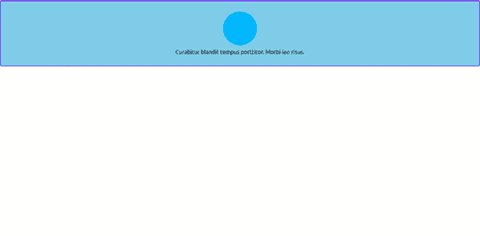
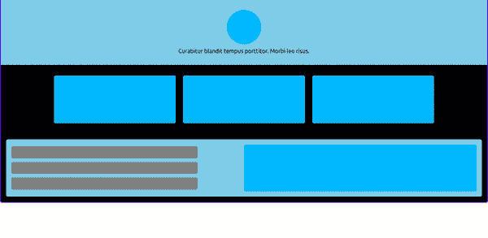
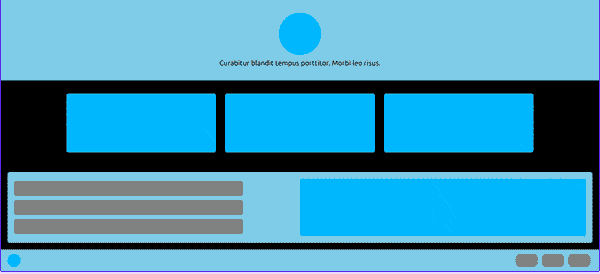

# 使用 AnimXYZ 制作 React 应用程序动画

> 原文：<https://blog.logrocket.com/animate-react-app-animxyz/>

向 web 应用程序添加动画可能是一项具有挑战性的任务，因此使用库来简化它是很自然的。一个可组合的 CSS 动画工具包，允许你通过组合简单的工具类来组合复杂的动画。

在本文中，我们将指导您使用 AnimXYZ 向 React 应用程序添加动画。在本教程结束时，您将创建一个如下所示的动画网页:


要跟随本教程，您需要以下内容:

*   文本编辑器
*   Node.js 安装在本地计算机上
*   HTML、CSS 和 JavaScript 的工作知识
*   CSS 动画的工作知识
*   React 的工作知识

你可以在这个 [CodeSandbox](https://codesandbox.io/s/animxyz-react-example-jmnbgu) 找到本教程的完整代码。我们开始吧！

## 目录

## 什么是 AnimXYZ？

AnimXYZ 是一个动画库，它简化了向网站或网络应用程序添加 CSS 动画的过程。AnimXYZ 动画都在幕后编译成常规 CSS，这意味着它们的行为通常与 CSS 动画相同。页面加载后，元素会自动触发，运行指定的迭代次数，然后返回到原始状态。

## 为什么要用 AnimXYZ？

AnimXYZ 极其好用。它允许您通过用实用程序用文字描述动画来构建动画，而不必编写关键帧。它允许通过 CSS 变量轻松定制动画的所有方面。

AnimXYZ 的性能也很好，允许你在编写尽可能少的代码的同时创建复杂的 CSS 动画。最大尺寸只有 11.4kB，还包括对 Vue 和 React 的支持。

## 入门:AnimXYZ 与 React

在开始编写代码之前，让我们简要回顾一下在 React 项目中开始使用 AnimXYZ 所需的基本概念。

### `XyzTransition`组件

`XyzTransition`组件是 AnimXYZ 提供的 React 组件。作为 [React `TransitionGroup`](https://reactcommunity.org/react-transition-group/switch-transition) 组件的扩展，在元素进入或离开页面时将动画应用于元素，`XyzTransition`是在 React 应用程序中使用 AnimXYZ 的推荐方式。它还负责动画元素之间的切换。

组件一次只能有一个直接子组件。然而，它有一个警告。您不应该使用 React 组件作为该组件的直接子组件。只有 HTML 元素应该是`XyzTransition`的直接子元素。因此，如果您想要将 React 组件制作成动画，就必须用 HTML 元素将它们包装起来，如下所示:

```
<XyzTransition>
  <div><ReactComponent /></div>
</XyzTransition&gt;

```

`XyzTransition`组件有一些属性。

例如，`appear`属性，当设置为 true 时，意味着元素将在第一次呈现时在页面上动画显示。如果`appear`为 false，当页面第一次呈现时，元素将没有动画，但是当它在页面上切换时，它将有动画。

功能类似于`appear`的`appearVisible`属性将暂停动画，直到元素在屏幕上可见。`duration`属性控制动画的长度，最后，`mode`属性控制元素之间切换时的动画行为。

默认的 AnimXYZ 行为是同时过渡两个元素，但是，使用`mode`，您可以决定要么先过渡新元素，要么先过渡旧元素。

### `XyzTransitionGroup`组件

`XyzTransitionGroup`组件类似于`XyzTransition`组件。它也是 React `TransitionGroup`组件的扩展，用于将动画应用于元素组或列表。

`XyzTransitionGroup`与`XyzTransition`组件有相同的注意事项，这意味着该组件的所有直接子组件都必须是 HTML 元素，而不是 React 组件。

它还具有与`XyzTransition`组件相同的属性，只是多了一个属性，即指定用作包装器元素的 HTML 标记的`tag`属性。

## 与公用设施的组合

AnimXYZ 背后的核心思想是允许您编写 CSS 动画，同时节省您编写关键帧的精力。在 AnimXYZ 中，通过传递描述所需动画的实用程序作为`xyz`属性的值，可以向元素添加动画。

下面是一个使用占位符值的示例:

```
<XyzTransition xyz="util-1 util-2 util-3">
  <div></div>
</XyzTransition>

```

## 动画背景

当您使用 AnimXYZ 时，将`xyz`属性放在 AnimXYZ 组件之一或它们的任何子组件上，会在该元素上创建一个动画上下文。默认情况下，在放置了`xyz`属性的元素的子元素上出现的任何 AnimXYZ 动画将使用相同的动画变量。

当您使用`XyzTransitionGroup`组件制作一组相似元素的动画时，此功能最有用:

```
<XyzTransitionGroup appear xyz="util-1 util-2">
  <div className="square" />
  <div className="square" />
  <div className="square" />
</XyzTransitionGroup>

```

由于`XyzTransitionGroup`组件上的动画上下文，每个孩子`div`将拥有由`xyz`属性中的实用程序描述的动画。

## 动画嵌套元素

`XyzTransitionGroup`组件对于制作元素集合的动画很有用，但是当您想要制作更复杂的父子结构的动画时，它并不合适。

在这些情况下，不必描述每个子组件的动画，您可以将一个`xyz-nested`类添加到一个`XyzTransition`组件的子元素中:

```
<XyzTransition xyz="util-1 util-2 util-3">
  <div class="xyz-nested">Child 1</div>
  <div class="xyz-nested" xyz="util-4 util-5">
    <div class="xyz-nested"></div>
    <div class="xyz-nested"></div>
  </div>
  <div class="xyz-nested">Child 3</div>
</XyzTransition> 

```

每个具有`xyz-nested`类的子对象将继承其父对象上的相同动画集。它可以通过向自己的`xyz`属性添加新的实用程序来修改这些动画。如果子对象的`xyz`属性中的工具与父对象的工具冲突，则子对象的工具优先。

## 动画方向

所有 CSS 动画都有一个方向属性，它控制动画是向前播放、向后播放还是交替播放。

默认情况下，当元素被添加到 DOM 时，您在`xyz`属性中描述的动画将被正向应用，当元素被从 DOM 中移除时，动画的方向将被反转。

* * *

### 更多来自 LogRocket 的精彩文章:

* * *

像 AnimXYZ 的大多数方面一样，您可以通过阅读[文档](https://animxyz.com/docs)中的更多信息来定制这种行为。

## 在 React with AnimXYZ 中构建动画网页

让我们通过在 React 中构建一个动画模拟网页来运行一个使用 AnimXYZ 的实际例子。

## 创建 React 项目

首先，通过在终端中运行以下命令来创建一个 React 项目:

```
npx create-react-app react-animxyz

```

上面的命令将创建一个名为`react-animxyz`的文件夹，并在该文件夹中设置一个基本的 React 项目。上面的命令运行完毕后，通过运行以下代码将目录更改为`react-animxyz`:

```
cd react-animxyz

```

## 安装 AnimXYZ

接下来，通过在终端中运行以下命令，将 AnimXYZ 添加到 React 项目中:

```
npm install @animxyz/react

```

如果您得到一个 npm 错误，说 npm 无法解析依赖关系树，请使用`--legacy-peer-deps`标志再次运行该命令。此错误是由 AnimXYZ 指定为依赖项的 React 版本 React v17 与 Create React app 安装的版本 React v18 之间的不一致造成的。

然后，使用以下命令启动 React 项目:

```
npm run start

```

如果您在设备上访问`localhost:4000`，您将看到网页的初始版本。

## 为网页添加样式

在`react-animxyz/src`中创建一个名为`styles.css`的文件。从现在起，我们就称它为`src`。为了设计网页中所有元素的样式，我们将在其中添加以下 CSS 代码，它负责网页中元素的颜色、大小和间距:

```
body {
  padding: 0;
}
p {
  margin: 0;
}
.page-wrap {
  border: 2px solid blue;
  border-radius: 5px;
  background-color: black;
}
.page-hero {
  padding: 30px 0;
  background-color: skyblue;
  text-align: center;
}
.hero-logo {
  width: 7vw;
  height: 7vw;
  border-radius: 51%;
  background-color: deepskyblue;
  margin: 0 auto;
  margin-bottom: 10px;
}
.page-features {
  padding: 30px 0;
  display: flex;
  justify-content: center;
}
.feature-item {
  width: 25vw;
  height: 20vh;
  border-radius: 5px;
  background-color: deepskyblue;
  margin: 0 10px;
}
.page-section {
  margin: 15px;
  background-color: skyblue;
  border-radius: 5px;
  padding: 15px;
  display: flex;
}
.section-left {
  display: flex;
  flex-direction: column;
  width: 50%;
}
.section-item {
  width: 80%;
  height: 5vh;
  border-radius: 5px;
  margin: 5px 0;
  background-color: gray;
}
.section-right {
  background-color: deepskyblue;
  border-radius: 5px;
  width: 50%;
}
.page-footer {
  background-color: skyblue;
  padding: 10px 15px;
  display: flex;
  justify-content: space-between;
}
.footer-logo {
  height: 30px;
  width: 30px;
  border-radius: 50%;
  background-color: deepskyblue;
}
.footer-right {
  display: flex;
}
.footer-item {
  background-color: gray;
  width: 50px;
  border-radius: 10px;
  margin: 0 5px;
}

```

接下来，我们将创建网页的标题。在`src`文件夹中创建一个文件，并将其命名为`Header.jsx`，然后将以下代码放入其中:

```
export default function Header() {
    return (
      <div
        className="page-hero"
        xyz="fade small stagger ease-out-back duration-30"
      >
        <div className="hero-logo xyz-nested"></div>
        <p className="hero-text xyz-nested">
          Curabitur blandit tempus porttitor. Morbi leo risus.
        </p>
      </div>
    );
} 

```

该函数返回一个`div`作为网页的标题。您为标题创建的动画由`xyz`属性中的实用程序描述。让我们来看一下这些实用程序，解释它们的作用:

*   将一个元素的不透明度动画化，使其淡出可见性
*   `small`:沿 x、y 和 z 轴缩小一个元素
*   `stagger`:给每个子元素添加一个延迟，以便各个动画按顺序执行，而不是同时执行
*   `Ease-out-back`:改变动画的速度曲线，并在其末端添加轻微的过冲
*   `duration`:设置动画的长度。本例中的`duration-30`变量指定动画应该持续三秒钟

通过在`xyz`属性中组合这些工具，您已经描述了一个动画，其中元素同时淡出视图并沿所有三个轴收缩。您还指定了子元素上的任何动画都应该按顺序执行。

子元素上的`xyz-nested`类允许它们继承父元素上描述的动画。

打开您的`src/App.js`文件，并用以下代码替换其内容:

```
import "./styles.css";
import Header from "./Header.jsx";
import "@animxyz/core";
import { XyzTransition } from "@animxyz/react";

export default function App() {
  return (
    <XyzTransition appear duration="auto">
      <div className="page-wrap">
        <Header />
      </div>
    </XyzTransition>
  );
}

```

在上面的代码中，您导入了页面和标题组件的 CSS，以及 AnimXYZ 和`XyzTransition`组件的核心。最后，您将标题呈现为一个`XyzTransition`组件的子组件。

请记住，React 组件不应该是`XyzTransition`组件的直接子组件，所以所有 React 组件都是包装器`div`的子组件。页面加载后，动画需要使用`appear`道具来触发。

如果您转到`localhost:4000`，您的网页现在应该如下所示:



## 创造身体

接下来，我们将创建网页的主体。在`src`文件夹中创建一个新文件，并将其命名为`Body.jsx`。接下来，将以下代码放入其中:

```
export default function Body() {
  return (
    <>
      <div
        className="page-features"
        xyz="fade flip-down stagger duration-10 delay-2 ease-out-back"
      >
        <div className="feature-item xyz-nested"></div>
        <div className="feature-item xyz-nested"></div>
        <div className="feature-item xyz-nested"></div>
      </div>
    </>
  );
}

```

上面的代码引入了一些新的实用程序，所以让我们来看一下:

*   `Flip-down`:沿着 x 轴向下移动元素
*   `Delay`:延迟一段时间开始播放动画。`delay-2`变体将动画延迟 0.2 秒

现在，将下面的代码添加到您在`Body`中返回的 JSX 的末尾:

```
<div
        className="page-section"
        xyz="fade small stagger delay-4 ease-in-out"
>
        <div className="section-left" xyz="fade left stagger">
          <div className="section-item xyz-nested"></div>
          <div className="section-item xyz-nested"></div>
          <div className="section-item xyz-nested"></div>
        </div>
        <div className="section-right xyz-nested" xyz="fade big delay-10"></div>
</div>

```

这里有几个新的实用程序需要注意:

*   `ease-in-out`:将动画的速度曲线改为标准`ease-in-out`值
*   `Big`:像`small`工具一样，`big`工具沿着所有三个轴缩放元素，但是它放大而不是缩小元素
*   `Left`:使用`translateX`将元素向左移动，然后将它移动到通常的位置

接下来，通过在`App`函数的返回值中包含`Body`组件，在页面上呈现上面的代码。通过在代码中添加下面一行来导入`App.js`顶部的`Body.jsx`:

```
import Body from "./Body.jsx"

```

然后，通过将组件包含在返回值中，在页面上呈现组件，如下所示:

```
export default function App() {
  return (
    <XyzTransition appear duration="auto">
      <div className="page-wrap">
        <Header />
        <Body />
      </div>
    </XyzTransition>
  );
}

```

您的网页现在应该如下所示:



最后，我们需要创建页脚。在`src`文件夹中创建一个文件，并将其命名为`Footer.jsx`。在其中添加以下代码:

```
export default function Footer() {
  return (
    <div className="page-footer" xyz="fade down ease-in-out delay-10">
      <div
        className="footer-logo xyz-nested"
        xyz="fade left ease-in-out delay-10"
      ></div>
      <div className="footer-right" xyz="fade up stagger ease-in-out delay-10">
        <div className="footer-item xyz-nested"></div>
        <div className="footer-item xyz-nested"></div>
        <div className="footer-item xyz-nested"></div>
      </div>
    </div>
  );
}

```

这里只介绍了几个新的实用程序:

*   `Up`:使用`translateY`将元素上移，然后将它动画到它通常的位置
*   `Down`:与`up`实用程序做同样的事情，但是方向相反

然后，像导入`Body.jsx`一样导入`Footer.jsx`，并将页脚组件添加到`App`函数中。您的`App.js`的最终内容应该类似于下面的代码:

```
import "./styles.css";
import Header from "./Header.jsx";
import Body from "./Body.jsx"
import Footer from "./Footer.jsx"
import "@animxyz/core";
import { XyzTransition } from "@animxyz/react";
export default function App() {
  return (
    <XyzTransition appear duration="auto">
      <div className="page-wrap">
        <Header />
        <Body />
        <Footer />
      </div>
    </XyzTransition>
  );
}

```

完整的网页应该是这样的:



## 结论

当你想写 CSS 动画时，AnimXYZ 是一个非常有用的库。您可以在[文档](https://animxyz.com/docs)的动画部分找到 AnimXYZ 实用程序的完整列表，以及如何定制 AnimXYZ 的说明和它如何在幕后工作的概述。

感谢阅读，并与 AnimXYZ 玩得开心！

## [LogRocket](https://lp.logrocket.com/blg/react-signup-general) :全面了解您的生产 React 应用

调试 React 应用程序可能很困难，尤其是当用户遇到难以重现的问题时。如果您对监视和跟踪 Redux 状态、自动显示 JavaScript 错误以及跟踪缓慢的网络请求和组件加载时间感兴趣，

[try LogRocket](https://lp.logrocket.com/blg/react-signup-general)

.

[ ](https://lp.logrocket.com/blg/react-signup-general) [](https://lp.logrocket.com/blg/react-signup-general) 

LogRocket 结合了会话回放、产品分析和错误跟踪，使软件团队能够创建理想的 web 和移动产品体验。这对你来说意味着什么？

LogRocket 不是猜测错误发生的原因，也不是要求用户提供截图和日志转储，而是让您回放问题，就像它们发生在您自己的浏览器中一样，以快速了解哪里出错了。

不再有嘈杂的警报。智能错误跟踪允许您对问题进行分类，然后从中学习。获得有影响的用户问题的通知，而不是误报。警报越少，有用的信号越多。

LogRocket Redux 中间件包为您的用户会话增加了一层额外的可见性。LogRocket 记录 Redux 存储中的所有操作和状态。

现代化您调试 React 应用的方式— [开始免费监控](https://lp.logrocket.com/blg/react-signup-general)。