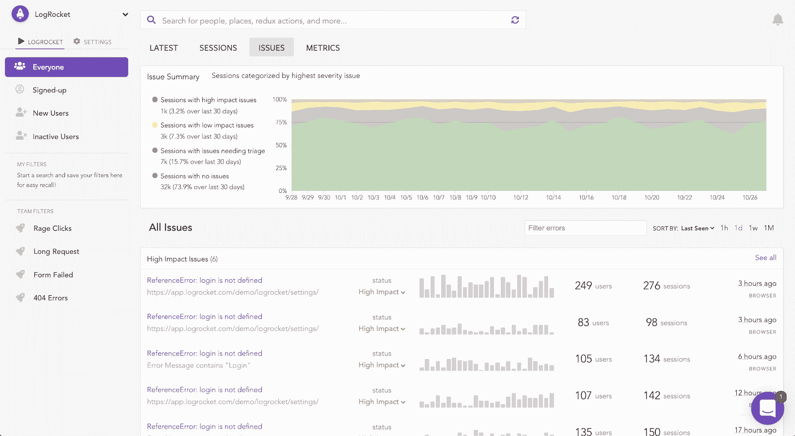
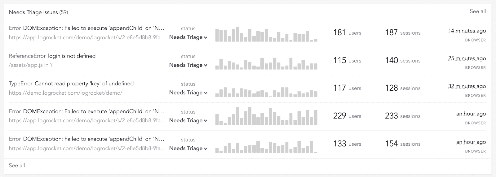
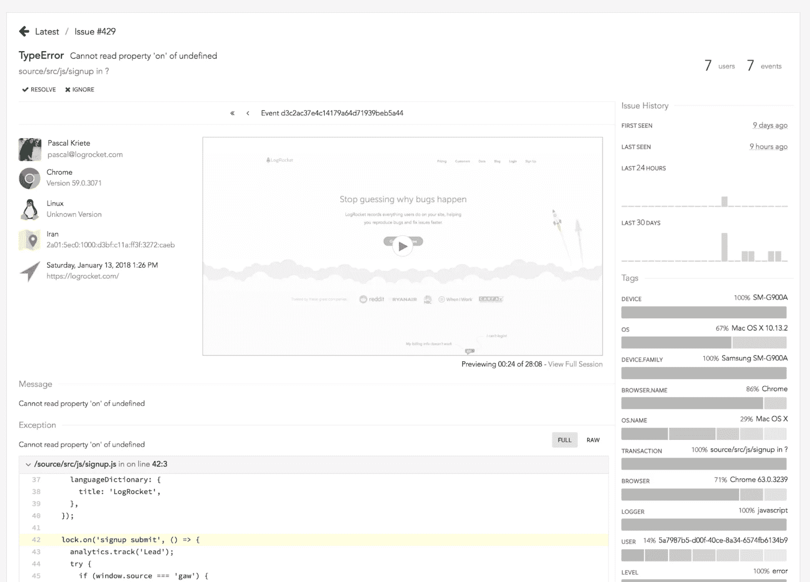
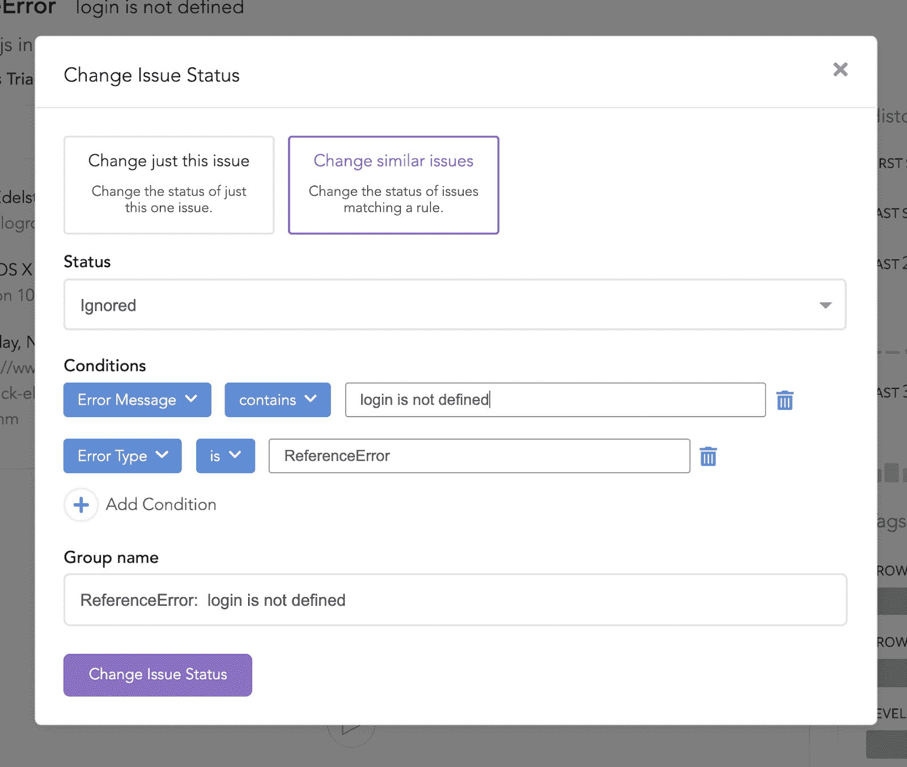

# 发布 LogRocket 问题管理- LogRocket 博客

> 原文：<https://blog.logrocket.com/announcing-logrocket-issue-management/>

理解网络应用中的问题很难。神秘的 JavaScript 错误、缓慢的性能、用户报告的错误和模糊的 UX 问题会让用户感到沮丧，并垄断开发人员的时间。这些只是显而易见的问题——大多数 bug 实际上从未被报告过，因为有糟糕体验的用户只是离开或默默忍受。

传统的错误报告工具捕获一些有用的信息，如堆栈跟踪，但是许多团队发现它们有三个主要缺陷:

1.  他们的警报太吵了。
2.  他们没有捕捉到足够的上下文来理解问题的根本原因或对用户的影响。
3.  他们对 JavaScript 错误的关注忽略了潜在的更有影响的问题，如网络错误、UX 问题和缓慢的性能。

## 后勤问题管理

LogRocket 的问题管理通过提供一个易于使用的仪表板来解决这些问题，该仪表板可以可视化您的前端应用程序的健康状况。您可以将它想象成一个收件箱，问题在其中浮现并被标记，它带有一个强大的规则引擎，可以根据问题对用户的影响程度自动对问题进行分类。

问题管理目前正在处理 JavaScript 错误，有更多的问题类型，如网络错误、UX 问题(愤怒点击、鞭打、死点击)、浏览器崩溃和当前测试版中的丢失转换。

问题管理的基础是**摘要视图**，它显示了一段时间内受不同类型问题影响的用户会话的百分比。这种可配置的可视化提供了对应用程序整体健康状况的理解，而这在传统的错误报告工具中很难从大量嘈杂的错误中确定。

在现代生产应用程序中，总会出现新的问题，以及不断出现的已知问题。了解应用程序运行状况如何随着时间的推移而发展，可以增强团队的信心，并能够优先解决对客户体验影响最大的问题。

在 beta 测试期间，我们发现许多团队都围绕这个指标，使用它来围绕无问题会话的百分比设置目标或内部 SLA。在 LogRocket，我们当然是在喂我们自己的产品，我们的目标是 90%的会话是无问题的，不超过 1.5%的会话遇到高影响问题。

## 分类问题

在**摘要视图**下面是按优先级排列的活动问题列表。

在打开一个需要分类的问题时，LogRocket 会显示一个像素级的会话回放视频，准确地捕捉到用户在屏幕上看到的内容。这使得评估一个问题对用户的影响变得容易，这种影响可以从什么都没有(根据我们的研究，大约 45%的 JavaScript 错误对用户没有影响)到完全禁用你的应用程序。

为了创建会话重放视频，LogRocket 使用 DOM 来记录问题发生时页面上的 HTML 和 CSS。LogRocket 还记录控制台日志、JavaScript 错误、堆栈跟踪、网络请求/响应、CPU/内存使用和浏览器崩溃，以便为您提供如何再现问题的附加上下文。它还与 React、Redux 和 Angular 等库进行了深度集成，以记录操作和应用程序状态。

### 发布规则

一旦您观看了 LogRocket 重播并确定了某个问题对您的用户的影响，LogRocket 的规则引擎会让您对其进行标记，以便在类似问题再次出现时自动对其进行分类。这种自动化有助于减少传统错误报告工具的干扰，并确保新的高影响问题迅速得到关注。

### 发信号

及时接收警报是在关键问题影响用户之前快速修复它们的关键。然而，传统错误报告工具中嘈杂的警报和问题影响上下文的缺乏通常会导致警报疲劳。太多模糊或不重要问题的提醒会导致收件箱混乱，并有错过重要信息的风险。

LogRocket 的警报使用我们的规则引擎对可能具有高度影响的问题的警报进行优先级排序。我们通过 Slack、电子邮件或 Pagerduty 等工具进行沟通，立即向您展示问题的视频回放，以简化诊断流程。许多令人兴奋的警报改进目前都处于测试阶段，我们计划在未来几个月推出这些功能时宣布更多改进。

## 前端是未来

向丰富的单页应用的转变无疑提高了用户体验质量和开发人员的工作效率。但是随着复杂性的增加，需要更多的可观察性。现有的工具还不足以让团队对他们发布的前端代码有信心。

随着问题管理的推出，我们相信朝着解决方案又迈进了一大步。结合 Metrics、 [Insights](https://logrocket.com/funnel-insights/) 和我们的核心会话回放功能，LogRocket 为产品和工程团队提供了一个统一的平台来监控和改进他们的应用。

如果你想帮助前端开发人员定义下一代工具，我们很乐意见到你。我们正在招聘。