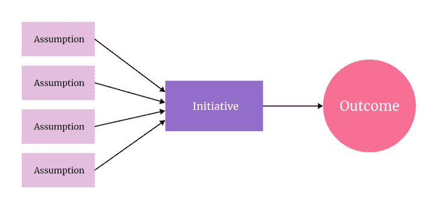
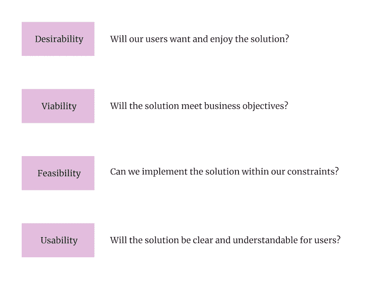

# 什么是假设映射？带示例的完整指南

> 原文：<https://blog.logrocket.com/product-management/assumption-mapping-guide-examples/>

作为产品经理，测试假设是你最重要的职责之一。也是最暧昧的一个。

在本文中，我将尝试使识别、优先化和测试假设的任务更加有形，以帮助您更有效地降低产品风险。

* * *

## 目录

* * *

## 假设的关键性

让我们从分解为什么假设对产品经理如此重要开始。

产品经理负责推动具体成果。我们通过启动一系列计划来做到这一点，无论是新功能、重新设计、促销活动、价格变化等等。

所有这些举措都基于一套基本假设。你会假设这样的事情:

*   这是顾客想要的
*   这将使我们的收入增加 X %
*   这需要 N 次冲刺来发展

如果这些假设正确，你就赢了。你最终会有一个推动结果的成功计划。但是，如果你做错了，你最终会得到一个低于你期望的结果，或者更糟，一个彻底的失败。

最大的问题是，项目经理经常忽视对特定假设的思考。大多数产品经理仍然是面向问题和解决方案的。因此，他们通常测试整个计划，而不是潜在的假设。

这有两个问题:

1.  **测试来得太晚了** —当你测试一个完整的计划时，你已经投入了时间和精力，而且你无法收回
2.  **结果不明朗** *—* 如果你用 15 个未经验证的假设来测试一个计划，而它失败了，你就不能精确地指出哪些假设对结果有积极/消极的影响。这极大地限制了你的学习能力

糟糕的产品经理关注的是解决方案。好的产品经理专注于问题。伟大的产品经理专注于假设。

## 假设映射和测试

有各种各样的方法来处理假设。最常见的方法之一是使用假设图。

使用假设的基本过程包括三个步骤:

1.  [确定假设](#1identifyassumptions)
2.  [地图假设](#2mapassumptions)
3.  [测试假设](#testassumptions)

### 1.确定假设

第一步是尽可能多地发现和识别假设。

事实是，你可能不会捕捉到所有的假设——总会有一些隐藏的假设，你错过了或者没有考虑到，但这没关系。

让我们从了解不同类型的假设开始，这应该有助于您确定具体的假设。

尽管项目经理和组织对假设的分类不同，但最常见的方案将假设分为四种类型:

1.  **合意性** —用户是否会发现解决方案有价值
2.  **可行性** —该解决方案是否会带来商业利益
3.  **可行性** —解决方案是否能在合理的成本内引入
4.  **可用性** —解决方案是否对 UX 友好

确定假设的最直接的方法是问自己，“要使想法可行/合意/可行/可用，什么必须是真的？”

换个角度来看，假设您正在构建一个允许用户以类似优步的方式订购遛狗器的应用程序。现在，让我们试着为您的假设图找出一些假设:

*   要让这个想法令人满意，必须满足什么条件？
    *   你瞄准的市场要经历没时间遛狗的痛点
    *   你的潜在用户必须愿意把宠物托付给陌生人
    *   订单和履行之间的时间应该在 60 分钟之内，以便用户理解
*   要使这个想法可行，必须满足什么条件？
    *   平均而言，每份订单可以带来 2 美元的收入
    *   你的客户获取成本应该低于 0.20 美元
*   要使这个想法可行，必须满足什么条件？
    *   您可以在四个月内构建该产品的第一个版本
    *   每 1，000 名每日活跃用户的基础架构成本不会超过每月 200 美元
*   要使这个想法可行，必须满足什么条件？
    *   用户将很快理解价值主张
    *   用户将明白他们可以立即订购或提前订购

以上只是你可能做出的不同类型假设的一个例子。事实上，应该有几十个。

使用可行性/合意性/可行性/可用性标签作为提示来集中你的思考，但是不要过度紧张。例如，您可以讨论“订单和履行之间的时间应该在 60 分钟以内”实际上是一个可取性或可用性假设。但是，实际上，这并不重要。

### 2.地图假设

假设图是所有假设及其相对重要性/证据水平的强大可视化表示。

重要性是指假设对于计划的成功有多重要。

要回答这个问题，试着问自己一个后续问题:“如果假设被证明是错误的，会发生什么？”

如果答案是:

*   整个计划没有意义——那么它非常重要
*   我们需要一个概念上的小支点——那么它就是中等重要性
*   对概念的负面但可接受的影响——那么它就不重要

自信回答了这个问题，“我们有多少证据来宣称假设是真的？”。

* * *

订阅我们的产品管理简讯
将此类文章发送到您的收件箱

* * *

我会说如果你有:

*   强有力的定量证据——那么它的可信度很高
*   强烈的定性证据/中等的定量信号——那么它的可信度为中等
*   直觉或专家意见——那么它的证据相对较少

这些只是你如何衡量自信和重要性的例子。有几十种评估这两种价值的框架和方法，所以使用你认为合适的。

#### 假设图示例

根据重要性和置信度得分，将其映射到一个 2×2 矩阵上，瞧，您就有了一个假设图:

假设图可视化了所有已知的假设，并向您展示了这些假设经过充分测试的程度和重要性。不一定要科学，超精确；这里的目标是对你的假设类型有一个高层次的了解。

#### 解读假设图

根据您地图上的假设，采取以下后续步骤:

##### 高重要性/低可信度:尽快测试

高重要性/低信心象限中的假设应该是您的首要关注点。在你承诺一个想法或构建产品的第一个版本之前，应该对这些假设进行测试。

尽管实际的发布是最终的验证，但是您应该尽可能地测试这些想法以避免浪费(我们将在后面看到如何测试)。

##### 低重要性/低可信度:考虑测试

重要性和可信度都较低的假设对于测试来说并不重要，尽管您仍然应该考虑它们。

考虑决策的重要性和努力程度；如果一个想法相对容易验证/测试，那就这么做。但是如果这需要大量的努力来测试这个想法，那就不值得了。

##### 高重要性/高可信度:考虑测试

即使一个假设已经有很高的可信度，如果它对产品的成功至关重要，我仍然建议寻找进一步验证它的方法。尽量把它推到假设图上最左边。

当然，在你发布产品之前，你永远不会百分百确定。这里，再一次，应该做出重要性和努力的决定来帮助你决定什么时候好就足够了。

##### 低重要性/高可信度:忽略

如果一个假设的重要性很低并且经过高度测试，就忽略它。你有更重要的事要做。

### 3.通过测试假设来降低风险

消除你的想法和计划风险的最有效的方法是测试个人假设并增加你对它们的信心。

除了建立信心，测试假设还会带给你额外的知识和见解，帮助你塑造产品的未来方向。

虽然测试假设是一个值得单独写一篇文章的主题，但是这里有一些可以用来验证假设的技术示例:

#### 面谈/调查/实地测试

大多数合意性假设可以通过简单地与用户交谈来测试。确保你尽可能地了解你的目标人物。[采访](https://blog.logrocket.com/product-management/why-how-conduct-customer-interviews/)、[调查](https://blog.logrocket.com/product-management/customer-satisfaction-survey-templates-examples-questions/)、[观察他们的行动](https://blog.logrocket.com/product-management/customer-feedback-why-you-should-seek-how-to-obtain/)。

#### 可用性测试

可用性假设通常是最容易测试的。只需[构建一个原型](https://blog.logrocket.com/product-management/wireframe-vs-mockup-vs-prototype/)并观察用户如何与之交互。是直观易懂，还是他们纠结？

#### 市场分析

市场评估、[竞争分析](https://blog.logrocket.com/product-management/what-is-competitive-analysis-template-examples-tutorial/)和市场动态研究可以帮助你测试各种假设。

例如，如果市场上有竞争对手在类似的计划上做得很好，那么市场上可能会有这种需求。但是，如果竞争对手已经建立，进入壁垒很高，进入市场可能在经济上不可行。

#### 技术调查

技术调查是检验可行性假设的主要方式。它可以是一个实际的调查(开发人员对一个主题进行研究并估计工作量)，一个简单的概念证明，一个文档回顾，等等。

技术调查通常回答两个问题:

1.  这个想法在我们的限制范围内有可能实现吗？
2.  实现这个想法需要多少努力/成本？

花几个小时进行技术调查可以帮助你避免在不可行的想法上浪费数百个小时。

#### 二尖瓣脱垂综合征

构建 MVP 是验证假设的最有力的方法之一。

尽管许多人把 MVP 这个术语与产品的第一个版本联系在一起，[还有其他方法来定义你的 MVP](https://blog.logrocket.com/product-management/how-to-validate-product-ideas-before-shipping/) 。例如，您可以尝试:

*   kickstarter 活动
*   一个简单的登录页面
*   假门
*   模拟销售

…等等，这取决于您想要验证的假设。

假设图是强有力的工具，为你的验证和去风险策略提供结构。然而，如果您将它作为一个长期的、有生命的工件来使用，您将获得这项技术的大部分好处。

随着时间的推移，你会发现新的假设，而忽略其他的。一些以前不重要的假设在新的环境下可能会变得超临界，随着时间的推移，你会对这些假设变得/失去信心。

将你的假设图视为另一种类型的每周“仪表板”，可以让你更有效地进行产品决策，因为你知道在任何给定的时刻你应该将学习集中在哪里。

## [LogRocket](https://lp.logrocket.com/blg/pm-signup) 产生产品见解，从而导致有意义的行动

[LogRocket](https://lp.logrocket.com/blg/pm-signup) 确定用户体验中的摩擦点，以便您能够做出明智的产品和设计变更决策，从而实现您的目标。

使用 LogRocket，您可以[了解影响您产品的问题的范围](https://logrocket.com/for/analytics-for-web-applications)，并优先考虑需要做出的更改。LogRocket 简化了工作流程，允许工程和设计团队使用与您相同的[数据进行工作](https://logrocket.com/for/web-analytics-solutions)，消除了对需要做什么的困惑。

让你的团队步调一致——今天就试试 [LogRocket](https://lp.logrocket.com/blg/pm-signup) 。

[Bart Krawczyk Follow](https://blog.logrocket.com/author/bartkrawczyk/) Learning how to build beautiful products without burning myself out (again). Writing about what I discovered along the way.