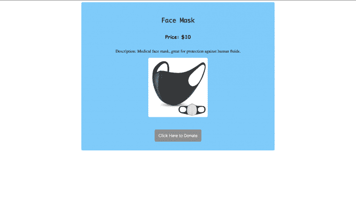
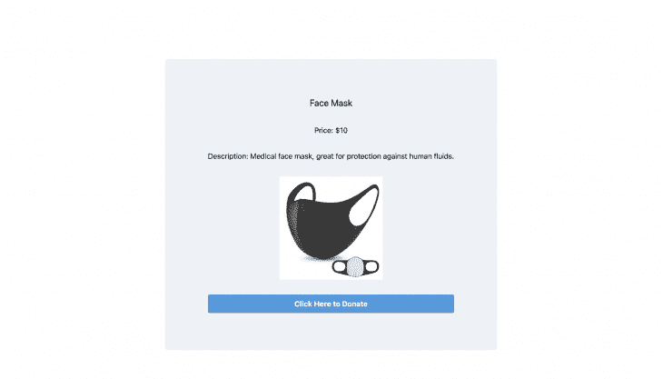

# 原子 CSS-in-JS vs .实用优先框架

> 原文：<https://blog.logrocket.com/atomic-css-in-js-vs-utility-first-frameworks/>

对于如何在应用程序中处理样式，有很多选择。我们已经从传统的“HTML、CSS 和 JS”教科书格式发展到拥有更加灵活和高性能的选项。最近，用 JS 编写 CSS 的趋势越来越强，这可以从大量涌现的 CSS-in-JS 库中看出来。公用事业类也已经存在了一段时间，围绕它们的积极倾向不会很快消失。在本文中，我们将看看原子 CSS-in-JS 库和实用优先的 CSS 框架，它们之间的比较，它们的缺点，以及一些使用这两种概念的优秀项目。

## 用 JS 编写 CSS

当使用 CSS-in-JS 库时，所有样式和依赖项都是与应用程序的逻辑一起编写的。这消除了追加或导入样式表的需要。以这种方式工作的一个非常好的库是 [`styled-components`](https://styled-components.com/) 。假设你有一个 React 应用程序——一个捐赠页面——需要设计风格:

```
import React, { useState } from "react";
import styled from "styled-components";

const ProductState = {
  products: {
    item: "Face Mask",
    price: "10",
    description: "Medical face mask, great for protection against human fluids.",
    image: "https://res.cloudinary.com/fullstackmafia/image/upload/v1589655457/face-mask_ara8yf.jpg"
  }
};

const App = () => {
  const [state] = useState(ProductState);
  return (
    <div>
      <h2>{state.products.item}</h2>
      <h4>Price: ${state.products.price}</h4>
      <p>
        Description: {state.products.description}
      </p>
      
      <button>Click Here to Donate</button>
    </div>
  );
};
export default App;
```

下面的代码片段动态地设置了全局 HTML 元素`div`的样式，然后将其属性保留并等同于新创建的组件`ProductDiv`:

```
 import styled from "styled-components";

 const ProductDiv = styled.div`
   display: grid;
   justify-content: center;
   text-align: center;
   margin: auto;
   border-radius: 5px;
   background-color: #66ccff;
   width: 50%;
   padding: 35px;
 `;
```

以这种方式创建样式组件非常好，因为它们可以导出到应用程序的其他部分，并且可以重用，而不必创建额外的组件。关键字`styled`被附加到 HTML 元素中，样式本身被包含在模板文字中。嵌入式语法看起来很像传统的 CSS，只是现在它是由一个组件控制的。像这样的例子:

```
// style.css

.ProductHeader h2 {
  font-size: 25px;
  font-family: "Lucida Console", Monaco, monospace;
}
```

变成这样:

```
const ProductHeader = styled.h2`
  font-size: 25px;
  font-family: "Lucida Console", Monaco, monospace;
`;
```

然后无缝地将最终结果插入到您的应用程序组件中:

```
import React, { useState } from "react";
import styled from "styled-components";

const ProductState = {
  products: {
    item: "Face Mask",
    price: "10",
    description: "Medical face mask, great for protection against human fluids.",
    image: "https://res.cloudinary.com/fullstackmafia/image/upload/v1589655457/face-mask_ara8yf.jpg"
  }
};

const ProductDiv = styled.div`
  display: grid;
  justify-content: center;
  text-align: center;
  margin: auto;
  border-radius: 5px;
  background-color: #66ccff;
  width: 50%;
  padding: 35px;
`;

const ProductHeader = styled.h2`
  font-size: 25px;
  font-family: "Lucida Console", Monaco, monospace;
`;

const App = () => {
  const [state] = useState(ProductState);
  return (
    <ProductDiv>
      <ProductHeader>{state.products.item}</ProductHeader>
      // rest of the app is styled accordingly...
    </ProductDiv>
  );
};
export default App;
```



Check out the full demo [here](https://codesandbox.io/s/react-styled-components-app-0blif?file=/src/App.js)

以这种方式设计应用程序有很多好处:

*   重用样式和一次性样式的创建和处理方式相同
*   这对于代码分割来说很棒——重要的 CSS 片段可以被提取出来并在多个组件中使用
*   因为每种 CSS 样式都封装在一个组件中，所以只需更改所涉及的样式化组件的特性，而不必冒险更改应用程序的其他部分，就可以更容易地更改应用程序的一部分

## 效用优先的 CSS 框架案例

用实用程序类编写 CSS 源于这样一种需要，即专注于在 HTML(或一些前端框架的 JSX)中应用所有样式。有几个库遵循这一理念——其中之一是 [Tailwind CSS](https://tailwindcss.com/) 。风格的每一点都是在元素的旁边表达出来的。这将带来如下非常简单的标记:

```
<p className="flex justify-center my-4 font-sans text-center">
  Description: This is a Product
</p>
```

使用实用程序类方法对前面的 React 应用程序示例进行样式化，如下所示:

```
import React, { useState } from "react";
import "./tailwind.generated.css";

const ProductState = {
  products: {
    item: "Face Mask",
    price: "10",
    description: "Medical face mask, great for protection against human fluids.",
    image: "https://res.cloudinary.com/fullstackmafia/image/upload/v1589655457/face-mask_ara8yf.jpg"
  }
};

const App = () => {
  const [state] = useState(ProductState);
  return (
  <div className="grid justify-center m-auto mt-32 p-16 w-1/2 bg-gray-200 rounded-md">
    <h2 className="flex justify-center my-4 font-sans text-center text-xl">
      {state.products.item}
    </h2>
     /* rest of the app is styled accordingly... */
  </div>
  );
};
export default App;
```



You can check out the full demo [here](https://codesandbox.io/s/react-tailwind-app-0smyp?file=/src/App.js)

如上面的代码示例所示，重点主要放在标记上，尽可能严格地对每个类进行分类非常重要，否则实用程序类的基本意义就丧失了。与样式化组件不同，在样式化组件中，组件名称是存在的，像`grid`、`m-auto`或`text-center`这样的实用程序类可以很容易地放在标记中的任何地方，所以跟踪规则的设置并确保它们都有单一的职责是很重要的。

实用程序类的一个关键优势是它对初学者友好的方法。假设您有一个想要添加`hover`属性的按钮——使用实用程序类非常简单:

```
<button className="bg-red-400 hover:bg-grey-700 text-white font-bold rounded">
  Click Here to Donate
</button>
```

尽管在某种程度上可以忽略不计，但实用程序类节省了大量空间和文件大小。对于创建的每个样式化组件，都有一个额外的变量声明，一个带有类似于`text-xl`的简单命令的 liner 实用程序类可能就是您所需要的全部，而不是为更新的标题的字体大小创建一个新的组件。

## 这两个概念的缺点

### CSS-in-JS

尽管有观点认为用 JS 编写 CSS 可以提高效率，但它也有一些缺点。对于初学者来说，这不是很容易上手。CSS-in-JS 库倾向于为几乎每个库特有的各种概念提供逻辑定义。看看`styled-components`中的这个概念，它使您能够在一个组件中引用不同的组件:

```
import React from "react";
import styled from "styled-components";

  const Link = styled.a`
    display: grid;
    justify-content: center;
    padding: 5px 10px;
    background: #ffd9b3;
    color: #003300;
  `;
  const HotButton = styled.button`
    flex: none;
    transition: background 2s;
    width: 50px;
    height: 50px;
    ${Link}:hover & {
      background: #80bfff;
    }
  `;

  const App = () => {
    return (
      <Link>
       <HotButton>
         Click To Review
      </HotButton>
    </Link>
    );
  };

export default App;
```

 [https://www.youtube.com/embed/D6AYLBVGDXo?version=3&rel=1&showsearch=0&showinfo=1&iv_load_policy=1&fs=1&hl=en-US&autohide=2&wmode=transparent](https://www.youtube.com/embed/D6AYLBVGDXo?version=3&rel=1&showsearch=0&showinfo=1&iv_load_policy=1&fs=1&hl=en-US&autohide=2&wmode=transparent)

视频

`Link`组件通过在不同的组件`HotButton`中引用它来设置样式。这看起来确实是覆盖组件样式的好方法，但是如果大规模使用，可能会导致问题，使样式不可维护。

另一个关键问题是安全性，这听起来不太可能。像`styled-components`这样的库允许你在 CSS 中嵌入 JavaScript，这意味着如果有敏感代码，比如你的 CSS 中的用户输入，你的应用将容易受到 XSS 攻击。因此，让用户输入远离你的风格是很重要的，如果这是一个合作项目，团队中的其他人也要理解这一点。考虑到这种安全风险，有必要问一问对 JS 组件进行样式化是否值得。

### 实用程序类别

实用程序类中的主要问题的一线希望是，如果实用程序类被谨慎地使用而不是大规模地使用，它们是可以避免的。实用程序类依赖于元素的外观保持不变，而在大型项目中，情况往往并非如此。当你开始有很多元素嵌入一个特定的规则，但它们没有遵循那个规则时，你就会知道有问题了。假设元素的标记中有`float-left`,但是它们是居中右对齐的。

另一个关键问题是设计响应能力。在不使标记难以理解的情况下，可以在多大程度上修改元素之间的间距？此外，当经常使用像`space-x-40`和`-space-x-40`这样的规则时，它们可能会互换，事情可能会变得非常不愉快。

此外，当使用实用程序类时，规则实施可能变得相当不一致。为了让一种风格发挥作用，合作者可以很容易地发现自己在一个元素中添加了不同的实用类。这种偏差，一点一点地，可以很容易地导致具有巨大不一致性的广泛的代码库。不用说，这将使代码维护非常困难，如果不可能的话。

## 摘要

如果使用得当，CSS-in-JS 和实用程序类都是很好的概念。然而，对于他们两个来说，让团队成员或者贡献者非常熟悉这两个概念或者为所涉及的项目设置的任何特定规则是很重要的。

## 你的前端是否占用了用户的 CPU？

随着 web 前端变得越来越复杂，资源贪婪的特性对浏览器的要求越来越高。如果您对监控和跟踪生产环境中所有用户的客户端 CPU 使用、内存使用等感兴趣，

[try LogRocket](https://lp.logrocket.com/blg/css-signup)

.

[](https://lp.logrocket.com/blg/css-signup)[https://logrocket.com/signup/](https://lp.logrocket.com/blg/css-signup)

LogRocket 就像是网络和移动应用的 DVR，记录你的网络应用或网站上发生的一切。您可以汇总和报告关键的前端性能指标，重放用户会话和应用程序状态，记录网络请求，并自动显示所有错误，而不是猜测问题发生的原因。

现代化您调试 web 和移动应用的方式— [开始免费监控](https://lp.logrocket.com/blg/css-signup)。