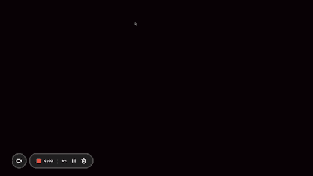
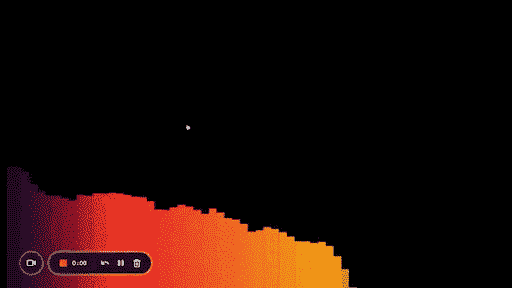

# 用普通的 JavaScript 从头开始编写一个音频可视化工具

> 原文：<https://blog.logrocket.com/audio-visualizer-from-scratch-javascript/>

众所周知，音频可视化工具是增加音乐听觉体验的绝佳方式。在本文中，我们将介绍如何仅使用普通的 JavaScript 和内置的浏览器画布和 Web 音频 API 从头开始创建音频可视化工具。

在这篇文章结束时，你将对如何创建你自己的音频可视化工具有一个坚实的理解，并且能够试验不同的可视化音频数据的方法。

*向前跳转:*

## 数字音频的工作原理

让我们从数字音频如何工作的基本解释开始。

计算机不像我们在现实世界中那样理解声音。为了将声音转换成可以存储的数据，计算机会做一种叫做采样的工作。采样是通过测量撞击麦克风的声波作为数据点来完成的。一旦计算机有了这些数据点，也称为样本，它就可以将它们存储在文件中。

当我们想要回放音频时，计算机会进行相反的过程:它会从那些记录的数据点中重建声音。我们将使用这些数据点来绘制动态条形图。

这是足够的理论，现在让我们进入一些代码！

## 设置项目

即使我们将使用普通的 JavaScript，我们仍然需要设置一个服务器来跟进。我们需要服务器的原因是为了绕过 CORS 问题。

CORS 阻止从其域外访问资源。因此，为了分析音频数据，我们需要将音频文件和网页放在同一个服务器上。

对于本教程，我使用的是 [Vite](https://vitejs.dev/) ，这是一个简单明了的开发服务器，但是您可以随意使用您选择的任何其他服务器。

## 构建可视化工具

为了构建可视化工具，我们将使用两个内置的浏览器 API:Canvas 和 Web Audio API。

### 画布 API 概述

Canvas 是一个 HTML5 元素，允许我们在网页上绘制图形。在这种情况下，我们将使用它来绘制动态条形图。

Canvas 也分为两个不同的 API:2D 和 WebGL。我们将在本教程中使用 2D 版本，因为 WebGL 更多地处理 3D 图形。

### 网络音频 API 概述

网络音频 API 允许我们直接在浏览器中处理和播放音频文件。我们将使用它来加载和播放音频文件，并提取生成可视化所需的原始数据。

有了所有这些必要的理论，让我们进入一些代码！

### 设置条目文件

首先，我们需要设置我们的 HTML 文档。我们将创建一个包含画布和音频元素的简单 HTML 文档。

让我们将文件命名为`index.html`；它将作为我们项目的切入点。当您创建一个普通的 Vite 项目时，它已经为您设置了一个`index.html`文件:

```
<html lang="en">
  <head>
    <meta charset="UTF-8" />
    <link rel="stylesheet" href="stylesheet.css" />
    <title>Audio Visualizer</title>
  </head>
  <body>
    <div id="container">
      <canvas id="canvas"></canvas>
      <audio id="audio"></audio>
    </div>
    <script src="script.js"></script>
  </body>
</html>
```

重要部分在文档的`body`中。我们有一个`div`和一个`container`的`id`。这是我们将举行我们的`canvas`和`audio`元素。

`canvas`元素是我们绘制动态条形图的地方。元素是我们用来回放音频文件的。我们正在添加对`script.js`文件的引用。这个文件将包含我们分析音频和生成视觉效果的所有代码。

### 添加简单的样式

我们还添加了简单的 CSS 样式，它添加了黑色背景以获得更好的对比度，并将我们的 canvas 元素放置在屏幕的中央:

```
* {
    margin: 0;
    padding: 0;
    box-sizing: border-box;
}

#container {
    position: absolute;
    top: 0;
    left: 0;
    background: #000;
    width: 100%;
    height: 100%;
}

#canvas {
    position: absolute;
    top: 0;
    left: 0;
    width: 100%;
    height: 100%;
}

```

现在让我们开始添加代码，使所有这些元素实际上做一些事情。

### 初始化画布和音频资源

首先，让我们设置对画布和音频元素的引用，并创建一些我们需要的其他变量:

```
let audio1 = new Audio();
audio1.src = "tune.mp3";

const container = document.getElementById("container");
const canvas = document.getElementById("canvas");
canvas.width = window.innerWidth;
canvas.height = window.innerHeight;

const ctx = canvas.getContext("2d");
```

我们正在创建一个新的`Audio`对象，将`src`属性设置为我们想要播放的音频文件的位置。我们将`canvas`元素的宽度和高度设置为浏览器窗口的大小。这样，我们的可视化将总是充满整个屏幕。

接下来，我们需要设置我们的音频源、分析器和音频上下文对象。但是首先，让我们来看看这些对象分别代表什么。

音频源是一个代表音频源的 [AudioNode](https://developer.mozilla.org/en-US/docs/Web/API/AudioNode#description) 对象。在我们的例子中，它将是我们添加的`audio`元素。

分析器节点帮助我们了解声音发生了什么。它使我们有可能看到和使用来自声音的数据，这样我们就可以创建我们的可视化工具。分析器包含类似`frequencyBinCount`的各种属性，我们稍后将使用这些属性来计算我们需要收集多少数据点。

音频上下文负责管理所有 Web 音频 API 节点。我们将使用它来创建我们的`audio source`和`analyzer`节点。

* * *

### 更多来自 LogRocket 的精彩文章:

* * *

### 设置 Web 音频 API 变量

现在让我们设置我们的音频源、分析器和上下文:

```
const audioCtx = new (window.AudioContext || window.webkitAudioContext)();
let audioSource = null;
let analyser = null;

audio1.play();
audioSource = audioCtx.createMediaElementSource(audio1);
analyser = audioCtx.createAnalyser();
audioSource.connect(analyser);
analyser.connect(audioCtx.destination);
```

我们创建了一个`AudioContext`对象的新实例。我们还声明了另外两个变量，`audioSource`和`analyser`，我们将用它们来创建我们的音频源和分析器节点。

接下来，我们使用音频上下文创建了`audioSource`和`analyser`对象节点。

最后，我们将我们的`audioSource`和`analyser`节点相互连接，并连接到音频上下文的目的地(扬声器)。这种设置形成了音频流过的节点链。

### 计算可视化工具的条形尺寸

现在我们已经设置了音频上下文和节点，我们可以开始为可视化工具编写代码了。

首先，让我们弄清楚要显示多少个条形，每个条形应该有多宽:

```
analyser.fftSize = 128;
const bufferLength = analyser.frequencyBinCount;
const dataArray = new Uint8Array(bufferLength);
const barWidth = canvas.width / bufferLength;
```

我们将分析器的`fftSize`属性设置为`128`。这将决定我们从声音中收集多少数据点。数字越大，我们得到的数据点就越多，显示的条形就越多。

我们正在创建一个新的`bufferLength`变量，并将其设置为等于分析器的`frequencyBinCount`属性。这个属性告诉我们基于我们之前设置的`fftSize`我们有多少数据点。`frequenceBinCount`永远是`fftSize`的一半。

我们正在创建一个新的`dataArray`变量，并将其设置为等于`bufferLength`大小的`Uint8Array`。这个数组将保存我们从声音中收集的所有数据点。

最后，我们正在创建一个新的`barWidth`变量。该变量决定了可视化工具中每个条形的宽度。我们将它设置为等于画布的宽度除以`bufferLength`。

### 制作条形动画

现在让我们编写将执行实际动画的函数:

```
let x = 0;
function animate() {
    x = 0;
    ctx.clearRect(0, 0, canvas.width, canvas.height);
    analyser.getByteFrequencyData(dataArray);
    for (let i = 0; i < bufferLength; i++) {
        barHeight = dataArray[i];
        ctx.fillStyle = "white";
        ctx.fillRect(x, canvas.height - barHeight, barWidth, barHeight);
        x += barWidth;
    }

    requestAnimationFrame(animate);
}

animate();
```

`x`用于在绘制条形时记录我们在 x 轴上的位置。我们清空画布，这样我们就可以在每一帧的空白板上开始绘画。然后我们在我们的`analyser`节点上调用`getByteFrequencyData`方法。这个方法接受一个数组作为它的参数。我们将我们的`dataArray`传递给这个方法。这将用来自声音的数据填充我们的`dataArray`。

然后我们使用一个`for`循环来遍历`dataArray`数组。

对于每一项，我们将`barHeight`变量设置为等于数据点。我们用`fillRect`的方法在`x`、`y`位置用我们之前设置的`barWidth`和`barHeight`画一个矩形。

然后我们用`barWidth`来增加`x`变量。这样做可以确保每个条形都绘制在前一个条形的旁边。

最后，我们调用`requestAnimationFrame`方法并将其传递给我们的`animate`函数。这告诉浏览器在每一帧上调用我们的`animate`函数。

***注意:*** ，由于我们在 `*animate*` *函数本身内部调用`*requestAnimationFrame*` *，这将导致* `*animate*` *函数在循环*中被反复调用*

最终结果应该是这样的:



恭喜你。你已经建立了一个简单的酒吧可视化！在下一节中，我们将对它进行一些改进。

## 添加颜色和修饰用户界面

教程中最难的部分已经过去了。在这一节中，我们将为我们的可视化工具添加一些颜色，并稍微修饰一下 UI。

### 添加颜色

我们当前的可视化工具充满了白色矩形，这不是太令人兴奋。让我们给它加点颜色吧！

这是你可以自己尝试的地方。没有一种方法可以增加随机性，所以我们将使用`for`循环中的动态值来生成一些随机颜色:

```
let barHeight;
for (let i = 0; i < bufferLength; i++) {
    barHeight = dataArray[i];
    const red = (i * barHeight) / 10;
    const green = i * 4;
    const blue = barHeight / 4 - 12;
    ctx.fillStyle = `rgb(${red}, ${green}, ${blue})`;
    ctx.fillRect(x, canvas.height - barHeight, barWidth, barHeight);
    x += barWidth;
}
```

请随意尝试以上的价值观，或者想出你自己的价值观！下面是它的样子:



### 调整条形的大小

我们可以做的另一个改进是让我们的横条中间高一些，两边短一些。这是您看到的大多数条形图可视化工具的外观。

同样，在这一点上，我们只对`animate`进行了修改。首先，为了更好的可读性，让我们把我们的`for`循环分离成它自己的函数:

```
let x = 0;
function animate() {
    x = 0;
    ctx.clearRect(0, 0, canvas.width, canvas.height);
    analyser.getByteFrequencyData(dataArray);
    drawVisualizer({
        bufferLength,
        dataArray,
        barWidth
    });
    requestAnimationFrame(animate);
}

const drawVisualizer = ({
    bufferLength,
    dataArray,
    barWidth
}) => {
    let barHeight;
    for (let i = 0; i < bufferLength; i++) {
        barHeight = dataArray[i];
        const red = (i * barHeight) / 10;
        const green = i * 4;
        const blue = barHeight / 4 - 12;
        ctx.fillStyle = `rgb(${red}, ${green}, ${blue})`;
        ctx.fillRect(x, canvas.height - barHeight, barWidth, barHeight);
        x += barWidth;
    }
};
```

我们可以通过将数据点分成两半，使较高的柱线从中间升起。我们将用右侧的高频条激活左侧，用左侧的高频条激活右侧。

如果我们看一下代码，这将更有意义:

```
const drawVisualizer = ({
    bufferLength,
    dataArray,
    barWidth
}) => {
    let barHeight;
    for (let i = 0; i < bufferLength; i++) {
        barHeight = dataArray[i];
        const red = (i * barHeight) / 10;
        const green = i * 4;
        const blue = barHeight / 4 - 12;
        ctx.fillStyle = `rgb(${red}, ${green}, ${blue})`;
        ctx.fillRect(
            canvas.width / 2 - x, // this will start the bars at the center of the canvas and move from right to left
            canvas.height - barHeight,
            barWidth,
            barHeight
        );
        x += barWidth; // increases the x value by the width of the bar
    }

    for (let i = 0; i < bufferLength; i++) {
        barHeight = dataArray[i];
        const red = (i * barHeight) / 10;
        const green = i * 4;
        const blue = barHeight / 4 - 12;
        ctx.fillStyle = `rgb(${red}, ${green}, ${blue})`;
        ctx.fillRect(x, canvas.height - barHeight, barWidth, barHeight); // this will continue moving from left to right
        x += barWidth; // increases the x value by the width of the bar
    }
};
```

在这里，我们对数据点进行了两次循环。第一次，我们从画布的中心开始，从右向左设置动画，第二次，我们从左向右设置动画。正如我提到的，左半部分的高频条在右边，反之亦然。

以下是我的最终结果:


就是这样！现在您知道了如何使用 Web Audio API 和 Canvas 从头开始创建音频可视化工具。

## 调整性能

我们的项目目前设置的方式，我们的可视化工具不需要大量的资源来运行，所以性能不是一个真正的问题。然而，随着用例复杂性的增加，您可能会开始看到一些 jank。如果是这样，这可能会对你的应用程序的响应产生负面影响。

让我们看看如何解决这个问题。

您可能知道，JavaScript 应用程序是单线程的。因此，运行繁重的处理操作，比如在画布上绘制线条，会影响主线程响应用户操作的能力。默认情况下，可视化工具将在应用程序的主线程上运行。

那么我们能做什么呢？嗯，我们实际上可以通过 [Web Workers](https://developer.mozilla.org/en-US/docs/Web/API/Web_Workers_API/Using_web_workers) 将一些繁重操作的执行卸载到后台线程，从而释放主线程。

请注意，网络工作者确实有一些限制。例如，您不能访问全局`window`对象或使用一些浏览器 API。要查看工人可用的 API 的完整列表，请查看[该列表](https://developer.mozilla.org/en-US/docs/Web/API/Web_Workers_API/Functions_and_classes_available_to_workers#web_apis_available_in_workers)。

幸运的是，操纵画布是我们网络工作者可以做的事情，感谢屏幕外画布 T2。通常，画布操作或任何其他动画必须在主线程上执行，但`OffScreenCanvas`允许您在 web worker 的上下文中运行大多数画布任务。

让我们看看在代码中使用 web workers 和`OffScreenCanvas`会是什么样子:

```
container.addEventListener("click", function () {
  let audio1 = new Audio();
  audio1.src = "tune.mp3";

  const audioCtx = new (window.AudioContext || window.webkitAudioContext)();

  let canvas = document.getElementById("canvas").transferControlToOffscreen();
  const worker = new Worker(new URL("./worker.js", import.meta.url));

  canvas.width = window.innerWidth;
  canvas.height = window.innerHeight;
  worker.postMessage({ canvas }, [canvas]);

  let audioSource = null;
  let analyser = null;

  audio1.play();
  audioSource = audioCtx.createMediaElementSource(audio1); 
  analyser = audioCtx.createAnalyser();
  audioSource.connect(analyser); 
  analyser.connect(audioCtx.destination); 
  analyser.fftSize = 128; 
  const bufferLength = analyser.frequencyBinCount; 
  const dataArray = new Uint8Array(bufferLength);

  function animate() {
    analyser.getByteFrequencyData(dataArray);
    worker.postMessage({ bufferLength, dataArray }, {});
    requestAnimationFrame(animate);
  }

  animate();
});

```

大部分代码保持不变，所以让我们强调一下变化:

*   当初始化我们的`canvas`变量时，我们调用了`transferControlToOffscreen`，它返回了`OffScreenCanvas`实例，我们现在可以在我们的 web worker 中安全地使用它了
*   我们在这里实例化将执行实际绘制条的工人:`const worker = new Worker(new URL("./worker.js", import.meta.url))`
*   我们在代码中调用了两次`worker.postMessage`;第一次是将我们的`OffScreenCanvas`传递给 web worker，第二次是在我们的`animation`函数中告诉 worker 重新绘制条形

下面是`worker.js`文件中的代码:

```
let canvas = null;

const drawVisualizer = ({ bufferLength, dataArray }) => {
  let barHeight;
  const barWidth = canvas.width / 2 / bufferLength;
  let firstX = 0;
  let secondX = bufferLength * barWidth;
  const ctx = canvas.getContext("2d");

  ctx.clearRect(0, 0, canvas.width, canvas.height);

  for (let i = 0; i < bufferLength; i++) {
    barHeight = dataArray[i];
    const red = (i * barHeight) / 10;
    const green = i * 4;
    const blue = barHeight / 4 - 12;
    ctx.fillStyle = `rgb(${red}, ${green}, ${blue})`;
    ctx.fillRect(
      canvas.width / 2 - firstX,
      canvas.height - barHeight,
      barWidth,
      barHeight
    ); 
    firstX += barWidth;
    ctx.fillRect(secondX, canvas.height - barHeight, barWidth, barHeight); 
    secondX += barWidth;
  }
};

onmessage = function (e) {
  console.log("Worker: Message received from main script");
  const { bufferLength, dataArray, canvas: canvasMessage } = e.data;
  if (canvasMessage) {
    canvas = canvasMessage;
  } else {
    drawVisualizer({ bufferLength, dataArray });
  }
};

```

如您所见，我们移动了`drawVisualizer`函数，因为它现在将由我们的工人运行。在 worker 中，我们声明了`onmessage`监听器，它监听来自主线程的`postMessage`调用并运行`drawVisualizer.`

就这样，现在您的 bar visualizer 动画可以在后台运行，而不会妨碍主线程！

## 结论

在本文中，我们回顾了如何从头开始创建我们自己的音频可视化工具。

我们首先讨论了分析器节点的不同部分以及每个部分的作用。从那里，我们继续创建我们的数据数组，并在`animate`函数的帮助下制作动画。我们对我们的可视化工具做了一些小的改进，改变了颜色，使我们的条形在中间变高。最后，我们讨论了如何提高更复杂项目的性能。这是来自教程的[完整代码。](https://codepen.io/iskenxan/pen/XWZWYjQ)

当然，你还可以做更多的事情，所以你可以尽情地玩，尽情地玩！

如果你正在寻找另一个项目，考虑从零开始构建一个音频插件。

## 通过理解上下文，更容易地调试 JavaScript 错误

调试代码总是一项单调乏味的任务。但是你越了解自己的错误，就越容易改正。

LogRocket 让你以新的独特的方式理解这些错误。我们的前端监控解决方案跟踪用户与您的 JavaScript 前端的互动，让您能够准确找出导致错误的用户行为。

[](https://lp.logrocket.com/blg/javascript-signup)

LogRocket 记录控制台日志、页面加载时间、堆栈跟踪、慢速网络请求/响应(带有标题+正文)、浏览器元数据和自定义日志。理解您的 JavaScript 代码的影响从来没有这么简单过！

[Try it for free](https://lp.logrocket.com/blg/javascript-signup)

.