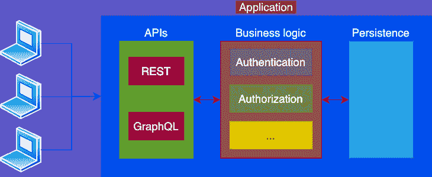
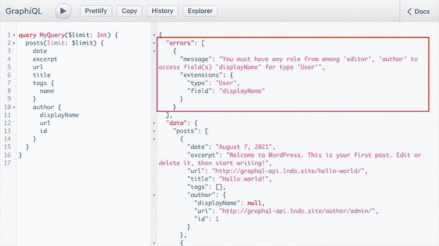
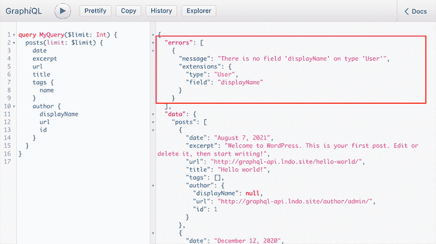
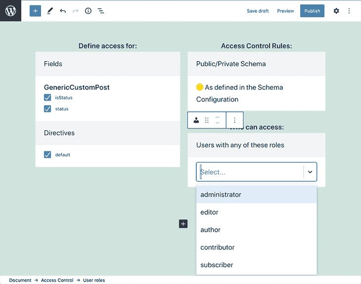
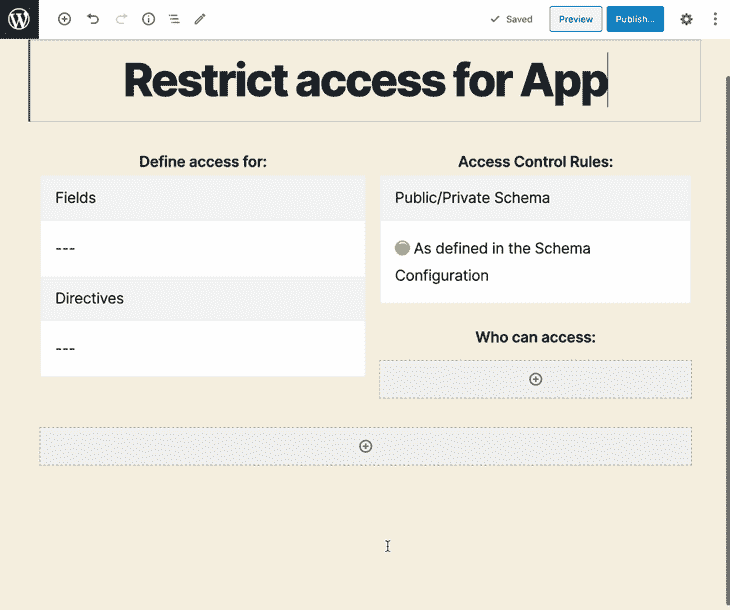
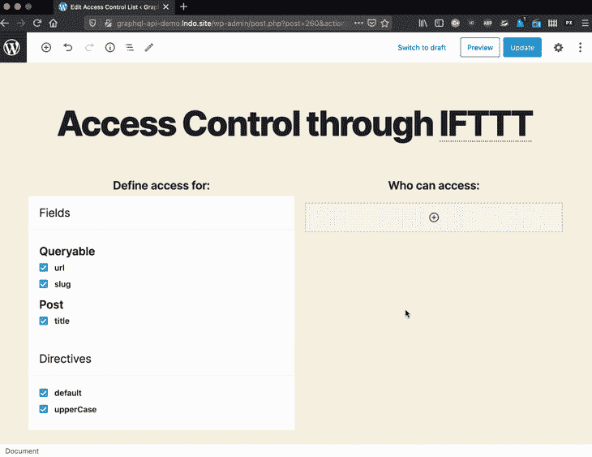

# 在 GraphQL - LogRocket 博客中通过访问控制进行授权

> 原文：<https://blog.logrocket.com/authorization-access-control-graphql/>

授权是授予用户访问 web 应用程序不同部分和功能的过程。授权用户的一种常见方式是通过访问控制，在访问控制中，站点管理员定义必须授予用户和其他实体什么权限才能访问什么资源。

不能将授权与身份验证混淆，身份验证是验证给定用户是否是他们所声称的人的过程，通常通过提供帐户凭据来完成。一旦用户通过身份验证，仍然必须对每个请求执行授权过程，以确保用户能够访问所请求的资源。

在 GraphQL 中实现访问控制的最好方法是什么？在这篇文章中，我们将找到答案。

## 在 GraphQL 中放置访问控制

当通过 GraphQL 访问应用程序时，我们必须验证用户是否有权访问模式中请求的元素。授权逻辑应该在 GraphQL 层中编码吗？

答案是否定的。正如 GraphQL 的文档所表明的，授权逻辑属于业务逻辑层，GraphQL 从那里访问它。通过这种方式，应用程序可以有一个授权的真实来源，然后可以用于其他访问点，例如来自 REST 端点的访问点:



## 访问控制策略

在我们可以在应用程序中实现的几个[访问控制策略](https://cheatsheetseries.owasp.org/cheatsheets/Access_Control_Cheat_Sheet.html#what-is-access-control)中，两个最流行的是基于角色的访问控制(RBAC)和基于属性的访问控制(ABAC)。

使用基于角色的访问控制，我们根据角色授予权限，然后将角色分配给用户。例如，WordPress 有一个可以访问所有资源的`administrator`角色，以及`editor`、`author`、`contributor`和`subscriber`角色，每个角色都有不同程度的权限限制，比如可以创建和发布一篇博客文章，只是创建它，或者只是阅读它。

使用基于属性的访问控制，权限是基于元数据授予的，这些元数据可以分配给不同的实体，包括用户、资产和环境条件(如一天中的时间或访问者的 IP 地址)。例如，在 WordPress 中，功能`edit_others_posts`用于验证用户是否可以编辑其他用户的帖子。

一般来说， [ABAC 比 RBAC](https://cheatsheetseries.owasp.org/cheatsheets/Authorization_Cheat_Sheet.html#prefer-feature-and-attribute-based-access-control-over-rbac) 更好，因为它允许我们用细粒度的控制来配置权限，并且权限的目标是明确的。

再次使用 WordPress 的例子，`editor`角色拥有能力`edit_others_posts`，但是我们可能希望允许一个拥有`author`角色的人编辑另一个作者的文章。然而，如果不授予他们编辑被授予的其他权限，例如删除其他作者的帖子，我们就无法做到这一点。

因此，授予能力`edit_others_posts`并检查这个条件比检查`editor`角色更合适。

## 定义 GraphQL 模式的权限

如前所述，授权逻辑位于业务层，这是 GraphQL 层访问它的地方。因此，在业务层，我们将决定为应用程序实现哪个策略:ABAC、RBAC、它们的组合，或者另一个完全不同的策略。

基于所采用的策略，GraphQL 层将验证用户是否有权从模式中访问所请求的字段，询问以下条件:

*   用户登录了吗？
*   用户是管理员吗？
*   用户是特定的个人吗？
*   用户是否有特定的必需角色？
*   用户是否具备某种必需的能力？
*   用户是否从特定的 IP 范围访问网站？
*   用户是否从某个国家访问网站？
*   用户的帐户中还有剩余的点数吗？

验证也可以放在字段本身，或者受某些环境因素的影响。在这种情况下，可以提出以下附加问题:

*   API 是否在工作时间之外被访问？
*   该字段是否在特定日期后被访问？(启用功能标志)
*   该特性仅适用于开发环境吗？

## 定义可见性

当用户没有必要的权限访问 GraphQL 模式中请求的字段时，应该返回什么错误？

根据模式所需的可见性，有两种可能性:公共的或私有的。

对于公共模式，公开的 GraphQL 模式对所有用户都是相同的，每个字段都描述了访问它需要什么权限。当请求一个不可访问的字段时，错误消息将解释为什么不授予用户访问权限。



Public schema: When access to the field fails, the error message explains the reason

对于私有模式，GraphQL 模式是为每个用户定制的，只有他们可以访问的字段才会被公开。当请求不可访问的字段时，错误消息将指出该字段不存在。



Private schema: The field does not exist in the schema

## 将访问控制逻辑从 GraphQL 中分离出来

避免 GraphQL 层和您目前为应用程序选择的授权策略之间的紧密耦合是一个好主意。这是因为如果将来引入了不同的策略，GraphQL 层可以立即使用它，而不需要在整个代码库中进行广泛的更新。

考虑下面的例子:[使用 Apollo 服务器在解析器](https://www.apollographql.com/blog/backend/auth/authorization-in-graphql/)中进行授权:

```
const resolvers = {
  users: (root, args, context) => {
    if (!context.user || !context.user.roles.includes('admin')) return null;
    return context.models.User.getAll();
  }
}

```

有了这段代码，如果我们将来将访问控制策略切换为使用功能而不是角色，那么我们将需要更新整个代码库中所有相应的字段。

一个更好的策略是[将访问控制放在一个特定的地方](https://the-guild.dev/blog/graphql-modules-auth)，就像这个使用 GraphQL 模块的例子一样:

```
// validate-role.ts
export const validateRole = (role) => (next) => (root, args, context, info) => {
  if (context.currentUser.role !== role) {
    throw new Error(`Unauthorized!`);
  }

  return next(root, args, context, info);
};

// articles-module.ts
import { GraphQLModule } from '@graphql-modules/core';

export const articlesModule = new GraphQLModule({
  typeDefs: gql`
    type Mutation {
      publishArticle(title: String!, content: String!): Article!
    }
  `,
  resolvers: {
    Mutation: {
      publishArticle: (root, { title, content }, { currentUser }) =>
        createNewArticle(title, content, currentUser),
    },
  },
});

// resolvers-composition.ts
import { authenticated } from './authenticated-guard';
import { validateRole } from './validate-role';

export const resolversComposition = {
  'Mutation.publishArticle': [authenticated, validateRole],
};

```

或者，在其进一步的迭代中，通过使用指令在通过 SDL 定义模式时设置限制:

```
type Mutation {
  publishArticle(title: String!, content: String!): Article!
    @auth
    @protect(role: "EDITOR")
}

```

在这些例子中，当策略改变时，您可以在一个地方从`validateRole`更新到`validateCapability`或者从`@protect(role: "EDITOR")`更新到`@protect(capability: "CAN_EDIT")`，并且仍然会影响整个 GraphQL 模式。

## 将访问控制逻辑与 GraphQL 完全分离

如果 GraphQL 服务器遵循[代码优先的方法](https://blog.logrocket.com/code-first-vs-schema-first-development-graphql/)，访问控制规则可以完全从 GraphQL 层解耦，并在运行时通过访问控制列表(ACL)作为配置注入。

这种策略依赖于代码优先的方法，因为 GraphQL 模式是代码的产物，所以它可以在运行时生成和修改。这是将可见性定义为 private 所必需的，在 private 中，根据授予用户的权限公开不同的模式。相比之下，使用 SDL 优先的方法，模式已经确定，在运行应用程序时不能修改。

通过将访问控制视为配置而不是代码，GraphQL 层将立即反映您的访问控制策略的变化，并且您不需要更新任何代码或重新编译模式。

这是 WordPress 的 GraphQL API 使用的方法。它通过以下指令满足访问控制:

*   `@validateIsUserLoggedIn`
*   `@validateIsUserNotLoggedIn`
*   `@validateDoesLoggedInUserHaveAnyRole`
*   `@validateDoesLoggedInUserHaveAnyCapability`

得益于通过指令策略的 [IFTTT，这些指令可以动态地应用于模式。它使您能够指定哪些指令必须应用于哪些字段，以及它们将接收哪些参数。产生的 GraphQL 模式在运行时组装，就在解析查询之前。](https://graphql-by-pop.com/docs/dynamic-schema/ifttt-through-directives.html)

当应用于授权时，通过[访问控制列表](https://graphql-api.com/guides/use/defining-access-control/)来决定将哪些指令注入模式，访问控制列表是通过用户界面创建和编辑的:



Access control via the user interface

站点管理员配置 ACL，选择:

*   要验证的字段
*   要验证的规则，从以下规则中选择:
    *   用户必须登录吗？
    *   用户必须注销吗？
    *   用户必须有特定的角色吗？
    *   用户必须具备某种能力吗？
*   特定于规则的配置:
    *   哪些角色？
    *   哪些能力？
*   能见度:
    *   默认(即分配给模式的那个)？
    *   公共？
    *   私人？



Configuring an access control list

然后，该配置被存储在数据库的条目中。例如，下面的条目定义了字段`Media.author`、`Post.title`和`MutationRoot.addCommentToCustomPost`只能由具有`contributor`角色或者具有`edit_users`、`edit_others_posts`和`read_private_posts`中任何能力的用户访问:

```
 <!-- wp:graphql-api/access-control 
{
 "typeFields": [
 "Media.author",
 "Post.title",
 "MutationRoot.addCommentToCustomPost"
 ] 
} 
--> 

<!-- wp:graphql-api/access-control-user-roles
{
 "accessControlGroup": "roles",
 "value": [
   "contributor"
 ]
}
/--> 

<!-- wp:graphql-api/access-control-user-capabilities
{
 "accessControlGroup": "capabilities",
 "value": [
   "edit_users",
   "edit_others_posts",
   "read_private_posts"
  ]
} 
/-->

<!-- /wp:graphql-api/access-control -->
```

最后， [`AccessControlGraphQLQueryConfigurator`服务](https://github.com/leoloso/PoP/blob/f5a035210d95eee9753b79aaea2f7a718f71bf52/layers/GraphQLAPIForWP/plugins/graphql-api-for-wp/src/Services/SchemaConfigurators/AccessControlGraphQLQueryConfigurator.php)从数据库中读取配置，并在运行时将其应用于 GraphQL 模式。

现在，用户可以创建一个新的访问控制规则，单击 **Update** ，并立即看到应用的更改:



Dynamically loading an access control list into the GraphQL schema

## 结论

当使用 GraphQL 时，除非 API 是完全公开的，否则我们将需要实现身份验证和授权，分别验证用户就是他们所声称的那个人，并确保用户能够访问所请求的资源。

在本文中，我们分析了如何基于不同的访问控制策略对用户进行授权，如何构建应用程序以使用业务层的身份验证功能，以及如何将 GraphQL 层与业务层分离，以便首先最小化，然后完全消除更新访问控制策略的影响。

## 监控生产中失败和缓慢的 GraphQL 请求

虽然 GraphQL 有一些调试请求和响应的特性，但确保 GraphQL 可靠地为您的生产应用程序提供资源是一件比较困难的事情。如果您对确保对后端或第三方服务的网络请求成功感兴趣，

[try LogRocket](https://lp.logrocket.com/blg/graphql-signup)

.

[](https://lp.logrocket.com/blg/graphql-signup)[https://logrocket.com/signup/](https://lp.logrocket.com/blg/graphql-signup)

LogRocket 就像是网络和移动应用的 DVR，记录下你网站上发生的每一件事。您可以汇总并报告有问题的 GraphQL 请求，以快速了解根本原因，而不是猜测问题发生的原因。此外，您可以跟踪 Apollo 客户机状态并检查 GraphQL 查询的键值对。

LogRocket 检测您的应用程序以记录基线性能计时，如页面加载时间、到达第一个字节的时间、慢速网络请求，还记录 Redux、NgRx 和 Vuex 操作/状态。

[Start monitoring for free](https://lp.logrocket.com/blg/graphql-signup)

.