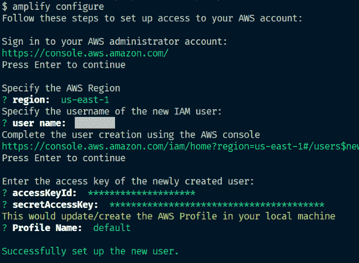
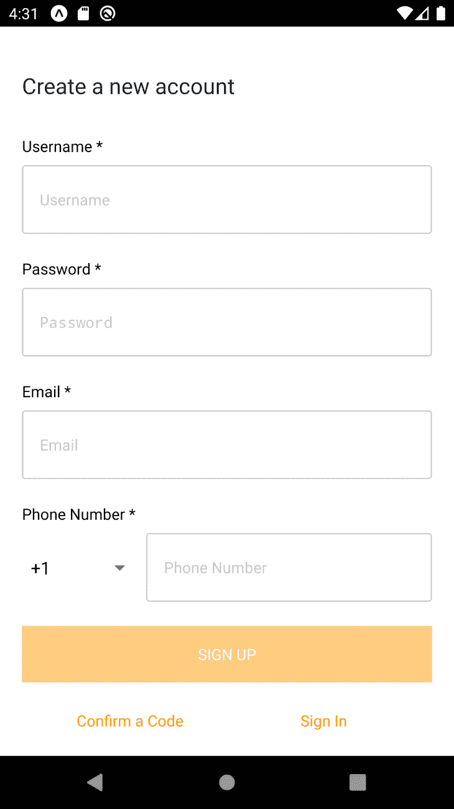
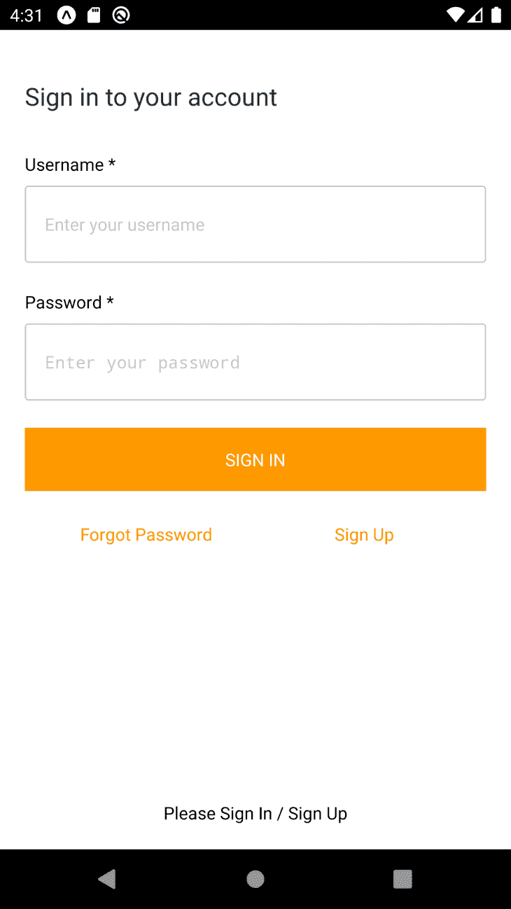
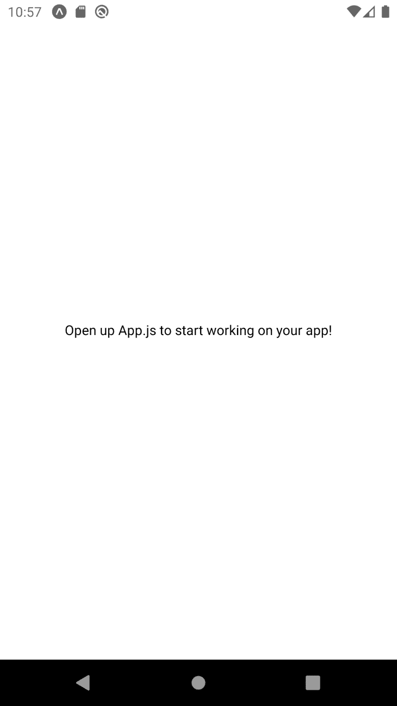

# AWS 放大和本地反应:示例教程

> 原文：<https://blog.logrocket.com/aws-amplify-react-native-tutorial-with-examples/>

***编者按**:这篇文章于 2021 年 12 月 3 日更新，以改进教程，并包括一个比较 AWS Amplify 和 Firebase 作为认证解决方案的新部分。*

身份验证有助于控制用户对应用程序关键部分的访问。因此，它是几乎所有类型软件的关键部分。

在本教程中，我们将向您展示如何使用 React Native 和 AWS Amplify 在移动应用程序中设置身份验证。

我们将详细介绍以下内容:

*   什么是 AWS Amplify？
*   AWS 放大器与 Firebase
*   设置 AWS 放大器
*   设置 React 本机应用程序
*   向 React 本机应用程序添加 AWS Amplify
*   使用 Amazon Cognito 添加身份验证
*   添加注销功能

要学习本教程，您应该具备:

*   节点≥ v10.0.0
*   npm ≥ v5.2.0
*   AWS 帐户
*   JavaScript 和 React 知识
*   反应本土知识
*   Android 和/或 iOS 模拟器

我们开始吧！

## 什么是 AWS Amplify？

AWS Amplify 是亚马逊的一套产品和工具，帮助移动和前端 web 开发人员在亚马逊 Web 服务上构建和部署全栈应用。

AWS Amplify 的显著特征包括:

*   认证—登录、注册、注销、社交认证等。
*   使您能够在线和离线保存数据的数据存储
*   使您能够无缝访问后端数据的 API (GraphQL 和 REST)
*   帮助您管理私有、公共或受保护的用户内容的存储解决方案
*   分析学
*   推送通知，让您向用户发送有针对性的信息

## AWS 放大器与 Firebase

如果你以前用过 Amplify，你可能也听说过 Firebase。Firebase 是谷歌的 AWS Amplify 的对应产品，它也提供云服务。

所以出现的问题是，你应该使用哪种服务？就像生活中的许多时候一样，答案是:视情况而定。一般来说，这两种服务都提供许多类似的功能，如身份验证、实时服务、数据存储等。

如果你是云服务世界的初学者，并且你正在做一个较小的项目，那么 [Firebase](https://blog.logrocket.com/storing-retrieving-data-react-native-apps-firebase/) 可能是一个更好的选择。与 AWS Amplify 相比，React Native 项目没有那么高的学习曲线，因此您可以更容易、更快地开始使用它。此外，使用 Firebase 可以完全免费开发较小的项目。

如果你更有经验或正在从事大型项目，AWS Amplify 可能是开发全栈 React 原生应用程序的更好解决方案——特别是如果你的项目将随着时间的推移而变得更大，AWS Amplify 的定价模型和令人敬畏的可扩展性绝对是巨大的优势。

## 设置 AWS 放大器

为了使用 Amplify，您首先需要[创建一个 AWS 帐户](https://portal.aws.amazon.com/billing/signup?redirect_url=https%3A%2F%2Faws.amazon.com%2Fregistration-confirmation#/start)并安装 Amplify CLI。打开一个终端，粘贴下面的代码来安装 Amplify CLI。

请注意，以下设置不是特定于项目的设置。这就是我们在我们的机器上安装 Amplify CLI 的原因。

```
npm install -g @aws-amplify/cli 

```

成功安装 Amplify CLI 后，运行以下代码来配置 CLI。

```
amplify configure

```

此交互式 CLI 命令在成功完成之前需要您分两步输入。这些步骤是:

*   验证您的 AWS 帐户
*   添加身份和访问管理(IAM)用户

创建用户时，一定要创建使用 AWS 服务的用户，如 Amplify、Cognito 和 Cloudfront。这对于以下情况是必要的:

*   指定 AWS 区域
*   添加创建的用户的`accessKeyId`和`secretAccessKey`
*   添加 AWS 配置文件

下面的屏幕截图显示了上述步骤的摘要:



## 设置 React 本机应用程序

我们使用 [Expo](https://expo.io/) 来引导我们的 React 本地应用。Expo 是一个框架，可以帮助您开发、构建和部署在所有用户设备上本地运行的项目。

要开始使用 Expo，请启动一个终端并粘贴以下代码:

```
npm install --g expo-cli

```

上面的命令安装 Expo CLI。安装后，我们可以用 Expo CLI 初始化一个 React 本地项目。粘贴并运行下面的代码:

```
expo init aws-amplify-authentication-tutorial

```

当提示选择模板时，选择一个空白模板:


成功安装后，名为`aws-amplify-authentication-tutorial`的 React 本地项目出现在执行命令的目录中。要切换到新创建的目录，请使用以下命令:

```
cd aws-amplify-authentication-tutorial

```

## 向 React 本机应用程序添加 AWS Amplify

现在我们已经有了一个 React 本地应用程序和 Amplify 框架，我们需要将 Amplify 连接到 React 本地应用程序。

导航到 React 本机应用程序目录并运行以下命令:

```
amplify init

```


系统将提示您指定以下内容:

*   项目名称
*   环境的名称——我建议坚持使用默认的`dev`,因为我们处于开发环境中(要选择默认选项，请按 enter 键)
*   您选择的默认编辑器
*   您正在构建的应用程序的类型(JavaScript)
*   你正在使用的 JavaScript 框架(React Native)
*   源目录路径(按 enter 键选择默认根目录)
*   分发目录路径(按 enter 键选择默认根目录)
*   构建命令(按 enter 键选择默认命令)
*   开始命令(按 enter 键选择默认命令)
*   是否要使用 AWS 配置文件(输入`Yes`并按回车键)
*   如果是，您想使用哪个配置文件

完成此表格后:

*   在应用程序根目录下创建一个名为`amplify`的文件夹，用于存储应用程序的后端配置，比如身份验证
*   在我们初始化 Amplify 时指定的源目录路径中创建了一个名为`aws-exports.js`的文件。该文件包含您使用 Amplify 创建的服务的信息
*   对`.gitignore`文件进行了修改，以包含由 Amplify 生成的、不应该添加到 Git 存储库中的文件和文件夹
*   AWS Amplify 控制台中会生成一个云项目。您可以通过运行`amplify console`随时访问它

接下来，我们必须[安装一些本地放大器依赖关系](https://docs.amplify.aws/start/getting-started/setup/q/integration/react-native/#initialize-a-new-backend)。将以下内容粘贴到您的终端中:

```
npm install aws-amplify aws-amplify-react-native @react-native-community/netinfo @react-native-async-storage/async-storage @react-native-picker/picker

```

在代码编辑器中打开`App.js`文件，并在最后一条 import 语句后添加以下代码行:

```
import Amplify from 'aws-amplify';
import config from "./src/aws-exports";
Amplify.configure({
  ...config,
  Analytics: {
    disabled: true,
  },
});

```

在这个设置中，我们在第 6 行中明确禁用了分析服务。如果您想要默认设置，只需使用`Amplify.configure(config)`代替第 3-8 行中的代码。出于本教程的目的，您可以使用任何一种方法。

我们已经成功地将 Amplify 添加到 React 本地项目中。运行`expo start`在您选择的仿真器中启动项目。

## 添加 Amplify auth 以反应本地

Amazon Amplify 使用 Amazon Cognito 来支持身份验证过程。Amazon Cognito 是一项简化添加身份验证(注册、登录、注销、OAuth、多因素身份验证等)过程的服务。).

首先，在项目根目录中打开一个终端并运行:

```
amplify add auth

```

在输入命令后出现的交互式提示符上:

*   选择默认配置
*   还可以选择您希望用户登录应用程序的方式


After initializing the authentication service, run the command below to deploy it:

```
amplify push

```

此时，我们可以在应用程序中集成身份验证服务。Amplify 框架提供了易于集成的内置、可定制的 UI 组件，这有助于简化流程。

转到您的`App.js`，在导入语句下添加以下一行:

```
import { withAuthenticator } from 'aws-amplify-react-native';

```

`withAuthenticator`是一个高阶组件，自动检测应用的认证状态，更新 UI。

将`App.js`结束时的默认导出更改为以下内容:

```
export default withAuthenticator(App)

```

您的`App.js`应该看起来像这样:

```
import { StatusBar } from 'expo-status-bar';
import React from 'react';
import { StyleSheet, Text, View } from 'react-native';
import Amplify from 'aws-amplify';
import config from "./src/aws-exports";
import { withAuthenticator } from 'aws-amplify-react-native';
Amplify.configure({
  ...config,
  Analytics: {
    disabled: true,
  },
});
function App() {
  return (
    <View style={styles.container}>
      <Text>Open up App.js to start working on your app!</Text>
      <StatusBar style="auto" />
    </View>
  );
}
const styles = StyleSheet.create({
  container: {
    flex: 1,
    backgroundColor: '#fff',
    alignItems: 'center',
    justifyContent: 'center',
  },
});
export default withAuthenticator(App);

```

在模拟器中保存并运行应用程序:

```
expo start

```

您应该会看到类似这样的内容:






## 添加注销功能

认证成功后，用户将进入应用程序屏幕，无法注销。



要添加注销按钮，请在根目录下创建一个`Home.js`文件，并粘贴以下内容:

```
import React from 'react';
import { StyleSheet, Text, View, Pressable, Dimensions } from 'react-native';
import { Auth } from 'aws-amplify';
const { width } = Dimensions.get('window');
const Home = () => {
  const signOut = async () => {
    try {
      await Auth.signOut({ global: true });
    } catch (error) {
      console.log('error signing out: ', error);
    }
  };
  return (
    <View style={styles.container}>
      <View style={styles.header}>
        <Text style={styles.headerText}>Welcome!</Text>
        <Pressable style={styles.button} onPress={() => signOut()}>
          <Text style={styles.buttonText}>Sign out</Text>
        </Pressable>
      </View>
    </View>
  );
};
const styles = StyleSheet.create({
  container: {
    backgroundColor: '#fff',
    alignItems: 'center',
    justifyContent: 'center',
    width: width,
    paddingVertical: 20,
  },
  header: {
    display: 'flex',
    flexDirection: 'row',
    justifyContent: 'space-between',
    padding: 20,
    width: width,
    alignItems: 'center',
  },
  headerText: {
    fontSize: 28,
    fontWeight: 'bold',
  },
  button: {
    backgroundColor: '#ff9900',
    padding: 10,
    borderRadius: 6,
  },
  buttonText: {
    color: '#fff',
    fontSize: 18,
  },
});
export default Home;

```

这创建了一个`Home`组件，它呈现一条欢迎消息和一个退出按钮。当用户点击退出按钮时，它调用`Auth.signOut()`方法，这是`aws-amplify`的 [Auth](https://aws-amplify.github.io/amplify-js/api/classes/authclass.html) 类提供的许多方法之一。此方法将用户注销。

打开您的`App.js`文件并重构它以包含`Home`组件:

```
import { StatusBar } from 'expo-status-bar';
import React from 'react';
import { StyleSheet, View } from 'react-native';
import Amplify from 'aws-amplify';
import config from "./src/aws-exports";
import { withAuthenticator } from 'aws-amplify-react-native';
import Home from './Home';
Amplify.configure({
  ...config,
  Analytics: {
    disabled: true,
  },
});
function App() {
  return (
    <View style={styles.container}>
      <Home />
      <StatusBar style="auto" />
    </View>
  );
}
const styles = StyleSheet.create({
  container: {
    backgroundColor: '#fff',
    alignItems: 'center',
    justifyContent: 'center',
  },
});
export default withAuthenticator(App);

```

保存后，您的屏幕应该是这样的:


您现在可以退出应用程序了。

## 结论

在本教程中，我们介绍了如何使用 AWS Amplify 框架在 React 本地应用程序中对用户进行身份验证。 [Amplify 框架](https://docs.amplify.aws/)提供了更多我们没有机会介绍的特性。

在本教程中构建的这个应用程序的存储库可以在 [GitHub](https://github.com/sa-ma/amplify-authentication-tutorial) 上获得。如果你有任何问题，欢迎在评论中提出。

## [LogRocket](https://lp.logrocket.com/blg/react-native-signup) :即时重现 React 原生应用中的问题。

[](https://lp.logrocket.com/blg/react-native-signup)

[LogRocket](https://lp.logrocket.com/blg/react-native-signup) 是一款 React 原生监控解决方案，可帮助您即时重现问题、确定 bug 的优先级并了解 React 原生应用的性能。

LogRocket 还可以向你展示用户是如何与你的应用程序互动的，从而帮助你提高转化率和产品使用率。LogRocket 的产品分析功能揭示了用户不完成特定流程或不采用新功能的原因。

开始主动监控您的 React 原生应用— [免费试用 LogRocket】。](https://lp.logrocket.com/blg/react-native-signup)