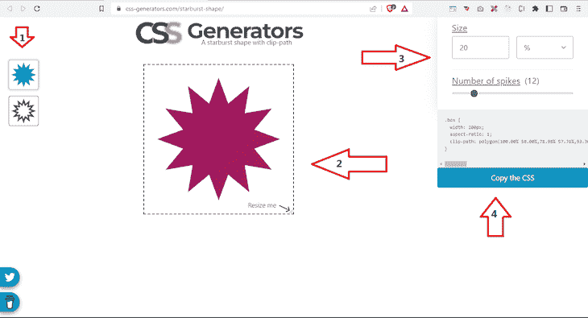
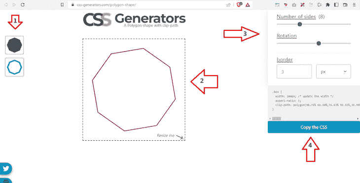
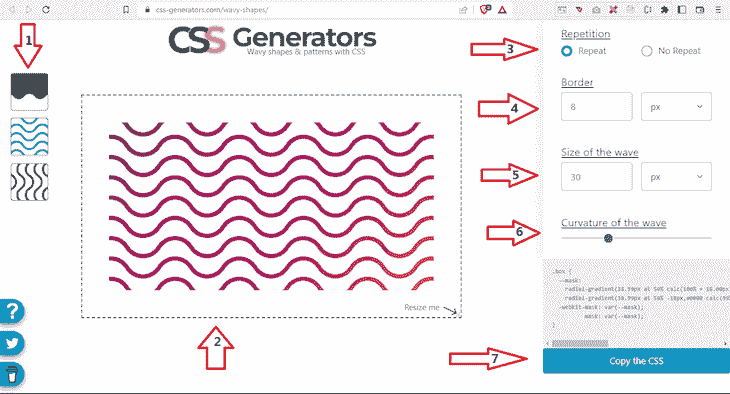
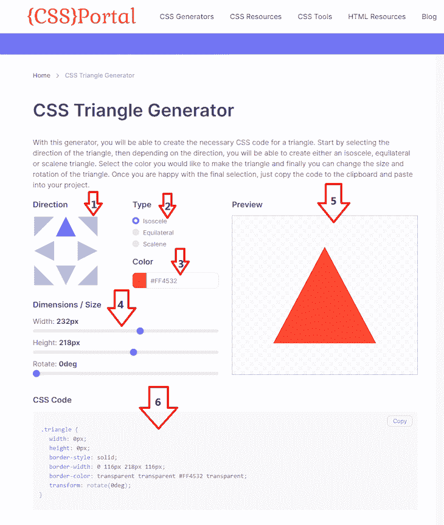
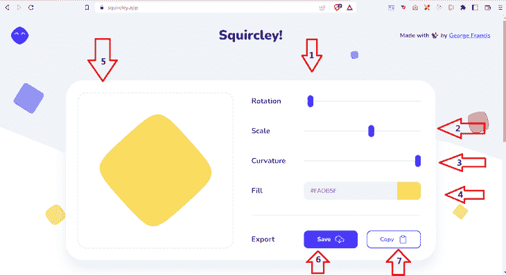
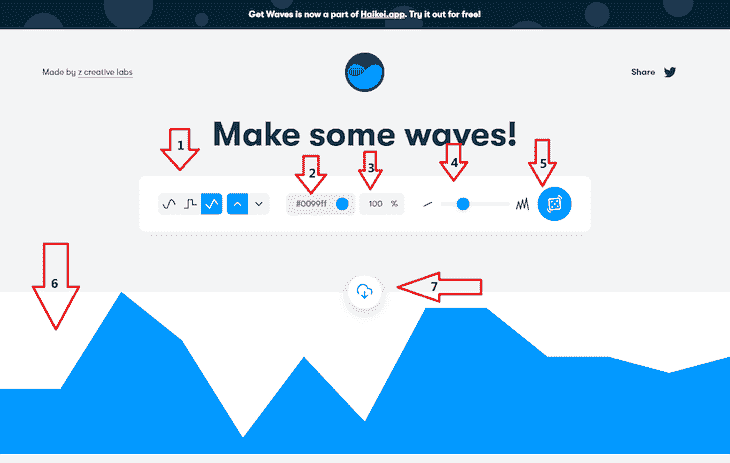
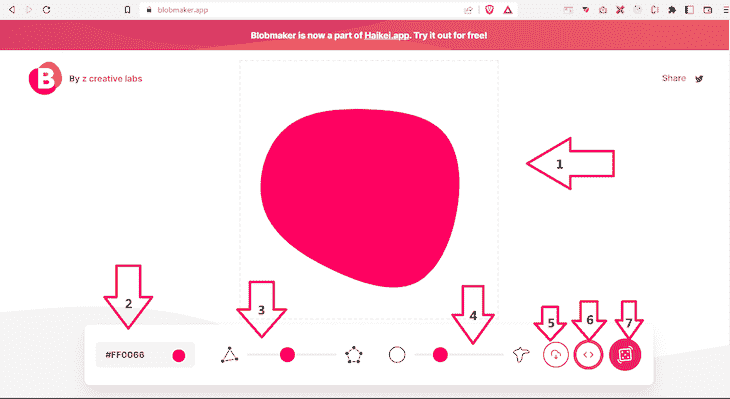
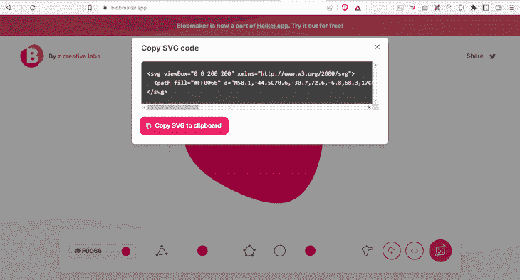
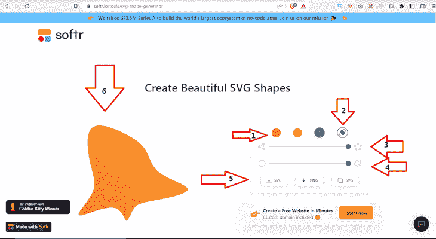
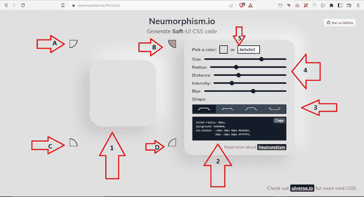

# 最佳 CSS 形状生成器及演示

> 原文：<https://blog.logrocket.com/best-css-shape-generators-demo/>

CSS 是一个令人难以置信的[强大的造型工具](https://blog.logrocket.com/new-css-style-queries/)，它允许我们创建复杂的形状[和更多的](https://blog.logrocket.com/tag/css/)。然而，从头开始做这件事要花很多时间，因此需要工具来加速这个过程。

在这篇文章中，我们将了解七个最好的 CSS 形状生成器，以及这些工具如何让我们生成任何我们选择的 CSS 形状。

*向前跳转:*

## CSS 生成器

CSS 生成器是一个很棒的网站，你可以用它直接在浏览器中生成不同的形状和图案。使用 CSS 生成器，你可以制作七种不同的形状和图案:星形、多边形、波浪形、自定义边框、分隔线、[自定义角](https://blog.logrocket.com/how-to-create-fancy-corners-in-css/)和 [CSS 图案](https://blog.logrocket.com/complex-patterns-using-css-gradients/)。

然而，在这篇文章中，我们将看看如何生成星爆，多边形和波浪形状。

### 星爆形状

星爆形状是一种放射出射线的形状或设计，类似于恒星爆炸产生的闪光。虽然星爆形状看起来很有趣，但当你试图从头开始生成它们时，可能会很耗时。然而，使用 CSS Generators 的星爆形状生成器，我们可以很容易地生成任何具有我们喜欢的边数和特征的星爆。

要开始创建星爆形状，请点击这个[链接](https://css-generators.com/starburst-shape/)。在那里，您将看到一个类似如下的页面:



点击箭头一指向的任何一个**选项**可以选择一个带有填充或轮廓的星星。箭头指向的区域是您看到更改的画布。箭头三指向包含可用于确定星形宽度的部分的区域。

它还包含当您选择带有轮廓的星形时用于修改边框的菜单，并有一个滑块来指定星形的边数。最后，箭头 4 指向生成的 CSS，您可以复制并在项目中使用它。

上图中的形状是一个十二边形。下面是为它生成的 CSS:

```
.box {
width: 200px;
aspect-ratio: 1;
clip-path: polygon(100.00% 50.00%,78.98% 57.76%,93.30% 75.00%,71.21% 71.21%,75.00% 93.30%,57.76% 78.98%,50.00% 100.00%,42.24% 78.98%,25.00% 93.30%,28.79% 71.21%,6.70% 75.00%,21.02% 57.76%,0.00% 50.00%,21.02% 42.24%,6.70% 25.00%,28.79% 28.79%,25.00% 6.70%,42.24% 21.02%,50.00% 0.00%,57.76% 21.02%,75.00% 6.70%,71.21% 28.79%,93.30% 25.00%,78.98% 42.24%);
}

```

> 注意:要使用生成的 CSS，您应该创建一个 HTML 标记，并从 CSS 生成器中给它一个类名。您的元素可能如下所示:

```
<div class="box"></div>

```

### 多边形形状

使用 CSS 从头开始创建多边形需要一定的耐心。然而，多边形形状生成器是一个很大的帮助，因为它可以用来创建我们选择的任何多边形。要开始创建多边形形状，请导航到 [CSS 生成器网站](https://css-generators.com/polygon-shape/):



让我更详细地解释一下这里发生了什么。使用 CSS 生成器生成多边形的步骤类似于生成星爆形状。但是，箭头三包含一个额外的滑块，可用于旋转形状。

上图中的形状是一个八角形，下面是为它生成的 CSS:

```
.box {
width: 200px;
aspect-ratio: 1;
clip-path: polygon(98.75% 61.10%,76.63% 92.32%,38.90% 98.75%,7.68% 76.63%,1.25% 38.90%,23.37% 7.68%,61.10% 1.25%,92.32% 23.37%,98.75% 61.10%,calc(92.32% - 2.54px) calc(23.37% - -1.60px),calc(61.10% - 0.67px) calc(1.25% - -2.93px),calc(23.37% - -1.60px) calc(7.68% - -2.54px),calc(1.25% - -2.93px) calc(38.90% - -0.67px),calc(7.68% - -2.54px) calc(76.63% - 1.60px),calc(38.90% - -0.67px) calc(98.75% - 2.93px),calc(76.63% - 1.60px) calc(92.32% - 2.54px),calc(98.75% - 2.93px) calc(61.10% - 0.67px),calc(92.32% - 2.54px) calc(23.37% - -1.60px));
}

```

> 注意:就像 starburst 步骤一样，您应该从 CSS 生成器创建一个 HTML 标记和一个类名:

```
<div class="box"></div>

```

### 波浪形状

用 CSS 创建一个波浪形状似乎是一项艰巨的任务。然而，使用 CSS 生成器使得这项工作更易于管理。你可以在这里开始创造波浪形[。您将会看到类似如下的页面:](https://css-generators.com/wavy-shapes/)



这是怎么回事？让我们深入研究一下。箭头一指向用于在填充、垂直流动或水平流动波浪之间进行选择的菜单。在上图中，选择了水平流动的波浪。

箭头二指向可调整大小的画布，在这里可以看到对波形的更改。第三个箭头指向菜单，在这里你可以选择多(重复)或单(不重复)波。在上图中，我们选择了多重(重复)。

箭头四表示用于指定边框宽度的菜单。您可以从下拉列表中选择单位类型，包括像素、百分比等。在上图中，我们选择了八个像素。

菜单上的箭头五个点用来指定我们设置的波的大小，我们将大小设置为`30px`。接下来，箭头六指向用于指定波形曲率的菜单，箭头七用于复制生成的 CSS 代码。

生成的 CSS 如下所示:

```
.box {
--mask:
radial-gradient(38.99px at 50% calc(100% + 18.00px),#0000 calc(99% - 8px),#000 calc(101% - 8px) 99%,#0000 101%) calc(50% - 60px) calc(50% - 19px + .5px)/120px 38px ,
radial-gradient(38.99px at 50% -18px,#0000 calc(99% - 8px),#000 calc(101% - 8px) 99%,#0000 101%) 50% calc(50% + 19px)/120px 38px ;
-webkit-mask: var(--mask);
mask: var(--mask);
}

```

> 注意:为了使用生成的 CSS，您应该从 CSS 生成器创建一个 HTML 标记和一个类名。您的元素可能如下所示:

```
<div class="box"></div>

```

## CSS 门户

CSS 门户是另一个很酷的网站，有大量的自定义样式和形状生成器。使用 CSS 门户工具，您可以轻松地生成视觉上吸引人的形状和图案，如三角形、边框半径、按钮、剪辑路径、翻转开关、立方贝塞尔曲线、[滚动条](https://blog.logrocket.com/hide-scrollbar-without-impacting-scrolling-css/)等等。此外，生成的形状可以很容易地修改和调整。本文将研究三角形生成器来生成一个形状。

### 三角形

用 CSS 门户创建三角形的第一步是访问这个[链接](https://www.cssportal.com/css-triangle-generator/)。您将看到一个类似如下的界面:



第一个箭头指向选择三角形方向的菜单。有八个方向:上、下、左、右、右上、左上、右下和左下。在我们的例子中，我们选择 **top** 作为三角形的方向。

继续，第二个箭头指向选择三角形类型的菜单。只有三个选项可用:等腰、等边和不等边。接下来，第三个箭头指向选择三角形背景颜色的菜单。它接受每种格式的[书写颜色](https://blog.logrocket.com/advanced-guide-setting-colors-css/)，包括 RGBA、RGB、十六进制、颜色名称，以及从色轮中选择。我们在上图中选择了`#FF4532`。

我们的第四个箭头指向选择三角形尺寸和大小的菜单。在这里，您可以选择`width`、`height`和`degree of rotation`。我们选择了`232px`的宽度、`218px`的高度和`0deg`的旋转。

本质上，无论你在箭头一到四的菜单上做什么改变，都会反映在画布上，第五个箭头指向的地方。

此外，与 CSS 生成器一样，您可以复制生成的 CSS 代码。您可以通过使用第六个箭头所指的部分来实现。

为上图中的三角形生成的 CSS 代码是:

```
.triangle {
   width: 0px;
   height: 0px;
   border-style: solid;
   border-width: 0 116px 218px 116px;
   border-color: transparent transparent #FF4532 transparent;
   transform: rotate(0deg);
}

```

> 注意:为了使用生成的 CSS，您应该从 CSS 门户创建一个 HTML 标记和类名。您的元素应该如下所示:

```
<div class="triangle"></div>

```

## Squircley 应用

Squircley 应用程序是一个生成正方形、四边形和圆形的伟大工具。它还提供了创建的形状和生成的 SVG 代码的可下载版本。导航到 Squircley 后，我们看到的页面将类似于下图:



Squircley 提供了一个简单的界面，着重于创建三种形状。上图包含指向不同部分的箭头，这些箭头可用于更改创建的形状。

箭头一、二和三指向用于旋转、缩放和对生成的形状应用曲率的滑块。同时，第四个箭头用于指定形状的填充(或背景色)。在第五个箭头所指的画布上，可以看到对形状的更改。

有趣的是，点击第六个箭头指向的**按钮**,我们可以下载生成的形状作为图像，可以在任何地方使用。类似地，第七个箭头指向可用于复制生成的形状 SVG 代码的按钮。要使用生成的形状，我们可以将它嵌入到网页中，如下所示:

```
// html (svg)
  <svg viewbox="0 0 200 200" >
    <path
      d="M 0, 62.5
         C 0, 13.749999999999998 13.749999999999998, 0 62.5, 0
         S 125, 13.749999999999998 125, 62.5
         111.25, 125 62.5, 125
         0, 111.25 0, 62.5"
      fill="#FADB5F"
      transform="rotate(-45,100, 100) translate(37.5,37.5)"
    ></path>
  </svg>

```

## 获得波浪

Get Waves 是一个非常棒的网站，你可以用它来为你的下一个项目生成不同类型的波形。此外，它有一个功能，允许它随机生成波形。在导航到[这里](https://getwaves.io/)后，您将看到一个类似下图的页面:




要开始为您的项目创建波形的旅程，您可以从上面第一个图像中的第一个箭头菜单开始。第一个箭头菜单包含您可以生成的波形类型的选项。有三个选项可供选择。第一个箭头旁边的下一个菜单提供了选择要创建的形状类型的选项。选项有`fill`和`outline`。

下一步是设置颜色和颜色的不透明度。为此，您可以使用第二个和第三个箭头菜单。前者允许我们使用我们选择的格式输入我们选择的颜色，而不透明度的范围可以从`0 to 100`百分比。

接下来，我们 can‌使用第四个箭头菜单来改变波形的失真，从直线到非常尖的形状。这个工具最可爱的部分是你可以使用第五个箭头所指的按钮生成一个完全随机的波形。

第六个箭头指向生成的形状，而第七个箭头指向弹出模式的按钮。第二个图像中显示了弹出模式的示例。

最后，第八个和第九个箭头指向按钮，这些按钮可用于将形状下载为图像或复制为 SVG。

要使用生成的形状，我们可以将它嵌入到网页中，如下所示:

```
<svg  viewBox="0 0 1440 320"><path fill="#0099ff" fill-opacity="1" d="M0,288L48,272C96,256,192,224,288,197.3C384,171,480,149,576,165.3C672,181,768,235,864,250.7C960,267,1056,245,1152,250.7C1248,256,1344,288,1392,304L1440,320L1440,320L1392,320C1344,320,1248,320,1152,320C1056,320,960,320,864,320C768,320,672,320,576,320C480,320,384,320,288,320C192,320,96,320,48,320L0,320Z"></path></svg>

```

## 博客作者

blob 实际上是一个二进制大对象。然而，在我们的例子中，我们将把一个斑点定义为一小滴或一团粘稠的东西。Blobs 用于为登陆页面、[标题、](https://blog.logrocket.com/five-cool-css-header-styles-with-cross-browser-compatibility/)、英雄页面等创建视觉上吸引人的[背景图像](https://blog.logrocket.com/understanding-background-size-css/)。在编程中，我们知道我们不应该重新发明轮子。因此，我们可以使用 Blobmaker 形状生成器，而不是花费大量时间使用 CSS 从头开始生成 blobs。

Blobmaker 提供了一个很好的界面，可以将三角形生成五边形，将圆形生成扭曲的形状。它提供了六种不同的菜单，我们可以使用它们来生成形状。下图中的菜单都用箭头标出:





首先，第一个箭头指向我们创建的形状的最终结果。然后，第二个箭头指向用于选择颜色的菜单，而第三个箭头用于在三角形、四边形、不规则四边形和五边形之间转换。用于将圆生成为扭曲形状的滑块由第四个箭头指向的菜单控制。

第五个和第六个箭头处的菜单分别用于将形状作为图像下载，并使用生成的样式打开模态。最后，第七个箭头处的按钮用于自动生成随机形状。

为上图中的形状生成的形状如下:

```
<!--?xml version="1.0" standalone="no"?-->
<svg
  id="sw-js-blob-svg"
  viewBox="0 0 100 100"

>
  <defs>
    <linearGradient id="sw-gradient" x1="0" x2="1" y1="1" y2="0">
      <stop id="stop1" stop-color="rgba(248, 117, 55, 1)" offset="0%"></stop>
      <stop id="stop2" stop-color="rgba(251, 168, 31, 1)" offset="100%"></stop>
    </linearGradient>
  </defs>
  <path
    fill="url(#sw-gradient)"
    d="M11.6,-22.8C14.1,-18.7,14.5,-13.6,20,-9.7C25.5,-5.7,36.2,-2.9,35.7,-0.3C35.2,2.3,23.6,4.6,16.6,5.9C9.5,7.2,7,7.6,5,10.3C3,13,1.5,18.2,0.4,17.5C-0.8,16.9,-1.6,10.5,-7.5,10C-13.5,9.6,-24.5,15.1,-26.6,14.4C-28.6,13.7,-21.5,6.9,-19,1.5C-16.5,-3.9,-18.5,-7.9,-20.1,-14.9C-21.7,-21.9,-23,-31.9,-19.5,-35.4C-16.1,-39,-8.1,-36,-1.7,-33C4.6,-30,9.2,-26.9,11.6,-22.8Z"
    width="100%"
    height="100%"
    transform="translate(50 50)"
    stroke-width="0"
    style="transition: all 0.3s ease 0s"
  ></path>
</svg>

```

## 软形状生成器

我们列表中的另一个令人惊奇的工具是 [softr SVG 形状生成器](https://www.softr.io/tools/svg-shape-generator)。它可用于生成与滴管制作机相似的形状:



类似于上面提到的一些工具，我们可以使用第一个箭头处的菜单来选择形状的颜色。我们可以使用第二个箭头指示的菜单来切换随机形状。但是，第三个和第四个箭头菜单用于在三角形、四边形和五边形之间转换，以及将圆形转换为扭曲的形状。

第五个箭头处的菜单提供了获取形状的三个选项，其中包括:将其下载为 PNG、SVG 或复制形状的代码。

最后，在第六个箭头处，生成的形状在画布上变得可见。同时，从软形状生成器生成的形状的代码示例如下:

```
<!--?xml version="1.0" standalone="no"?-->
<svg
  id="sw-js-blob-svg"
  viewBox="0 0 100 100"

>
  <defs>
    <linearGradient id="sw-gradient" x1="0" x2="1" y1="1" y2="0">
      <stop id="stop1" stop-color="rgba(248, 117, 55, 1)" offset="0%"></stop>
      <stop id="stop2" stop-color="rgba(251, 168, 31, 1)" offset="100%"></stop>
    </linearGradient>
  </defs>
  <path
    fill="url(#sw-gradient)"
    d="M19.3,-22C25.2,-18.1,30.3,-12.1,34,-4.1C37.8,4,40.2,14.3,36.3,20.8C32.4,27.3,22.2,30,13.3,30.8C4.4,31.6,-3.1,30.5,-11.3,28.6C-19.5,26.7,-28.3,24,-33.9,17.8C-39.6,11.6,-42.1,1.9,-40,-6.5C-37.9,-14.9,-31,-21.9,-23.6,-25.6C-16.2,-29.2,-8.1,-29.6,-0.7,-28.8C6.7,-27.9,13.4,-25.9,19.3,-22Z"
    width="100%"
    height="100%"
    transform="translate(50 50)"
    stroke-width="0"
    style="transition: all 0.3s ease 0s"
  ></path>
</svg>

```

## 神经形态发生器

神经形态是图形用户界面中使用的一种设计风格。它将光线和阴影结合在一起，形成令人惊叹的形状。你可以在我们的指南[这里](https://blog.logrocket.com/understanding-neumorphism-css/)中了解更多关于在 CSS 中使用神经形态的知识。

我们将使用 [Neumorphism.io](Neumorphism.io) 来生成我们的形状。在这里，我们会遇到一个类似下图的界面:



箭头 A、B、C 和 D 处的菜单用于指定阴影来自的方向。上图中箭头 B 处的选项被选中。用于查看形状变化的画布显示在第一个箭头中，而第二个箭头处的菜单可用于指定形状将被使用的背景颜色。

第三个箭头处的菜单可用于指定大小、半径、距离、强度和模糊度。第四个菜单箭头可以用来指定你想要的神经形态的种类。

最后，您可以复制生成的 CSS 样式。它应该看起来像这样:

```
{
border-radius: 50px;
background: #a6a6a6;
box-shadow: -20px 20px 60px #8d8d8d, 20px -20px 60px #bfbfbf;
}

```

## 结论

我们已经看到了七种可以用来生成 CSS 样式的神奇工具。这些工具增强了我们使用 CSS 的方式，并使我们能够为我们的项目交付很酷的形状。

感谢您通读。我希望你喜欢这篇文章，如果你有任何问题，一定要留下评论。编码快乐！

## 你的前端是否占用了用户的 CPU？

随着 web 前端变得越来越复杂，资源贪婪的特性对浏览器的要求越来越高。如果您对监控和跟踪生产环境中所有用户的客户端 CPU 使用、内存使用等感兴趣，

[try LogRocket](https://lp.logrocket.com/blg/css-signup)

.

[](https://lp.logrocket.com/blg/css-signup)[https://logrocket.com/signup/](https://lp.logrocket.com/blg/css-signup)

LogRocket 就像是网络和移动应用的 DVR，记录你的网络应用或网站上发生的一切。您可以汇总和报告关键的前端性能指标，重放用户会话和应用程序状态，记录网络请求，并自动显示所有错误，而不是猜测问题发生的原因。

现代化您调试 web 和移动应用的方式— [开始免费监控](https://lp.logrocket.com/blg/css-signup)。