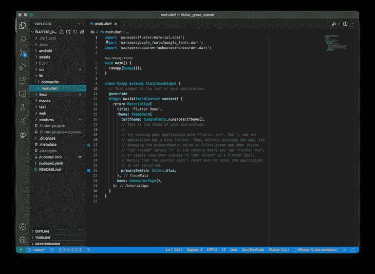
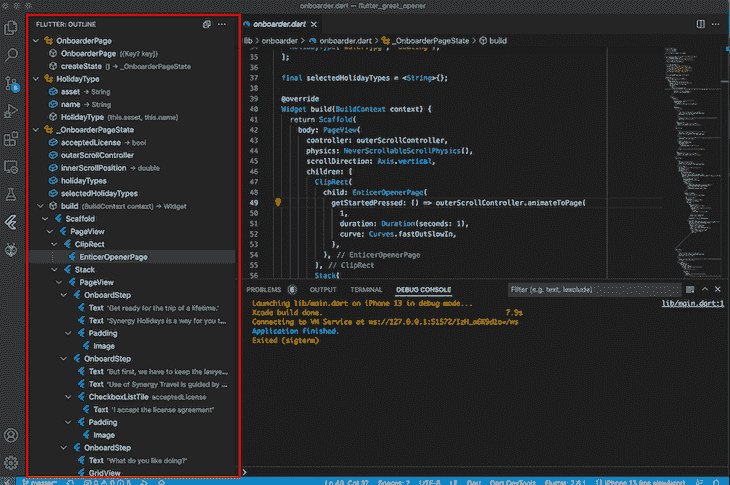
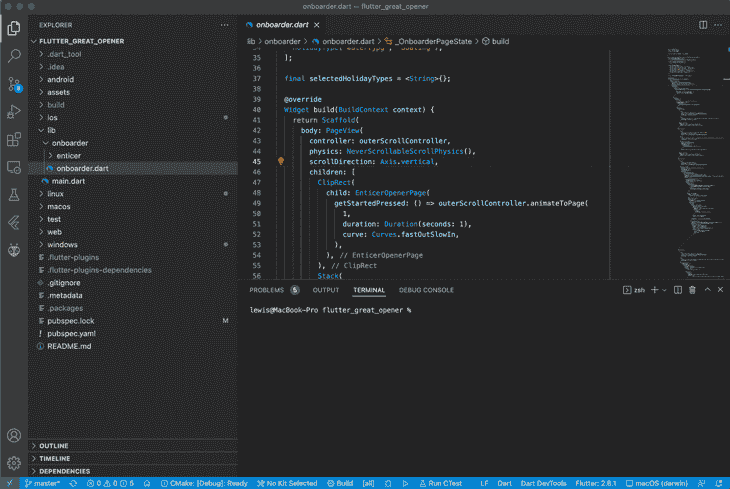
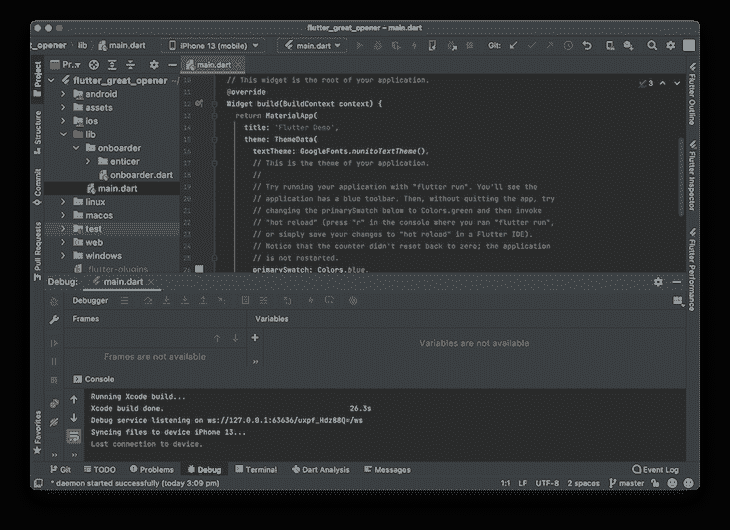
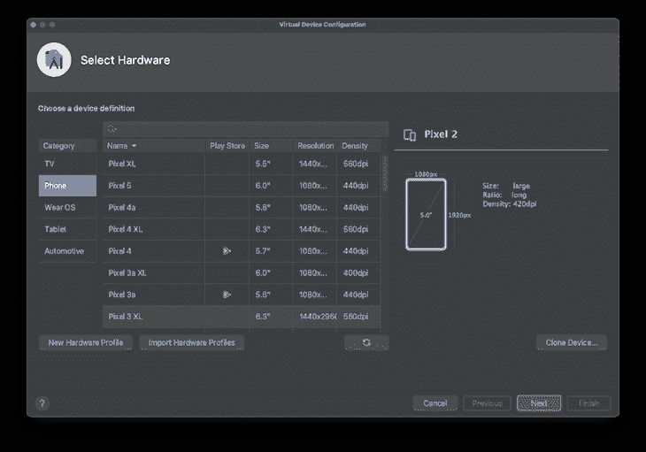
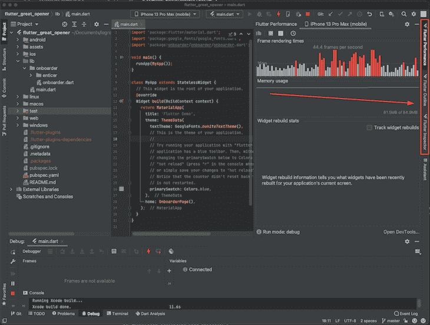
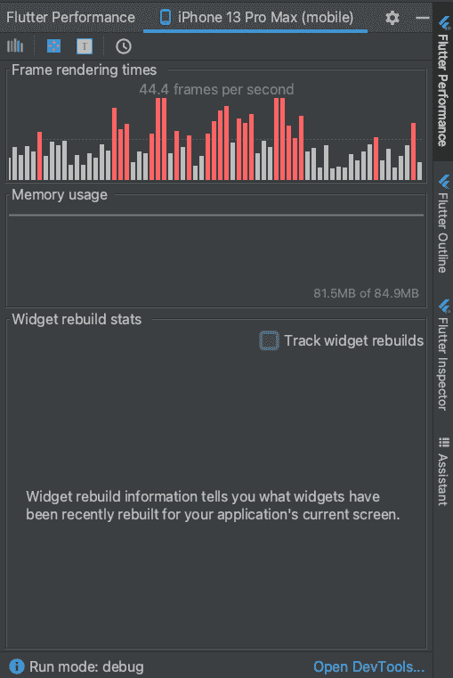
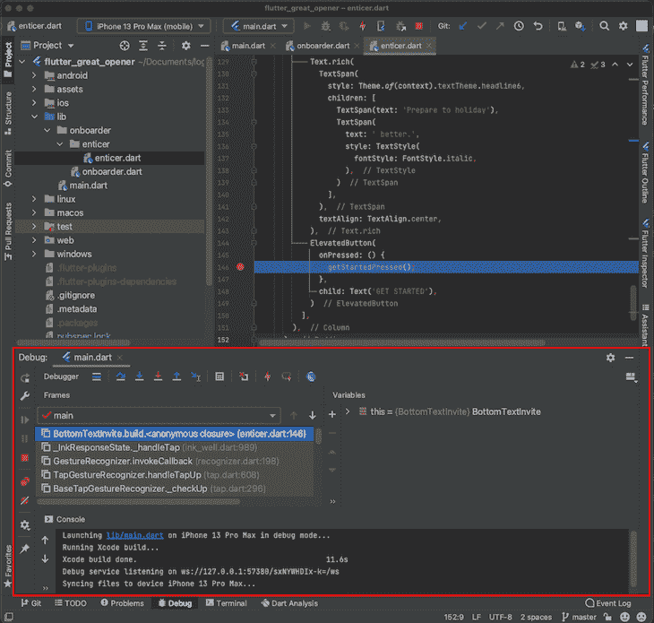
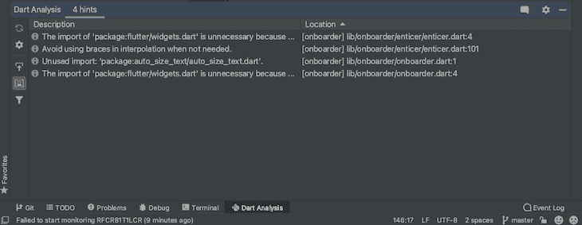

# 2022 年最佳颤振 IDEs-log rocket 博客

> 原文：<https://blog.logrocket.com/best-ides-flutter-2022/>

自 2019 年首次稳定发布以来，Flutter 取得了广泛的成功。但是，无论您是刚开始使用 Flutter，还是已经使用了一段时间，决定为您的项目使用哪种 IDE 都会对您的项目产生巨大的影响。

如果你在一个团队中工作，你们都需要达成共识，这可能会非常困难。

如今，当谈到我们可以使用什么 IDE 时，我们被宠坏了。在这个领域有很多高质量的竞争，所以无论您选择什么 IDE，您都可能会有很好的体验。

但是这些 IDE 之间仍然存在差异，这些差异会影响您的开发工作流，因此在本文中，我们将比较目前存在的一些领先的 Flutter IDE，并希望帮助您做出应该使用哪种 IDE 的最佳决定。

在本文中，我们将基于以下几点来比较 ide:

*   易用性
*   展开性
*   表演
*   调试能力

我们要看的 ide 是:

为了帮助我们进行比较，[我们将利用我不久前创建的一个样本颤振项目](https://github.com/flutterfromscratch/flutter_great_opener)。现在，我们开始吧。

## Visual Studio 代码

有趣的是，我会说 Visual Studio Code (VS Code)是当今 Flutter 领域中最流行的 IDE。我不能用任何统计数据来支持这一点，但每当我阅读教程或观看视频介绍如何在 Flutter 中做一些事情时，使用的 IDE 通常是 VS 代码。

没有什么理由对此感到惊讶；VS Code 是一个免费、易用、轻量级的代码编辑器，为 Flutter 提供了出色的支持；这种对颤振的支持[是通过 VS 代码](https://marketplace.visualstudio.com/items?itemName=Dart-Code.flutter)的扩展提供的。

项目中的文件位于左侧，主窗口显示文件的内容。VS 代码还允许你在窗口顶部的标签页中打开多个文件。

当使用小部件时，VS 代码在左边显示小部件的布局，这有助于从视觉的角度来布局你的应用程序。

启动模拟器可以通过点击右下角的设备列表，然后从信息栏中选择您想要启动的设备来完成。

当您运行模拟器时，您可以部署代码并对其进行故障排除。VS 代码对 Flutter 的支持意味着支持所有的标准功能(比如断点)。

### VS 代码的调试和开发

如前所述，VS 代码允许您设置断点，当遇到断点时，它会向您显示当前的调用堆栈。它还让您能够通过顶部的调试栏单步执行代码、单步执行代码或打开 Flutter DevTools。

在这一点上你不能全局地屏蔽异常，所以如果你遇到了很多异常，因为你在你的应用程序的 UI 上工作，这些是不容易屏蔽的。

VS 代码提供了更轻松的开箱调试体验，但这很可能适合大多数开发人员。

### VS 代码的可扩展性

在撰写本文时，[有 235 个与 VS 代码](https://marketplace.visualstudio.com/search?term=flutter&target=VSCode&category=All%20categories&sortBy=Relevance)的 Flutter 相关的插件。这些可能有不同的质量，但关键是在 VS 代码中有相当多的对颤振的支持。

流行的状态管理工具如`flutter_bloc` [为 VS 代码](https://blog.logrocket.com/essential-vs-code-extensions-for-flutter/)提供了扩展，这意味着你可以自动创建 BLoCs，而不需要每次都自己编写。

### VS 代码的性能

VS 代码是非常轻量级的，这意味着它可以在各种设备上很好地安装和运行。唯一需要注意的是，安装多少扩展以及这些扩展的质量会对性能产生很大影响。

写得不好的扩展会很快降低 VS 代码的响应速度，但是只要你小心安装，应该没问题。另外，即使你安装了一个扩展，它确实降低了你的编辑器的速度，你也可以通过[扩展的二等分功能](https://code.visualstudio.com/blogs/2021/02/16/extension-bisect)来找到问题的原因。

### 是否应该使用带有 Flutter 的 Visual Studio 代码？

VS Code 是一个轻量级的编辑器，它有很好的 Flutter 支持，良好的可扩展性，在开发人员社区中有广泛的应用。那么，有什么不爱呢？

嗯，我个人的一个问题(也是我不使用 VS 代码的原因)是因为不像我用过的其他编辑器，你不能在新窗口中打开标签页；您只能打开一个窗口。

您可以在该窗口中做很多事情:您可以垂直或水平分割您的工作空间，得到类似于在新窗口中分解代码的东西。但是，你不能将新标签分离到单独的窗口中。

当处理较大的项目或在多个文件中追踪一个 bug 时，能够通过打开您感兴趣的文件的每个窗口来可视化您的应用程序中的整个调用堆栈是非常有吸引力的。

否则，您必须在新标签页中打开每个文件，并在标签页之间快速切换，以了解正在发生的事情。我发现无法将标签分离到单独的窗口中对我的工作效率有很大的影响。

[跟踪这一问题的问题于 2016 年](https://github.com/microsoft/vscode/issues/8171)公开，没有任何改变的迹象，所以你应该使用 VS 代码，知道它可能不会很快出现。

当然，你可能会有不同的感觉，如果你这样做了，VS Code 可能会给你调试和创建 Flutter 应用程序所需的一切。

总之，使用 VS 代码作为 Flutter IDE 的好处在于:

*   几乎可以在任何地方运行
*   有很好的性能(只要你不安装太多或性能差的扩展)
*   拥有庞大的用户群，所以如果你遇到问题，应该很容易得到帮助

但是，您也应该知道一些缺点，它们是:

*   它不能将标签分离成单独的窗口，而且这种情况不会很快改变
*   扩展会导致性能问题

## 安卓工作室

接下来，我们有 IDE 重量级产品，这是谷歌推荐的用于 Android 开发的 IDE。但是 Android Studio 如何支持 Flutter 开发呢？让我们找出答案。

很快，我们就要处理视觉上比 Visual Studio 代码更复杂的东西。但是，仅仅因为它看起来更复杂，就使它更难使用吗？不一定。

Android Studio 在 2014 年 12 月变得稳定，因此随着时间的推移，它有很多时间来成熟和提高质量。

它还具有广泛的兼容性，可以在 macOS、Windows 和 Linux 上运行。但是当涉及到系统需求时，情况就完全不同了。

VS 代码可以在 1GB 的内存和近一二十年制造的处理器上生存，而 Android Studio 列出了 8GB 的内存需求。没错，Android Studio 是一个比 VS 代码重得多、资源密集型得多的 IDE。

但是，这种沉重也有它的好处。比如 Android Studio 内置了很多优秀的功能。通过 Android Studio 的虚拟设备管理器，很容易为您可能使用的设备创建模拟器。

此外，Android Studio 是谷歌授权 IntelliJ 平台的结果。IntelliJ 为开发人员提供了各种各样的工具，其中许多需要付费。然而，您可以使用 Android Studio 进行 Flutter 开发，而无需授权或为 IntelliJ 付费，这非常简单。

我们在这里还获得了一些特定于 Flutter 的内容，因为 IDE 的右侧为我们提供了性能、概要和检查器，所有这些都来自 IDE。

这些面板显示了对我们的 Flutter 应用程序的宝贵见解。例如，我们可以在 **Flutter Performance** 选项卡中查看我们的应用程序的性能，以及我们的应用程序使用了多少内存。

其他选项卡为我们提供了应用程序内小部件的树形视图，而检查器为我们提供了应用程序的更深入视图。

### Android Studio 的调试与开发

那么，使用 Android Studio 创建 Flutter 应用是一种怎样的体验呢？对于调试，您可以从调试器中获得所有的标准功能，比如设置断点或单步调试某些代码。

当您的代码遇到断点时，Android Studio 会切换到 **Debug** 选项卡，显示当前执行堆栈、当前变量值以及单步执行/单步执行代码的选项。

堆栈是自下而上读取的，所以我们很容易看到代码在遇到断点时的执行路径。这个**调试**选项卡的另一个特别方便的功能是静音断点的能力(它是左边红色圆圈和线条穿过的按钮)。

这听起来可能是一个奇怪的功能，但偶尔在 Flutter 中，如果你试图以某种方式布局你的应用程序，你可能会遇到许多异常，因为 Flutter 的布局引擎很难布局你的小部件树。

在这种时候，您可以尝试小部件树，看看是否可以让它工作，每次保存时，Flutter 都会重新加载小部件，所有的异常都会再次抛出。

能够屏蔽断点也屏蔽了调试器，当在 Flutter 的布局组件中遇到异常时停止，这在设计 UI 时会很方便。

**Dart 分析**选项卡还显示了您目前在使用我们的应用程序时遇到的问题。左上角的红色刷新图标按钮允许您重新启动 Dart 分析服务器，如果您最近加载了一个大的库(或者分析服务器出问题了)，这个按钮会很方便。

当我重新生成我的 Flutter 应用程序所依赖的库时，我经常使用这个特殊的按钮，并且我希望类型信息被刷新；有它在那里很方便。

Android Studio 还提供了与 Git 和源代码控制的良好集成。

在这一部分值得一提的最后一点是，Android Studio 允许你撕下项目的标签，这样你就可以同时查看项目的多个部分。当通过许多不同的文件和代码行跟踪一个 bug 时，这非常方便。

### Android Studio 可扩展性

Android Studio 中与 Flutter 相关的插件明显少于 VS 代码。在 Android Studio marketplace 上搜索“Flutter”只会得到 61 个结果。

然而，所有的关键工具，比如帮助流行的状态管理框架或将 JSON 转换成 Dart 代码的包，都是现成的。

理论上，Android Studio 的插件明显少于 VS 代码，但实际上，这似乎没多大关系。此外，尽可能多的功能被内置到 Android Studio 中，并且不需要第三方扩展，这实际上是一件好事。

### Android Studio 性能

Android Studio 是一个比 VS 代码重得多的 IDE，消耗接近十亿字节的内存，而 VS 代码消耗少得多。它还参与相当耗费资源的操作，比如在加载项目时索引代码。

然而，一旦你的代码被编入索引，你就可以通过双击`Shift`键在你的应用程序中的任何地方进行搜索。

然而，如果你是一名开发人员，很可能你已经有了一台相当好的计算机来进行开发。因此，Android Studio 不太可能比你已经使用的工具更强调它。

### 该不该用 Android Studio？

Android Studio 当然是一个比 VS 代码更沉重、更复杂的命题。但是，这不是为了复杂而复杂。

新增的功能和特性集可以让您更轻松地使用应用程序。此外，能够将 IDE 的标签分离到单独的窗口中会带来更好的开发体验。

然而，如果你只是勉强满足最低要求，Android Studio 可能会使用缓慢，有时会反应迟钝。在这种情况下，使用像 VS Code 这样的轻量级 IDE 可能会更好。

但是，作为一个比 VS 代码更全面的产品，Android Studio 是我个人用于 Flutter 开发的 IDE。调试性能和功能使它在任何情况下都胜过 VS 代码。

总之，如果符合以下条件，请考虑 Android Studio:

*   你有足够强大的工作站来运行它
*   您可以接受更复杂的 IDE
*   您希望能够在调试时将选项卡分离到单独的窗口中

但是，如果你的电脑很难运行 Android Studio 或者只能勉强满足最低要求，你可能会想跳过它。

## 其他 Flutter IDE 选项

当然，因为我们生活在未来，我们有不止两个想法可以选择。至少还有另外两种方案也涉及颤振发展，值得考虑。

IntelliJ IDEA 是颤振发展的另一个好选择。然而，因为它与 Android Studio (IntelliJ IDEA)共享相同的基础，所以您可能更适合使用 Android Studio。

有时，在 Android Studio 中解决之前，IntelliJ IDEA 中已经解决了特定的修复或问题，因此，如果您遇到 Android Studio 中尚未修复的特定问题，您可以考虑使用它。

您可以考虑此选项的另一个原因是，如果您已经安装了此 IDE 来处理其他语言的项目。

在这种情况下，不值得单独安装 Android Studio，因为在 IntelliJ IDEA Community Edition 中安装 Flutter 支持本质上会给你相同的体验。

至于性能，IntelliJ 社区版很大程度上与 Android Studio 相同。

### Emacs

你也可以使用 Emacs 来编辑你的颤振代码，但这将是一个非常简单的体验。

一些开发人员在 Emacs 中非常高效，并且他们可以在 Emacs 中继续保持这种高效，因为他们可能会舒适地创建自己的模拟器并自己管理更多的开发工具。

Emacs 也将赢得资源使用的竞争。最初发布于 1985 年，它具有当今任何可能的颤振开发 IDE 的最低要求。

因此，如果你已经非常熟悉 Emacs，并且正试图在一台旧计算机上开发 Flutter(或者，也许，类似于 Raspberry Pi？)，Emacs 可能适合你。

但是，如果您是开发新手，并且拥有一台过去十年的计算机，很难想象为什么您会选择 Emacs 作为您的 IDE 选择。

## 结论

正如我们所看到的，在选择用于我们的 Flutter 项目的 ide 时，我们没有选择余地。我们不仅有一些好的选择，而且它们都是免费的，这意味着你可以在不同的 ide 之间转换，直到你找到一个适合你的。

就个人而言，我发现我选择的 IDE 是 Android Studio，但是您可能会为您的日常开发选择另一个 IDE。每种选择都有其利弊，所以很难明确地推荐某个 IDE 作为“正确”的选择。

希望这篇文章能让你的选择变得简单一些，你可以选择你的 IDE 并进入下一步，实际创建一个应用程序！这就是事情变得真正令人兴奋的地方。

但是，您选择了什么样的 IDE？您为什么要做出这样的选择？我们很想在下面的评论区听到你对此的看法。

## 使用 [LogRocket](https://lp.logrocket.com/blg/signup) 消除传统错误报告的干扰

[LogRocket](https://lp.logrocket.com/blg/signup) 是一个数字体验分析解决方案，它可以保护您免受数百个假阳性错误警报的影响，只针对几个真正重要的项目。LogRocket 会告诉您应用程序中实际影响用户的最具影响力的 bug 和 UX 问题。

然后，使用具有深层技术遥测的会话重放来确切地查看用户看到了什么以及是什么导致了问题，就像你在他们身后看一样。

LogRocket 自动聚合客户端错误、JS 异常、前端性能指标和用户交互。然后 LogRocket 使用机器学习来告诉你哪些问题正在影响大多数用户，并提供你需要修复它的上下文。

关注重要的 bug—[今天就试试 LogRocket】。](https://lp.logrocket.com/blg/signup-issue-free)