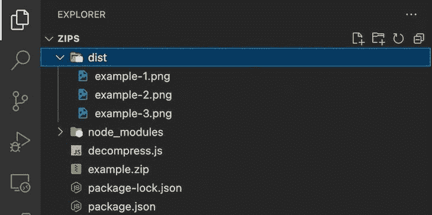
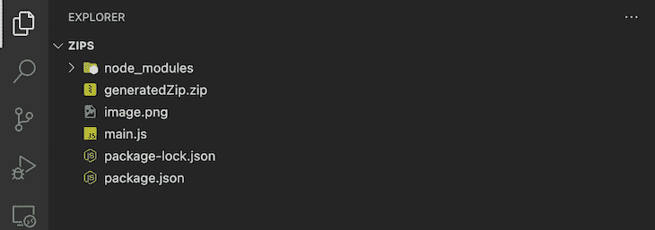

# 在 Node.js 中解压缩文件的最佳方法

> 原文：<https://blog.logrocket.com/best-methods-unzipping-files-node-js/>

随着这些年来技术的进步，对更多内存消耗和便携性的需求也在增长。许多数据压缩技术使用适用于不同操作和文件大小的底层算法来解决这一问题。一些标准算法包括 ZIP、BZIP2、7-ZIP、JPEG、PEG 等等。

Zip 是最流行的数据压缩算法之一，用于减小文件大小和增加可移植性。压缩文件时，压缩算法将文件或文件夹压缩成 zip 文件，您可以通过提取(解压缩)原始格式来检索文件。

在 Node.js 项目中使用`zip`文件可以有效地减小文件大小，同时减少数据共享和传输的数据丢失。在本教程中，您将学习使用解压缩、adm-zip、zlib、unzipper 和 jszip 包在 [Node.js](https://blog.logrocket.com/tag/node/) 中压缩和解压缩文件的最佳方法。

*向前跳转:*

## Node.js 的解压缩包

[解压缩包](https://www.npmjs.com/package/decompress)是一个 npm 包，它使用 [`Promises`](https://blog.logrocket.com/guide-promises-node-js/#:~:text=Promises%20can%20be%20used%20to,can%20result%20in%20callback%20hell).&text=Here%2C%20we%20see%20the%20result,chain%20of%20then()%20methods.) 简化了文件提取，而不会阻塞代码执行。

要开始解压这个包，请用下面的命令安装它:

```
npm install decompress

```

接下来，导入包:

```
const decompress = require("decompress");

```

导入的`decompress`方法需要三个参数:

*   `.zip`文件的文件路径
*   输出目录的文件路径
*   可选的配置对象

可选配置对象使用数组方法，如`map`或`filter`，在提取文件之前对其执行某些操作:

```
decompress("example.zip", "dist")
  .then((files) => {
    console.log(files);
  })
  .catch((error) => {
    console.log(error);
  });

```

在上面的代码块中，我们使用`decompress`来解压缩`example.zip`文件，并用结果文件填充`dist`文件夹。

成功运行上面的代码块将使用结果文件填充您的`dist`:


## 评估 adm-zip 包

[adm-zip 包](https://www.npmjs.com/package/adm-zip)是一个 npm 包，用于 zip 数据压缩，允许您将 zip 文件直接解压缩到磁盘或内存缓冲区。

要开始解压缩此软件包，请运行以下命令进行安装:

```
npm install adm-zip

```

然后，导入包。像这样:

```
const AdmZip = require("adm-zip");

```

接下来，创建一个`adm-zip`实例:

```
const zip = new AdmZip("./example.zip");

```

通过提供文件路径作为参数，可以用现有的`.zip`实例化`adm-zip`。用现有的`.zip`实例化它可以访问文件中的数据。

另一方面，您也可以在没有现有`.zip`的情况下实例化它。因此，创建一个新的空文件。

然后，您可以通过调用其`extractAllTo`方法来提取实例化了`adm-zip`的文件。此方法将文件路径作为参数，并用文件内容填充文件路径。

这是如何工作的:

```
zip.extractAllTo("dist");

```

上面的代码块提取`example.zip`中的所有文件，并用提取的文件填充`dist`文件夹:



## 使用 zlib 包

与之前的 npm 包不同， [zlib 包](https://www.npmjs.com/package/zlib)是一个核心 Node.js 模块，它使用 [Gzip](https://nodejs.org/api/zlib.html#class-zlibgzip) 、 [Deflate](https://nodejs.org/api/zlib.html#class-zlibdeflate) / [Inflate](https://nodejs.org/api/zlib.html#class-zlibinflate) 和 [Brotli](https://nodejs.org/api/zlib.html#class-zlibbrotlicompress) 来提供数据压缩和解压缩功能。

要使用这个模块解压文件，导入`node:zlib`、`fs`模块和`pipeline`:

```
const zlib = require("node:zlib");
const fs = require("fs");
const { pipeline } = require("node:stream");

```

`pipeline`方法提供了一个 API 来轻松地传输一系列[流](https://blog.logrocket.com/working-node-js-streams/)。这个方法有三个参数:一个源、一个目的地和一个回调。

然后，通过调用 Zlib 的`createUnzip`方法创建一个`unzip`实例:

```
const unzip = zlib.createUnzip();

```

接下来，创建输入和输出流。输入流应该是`.zip`的文件路径，输出流应该是 Zlib 写入导出数据的文件路径:

```
const input = fs.createReadStream("image.png.gz");
const output = fs.createWriteStream("extratcted.png");

```

最后，按以下顺序将您的流和`unzip`实例传递到`pipeline`:

```
pipeline(input, unzip, output, (error) => {
  if (error) console.log(error);
});

```

上面的代码块将输入流通过`unzip`实例，并用解压缩后的数据填充输出流，如下图所示:


## Node.js 的解压缩包

[解压软件包](https://www.npmjs.com/package/unzipper)是一个 NPM 软件包，作为[解压软件包](https://www.npmjs.com/package/unzip)的替代品，以解决该软件包的一些显著缺点，包括其同步特性、不可靠的打开/关闭事件触发以及高内存占用。

要使用此软件包解压缩文件，请运行以下命令进行安装:

```
npm install unzipper

```

接下来，导入包和 Node.js `fs`模块:

```
const unzipper = require("unzipper");
const fs = require("fs");

```

解压缩程序包使用`fs`模块的`createReadStream`方法打开并读取一个`.zip`文件的内容。`createReadStream`以文件路径和配置对象为参数，返回一个`fs.ReadStreamobject`。

使用 Node.js 流的`pipe`方法将返回的对象传递给解压缩程序包的`Extract`方法。

`Extract`获取一个配置对象，指定解压缩后的文件所在的文件路径。文件解压后，`pipe`发出一个`close`事件:

```
fs.createReadStream("example.zip")
  .pipe(unzipper.Extract({ path: "dist" }))
  .on("close", () => {
    console.log("Files unzipped successfully");
  });

```

成功运行上面的代码块会用解压后的文件填充您的`dist`文件夹。

## 用 jszip 包创建、读取和编辑文件

我们要看的下一个包是 [jszip 包](https://www.npmjs.com/package/jszip)。Jszip 是一个 npm 包，允许您创建、读取和编辑`.zip`文件。这个包的主要功能是制作和操作`.zip`文件。

通过运行以下命令安装 jszip 包:

```
npm install jszip

```

接下来，导入包和`fs`模块:

```
const JsZip = require("jszip")
const fs = require("fs");

```

要使用 jszip 创建`.zip`文件，您必须创建一个新的`jszip`实例:

```
// Initialize the zip file
const zip = new JsZip();

```

接下来，您可以通过调用`file`方法将文件添加到您的`.zip`文件夹中。这个方法有三个参数:文件路径、文件内容和一个可选的信息对象。

文件参数的内容可以是`string`、`Uint8Array`、`number[]`、`ArrayBuffer`、`Blob`，也可以是 Node.js `ReadableStream`:

```
// Create a text file with the text "Hello World"
zip.file("hello.txt", "Hello World");

```

上面的代码块将在项目的根目录下创建一个`hello.txt`文件，并用字符串“Hello，World！”填充该文件

您还可以将文件夹添加到您的`.zip`文件中，并使用`folder`方法将文件添加到文件夹中，该方法将文件夹的名称作为参数，并返回一个新的`jszip`实例，其中给定的文件夹作为其根目录:

```
const images = zip.folder("images");

```

要将文件添加到已创建的文件夹中，直接在`jszip`实例上调用`file`,并将该文件夹作为其根目录:

```
images.file("image.png", fs.readFileSync("image.png"), {
      base64: true,
  });

```

要将图像等编码数据添加到您的`.zip`文件中，可选信息对象必须将其`base64`属性设置为`true`。

接下来，生成您的`.zip`文件的内存表示，并将其转换成一个[节点缓冲区](https://blog.logrocket.com/node-js-buffer-complete-guide/)，这样您就可以将它还给用户。这个过程可以使用 jszip 的`generateAsync`方法来实现，该方法异步生成一个新的归档文件。

此方法采用一个配置对象，该对象提供有关保存的数据类型的信息:

```
// Convert the zip file into a buffer
const generatedZip = await zip.generateAsync({ type: "nodebuffer" });

```

最后，您可以使用`fs`模块的`writeFileSync`方法发送回创建的文件:

```
// Save the zip file
fs.writeFileSync("generatedZip.zip", generatedZip);

```

下面的代码块是一个完整的例子，描述了如何用 jszip 创建`.zip`文件:

```
(async () => {
  try {
    // Initialize the zip file
    const zip = new JsZip();

    // Create a text file with the text "Hello World"
    zip.file("hello.txt", "Hello World");

    // Make a new folder called images with a picture called images
    const images = zip.folder("images");
    //Add image.png to the images folder
    images.file("image.png", fs.readFileSync("image.png"), {
      base64: true,
    });

    // Convert the zip file into a buffer
    const generatedZip = await zip.generateAsync({ type: "nodebuffer" });

    // Save the zip file
    fs.writeFileSync("generatedZip.zip", generatedZip);
  } catch (error) {
    console.log(error);
  }
})();

```

上面的代码块将生成`generatedZip.zip`文件:



您还可以使用 jszip 通过`loadAsync`方法读取`.zip`文件，该方法可以将缓冲的`.zip`作为参数，并返回`.zip`的内容:

```
// Read a zip file
fs.readFile("generatedZip.zip", (err, data)=> {
  if (err) throw err;
  JsZip.loadAsync(data).then((zip) => {
    // Use zip data
  });
});

```

在上面的代码块中，我们使用了`fs`模块的`readFile`方法来读取`generatedZip.zip`的内容，让您可以访问作为缓冲区的数据。然后，缓冲区被传递给`loadAsync`方法，该方法在解析后提供对`.zip`内容的访问。

## 比较 Node.js 的解压缩包

本文中涉及的每个包都有不同的特性、优点和权衡。为 Node.js 项目选择一个包应该取决于项目的需要。

这里有一个表格，比较了我们讨论过的解压软件包。我们将根据开发人员的经验、受欢迎程度、包的类型以及它们的异步特性来比较它们:

| 使减压 | ADM-Zip | Zlib | 解压缩程序 | JsZip | 开发者体验 |
| --- | --- | --- | --- | --- | --- |
| 最小语法，易于使用和实现 | 非常容易使用 | 复杂的设置，对 Node.js 流的依赖 | 易于与`fs`模块一起使用 | 它提供了广泛的功能，是初学者友好的 | 受欢迎程度(NPM) |
| 每周下载 2，966，560 次 | 每周下载 3，526，251 次 | 不适用的 | 每周下载 2，022，298 次 | 每周下载 6，197，551 次 | 外部依赖性 |
| 真实的 | 真实的 | 错误的 | 真实的 | 真实的 | 异步的 |
| 真实的 | 错误的 | 真(可选) | 错误的 | 真实的 | 结论 |

## 本文介绍了 Node.js 生态系统中一些最流行的 zip 操作包，以及如何使用它们来操作您的`.zip`文件。希望这能为您选择下一个 Node.js 项目所需的包提供有益的指导。

200 只显示器出现故障，生产中网络请求缓慢

## 部署基于节点的 web 应用程序或网站是容易的部分。确保您的节点实例继续为您的应用程序提供资源是事情变得更加困难的地方。如果您对确保对后端或第三方服务的请求成功感兴趣，

.

[try LogRocket](https://lp.logrocket.com/blg/node-signup)

LogRocket 就像是网络和移动应用程序的 DVR，记录下用户与你的应用程序交互时发生的一切。您可以汇总并报告有问题的网络请求，以快速了解根本原因，而不是猜测问题发生的原因。

[](https://lp.logrocket.com/blg/node-signup)[https://logrocket.com/signup/](https://lp.logrocket.com/blg/node-signup)

LogRocket 检测您的应用程序以记录基线性能计时，如页面加载时间、到达第一个字节的时间、慢速网络请求，还记录 Redux、NgRx 和 Vuex 操作/状态。

.

[Start monitoring for free](https://lp.logrocket.com/blg/node-signup)

.