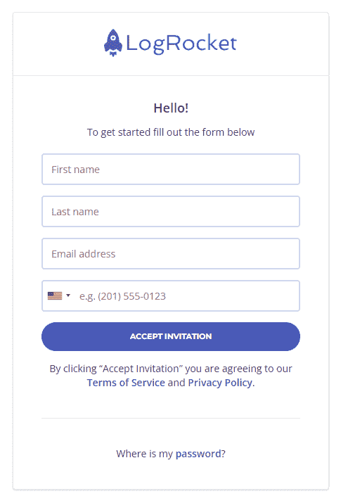
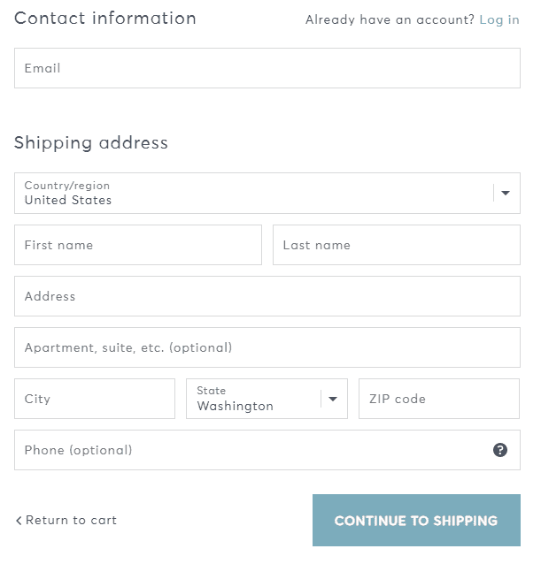
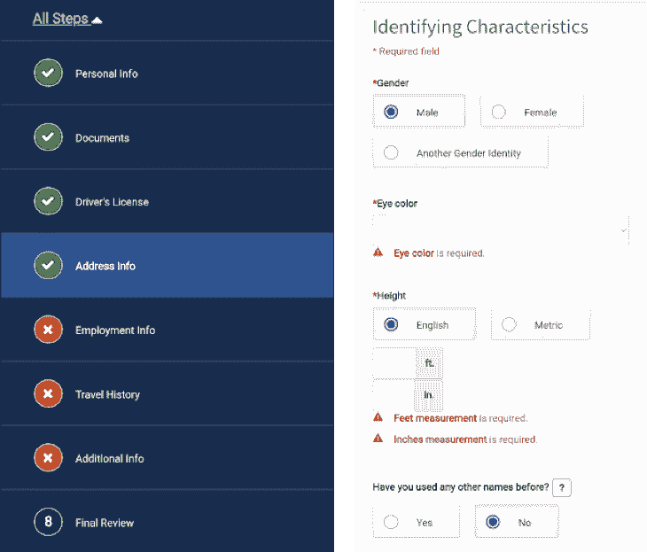
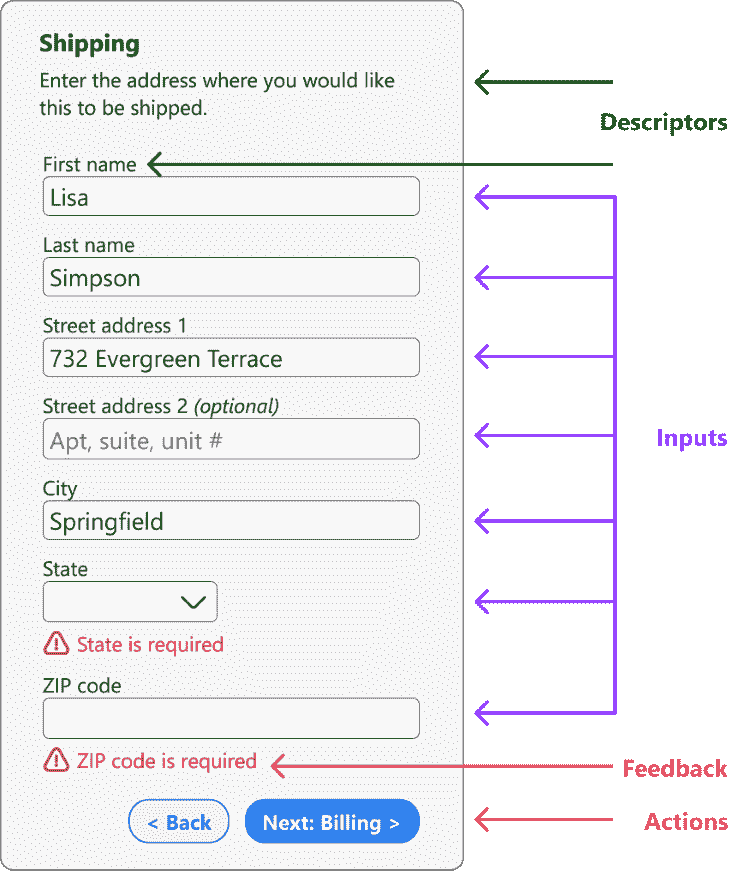
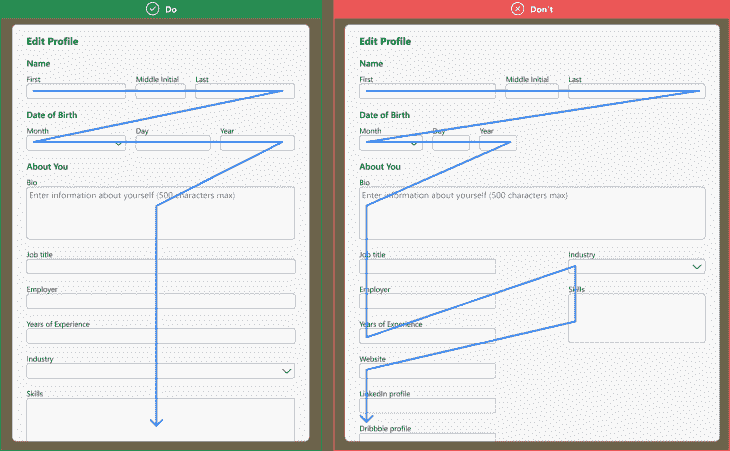
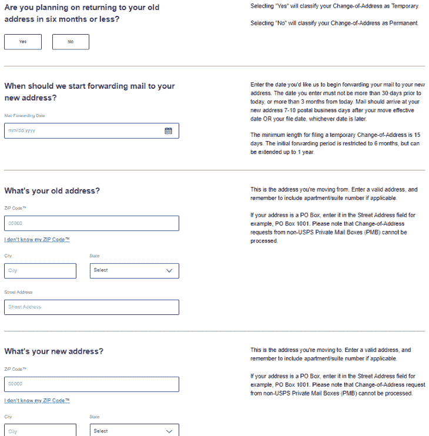
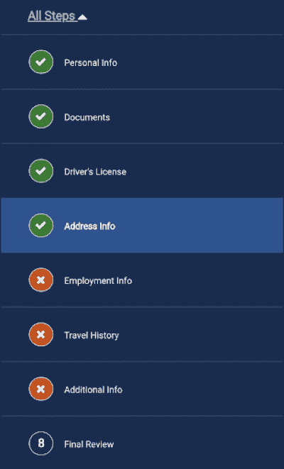
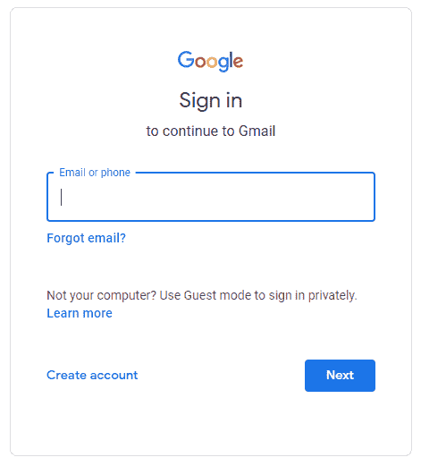
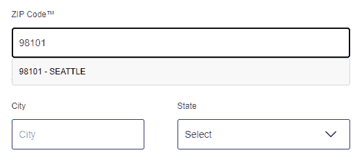

# 更好的表单设计:UX 提示、工具和教程

> 原文：<https://blog.logrocket.com/ux-design/better-form-design-ux-tips-tools-tutorial/>

表单是用户会遇到的最常见的界面模式之一，他们对表单的体验通常会为他们对整个产品或品牌的体验定下基调。

因为表单使用户能够输入文本和其他信息，所以它们是界面中最重要的工具。但是伴随这种能力而来的是适当设计和构建表单的责任；一个功能不良的表单会导致客户失望，而一个损坏的表单通常意味着销售的损失。

如果设计得好，表单会给用户留下愉悦和成就感。这种成功意味着用户将愿意再次与你的表单或你的应用程序或网站上的其他元素进行交互，这种品牌忠诚度是值得的。下面的指导方针可以帮助你将笨拙的遭遇转变为用户的流畅体验。

## 表单的类型

您可能需要为您的产品创建各种各样的表单。有些很简单，比如输入用户名和密码的登录表单。其他的很复杂，有很多步骤，各种各样的输入，有时甚至跨越多个页面。预先知道您可能需要创建哪种表单将有助于您决定如何更好地设计它。

### 简单形式

最基本的表单通常由一个页面上的一小组输入和一个动作按钮组成。

简单表单是从界面到系统后端的基本信息交换。假设用户成功输入信息，界面将进入新的屏幕，用户可以继续其他操作。下面的表单是一个简单表单界面的例子。

### 向导表单

向导窗体表现为一组链接的简单窗体，它们以引导顺序出现。在一个页面上有输入或输入组，但是完成该页面上的一组输入将进入另一个页面，具有其自己的单独的、不同的形式。

向导窗体通常不仅包含单个操作按钮，还包含在步骤序列中向前或向后移动的方向按钮。

理想情况下，向导表单保存用户在每个页面上的所有输入，这样，如果后续步骤出错，以前输入的数据不会丢失。

下面的例子来自一个电子商务网站，是一个向导形式的例子。在这个页面上，用户可以输入送货地址。使用 action 按钮向前翻页会导致另一个选择运输选项的表单。

### 可导航表单

可导航表单类似于分步向导表单，但是可导航表单不是每个部分都以引导性的步骤顺序出现在新页面上，而是在一个页面上显示许多或所有步骤，根据需要展开或折叠这些步骤。

与向导窗体不同，可导航窗体的步骤通常可以按任何顺序访问。可导航的表单利用现代的界面控件，例如折叠内容部分或侧面导航选项卡，作为隐藏一组表单域和显示另一组表单域的方法。当表单内容复杂、包含许多步骤并且可能需要多个会话才能完成时，可导航表单特别有用。

可导航的表单应该在允许用户移动到另一个部分之前保存在一个部分中收集的数据。这样，如果用户在第 7 步时意识到他们在第 4 步犯了一个错误，很容易导航回第 4 步并对先前保存的数据进行更改。

下面的政府表单演示了一个可导航的表单，允许用户在各种类型的必需信息之间移动。

## 形体剖析

不管你构建的是什么类型的表单，它都可能包含四个主要元素:输入、描述符、动作和反馈机制。

### 输入控件

输入是用户可以控制页面上显示什么以及最终在表单中提交什么信息的任何方式。

表单的输入可能看起来简单明了，但是在表单中输入信息有很多种方法。最常见的输入是简短的文本形式，但它们也可以包括长文本形式、下拉菜单、切换、开关和许多其他形式。

### 描述符

描述符提供了表单输入的外围细节，而不会直接影响表单上的内容。描述符可以是表单的标题、描述表单用途的正文文本，也可以是描述每个输入的标签。

### 行动

动作是表单的任何一部分，它从表单传输信息或生成反馈。在大多数情况下，这是表单底部的按钮，显示**注册**，**登录**，**提交**，或者**返回**。动作不必是表单的最后一步；它可以让用户返回到上一步或验证中间步骤。

### 反馈

反馈是对表单的输入和动作做出响应的任何内容。在不同的情况下，反馈可以采取不同的形式。

提交无效密码时，出现的错误消息是一个[类型的反馈](https://blog.logrocket.com/designing-microinteractions-better-app-ux/)。诸如“该用户名可用”之类的确认消息是另一种反馈。有时，反馈会出现在新的屏幕上，比如在完成购买并进入确认页面时，会显示“您的订单已收到”

反馈是通知用户他们的输入已经完成、被认可或被接受的重要方式。由于用户多次提交表单或无意中没有完成购买就离开页面，无法提供反馈通常会导致挫败感。

## 最佳实践

### 保持路径线性

表格已经很繁琐了。即使设计得很好，他们也会觉得势不可挡。

减少认知负荷的一个方法是尽可能简单地让你的形体流畅起来。一般来说，如果用户沿着页面上的直线路径向下移动，他们会感觉在表单中快速前进。

对于某些字段，如全名或出生日期，您仍然应该在一个水平行中对齐名字、中间名和姓氏字段，但是对于包含单个不同输入的任何其他字段，最好将这些字段堆叠在一个垂直列中。

不必要时不要引入额外的列。如果可能的话，尽量减少页面的输入宽度；每一行都在不同的地方结束，这可能会令人迷惑。

### 相似元素分组

另一种减少认知负荷的方法是将相似的元素组合在一起。这样做，你就在不同的部分之间创造了一个视觉上的分离。

这样做的一个目的是保持表单输入的逻辑顺序。询问用户名、城市名、电子邮件地址、邮政编码、邮寄地址、用户名和信用卡号是没有意义的。如果你这样做了，你的用户的大脑将会在如此多不同类型的信息之间切换，这会导致不必要的困扰。

相反，将个人信息放在一个部分，将联系信息放在另一个部分。使用文本层次结构或分隔线来区分各组。

在下面的例子中，从 USPS 地址变更表单中，这些区别非常有用，这样用户就不会混淆哪个城市输入属于旧地址，哪个属于新地址。

### 将不同的元素分成多个步骤

有时一个表单会有非常不同的元素。填写纳税申报单、报名参加政府项目或申请大学都涉及到极其复杂的表格和各种各样的信息。

在一个页面上显示这些表单的每一个输入字段将是令人难以招架的，此外，用户在有机会保存或提交表单之前会遇到大量耗时的输入，如果中间步骤受到任何干扰，则会带来更大的进度丢失风险。

当表单包含许多不同类型的数据时，将不同的元素分成不同的组会有所帮助。这可以通过使用分步向导来完成，在分步向导中，用户可以通过单击一个按钮并输入一个全新的页面来保存并进入下一步，或者在一个页面上使用折叠元素来折叠先前填充的部分并展开下一个部分。下面显示的政府表单是一个分成多个页面的表单示例，在各个部分之间进行导航。

### 使用文本标签，而不是依赖提示文本

标签和提示文本是传达用户应该输入的信息类型的重要方式。最佳实践通常是同时使用两者，因此您的标签可能会说**出生日期**而提示文本会说 **mm/dd/yyyy** 以补充输入类型和额外的有用建议。

您可能会发现，在某些情况下，提示文本是不必要的，这也没关系。只是不要仅仅依靠提示文本来描述想要的输入。请记住，一旦用户单击该字段，提示文本就会消失；不要让你的用户有可能开始输入，然后就不知道该输入什么了。

### 提供良好的反馈

所有的表单都应该提供反馈，但是仅仅给出任何一种反馈都是不够的；反馈应该是有意义的、描述性的和建设性的。这就是与你的用户产生共鸣的重要性所在。是的，用户的无效输入会对系统的后端产生影响，但是你应该把注意力放在用户和他们与你的界面的流畅交互上。

如果输入无效，请描述错误，并尽量用客观中立的语气。不要说“你输入了错误的电子邮件地址。”说“请输入有效的电子邮件地址”或“电子邮件地址的格式应该是'[[电子邮件保护]【T1]'”您的后端可能有常见错误的错误代码，这些代码可能对您的工程师和 IT 人员有用，但要避免在您的前端界面中显示这些代码。](/cdn-cgi/l/email-protection)

同样，这也是尽可能描述性有所帮助的地方。用简单易懂的语言解释错误，并建议用户如何修复它。

### 温和地处理错误

现在你知道如何提供好的反馈，确保只在必要的时候使用反馈。验证某些输入字段是好的，但是当输入字段在有机会输入有效数据之前就出现错误消息时，可能会让用户感到不舒服或沮丧。一般来说，在用户聚焦于某个字段之前，不要对输入进行验证。

## 如何让表单更智能

虽然上面的大部分指导方针都是针对 web 表单的静态设计，但是您可以将大量的交互式元素构建到 web 表单中，以使体验更加轻松。

一个简单的技巧是在页面加载时自动聚焦于表单的第一个字段。当您加载 Gmail 主页时，它会自动将您的焦点带到电子邮件地址输入字段，该字段处于明显的焦点状态。

另一种改善用户表单体验的方法是启用字段屏蔽。这是一种可以在前端代码中使用的技术，可以将用户的输入自动配置成您想要的格式。

例如，您可以屏蔽电话号码字段，在用户键入号码时自动添加这些字符，而不是强制用户使用括号或破折号来输入您的首选电话号码。

最后，尽可能使用自动填充输入，以减少用户需要键入的字符数，并帮助确保输入的格式正确。这对于已经与该帐户关联的国家或城市名称或电子邮件地址等字段尤其有用。

当一个字段的输入可以用于填充其他字段时，例如与特定城市和州相关联的邮政编码，允许您的表单这样做。下面的例子来自 USPS 网站，在输入有效的邮政编码后填写城市和州。

## 结论

可能看起来不像，但人们在互联网上互动的许多内容都是某种形式的。我们依赖于几乎所有网站和应用程序上的表单，我们希望它们表现一致。

否则，我们将很难登录帐户，甚至无法注册帐户。我们将无法编辑我们的个人资料，我们将无法将我们在网上购买的东西运送到正确的地址。

我们相信我们在网上遇到的表格——我们的数据会准确地传输到数据库，如果我们出错，我们会得到通知，当我们进入下一页时，我们的进度会被保存。当表单表现得像我们一样聪明时，当它们看起来准备好接受我们的输入时，当它们直观地完成我们键入的输入时，当它们用友好熟悉的语言提醒我们时，它们甚至可以培养更多的信任。但是为了做到这一切，设计和构建表单的人需要理解好的表单设计的关键概念。

*精选图片来源:[icon scout](https://iconscout.com/icons/form-download)*

## [LogRocket](https://lp.logrocket.com/blg/signup) :无需采访即可获得 UX 洞察的分析

[LogRocket](https://lp.logrocket.com/blg/signup) 让您可以回放用户的产品体验，以可视化竞争，了解影响采用的问题，并结合定性和定量数据，以便您可以创建令人惊叹的数字体验。

查看设计选择、交互和问题如何影响您的用户— [立即尝试 LogRocket】。](hhttps://lp.logrocket.com/blg/signup)