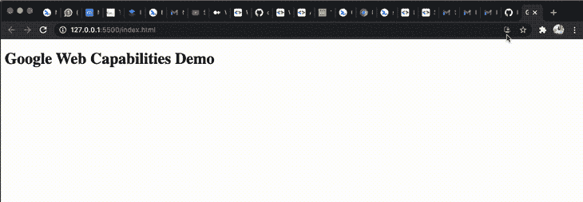
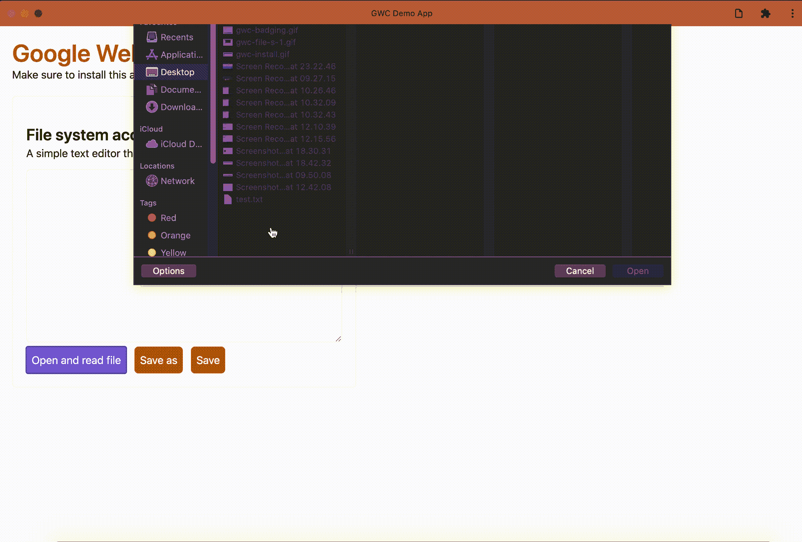
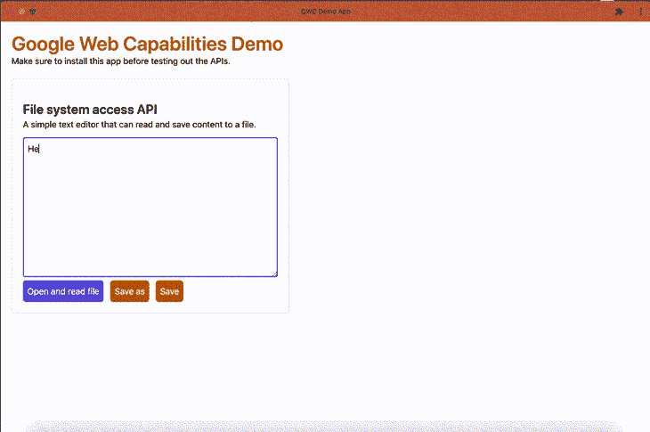
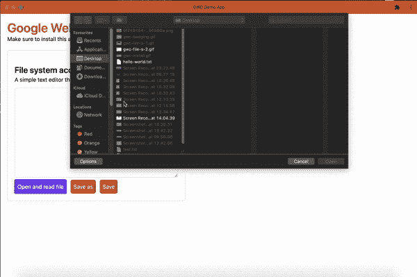
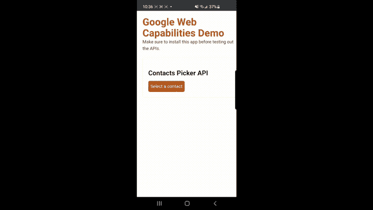

# 通过项目 Fugu - LogRocket 博客弥合本地应用程序差距

> 原文：<https://blog.logrocket.com/bridging-the-native-app-gap-with-project-fugu/>

由于像 [Project Fugu](https://www.chromium.org/teams/web-capabilities-fugu) 这样的努力，将原生移动和桌面体验带给网络用户的能力更接近成为现实，这是一个雄心勃勃的计划，将使开发人员更容易开发具有原生功能的网络应用程序。在本文中，我们将探索这个项目的一些最新的补充，并创建几个简单的例子来更好地理解它们是如何工作的。

## 什么是府谷计划？

Project Fugu 是微软、英特尔和谷歌的跨公司项目。它的重点是将移动和桌面平台固有的功能带到网络上，同时确保其核心原则，如安全性、隐私、信任等。得到了维护。

例如，在移动设备上，像 WhatsApp 这样的本地应用程序可以访问你的联系人列表，并允许你与其他人共享联系人。然而，这个特性并不是 web 固有的，可能需要开发人员构建一个移动应用程序来访问该功能。Project Fugu 旨在通过一套新的 web APIs 来解决此类问题。

根据[谷歌](https://codelabs.developers.google.com/codelabs/web-capabilities#0):

> “我们希望缩小 web 和 native 之间的能力差距，让开发人员能够轻松地在开放 web 上构建出色的体验。我们坚信，每个开发人员都应该能够获得他们需要的能力，以创造出色的网络体验，我们致力于打造一个更强大的网络。”

有趣的是，[河豚](https://felixgerschau.com/web-capabilities-project-fugu-google/)这个名字来源于日本鱼，据说烹饪正确时味道鲜美，但烹饪不当则会致命。Chromium 团队选择这个名字来比喻如果正确开发，这些 web 功能 API 会多么强大，但是失败会多么致命，因为它们会损害 web 的一些或所有核心原则。

以前，开发人员需要开发移动和桌面应用程序来访问本地 API，但是 Project Fugu 将许多这些本地功能带到了 web 上。它的工作原理是作为本机 API 之上的一个额外的抽象层，允许您访问任何设备或操作系统。

虽然有些 API 仍处于试验阶段，或者还没有得到浏览器的完全支持，但目前有许多 API 可供我们使用和探索。在您的生产应用程序中使用 API 之前，查看受支持设备和操作系统的[更新列表](https://fugu-tracker.web.app/)非常重要。

让我们开始探索一些 API，并用它们构建一些演示。

## 先决条件

为了跟随代码示例，您需要一些 HTML、JavaScript 和[渐进式网络应用(PWA)](https://blog.logrocket.com/why-you-should-turn-your-app-into-a-pwa/) 的基础知识。本文中的例子是在 Chrome 89 上运行的。

我们将在本文中演示的 API 已经从 [origin 试用版](https://web.dev/fugu-status/#origin-trial)升级，现在在最新版本的 Chrome/基于 Chromium 的浏览器中得到完全支持。

## 初始设置

为了演示 API，我们需要创建一个渐进式 Web 应用程序(PWA ),用户可以将它安装在浏览器中。

我们将在 VS 代码中使用 [live 服务器扩展](https://marketplace.visualstudio.com/items?itemName=ritwickdey.LiveServer)在`localhost:5500`上运行我们的应用程序。

首先，创建一个新目录。我们称我们的为`gwc-demo`。在这个目录的根目录下创建一个`index.html`和一个`manifest.webmanifest`文件。

在`manifest.webmanifest`文件中，我们需要提供一些关于我们的应用程序的信息，以及我们希望它如何在浏览器中显示。你可以在这里阅读更多关于网络清单的信息。

```
{
    "name": "Google Web Capabilities Demo",
    "short_name": "GWC Demo",
    "description": "This app demonstrates some of the coolest features of Project Fugu!",
    "scope": "/",
    "display": "standalone",
    "background_color": "#ffff",
    "theme_color": "#3367D6",
    "start_url": "/",
    "icons": [
        {
            "src": "/images/icon-192x192.png",
            "sizes": "192x192",
            "type": "image/png"
        },
        {
            "src": "/images/icon-512x512.png",
            "sizes": "512x512",
            "type": "image/png"
        }
    ]
}

```

我们还需要我们的应用程序的图像图标，将出现在用户操作系统的状态栏。我在下面创建了一个简单的图标。在项目的根目录下创建一个`images`文件夹，并将该图像复制到其中。确保创建图像的两个副本，并分别重命名为`icon-192x192.png`和`icon-512x512.png`。


这样一来，我们需要创建一个[服务工作者](https://blog.logrocket.com/setting-up-a-pwa-with-service-workers-and-create-react-app/)。服务工作者用来告诉浏览器在特定事件期间应用程序应该如何执行。这可能发生在应用程序安装、激活或离线时。

在你的根目录下创建一个文件`sw.js`。这个文件将存放运行我们的服务人员的代码。添加以下代码:

```
const urlsToCache = [
  "/images/icon-192x192.png",
  "/images/icon-512x512.png",
  "/index.html",
  "/offline.html",
];

// caches all our files when the app is first installed
self.addEventListener("install", function (event) {
  event.waitUntil(
    caches.open("gwc").then(function (cache) {
      console.log("Opened cache");
      return cache.addAll(urlsToCache);
    })
  );
});

self.addEventListener("fetch", function (event) {
  event.respondWith(
    caches.match(event.request).then(function (response) {
      if (response) return response;
      return fetch(event.request).catch((err) => {
// serves an offline.html file if the app is offline
        return caches.match("offline.html");
      });
    })
  );
});

self.addEventListener("activate", (event) => {});

```

Chrome 89 增加了通过服务人员运行模拟离线请求的能力。我们将使用这个特性为浏览器提供一个资源，通知用户何时离线。我们可以实现这一点的一种方法是缓存一个文件，当用户离线时提供该文件，然后一旦我们的应用程序检测到用户确实离线，就提供该文件。

首先，在根目录下创建一个`offline.html`文件。现在，将以下代码添加到`offline.html`文件中:

```
<!doctype html>
<html lang="en">
  <head>
    <title>GWC Demo App</title>
    <meta name="description" content="This app demonstrates some of the coolest features of Project Fugu!">
    <meta name="viewport" content="width=device-width, initial-scale=1">
    <link rel="manifest" href="manifest.webmanifest">
    <link rel="icon" sizes="192x192" href="/images/icon-192x192.png">
    <meta name="theme-color" content="#3367D6">
    <meta property="og:title" content="GWC Demo App">
    <meta property="og:type" content="website">
    <meta property="og:description" content="This app demonstrates some of the coolest features of Project Fugu!">
  </head>
  <body>

    <main>
      <h1>Hey there 👋, you're offline.</h1>
    </main>
  </body>
</html>

```

接下来，进入`index.html`文件并包含以下代码:

```
<!doctype html>
<html lang="en">
  <head>
    <title>GWC Demo App</title>
    <meta name="description" content="This app demonstrates some of the coolest features of Project Fugu!">
    <meta name="viewport" content="width=device-width, initial-scale=1">
    <link rel="manifest" href="manifest.webmanifest">
    <link rel="icon" sizes="192x192" href="/images/icon-192x192.png">
    <meta name="theme-color" content="#CA623D">
    <meta property="og:title" content="GWC Demo App">
    <meta property="og:type" content="website">
    <meta property="og:description" content="This app demonstrates some of the coolest features of Project Fugu!">
  </head>
  <body>

    <main>
      <h1>Google Web Capabilities Demo</h1>
    </main>
    <script>
      if('serviceWorker' in navigator) {
        navigator.serviceWorker.register('/sw.js', { scope: '/' }).then((registration) => {
          console.log('Service Worker Registered');
        });
        navigator.serviceWorker.ready.then((registration) => {
          console.log('Service Worker Ready');
        });
      }
    </script>
  </body>
</html>

```

现在我们已经设置好了一切，让我们安装我们的应用程序，以检查一切工作正常。

在浏览器的右上角，您应该会在地址栏中看到一个**安装**图标。点击安装我们的谷歌网络功能(GWC)演示应用程序。



现在，如果你看看你的 dock，你应该看到我们的 Google Web Capabilities 应用程序已经安装。


## 轰动一时的 api

我们将探索的第一个 API 是[标记 API](https://www.chromestatus.com/feature/6068482055602176) 。徽章允许我们通知应用程序的用户关于可能需要他们注意的活动。我们可以显示少量不间断的信息，以特定于操作系统的方式通知用户应用程序中的事件。

例如，徽章可以向用户显示他们在聊天或电子邮件应用程序中收到了多少新消息。徽章也可以用来巧妙地通知用户什么时候轮到他们玩游戏。

以下代码示例中的样式将使用 [Tailwind CSS](https://tailwindcss.com) 编写，但是您可以访问 [repo](https://github.com/onedebos/project-fugu-demo) 来查看样式类。

创建一个名为`scripts`的新文件夹，并包含一个`badging.js`文件。将以下代码添加到`badging.js`文件中:

```
let count = 0;
document.getElementById("new-message").addEventListener("click", () => {
  navigator.setAppBadge(++count);
});
document.getElementById("clear-messages").addEventListener("click", () => {
  navigator.clearAppBadge();
});

```

接下来，在您的`index.html`文件中，在`<main>`标记中添加以下标记 API 代码:

```
      <!-- Badging API -->
      <button id="new-message">New message</button>
      <button id="clear-messages">Clear messages!</button>

```

现在，当我们点击**新** **消息**按钮时，我们将在应用程序的图标徽章上获得新的通知。


正如你所看到的，每次我们点击**新消息**按钮，我们的 GWC 徽章(在被告席上)就会增加。当我们击中**的时候，明确的消息！**按钮，复位。

## 文件系统访问 API

[文件系统访问 API](https://web.dev/file-system-access/) 允许用户与其本地设备上的文件进行交互。我们可以像文本编辑器、ide 和视频编辑器一样，直接在用户设备上读写文件。让我们更详细地研究这个 API。

对于我们的第一个例子，我们将从一个用户的目录中读取一个文件，并显示一个`textarea`标签中的内容。

### 读取文件

用下面的代码块更新您的`index.html`文件:

```
      <!-- Native File System API -->
      <div>
        <h1>File system access API</h1>
        <p>A simple text editor that can read and save content to a file.</p>

        <textarea id="textarea" cols="30" rows="10"></textarea>
        <div>
          <button id="open-file-picker">Open and read file</button>
          <button id="save-as">Save as</button>
          <button id="save">Save</button>
        </div>  
      </div>

```

接下来，在`scripts`文件夹中，创建一个`file-system.js`文件并添加以下代码:

```
let fileHandle;
const textarea = document.getElementById('textarea');
document.getElementById('open-file-picker').addEventListener('click', async () => {
    [fileHandle] = await window.showOpenFilePicker();
    // read a file from the file system
    const file = await fileHandle.getFile();
    // reads the text content in the file
    const contents = await file.text();
    // updates the textarea with the text contents
    textarea.value = contents;
});

```

我们需要使用`fileHandle`变量来保存对所选文件的引用。这将允许我们保存更改或对文件执行其他操作。

`showOpenFilePicker`方法返回一个句柄数组，它包含了我们在与文件交互时需要的所有属性和方法。

我们现在可以测试我们的文件是否被正确读取和显示。让我们创建一个`.txt`文件，并向其中添加一些文本。我们将使用终端来实现这一点:

```
touch test.txt
echo "Hello World" >> test.txt

```

现在，回到 GWC 应用程序，检查我们的应用程序可以从文本文件加载内容。

* * *

### 更多来自 LogRocket 的精彩文章:

* * *



### 写入文件

文件系统访问 API 的另一个强大特性是能够在我们的文件系统中写入文件。来自文件系统访问 API 的`createWritable()`方法创建了一个流，您可以用它来传输文本，或者是`[Blobs](https://developer.mozilla.org/en-US/docs/Web/API/Blob)`或者是`[BufferSource](https://developer.mozilla.org/en-US/docs/Web/API/BufferSource)`。`createWritable()`方法也将在写入磁盘之前请求用户的许可。

在常规的文本编辑器中，用户通常会有*保存*和*另存为*选项。“保存”选项将更改写入同一文件，而“另存为”选项允许您将更改写入新文件。

首先，我们将探索另存为功能。当用户点击**的** **另存为**按钮时，我们将打开文件选择器，允许用户创建一个新文件或文档来保存他们的更改。然后，我们将把文本区域的内容写入这个文件。

我们将用下面的代码块更新我们的`scripts/file-system.js`:

```
const getNewFileHandle = async () =>{
    // additional options for the file picker to use
    const options = {
        types: [
            {
                description: "Text Files",
                accept: {
                    "text/plain": [".txt"],
                },
            },
        ],
    };
  const handle = await window.showSaveFilePicker(options);
  return handle;
}

document.getElementById("save-as").addEventListener("click", async () => {
    const newFileHandle = await getNewFileHandle();

    const contents = document.getElementById('textarea').value

    const writable = await newFileHandle.createWritable();

    await writable.write(contents);

    await writable.close();
});

```

在`getNewFileHandle()`方法中，我们指定想要保存的文件类型:a `text/txt file`。然后，我们向用户显示一个文件选择器，允许他们选择想要保存文件的位置。这个方法返回一个新的句柄。然后我们可以绑定到这个句柄上的方法，将`textarea`中的内容保存到文件中。

让我们来测试一下。



让我们演示使用**保存**按钮覆盖文件。对于这个功能，我们需要确保在用户打开文件时保留对`fileHandle`的引用。通过这样做，我们可以很容易地绑定到`fileHandle`上的方法来覆盖文件的内容。

我们将用下面的代码块更新我们的`scripts/file-system.js`:

```
document.getElementById("save").addEventListener("click", async () => {
    const contents = document.getElementById('textarea').value

    const writable = await fileHandle.createWritable();

    await writable.write(contents);

    await writable.close();
})

```

现在，让我们来测试一下！

我们将从之前创建的`test.txt`文件中加载一些内容，更新它，然后保存它。



我们将在本文中探索的最后一个 API 是[联系人选择器 API](https://web.dev/contact-picker/) 。这个功能在移动操作系统中已经存在很长时间了，现在有了 Project Fugu，我们可以在网上访问用户的联系人列表。

联系人选择器 API 目前只能在 Android 设备上运行 Chrome 80 或更高版本。对于这个 API，我们将编写代码，然后使用`[ngrok](http://ngrok.com)`创建一个公共 URL，它将通过隧道到达我们的`localhost`。通过这样做，我们将能够继续在我们的机器上编写代码，同时用我们的移动设备进行测试。

[在你的机器上下载并安装](https://ngrok.com/download) `ngrok`来跟随这部分。在`localhost:5500`上启动`ngrok`(或者运行您的实时服务器扩展的任何端口)。

```
./ngrok http 5500 
```

在 Android 设备上导航到由`ngrok`提供的 URL 来查看我们的应用程序。如果您无法在 Android 设备上访问该应用程序，请确保`ngrok`与您的 live server VS Code extension 运行在同一个端口上。


若要确认，请检查浏览器中的地址栏。例如，在本例中，live server 运行在`port 5500`上。

现在，在您的`scripts`目录中，创建一个`contacts-picker.js`文件。确保将这个脚本包含在您的`index.html`文件中。

用以下代码更新`index.html`文件:

```
<section>
        <h1>Contacts Picker API</h1>
        <h2 class="hidden not-supported-message">Your browser does not support the Contacts Picker API</h2>
        <h2 class="hidden not-supported-message">Please try again on an Android device with Chrome 80+ </h2>
        <button id="select-contact">Select a contact</button>
        <div id="contacts" class="hidden">
          <p>Your contacts will only be displayed on this page for Demo purposes and are not stored anywhere else.</p>x
        </div>
        <ul id="results"></ul>
      </section>

```

我们从 Tailwind CSS 中添加了一个隐藏类，它隐藏了默认情况下显示的消息:“您的浏览器不支持联系人选择器 API。”如果我们检测到用户的浏览器支持联系人选择器 API，我们将使用 JavaScript 删除这个类。

我们现在可以用这段代码更新`contacts-picker.js`文件:

```
const supported = ('contacts' in navigator && 'ContactsManager' in window);
if (!supported){
    selectContactBtn.classList.add('hidden')
    const messages = document.querySelectorAll('.not-supported-message')
    messages.forEach((message)=> message.classList.remove('hidden'))
}

```

如果用户的浏览器不支持联系人选择器 API，我们将显示消息。

让我们继续用我们需要的其余代码更新`contacts-picker.js`文件:

```
const selectContactBtn = document.getElementById('select-contact')
// details we wish to get about a contact
const props = ['name', 'email', 'tel'];
// allows a user select multiple contacts
const opts = {multiple: true};
const ul = document.getElementById('results')

selectContactBtn.addEventListener('click', async ()=>{
    try {
        const contacts = await navigator.contacts.select(props, opts);
        renderResults(contacts);
      } catch (ex) {
        // Handle any errors here.
      }    
})

function renderResults(contacts){
    contacts.forEach(contact =>{
        const li = document.createElement('li')
        if(contact.name) li.innerHTML += `<b>Name</b>: ${contact.name} <br />`
        if(contact.email) li.innerHTML += `<b>E-mail</b>: ${contact.email.join(', ')} <br />`
        if(contact.tel) li.innerHTML += `<b>Tel</b>: ${contact.tel.join(', ')} <br />`

        li.classList.add('mt-3')
        ul.appendChild(li)
    })
}

```

我们有一个`renderResults`函数，它将接收用户选择的联系人数组，并将它们附加到我们的`<ul>`标签上，这样它们就可以显示在屏幕上。



现在，您可以在运行 Chrome 80 的 Android 设备上测试联系人选择器 API(再次注意，这是编写本文时唯一支持该 API 的浏览器)。请参考这里的更新列表以了解更多浏览器的支持何时到来。

你可以在这里看到演示的现场版本[，并看到完整的源代码，包括我们使用过的样式，](https://project-fugu.netlify.app/)[在这里](https://github.com/onedebos/project-fugu-demo)。

## 结论

Project Fugu 致力于为网络开发者提供更多的可能性。最终，开发人员将能够在用户的移动设备上访问本地 API，而不必了解这些 API 是如何工作的。开发人员也将能够使用他们已经熟悉的核心 web 语言，通过这些 API 轻松地构建特性！

你可以在这里看到最新的 API 列表[，以及哪些浏览器支持哪些 API。任何人都可以建议将什么 API 添加到项目中。您可以在这里](https://fugu-tracker.web.app/)将您的建议添加到列表[中。](https://bugs.chromium.org/p/chromium/issues/entry?summary=Fugu+Request:++Add+your+feature+title&comment&labels=Type-Feature,Pri-3,Proj-Fugu)

## 使用 [LogRocket](https://lp.logrocket.com/blg/signup) 消除传统错误报告的干扰

[](https://lp.logrocket.com/blg/signup)

[LogRocket](https://lp.logrocket.com/blg/signup) 是一个数字体验分析解决方案，它可以保护您免受数百个假阳性错误警报的影响，只针对几个真正重要的项目。LogRocket 会告诉您应用程序中实际影响用户的最具影响力的 bug 和 UX 问题。

然后，使用具有深层技术遥测的会话重放来确切地查看用户看到了什么以及是什么导致了问题，就像你在他们身后看一样。

LogRocket 自动聚合客户端错误、JS 异常、前端性能指标和用户交互。然后 LogRocket 使用机器学习来告诉你哪些问题正在影响大多数用户，并提供你需要修复它的上下文。

关注重要的 bug—[今天就试试 LogRocket】。](https://lp.logrocket.com/blg/signup-issue-free)