# 使用 Lunchbox.js 在 Vue 中构建 3D 视觉效果

> 原文：<https://blog.logrocket.com/build-3d-visuals-vue-lunchbox-js/>

自 2010 年问世以来， [Three.js](https://threejs.org) 已经成为在网络上构建 3D 视觉效果的事实标准。多年来，已经在这个库的基础上构建了几个抽象，整合了它的特性和 JavaScript 库的大型生态系统，以创建快速、出色和高性能的 web 应用程序。

随着 Vue.js 的成熟，它已经成为基于组件的用户界面开发的首选库之一。Vue 和 Three.js 的设计目标都差不多；这两种工具都以不同的方式控制 UI 元素，在 web 上创建交互式视觉效果。

在本文中，我们将介绍为 Three.js 定制的渲染器 [Lunchbox.js](https://lunchboxjs.com) 。我们将涵盖开始使用 Lunchbox.js 在 Vue 中构建 3D 视觉效果所需的一切:

## 先决条件

要阅读本文，您应该具备以下条件:

*   Vue 的基础知识及其概念
*   对 Three.js 的基本了解

## 什么是 Lunchbox.js？

Lunchbox.js 使用 Vue 的基于组件的模型和声明式风格来处理必要的 Three.js 功能。

该库通过组件提供对原始 Three.js 对象和类的访问，例如:

*   网状物
*   光
*   几何
*   组
*   材料

这些组件是 Lunchbox.js 的构建块，它们是 Three.js 类的直接翻译。

例如，当在一个普通的 Three.js 项目中创建一个标准网格时，我们将使用一个类似于`BoxGeometry()`的几何类来创建一个长方体形状，使用类似于`MeshBasicMaterial()`的材质类对其应用颜色，然后通过使用`Mesh()`类组合两个对象来将其映射到几何图形，就像下面的代码一样:

```
// create geometry with sides of length 1
const geometry = new THREE.BoxGeometry(1, 1, 1)
// create yellow basic material
const material = new THREE.MeshBasicMaterial({ color: 0xffff00 })
// combine geometry + material in mesh
const mesh = new THREE.Mesh(geometry, material)
// add that mesh to the scene (assuming you've created a scene)
scene.add(mesh)

```

为了在 Lunchbox.js 应用程序中创建相同的网格，我们将使用相同的类，除了作为组件，而不是将它们分配给变量并与一个`Mesh()`类组合，我们将它们嵌套在一个`<mesh>`组件中，如下所示:

```
<Lunchbox>
    <mesh>
        <boxGeometry :args="[1, 1 ,1]" />
        <meshBasicMaterial :color="0xffff00" />
    </mesh>
</Lunchbox>

```

您会注意到在上面的例子中，每个`<Lunchbox>`组件都匹配相应的带有 camelCase 名称的 Three.js 类。

```
// three.js
new THREE.Mesh()
<!-- Lunchbox -->
<mesh/>
// three.js
new THREE.BoxGeometry()
<!-- Lunchbox -->
<boxGeometry/>

```

Lunchbox.js 和 Three.js 的语法非常相似，但是有一些不同之处需要注意。例如，每个`<Lunchbox>`组件都使用`args`属性将参数作为道具。`args` prop 接受一个参数数组，并将其传递给组件的类构造函数。

```
new THREE.BoxGeometry(1, 2, 3)

```

上面的代码在午餐盒中会转化为以下内容:

```
<boxGeometry :args="[1, 2, 3]" />

```

其他的 Three.js 对象属性，比如`MeshBasicMaterial`类的`color`属性，可以被添加为`<Lunchbox>`组件上的反应道具。这就像我们在前面的例子中看到的一样。

```
<meshBasicMaterial :color="red" />

```

然而，利用点符号的属性，如`position`向量，将在`<Lunchbox>`组件中用破折号`-`来设置，如下所示:

```
<mesh :position-x="3" />

```

午餐盒为大多数 Three.js 类提供了内置支持；你可以在这里找到组件列表[。](https://github.com/breakfast-studio/lunchboxjs/blob/main/src/components/autoGeneratedComponents.ts/)

包含组件中没有的类可以使用 Lunchbox 的`app.extend`方法添加。例如，下面是我们如何将`orbitControl`类添加到午餐盒中:

```
import { createApp } from 'lunchboxjs'
import App from 'YourApp.vue'
//Import the class from three.js
import { OrbitControls } from 'three/examples/jsm/controls/OrbitControls'
// tell the app to extend Lunchbox to include OrbitControls and mount the app
createApp(App)
    .extend({ OrbitControls })
    .mount('#app')    

```

`extend()`方法是 Lunchbox 的独特特性之一，用该方法添加的类继承了`<Lunchbox>`组件的所有特性。

我们已经了解了 Lunchbox.js 的核心概念，接下来我们将看看如何使用 Lunchbox 进行构建。在本教程中，我们将学习更多关于库的概念。

## Lunchbox.js 入门

要设置一个 Lunchbox.js 应用程序，首先使用 Vite 的 CLI 安装 Vue:

```
npm create [email protected]

```

运行命令后，从库列表中选择 Vue，并为项目命名。接下来，将 cd 放入项目文件夹并运行以下命令:

```
npm install lunchboxjs three

```

该命令将安装 Lunchbox.js 和 Three.js 作为 Vue 应用程序的依赖项。您可以在根目录下的`package.json`文件中查看它们。

接下来，清除项目中的样板代码，打开`main.js`文件，并替换以下代码:

```
import { createApp } from 'vue'
import App from './App.vue'
createApp(App).mount('#app')

```

使用此代码:

```
import { createApp } from 'lunchboxjs'
import App from './App.vue'
createApp(App).mount('#app')

```

这里，我们从`lunchboxjs`而不是从`vue`导入了`createApp`函数。这将把 Vue 应用程序转变成一个午餐盒环境。

现在，我们可以开始在我们的应用程序中构建和渲染 3D 对象。

## 创建场景

场景是一个对象，它允许我们设置要渲染的项目。它就像一个显示区域，可以将对象放在一起并呈现给浏览器。下面是一个在 Three.js 中设置的`scene`的例子:

```
const scene = new THREE.Scene();
const camera = new THREE.PerspectiveCamera( 75, window.innerWidth / window.innerHeight, 0.1, 1000 );
const renderer = new THREE.WebGLRenderer();
renderer.setSize( window.innerWidth, window.innerHeight );
document.body.appendChild( renderer.domElement );

```

在 Lunchbox.js 中设置一个场景更加简单，也不那么神秘。该库提供了一个`<Lunchbox>`组件，其中包含在 Three.js 中创建渲染器和场景的底层代码。

要设置它，转到`App.vue`主组件，将`<Lunchbox>`组件放在模板部分内，就像这样:

```
<template>
  <Lunchbox>
            <!-- ... -->
  </Lunchbox>
</template>

```

嵌套在`<Lunchbox>`标签中的每个对象都将被渲染到浏览器中。如果您保存代码并启动开发服务器，您应该会看到一个类似下面的黑屏。

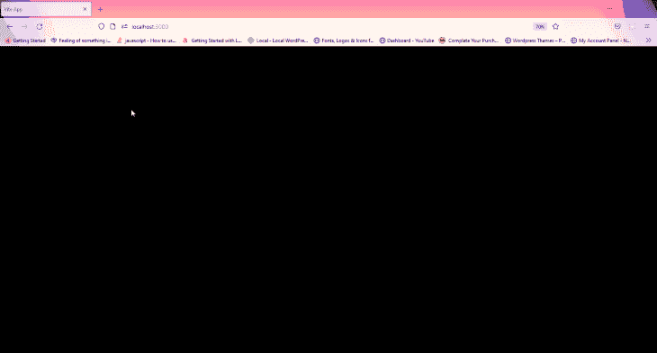

这个黑屏是我们应用的渲染器；我们添加到场景中的任何东西都会显示在这里。你可以用一个`background`道具改变背景颜色，就像这样:

```
<Lunchbox background="indigo">
            <!-- ... -->
</Lunchbox>

```


以下是你可以在`<Lunchbox>`组件上使用的一些道具:

*   `background`
*   `cameraPosition`
*   `camera`
*   `zoom`
*   `shadow`

## 添加网格

几何图形是用于定义网格形状的 Three.js 类。在本文的前面，我们演示了如何使用`boxGeometry`组件渲染长方体网格。在这里，我们将看到如何在浏览器中渲染更多的 3D 形状。

Lunchbox.js 带有几个自动生成的内置几何组件，你可以在这里看到可用组件的列表[。](https://github.com/breakfast-studio/lunchboxjs/blob/main/src/components/autoGeneratedComponents.ts/)

继续在`Lunchbox`标签中添加一个`<mesh>`组件，并在其中嵌套您选择的任何几何组件。不要忘记包括一个带有`color`道具的材质组件。

```
<Lunchbox>
  <mesh>
     <boxGeometry />
     <MeshBasicMaterial color="red"/> 
  </mesh>
</Lunchbox>

```

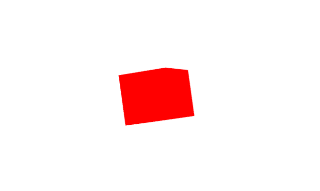

材质组件利用 [Three.js `Material()`](https://threejs.org/docs/#api/en/materials/Material) 类来定义`mesh`的各种表面属性。

一个`<mesh>`组件只接受一个`Geometry()`和`Material()`组件。为了给场景添加更多的形状，我们必须创建更多的网格，每个`Geometry()`一个，如下所示。

```
<Lunchbox>
      <mesh>
         <boxGeometry />
         <MeshBasicMaterial color="red"/> 
      </mesh>
      <mesh>
         <torusKnotBufferGeometry />
         <MeshBasicMaterial color="grey"/> 
      </mesh>
</Lunchbox>

```

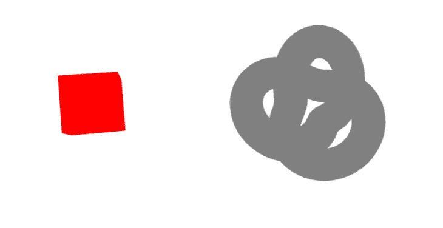

或者，我们可以为每个形状创建单独的组件，并将它们导入主组件，如下所示:

```
<script>
      import {Sphere} from './Sphere.vue'
</script>
<template>
      <Lunchbox>
            <Sphere />
      </Lunchbox>
</template>

```

每个`Geometry`组件接受独特的参数，这些参数可用于微调和操作其宽度、高度、平滑度和其他视觉特征。这些参数可以在饭盒中使用`args`道具进行设置。

```
<torusKnotBufferGeometry :args="[1, 0.4, 240, 20]"/>

```

`<mesh>`组件也接受几个道具。由于它是`Geometry()`的容器，它也可以用来操纵位置、旋转等。

```
<Lunchbox>
  <mesh position-x="4" position-x="4">
      ...
  </mesh>
</Lunchbox>

```

在上面的代码中，我们添加了一个`position`道具，它将沿着 x 轴向右移动球体网格 4px。

以下是一些可用于操纵形状的网格道具:

*   `position (x, y, z)`
*   `rotation (x, y, x)`
*   `scale (x, y)`

网格也可以使用`<group>`组件进行分组。这个组件充当几何图形的容器，我们可以在每个`<group>`中添加任意多的`<mesh>`。

```
<Lunchbox>
     <group>
        <mesh>
           <boxGeometry />
           <MeshBasicMaterial color="red"/> 
        </mesh>
        <mesh>
           <torusKnotGeometry />
           <MeshBasicMaterial color="grey"/> 
        </mesh>
     </group>
</Lunchbox>

```

## 添加纹理

目前，我们的网格看起来不是很真实。应用材料使它们看起来有点塑料。我们可以应用纹理，使用饭盒中的`<textureLoader>`组件，给每个网格一个更真实的外观。

`<textureLoader>`组件利用了 [Three.js `Texture()`类](https://threejs.org/docs/#api/en/textures/Texture)，让我们将真实的纹理映射到引擎罩下的网格表面。为了演示这个过程，我们将创建一个地球的 3D 模型。

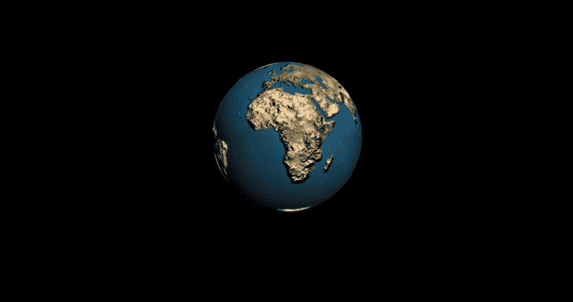

要创建地球，清理场景，然后使用`<sphereGeometry` `/>`组件创建一个新的球形几何网格。

```
<Lunchbox>
  <mesh>
     <sphereGeometry />
  </mesh> 
</Lunchbox>

```

接下来，在网格中添加一个`<meshPhysicalMaterial>`组件，并将`<textureLoader>`嵌套在其中，如下所示:

```
<Lunchbox>
  <mesh>
      <sphereGeometry :args="[1, 32, 32]" />
      <meshPhysicalMaterial>
            <textureLoader />
      </meshPhysicalMaterial>
  </mesh>
</Lunchbox>

```

`<textureLoader>`组件接受一个`src`和一个`attach`道具。`src`道具接受纹理材质的相对或绝对路径，而`attach`道具接受贴图选项。

在这个例子中，我们将使用`map`和`bumpMap`选项。换句话说，我们必须在网格组件中声明第二个`<textureLoader>`。

抓取下面的图片，并将它们放在项目的`/public`文件夹中:

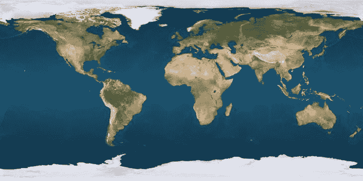

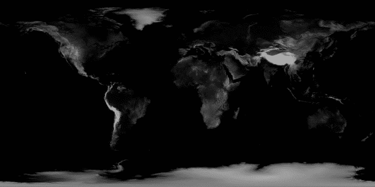

接下来，将第一个图像的路径添加到第一个`<textureLoader>`组件的`src`属性中，并给`attach`属性一个`"map"`值。

```
<meshPhysicalMaterial>
      <textureLoader src="/first-image" attach="map" />
      <textureLoader ... />
</meshPhysicalMaterial>

```

如果您现在保存项目，浏览器中将出现一个球形轮廓。这是因为我们的场景没有光源。

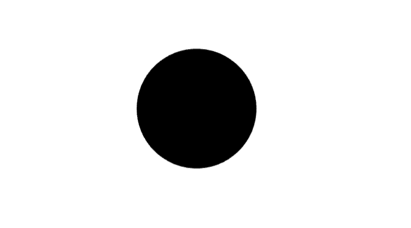

要解决这个问题，请在`<Lunchbox>`组件中添加`<pointLight` `/>`和`<directionalLight` `/>`组件。

```
<Lunchbox>
  <directionalLight />
  <pointLight />
  <mesh>
      ...
  </mesh>
</Lunchbox>

```

现在，如果您保存项目并返回浏览器，您应该会看到类似下图的内容:

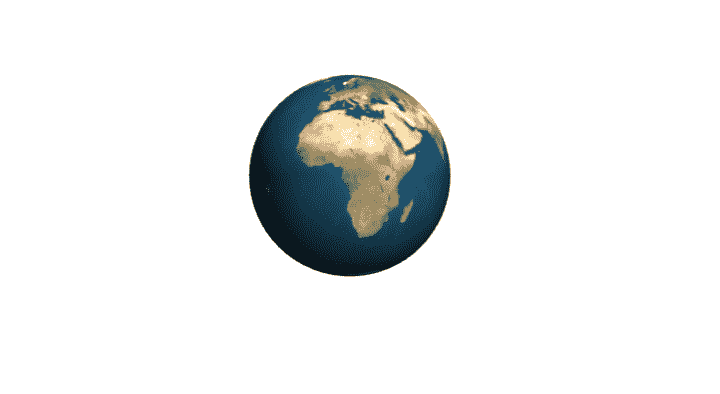

为了使图像更加有趣和视觉震撼，我们将使用第二个图像添加真实的轮廓到地球。

我们将像处理第一张图片一样处理它。将图像的路径添加到`src`属性，但是这次给`attach`属性一个`"bumpMap"`值。

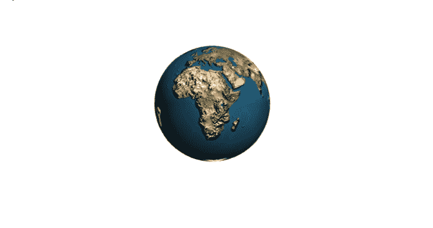

## 添加动画

Lunchbox.js 提供了一个`onBeforeRender`函数，在渲染之前或之后的每一帧都会调用这个函数。有了这个函数，我们可以通过在每一帧上给它的`rotation`属性添加一个值来激活我们的地球。

转到`App.vue`组件的脚本部分，从 Vue 导入`ref`,从 Lunchbox 导入`onBeforeRender`函数。

```
import {ref} from 'vue'
import {onBeforeRender} from 'lunchboxjs'

```

接下来，将`ref`分配给一个`rotation`变量，并传递给它一个具有以下属性的对象:

```
const rotation = ref({y: 0});

```

然后，调用`onBeforeRender`函数并添加以下代码:

```
onBeforeRender(() =>{
   rotation.value.y += 0.02
})

```

这里，我们在每一帧上给对象的 y 轴旋转增加 0.02 度。最后，给地球的网格添加一个`rotation-y`道具，并传递给它`rotation.y`值，就像这样:

```
<mesh rotation-y="rotation.y">
        <sphereGeometry />
        <meshPhysicalMaterial>
              <textureLoader ... />
              <textureLoader ... />
        </meshPhysicalMaterial>
  </mesh>

```

现在，如果你保存这个项目，你的地球仪应该像下面的例子一样很好的动画。

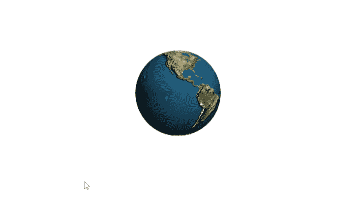

您可以通过将`x`和`z`属性添加到`ref`、`onBeforeRender`函数和地球网格中来添加更多旋转动画。

## 添加事件

我们可以将事件监听器添加到`<Lunchbox>`组件中，就像我们在 Vue 中添加任何其他元素一样。为了演示，我们将添加一个单击事件，当它被触发时，将暂停我们的地球动画。

继续在地球网格上创建一个`onClick`事件，如下所示:

```
<mesh rotation-y="rotation.y" @click="">
    ...
</mesh>

```

接下来，用`ref`创建一个变量，并给它传递一个布尔值`true`。用一个`if`语句将声明包装在`onBeforeRender`函数中:

```
const active = ref(true)
onBeforeRender(() =>{
 if(active){
   rotation.value.y += 0.02
  }
})

```

这里，我们将变量`active`指定为`if`语句的条件。当该值设置为`false`时，将不执行语句中的代码，动画将暂停。

最后，将以下代码添加到`<mesh>`组件上的`onClick`事件中:

```
<mesh rotation-y="rotation.y" @click="active = !active">
    ...
</mesh>

```

现在，当单击地球时，它的动画将暂停并播放，如下所示:

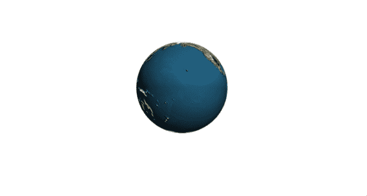

就是这样！我们已经在 Vue 中成功构建了 3D 视觉效果！

作为一个挑战，尝试在场景中添加一个有星星的黑色背景，给地球一个更真实的感觉。通过在场景中添加一个平面几何体并映射夜空的纹理，你可以很容易地实现这一点。祝你好运！

## 结论

在本文中，我们介绍了 Lunchbox.js 的核心概念，并演示了如何使用该工具在 Vue 中创建 3D 视觉效果。在我们的教程中，我们创建了一个场景，构建了不同的网格几何体，向网格添加了纹理，动画网格，并向场景中的对象添加了事件侦听器。

Lunchbox.js 仍在开发中，但已经可以投入生产了。您可以放心地将它与您的应用程序一起发运。要了解更多关于这个库的信息，请访问官方文档并查看一些用 Lunchbox.js 构建的示例项目。

## 像用户一样体验您的 Vue 应用

调试 Vue.js 应用程序可能会很困难，尤其是当用户会话期间有几十个(如果不是几百个)突变时。如果您对监视和跟踪生产中所有用户的 Vue 突变感兴趣，

[try LogRocket](https://lp.logrocket.com/blg/vue-signup)

.

[](https://lp.logrocket.com/blg/vue-signup)[https://logrocket.com/signup/](https://lp.logrocket.com/blg/vue-signup)

LogRocket 就像是网络和移动应用程序的 DVR，记录你的 Vue 应用程序中发生的一切，包括网络请求、JavaScript 错误、性能问题等等。您可以汇总并报告问题发生时应用程序的状态，而不是猜测问题发生的原因。

LogRocket Vuex 插件将 Vuex 突变记录到 LogRocket 控制台，为您提供导致错误的环境，以及出现问题时应用程序的状态。

现代化您调试 Vue 应用的方式- [开始免费监控](https://lp.logrocket.com/blg/vue-signup)。