# 零配置构建全栈 React 应用

> 原文：<https://blog.logrocket.com/build-a-full-stack-react-app-with-zero-configuration/>

构建现代前端应用程序通常需要大量工具。想想巴别塔，网络包，包裹，汇总等。模块打包器如此受欢迎是有原因的。

有很多很棒的工具可以帮助简化开始一个新前端项目的过程。如果你对 React 有一点模糊的了解，那么你一定用过`create-react-app`(除非你一直在石头下编码)。简单方便。固执己见，是的，但是它消除了许多你可能不得不自己做的痛苦的设置。

那么，我说的零配置是什么意思呢？

在本文中，我将带您在后端使用 Node.js 构建一个全栈 React 应用程序，我们将在不编写任何配置的情况下完成这个过程！没有网络包，没有复杂的设置——没有。没有。一无所获。

给我们带来这种便利的工具叫做 Zero。又称零服务器，它[自诩为零](https://blog.logrocket.com/an-intro-to-zero-server-a-new-tool-to-simplify-web-development-42bee961e5d1/)[–](https://blog.logrocket.com/an-intro-to-zero-server-a-new-tool-to-simplify-web-development-42bee961e5d1/)[配置 web 框架](https://blog.logrocket.com/an-intro-to-zero-server-a-new-tool-to-simplify-web-development-42bee961e5d1/)。

我认为这是一个很有潜力的框架。这无疑为您节省了很多压力，并且能够处理非常不同的项目设置。你的后端可以是 Python 或者 Node！你的前端可以是 Vue，React，或者 Svelte！

和所有事情一样，Zero 也有一些问题——一些主要问题，一些次要问题，这取决于您的用例。当我们构建项目时，我会在文章中强调这些。

## 全栈应用

我们将为虚构的著名的安吉拉·麦克雷诺兹构建一个应用程序。看看申请的[最终版本](https://github.com/ohansemmanuel/fullstack-react-zero)就知道她的一切了。周围有点击！

该应用程序的主要部分包括一个内置在 React 中的主页:

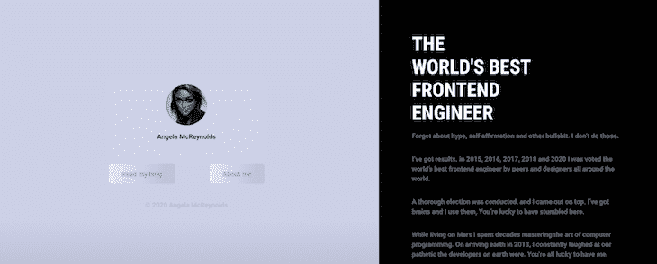

以及潜在客户可以查看的过去项目列表:


## 零安装和入门

编写第一行代码并在屏幕上显示内容就像使用 Zero 一样简单。在你的计算机上创建一个新文件夹，并在你的代码编辑器中打开它。

在此目录中，创建一个新文件`index.tsx`。这将是应用程序的入口——主页。我稍后将解释这是如何工作的。

继续编写一个基本的`App`组件，如下所示:

```
import React from "react";

const App = () => {
  return <h1>Hello!</h1>;
};

export default App;

```

这只是呈现文本`Hello!`。还没有什么新奇的东西。

在这一点上，我们还没有安装 React 或任何模块。那很好。Zero 会处理好的。在您的终端中，继续编写`npx zero`对目录运行 Zero。

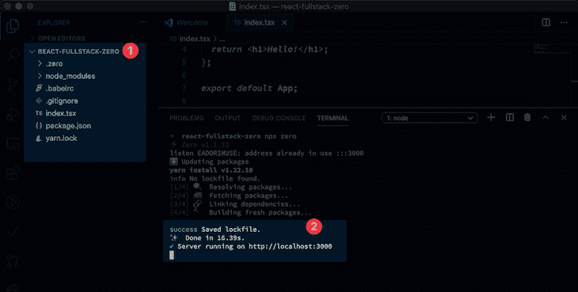

运行`zero`命令后发生的事情很有趣。它会继续解析`index.tsx`中的模块，安装依赖项，并自动创建配置文件，这样您就不必这么做了！

现在转到`[http://localhost:3000](http://localhost:3000)`，您应该已经有了`index.tsx`组件:

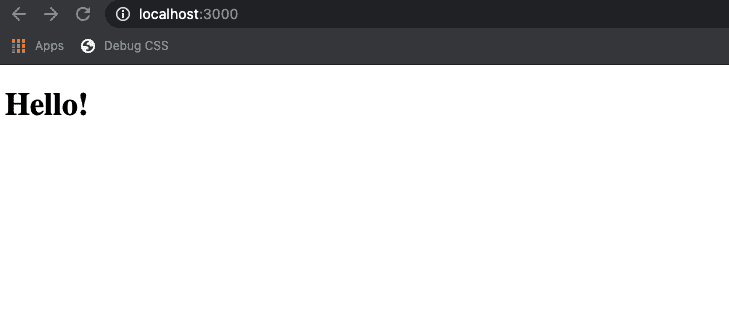

这并不特别令人兴奋，但是这里仍然有值得学习的东西！

> **N** 。 ***B*** 。**，**我们在没有全局安装的情况下运行了`zero`服务器命令。这是可能的，因为我们使用了 [npx](https://www.npmjs.com/package/npx) 。在整篇文章中，我都倾向于这一点。如果你更愿意在全球范围内安装`zero`，运行`npm install -g zero`并通过运行`zero`而不是`npx zero`来启动应用程序。

## 路由在零服务器中如何工作

Zero 使用基于文件的路由系统。如果您曾经使用过某些静态站点生成器，那么这对您来说可能并不陌生。这也是[下一个](https://nextjs.org/) [所信奉的体系。js](https://nextjs.org/) 。

它的工作方式很简单。当前的 Zero 服务器应用程序正在`[http://localhost:3000/](http://localhost:3000/)`上运行。提供给浏览器的页面将是根`index`文件。这可能是`index.html`或`index.jsx`或`index.tsx`——没关系。Zero 仍然会编译并提供文件。

如果你在浏览器中访问了`/about`，Zero 会在根目录中寻找一个相关的`about`文件，不管文件类型如何，只要它是受支持的(即`.vue`、`.js`、`.ts`、`.svelte`或`.mdx`)。同样，如果你访问`/pages/about`，那么 Zero 会在`pages`目录中寻找一个`about`文件。

简单而有效的路由。这里有一个实际的例子。

在根目录下创建一个名为`about.tsx`的新文件，并返回以下基本组件:

```
import React from "react";

const About = () => {
  return <h1>About me!</h1>;
};

export default About;

```

果然，如果你访问`[http://localhost:3000/about](http://localhost:3000/about)`，你会看到以下内容:

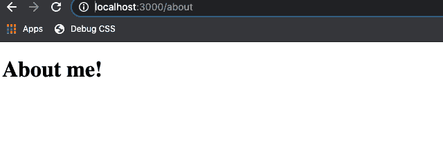

> **N** 。 ***B*** 。**，** Zero 将在被渲染的文件中寻找默认的导出实体。确保在您的公共 React 文件中有一个不命名为`exports`的默认导出。

子目录怎么样？

创建一个`blog`目录，并在其中创建一个`hello.mdx`文件。

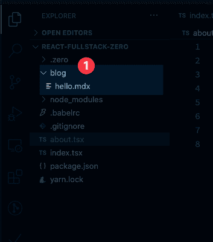

写下以下内容:

```
# Hello there

## This is a new blog

```

这是降价。但仍然是零渲染就好了！


您会注意到文件扩展名为`.mdx`。这是[M](https://en.wikipedia.org/wiki/Markdown)ark down的超集。简单来说，`mdx`就是降价加 JSX。图片能够在 Markdown 文件中呈现一个 React 组件！是的，这就是 [MDX](https://mdxjs.com/) 让你做的。

## Zero 应用程序的文件夹结构

由于路由是基于文件的，你应该在如何构建你的应用程序上多花些心思。在开发过程中，您不希望所有的客户端文件都公开。有些组件的存在只是为了组成页面，而不是为了自己显示。

我的建议是把你想公开的文件放在主目录中( **2** )，其他的都应该放在`client`目录中( **1** ):

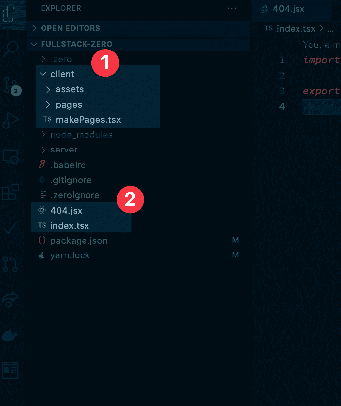

你给这个目录起什么名字是由你决定的；如果你愿意，你可以称之为`components`。但是确保在你的 Zero 应用中有这种关注点分离。你马上就会明白为什么这是金子。

### 忽略带有`.zeroignore`文件的文件

你不想公开的文件或目录可以通过一个`.zeroignore`文件传递给 Zero。
像一个`gitignore`文件，你写下要被忽略的目录或文件的名字。

在本例中，`.zeroignore`文件如下所示:

```
client 
server 

```

忽略`client`和`server`目录。`client`目录将保存我们不想公开的客户端文件；`server`也是如此。

## 建立主页

现在我们有一个只写着“你好”的主页没人会对此印象深刻！让我们改进它。

因为这篇文章关注的是使用 Zero Server，所以我不会解释风格上的 UI 变化。对于快速原型，安装 Chakra 和样式组件:

```
npx yarn add @chakra-ui/react @emotion/react @emotion/styled framer-motion styled-components

```

现在将`index.tsx`文件更新如下:

```
import React from "react";
import {
  Flex,
  Box,
  Heading,
  Text,
  Button,
  Center,
  Image,
  Spacer,
} from "@chakra-ui/react";

const Home = () => {
  return (
    <Flex direction={["column", "column", "row", "row"]}>
      {/* Profile Card  */}
      <Box
        flex="1.5"
        p={[10, 10, 20, 20]}
        minH={["auto", "auto", "100vh", "100vh"]}
        bg="linear-gradient(180.1deg, #CCD0E7 69.99%, rgba(144, 148, 180, 0.73) 99.96%)"
      >
        <Center height="100%">
          <Box w="70%" maxW={650} minW={400} minH={400}>
            <Flex justify="center">
              <Box
                borderRadius={10}
                bg="rgba(209, 213, 230, 0.5)"
                w="70%"
                maxW={400}
                height={200}
              >
                <Flex
                  direction="column"
                  align="center"
                  justify="center"
                  height="100%"
                >
                  <Image
                    borderRadius="full"
                    boxSize="100px"
                    src="https://i.imgur.com/95knkS8.png"
                    alt="My Avatar"
                  />
                  <Text textStyle="p" color="black">
                    Angela McReynolds
                  </Text>
                </Flex>
                <Flex mt={4} color="rgba(110, 118, 158, 0.6)">
                  <Button
                    borderRadius={6}
                    py={6}
                    px={8}
                    bg="linear-gradient(96.91deg, rgba(255, 255, 255, 0.44) 5.3%, #BDC3DD 83.22%)"
                  >
                    Read my blog
                  </Button>
                  <Spacer />
                  <Button
                    borderRadius={6}
                    py={6}
                    px={8}
                    bg="linear-gradient(96.91deg, rgba(255, 255, 255, 0.44) 5.3%, #BDC3DD 83.22%)"
                  >
                    About me{" "}
                  </Button>
                </Flex>
                <Box mt={6}>
                  <Text
                    textStyle="p"
                    textAlign="center"
                    color="black"
                    opacity={0.1}
                  >
                    &copy; 2020 Angela McReynolds
                  </Text>
                </Box>
              </Box>
            </Flex>
          </Box>
        </Center>
      </Box>
      {/* Details */}
      <Box flex="1" bg="black" p={[10, 10, 20, 20]}>
        <Heading as="h1" color="white" textStyle="h1">
          THE <br />
          WORLD'S BEST
          <br /> FRONTEND
          <br /> ENGINEER
        </Heading>
        <Text textStyle="p">
          Forget about hype, self affirmation and other bullshit. I don’t do
          those.
        </Text>

        <Text textStyle="p">
          I’ve got results. in 2015, 2016, 2017, 2018 and 2020 I was voted the
          world’s best frontend engineer by peers and designers all around the
          world.
        </Text>

        <Text textStyle="p">
          A thorough election was conducted, and I came out on top. I’ve got
          brains and I use them, You’re lucky to have stumbled here.
        </Text>

        <Text textStyle="p">
          While living on Mars i spent decades mastering the art of computer
          programming. On arriving earth in 2013, I constantly laughed at our
          pathetic the developers on earth were. You're all lucky to have me.
        </Text>

        <Box>
          <Button
            bg="linear-gradient(96.91deg, #BDC3DD 5.3%, #000000 83.22%)"
            w={"100%"}
            color="white"
            _hover={{ color: "black", bg: "white" }}
          >
            See past projects
          </Button>
        </Box>
      </Box>
    </Flex>
  );
};

export default Home;

```

现在，当您访问`localhost:3000`时，应该会看到这样的内容:

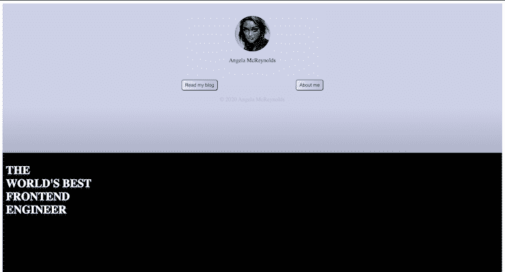

## 全局集中式页面配置

这是零的最大缺点之一。开箱即用，没有办法处理集中式页面配置；你必须有创造力。在许多情况下，你可以解决这个问题，而其他人可能会变得暴躁。

在这个特定的场景中，我们想要为 Chakra UI 库添加集中设置。你的应用程序中会有这样的案例，所以我有以下建议。

从用某种结构填充`client`目录开始，这种结构可以让您独立于公开的文件存放每个页面。


不要搞混了，这就是我的意思。创建一个`pages`目录，并创建`Home`和`About`子目录。将公共`index.tsx`和`About.tsx`的代码移到各自的目录中。

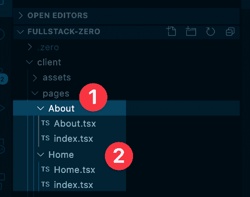

在这个例子中，我将`Home`的所有代码像这样移动:

```
// Home/Home.tsx

export const Home = () => {
  // copy code over
}
// Home/index.ts
export {Home as HomePage} from './Home'

```

继续对`About`页面进行同样的操作，并从`pages/index.tsx`导出两者:

```
export { AboutPage } from "./About";
export { HomePage } from "./Home";

```

好的部分来了。

将所有中央页面创建逻辑集中到`client`目录下的一个单独文件中。我称之为`makePages.tsx`

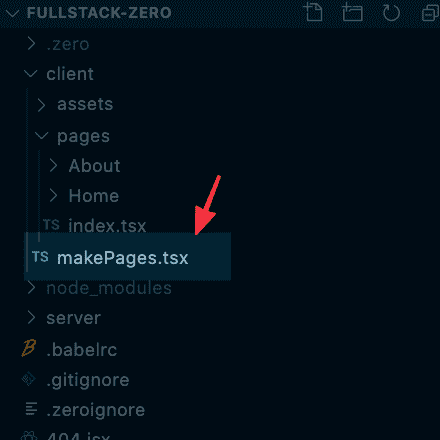

主题、元数据、自定义字体…所有这些都集中在一个地方。下面是我们需要的示例应用程序。

安装[反应头盔异步](https://www.npmjs.com/package/react-helmet-async):

```
npx yarn add react-helmet-async

```

然后将以下内容添加到`makePages.tsx`:

```
import React from "react";
import { Helmet } from "react-helmet-async";
import { ChakraProvider, Box } from "@chakra-ui/react";
import { extendTheme } from "@chakra-ui/react";

const appTheme = extendTheme({
  colors: {
    brand: {
      100: "#CCD0E7",
      200: "6E769E60",
      800: "BDC3DD",
      900: "#9094B4",
    },
  },
  fonts: {
    heading: `"Roboto Condensed", sans-serif`,
    body: "Roboto, sans-serif",
    mono: "Menlo, monospace",
  },
  textStyles: {
    h1: {
      fontSize: ["4xl", "5xl"],
      fontWeight: "bold",
      lineHeight: "56px",
    },
    p: {
      fontWeight: "bold",
      py: 4,
      color: "rgba(204, 208, 231, 0.5)",
    },
  },
});

type PageWrapperProps = {
  children: React.ReactNode;
  title: string;
};

export const PageWrapper = ({
  children,
  title,
}: PageWrapperProps & React.ReactNode) => {
  return (
    <>
      <Helmet>
        <meta charset="UTF-8" />
        <title>{title}</title>
        <link rel="preconnect" href="https://fonts.gstatic.com" />
        <link
          href="https://fonts.googleapis.com/css2?family=Roboto+Condensed:[email protected]&display=swap"
          rel="stylesheet"
        />
        <link
          href="https://fonts.googleapis.com/css2?family=Roboto+Condensed:[email protected]&family=Roboto:[email protected]&display=swap"
          rel="stylesheet"
        />
      </Helmet>
      <ChakraProvider theme={appTheme}>
        <Box w="100%" h="100vh">
          {children}
        </Box>
      </ChakraProvider>
    </>
  );
};

```

现在，您的应用程序当然会有所不同，但您仍然会从这里描述的结构中受益。您可能会节省大量调试和复制代码的时间。

现在，我们需要使用来自`makePages.tsx`的`PageWrapper`组件。`PageWrapper`获取一个页面组件，并确保它拥有所有的集中逻辑。

转到`Home/index.tsx`并让它使用`PageWrapper`，如下所示:

```
// client/pages/Home/index.tsx

import { PageWrapper } from "../../makePages";
import { Home } from "./Home";

export const HomePage = () => (
  <PageWrapper title="Home">
    <Home />
  </PageWrapper>
);

```

按照上面建立的模式对`About`页面做同样的事情。

在暴露的`index.tsx`主页中，即服务于`localhost:3000`的根文件中，继续使用新的`HomePage`组件:

```
// index.tsx
import { HomePage } from "./client/pages";

export default () => <HomePage />;

```

现在，我们的客户端页面已经有了所有的集中配置。结果如下:

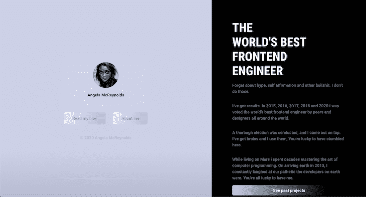

一切都进行得很顺利！

继续为自己建一个`About`页面。使用与上面相同的结构，看看它是如何工作的！

## 定制 404 页

如果您继续访问类似于`[http://localhost:3000/efdfdweg](http://localhost:3000/efdfdweg)`的随机页面，您应该会看到以下内容:

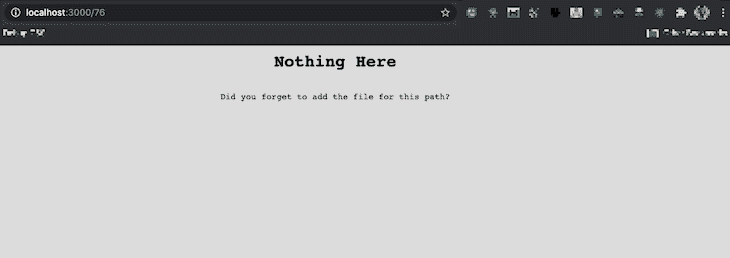

没关系。这是从零开始的默认 404 页面。要定制它，你只需要创建一个`404`文件(任何支持的文件格式), Zero 将为它服务。

让我们试试那个。

创建一个`404.jsx`文件并复制以下内容:

```
// 404.jsx

import React from "react";
import {
  Container,
  Heading,
  Text,
  Link,
  Center,
  Image,
} from "@chakra-ui/react";
import { PageWrapper } from "./client/makePages";

export default () => (
  <PageWrapper>
    <Container bg="black">
      <Heading textStyle="h1" mt={7} textAlign="center" color="white">
        You seem lost :({" "}
      </Heading>
      <Text textStyle="p" textAlign="center">
        <Link href="/" color="brand.900">
          Go home
        </Link>
      </Text>
      <Image src="https://i.imgur.com/lA3vpFh.png" />
    </Container>
  </PageWrapper>
);

```

果然，我们有了一个更好的 404 页面。很有创意，是吧？


## 零开发的服务器端开发

我们已经涵盖了您需要了解的客户端的基本功能。这包括一些棘手的问题，比如集中页面设置。现在让我们把焦点转移到后端。我将使用 Node.js 来保持熟悉。

在任何代码实现之前，您应该知道路由在这里也是一样的！和客户端实现一样，Zero 支持不同的后端语言:Python 和 Node。

好吧，首先。

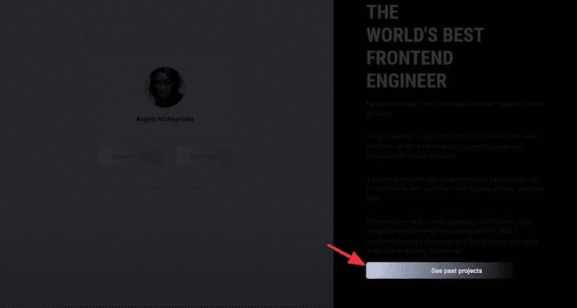

当用户点击**查看过去的项目**时，我们希望显示一个新页面，其中包含一个由我们后端提供的项目列表。让我们设置一个基本的 Node.js 后端。

创建一个`api`目录和一个`projects.ts`文件。所有的端点都将被写入这个`api`目录。本质上，端点将类似于`${APP_BASE_URL}/api/projects`——这是语义上的！

因为我们使用 TypeScript，所以按如下方式安装节点的类型:

```
npx yarn add @types/node -D

```

现在将以下内容粘贴到`projects.ts`文件中:

```
const PROJECTS = [
  {
    id: 1,
    client: "TESLA",
    description: "Project Lunar: Sending the first humans to Mars",
    duration: 3435,
  },
  {
    id: 2,
    client: "EU 2020",
    description:
      "Deploy COVID tracking mobile and TV applications for all of Europe",
    duration: 455,
  },
  {
    id: 3,
    client: "Tiktok",
    description:
      "Prevent US app ban and diffuse security threat claims by hacking the white house",
    duration: 441,
  },
];

module.exports = function (req, res) {
  res.send({ data: PROJECTS });
};

```

这是一个基本实现，但请注意快速样式语法:

```
module.exports = function (req, res) {
  res.send({ data: PROJECTS });
};

```

其中`req`和`res`代表请求和响应对象。如果您访问`localhost:3000/api/projects`，您现在应该会收到 JSON 对象。

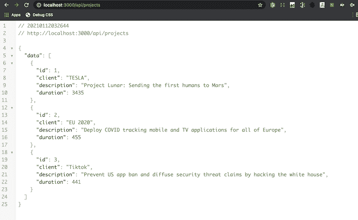

现在我们要做的就是让前端调用这个 API 端点。

在`pages`目录中，添加一个新的`Projects`文件夹。继续将以下内容粘贴到这个文件夹的`projects.tsx`中。别担心，我会解释重要的部分。

```
import {
  Thead,
  Tbody,
  Table,
  Tr,
  Th,
  Td,
  Heading,
  TableCaption,
  Box,
} from "@chakra-ui/react";
import { useState, useEffect } from "react";

export const Projects = () => {
  const [projects, setProjects] = useState([]);

  useEffect(() => {
    const fetchData = async () =>
      await fetch("/api/projects")
        .then((res) => res.json())
        .then(({ data }) => setProjects(data));

    fetchData();
  }, []);

  return (
    <Box
      flex="1.5"
      p={[10, 10, 20, 20]}
      minH="100vh"
      bg="linear-gradient(180.1deg, #CCD0E7 69.99%, rgba(144, 148, 180, 0.73) 99.96%)"
    >
      <Heading textStyle="h1"> Past Projects</Heading>

      <Table size="sm" my={10}>
        <TableCaption>Mere mortals can't achieve what I have </TableCaption>
        <Thead>
          <Tr>
            <Th>Client</Th>
            <Th>Description</Th>
            <Th isNumeric>Hours spent</Th>
          </Tr>
        </Thead>
        <Tbody>
          {projects.map((project) => (
            <Tr key={project.id}>
              <Td>{project.client}</Td>
              <Td>{project.description}</Td>
              <Td isNumeric>{project.duration}</Td>
            </Tr>
          ))}
        </Tbody>
      </Table>
    </Box>
  );
};

```

这里最重要的是数据获取逻辑:

```
const [projects, setProjects] = useState([]);

  useEffect(() => {
    const fetchData = async () =>
      await fetch("/api/projects")
        .then((res) => res.json())
        .then(({ data }) => setProjects(data));

    fetchData();
  }, []);

```

注意这个 URL 叫做:`/api/projects`。Zero 支持另一种适合 SSR 的数据获取形式，但是这里的例子显示的是客户端数据获取。

现在要链接到`Projects`页面，我们只需要编辑主页上的`Button`就可以链接到这个页面。

```
// client/pages/Home/Home.tsx
// add as and href props to the button. 
... 
<Button
   as="a"
   href="/projects"
   ...
>
    See past projects
</Button>

```

现在你应该有这个:

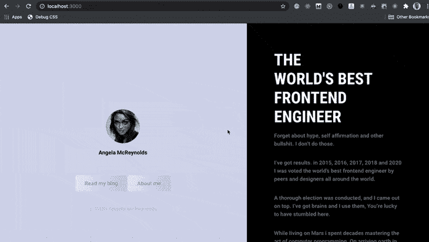

### 查询参数

我们现在拥有的节点后端是真正的基础。但是 Zero 支持更多。例如，我们可以在 API 函数中通过从`req.body`检索来处理从前端发送的查询参数:

```
// api/projects.ts

module.exports = function (req, res) {
  const {id} = req.query.id 
  res.send({ data: PROJECTS });
};

// frontend call e.g. /api/projects?id=1

```

### GET 以外的 HTTP 方法

值得一提的是，您导出的 API 函数将被其他 HTTP 方法调用。例如，POST、PUT、PATCH 和 DELETE 方法。这些必须特别处理。例如，`req.body`将填充通过开机自检请求发送的数据。

### 全局 API 端点配置

与前端实现一样，默认情况下，零不提供任何全局配置选项。后端的一个常见用例是通过中间件集中逻辑。这是一种常见的 [E](https://expressjs.com/en/guide/using-middleware.html) [随心图案](https://expressjs.com/en/guide/using-middleware.html)。

推荐的方法是将所有中间件移动到一个中心目录或文件，例如前面创建的`server`目录。

下面是一个中间件示例:

```
// server/middleware.ts

const corsMiddleware = (req, res, next) => {
  res.header("Access-Control-Allow-Origin", "*");
  res.header(
    "Access-Control-Allow-Headers",
    "Origin, X-Requested-With, Content-Type, Accept"
  );
  next(); 
};

```

注意这个调用`next()`。像 Express 一样，这确保了链中的下一个中间件被调用。

当您有不止一个中间件时，集中化的好处就来了。

```
//server/middleware.ts

// middleware 2 
const basicLoggerMiddleware = function(req, res, next) {
  console.log("method", req.method);
  next();
};

```

现在，我们不再单独导出每个中间件，而是集中调用每个中间件，然后传递任何处理程序:

```
// server/middleware.ts
module.exports = (req, res, handler) => {
  basicLoggerMiddleware(req, res, () => {
    corsMiddleware(req, res, () => {
      handler(req, res);
    });
  });
};

```

然后您可以调用您的处理程序中的中间件，例如`api/projects.ts`:

```
const middleware = require("./server/middleware");

const handler = (req, res) => {
    res.send({data: PROJECTS});
  }

module.exports = (req, res) =>
  middleware(req, res, handler);

```

我同意，这不是最好的解决方案。

## 结论

这些是零成本构建全栈应用的基础。我强烈建议查看官方文件中我可能没有在本文中提到的案例。

Zero 的前提尤其令人印象深刻，主要是因为前端和后端支持不同的文件格式——React、Vue、Svelte，一直到 Python。

然而，要使它被广泛采用，尤其是在生产案例中，还有很多工作要做。你可能会注意到一些快速下降的趋势，包括:

*   缓慢的编译时间
*   较差的错误处理，例如，如果您使用命名导出，而不是默认导出，浏览器会一直加载
*   正如文章中提到的，对全球违约的处理不力
*   操作系统支持差。这个项目已经几个月没有收到任何合理的更新了；无数的问题也没有得到解答

无论如何，我必须说它是一个潜在的伟大的库，巧妙的处理了“简单”的 web 开发。好在它是开源的，所以像我和你这样有动力的人可以贡献力量来改进它——如果我们有时间的话。

## [LogRocket](https://lp.logrocket.com/blg/react-signup-general) :全面了解您的生产 React 应用

调试 React 应用程序可能很困难，尤其是当用户遇到难以重现的问题时。如果您对监视和跟踪 Redux 状态、自动显示 JavaScript 错误以及跟踪缓慢的网络请求和组件加载时间感兴趣，

[try LogRocket](https://lp.logrocket.com/blg/react-signup-general)

.

[ ](https://lp.logrocket.com/blg/react-signup-general) [](https://lp.logrocket.com/blg/react-signup-general) 

LogRocket 结合了会话回放、产品分析和错误跟踪，使软件团队能够创建理想的 web 和移动产品体验。这对你来说意味着什么？

LogRocket 不是猜测错误发生的原因，也不是要求用户提供截图和日志转储，而是让您回放问题，就像它们发生在您自己的浏览器中一样，以快速了解哪里出错了。

不再有嘈杂的警报。智能错误跟踪允许您对问题进行分类，然后从中学习。获得有影响的用户问题的通知，而不是误报。警报越少，有用的信号越多。

LogRocket Redux 中间件包为您的用户会话增加了一层额外的可见性。LogRocket 记录 Redux 存储中的所有操作和状态。

现代化您调试 React 应用的方式— [开始免费监控](https://lp.logrocket.com/blg/react-signup-general)。