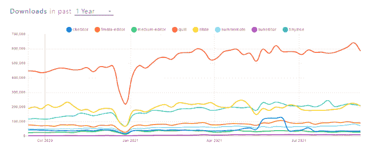
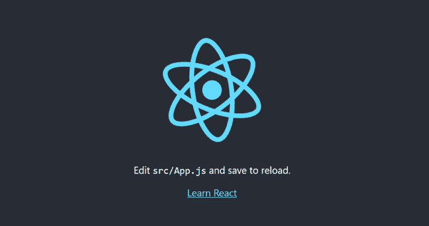

# 使用 Quill 创建一个所见即所得的文本编辑器

> 原文：<https://blog.logrocket.com/build-a-wysiwyg-text-editor-using-quill/>

无论是撰写评论、撰写博客文章，还是撰写高级文章，一个配置良好、性能卓越的文本编辑器始终是高效工作和良好用户体验的基石之一。

## 奎尔是什么？

web 开发人员中最受欢迎的选择之一是 [Quill](https://quilljs.com/) ，这是一个基于 WYSIWYG(所见即所得)原则的富文本编辑器，这意味着用户可以在编辑内容的同时预览其最终外观。

用户选择 Quill 的一些主要原因是它的易用性、定制选项、令人敬畏的[文档](https://quilljs.com/docs/quickstart/)，以及它是[开源的事实](https://github.com/quilljs/quill)。

下面的 [npm 趋势](https://www.npmtrends.com/)流行图显示了去年 Quill 和其他所见即所得文本编辑器的下载统计数据:



今天，我们将使用[羽毛笔](https://quilljs.com)在 [React](https://reactjs.org) 中构建一个所见即所得的文本编辑器。


在本教程结束时，您将拥有一个功能齐全的文本编辑器，它具有文本格式选项和对编辑器内容的完全访问权。

## 在 React 中初始化工作区

首先，让我们使用 [Create React App](https://create-react-app.dev/) 设置一个 React 应用程序，它不需要任何设置，只需一分钟就可以创建一个完全正常工作的 React 样板文件。

打开您的终端并运行以下命令:

```
npx create-react-app react-quill-editor
```

之后，通过运行以下命令，将工作目录更改为新创建的项目文件夹:

```
cd react-quill-editor
```

然后通过运行以下命令启动 React 应用程序:

```
npm start
```

您的浏览器窗口应该会自动打开，您应该会看到如下所示的默认模板:



回到项目文件文件夹，我们有一些我们不需要的文件。

找到`src`文件夹，删除除了`App.js`和`index.js`之外的所有内容，前者将包含编辑器的主要逻辑，后者将编辑器呈现到 DOM 中。

## 设置文本编辑器

首先，安装`react-quill`包，它是围绕 Quill 的 React 包装器。为此，请在终端中运行以下命令:

```
`npm i react-quill`
```

安装完成后，打开`App.js`文件，导入`ReactQuill`组件，并将其包含到`App`中，如下图所示:

```
javascript
import ReactQuill from 'react-quill';
import 'react-quill/dist/quill.snow.css';

const App = () => {
    return (
        <ReactQuill theme="snow"/>
    )
}

export default App;

```

要将应用程序渲染到 DOM，请确保您的`index.js`如下所示:

```
javascript
import  React  from  "react";
import  ReactDOM  from  "react-dom";

import  App  from  "./App";

ReactDOM.render(
    <React.StrictMode>
        <App  />
    </React.StrictMode>,
    document.getElementById("root")
);

```

现在打开浏览器窗口。如果您的 React 应用程序仍在运行，您将看到基本编辑器已经呈现:


注意，出于演示的目的，我添加了一些来自 [Lorem Ipsum](https://www.lipsum.com/) 的虚拟文本。

## 在鹅毛笔中选取主题

Quill 有几个内置的主题。第一个是一个干净而扁平的工具栏主题，名为“雪”，我们已经使用过，并被广泛认为是羽毛笔的标准外观。

“雪”主题包括工具栏选项，如`h1`、 `h2`、`h3`、`bold`、`italic`和`underline`。还有一个添加链接和创建有序和无序项目列表的选项。

第二个叫做“泡沫”这是一个基于工具提示的主题，让人想起了 [Medium 的](https://medium.com)标准文本编辑器。

设置与前面的主题相同，只是您导入了不同的样式表并为`theme`属性设置了不同的值，如下所示:

```
javascript
import ReactQuill from 'react-quill';
import 'react-quill/dist/quill.bubble.css';

const App = () => {
    return (
        <ReactQuill theme="bubble"/>
    )
}

export default App;
```

下面是工具提示主题的外观:


主题包括`bold`、`italic`、`h1`、`h2`等选项，还有一个添加链接和创建报价的选项。

在本教程中，我们将坚持标准的主题，“雪”。

## 在 Quill 中选择工具栏选项

Quill 允许用户控制使用哪些工具栏功能。受支持的选项可以按照它们在编辑器中的显示方式来划分——作为内联、块或嵌入元素。

有关可用选项的完整列表，请参见下表:

| 类型 | [计]选项 |
| 在一条直线上的 | `font`、`size`、`background`、`color`、`bold`、`italic`、`script`、`strike`、`underline`、`link`、`code` |
| 街区 | `header`、`list`、`blockquote`、`direction`、`indent`、`align`、`codeblock` |
| 把…嵌入 | `image`，`video` |

工具栏通过`toolbar`模块进行配置。

```
javascript
import ReactQuill from 'react-quill';
import 'react-quill/dist/quill.snow.css';

const modules = {
    toolbar: [
        // options here
    ]
}

const App = () => {
    return (
        <ReactQuill modules={modules} theme="snow"/>
    )
}

export default App;
```

可用的功能可以通过嵌套数组进行分组。这将在 UI 中的组之间添加一个空格。

```
javascript
const modules = {
    toolbar: [
        ["font", "header"], ["bold", "underline"],
    ]
}

```

此外，您可以通过提供对象键的类型来自定义按钮。

您可以为`script`(“sub”和“super”)、`list`(“ordered”和“bullet”)和`indent`(“+1”和“-1”)提供类型。

类似地，您可以对下拉列表进行同样的操作，只是所有的值都必须以数组的形式提供。您可以将它用于`heading`，在这里您可以提供值`1`到`6`。

```
javascript
const modules = {
    toolbar: [
        { script:  "sub"  }, // custom button
        { header:  [1, 2, 3]  }, // custom dropdown
    ]
}
```

要使用选项`font`、`color`和`background`的默认值，将键值设置为空数组，如下所示:

```
javascript
const modules = {
    toolbar: [
        { color: [] }, 
    ]
}
```

让我们结合以上所学，创建一个富文本编辑器，它具有用户创建内容可能需要的所有功能:

```
javascript
import  ReactQuill  from  "react-quill";
import  "react-quill/dist/quill.snow.css";

const  modules  = {
    toolbar: [
        [{ font: [] }],
        [{ header: [1, 2, 3, 4, 5, 6, false] }],
        ["bold", "italic", "underline", "strike"],
        [{ color: [] }, { background: [] }],
        [{ script:  "sub" }, { script:  "super" }],
        ["blockquote", "code-block"],
        [{ list:  "ordered" }, { list:  "bullet" }],
        [{ indent:  "-1" }, { indent:  "+1" }, { align: [] }],
        ["link", "image", "video"],
        ["clean"],
    ],
};

const  App  = () => {
    return  <ReactQuill  modules={modules} theme="snow" placeholder="Content goes here..."  />;
};

export  default  App;
```

注意，我们还为`ReactQuill`组件设置了一个占位符道具，它通过突出显示内容应该在的位置来改善整体 UI。

如果我们再次检查浏览器，现在我们有一个功能丰富的文本编辑器，如下所示:


## 使用编辑器状态

为了实际使用这些内容(比如将它发布到数据库中)，我们首先需要访问它。为此，我们将使用 React 内置的`useState`钩子。

首先，将其导入到`App.js`文件的最顶端:

```
javascript
import {useState} from 'react'
```

然后，在`App`组件中，创建一个`value`变量来保存编辑器的内容，并将值设置为一个空字符串。

```
javascript
const [value, setValue] =  useState("");
```

最后，将`setValue`函数设置为`ReactQuill`组件中的`onChange`事件处理程序，这样每次编辑器发生变化时`value`都会得到更新。

* * *

### 更多来自 LogRocket 的精彩文章:

* * *

```
javascript
<ReactQuill  modules={modules} theme="snow" onChange={setValue} placeholder="Content goes here..."  />;
```

我们还将在`App`组件中添加`console.log(value)`,这样更容易测试值是否按预期更新。

如果您继续操作，您的`App.js`文件现在应该是这样的:

```
javascript
import { useState } from  "react";
import  ReactQuill  from  "react-quill";
import  "react-quill/dist/quill.snow.css";

const  modules  = {
    toolbar: [
        [{ font: [] }],
        [{ header: [1, 2, 3, 4, 5, 6, false] }],
        ["bold", "italic", "underline", "strike"],
        [{ color: [] }, { background: [] }],
        [{ script:  "sub" }, { script:  "super" }],
        ["blockquote", "code-block"],
        [{ list:  "ordered" }, { list:  "bullet" }],
        [{ indent:  "-1" }, { indent:  "+1" }, { align: [] }],
        ["link", "image", "video"],
        ["clean"],
    ],
};

const  App  = () => {
    const [value, setValue] =  useState("");
    console.log(value);

    return  <ReactQuill  modules={modules} theme="snow" onChange={setValue} placeholder="Content goes here..." />;
};

export  default  App;
```

现在检查你的浏览器并打开**开发者工具**。你可以通过浏览器设置或按键盘上的`F12`键来完成。一旦**开发者工具**打开，切换到**控制台**标签。

现在尝试在编辑器中键入一些内容，并使用一些样式选项。正如你所看到的，每次有更新时，`value`都会被打印在控制台上，这意味着你可以在任何需要的时候访问它。


打印出来的值是一个由 HTML 语法表示的编辑器内容组成的`string`。

可以通过在`App`组件中添加`console.log(typeof value)`来测试。字符串格式允许您在以后处理和存储内容。

## 结论

恭喜你，你已经在 React 中创建了一个功能齐全的文本编辑器！这应该涵盖了内容创作者的大部分需求。

下次你在为所见即所得编辑器寻找一个可靠的解决方案时，不要再看 Quill 了。它很容易设置，非常灵活，开发人员可以完全使用编辑器的特性。

## 使用 LogRocket 消除传统反应错误报告的噪音

[LogRocket](https://lp.logrocket.com/blg/react-signup-issue-free)

是一款 React analytics 解决方案，可保护您免受数百个误报错误警报的影响，只针对少数真正重要的项目。LogRocket 告诉您 React 应用程序中实际影响用户的最具影响力的 bug 和 UX 问题。

[ ](https://lp.logrocket.com/blg/react-signup-general) [  ](https://lp.logrocket.com/blg/react-signup-general) [LogRocket](https://lp.logrocket.com/blg/react-signup-issue-free)

自动聚合客户端错误、反应错误边界、还原状态、缓慢的组件加载时间、JS 异常、前端性能指标和用户交互。然后，LogRocket 使用机器学习来通知您影响大多数用户的最具影响力的问题，并提供您修复它所需的上下文。

关注重要的 React bug—[今天就试试 LogRocket】。](https://lp.logrocket.com/blg/react-signup-issue-free)