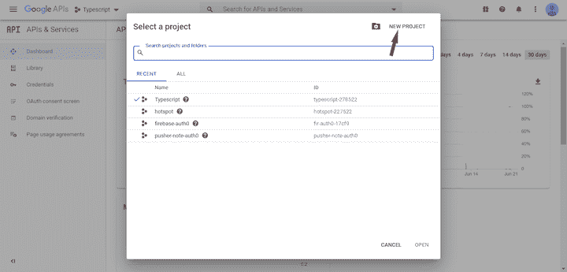
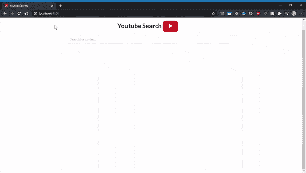

# 用 Angular 和 RxJS 搭建一个 YouTube 视频搜索 app

> 原文：<https://blog.logrocket.com/build-a-youtube-video-search-app-with-angular-and-rxjs/>

在本教程中，我们将演示如何使用 Angular 和 RxJS 构建一个 YouTube 视频搜索应用程序。我们将通过构建一个单页面应用程序来实现这一点，该应用程序通过向 YouTube 搜索 API 传递搜索查询和其他参数来从 YouTube 检索视频列表。

我们将使用以下工具来构建我们的应用程序。

*   [TypeScript](https://www.typescriptlang.org/) ，一个 JavaScript 的类型化超集，它编译成普通 JavaScript 并为 JavaScript 代码提供类型功能
*   [Angular](https://angular.io/) ，一个 JavaScript 框架，允许你创建高效复杂的单页面应用程序
*   [RxJS](https://rxjs-dev.firebaseapp.com/) ，一个通过使用可观察序列来组成异步和基于事件的程序的库。把 RxJS 想象成 Lodash，但是对于事件

您应该对这些工具的工作原理有一个基本的了解，以便跟随本教程。我们将介绍如何一起使用这些工具来构建一个真实的应用程序。随着您的深入，您将对它们提供的核心概念和特性有实际的了解。

你可以在这个 [GitHub 库](https://github.com/devgson/angular-youtube-search)中找到最终的代码。

## 先决条件

您需要安装某些库来在本地构建这个项目。确保您已经安装了[节点包](https://nodejs.org/en/download/)。

我们将使用 [Angular CLI v6.0.0](https://angular.io/cli#installing-angular-cli) 来生成项目，因此您最好安装该版本，以避免以后出现奇怪的错误。

## 项目设置

### 1.构建应用程序

在我们开始编写代码之前，让我们将应用程序中要实现的特性概念化，并确定我们需要的必要组件。

我们会尽可能简单。在核心，我们需要有一个输入元素，允许用户输入搜索查询。该值将被发送给一个服务，该服务使用它来构建一个 URL 并与 YouTube 的搜索 API 进行通信。如果调用成功，它将返回一个视频列表，然后我们可以在页面上呈现。

我们可以有三个核心组件和一个服务:一个名为`search-input`的组件用于输入元素，一个名为`search-list`的组件用于呈现视频列表，一个名为`search-container`的父组件用于呈现`search-input`和`search-list`组件。

然后我们会有一个叫做`search.service`的服务。你可以把服务想象成[数据访问层(DAL)](https://en.wikipedia.org/wiki/Data_access_layer) ，在那里我们将实现所有相关的功能，使我们能够与 YouTube 搜索 API 通信并处理后续的响应。

总之，将有三个组成部分:

*   `search-container`
*   `search-input`
*   `search-list`

`search-input`和`search-list`组件将是无状态的，而`search-container`将是有状态的。[无状态](https://ultimatecourses.com/blog/stateful-stateless-components#stateful)表示组件从不直接改变状态，而有状态表示它在内存中存储关于应用状态的信息，并且有能力直接改变/改变它。

我们的应用还将包括一项服务:

现在让我们深入到技术方面并设置环境。

### 2.设置 YouTube 搜索 API

我们需要根据输入到 input 元素中的任何值来获取 YouTube 视频列表。幸运的是，YouTube 提供了一种方法，允许我们通过使用 YouTube 搜索 API 来做到这一点。要访问 API，您需要注册一个 API 令牌。

首先，如果你还没有，你需要[注册一个谷歌账户](https://www.google.com/accounts/NewAccount)。完成后，前往谷歌[开发者控制台](https://console.developers.google.com/?pli=1)创建一个新项目。



成功创建项目后，按照下面的步骤获取一个 API 令牌。

1.  点击侧边栏菜单上的`Credentials`,导航至凭证页面
2.  点击位于页面顶部的`+ CREATE CREDENTIALS`按钮，并选择`API key.`应该会创建一个新的 API 密钥。复制该密钥并将其存储在某个安全的地方(我们稍后将讨论它)
3.  点击侧边栏顶部的`APIs & Services`,进入 API 和服务页面
4.  点击页面顶部的`ENABLE APIs AND SERVICES`。您将被重定向到一个新页面。搜索 YouTube 数据 API 并点击`Youtube Data API v3`选项。您将再次被重定向到另一个页面。点击`Enable`以允许访问该 API

完成后，我们就可以开始构建应用程序和必要的组件了。

### 3.搭建应用程序

为应用程序创建一个目录。从您的终端，转到系统上合适的位置，发出以下命令。

```
# generate a new Angular project
ng new youtube-search   `

# move into it 
cd youtube-search

```

这使用 Angular CLI 生成一个名为`youtube-search`的新项目。没有必要运行`npm install`,因为它会自动安装所有必要的包并建立一个合理的结构。

在整个教程中，我们将使用 Angular CLI 来创建我们的组件、服务和所有其他必要的文件。

## 构建应用程序

### 1.设置搜索服务

在我们构建搜索服务之前，让我们创建文件夹结构。我们将建立一个包含所有必要服务、模型等的`shared`模块。

确保您在项目目录中，并通过运行以下命令导航到`app`文件夹。

```
cd src/app

```

通过在终端中运行以下命令，创建一个名为`shared`的新模块。

```
ng generate module shared

```

这将创建一个名为`shared`的新文件夹，其中包含一个`shared.module.ts`文件。

现在我们已经设置好了模块，让我们在`shared`文件夹中创建我们的服务。在终端中运行以下命令。

* * *

### 更多来自 LogRocket 的精彩文章:

* * *

```
ng generate service shared/services/search

```

这应该会在`shared/services`文件夹中创建一个`search.service.ts`文件。

将以下代码粘贴到`search.service.ts`文件中。我们将独立检查每个代码块。

```
// search.service.ts

import { Injectable } from '@angular/core';
import { HttpClient } from '@angular/common/http';

import { map } from 'rxjs/operators';
import { Observable } from 'rxjs';

@Injectable({
  providedIn: 'root'
})
export class SearchService {

  private API_URL = 'https://www.googleapis.com/youtube/v3/search';
  private API_TOKEN = 'YOUR_API_TOKEN';

  constructor(private http: HttpClient) {}

  getVideos(query: string): Observable <any> {
    const url = `${this.API_URL}?q=${query}&key=${this.API_TOKEN}&part=snippet&type=video&maxResults=10`;
    return this.http.get(url)
      .pipe(
        map((response: any) => response.items)
      );
  }
}

```

首先，看看下面的代码块。

```
import { Injectable } from '@angular/core';
import { HttpClient } from '@angular/common/http';

import { map } from 'rxjs/operators';
import { Observable } from 'rxjs';

@Injectable({
  providedIn: 'root'
})

[...]

```

在代码的第一部分，我们简单地导入必要的文件来帮助我们构建服务。`map`是一个 RxJS 操作符，用于修改从 API 调用收到的响应。`HttpClient`提供了必要的 HTTP 方法。

`@Injectable()`是 Angular 提供的一个装饰器，它将位于其正下方的类标记为可以注入的服务。`{ providedIn: 'root'}`表示服务是在 Angular app 的根组件中提供的，在本例中是`app`组件。

让我们看看下一个部分:

```
[...]

export class SearchService {

  private API_URL = 'https://www.googleapis.com/youtube/v3/search';
  private API_TOKEN = 'YOUR_API_KEY';

  constructor(private http: HttpClient) {}

  getVideos(query: string): Observable <any> {
    const url = `${this.API_URL}?q=${query}&key=${this.API_KEY}&part=snippet&type=video&maxResults=10`;
    return this.http.get(url)
      .pipe(
        map((response: any) => response.items)
      );
  }
}

```

这里有两个私有变量。用创建新凭证时获得的 API 令牌替换`API_KEY`的值。

最后，`getVideos`方法接收从输入组件传入的搜索查询字符串，我们还没有创建它。然后，它使用`http` get 方法向构造的 URL 发送一个请求。它返回一个我们用`map`操作符处理的响应。YouTube 视频详细信息的列表应该位于`response.items`对象中，因为我们只是对它感兴趣，所以我们可以选择返回它并丢弃其他部分。

由于搜索服务使用 HTTP 客户端，我们必须将 HTTP 模块导入到提供服务的根组件中。转到位于`app`文件夹中的`app.module.ts`文件，粘贴以下代码。

```
import { BrowserModule } from '@angular/platform-browser';
import { NgModule } from '@angular/core';

import { AppComponent } from './app.component';
import { HttpClientModule } from '@angular/common/http';

@NgModule({
  declarations: [
    AppComponent
  ],
  imports: [
    HttpClientModule,
    BrowserModule
  ],
  providers: [],
  bootstrap: [AppComponent]
})
export class AppModule { }

```

这就是搜索服务的基本内容。我们很快就会用到它。

### 2.添加视频接口文件

让我们快速建立一个`interface`文件。TypeScript 接口允许我们定义任何实体都必须遵守的语法。在这种情况下，我们希望定义从 Youtube 搜索 API 检索的每个视频对象应该包含的某些属性。我们将在`shared`模块下的`models`文件夹中创建这个文件。

在您的终端中运行以下命令。

```
ng generate interface shared/models/search interface

```

这应该会创建一个`search.interface.ts`文件。复制下面的代码并粘贴到那里。

```
export interface Video {
  videoId: string;
  videoUrl: string;
  channelId: string;
  channelUrl: string;
  channelTitle: string;
  title: string;
  publishedAt: Date;
  description: string;
  thumbnail: string;
}

```

接口是 TypeScript 提供的众多功能之一。如果你不熟悉接口是如何工作的，去看看 [TypeScript 文档](https://www.typescriptlang.org/docs/handbook/interfaces.html)。

## 设置样式表

我们将使用 Semantic-UI 为我们的应用程序提供样式，所以让我们快速添加它。

转到项目的`src`文件夹，检查`index.html`文件，并将下面的代码粘贴到 Head 标签中。

```
  <link rel="stylesheet" type="text/css" href="https://cdn.jsdelivr.net/npm/[email protected]/dist/semantic.min.css">

```

您的`index.html`文件应该如下所示:

```
<!doctype html>
<html lang="en">
<head>
  <meta charset="utf-8">
  <title>YoutubeSearch</title>
  <base href="/">

  <meta name="viewport" content="width=device-width, initial-scale=1">
  <!-- Added Semantic Ui stylesheet -->
  <link rel="stylesheet" type="text/css" href="https://cdn.jsdelivr.net/npm/[email protected]/dist/semantic.min.css">
  <link rel="icon" type="image/x-icon" href="favicon.ico">
</head>
<body>
  <app-root></app-root>
</body>
</html>

```

## 设置无状态组件

### 1.开发搜索输入组件

下一步是设置无状态组件。我们将首先创建`search-input`组件。如前所述，该组件将包含与处理用户输入相关的所有内容。

所有无状态组件都将在`components`文件夹中。在运行下面的命令之前，确保您在终端的`app`目录中。

```
ng generate component search/components/search-input

```

这就创建了一个`search-input`组件。使用 Angular 的 CLI 生成组件的好处在于，它可以创建必要的文件并设置所有样板代码，这减轻了设置过程中的压力。

将以下 HTML 代码添加到`search-input.html`文件中。这只是使用语义 UI 的基本 HTML 代码和样式:

```
<div class="ui four column grid">
  <div class="ten wide column centered">
    <div class="ui fluid action input">
      <input
        #input
        type="text"
        placeholder="Search for a video...">
    </div>
  </div>
</div>

```

注意添加到输入元素的`#input`行。这被称为模板引用变量，因为它提供了对输入元素的引用，并允许我们直接从组件中访问元素。

在我们开始处理组件文件之前，在输入端有一些事情要处理:

*   在 input 元素上设置一个事件监听器来监视用户输入的任何内容
*   确保键入的值的长度大于三个字符
*   响应每一次击键是违反直觉的，所以我们需要给用户足够的时间在处理之前输入他们的值(例如，在用户停止输入之后等待 500 毫秒，然后再检索值)
*   请确保当前键入的值不同于上一个值。否则，处理它也没有用

这就是 RxJS 发挥作用的地方。它提供了称为操作符的方法，帮助我们无缝地实现这些功能/用例。

接下来，在`search-input.component.ts`文件中添加以下代码。

```
// search-input.component.ts

import { Component, AfterViewInit, ViewChild, ElementRef, Output, EventEmitter } from '@angular/core';
import { fromEvent } from 'rxjs';
import { debounceTime, pluck, distinctUntilChanged, filter, map } from 'rxjs/operators';

@Component({
  selector: 'app-search-input',
  templateUrl: './search-input.component.html',
  styleUrls: ['./search-input.component.css']
})
export class SearchInputComponent implements AfterViewInit {

  @ViewChild('input') inputElement: ElementRef;
  @Output() search: EventEmitter<string> = new EventEmitter<string>();

  constructor() { }

  ngAfterViewInit() {
    fromEvent(this.inputElement.nativeElement, 'keyup')
      .pipe(
        debounceTime(500),
        pluck('target', 'value'),
        distinctUntilChanged(),
        filter((value: string) => value.length > 3),
        map((value) => value)
      )
      .subscribe(value => {
        this.search.emit(value);
      });
  }

}

```

让我们来看看上面文件中的几行。

*   `ViewChild('input')`允许我们访问之前在 HTML 文件中定义的输入元素。`'input'`是一个选择器，它引用我们之前添加到 HTML 文件的 input 元素中的`#input`模板引用变量
*   `ngAfterViewInit`是一个[生命周期钩子](https://angular.io/guide/lifecycle-hooks)，它在视图初始化后被调用。在这里，我们设置了所有处理输入元素的代码。这确保了视图已经被初始化，我们可以访问输入元素，从而避免以后任何不必要的错误

现在让我们看看在`ngAfterViewInit`方法中找到的那部分代码。

*   `fromEvent`操作符用于在特定元素上设置事件监听器。在这种情况下，我们感兴趣的是监听输入元素上的`keyup`事件
*   操作符帮助我们控制用户输入的速度。我们可以决定只在用户停止输入一段时间后获取值，在本例中是 500 毫秒
*   我们使用`pluck('target','value')`从输入对象中获取 value 属性。这相当于`input.target.value`
*   `distinctUntilChanged()`确保当前值不同于上一个值。否则，它会丢弃它。
*   我们使用`filter()`操作符来检查并丢弃少于三个字符的值
*   `map` 运算符以 `Observable`的形式返回值。这个允许我们订阅它，在这种情况下，可以使用我们定义的`Output`事件发射器将值发送给父组件(我们还没有定义)。

`search-input`组件到此为止。我们看到了 RxJS 在帮助我们实现某些功能方面有多么强大。

### 2.开发搜索列表组件

现在是时候设置`search-list`组件了。提醒一下，这个组件所做的只是从父组件接收一个视频列表，并在视图中呈现它。

因为这也是一个无状态组件，我们将在与`search-input`组件相同的文件夹中创建它。从我们在终端中离开的地方，继续运行下面的命令。

```
ng generate component search/components/search-list

```

然后转到创建的`search-list.component.ts`文件，将下面的代码粘贴到那里。

```
// search-list.component.ts

import { Component, OnInit, Input } from '@angular/core';
import { Video } from '../../../shared/models/search.interface';

@Component({
  selector: 'app-search-list',
  templateUrl: './search-list.component.html',
  styleUrls: ['./search-list.component.css']
})
export class SearchListComponent implements OnInit {

  @Input() videos: Video[];

  constructor() { }

  ngOnInit() {
  }
}

```

上面的文件相当简单。它所做的只是接收和存储来自父组件的视频数组。

我们来看看 HTML 代码，切换到`search-input.html`文件，粘贴下面的代码。

```
<div class="ui four column grid">
  <div class="column" *ngFor="let video of videos">
    <div class="ui card">
      <div class="image">
        
      </div>
      <div class="content">
        <a class="header" style="margin: 1em 0 1em 0;">{{ video.title }}</a>
        <div class="meta">
          <span class="date" style="font-weight: bolder;">
            <a [href]="video.channelUrl" target="_blank">{{ video.channelTitle }}</a>
          </span>
          <span class="ui right floated date" style="font-weight: bolder;">{{ video.publishedAt | date:'mediumDate' }}</span>
        </div>
        <div class="description">
          {{ video.description?.slice(0,50) }}...
        </div>
      </div>
      <a [href]="video.videoUrl" target="_blank" class="extra content">
        <button class="ui right floated tiny red right labeled icon button">
          <i class="external alternate icon"></i>
          Watch
        </button>
      </a>
    </div>
  </div>
</div>

```

在上面的文件中，我们简单地遍历组件中的视频数组，并分别渲染它们，这是使用上面一行中的`*ngFor`指令完成的:

```
<div class="column" *ngFor="let video of videos">

```

## 构建有状态组件

让我们创建父组件`search-container`。该组件将直接与搜索服务通信，发送用户输入，然后将响应传递给`search-list`组件进行呈现。

由于`search-container`是一个有状态的组件，我们将在不同于其他两个组件的目录中创建它。

再次在终端中，您应该仍然在`app`目录中。键入以下命令。

```
ng generate component search/container/search-container

```

在我们开始编写代码之前，让我们后退一步，概述一下我们想要实现的目标。该组件应该能够从`search-input`组件获得用户输入。它应该将此传递给搜索服务，搜索服务执行必要的操作并返回预期的结果。结果应该被发送到`search-list`组件，在那里它将被呈现。

要实现这些东西，将下面的代码粘贴到`search-container.component.ts`文件中。

```
// search-container.component.ts

import { Component } from '@angular/core';
import { SearchService } from 'src/app/shared/services/search.service';
import { Video } from 'src/app/shared/models/search.interface';

@Component({
  selector: 'app-search-container',
  templateUrl: './search-container.component.html',
  styleUrls: ['./search-container.component.css']
})
export class SearchContainerComponent {

  inputTouched = false;
  loading = false;
  videos: Video[] = [];

  constructor(private searchService: SearchService) { }

  handleSearch(inputValue: string) {
    this.loading = true;
    this.searchService.getVideos(inputValue)
      .subscribe((items: any) => {
        this.videos = items.map(item => {
          return {
            title: item.snippet.title,
            videoId: item.id.videoId,
            videoUrl: `https://www.youtube.com/watch?v=${item.id.videoId}`,
            channelId: item.snippet.channelId,
            channelUrl: `https://www.youtube.com/channel/${item.snippet.channelId}`,
            channelTitle: item.snippet.channelTitle,
            description: item.snippet.description,
            publishedAt: new Date(item.snippet.publishedAt),
            thumbnail: item.snippet.thumbnails.high.url
          };
        });
        this.inputTouched = true;
        this.loading = false;
      });
  }
}

```

在上面的代码中，`handleSearch`方法接受用户输入作为参数。然后，它与搜索服务中的`getVideos`方法通信，将输入值作为参数传入。

`subscribe`函数调用这个服务调用，来自`getVideos`方法的响应作为`items`参数传递给它。然后，我们可以过滤出所需的必要值，并将其添加到组件的 videos 数组中。

让我们快速处理 HTML，将它粘贴到`search-container.html`中，然后我们将浏览它:

```
<div>
  <app-search-input (search)="handleSearch($event)"></app-search-input>
  <div *ngIf="inputTouched && !videos.length" class="ui four wide column centered grid" style="margin: 3rem;">
    <div class="ui raised aligned segment red warning message">
      <i class="warning icon"></i>
      <span class="ui centered" style="margin: 0 auto;">No Video Found</span>
    </div>
  </div>
  <div *ngIf="loading" style="margin: 3rem;">
    <div class="ui active centered inline loader"></div>
  </div>
  <app-search-list *ngIf="!loading" [videos]="videos"></app-search-list>
</div>

```

在上面的文件中，我们简单地呈现了两个子组件，`search-input`和`search-list`，并向`search-list`组件添加了必要的输入绑定。这用于将从服务中检索到的视频列表发送到组件。我们还监听来自`search-input`组件的事件，该事件触发了前面定义的`handleSearch`功能。

还处理了边缘情况，例如当没有找到视频时进行指示，我们只希望在输入元素被用户触摸后进行处理。`loading`变量也用于向用户表示 API 调用正在进行。

默认情况下，在每个 Angular 应用程序中，都有一个根组件，通常称为`app-root`组件。这是被引导到浏览器中的组件。因此，我们希望添加要在那里呈现的`search-container`组件。`search-container`组件呈现所有其他组件。

打开`app.component.html`文件，粘贴下面的代码。

```
<div class="ui centered grid" style="margin-top: 3rem;">
  <div class="fourteen wide column">
    <h1 class="ui centered aligned header">
      <span style="vertical-align: middle;">Youtube Search </span>
      
    </h1>
    <app-search-container></app-search-container>
  </div>
</div>

```

## 测试应用程序

我们都完了！现在让我们继续测试我们的应用程序。

在您的终端中，运行以下命令来启动应用程序。

```
ng serve

```

您可能会遇到类似于`ERROR in ../../node_modules/rxjs/internal/types.d.ts(81,44): error TS1005: ';' expected.`的错误，这与代码无关，而是与 RxJS 包安装有关。幸运的是，有一个[非常简单明了的解决方案](https://github.com/ReactiveX/rxjs/issues/4540#issuecomment-469290223)可以解决这个问题。

默认情况下，所有的 Angular 应用程序都在`localhost:4200`提供，所以请在浏览器中打开它。它应该是这样的:



结论

## 现在，您应该对如何使用 Angular 和 RxJS 构建 YouTube 视频搜索应用程序有了很好的理解。我们演示了如何通过使用某些核心概念来构建一个简单的应用程序，从而实现这些核心概念。我们还了解了 RxJS 的强大功能，并讨论了它如何使我们能够极其轻松地构建某些功能。

最棒的是，你有一个漂亮的 YouTube 搜索应用程序来解决你的问题。现在，您可以利用获得的知识，通过 YouTube API 实现更复杂的功能。

像用户一样体验 Angular 应用程序

## 调试 Angular 应用程序可能很困难，尤其是当用户遇到难以重现的问题时。如果您对监视和跟踪生产中所有用户的角度状态和动作感兴趣，

.

[try LogRocket](https://lp.logrocket.com/blg/angular-signup)

LogRocket 就像是网络和移动应用程序的 DVR，记录你网站上发生的一切，包括网络请求、JavaScript 错误等等。您可以汇总并报告问题发生时应用程序的状态，而不是猜测问题发生的原因。

[](https://lp.logrocket.com/blg/angular-signup)[https://logrocket.com/signup/](https://lp.logrocket.com/blg/angular-signup)

LogRocket NgRx 插件将角度状态和动作记录到 LogRocket 控制台，为您提供导致错误的环境，以及出现问题时应用程序的状态。

现代化调试 Angular 应用的方式- [开始免费监控](https://lp.logrocket.com/blg/angular-signup)。

Modernize how you debug your Angular apps - [Start monitoring for free](https://lp.logrocket.com/blg/angular-signup).