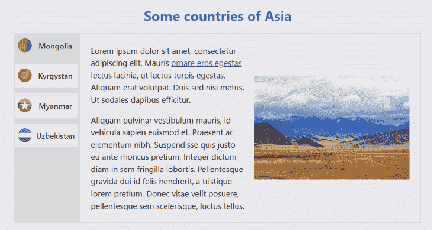
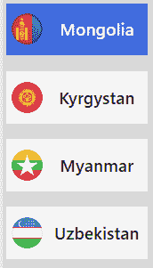
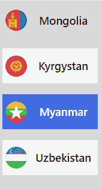
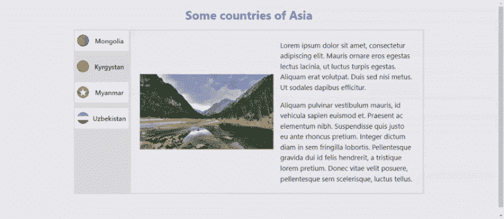
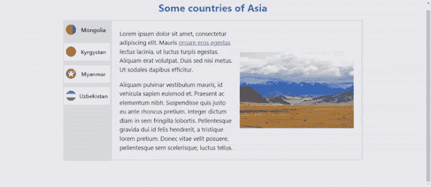
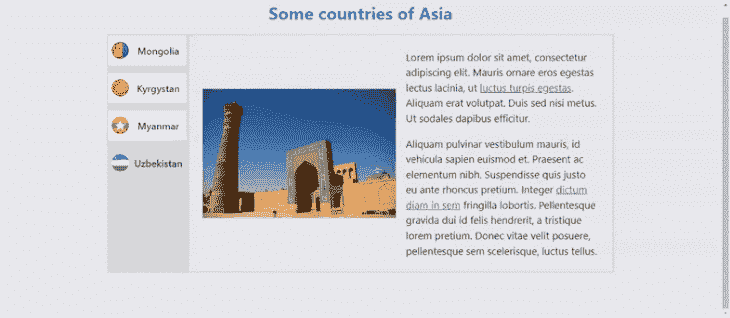

# 在 JavaScript 中构建可访问的用户界面标签

> 原文：<https://blog.logrocket.com/build-accessible-user-interface-tabs-javascript/>

界面标签是一种常见的网站组件，但是开发人员在使这种模式易于访问时经常面临挑战。屏幕阅读器用户在阅读内容时可能会遇到一些问题，依靠键盘浏览站点的用户可能需要一些帮助来使浏览更容易。

本文将涵盖创建可访问的选项卡界面所需的一切，包括构建 HTML 结构、添加 CSS 样式和添加 JavaScript 功能增强。

这是我们将在本教程中构建的选项卡式界面:



A tabbed interface listing different countries. On the left, the tabs are displayed vertically and on the right side, there’s some dummy text and an image for the selected country (in this case, Mongolia).

我们开始吧！

*向前跳转:*

## 建立 HTML 结构

HTML 结构非常重要，因为它为屏幕阅读器用户提供了导航界面所需的上下文。

有两种方法，我们可以使用 HTML 结构来帮助定义哪些元素可以用键盘来关注。我们可以使用基于链接的方法，用`<a>`元素作为 tab 触发器，或者我们可以使用`<button>`元素。

这两种方法都将键盘导航考虑在内，因为它们本身是键盘可聚焦的，但是每种方法都有优点和缺点。我们将在本文中讨论这两种方法。

### 使用`<a>`元素作为选项卡

这种方法的主要优点是我们可以使用`<a>`元素的功能来创建标签的导航效果，只使用 HTML 和 CSS。元素为我们带来了键盘支持，它负责屏幕阅读器用户的焦点管理和导航。

这种方法对于禁用 JavaScript 的用户也很有帮助。我们将在本教程的最后使用 JavaScript 来增强`<a>`元素的一些功能，以达到可访问性的目的。

然而，使用`<a>`元素作为选项卡的一个小缺点是，它会被计入用户的导航历史。换句话说，如果用户访问了所有的标签页，然后想要返回到他们之前的站点，他们将不得不多次按下返回按钮。

尽管如此，这种方法确实考虑到了[渐进增强](https://blog.logrocket.com/understanding-progressive-enhancement/)，因为它以尽可能低的技术提供了最大的标签界面功能。即使 JavaScript 无法加载，CSS 也无法加载，这种方法也能工作，因此值得考虑。

### 使用`<button>`元素作为选项卡

使用`<button>`元素作为标签的好处是不会影响导航历史，让用户更容易返回到他们之前的站点。

然而，这种方法需要对 HTML 进行一些额外的考虑，以隐藏所有非活动的选项卡内容。它还需要一些关于 JavaScript 的额外决策，比如决定如何显示内容、焦点管理策略和一些可访问性增强。

如果您使用这种方法，您需要考虑如果 JavaScript 无法加载到您的站点上会发生什么。没有回退，用户将无法导航您的选项卡式界面。JavaScript 可能无法加载有几个原因。例如，由于跟踪和隐私问题，用户可能禁用了 JavaScript，或者由于外部因素，JavaScript 可能无法加载。

### 创建界面标签结构

决定使用哪种方法后，是时候开始创建 HTML 结构了！

#### 用`<a>`元素方法的 Tab 界面结构

让我们从各个选项卡开始。这里，我们将使用 HTML 结构的`<a>`元素方法:

```
<!-- Tab semantics -->
<ul role="tablist">
  <li role="presentation">
    <a role="tab" href="#panel1" id="tab1">Tab one</a>
  </li>
  <li role="presentation">
    <a role="tab" href="#panel2" id="tab2">Tab two</a>
  </li>
  <li role="presentation">
    <a role="tab" href="#panel3" id="tab3">Tab three</a>
  </li>
  <li role="presentation">
    <a role="tab" href="#panel4" id="tab4">Tab four</a>
  </li>
</ul>

<!-- Tab content semantics -->
<div class="tabpanel-container">
  <section role="tabpanel" id="panel1" aria-labelledby="tab1" tabindex="0"></section>
  <section role="tabpanel" id="panel2" aria-labelledby="tab2" tabindex="0"></section>
  <section role="tabpanel" id="panel3" aria-labelledby="tab3" tabindex="0"></section>
  <section role="tabpanel" id="panel4" aria-labelledby="tab4" tabindex="0"></section>
</div>

```

现在，让我们检查上面代码中显示的结构:

*   归根结底，选项卡列表只是一个链接(或按钮)列表，它将引导我们找到我们的内容，因此选项卡列表的正确语义是用我们在列表项中选择的元素(`<a>`或`<button>`)将它包装在一个`<ul>`元素中
*   我们将`tablist`角色添加到我们的`<ul>`中，为屏幕阅读器用户提供更多的上下文；该角色用于标记包装一组选项卡的容器。由于`tablist`角色没有给子元素标签语义，我们将`tab`角色添加到`<a>`元素中
*   如果屏幕阅读器用户无法读取`tablist`和`tab`角色，HTML 仍然会被读取为链接或按钮的列表，这是一个可接受的后备
*   我们将`presentation`角色添加到`<li>`元素只是为了去除语义；这将有助于防止任何奇怪的交互，同时在特定的屏幕阅读器不支持 ARIA 角色的情况下仍然保持我们的后备
*   我们的选项卡内容将由一个角色为`tabpanel`的`<section>`元素表示。该元素应该使用与选项卡相同的名称作为可访问名称。这就是为什么我们在选项卡中添加了`id`属性，以及为什么我们在选项卡面板中使用它作为带有`aria-labelledby`属性的标签
*   我们将属性`tabindex="0"`添加到选项卡面板，以允许选项卡内的项目(如表单字段、链接或按钮)获得键盘焦点。这将使键盘用户更容易访问内容

#### 用`<button>`元素方法的 Tab 界面结构

如果我们使用基于`<button>`的方法，我们将需要包括一个额外的步骤。我们需要将`hidden`属性添加到除第一个选项卡之外的所有选项卡面板中。该属性将隐藏视力正常的用户和屏幕阅读器用户的元素。为了确保第一个选项卡保持可见，它应该有`aria-selected="true"`属性。

我们对`<button>`方法的标记应该是这样的:

```
<!-- Tab semantics -->
<ul role="tablist">
  <li role="presentation">
    <button role="tab" href="#panel1" id="tab1" aria-selected="true">Tab one</button>
  </li>
  <li role="presentation">
    <button role="tab" href="#panel2" id="tab2">Tab two</button>
  </li>
  <li role="presentation">
    <button role="tab" href="#panel3" id="tab3">Tab three</button>
  </li>
  <li role="presentation">
    <button role="tab" href="#panel4" id="tab4">Tab four</button>
  </li>
</ul>

<!-- Tab content semantics -->
<div class="tabpanel-container">
  <section role="tabpanel" id="panel1" aria-labelledby="tab1" tabindex="0"></section>
  <section role="tabpanel" id="panel2" aria-labelledby="tab2" tabindex="0" hidden></section>
  <section role="tabpanel" id="panel3" aria-labelledby="tab3" tabindex="0" hidden></section>
  <section role="tabpanel" id="panel4" aria-labelledby="tab4" tabindex="0" hidden></section>
</div>

```

### 其他 HTML 结构考虑事项

到目前为止，我们已经讨论了标记的最初考虑，但是对于某些用例，我们还需要记住一些额外的因素。一些因素将被更动态地控制，但是我们将在本文的 JavaScript 部分稍后触及这些因素。

#### 将选项卡与选项卡面板相关联

我们可以使用属性`aria-controls`将选项卡与屏幕阅读器用户的选项卡面板关联起来。然而，这种方法只能在 [JAWS](https://www.freedomscientific.com/products/software/jaws/) 屏幕阅读器上工作，而且它的使用可能会感觉很冗长，[正如 Heydon Pickering](https://heydonworks.com/article/aria-controls-is-poop/#:~:text=We%20need%20to%20talk%20about,technology%20users%20when%20we%20do.) 的文章中所解释的。相反，我们将使用一些焦点管理策略来帮助键盘用户。

#### 处理垂直制表符

要以垂直方向显示标签列表，您需要向容器添加属性`[[aria-orientation="vertical"]](https://developer.mozilla.org/en-US/docs/Web/Accessibility/ARIA/Attributes/aria-orientation)`。这将向屏幕阅读器用户表明标签是垂直堆叠的。

当我们开始讨论标签式界面的导航策略时，这一点很重要。

下面的例子展示了如何在代码片段中使用`[[aria-orientation="vertical"]](https://developer.mozilla.org/en-US/docs/Web/Accessibility/ARIA/Attributes/aria-orientation)`属性:

```
<ul role="tablist" aria-orientation="vertical">
  <li role="presentation">
    <button role="tab" href="#panel1" id="tab1" aria-selected="true">Tab one</button>
  </li>
  <li role="presentation">
    <button role="tab" href="#panel2" id="tab2">Tab two</button>
  </li>
  <li role="presentation">
    <button role="tab" href="#panel3" id="tab3">Tab three</button>
  </li>
  <li role="presentation">
    <button role="tab" href="#panel4" id="tab4">Tab four</button>
  </li>
</ul>

```

#### 指示标签选择

当用户单击某个选项卡时，我们需要一种方式来指示它已被选中。

我们将使用属性`[[aria-selected="true"]](https://developer.mozilla.org/en-US/docs/Web/Accessibility/ARIA/Attributes/aria-selected)`向屏幕阅读器用户指示选项卡选择。然后，我们将使用 CSS 样式来帮助视力正常的用户选择。`[[aria-selected="true"]](https://developer.mozilla.org/en-US/docs/Web/Accessibility/ARIA/Attributes/aria-selected)`属性将随 JavaScript 动态变化，所以它不会被添加到我们的初始标记中。

```
<li role="presentation">
  <button role="tab" href="#panel1" id="tab1" aria-selected="true">Tab one</button>
</li>

```

现在我们有了一个坚实的 HTML 结构，是时候用 CSS 添加一些样式了！

## 用 CSS 添加样式和布局

对于我们的选项卡式界面示例，我们使用基于链接的方法，将`<a>`元素作为选项卡触发器。要设计 HTML 选项卡结构的样式，我们需要添加选项卡导航，创建焦点指示器，并标识所选状态的样式。

#### 添加选项卡导航

要添加选项卡导航，让我们使用`:target`选择器添加一个 CSS 规则，如下所示:

```
.tabpanel:not(:target):not(.visible) {
  display: none;
}

```

`:target`是一个伪类，它检查带有`id`的元素是否匹配 URL 的片段。

因为我们在这里使用了`<a>`元素来添加功能，所以我们可以使用这个选择器来隐藏任何非活动的选项卡面板。在我们的例子中，我们使用`visible`类作为例外，这样我们可以在稍后的中为[添加一些 JavaScript 增强功能。](#handling-the-a-elements-initial-state)

### 创建焦点指示器

我们需要记住的另一件事是键盘导航，在这方面最重要的事情之一是创建一个足够的焦点指示器。

在使用 **tab 键**浏览网站时，你可能已经注意到了一个焦点指示器。根据您的浏览器，将显示为突出显示选定元素的蓝色或黑色轮廓。

浏览器提供了默认的焦点样式，但是它们不足以满足 WCAG 2.2 标准。因此，有必要使用额外的样式。关于如何创建一个好的焦点指示器的更多深入信息，请阅读 [Sara Souiedan 关于这个主题的文章](https://www.sarasoueidan.com/blog/focus-indicators/)。

对于我们的示例，我们将使用以下焦点样式:

```
.tab:focus-visible {
  background-color: royalblue;
  color: whitesmoke;
  outline: 0.2em solid transparent;
}

```

我决定使用`:focus-visible`而不是`:focus`伪类，以便只通过键盘导航激活焦点样式。当元素被点击时,`:focus`伪类也会被激活，这可能会让用户感到困惑。

在现代浏览器中得到很好的支持，所以它不会产生任何冲突。有关该属性的更多信息，请参考 [MDN 文档](https://developer.mozilla.org/en-US/docs/Web/CSS/:focus-visible)。

下面选择的“蒙古”选项显示了我们选项卡的焦点状态:



The first tab in the project tab list has a blue background, providing a visual clue for tab selection to keyboard users.

对于这个项目，我决定使用透明的轮廓。这对 [Windows 高对比度模式](https://support.microsoft.com/en-us/windows/change-color-contrast-in-windows-fedc744c-90ac-69df-aed5-c8a90125e696)很重要。在这种模式下，所有的文本和背景颜色都被替换为操作系统选择的颜色，所以我们不能依赖背景颜色来指示焦点状态。轮廓是指示焦点状态的唯一可靠方式。

### 标识所选状态的样式

现在，让我们回到我之前提到的关于使用`aria-selected="true"`属性来帮助屏幕阅读器用户更容易地识别所选择的选项卡。我们还可以使用这个选择器为选中的选项卡提供视觉提示！

```
.tab[aria-selected="true"] {
  background-color: var(--component-bg);
}

```

由于 CSS 特异性的工作方式，这种方法产生了一个小问题。两个选择器`.tab:focus-visible`和`.tab[aria-selected="true"]`具有相同的特异性级别，并且都改变了`background-color`属性，因此选择器规则的顺序非常关键。

我们希望焦点状态的`background-color`覆盖任何其他的`background-color`，包括选中状态的`background-color`，所以我们将在`.tab[aria-selected="true"]`选择器规则之后添加`.tab:focus-visible`选择器规则。

这是我们的结果。请注意这两种风格是如何相互作用而没有任何特异性问题的:



The first tab in the project tab list is activated and has a gray background, while the third tab is being keyboard focused and has a blue background.

如果你使用`<a>`元素作为你的标签，你已经用最低的技术创建了一个功能标签界面！

如果您使用了基于`<button>`的方法，不要担心！接下来，我们将使用 JavaScript 添加一些功能，这对于使选项卡式界面更易访问至关重要。

## 用 JavaScript 添加增强和功能

在这一节中有很多东西需要解开；让我们先看看《ARIA 创作实践指南》( APG)对这种组件模式有什么看法。下面是艾瑞亚·APG 的标签界面的[模式指南认为对**标签**键、`tabpanel`元素中的`tabindex`键和**箭头**键很重要的内容。](https://www.w3.org/WAI/ARIA/apg/patterns/tabpanel/)

### 管理 tab 键

关于**标签**键的使用，[咏叹调 APG 建议如下](https://www.w3.org/WAI/ARIA/apg/patterns/tabpanel/):

> 当焦点移到选项卡列表中时，将焦点放在活动的`tab`元素上。

我们的第一个任务是用 **tab** 键将键盘导航移至未选中的选项卡，这样当该键被按下时，焦点将直接进入活动的选项卡面板。然后，当从活动面板按下 **shift + tab** 时，焦点返回到其各自的选项卡。此外，我们必须为屏幕阅读器用户和视力正常的用户指示标签选择。

下面是我用来处理这些任务的代码:

```
const TABLIST = document.querySelector("#tablist");
const TABS = [...TABLIST.querySelectorAll(".tab")];

const setSelectedTab = (element) => {
  const selectedId = element.id;

  TABS.forEach((e) => {
    const id = e.getAttribute("id");
    if (id === selectedId) {
      e.removeAttribute("tabindex");
      e.setAttribute("aria-selected", "true");
    } else {
      e.setAttribute("tabindex", "-1");
      e.setAttribute("aria-selected", "false");
    }
  });
};

```

在这里，我们选择所有选项卡并存储被点击的选项卡。然后，我们解析包含所有选项卡的数组，并比较每个`id`属性，检查它是否是被选择的选项卡。

如果选项卡不是我们想要选择的，我们添加`tabindex="-1"`和`aria-selected="false"`属性。然而，如果这个选项卡是我们想要选择的，我们删除`tabindex`属性并添加`aria-selected="true"`属性。默认情况下，`<a>`和`<button>`元素是键盘可聚焦的，所以不需要添加`tabindex="0"`。

`tabindex="-1"`属性将使一个元素不能被**标签**键聚焦。当按键被按下时，它会将焦点直接移动到我们的活动选项卡面板，使我们能够跳转所有的选项卡。这也很重要，因为它还允许我们管理另一个选项卡的焦点，我将在本文稍后的中[演示。](#managing-the-tabindex-in-tabpanel-elements)

现在我们需要做的就是在标签页中添加事件监听器来执行这个功能！对于基于链接的方法，我们需要向这些元素添加一个额外的事件监听器。

使用基于`<button>`的方法，任何点击事件都将被**回车**和**空格**键激活。然而，`<a>`元素只会添加那些带有 **enter** 键的事件，所以我们需要添加一个 keydown 事件监听器来检查 **space** 键何时被按下。

```
const handleClick = () => {
  TABS.forEach((element) => {
    element.addEventListener("click", function () {
      setSelectedTab(element);
    });
  });

  // Activates tab with Space. Only necessary if you use the <a> element as a tab

  TABS.forEach((element) => {
    element.addEventListener("keydown", function (e) {
      if ((e.keyCode || e.which) === 32) {
        setSelectedTab(element);
        element.click();
      }
    });
  });
};

```

这是我们的结果！



Sample project with vertical tab navigation. When the tab key is pressed, it moves the keyboard focus to the tab panel; when shift+tab is pressed, it moves the focus to the selected tab.

### 管理`tabpanel`元素中的`tabindex`

ARIA APG [对标签列表键盘交互](https://www.w3.org/WAI/ARIA/apg/patterns/tabpanel/)提出了以下建议:

> 当选项卡列表包含焦点时，[tab]会将焦点移动到 tab list 之外的页面选项卡序列中的下一个元素，即 tabpanel，除非 tabpanel 中包含有意义内容的第一个元素是可聚焦的。

基于这个建议，我们的下一个任务是检查每个选项卡面板是否包含一个可聚焦的元素。

对于不包含可聚焦元素的选项卡面板，我们将保留之前添加的`tabindex="0"`属性。否则，我们将把属性更新为`tabindex="-1"`，这样当按下**选项卡**键时，焦点将移动到选项卡面板内的第一个可聚焦元素。

我们将使用这个代码片段来检查每个选项卡面板是否包含可聚焦的元素，并根据需要更改`tabindex`属性:

```
const TABPANELS = [...document.querySelectorAll(".tabpanel")];

const determineTabindex = () => {
  TABPANELS.forEach((element) => {
    const focusableElements = element.querySelectorAll(
      'button:not([disabled]), [href], input:not([disabled]), select:not([disabled]), textarea:not([disabled]), [tabindex]:not([tabindex="-1"]):not([disabled]), details:not([disabled]), summary:not(:disabled)'
    ).length;

    focusableElements
      ? element.setAttribute("tabindex", "-1")
      : element.setAttribute("tabindex", "0");
  });
};

```

这是我们的结果！



Tabbed interface with keyboard navigation. When a tab panel has a focusable element and we navigate using the tab key, the focus is moved to the first focusable element. Otherwise, the focus will be on the tab panel itself.

在这个例子中，当我们尝试使用键盘来导航界面时，聚焦的元素将根据选项卡面板是否包含键盘可聚焦的元素而变化。

### 使用箭头键管理导航

艾瑞亚 APG 根据界面标签的方向提供了具体的键盘导航建议。

以下是当焦点在水平标签列表中的标签元素上时的[建议:](https://www.w3.org/WAI/ARIA/apg/patterns/tabpanel/)

> **左箭头**:将焦点移动到上一个标签页。如果焦点在第一个选项卡上，则将焦点移动到最后一个选项卡。或者，激活新聚焦的选项卡。
> **右箭头**:将焦点移动到下一个标签页。如果焦点在最后一个选项卡元素上，则将焦点移动到第一个选项卡。或者，激活新聚焦的选项卡。

如果你正在构建一个标签垂直显示的界面，除了使用属性`aria-orientation="vertical"`之外，你还必须使用**向上箭头**和**向下箭头**键，而不是**向左箭头**和**向右箭头**键。

以下是标签列表的 aria-orientation 设置为 `[vertical](https://www.w3.org/WAI/ARIA/apg/patterns/tabpanel/)`时的[建议:](https://www.w3.org/WAI/ARIA/apg/patterns/tabpanel/)

> 当标签列表的 [aria-orientation](https://w3c.github.io/aria/#aria-orientation) 设置为`vertical` :
> **时，向下箭头**的执行与上面描述的**向右箭头**相同。
> **向上箭头**执行如上所述的**向左箭头**。

我对这个项目的意图是建立一个完全灵活的界面，但在某种程度上，这种方法会导致屏幕要么是水平标签列表，要么是垂直标签列表。我们如何解决这个问题？

让我们从确定我们应该使用什么样的箭头键开始。在这种特殊情况下，我们有两种选择:

1.  检查选项卡列表的宽度和高度。如果高度大于宽度，添加属性`aria-orientation="vertical"`，只支持**向上箭头**和**向下箭头**导航。否则，添加属性`aria-orientation="horizontal"`，仅支持**左箭头**和**右箭头**导航。
2.  同时支持所有四个导航键。如果用户按下**向下箭头**或**向右箭头**，就会将焦点移动到下一个标签页。如果他们按下**左箭头**或**上箭头**，就会将焦点移到前一个标签。

我通常更喜欢最简单的解决方案，所以我会选择第二个选项。但是，每个项目都不一样。如果你的标签列表总是在垂直位置，你最好使用`aria-orientation="vertical"`并且只支持**向上箭头**和**向下箭头**导航。

下面是我根据第二种选择使用的代码:

```
const createArrowNavigation = () => {
  const firstTab = TABS[0];
  const lastTab = TABS[TABS.length - 1];

  TABS.forEach((element) => {
    element.addEventListener("keydown", function (e) {
      if ((e.keyCode || e.which) === 38 || (e.keyCode || e.which) === 37) {
        if (element == firstTab) {
          e.preventDefault();
          lastTab.focus();
        } else {
          e.preventDefault();
          const focusableElement = TABS.indexOf(element) - 1;
          TABS[focusableElement].focus();
        }
      } else if (
        (e.keyCode || e.which) === 40 ||
        (e.keyCode || e.which) === 39
      ) {
        if (element == lastTab) {
          e.preventDefault();
          firstTab.focus();
        } else {
          e.preventDefault();
          const focusableElement = TABS.indexOf(element) + 1;
          TABS[focusableElement].focus();
        }
      }
    });
  });
};

```

之前，我们创建了一个存储所有选项卡的变量。我们可以用它来确定哪个是第一个也是最后一个导航选项卡。这很重要，因为这些选项卡有特殊的行为。

接下来，我们可以检查哪些键码与每个箭头键相关。为此，我们可以使用网站 [keycode.info](https://www.toptal.com/developers/keycode) 来查看。为了简化这个过程，下面列出了关键代码:

| **键** | **键码** |
| --- | --- |
| 向左箭头 | 37 |
| 向上箭头 | 38 |
| 向右箭头 | 39 |
| 下箭头键 | 40 |

现在，我们监听每个键来检查数组中聚焦标签的位置，并使用`focus()`方法聚焦数组中的下一个元素(T2 右箭头和**下箭头**)或上一个元素(T6 左箭头和**上箭头**)。由于这些元素具有`tabindex="-1"`属性，我们将能够用这个方法聚焦它们。

请记住，如果元素是数组中的第一个元素，它会将焦点移动到最后一个元素，反之亦然。还有一点要考虑的是，箭头键也有移动滚动条的功能；我们可以用`e.preventDefault()`方法来防止这种行为。

这是我们的界面，展示了使用箭头键在选项卡之间移动:


Tabbed interface with keyboard navigation, using arrow keys to move between tabs.

### 确定如何显示内容

除了管理组件的焦点状态，我们还需要确定激活新焦点选项卡的时间。换句话说，什么时候应该显示选项卡面板？它应该在标签被点击时显示还是在焦点被选中时显示？

这个话题的答案令人惊讶地微妙，W3C 有一整节的[是关于这个话题的](https://www.w3.org/WAI/ARIA/apg/practices/keyboard-interface/#kbd_selection_follows_focus)。总结一下 W3C，在聚焦一个元素的时候改变显示的内容(称为 follow focus)对某些组件是有益的，但是会给其他组件带来可访问性错误。

#### 点击时显示内容

在获得焦点时显示内容可以使视力正常的用户更容易进行键盘导航，但是屏幕阅读器用户可能不会意识到页面中添加了新内容。此外，我们需要考虑将要显示的内容量，因为这可能会影响性能。

我建议在点击选项卡时显示内容。此选项可能需要键盘用户额外按键，但它将为屏幕阅读器用户提供更全面的体验。

当点击`<a>`元素时，焦点被带到选中的选项卡面板，它将为屏幕阅读器用户提供导航。

#### 聚焦时显示内容

如果您决定基于焦点显示内容，请确保使用`<button>`方法，而不是`<a>`元素方法。

对于`<button>`元素，您需要用 JavaScript 处理焦点管理。为此，我们将回到我们在本文 CSS 部分前面创建的`handleClick`函数，我们将添加一些调整。

首先，我们将创建一个函数，根据选项卡面板是否是目标来添加或删除属性`hidden`。如果选项卡面板是目标项目，我们还会将键盘焦点移到它上面。以下是我对这个问题的看法:

```
const showActivePanel = (element) => {
  const selectedId = element.id;
  TABPANELS.forEach((e) => {
    e.hidden = "true";
  });
  const activePanel = document.querySelector(
    `[aria-labelledby="${selectedId}"]`
  );
  activePanel.removeAttribute("hidden");
        activePanel.focus()
};

```

我们在这里做的是通过添加属性`hidden`来隐藏所有的标签面板。接下来，我们将使用`aria-labelledby`属性的值来选择我们的目标选项卡面板。记住，每个`button`都有一个`id`，我们用这个属性来标记标签面板；这将帮助我们选择正确的选项卡面板。

现在，我们只需删除`hidden`属性，然后用`focus()`方法将键盘焦点添加到它上面。最后，我们在单击时要执行的`handleClick`函数中添加了`showActivePanel`函数。

现在是时候看看组件作为一个整体是如何工作的了！



Tabbed interface showing content on the click; arrow keys are used for keyboard navigation between tabs.

### 处理`<a>`元素的初始状态

如果我们选择为选项卡使用一个`<a>`元素，如果 JavaScript 是活动的，我们将需要处理元素的初始状态。

以下是我们希望在文档加载时采取的操作:

*   如果站点的 URL 没有指向标签面板，那么第一个面板应该是可见的，第一个标签应该有属性`aria-selected="true"`，并且当按下**标签**键时是键盘焦点；其他选项卡应该有`aria-selected="false"`和`tabindex="-1"`属性
*   如果站点的 URL 指向一个面板，那么这个 URL 中的面板应该是可见的；各个选项卡应该具有前面提到的属性:`aria-selected="true"`和`no tabindex`

我们将为这两种场景创建函数。

```
const activateFirstPanel = () => {
  TABS[0].setAttribute("tabindex", "0");
  TABS[0].setAttribute("aria-selected", "true");
  TABPANELS[0].classList.add("visible");
};

```

这个函数将涵盖我们的第一个案例。其实挺简单的。我们已经有了`TABS`和`TABPANELS`节点列表，我们可以选择每个列表的第一个元素并添加所需的属性。

在前面的 CSS 部分中，我提到我们使用了`visible`类作为例外，稍后会添加一些 JavaScript 增强功能。好了，现在是 JavaScript 增强的时候了！

我们将这个类添加到第一个选项卡面板，使其可见。一旦用户开始与选项卡交互，我们就需要删除这个类。

```
const checkInitialSelectedTab = () => {
  const targetedTabPanel = document
    .querySelector(".tabpanel:target")
    .getAttribute("aria-labelledby");
  const selectedTab = document.querySelector(`#${targetedTabPanel}`);
  selectedTab.setAttribute("aria-selected", "true");
  selectedTab.removeAttribute("tabindex");
};

```

我们的第二个场景有点复杂。由于该面板是目标面板，默认情况下它会显示在屏幕上，这是因为我们之前使用了选择器
`.tabpanel:not(:target):not(.visible)`。但是，我们需要寻找激活面板的选项卡。

为此，我们将通过使用`querySelector()`方法中的`.tabpanel:target`选择器，用 JavaScript 选择目标选项卡面板。一旦我们有了那个节点，我们将得到`aria-labelledby`属性。选项卡的`id`与我们在这个面板的`aria-labelledby`属性中使用的相同，所以我们将使用那个`id`来查找选项卡，然后我们将添加必要的属性。

现在，我们只需要根据 URL 包含的内容执行这些函数，因此我们将使用另一个函数来处理这个问题:

```
const handleInitialState = () => {
  TABS.forEach((e) => {
    e.setAttribute("tabindex", "-1");
    e.setAttribute("aria-selected", "false");
  });

  window.location.href.indexOf("#panel") === -1
    ? activateFirstPanel()
    : checkInitialSelectedTab();

  determineTabindex();
};

```

好吧，我撒谎了。在这个函数中，我们还需要做一点工作。

首先，让我们将所有选项卡的`aria-selected`属性设置为`false`，将`tabindex`属性设置为`-1`；然后，我们将使用创建的函数来修复正确的函数。

接下来，我们需要检查一个选项卡面板是否在站点的 URL 中被定位。我们可以使用`window.location.href`方法获取 URL，然后使用数组`indexOf`方法检查这个 URL 中是否有面板。

当你在一个字符串中使用一个数组函数，比如我们的 URL，它会创建一个数组，把字符串中的每个字符作为这个数组的一个元素，如果整个世界都在这个 URL 中，它会返回字符串的起始位置，如果不是，它会返回-1。这就是我们将用来决定执行什么功能。

现在，我们将执行之前创建的`determineTabindex()`函数。我们将删除在 HTML 中添加的`no-js`类，该类用于在 JavaScript 无法加载的情况下创建一个后备。

我们快完成了！

我们之前创建了一个函数来检查标签面板是否有可聚焦的元素:`determineTabIndex()`；需要在那里添加该功能。

你还记得我们的`setSelectedTab()`功能吗？我们需要添加一小段代码来删除`visible`类，以防它被使用。为此，我们将在开始检查每个选项卡之前添加代码`TABPANELS[0].classList.remove("visible");`。

最后，让我们使用下面的命令来确保我们的函数`handleInitialState()`在站点加载时运行:

```
window.onload = handleInitialState;

```

请记住，这一部分仅适用于使用`<a>`元素来处理选项卡导航的情况。

## 包扎

下面是我们完整的可访问的选项卡式界面！在考虑了多个选项之后，我在这个演示中使用了基于链接的方法和`<a>`元素。选项卡式用户界面的设计具有完全灵活的布局，无需媒体查询。

参见 [CodePen](https://codepen.io) 上克里斯蒂安·迪亚斯([@ itcrisdiaz](https://codepen.io/ItsCrisDiaz))
的 [笔可访问选项卡式界面](https://codepen.io/ItsCrisDiaz/pen/LYQjGpW)。

该组件解决了开发人员在构建选项卡式界面时遇到的主要可访问性问题:确保它能为键盘用户正常工作，并且信息能正确显示给屏幕阅读器用户。

由于可访问性需求的多种细微差别，构建一个可访问的组件可能具有挑战性，但是确保您的网站对每个人都可用是很重要的。

## 通过理解上下文，更容易地调试 JavaScript 错误

调试代码总是一项单调乏味的任务。但是你越了解自己的错误，就越容易改正。

LogRocket 让你以新的独特的方式理解这些错误。我们的前端监控解决方案跟踪用户与您的 JavaScript 前端的互动，让您能够准确找出导致错误的用户行为。

[](https://lp.logrocket.com/blg/javascript-signup)

LogRocket 记录控制台日志、页面加载时间、堆栈跟踪、慢速网络请求/响应(带有标题+正文)、浏览器元数据和自定义日志。理解您的 JavaScript 代码的影响从来没有这么简单过！

[Try it for free](https://lp.logrocket.com/blg/javascript-signup)

.