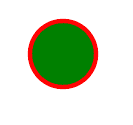
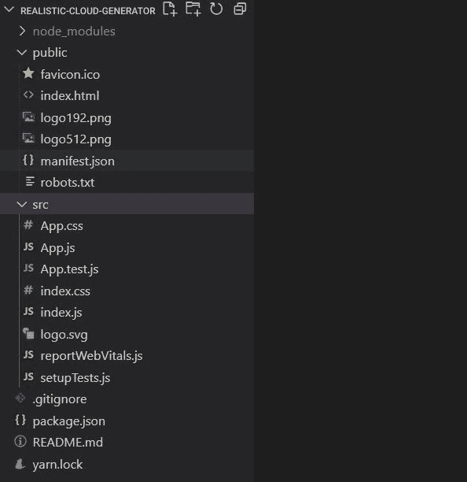
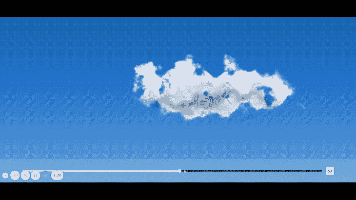

# 用 SVG 和 CSS 构建一个动画云生成器

> 原文：<https://blog.logrocket.com/build-animated-cloud-generator-svg-css/>

你有没有想象过一个环境，那里的气氛显得既抽象又自然？或者你有没有想过通过添加一些舒缓的效果来改变一个场景的情绪？如果是这样，这篇文章是给你的。

逼真的云大大增强了室外场景的真实感。云的创建、超真实感和云的相似性都是创建真实感云的困难任务的一部分。

在本文中，您将从头开始学习如何使用 CSS 和 SVG 创建逼真的云。

## 先决条件

要理解本教程，您需要:

*   CSS 的工作知识
*   SVG 的工作知识
*   React 的工作知识
*   文本编辑器

## 什么是逼真的云？

真实的云意味着不断变化的云在屏幕上看起来栩栩如生。它们应该看起来和表现得就像真的云一样。

## 可缩放矢量图形

您是否遇到过徽标图像分辨率的问题，导致它在显示时失真？

因为用户会在各种尺寸的屏幕上看到你的 logo，这个问题与响应式设计有关；无论屏幕大小如何，都应该对此进行优化。这就是 SVG 发挥作用的地方。

SVG 是用于在互联网上呈现二维图像的标准图形文件格式。欲了解更多信息，请访问此[链接](https://developer.mozilla.org/en-US/docs/Web/SVG)。

SVG 具有独特的超能力，允许您自动优化任何屏幕尺寸的任何图片，而不会失真。使用 SVG 属性简化了元素呈现的使用，因为它在所有屏幕尺寸上产生相同的结果，没有失真。

由于 SVG 包含许多元素，因此对制作云非常有用。某些元素(如`<filter>`元素)可以被操纵来模仿云的有机外观。

### 它是如何工作的？

SVG 通过定义图像的多个方面来工作。让我们创建一个简单的 HTML 模板，它将具有一些可调整的 SVG 属性:

```
<svg width="100" height="100">
   <circle cx="50" cy="50" r="40" stroke="red" stroke-width="4" fill="green" />
</svg> 

```

从上面的例子可以看出，SVG 标签提供了特定的属性，有助于创建所需的形状。

`cx`使用形状的 x 轴，因此沿 x 轴的任何移动都受其控制。在 SVG 中，`cx`用于设置圆或椭圆的水平位置。同样，`cy`负责沿 y 轴的任何运动。

圆的半径由`r`属性定义。它总是与 SVG 元素`<circle>`一起使用。

物体的厚度由`stroke`决定。它展示了形状的刚性。

`stroke-width`指定笔画的粗细。这是一条围绕边界外的组件绘制的线，使它们成为“火花”在 CSS 中，它与`border-outline`相同。

SVG 形状的`fill`的颜色决定了形状表面的颜色。`fill`是一个基本的 SVG 属性，可以应用于任何 SVG 形状。

SVG 视口的渲染区域具有由`height`定义的垂直长度和由`width`定义的水平长度。

下面是我们输出的一个例子。通过操纵这些可调整的 SVG 属性，我们可以做出类似下面的圆圈，或者一朵漂浮的蓬松的云。



## 创建真实的云

为了创建一个真实的云，我们将使用 CSS `box-shadow`以及 CSS 和 SVG `filter`属性。我们来看看这两个术语是什么意思。

### 什么是`box-shadow`？

是一个 CSS 属性，允许你给一个 HTML 元素添加一个或多个阴影。根据用户的使用情况，它接受 2 到 5 个值:

```
box-shadow: <offsetX> <offsetY> <blurRadius> <color> <spreadRadius>;

```

`offsetX`和`offsetY`分别指定阴影在水平轴和垂直轴上的位置。

`blurRadius`指定模糊量，并描述阴影的清晰或模糊程度。

`spreadRadius`处理两个值。正值增加阴影的大小，负值减小阴影的大小。

我们将使用`box-shadow`属性来创建云的模糊边缘。

### 什么是`filter`属性和`<filter>`元素？

属性给一个 HTML 元素添加视觉或图形效果。这些通常用于调整图像、边框或背景。

为了定义过滤器，SVG 使用了`<filter>`元素。`<filter>`元素使用`id`属性来唯一地标识它。过滤器被定义在`<def>`元素中，然后被图形元素的`id`引用。`<filter>` 用于添加自定义滤镜效果，但从不渲染；相反，这些属性由它们所连接的元素使用。

在这个云生成器应用程序中，我们将结合使用 CSS `filter`属性和 SVG `<filter>`元素。这将赋予云正确的纹理和图层，使它们看起来更真实。

## 项目设置

因为我们将使用 React，所以我们需要使用 Create React App 生成一个启动模板。

打开您的终端并键入以下命令:

```
yarn create react-app realistic-cloud-generator

```

这将创建一个名为`realistic-cloud-generator`的文件夹，并生成一个启动模板。

成功安装后，在您喜欢的文本编辑器中打开项目。你的文件夹结构应该如下图所示。



让我们在上面创建的项目内部做一些清理工作，因为有一些我们不会使用的不必要的文件。

打开`src`文件夹，从项目中删除`setupTests.js`、`reportWebVitals.js`、`logo.svg`、`App.css`和`App.test.js`。这只是为了减少项目文件的大小，因为我们不会使用它们。

打开 App.js，将代码替换为:

```
function App() {
  return (
    <>
      Hello!!!!
    </>
  );
}

export default App;

```

上面的代码只是从模板中删除了以前的内容，这样我们就可以在一个干净的环境中工作。

另外需要注意的是，我们的应用程序被破坏了，因为我们删除了一些链接到`index.js`内部的文件。让我们通过用下面的代码更新文件来解决这个问题:

```
import React from "react";
import ReactDOM from "react-dom";
import "./index.css";
import App from "./App";

ReactDOM.render(
 <React.StrictMode>
   <App />
 </React.StrictMode>,

 document.getElementById("root")

);

```

既然我们已经完成了清理，我们可以开始计划我们希望我们的代码库是什么样子了。在名为`Home.jsx`的父文件夹`src`中创建一个文件，然后复制并粘贴以下代码:

```
import React, { useState } from "react";
import Cloud from "./components/Cloud";

const Home = () => {
  const [range, setRange] = useState(50);

  return (
    <div>
      <Cloud range={range} />

      <div className="selector">
        <input
          type="range"
          min={1}
          max={100}
          value={range}
          onChange={(e) => setRange(e.target.value)}
        />

        <p className="rangeInput">{range}</p>
      </div>
    </div>
  );
};

export default Home;

```

在上面的代码中，创建了一个`useState`钩子来管理一定范围内的数字选择。

组件`Cloud.jsx`被调用来呈现给浏览器，它接收状态，该状态作为一个名为`range`的道具在`Cloud.jsx`组件代码中提供。

它有一个带有范围类型的`input`标签以及`min`和`max`属性。这些值定义了输入范围的开始和结束。

## 创建云组件

在父文件夹`src`中创建另一个名为`components`的文件夹，然后在组件文件夹中创建一个名为`Cloud.jsx`的文件。

在`Cloud.jsx`文件中，复制并粘贴以下代码:

```
import React from "react";
import "./Cloud.css";

const Cloud = ({ range }) => {
  return (
    <>
      <div className="cloud" id="cloud-main"></div>
      <div className="cloud" id="cloud-before"></div>
      <div className="cloud" id="cloud-center"></div>
      <div className="cloud" id="cloud-after"></div>
      <svg width="0" height="0">
        {/* Top Layer */}
        <filter id="filter-main">
          <feTurbulence
            type="fractalNoise"
            baseFrequency="0.011"
            numOctaves="5"
            seed={100 + range * 6}
          />
          <feDisplacementMap in="SourceGraphic" scale={80 + range * 3} />
        </filter>
        <filter id="filter-before">
          <feTurbulence
            type="fractalNoise"
            baseFrequency="0.011"
            numOctaves="3"
            seed={100 + range * 6}
          />
          <feDisplacementMap in="SourceGraphic" scale={80 + range * 3} />
        </filter>
        <filter id="filter-center">
          <feTurbulence
            type="fractalNoise"
            baseFrequency="0.011"
            numOctaves="3"
            seed={100 + range * 6}
          />
          <feDisplacementMap in="SourceGraphic" scale={80 + range * 3} />
        </filter>
        <filter id="filter-after">
          <feTurbulence
            type="fractalNoise"
            baseFrequency="0.009"
            numOctaves="4"
            seed={100 + range * 6}
          />
          <feDisplacementMap in="SourceGraphic" scale={20 + range * 3} />
        </filter>
      </svg>
    </>
  );
};

export default Cloud;

```

上面的代码导入`cloud.css`来为组件添加自定义样式。然后，我们调用从父组件作为属性传递的范围属性。我们也有四个`div`块作为云层，我们有一个 SVG 元素包含每个`div`的过滤器。

### 使云看起来真实

每个滤波器包括`FeTurbulence`和`FaDisplacementMap`。`FeTurbulence` 是一个 SVG 滤镜，使用[柏林湍流函数](https://en.wikipedia.org/wiki/Perlin_noise)生成图像。它允许人造纹理，如云或大理石，结合在相关的元素上。它主要需要四个属性:`type`、`baseFrequency`、`numOctaves`和`seeds`。

`FadisplacementMap`参数主要用于缩放。它指定了您希望图像扭曲的程度。比例越大，失真效果越大。

`NumOctaves`确定`FeTurbulence`上噪声函数的频率数。

`BaseFrequency`决定噪声函数的基频，`seed`是`FeTurbulence`滤波器的随机数发生器的起始数。它与`Home.jsx`文件中的范围属性相链接。

属性有很多内容，但是出于我们的目的，我们只关注一件事:每个给定的值产生不同的云形状。这是通过使用柏林噪声函数来实现的，该函数使用所提供的值作为其随机发生器的起始点；未包含此属性会导致值为零。

`FaDisplacementMap`用于通过使用位移图在维度上位移图像内容。产生一个结果需要两个输入。`in`参数指定要替换的图片内容。应用置换效果的内容保留在`in`属性中。

### 动画制作和添加云变体

我们的应用程序看起来并不漂亮，因为它还没有风格。让我们将另一个名为`Cloud.css`的文件添加到 components 文件夹。

为了使值动态，这将允许我们创建不同的云变量，我们将把范围值传递给`displacementMap`标度值和`feTurbulence`的`seed`，后者根据我们从范围中获得的数字而变化。

比例指定将应用于`displacementMap`的比例因子。

在`Cloud.css`文件中，复制并粘贴以下代码:

```
* {
  box-sizing: border-box;
  margin: 0;
  padding: 0;
}

body {
  width: 100vw;
  height: 100vh;
  background: linear-gradient(0deg, #62a0d8 0%, #2178d1 50%, #085cb3 100%);
  padding: 1%;
  overflow: hidden;
}

.cloud {
  width: 600px;
  height: 100px;
  border-radius: 50%;
  position: absolute;
  top: -100px;
  left: -100px;
  -webkit-animation: move ease-in 35s infinite;
          animation: move ease-in 35s infinite;
}

@-webkit-keyframes move {
  0% {
    left: -100px;
  }

  50% {
    left: 500px;
  }

  100% {
    left: -100px;
  }
}

@keyframes move {
  0% {
    left: -100px;
  }

  50% {
    left: 500px;
  }

  100% {
    left: -100px;
  }
}

#cloud-main {
  top: 90px;
  height: 100px;
  -webkit-filter: url(#filter-main);
          filter: url(#filter-main);
  box-shadow: 200px 170px 19px 40px rgba(255, 255, 255, 0.9);
}
#cloud-before {
  top: 90px;
  height: 30px;
  width: 500px;
  -webkit-filter: url(#filter-before);
          filter: url(#filter-before);
  box-shadow: 200px 200px 10px 40px rgba(215, 215, 215, 0.3);
}

#cloud-center {
  top: 80px;
  width: 580px;
  height: 35px;
  -webkit-filter: url(#filter-center);
          filter: url(#filter-center);
  box-shadow: 210px 250px 28px 30px rgba(66, 105, 146, 0.2);
}

#cloud-after {
  top: 70px;
  width: 550px;
  height: 35px;
  left: -60px;
  -webkit-filter: url(#filter-after);
          filter: url(#filter-after);
  box-shadow: 210px 272px 30px 0px rgba(0, 0, 0, 0.4);
}

.selector {
  position: absolute;
  bottom: 0;
  left: 0;
  right: 0;
  background: rgba(255, 255, 255, 0.1);
  padding: 2rem 6rem;
  display: flex;
  align-items: center;
  justify-content: center;
}

.selector input {
  width: 100%;
  height: 2rem;
  accent-color: #fff;
  outline: none;
  border: none;
}

.selector .rangeInput {
  background: #fff;
  padding: 0.4rem 0.5rem;
  border-radius: 0.2rem;
  display: flex;
  align-items: center;
  justify-content: center;
  font-size: 1rem;
  font-weight: 500;
  color: #000;
  margin-left: 1rem;
}

```

因为我们已经应用了基本样式，所以我们的应用程序现在看起来更有吸引力。

为了对每个元素应用各自的规则，我们检索给予它的`classNames`和 ID 选择器。

在上面的代码中，术语`keyframe`指的是用于制作对象动画的帧。

`filter url()`功能用于过滤内容。改变输入图像外观的图形效果由 CSS 数据类型表示，它由`filter`和`backdrop-filter`属性使用。它还接受对一个 SVG `<filter>`元素的引用，该引用将使用 CSS `filter`属性应用于该元素。

您还可以使用 CSS `url()`函数链接到一个资源，如图像、web 字体或过滤器。

## 在浏览器中启动应用程序

耶，我们快完成了！必须引用我们之前在项目文件夹中创建的`App.js`文件，才能在浏览器中呈现我们的应用程序。

在您的`App.js`文件中，复制并粘贴以下代码:

```
import Home from "./Home";

const App = () => {
  return (
    <div className="App">
      <Home />
    </div>
  );
};

export default App;

```

现在，我们已经生成了所有必要的组件，让我们对它进行测试。在下面键入以下命令:

```
yarn start

```

这将启动一个开发服务器，它将在您选择的浏览器中呈现。

耶！这是我们想到的:



## 结论

在本文中，我们通过使用 React 探索 SVG 领域，用最少的努力创建了一个云生成器应用程序。

我们看到了`displacementMap`、`turbulence`、`scale`和`seed`的效果，它们可以与范围道具一起使用，动态地改变输入，创建逼真的移动云。

本教程中构建的云应用程序的源代码可以在 [GitHub](https://github.com/Sproff/realistic-cloud-generator) 上找到，供您探索。

## [LogRocket](https://lp.logrocket.com/blg/react-signup-general) :全面了解您的生产 React 应用

调试 React 应用程序可能很困难，尤其是当用户遇到难以重现的问题时。如果您对监视和跟踪 Redux 状态、自动显示 JavaScript 错误以及跟踪缓慢的网络请求和组件加载时间感兴趣，

[try LogRocket](https://lp.logrocket.com/blg/react-signup-general)

.

[ ](https://lp.logrocket.com/blg/react-signup-general) [](https://lp.logrocket.com/blg/react-signup-general) 

LogRocket 结合了会话回放、产品分析和错误跟踪，使软件团队能够创建理想的 web 和移动产品体验。这对你来说意味着什么？

LogRocket 不是猜测错误发生的原因，也不是要求用户提供截图和日志转储，而是让您回放问题，就像它们发生在您自己的浏览器中一样，以快速了解哪里出错了。

不再有嘈杂的警报。智能错误跟踪允许您对问题进行分类，然后从中学习。获得有影响的用户问题的通知，而不是误报。警报越少，有用的信号越多。

LogRocket Redux 中间件包为您的用户会话增加了一层额外的可见性。LogRocket 记录 Redux 存储中的所有操作和状态。

现代化您调试 React 应用的方式— [开始免费监控](https://lp.logrocket.com/blg/react-signup-general)。