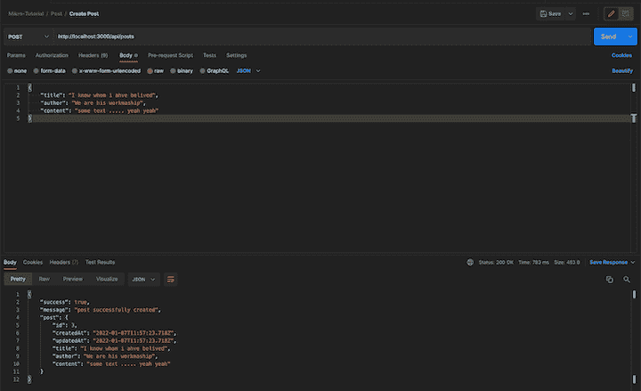
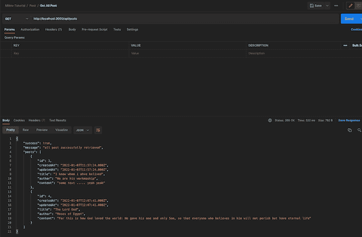
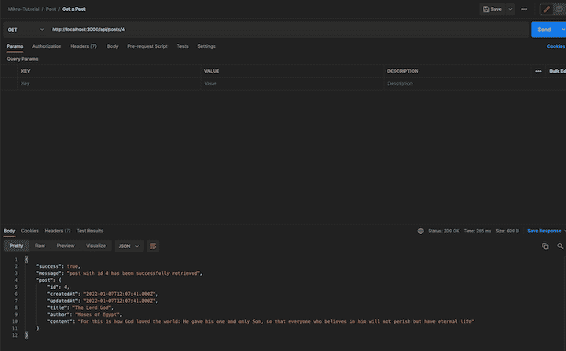
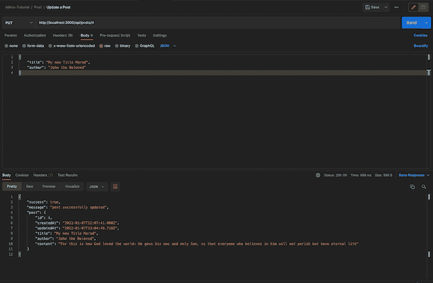

# 使用 MikroORM、Node.js 和 Express.js - LogRocket Blog 从头构建一个 API

> 原文：<https://blog.logrocket.com/build-api-from-scratch-using-mikroorm-node-js-express-js/>

MikroORM 过去曾与几个 ORM 合作过，它引起了我的兴趣，因为它承诺了一些 JavaScript/TypeScript 生态系统中还没有的变化和补充。

在试用时，我发现设置起来并不容易，尤其是如果你不太熟悉 TypeScript 的话。如果您刚刚开始构建 RESTful API，本教程将向您展示如何以一种简单易懂、循序渐进的方式充分利用 ORM。

为了展示 MikroORM 的实际应用，我们将带您完成为博客应用程序构建 API 的步骤。我们的示例应用程序的功能将包括创建帖子、撰写评论以及对帖子和评论执行更新、删除和阅读操作的能力。完全掌握这些概念将为[构建更复杂的 CRUD 应用](https://blog.logrocket.com/build-crud-application-react-firebase-web-sdk-v9/)奠定基础。

这里是已经完成的项目的 [GitHub 库](https://github.com/gbols/mikroORM-express-tutorial)，以防你卡住，需要参考。

## 技术

在我们开始之前，下面是我们将使用的技术的概述。

*   [Node.js](https://nodejs.org/en/) :我们将设置一个 Node.js 服务器来运行我们的 JavaScript 代码。Node.js 旨在构建可伸缩的网络应用程序。我在我的机器上运行的是 v15，但是从 v6.0.0 开始的任何版本都可以，以便获得所有最新的 ES6 特性
*   Express.js :一个快速、非个性化、最小化且灵活的 Node.js web 应用程序框架，为 web 和移动应用程序提供了一组健壮的特性。Express.js 的主要优势之一是它丰富的库和框架生态系统
*   PostgreSQL :一个强大的开源对象关系数据库系统。我们可以在本地运行它，也可以建立一个在线实例。为了简单起见，我们将在 [ElephantSQL](https://www.elephantsql.com/) 使用一个在线实例
*   MikroORM :正如其网站上所说，MikroORM 是一个基于数据映射器、工作单元和身份映射模式的 Node.js 的类型脚本 ORM。它也兼容普通的 JavaScript
*   [Postman](https://www.postman.com/) :构建和使用 API 的 API 平台。Postman 简化了 API 生命周期的每个步骤，并简化了协作，因此您可以更快地创建更好的 API

本教程假设读者对 JavaScript 有一定的了解。我们将使用最新的 ES6 功能。

## MikroORM 和 Express.js 项目结构

我们将使用以下命令为我们的应用程序设置结构。

依次运行每个命令:

```
mkdir -p  mikroORM-express-tutorial/{server}
cd mikroORM-express-tutorial
npm init -y
touch mikro-orm.config.js

```

运行以上命令后，您应该有一个如下所示的项目结构:

```
mikroORM-express-tutorial
 |--- server
 |--- mikro-orm.config.js
 |--- package-lock.json
 |--- package.json

```

我们的配置文件将放入`mikro-orm.config.js`文件，而其余的应用程序代码将放在`server`目录中。

### Express.js 设置

```
npm i express

cd server
touch app.js 

```

在这个文件中，我们将引导 Express.js 应用程序:

```
const express = require("express");

let port = process.env.PORT || 3000;

(async () => {
  //bootstrap express application.
  const app = express();

  //parse incoming requests data;
  app.use(express.json());
  app.use(express.urlencoded({ extended: false }));

  //default catch-all route that sends a JSON response.
  app.get("*", (req, res) =>
    res
      .status(200)
      .send({ success: true, message: "This is where it all starts!!!" })
  );

  app.listen(port, () => {
    console.log(
      `Express Mikro-ORM tutorial listening at http://localhost:${port}`
    );
  });
})();

```

我们还将安装 [`nodemon`](https://blog.logrocket.com/configuring-nodemon-with-typescript/) ,这样我们就不必在每次修改工作区时重启服务器。

```
// -D options indicates that we want this package as a dev dependency rather than main package that will be bundled with the rest of our application.

npm i -D nodemon  

```

接下来，让我们打开`package.json`文件，在脚本部分创建一个命令来启动我们的服务器:

```
>....
"scripts": {
    "test": "echo \"Error: no test specified\" && exit 1",
    "start:dev": "nodemon ./server/app"
  },
....

```

现在，让我们通过运行以下命令来尝试启动我们的应用程序:

```
npm run start:dev

```

打开浏览器，访问网址`[http://localhost:3000](http://localhost:3000)`。您应该会收到以下响应:

```
{
 "success":true,
 "message":"This is where it all starts!!!"
}

```

### 麦克风设置

这一步需要 PostgreSQL 安装，要么在我们的本地机器上，要么在线托管实例。设置本地实例超出了本文的范围，我们将在 [ElephantSQL](https://www.elephantsql.com/) 上使用一个托管实例。

访问网站并注册一个免费的 PostgreSQL 实例；这应该不会超过两分钟。

```
npm i -s @mikro-orm/core @mikro-orm/postgresql 

//next cd into server
touch bootstrap.js

inside bootstrap.js paste the following lines of code

const { mikroORMConfig } = require("../mikro-orm.config");
const allEntities = require("./entities");
module.exports.initializeORM = async (MikroORM) => {
  const DI = {};
  DI.orm = await MikroORM.init(mikroORMConfig);
  DI.em = DI.orm.em;
  for (const entityInstance of allEntities) {
    if (entityInstance.label === "BaseEntity") {
      continue;
    }
    DI[entityInstance.label] = await DI.orm.em.getRepository(
      entityInstance.entity
    );
  }
  return DI;
};

```

接下来，让我们在文件`mikro-orm.config.js`中设置我们的数据库连接:

```
const allEntities = require("./server/entities");

module.exports = {
  entities: allEntities,
  type: "postgresql",
  clientUrl:
    "some string from https://www.elephantsql.com/",
};

```

## 定义实体

在上面的两个代码片段中，都引用了变量`allEntities`。我们将看看定义实体。

MikroORM 有`baseEntitiy`的概念。这是可选的，但我发现它很有用，因为它有助于使一些属性和字段在所有实体中可重用。

在服务器目录中，我们将创建几个文件:

```
mkdir entities
cd entities
touch BaseEntity.js index.js Post.js

//inside BaseEntity.js
const { EntitySchema } = require("@mikro-orm/core");
class BaseEntity {
  constructor() {
    this.createdAt = new Date();
    this.updatedAt = new Date();
  }
}
const schema = new EntitySchema({
  name: "BaseEntity",
  abstract: true,
  properties: {
    id: { primary: true, type: "number" },
    createdAt: { type: "Date" },
    updatedAt: { type: "Date", onUpdate: () => new Date() },
  },
});
module.exports = {
  BaseEntity,
  entity: BaseEntity,
  schema,
  label: "BaseEntity",
};

```

在`Post.js`中，我们将要求用户在创建`POST`时输入作者、标题和内容。

```
"use strict";
const { EntitySchema } = require("@mikro-orm/core");
const { BaseEntity } = require("./BaseEntity");
const { Comment } = require("./Comment");
class Post extends BaseEntity {
  constructor(title, author, content) {
    super();
    this.title = title;
    this.author = author;
    this.content = content;
  }
}
const schema = new EntitySchema({
  class: Post,
  extends: "BaseEntity",
  properties: {
    title: { type: "string" },
    author: { type: "string" },
    content: { type: "string" },
  },
});
module.exports = {
  Post,
  entity: Post,
  schema,
  label: "postRepository",
};

```

我们将通过`index.js`提供这些文件。

```
const Post = require("./Post");
const BaseEntity = require("./BaseEntity");

module.exports = [Post, BaseEntity];

```

现在我们已经有了模式的布局，下一步是运行迁移，使它能够与我们的 PostgreSQL 数据库同步。

```
// At the root of the project run the following command
 npx mikro-orm schema:update --run --fk-checks 

```

## 控制器和路由

既然我们已经成功地设置了实体并运行了数据库迁移，那么是时候制作控制器了。我们将创建一个`postController`，它将使用上述实体的定义，并负责对`Post`实体执行`CRUD`操作。

```
//cd into server 
mkdir controllers

touch post.controller.js

//inside the file post.controller.js
const { Router } = require("express");
const { Post } = require("../entities/Post");
const router = Router();

const PostController = (DI) => {
  router.post("/", async (req, res) => {
    const { title, author, content } = req.body;
    if (!title || !author || !content) {
      return res.status(400).send({
        success: false,
        message: "One of `title, author`  or `content` is missing",
      });
    }
    try {
      const post = new Post(title, author, content);
      await DI.postRepository.persistAndFlush(post);
      res
        .status(200)
        .send({ success: true, message: "post successfully created", post });
    } catch (e) {
      return res.status(400).send({ success: false, message: e.message });
    }
  });

 return router;
}

```

上面的代码片段创建了一篇新的博客文章。如果成功创建，它将返回博客文章。否则，它将返回一个错误。

***注意*** :我们可以更好地管理验证，但是为了使本教程简单，我选择了这种方法。

接下来，我们将把控制器导入到我们的主应用程序中，并向它传递它需要的依赖变量。

这是我们更新后的`app.js`文件现在的样子:

```
const express = require("express");
const { MikroORM, RequestContext } = require("@mikro-orm/core");
const { initializeORM } = require("./bootstrap");
const { PostController } = require("./controllers/post.controller");

let port = process.env.PORT || 3000;

(async () => {
  const app = express();
  const DI = await initializeORM(MikroORM);
  app.use(express.json());
  app.use(express.urlencoded({ extended: false }));

  app.use((req, res, next) => {
    RequestContext.create(DI.orm.em, next);
    req.di = DI;
  });

  app.use("/api/posts", PostController(DI));

  app.get("*", (req, res) =>
    res
      .status(200)
      .send({ success: true, message: "This is where it all starts!!!" })
  );

  app.listen(port, () => {
    console.log(
      `Express Mikro-ORM tutorial listening at http://localhost:${port}`
    );
  });
})();

```

在第 10 行中，我们通过 ORM 初始化了到托管 PostgreSQL 实例的数据库连接和一个返回依赖项，我们将使其在整个应用程序中可用。

在第 14–17 行，我们需要为每个请求派生实体管理器，这样它们的身份映射就不会冲突。为此，我们使用了`RequestContext`助手。

最后，在第 19 行，我们向控制器注入它需要的依赖项。



如果你能走到这一步，干杯！如果你愿意，请随意创建更多的帖子。

## 列出帖子

接下来，我们将添加列出所有待办事项的功能。

将以下代码片段添加到`postController`文件`post.controller.js`中:

```
....
 router.get("/", async (req, res) => {
    try {
      const posts = await DI.postRepository.find({});
      res.status(200).send({ 
          success: true,
          message: "all post successfully retrieved", 
          posts 
});
    } catch (e) {
      return res.status(400).send({
        success: false,
        message: e.message,
      });
    }
  });
....

```

在上面的代码片段中，我们从我们的数据库中获取所有的帖子，并将它们发送回用户(或者在此过程中出现错误时发送一条错误消息)。



我们还将添加检索单个帖子而不是所有可用帖子的功能。为此，我们将在`postController`中添加以下内容:

```
....
  router.get("/:id", async (req, res) => {
    const { id } = req.params;
    try {
      const post = await DI.postRepository.findOneOrFail({ id });
      res.status(200).send({
        success: true,
        message: `post with id ${id} has been successfully retrieved`,
        post,
      });
    } catch (e) {
      return res.status(400).send({ success: false, message: e.message });
    }
  });

....

```

有了这条新路线，我们就可以在 Postman 中进行测试了。



## 更新单个帖子

让我们添加更新单个帖子的功能。

在文件的顶部，我们将添加以下导入语句:

```
const { wrap } = require("@mikro-orm/core");

....

 router.put("/:id", async (req, res) => {
    const { id } = req.params;
    const { title, author, content } = req.body;

    if (!title && !author && !content) {
      return res.status(400).send({
        success: false,
        message: "One of `title, author` or `content` must be present",
      });
    }
    try {
      const post = await DI.postRepository.findOneOrFail({ id });
      wrap(post).assign({
        title: title || post.title,
        author: author || post.author,
        content: content || post.content,
      });
      await DI.postRepository.flush();
      res.status(200).send({
        success: true,
        message: "post successfully updated",
        post,
      });
    } catch (e) {
      return res.status(400).send({ success: false, message: e.message });
    }
  });

....

```

在上面的代码片段中，我们从库中导入`wrap`，然后用它来更新我们的帖子。然后，如果用户在更新特定的帖子时提供了部分字段，我们就返回到现有的值。

让我们在 Postman 中测试一下:



## 删除帖子

最后，让我们添加删除帖子的功能。

```
....
router.delete("/:id", async (req, res) => {
    const { id } = req.params;
    try {
      const post = await DI.postRepository.findOneOrFail({ id });
      await DI.postRepository.removeAndFlush(post);
      res.status(200).send({
        success: true,
        message: `successfully deleted post with ${id} id`,
        post,
      });
    } catch (e) {
      return res.status(400).send({ success: false, message: e.message });
    }
  });
....

```

前往这个 [GitHub 库](https://github.com/gbols/mikroORM-express-tutorial)查看一个工作代码示例以供参考。

## 结论

如果您正在使用 Node.js、Express 和 MikroORM 构建一个真实世界的应用程序，您可能需要考虑添加诸如身份验证和授权、更好的错误处理等功能。如果您有兴趣深入研究，您可以了解更多关于实体、工作单元、事务等之间的关系。

## 200 只显示器出现故障，生产中网络请求缓慢

部署基于节点的 web 应用程序或网站是容易的部分。确保您的节点实例继续为您的应用程序提供资源是事情变得更加困难的地方。如果您对确保对后端或第三方服务的请求成功感兴趣，

[try LogRocket](https://lp.logrocket.com/blg/node-signup)

.

[](https://lp.logrocket.com/blg/node-signup)[https://logrocket.com/signup/](https://lp.logrocket.com/blg/node-signup)

LogRocket 就像是网络和移动应用程序的 DVR，记录下用户与你的应用程序交互时发生的一切。您可以汇总并报告有问题的网络请求，以快速了解根本原因，而不是猜测问题发生的原因。

LogRocket 检测您的应用程序以记录基线性能计时，如页面加载时间、到达第一个字节的时间、慢速网络请求，还记录 Redux、NgRx 和 Vuex 操作/状态。

[Start monitoring for free](https://lp.logrocket.com/blg/node-signup)

.