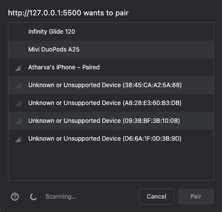
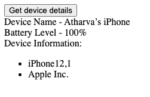

# 用 Chrome Web 蓝牙 API 构建一个蓝牙应用

> 原文：<https://blog.logrocket.com/build-bluetooth-app-chrome-bluetooth-web-api/>

如今，浏览器正在不断发展，带来了新的 API 和连接其他设备的方式，并允许访问比以往更多的功能。一个这样的 API 是[网络蓝牙 API](https://www.chromestatus.com/feature/5264933985976320) 。

在撰写本文时，该 API 仍处于测试阶段，但一旦向公众发布，它将为希望使用蓝牙但不想为每个平台创建本机应用程序的开发人员带来大量机会。

尽管 Bluetooth API 仍处于测试阶段，但我们将尝试它并制作一个简单的网页，该网页将与我们的手机配对，并为我们提供基本的详细信息，如电池百分比、设备名称以及设备制造商提供的基本信息。

我们不会在本教程中使用样式，因为我们只需要了解如何用 JavaScript 与蓝牙 API 交互。

记住，不是所有的浏览器都支持这个 API，你也不可能在每部手机上都测试这个。一些电话可能不允许获取设备信息。在本教程中，我将使用苹果 iPhone 11，它允许我在浏览器上通过蓝牙获取我的设备信息，没有任何问题。

## 要求

*   代码编辑器；我更喜欢 VS 代码
*   如果您使用 VS 代码，请使用实时服务器扩展
*   具有蓝牙功能(或即插即用蓝牙硬件)的笔记本电脑或 PC
*   具有蓝牙功能的移动设备(我用的是 iPhone 11，你可以用自己的手机试试)
*   JavaScript 的工作知识
*   安装在你的电脑或笔记本电脑上的 Chrome Beta。蓝牙 API 是一个测试版特性，在 Chrome 测试版上效果最好

请注意，并不是所有基于 Chromium 的浏览器，比如 Brave，都支持蓝牙 API。我试着在 Brave 上使用 API，但发现 Brave 出于安全原因故意禁用了 API。

如果你在代码方面需要任何帮助，这里有 [GitHub 库](https://github.com/atharvadeosthale/web-bluetooth-phone)。

## 我们开始吧

首先，我们需要创建一个将用作工作区的文件夹。创建文件夹后，使用以下命令打开 VS 代码:

```
code .

```

在本教程中，我们将使用两个文件；分别命名为`index.html`和`script.js`。在`index.html`中，我们只需要基本的布局(只是一个按钮)，并将文件链接到我们的 JavaScript 文件。

以下是`index.html`的内容:

```
<!DOCTYPE html>
<html lang="en">
  <head>
    <meta charset="UTF-8" />
    <meta http-equiv="X-UA-Compatible" content="IE=edge" />
    <meta name="viewport" content="width=device-width, initial-scale=1.0" />
    <title>Document</title>
  </head>
  <body>
    <button id="getDetails">Get device details</button>
    <div id="details"></div>
    <script src="script.js"></script>
  </body>
</html>

```

## 添加蓝牙功能

让我们从功能性开始。转到`script.js`并将 UI 元素存储在变量中，以便我们以后可以访问它们:

```
const button = document.getElementById("getDetails");
const details = document.getElementById("details");

```

现在，让我们为按钮创建一个`click`监听器，这样一旦用户点击按钮，我们就可以执行我们的操作:

```
button.addEventListener("click", async () => {
  try {
  } catch(err) {
    console.error(err);
    alert("An error occured while fetching device details");
  }
});

```

我们把这个函数变成了一个`async`函数，因为它让事情变得更简单，我们不需要做很多回调，让我们的代码看起来更有条理。从现在开始，我们所有的代码都将在`try`块中。

## 请求蓝牙设备

接下来，让我们通过浏览器请求蓝牙设备:

```
// Request the Bluetooth device through browser
const device = await navigator.bluetooth.requestDevice({
  optionalServices: ["battery_service", "device_information"],
  acceptAllDevices: true,
});

```

在上面的代码中，我们通过`navigator.bluetooth`使用了蓝牙 API。在连接到设备之前，我们需要向设备提供我们将要访问哪些数据的信息。

我们可以使用目标蓝牙设备上的各种服务来访问所需的数据。在这种情况下，我们与电池和设备信息进行交互，因此我们需要`battery_service`和`device_information`服务。

一旦用户选择了他想要连接的蓝牙设备，我们就建立了到 GATT 服务器的连接，GATT 服务器为我们提供了对我们先前请求的服务的访问，并且还将设备名存储在一个变量中以备后用:

```
// Connect to the GATT server
// We also get the name of the Bluetooth device here
let deviceName = device.gatt.device.name;
const server = await device.gatt.connect(); 

```

现在，我们需要从 GATT 服务器单独获取服务，以便我们可以单独访问它们:

```
// Getting the services we mentioned before through GATT server
const batteryService = await server.getPrimaryService("battery_service");
const infoService = await server.getPrimaryService("device_information");

```

## 从设备获取信息

首先，让我们获取目标设备的电池电量。

每个蓝牙设备都有不同的服务可以交互。例如，移动设备可以具有用于所有电池活动的电池服务。也可以有电话服务，帮助拨打和接听电话。不同的设备都有不同的蓝牙服务。

每个服务都有特点，每个特点都有价值。这个值是一个缓冲区，所以我们需要把它转换成人类可读的形式。

电池电量是一个百分比，因此我们将缓冲区转换为整数:

```
// Getting the current battery level
const batteryLevelCharacteristic = await batteryService.getCharacteristic(
  "battery_level"
);
// Convert recieved buffer to number
const batteryLevel = await batteryLevelCharacteristic.readValue();
const batteryPercent = await batteryLevel.getUint8(0);

```

`readValue()`函数返回给我们一个缓冲区，我们需要将它转换成人类可读的形式。

现在，让我们努力获取更多的设备信息。如前所述，每个服务都有一个或多个特征。根据设备的不同，`device_information`服务可能有相当多的特征，我们无法提取特定的特征，因为每个设备都有不同的配置和不同的唯一 id 来访问数据。所以我们简单的把这种情况下的所有特征读出来。

下面的代码就是这样做的:

```
// Getting device information
// We will get all characteristics from device_information
const infoCharacteristics = await infoService.getCharacteristics();
console.log(infoCharacteristics);
let infoValues = [];
const promise = new Promise((resolve, reject) => {
  infoCharacteristics.forEach(async (characteristic, index, array) => {
    // Returns a buffer
    const value = await characteristic.readValue();
    console.log(new TextDecoder().decode(value));
    // Convert the buffer to string
    infoValues.push(new TextDecoder().decode(value));
    if (index === array.length - 1) resolve();
  });
});

```

我们将`forEach`包装在一个承诺下，因为父对象和`forEach`本身是一个异步函数，所以我们需要在继续显示数据之前获取数据。

这里，当我们使用`readValue()`获取值时，我们使用的是`TextDecoder`，因为我们知道`device_information`服务中的大部分数据是字符串类型，而不是整数。

然后，我们将所有数据放入一个数组，这样我们就可以在 UI 上呈现它，然后在读取所有特征后解析承诺。

现在，我们简单地将数据呈现在屏幕上:

```
promise.then(() => {
  // Display all the information on the screen
  // use innerHTML
  details.innerHTML = `
    Device Name - ${deviceName}<br />
    Battery Level - ${batteryPercent}%<br />
    Device Information:
    <ul>
      ${infoValues.map((value) => `<li>${value}</li>`).join("")}
    </ul> 
  `;
});

```

现在，当你在 Chrome Beta 上运行我们的 web 应用程序并点击按钮时，你应该会看到一个连接到蓝牙设备的提示，就像这样:



一旦你选择了你的手机(在我的例子中是 **Atharva 的 iPhone** )并点击**对**，你应该会在几秒钟内看到屏幕上的信息，就像这样:



信息是正确的，当我截屏时，我的手机 100%开着。

这里需要注意的一点是，`iPhone 12,1`不代表我有 iPhone 12。`iPhone 12,1`是 iPhone 11 的代号。因此，如果你看到你的设备有一些奇怪的名字，你应该知道它可能是制造商的代号或其他东西。

## 你应该使用蓝牙 API 吗？

这是最重要的问题。这项功能对于大多数浏览器来说都处于测试阶段，即使它面向公众推出，也可能会出现一些问题，例如硬件不支持蓝牙。如果您想为某人创建一个服务来链接他们的设备，您应该记住这一点。

另一方面，如果您的组织拥有正确配置了蓝牙的定制系统，您肯定可以为组织创建一个内部 web 应用程序，该应用程序可以根据他们的需求与蓝牙设备进行交互。

我认为你应该在这个 API 处于测试阶段的时候试用它，因为当它发布给公众时，它通常会让你占上风。没有多少人知道如何使用这个 API，所以了解它可以帮助你获得更多的工作。

在测试阶段使用这个的另一个原因是挑战你自己。当 API 发布时，事情可能会变得更容易。但是如果你像我一样喜欢玩 API 测试版，你可能会从中得到一些乐趣，并在这个过程中学到一些新东西。

一旦 API 向公众发布，更多的关注将会产生，在我看来，越来越多的蓝牙相关服务将会出现在网络上，而不是在本地应用程序中。这将使这项技术更容易被 web 开发人员使用。

## 下一步是什么？

我强烈建议阅读目标设备文档以获得帮助。不是每个设备都有相同的服务；有些可能有带有自定义 id 的自定义服务。

对于实践，我建议弄清楚使用蓝牙 API 还能从手机中提取什么。

## 使用 [LogRocket](https://lp.logrocket.com/blg/signup) 消除传统错误报告的干扰

[](https://lp.logrocket.com/blg/signup)

[LogRocket](https://lp.logrocket.com/blg/signup) 是一个数字体验分析解决方案，它可以保护您免受数百个假阳性错误警报的影响，只针对几个真正重要的项目。LogRocket 会告诉您应用程序中实际影响用户的最具影响力的 bug 和 UX 问题。

然后，使用具有深层技术遥测的会话重放来确切地查看用户看到了什么以及是什么导致了问题，就像你在他们身后看一样。

LogRocket 自动聚合客户端错误、JS 异常、前端性能指标和用户交互。然后 LogRocket 使用机器学习来告诉你哪些问题正在影响大多数用户，并提供你需要修复它的上下文。

关注重要的 bug—[今天就试试 LogRocket】。](https://lp.logrocket.com/blg/signup-issue-free)