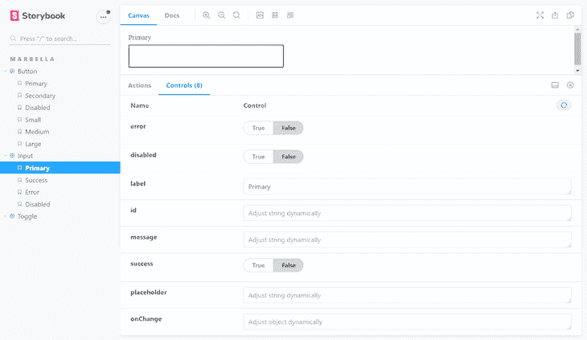
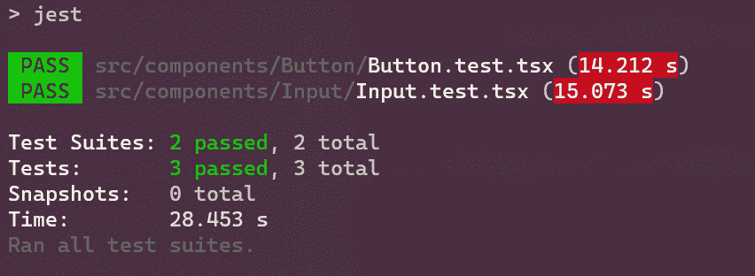

# 用 React 和 TypeScript 构建一个组件库- LogRocket Blog

> 原文：<https://blog.logrocket.com/build-component-library-react-typescript/>

## 介绍

React 仍然是 web 开发人员社区中最著名的前端库。当 Meta(以前的脸书)开源软件 React 在 2013 年末推出时，它通过引入虚拟 DOM、将 UI 分解为组件和不变性等概念，对单页面应用程序(spa)产生了巨大的影响。

React 在过去几年中已经发展了很多，随着 TypeScript 支持、钩子、`<Suspense>`和 React 服务器组件的引入，我们可以假设 React 仍然会保持最佳前端工具的桂冠。React 已经打开了一些令人敬畏的项目的大门，如 Next.js、Gatsby 和 [Remix](https://blog.logrocket.com/remix-guide-newly-open-sourced-react-framework/) ，这些项目更侧重于改善开发人员的体验。

伴随着这个健壮的 React 生态系统的是各种各样的组件库，如 Material UI、 [Chakra UI](https://blog.logrocket.com/advanced-techniques-chakra-ui/) 和 React-Bootstrap。当你碰到这些牛逼的工具和库的时候，你有没有想过它们是怎么做出来的？或者用 React 创建自己的 UI 组件库需要什么？

在下面的文章中，我们将学习如何用 TypeScript 构建我们的组件库，并将其发布到 npm，这样您也可以为 React 不断增长的项目社区做出贡献。

## 所需工具

创建 UI 库与创建 web 应用程序截然不同；而不是使用 Next.js 或者 Create React App 这样的流行工具，我们要从头开始。

为了构建这个 UI 库，我们将使用以下工具:

### 以打字打的文件

毫无疑问，使用 JavaScript 开发时，TypeScript 是首选方法。TypeScript 将为我们节省大量时间，因为它引入了类型和编译时检查。

此外，当我们为我们的库构建组件时，TypeScript 将是有帮助的，因为我们将在 React 组件中处理道具，定义类型将避免在将道具传递给组件时出现问题。

### 到达

我们将需要为我们的库一些自定义配置。 [Rollup](https://blog.logrocket.com/does-my-bundle-look-big-in-this/) 是流行的 JavaScript bundlers 之间的一个很好的中间地带，因为它比 Parcel 更容易定制，但比 webpack 需要更少的配置工作。

### 故事书

我们正在构建组件，所以我们需要一种在隔离环境中可视化它们的方法。Storybook 为我们做到了这一点，因为它为 UI 组件提供了一个独立的平台

### 笑话和反应测试库

Jest 是一个完整的测试框架，有一个测试运行器，外加一个断言和嘲讽库。它还允许用户为组件创建快照测试，这在 React 中构建组件时非常理想。

React 测试库帮助我们编写测试，就像一个真实的用户在处理元素一样。

## 项目结构

让我们考虑一下项目结构。我们将向我们的项目添加组件、测试、故事和类型，以将它们添加到组件目录下。

让我们从项目初始化开始。为此，创建一个目录，并使用以下命令将其初始化为 JavaScript 项目:

```
npm init

```

这个命令将在我们的应用程序中生成一个`package.json`文件。

现在，安装 TypeScript 并通过以下命令对我们的项目做出反应:

```
npm i -D react typescript @types/react

```

请注意，我们正在传递标志`-D`，因为我们需要将其安装为`devDependencies`而不是项目依赖项；当我们构建包时，我们将需要这些依赖项。

将来，这个库将在 React 项目中使用。因此，我们不需要捆绑它，我们可以将 React 依赖项移动到`peerDependency`部分(您可能需要将它添加到您的`package.json`文件中)。

## 创建组件

现在我们已经添加了 React 和 TypeScript，我们可以开始创建我们的组件，从一个按钮开始。

在`src/components`目录下创建组件。因为这是一个 TypeScript 项目，我们首先为组件创建类型定义，我将其命名为`Button.types.ts`:

```
import {  MouseEventHandler } from "react"
export interface ButtonProps {
    text?: string,
    primary?:boolean,
    disabled?: boolean,
    size?: "small" | "medium" | "large",
    onClick?: MouseEventHandler<HTMLButtonElement>
}

```

这个文件由按钮的所有道具组成，包括`onClick`事件。我们将在按钮组件中使用这些属性来添加或启用不同的属性。现在，让我们继续创建按钮组件本身。

### 为按钮组件集成样式化组件

在这个项目中，我们将不会使用常规的 CSS 相反，我们将使用 CSS-in-JS。与常规 CSS 相比，CSS-in-JS 提供了许多优势，例如:

*   可重用性:因为 CSS-in-JS 是用 JavaScript 编写的，所以您定义的样式将是可重用的 JavaScript 对象，您甚至可以扩展它们的属性
*   封装 **:** CSS-in-JS 作用域由唯一的选择器生成，以防止样式泄漏到其他组件中
*   Dynamic **:** CSS-in-JS 将允许您根据变量的值动态地改变样式的属性

有很多方法可以在你的组件中编写 CSS-in-JS，但是对于本教程，我们将使用最著名的库之一，名为 [styled-components](https://styled-components.com/) 。您可以运行以下命令来安装 Storybook 依赖项以及 TypeScript 支持的类型定义:

```
npm install -D styled-components @types/styled-components
```

现在，让我们创建按钮组件:

```
import React,{FC} from 'react'
import styled from 'styled-components';

import {ButtonProps} from "./Button.types"

const StyledButton = styled.button<ButtonProps>`
    border: 0;
    line-height: 1;
    font-size: 15px;
    cursor: pointer;
    font-weight: 700;
    font-weight: bold;
    border-radius: 3px;
    display: inline-block;
    padding: ${props => props.size === "small"? "7px 25px 8px" : (props.size === "medium"? "9px 30px 11px" : "14px 30px 16px" )};
    color: ${props => props.primary? "#1b116e":"#ffffff"};
    background-color: ${props => props.primary ? "#6bedb5":"#1b116e"};
    opacity: ${props => props.disabled ? 0.5 : 1};
    &:hover {
      background-color: ${props => props.primary ? "#55bd90":"#6bedb5"};
    }
    &:active {
        border: solid 2px #1b116e;
        padding: ${props => props.size === "small"? "5px 23px 6px" : (props.size === "medium"? "7px 28px 9px" : "12px 28px 14px" )};
    }
`;

const Button: FC<ButtonProps> = ({size, primary, disabled, text, onClick, ...props}) => {
    return (
        <StyledButton type="button" onClick={onClick} primary={primary} disabled={disabled} size={size} {...props}>
            {text}
        </StyledButton>
    )
}

export default Button;

```

如果你仔细阅读上面的代码，你会注意到一些特别的东西:我们定义了一个名为`StyledButton`的变量，我们通过一个名为[的标签模板文字](https://developer.mozilla.org/en-US/docs/Web/JavaScript/Reference/Template_literals#tagged_templates)为它分配样式属性，这是一个新的 JavaScript ES6 特性，可以让你定义定制的字符串插值。

这些带标签的模板用于将`StyledButton`变量编写为 React 组件，您可以像使用其他组件一样使用它。请注意，我们可以访问这些特殊标记模板中的组件属性。

### 创建输入组件

现在让我们创建一个输入组件，首先通过创建一个名为`Input.types.ts`的文件从它的类型开始:

```
import { ChangeEventHandler } from "react"

export interface InputProps {
    id?: string,
    label?: string,
    error?:boolean,
    message?: string,
    success?:boolean,
    disabled?: boolean,
    placeholder?:string,
    onChange?: ChangeEventHandler<HTMLInputElement>
}

```

和前面的组件一样，我们已经在`Input.types.ts`文件中定义了属性。您可以看到，我们已经添加了`onChange`事件，并从 React 为其分配了`ChangeEventHandler<HTMLInputElement>`。我们这样做是为了说明这些道具负责输入更改事件。

最后，让我们创建输入组件:

```
import React, { FC,Fragment } from 'react'
import styled from 'styled-components';
import { InputProps } from "./Input.types"

const StyledInput = styled.input<InputProps>`
    height: 40px;
    width: 300px;
    border-radius: 3px;
    border: solid 2px ${props => props.disabled ? "#e4e3ea" :(props.error ? "#a9150b":(props.success ? "#067d68" : "#353637"))};
    background-color: #fff;
    &:focus{
      border: solid 2px #1b116e;
    }
`;

const StyledLabel = styled.div<InputProps>`
   font-size: 14px;
   color: ${props => props.disabled ? "#e4e3ea" : "#080808"};
   padding-bottom: 6px;
`;

const StyledMessage = styled.div<InputProps>`
   font-size: 14px;
   color: #a9150b8;
   padding-top: 4px;
`;

const StyledText = styled.p<InputProps>`
   margin: 0px;
   color: ${props => props.disabled ? "#e4e3ea" : (props.error ? "#a9150b": "#080808")};
`;

const Input: FC<InputProps> = ({id, disabled, label, message, error, success, onChange, placeholder, ...props}) => {
    return (
      <Fragment>
        <StyledLabel><StyledText disabled={disabled} error={error}>{label}</StyledText></StyledLabel>
        <StyledInput id={id} type="text" onChange={onChange} disabled={disabled} error={error} success={success} placeholder={placeholder} {...props}></StyledInput>
        <StyledMessage><StyledText error={error}>{message}</StyledText></StyledMessage>
      </Fragment>
    )
}

export default Input;

```

在上面的代码中，你可以看到我们定义了几个`styled-components`，并通过一个 React 片段将它们包装在一起。我们使用片段，因为它使我们能够对多个兄弟组件进行分组，而无需在 DOM 中引入任何额外的元素。这将派上用场，因为在组件的渲染 HTML 中不会有任何不必要的标记。

## 配置 TypeScript 和汇总

现在是时候用 Rollup 配置 TypeScript 了。我们使用 TypeScript 来构建组件；为了将库构建为一个模块，我们需要配置 Rollup。

在前面的步骤中，我们将 TypeScript 安装到我们的项目中，所以现在我们只需要添加 TypeScript 配置(从`tsconfig.json`文件中)。为此，我们可以使用 TypeScript 的 CLI 来生成文件:

```
npx tsc --init
```

让我们对这个`tsconfig.json`文件做一些调整，使它适合我们的项目场景:

```
{
  "compilerOptions": {
    "esModuleInterop": true,
    "strict": true,
    "skipLibCheck": true,
    "jsx": "react",
    "module": "ESNext",  
    "declaration": true,
    "declarationDir": "types",
    "sourceMap": true,
    "outDir": "dist",
    "moduleResolution": "node",
    "emitDeclarationOnly": true,
    "allowSyntheticDefaultImports": true,
    "forceConsistentCasingInFileNames": true,
  },
  "exclude": [
    "dist",
    "node_modules",
    "src/**/*.test.tsx",
    "src/**/*.stories.tsx",
  ],
}

```

在上面的代码中，你可以看到我们添加了像`"skipLibCheck": true`这样的配置，它跳过了声明文件的类型检查。这可以在编译过程中节省时间。

另一个特殊的配置是`"module": "ESNext"`，它表示我们将把代码编译成最新版本的 JavaScript (ES6 及以上，所以可以使用 import 语句)。

属性`"sourceMap": true`告诉编译器我们想要生成源地图。源映射是一个将转换后的源映射到原始源的文件，它使浏览器能够在调试器中显示重建的原始源。

你会注意到我们已经定义了一个`"exclude"`部分来告诉 TypeScript 避免传输指定的目录和文件，所以它不会传输我们库的测试和故事。

* * *

### 更多来自 LogRocket 的精彩文章:

* * *

现在我们已经配置了 TypeScript，让我们开始配置 Rollup。

首先，通过以下命令将 Rollup 安装为一个`devDependencies`项目:

```
npm i -D rollup

```

但是，对于我们的项目来说，安装 Rollup 是不够的，因为我们需要额外的功能，比如:

*   绑定到 CommonJS 格式
*   在`node_modules`中解析第三方依赖关系
*   将我们的类型脚本代码转换成 JavaScript
*   防止捆绑`peerDependencies`
*   缩小最后一束
*   生成类型文件(`.d.ts`)，它提供了关于我们项目中组件的类型信息

当我们最终将这个库作为一个包来构建和使用时，上述特性将会派上用场。CommonJS 是 Node 中使用的规范标准，模块被同步加载，并按照 JavaScript 运行时找到它们的顺序进行处理。

幸运的是，我们可以使用 Rollup 的几个插件来满足上述需求，这些插件可以通过以下命令安装:

```
npm i -D @rollup/plugin-node-resolve @rollup/plugin-commonjs @rollup/plugin-typescript rollup-plugin-peer-deps-external rollup-plugin-terser rollup-plugin-dts

```

既然已经安装了 Rollup 和它的令人敬畏的插件，让我们继续它的配置。在我们项目的根目录下创建一个`rollup.config.js`文件，并添加以下内容:

```
import resolve from "@rollup/plugin-node-resolve";
import commonjs from "@rollup/plugin-commonjs";
import typescript from "@rollup/plugin-typescript";
import dts from "rollup-plugin-dts";
import { terser } from "rollup-plugin-terser";
import peerDepsExternal from 'rollup-plugin-peer-deps-external';

const packageJson = require("./package.json");

export default [
    {
        input: "src/index.ts",
        output: [
            {
                file: packageJson.main,
                format: "cjs",
                sourcemap: true,
            },
            {
                file: packageJson.module,
                format: "esm",
                sourcemap: true,
            },
        ],
        plugins: [
            peerDepsExternal(),
            resolve(),
            commonjs(),
            typescript({ tsconfig: "./tsconfig.json" }),
            terser(),
        ],
        external: ["react", "react-dom", "styled-components"]
    },
    {
        input: "dist/esm/types/index.d.ts",
        output: [{ file: "dist/index.d.ts", format: "esm" }],
        plugins: [dts()],
    },
];

```

在上面的代码中，您可以看到我们正在用 CommonJS 和 ES 模块构建我们的库。这将允许我们的组件在不同 JavaScript 版本的项目中有更多的兼容性。ES 模块允许我们使用命名导出、更好的静态分析、树抖动和浏览器支持。

接下来，我们必须在`package.json`中为 ES 模块和 CommonJS 定义路径:

```
"main": "dist/cjs/index.js",
"module": "dist/esm/index.js",

```

现在我们已经添加了必要的配置，让我们在`package.json`文件的脚本部分添加构建命令:

```
"build": "rollup -c"
```

现在，您可以从终端使用以下命令来构建项目:

```
npm run build
```

上面的命令将生成一个名为`dist`的目录，这是我们在汇总配置中定义的构建目录。

## 整合故事书

下一步是将故事书整合到我们的图书馆中。Storybook 是一个开源工具，用于构建独立的 UI 组件和页面。因为我们正在构建一个组件库，它将帮助我们渲染我们的组件，并查看它们在特定状态或视点下的行为。

配置 Storybook 非常容易，这要归功于它的 CLI，它足够智能，可以识别您的项目类型并生成必要的配置:

```
npx sb init
```

当您在终端上执行上述代码时，它将在您的项目中生成目录`.storybook`和`stories`。`.storybook`将保存所有的配置，`stories`保存你的组件的故事。故事是捕获 UI 组件的呈现状态的单元。

上面的命令也将为我们的`package.json`文件添加一些脚本:

```
  "scripts": {
   ….
   "storybook": "start-storybook -p 6006",
   "build-storybook": "build-storybook"
  }

```

故事书 CLI 添加的上述脚本将允许我们通过 npm 或 yarn 命令构建故事书，如下所示:

```
"npm run storybook"
"yarn storybook"
```

接下来，我们将更改默认的目录结构，并将`stories`文件移动到我们的组件级别。这将使我们的库更加有组织，因为与特定组件相关的所有文件(类型、测试和故事)都被移动到一个地方。我们必须在`.storybook`目录下的`main.js`文件中指明它们。

首先，让我们从改变故事书的默认配置开始:

```

 module.exports = {
  "stories": [
    "../src/**/**/*.stories.mdx",
    "../src/**/**/*[email protected](js|jsx|ts|tsx)"
  ],
  "addons": [
    "@storybook/addon-links",
    "@storybook/addon-essentials"
  ]
}

```

现在我们已经完成了必要的配置，我们可以为按钮组件编写第一个故事了:

```
import React from 'react';
import { Story, Meta } from '@storybook/react';

import Button  from './Button';
import {ButtonProps} from "./Button.types"

export default {
  title: 'Marbella/Button',
  component: Button,
  argTypes: {
  },
} as Meta<typeof Button>;

const Template: Story<ButtonProps> = (args) => <Button {...args} />;

export const Primary = Template.bind({});
Primary.args = {
  primary: true,
  disabled: false,
  text: 'Primary',
};

export const Secondary = Template.bind({});
Secondary.args = {
  primary: false,
  disabled: false,
  text: "Secondary",
};

export const Disabled = Template.bind({});
Disabled.args = {
  primary: false,
  disabled: true,
  text: 'Disabled',
};

export const Small = Template.bind({});
Small.args = {
  primary: true,
  disabled: false,
  size:"small",
  text: 'Small',
};

export const Medium = Template.bind({});
Medium.args = {
  primary: true,
  disabled: false,
  size:"medium",
  text: 'Medium',
};

export const Large = Template.bind({});
Large.args = {
  primary: true,
  disabled: false,
  size:"large",
  text: 'Large',
};

```

在上面的代码中，我们导入了按钮组件及其类型。接下来，我们创建了一个故事模板，通过模板参数来呈现按钮的不同状态(如`primary`、`secondary`和`disabled`)。这个模板允许我们根据传递给组件的属性来查看按钮组件的行为。

现在，让我们通过运行以下命令来看看这个组件是如何在 Storybook 中呈现的:

```
npm run storybooks

```

上面的命令将在您的浏览器上打开一个新的选项卡，并在 Storybook 视图中呈现组件。


在上面的图片中，你可以看到在左侧栏中，我们已经在故事中定义了组件，包括模板。在中间，您可以看到我们的按钮组件以及我们在最后一个代码块中包含的选项。

接下来，我们可以为输入组件创建故事:

```
import React from 'react';
import { Story, Meta } from '@storybook/react';
import Input  from './Input';
import {InputProps} from "./Input.types"

export default {
  title: 'Marbella/Input',
  component: Input,
  argTypes: {
  },
} as Meta<typeof Input>;

const Template: Story<InputProps> = (args) => <Input {...args} />;

export const Primary = Template.bind({});
Primary.args = {
  error: false,
  disabled: false,
  label: 'Primary',
};

export const Success = Template.bind({});
Success.args = {
  error: false,
  success:true,
  disabled: false,
  label: "Success",
};

export const Error = Template.bind({});
Error.args = {
  error: true,
  disabled: false,
  message: "Error",
};

export const Disabled = Template.bind({});
Disabled.args = {
  disabled: true,
  label: 'Disabled',
};

```

在上面的代码中，我们定义了故事模板来通过 props 指示输入组件的状态。让我们看看这个组件是如何在 Storybook 中呈现的。



在此图中，您可以看到输入组件的故事模板和属性。现在，您可以尝试这些选项，看看组件在不同场景中的表现。您可以通过为 Storybook 安装一些附加组件来增强这些属性。

> 由于缺少像`react-dom`这样的依赖项，你在配置故事书时可能会遇到一些问题。如果您遇到任何问题，请查看日志并仅安装必要的库，或者尝试降级 Storybook 的版本。

## 用 Jest 和 React 测试库进行测试

现在是时候为我们的组件添加一些测试了。首先，安装依赖项到[配置 Jest 和 React 测试库](https://blog.logrocket.com/testing-apps-with-jest-and-react-testing-library/)。您可以执行以下命令来安装依赖项:

```
npm install @testing-library/react @testing-library/jest-dom @testing-library/user-event  jest @types/jest --save-dev
```

在这里，我们已经安装了 jest 和[测试库](https://testing-library.com/docs/react-testing-library/intro/)以及几个附加组件，如 [jest-dom](https://testing-library.com/docs/ecosystem-jest-dom/) 和[用户事件](https://testing-library.com/docs/ecosystem-user-event/)，这些附加组件使 Jest 能够使用 dom 呈现组件，以做出断言，并模拟用户事件(如点击、聚焦或失去聚焦)。

安装完依赖项之后，创建一个`jest.config.js`文件来保存测试的配置。您也可以使用 Jest CLI 通过运行以下命令来生成此文件:

```
npx jest --init

```


上图是您使用 Jest CLI 时得到的控制台输出。

现在，让我们开始编写测试，从按钮组件开始:

```
import React from "react";
import '@testing-library/jest-dom'
import {render, screen } from '@testing-library/react'

import Button from "./Button";

describe("Running Test for Marbella Button", () => {

  test("Check Button Disabled", () => {
    render(<Button text="Button marbella" disabled/>)
    expect(screen.getByRole('button',{name:"Button marbella"})).toBeDisabled();
  });

});

```

在上面的代码中，我们正在呈现按钮组件，并检查我们是否正在呈现我们定义的属性(在本例中，禁用按钮)。如果 rendered 按钮被禁用，这个特定的测试将通过。

接下来，我们可以测试输入组件:

```
import React from "react";
import '@testing-library/jest-dom'
import userEvent from "@testing-library/user-event";
import {render, screen } from '@testing-library/react'

import Input from "./Input";

describe("Running Test for Marbella Input", () => {

  test("Check placeholder in Input", () => {
    render(<Input placeholder="Hello marbella" />)
    expect(screen.getByPlaceholderText('Hello marbella')).toHaveAttribute('placeholder', 'Hello marbella');
  });

  test("renders the Input component", () => {
    render(<Input placeholder="marbella" />)
    const input = screen.getByPlaceholderText('marbella') as HTMLInputElement
    userEvent.type(input, 'Hello world!')
    expect(input.value).toBe('Hello world!')
  });

});

```

在上面的代码中，我们有两个测试场景:一个将呈现带有一个 prop 占位符的输入组件，另一个将模拟在组件内部输入的用户事件。让我们通过以下命令来执行测试:

```
npm run test

```



上图显示了使用一些指标运行测试的输出。

## 打包并发布到 npm

我们都完了！现在我们可以将这个库发布为一个 npm 包。要在 npm 上创建和发布包，您需要在 [npmjs](https://www.npmjs.com/) 上创建一个帐户。当您创建一个帐户时，在 npmjs 中搜索您的包名，看看它是否已经存在，因为可能有类似名称的包。

接下来，通过在终端中运行以下命令，开始发布您的包的过程:

```
npm login

```

这将提示您输入 npm 帐户的用户名和密码。这样做，然后再次运行构建命令，最后一次构建包。构建完成后，我们可以通过以下命令将其发布为一个包:

```
npm publish --access public

```

您应该可以在您的个人资料中看到 npm 上发布的包。现在每个人都可以下载你的包了！

## 结论

在本文中，我们用 TypeScript 构建了一个 React 库，并将 CSS-in-JS 与 Rollup、Storybook 和 Jest 等工具结合使用。

创建组件库的方法有很多种，并且有很多初学者模板可供您创建。但是从零开始构建自己的库让您有机会添加或使用您最喜欢的工具，并且让您深入了解构建工具是如何工作的。

感谢您阅读本文！我想在评论区听到你的想法。

## [LogRocket](https://lp.logrocket.com/blg/react-signup-general) :全面了解您的生产 React 应用

调试 React 应用程序可能很困难，尤其是当用户遇到难以重现的问题时。如果您对监视和跟踪 Redux 状态、自动显示 JavaScript 错误以及跟踪缓慢的网络请求和组件加载时间感兴趣，

[try LogRocket](https://lp.logrocket.com/blg/react-signup-general)

.

[ ](https://lp.logrocket.com/blg/react-signup-general) [](https://lp.logrocket.com/blg/react-signup-general) 

LogRocket 结合了会话回放、产品分析和错误跟踪，使软件团队能够创建理想的 web 和移动产品体验。这对你来说意味着什么？

LogRocket 不是猜测错误发生的原因，也不是要求用户提供截图和日志转储，而是让您回放问题，就像它们发生在您自己的浏览器中一样，以快速了解哪里出错了。

不再有嘈杂的警报。智能错误跟踪允许您对问题进行分类，然后从中学习。获得有影响的用户问题的通知，而不是误报。警报越少，有用的信号越多。

LogRocket Redux 中间件包为您的用户会话增加了一层额外的可见性。LogRocket 记录 Redux 存储中的所有操作和状态。

现代化您调试 React 应用的方式— [开始免费监控](https://lp.logrocket.com/blg/react-signup-general)。