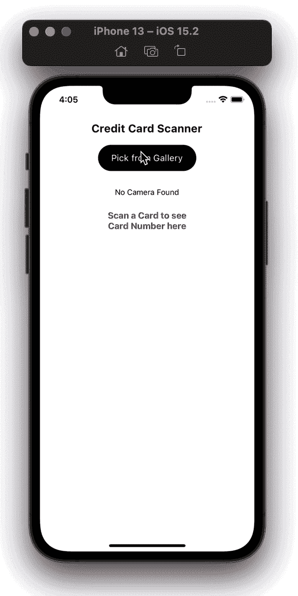
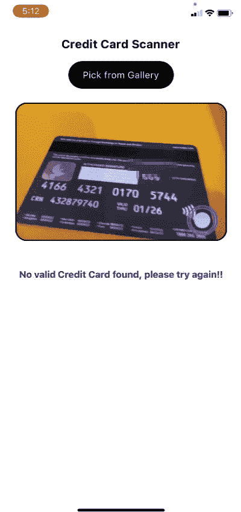

# 如何用 React Native - LogRocket Blog 构建一个信用卡扫描器

> 原文：<https://blog.logrocket.com/build-credit-card-scanner-react-native/>

在移动应用程序中，用户经常通过输入他们的信用卡信息进行购物。我们可能都有过在智能手机上手动输入这 16 位数字的令人沮丧的经历。

许多应用程序正在增加自动化来简化这一过程。因此，要输入支付细节，用户可以拍摄他们的信用卡照片，或者从他们设备的照片库中上传照片。很酷，对吧？

在本文中，我们将学习如何使用[文本识别 API](https://developers.google.com/ml-kit/vision/text-recognition) 在 React 本机应用程序中实现类似的功能，这是一个基于 ML 工具包的 API，可以识别任何基于拉丁语的字符集。我们将使用设备上的文本识别 API，并涵盖以下内容:

您可以在这个 [GitHub 资源库](https://github.com/hrupesh/RNCardScanner)中找到本教程的完整代码。我们最终的用户界面看起来会像下面的 gif:




## 创建新的 React 本机项目

首先，我们将创建一个新的 React 本地项目。如果您想在现有项目中添加信用卡扫描功能，可以跳过这一部分。

在您的首选文件夹目录中，在您的终端中运行以下命令来创建一个新的 React 本地项目:

```
npx react-native init <project-name> --template react-native-template-typescript

```

在您首选的 IDE 中打开项目，并用下面的代码替换`App.tsx`文件中的代码:

```
import React from 'react';
import {SafeAreaView, Text} from 'react-native';

const App: React.FC = () => {
  return (
    <SafeAreaView>
      <Text>Credit Card Scanner</Text>
    </SafeAreaView>
  );
};

export default App;

```

现在，让我们运行应用程序。对于 iOS，我们需要在构建项目之前安装 pods:

```
cd ios && pod install && cd ..
```

然后，我们可以构建 iOS 项目:

```
yarn ios
```

对于 Android，我们可以直接构建项目:

```
yarn android
```

上面的步骤将启动[地铁服务器](https://developers.facebook.com/blog/post/2021/11/01/eli5-metro-javascript-bundler-react-native/)以及 iOS 和 Android 模拟器，然后在上面运行应用程序。目前，上面的代码在`App.tsx`中，我们只会看到一个空白的屏幕，上面显示着文本`Credit Card Scanner`。

## 什么是 react-native-cardscan？

react-native-cardscan 是围绕 [CardScan](https://docs.getbouncer.com/) 的包装器库，这是一个用于扫描借记卡和信用卡的极简库。react-native-cardscan 为 react 本机应用程序中的信用卡扫描提供了简单的即插即用用法。但是，在撰写本文时，react-native-cardscan 已不再被维护，并且已被弃用。Stripe 正在将 react-native-cardscan 集成到自己的移动应用支付解决方案中[。您可以在 GitHub](https://blog.logrocket.com/exploring-the-new-stripe-react-native-sdk/) 上查看[新的资源库，然而，在撰写本文时，它仍在开发中。](https://github.com/stripe/stripe-android/tree/master/stripecardscan)

由于这个库已经过时，我们将使用[react-native-text-recognition](https://www.npmjs.com/package/react-native-text-recognition)创建我们自己的定制信用卡扫描逻辑。

## 集成反应式原生文本识别

[react-native-text-recognition](https://www.npmjs.com/package/react-native-text-recognition)是一个围绕 iOS 上的 Vision 框架和 Android 上的 Firebase ML 构建的包装器库。如果您在生产应用程序中实现卡片扫描，我建议您为文本识别创建自己的本机模块。然而，为了本教程的简单，我将使用这个库。

让我们编写扫描信用卡的代码。在我们集成文本识别之前，让我们添加我们需要的其他助手库，[react-native-vision-camera](https://github.com/mrousavy/react-native-vision-camera)和[react-native-image-crop-picker](https://www.npmjs.com/package/react-native-image-crop-picker)。我们将使用这些库分别从我们设备的摄像头捕捉照片和从手机图库中选取图像:

```
yarn add react-native-image-crop-picker react-native-vision-camera
// Install pods for iOS
cd ios && pod install && cd ..

```

如果您使用的是 React Native v 0.69 或更高版本，react-native-vision-camera 将不会构建，因为在较新的架构中进行了更改。请按照此 [PR](https://github.com/mrousavy/react-native-vision-camera/pull/1109) 中的变化进行解析。

既然已经安装了我们的助手依赖项，让我们安装 react-native-text-recognition:

```
yarn add react-native-text-recognition
pod install

```

设置好依赖关系后，让我们开始编写代码。将以下代码添加到`App.tsx`以实现图像拾取功能:

```
....
<key>NSPhotoLibraryUsageDescription</key>
<string>Allow Access to Photo Library</string>
....
```

我们还需要在 iOS 上访问用户照片库的权限。为此，将下面的代码添加到您的 iOS 项目的`info.plist`文件中:

```
import React from 'react';
import {SafeAreaView, Text, StatusBar, Pressable} from 'react-native';
import ImagePicker, {ImageOrVideo} from 'react-native-image-crop-picker';

const App: React.FC = () => {

  const pickAndRecognize: () => void = useCallback(async () => {
    ImagePicker.openPicker({
      cropping: false,
    })
      .then(async (res: ImageOrVideo) => {
        console.log('res:', res);
      })
      .catch(err => {
        console.log('err:', err);
      });
  }, []);

  return (
    <SafeAreaView style={styles.container}>
      <StatusBar barStyle={'dark-content'} />
      <Text style={styles.title}>Credit Card Scanner</Text>
      <Pressable style={styles.galleryBtn} onPress={pickAndRecognize}>
        <Text style={styles.btnText}>Pick from Gallery</Text>
      </Pressable>
    </SafeAreaView>
  );
};

const styles = StyleSheet.create({
  container: {
    flex: 1,
    alignItems: 'center',
    backgroundColor: '#fff',
  },
  title: {
    fontSize: 20,
    fontWeight: '700',
    color: '#111',
    letterSpacing: 0.6,
    marginTop: 18,
  },
  galleryBtn: {
    paddingVertical: 14,
    paddingHorizontal: 24,
    backgroundColor: '#000',
    borderRadius: 40,
    marginTop: 18,
  },
  btnText: {
    fontSize: 16,
    color: '#fff',
    fontWeight: '400',
    letterSpacing: 0.4,
  },
});

export default App;

```

在上面的代码中，我们向视图添加了一些文本和样式，但主要部分是我们声明了`pickAndRecognize`函数的地方。请记住，我们在这个函数中没有做任何与识别相关的事情；我们将其命名为这个，因为稍后我们将在这个函数中添加`Text Recognition`逻辑。

目前，上面代码的输出如下所示:


现在，我们能够从用户的照片库中挑选图像。让我们添加从相机捕捉图像并在 UI 上查看相机预览的功能。

将以下代码添加到您的`App.tsx` return 语句中:

```
// Export the asset from a file like this or directly use it.
import {Capture} from './assets/icons'; 
....
<SafeAreaView style={styles.container}>
      ....
      {device && hasPermissions ? (
        <View>
          <Camera
            photo
            enableHighQualityPhotos
            ref={camera}
            style={styles.camera}
            isActive={true}
            device={device}
          />
          <Pressable
            style={styles.captureBtnContainer}
            // We will define this method later
            onPress={captureAndRecognize}>
            <Image source={Capture} />
          </Pressable>
        </View>
      ) : (
        <Text>No Camera Found</Text>
      )}
</SafeAreaView>

```

添加相关样式:

```
const styles = StyleSheet.create({
....
  camera: {
    marginVertical: 24,
    height: 240,
    width: 360,
    borderRadius: 20,
    borderWidth: 2,
    borderColor: '#000',
  },
  captureBtnContainer: {
    position: 'absolute',
    bottom: 28,
    right: 10,
  },
....
});

```

我们还需要创建一些状态变量和引用:

```
const App: React.FC = () => {
  const camera = useRef<Camera>(null);
  const devices = useCameraDevices();
  let device: any = devices.back;
  const [hasPermissions, setHasPermissions] = useState<boolean>(false);
  ....
}

```

我们在相机视图上显示一个`Image`来选择图片。你可以继续[下载资产](https://icons8.com/icons/set/capture)。

在我们预览摄像头之前，我们需要添加访问设备摄像头的权限。为此，将以下字符串添加到您的 iOS 项目的`info.plist`文件中:

```
....
<key>NSCameraUsageDescription</key>
<string>Allow Access to Camera</string>
....

```

对于 Android，将下面的代码添加到您的`AndroidManifest.xml`文件中:

```
....
    <uses-permission android:name="android.permission.CAMERA"/>
....

```

当我们的应用程序加载后，我们需要向用户请求权限。让我们编写代码来实现这一点。将以下代码添加到您的`App.tsx`文件中:

```
....
  useEffect(() => {
    (async () => {
      const cameraPermission: CameraPermissionRequestResult =
        await Camera.requestCameraPermission();
      const microPhonePermission: CameraPermissionRequestResult =
        await Camera.requestMicrophonePermission();
      if (cameraPermission === 'denied' || microPhonePermission === 'denied') {
        Alert.alert(
          'Allow Permissions',
          'Please allow camera and microphone permission to access camera features',
          [
            {
              text: 'Go to Settings',
              onPress: () => Linking.openSettings(),
            },
            {
              text: 'Cancel',
            },
          ],
        );
        setHasPermissions(false);
      } else {
        setHasPermissions(true);
      }
    })();
  }, []);
....

```

现在，我们的应用程序用户界面中有了一个可用的摄像头视图:


现在我们的相机视图已经工作了，让我们添加代码来从相机中捕捉图像。

还记得我们想要从捕获按钮触发的`captureAndRecognize`方法吗？现在来定义一下。在`App.tsx`中添加下面的方法声明:

```
....
  const captureAndRecognize = useCallback(async () => {
    try {
      const image = await camera.current?.takePhoto({
        qualityPrioritization: 'quality',
        enableAutoStabilization: true,
        flash: 'on',
        skipMetadata: true,
      });
      console.log('image:', image);
    } catch (err) {
      console.log('err:', err);
    }
  }, []);
....

```

类似于`pickAndRecognize`方法，我们还没有在这个方法中添加信用卡识别逻辑。我们将在下一步中这样做。

## 书写卡号识别逻辑

我们现在能够从设备的照片库和相机中获取图像。现在，我们需要编写逻辑，它将执行以下操作:

*   将一个图像作为输入，并返回该图像中识别的所有文本的字符串数组
*   遍历数组中返回的字符串，检查每一项是否是潜在的信用卡号
*   如果我们找到一个信用卡号码，我们将返回该字符串和显示
*   如果我们没有找到任何匹配的字符串，那么我们显示一个错误，显示`No Valid Credit Card Found`

步骤非常简单。我们来写方法:

```
const findCardNumberInArray: (arr: string[]) => string = arr => {
  let creditCardNumber = '';
  arr.forEach(e => {
    let numericValues = e.replace(/\D/g, '');
    const creditCardRegex =
      /^(?:4\[0-9]{12}(?:[0-9]{3})?|[25\][1-7]\[0-9]{14}|6(?:011|5[0-9\][0-9])\[0-9]{12}|3[47\][0-9]{13}|3(?:0\[0-5]|[68\][0-9])[0-9]{11}|(?:2131|1800|35\d{3})\d{11})$/;
    if (creditCardRegex.test(numericValues)) {
      creditCardNumber = numericValues;
      return;
    }
  });
  return creditCardNumber;
};

const validateCard: (result: string[]) => void = result => {
    const cardNumber = findCardNumberInArray(result);
    if (cardNumber?.length) {
      setProcessedText(cardNumber);
      setCardIsFound(true);
    } else {
      setProcessedText('No valid Credit Card found, please try again!!');
      setCardIsFound(false);
    }
};

```

在上面的代码中，我们写了两个方法，`validateCard`和`findCardNumberInArray`。`validateCard`方法接受一个`string[]`参数或一个字符串数组。然后，它将该数组传递给`findCardNumberInArray`方法。如果在数组中找到信用卡号码字符串，此方法将返回它。否则，它返回一个空字符串。

然后，我们检查在`cardNumber`变量中是否有一个字符串。如果是，我们设置一些状态变量，否则，我们设置状态变量来显示一个错误。

让我们看看`findCardNumberInArray`方法是如何工作的。这个方法也接受一个`string[]`的参数。然后，它遍历数组中的`each`元素，并从字符串中去除所有非数值。最后，它用一个`regex`检查字符串，这个字符串检查一个字符串是否是一个有效的信用卡号。

如果字符串匹配`regex`，那么我们从方法中返回该字符串作为信用卡号。如果没有匹配`regex`的字符串，那么我们返回一个空字符串。

您还会注意到，我们还没有在代码中声明这些新的状态变量。让我们现在做那件事。将以下代码添加到您的`App.tsx`文件中:

```
....
  const [processedText, setProcessedText] = React.useState<string>(
    'Scan a Card to see\nCard Number here',
  );
  const [isProcessingText, setIsProcessingText] = useState<boolean>(false);
  const [cardIsFound, setCardIsFound] = useState<boolean>(false);
....

```

现在，我们只需要在代码中插入`validateCard`方法。用下面各自的代码编辑您的`pickAndRecognize`和`captureAndRecognize`方法:

```
....
  const pickAndRecognize: () => void = useCallback(async () => {
    ....
      .then(async (res: ImageOrVideo) => {
        setIsProcessingText(true);
        const result: string[] = await TextRecognition.recognize(res?.path);
        setIsProcessingText(false);
        validateCard(result);
      })
      .catch(err => {
        console.log('err:', err);
        setIsProcessingText(false);
      });
  }, []);

  const captureAndRecognize = useCallback(async () => {
    ....
      setIsProcessingText(true);
      const result: string[] = await TextRecognition.recognize(
        image?.path as string,
      );
      setIsProcessingText(false);
      validateCard(result);
    } catch (err) {
      console.log('err:', err);
      setIsProcessingText(false);
    }
  }, []);
....

```

就这样，我们结束了！我们只需要在我们的 UI 中显示输出。为此，将下面的代码添加到您的`App.tsx` return 语句中:

```
....
      {isProcessingText ? (
        <ActivityIndicator
          size={'large'}
          style={styles.activityIndicator}
          color={'blue'}
        />
      ) : cardIsFound ? (
        <Text style={styles.creditCardNo}>
          {getFormattedCreditCardNumber(processedText)}
        </Text>
      ) : (
        <Text style={styles.errorText}>{processedText}</Text>
      )}
....

```

如果正在进行文本处理，上面的代码会显示一个`ActivityIndicator`或 loader。如果我们找到了一张信用卡，它会以文本形式显示出来。您还会注意到我们使用了一个`getFormattedCreditCardNumber`方法来呈现文本。接下来我们再写。如果所有条件都是`false`，那么这意味着我们有一个错误，所以我们用错误样式显示文本。

现在我们来声明`getFormattedCreditCardNumber`方法。将以下代码添加到您的`App.tsx`文件中:

```
....

const getFormattedCreditCardNumber: (cardNo: string) => string = cardNo => {
  let formattedCardNo = '';
  for (let i = 0; i < cardNo?.length; i++) {
    if (i % 4 === 0 && i !== 0) {
      formattedCardNo += ` • ${cardNo?.[i]}`;
      continue;
    }
    formattedCardNo += cardNo?.[i];
  }
  return formattedCardNo;
};
....

```

上面的方法有一个参数`cardNo`，它是一个`string`。然后，它遍历`cardNo`，并在每四个字母后插入一个`•`字符。这只是一个格式化信用卡号码字符串的实用函数。

我们的最终输出用户界面将如下所示:



## 结论

在本文中，我们学习了如何通过添加信用卡扫描功能来改进我们的移动应用程序。使用[react-native-text-recognition](https://www.npmjs.com/package/react-native-text-recognition)库，我们设置我们的应用程序从我们设备的摄像头捕捉照片，并从 phone gallery 中选取图像，识别 16 位信用卡号码。

文本识别不仅仅局限于信用卡扫描。您可以使用它来解决许多其他的业务问题，比如为特定的任务(如收据、名片等等)自动输入数据！感谢您的阅读。我希望你喜欢这篇文章，如果你有任何问题，一定要留下评论。

## [LogRocket](https://lp.logrocket.com/blg/react-native-signup) :即时重现 React 原生应用中的问题。

[](https://lp.logrocket.com/blg/react-native-signup)

[LogRocket](https://lp.logrocket.com/blg/react-native-signup) 是一款 React 原生监控解决方案，可帮助您即时重现问题、确定 bug 的优先级并了解 React 原生应用的性能。

LogRocket 还可以向你展示用户是如何与你的应用程序互动的，从而帮助你提高转化率和产品使用率。LogRocket 的产品分析功能揭示了用户不完成特定流程或不采用新功能的原因。

开始主动监控您的 React 原生应用— [免费试用 LogRocket】。](https://lp.logrocket.com/blg/react-native-signup)