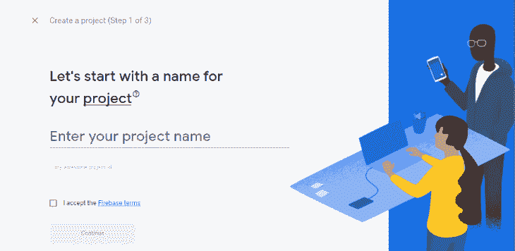
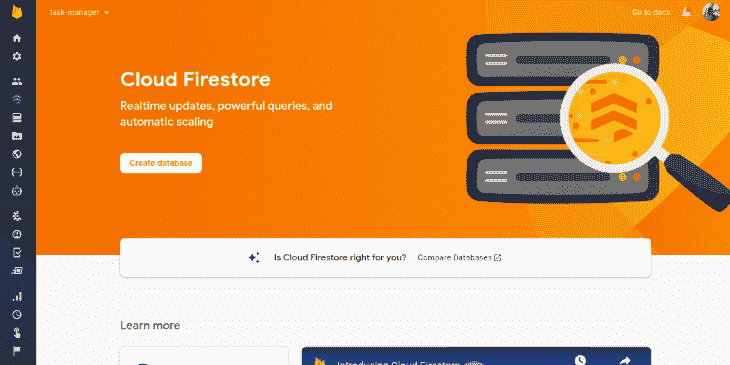
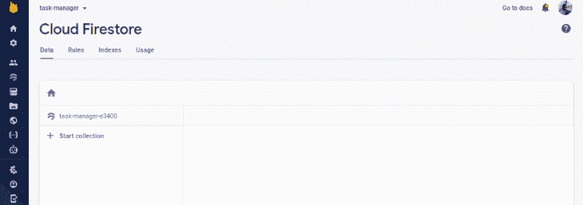
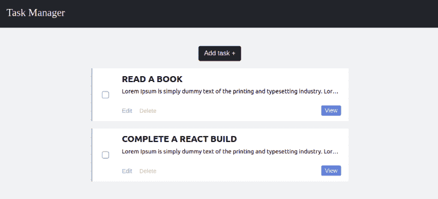
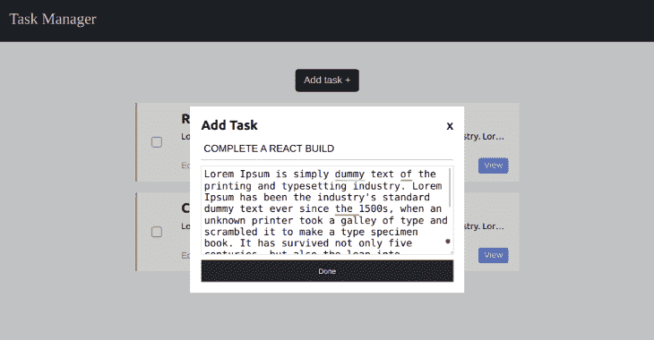
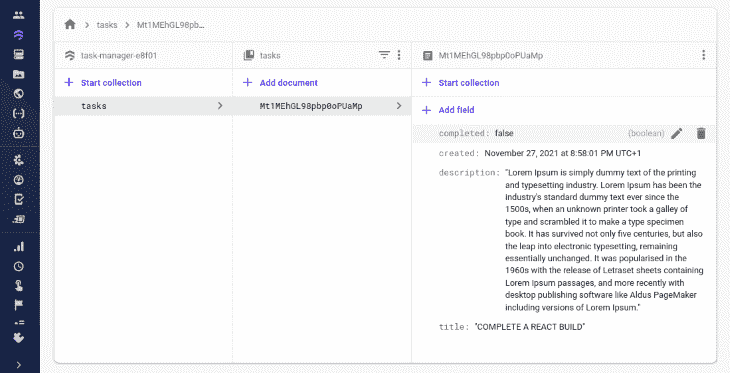
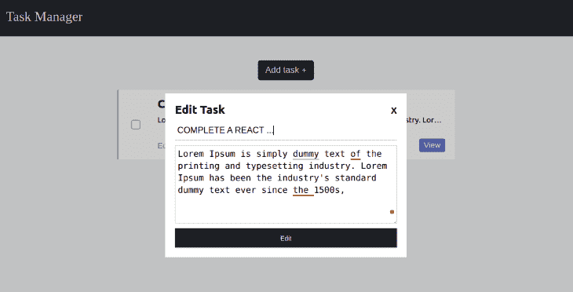
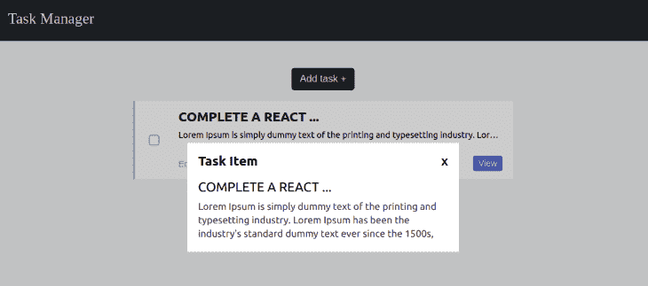

# 在 React with Firebase Web SDK v9 中构建 CRUD 应用程序

> 原文：<https://blog.logrocket.com/build-crud-application-react-firebase-web-sdk-v9/>

[Firebase v.9 SDK](https://firebase.googleblog.com/2021/08/deep-dive-into-the-new-firebase-js-sdk-design.html) 引入了遵循模块化方法的新 API surface，导致其服务的使用发生了变化，其中之一就是 [Firestore 数据库](https://firebase.google.com/docs/firestore)。现在我们面临的挑战是重新学习如何在数据库中执行 CRUD 之类的操作。

在本教程中，我们将介绍如何通过构建任务管理器在 Firestore 中执行 CRUD 操作。

您可以[在此](https://tammibriggs-task-manager.netlify.app/)查看演示应用。本教程的代码可在 [GitHub](https://github.com/Tammibriggs/Task-manager) 上获得。

为了跟随本教程，你应该熟悉[反应](https://blog.logrocket.com/tag/react/)、[反应钩子](https://blog.logrocket.com/underrated-react-hooks-youre-missing-out-on/)和 [Firebase v8](https://firebase.google.com/support/releases) 。您还应该在计算机上安装 Node.js。

## 制造风暴

在开始使用 Firestore 服务之前，我们需要首先在 Firebase 上创建一个项目和一个数据库。

### 添加项目

Firebase 中的项目是我们应用程序的容器。它让我们能够跨平台(例如，Android、iOS 和 web)共享数据和分析，因此无论用户使用什么设备，都可以获得相同的体验。

要添加项目，请确保您登录到您的谷歌帐户，然后导航到 [Firebase 控制台](https://console.firebase.google.com/)并点击**添加项目**。我们应该看到这样一个页面:



输入项目名称——在本教程中，我们称之为“任务管理器”,然后接受 Firebase 条款并单击**继续**。我们将被提示启用谷歌分析。本教程不需要谷歌分析，但让它开着也没什么坏处。

完成添加项目的所有步骤后，我们将被重定向到我们的项目页面:


这样，我们成功地创建了我们的 Firebase 项目。

### 创建数据库

在侧边栏上，单击 **Firestore 数据库**图标导航至云 Firestore 页面。



点击**创建数据库**按钮，将出现提示，要求在生产或测试模式下启动数据库。


选择**开始测试模式**，点击**下一步**。然后，在下一个屏幕上，点击**启用。**完成这些步骤后，我们将创建一个空数据库。



## 设置 React

我已经创建了一个任务管理器模板，所以我们可以专注于添加 CRUD 功能。

下一步是克隆 GitHub repo。我们可以使用以下命令来实现这一点:

```
$ git clone -b starter https://github.com/Tammibriggs/Task-manager.git

$ cd Task-manager

$ npm install

```

在我们克隆的 starter repo 中，我还在`package.json`文件的依赖对象中包含了`"firebase": "9.5.0"`。因此，通过运行`npm install`命令，Firebase v9 以及所有其他依赖项将被安装。

现在，当我们用`$ npm start`启动应用程序时，我们应该会在浏览器中看到这个页面:



请随意浏览应用程序，感受一下我们将要做的工作。

## 将 Firebase 集成到我们的 React 应用程序中

为了将 Firebase 集成到我们的 react 应用程序中，我们需要首先获得 web 配置对象，然后使用它来初始化 React 应用程序中的 Firebase。

在我们的 Firebase 项目页面上，我们应该会看到几个图标:


单击 web ( **< / >** )图标，为 web 配置 Firebase 项目。我们应该看到这样一个页面:


为 web 应用程序命名。对于本教程，我们将其命名为**任务管理器**。点击**注册应用**按钮进入下一步，我们的`firebaseConfig`对象展现在我们面前:


将配置复制到剪贴板；我们稍后将需要它来初始化 Firebase。然后点击**继续操控**完成该过程。

现在，让我们初始化 Firebase，这样我们就可以开始在我们的应用程序中使用 Firestore。

在 React 应用程序的`src`目录中，创建一个`firebase.js`文件并添加以下导入:

```
// JavaScript
// src/firebase.js
import { initializeApp } from "firebase/app"
import { getFirestore } from "firebase/firestore"

```

现在，在导入之后粘贴我们之前复制的配置，并添加以下代码行来初始化 Firebase 和 Firestore:

```
// JavaScript
// src/firebase.js
const app = initializeApp(firebaseConfig)
const db = getFirestore(app)

export {db}

```

我们的`firebase.js`文件现在应该看起来像这样:

```
// JavaScript
// src.firebase.js
import { initializeApp } from "firebase/app"
import { getFirestore } from "firebase/firestore"

const firebaseConfig = {
  apiKey: "API_KEY",
  authDomain: "AUTH_DOMAIN",
  projectId: "PROJECT_ID",
  storageBucket: "STORAGE_BUCKET",
  messagingSenderId: "MESSAGING_SENDER_ID",
  appId: "APP_ID"
}

// Initialize Firebase and Firestore
const app = initializeApp(firebaseConfig)
const db = getFirestore(app)
export {db}

```

我们现在可以开始在应用程序中使用 Firestore 了。

## 示例:在 React with Firebase 中构建任务管理器

由于我们已经有了任务管理器应用程序的模板，我们将重点关注 CRUD 功能的实现，它们是:

*   向火焰风暴添加新任务
*   从火焰风暴中获取所有任务
*   更新任务
*   删除任务

### 向 Firestore 添加新任务

我们应用程序中的一个任务包含一个`title`、`description`和一个`checkbox`，它们将用于确定一个任务是否完成。因此，要添加一个新任务，我们需要在 Firestore 中创建一个包含这些字段的文档。

在 Firebase v9 中，我们可以使用`addDoc`或`setDoc`函数来添加新文档。这类似于 Firebase v8 中的`add`和`set`。然而，由于我们希望每个文档使用一个自动生成的 ID，我们将使用`addDoc`函数。

在`src`目录中，浏览`AddTask.js`文件并添加以下导入:

```
// JavaScript
// src/AddTask.js
import {db} from './firebase'
import {collection, addDoc, Timestamp} from 'firebase/firestore'

```

这里，我们已经导入了`db`，一个 Firestore 实例，`collection`，它将用于创建对我们所有任务的引用，`addDoc`函数，以及用于设置任务创建时间的`Timestamp`。

* * *

### 更多来自 LogRocket 的精彩文章:

* * *

现在，让我们使用导入的这些函数来创建向 Firestore 添加新任务的功能。在`/*function to add new task to firestore*/`注释后添加以下代码行:

```
// JavaScript
// src/AddTask.js
...
/* function to add new task to firestore */
const handleSubmit = async (e) => {
   e.preventDefault()
   try {
     await addDoc(collection(db, 'tasks'), {
       title: title,
       description: description,
       completed: false,
       created: Timestamp.now()
     })
     onClose()
   } catch (err) {
     alert(err)
   }
 }
...

```

这里，我们创建了一个异步函数，使用`addDoc`向`tasks`集合添加一个新文档。新创建的文档将有一个标题和描述字段，其值从 state 获得；一个已完成的字段，我们将根据任务是否已完成将其设置为 true 或 false 和一个 created 字段，将其值设置为新文档添加到数据库的时间。

为了让这个功能开始工作，我们必须在提交`addTask`表单时调用`handleSubmit`函数。

为此，修改`addTask`表单的开始标记，如下所示:

```
// JavaScript
// src/AddTask.js
<form onSubmit={handleSubmit} className='addTask' name='addTask'>

```

就是这样！我们现在能够向数据库添加新任务。为了测试这一点，在我们的任务管理器应用中，点击**添加任务+** 按钮并填写表格。



然后，点击**完成**。由于我们没有用 Firestore 的数据替换我们的实体模型，我们的应用程序 UI 不会改变。但是当我们转到我们之前创建的 Firebase 项目中的 Cloud Firestore 时，我们会看到添加了一个`tasks`集合和一个新文档。



### 实时获取所有任务

我们可以在 Firebase v9 中通过使用`onSnapshot`函数来实现这一点。这个函数接受两个参数。第一个参数可以是对集合或文档的引用，也可以是一个查询。第二个参数是一个回调，它实时返回数据库的快照。

现在，让我们使用该功能来实时收听`tasks`集合。

在`src`目录中，转到`TaskManager.js`文件并添加以下导入:

```
// JavaScript
// src/TaskManager
import {useState, useEffect} from 'react'
import {collection, query, orderBy, onSnapshot} from "firebase/firestore"
import {db} from './firebase'

```

接下来，让我们创建一个保存从数据库接收的所有任务的状态。在`openAddModal`状态后添加以下代码行:

```
// JavaScript
// src/TaskManager
....
const [openAddModal, ...
const [tasks, setTasks] = useState([])

...

```

现在，让我们添加一个`useEffect`，它将在组件挂载时调用`onSnapshot`函数。在`/* function to get all tasks from firestore in realtime */`注释后添加以下代码行:

```
// JavaScript
// src/TaskManager.js
...

/* function to get all tasks from firestore in realtime */
useEffect(() => {
  const q = query(collection(db, 'tasks'), orderBy('created', 'desc'))
  onSnapshot(q, (querySnapshot) => {
    setTasks(querySnapshot.docs.map(doc => ({
      id: doc.id,
      data: doc.data()
    })))
  })
},[])

...

```

Firebase v9 公开了一个名为`query`的新函数，用于指定我们希望从一个集合或集合组中检索哪些文档。

在上面的代码中，我们使用了`query`函数来指定我们想要按照使用`orderBy`函数创建文档的降序来检索`tasks`集合中的所有文档。我们将查询传递给`onSnapshot`函数，该函数返回一个映射并存储在`task`状态中的`querySnapshot`。

现在，让我们用从 Firestore 获得的数据替换我们的实体模型数据。在`TaskManager.js`组件的底部，用下面几行代码替换我们呈现的两个`Task`组件:

```
// JavaScript
// src/TaskManager.js
...
{tasks.map((task) => (
  <Task
    id={task.id}
    key={task.id}
    completed={task.data.completed}
    title={task.data.title} 
    description={task.data.description}
  />
))}
...

```

添加上述代码后，`TaskManager.js`文件将如下所示:

```
// JavaScript
// src/TaskManager.js
import './taskManager.css'
import Task from './Task'
import AddTask from './AddTask'
import {useState, useEffect} from 'react'
import {collection, query, orderBy, onSnapshot} from "firebase/firestore"
import {db} from './firebase'

function TaskManager() {
  const [openAddModal, setOpenAddModal] = useState(false)
  const [tasks, setTasks] = useState([])

  /* function to get all tasks from firestore in realtime */ 
  useEffect(() => {
    const q = query(collection(db, 'tasks'), orderBy('created', 'desc'))
    onSnapshot(q, (querySnapshot) => {
      setTasks(querySnapshot.docs.map(doc => ({
        id: doc.id,
        data: doc.data()
      })))
    })
  },[])

  return (
    <div className='taskManager'>
      <header>Task Manager</header>
      <div className='taskManager__container'>
        <button 
          onClick={() => setOpenAddModal(true)}>
          Add task +
        </button>
        <div className='taskManager__tasks'>
        {tasks.map((task) => (
          <Task
            id={task.id}
            key={task.id}
            completed={task.data.completed}
            title={task.data.title} 
            description={task.data.description}
          />
        ))}
        </div>
      </div>
      {openAddModal &&
        <AddTask onClose={() => setOpenAddModal(false)} open={openAddModal}/>
      }
    </div>
  )
}

export default TaskManager

```

现在，当我们转到我们的任务管理器应用程序时，我们会注意到我们之前添加到 Firestore 的任务已经显示出来。


### 更新 Firestore 中的任务

在我们的应用程序中，任务可以通过两种方式更新。一种是通过编辑任务的标题或描述，另一种是通过单击表示任务已完成的复选框。

我们将为此使用的第一个函数是`updateDoc`函数。这个函数将允许我们更新文档的一些字段，而不用覆盖整个文档。它接受两个参数:第一个是对正在更新的文档的引用，第二个是对文档字段的更新。

让我们从创建更新任务标题和描述的功能开始。在`src`中，转到`EditTask.js`文件并添加以下导入:

```
// JavaScript
// src/EditTask.js
import { doc, updateDoc } from "firebase/firestore";
import {db} from './firebase'

```

接下来，我们将添加一个函数，该函数将在被调用时调用`updateDoc`函数。在`/* function to update document in firestore */`注释后添加以下代码行:

```
// JavaScript
// src/EditTask.js
...
/* function to update document in firestore */
const handleUpdate = async (e) => {
  e.preventDefault()
  const taskDocRef = doc(db, 'tasks', id)
  try{
    await updateDoc(taskDocRef, {
      title: title,
      description: description
    })
    onClose()
  } catch (err) {
    alert(err)
  }    
}
...

```

这里，我们使用`doc`函数创建了一个对我们想要在 Firestore 中编辑的文档的引用。然后，我们将该引用传递给`updateDoc`函数，以及我们希望对文档字段进行的更新，这些更新是从 state 获得的。

现在，我们需要在提交`updateTask`表单时调用`handleUpdate`函数。为此，修改`updateTask`表单的开始标记，如下所示:

```
// JavaScript
// src/EditTask.js
<form onSubmit={handleUpdate} className='editTask' name='updateTask'>

```

这样，我们现在就可以在应用程序中编辑任务了。为了测试这一点，在任务管理器应用程序中，点击**编辑**按钮，并对任务的描述和标题进行一些更改。



然后，点击**编辑**。我们的应用程序会立即更新任务，因为我们正在实时获取数据。

要查看我们对任务所做的更改，请单击**查看**按钮。



现在，让我们添加当复选框被单击时在 Firestore 中更新文档的功能。

请记住，当我们向 Firestore 添加一个任务时，我们还包含了一个`completed`，默认情况下我们将其设置为`false`，表示任务尚未完成。当复选框被选中时，我们希望`completed`字段的值为`true`，反之亦然。

在`src`目录中，转到`Task.js`文件并添加以下导入:

```
// JavaScript
// src/Task.js
import { doc, updateDoc } from "firebase/firestore";
import {db} from './firebase'

```

现在，在`/* function to update document in firestore */`注释后添加以下代码行:

```
// JavaScript
// src/Task.js
...
/* function to update document in firestore */
const handleCheckedChange = async () => {
  const taskDocRef = doc(db, 'tasks', id)
  try{
    await updateDoc(taskDocRef, {
      completed: checked
    })
  } catch (err) {
    alert(err)
  }
}
...

```

为此，我们必须向复选框输入添加一个`onChange`事件来调用`handleCheckedChange`函数。

修改**复选框**输入，离 return 语句两行。它现在应该是这样的:

```
// JavaScript
// src/Task.js
<input 
  id={`checkbox-${id}`} 
  className='checkbox-custom'
  name="checkbox" 
  checked={checked}
  onChange={handleCheckedChange}
  type="checkbox" />

```

如果我们转到我们的应用程序，选中复选框，并刷新页面，我们会注意到复选框仍然被选中。

### 在 Firstore 中删除任务

对于删除操作，我们将使用`deleteDoc`函数，它使用起来相当简单。我们所要做的就是将我们想要删除的文档的引用传递给这个函数，瞧！它不见了。

要创建删除任务的功能，通常，第一步是进行必要的导入。在`src`目录中，浏览`Task.js`文件并修改`import { doc, updateDoc } from "firebase/firestore";`,如下所示:

```
// JavaScript
// src/Task.js
import { doc, updateDoc, deleteDoc} from "firebase/firestore";

```

现在，在`/* function to delete a document from firstore */`注释后添加以下代码行:

```
// JavaScript
// src/Task.js
/* function to delete a document from firstore */ 
  const handleDelete = async () => {
    const taskDocRef = doc(db, 'tasks', id)
    try{
      await deleteDoc(taskDocRef)
    } catch (err) {
      alert(err)
    }
  }

```

最后，我们给删除按钮添加一个`[onClick](https://blog.logrocket.com/a-guide-to-react-onclick-event-handlers-d411943b14dd/)`事件来调用`handleDelete`函数。

浏览`Task`组件的返回语句。我们会看到删除按钮，它有一个`task__deleteButton`的`className`。将按钮修改为如下所示:

```
// JavaScript
// src/Task.js
<button className='task__deleteButton' onClick={handleDelete}>Delete</button>

```

现在，如果我们点击应用程序中某个任务的删除按钮，该任务将从 Firestore 中删除。

至此，我们完成了 CRUD 应用程序的构建，一切都将完美运行。

## 结论

在本教程中，我们介绍了如何在 Firebase v9 中执行 CRUD 操作。希望在这一点上，你知道如何在 Firestore 上使用新的 Firebase 库进行基本操作。

如果你还有任何问题，欢迎在下面的评论区提出。

## 使用 LogRocket 消除传统反应错误报告的噪音

[LogRocket](https://lp.logrocket.com/blg/react-signup-issue-free)

是一款 React analytics 解决方案，可保护您免受数百个误报错误警报的影响，只针对少数真正重要的项目。LogRocket 告诉您 React 应用程序中实际影响用户的最具影响力的 bug 和 UX 问题。

[ ](https://lp.logrocket.com/blg/react-signup-general) [  ](https://lp.logrocket.com/blg/react-signup-general) [LogRocket](https://lp.logrocket.com/blg/react-signup-issue-free)

自动聚合客户端错误、反应错误边界、还原状态、缓慢的组件加载时间、JS 异常、前端性能指标和用户交互。然后，LogRocket 使用机器学习来通知您影响大多数用户的最具影响力的问题，并提供您修复它所需的上下文。

关注重要的 React bug—[今天就试试 LogRocket】。](https://lp.logrocket.com/blg/react-signup-issue-free)