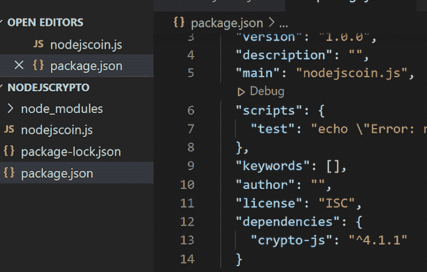

# 用 Node.js 构建加密货币

> 原文：<https://blog.logrocket.com/build-cryptocurrency-node-js-blockchain/>

区块链是在计算机网络的节点之间共享的交易的数字记录，为加密货币和许多分散的应用提供动力。区块链是一个创新的、分散的、分布式的公共分类账，它记录着一个不断增长的交易列表，即所谓的块。

区块链上的交易被加密记录和保护，减少了潜在的缺陷和漏洞。区块链由不同块体链状连接而成，因此得名区块链。

尽管还处于起步阶段，区块链已经在许多行业得到应用，如金融、政府、收藏品、DeFi、安全、艺术品(如 NFTs)等。它也为开发者、内容作者、NFT 创作者等创造了大量的机会和新的工作岗位。在构建分散式应用程序时，区块链非常重要，因为它可以确保安全性和数据完整性，建立对用户的信任。

加密货币是使用加密技术开发的数字安全虚拟货币。密码学确保了货币的安全性和完整性。在本教程中，我们将学习如何使用 Node.js(一个流行的 JavaScript 服务器运行时引擎)开发一种[加密货币。](https://blog.logrocket.com/interacting-smart-contracts-via-nodejs-api/)

Node.js 是一个 JavaScript 后端环境，在浏览器之外运行 JavaScript 代码。在本文中，我们将通过创建一种简单的加密货币向 Node.js 开发人员介绍区块链空间。我们开始吧！

要阅读本文，您需要:

*   安装在计算机上的 Node.js
*   对 Node.js 的基本了解
*   对区块链技术的基本了解
*   代码编辑器

## 目录

## 块的属性

前面我们提到过，区块链是由几个板块组成的。让我们探索一下每个块的属性是什么。链中的每个块都由以下属性组成:

*   工作证明:获得块散列所需的计算工作量
*   块散列:通过加密计算得出的块 ID
*   时间戳:创建块的时间
*   索引:块在链上的位置
*   区块链上记录的数据
*   前一个块的哈希

## 安装依赖项

由于我们正在用 Node.js 构建一个加密货币，我们需要首先在我们的项目文件夹中安装 [JavaScript crypto.js 包](https://www.npmjs.com/package/crypto-js)。创建一个文件夹，命名为`nodejscrypto`，如下图所示:



要安装该软件包，请在终端中运行以下命令:

```
// create a package.json file
npm init -y

//install the crypto-js dependency
npm install crypto-js

```

我们将为这个项目使用单个文件。在项目文件夹中创建一个名为`nodejsCoin.js`的文件，如上图所示。

## 创建我们的第一个块

现在我们已经建立了项目结构并安装了包，让我们创建第一个块，然后构建我们自己的加密货币。继续将下面几行代码复制到`nodejsCoin.js`文件中:

```
//import that secure hash algorithm from the crypto-js package
const SHA256 = require(“crypto-js/sha256”);

//create a JavaScript class to represent a Block
class Block{
  constructor(index, timestamp, data, previousHash){
    this.index = index;
    this.timestamp = timestamp;
    this.data = data;
    this.previousHash = previousHash;
    this.hash = this.generateHash();
  }

  generateHash(){
    return SHA256(this.index + this.timestamp + this.previousHash + JSON.stringify(this.data)).toString()
  }
}

```

首先，我从 crypto-js 包中导入了安全散列算法(SHA256 ),它帮助我们加密块散列 ID。然后，我创建了一个 JavaScript `Block`类来表示链上每个块的模板。

与 JavaScript 和其他面向对象的编程语言(如 Java)一样，每当创建一个类时，默认情况下都会调用构造函数方法。每当使用 new 关键字调用`Block`对象时，我们调用构造函数方法并传递创建新块所需的参数。

在构造函数方法中，我们将参数`arguments`的值分配给字段。`this`关键字表示我们引用了它后面的字段名。最后，我们创建了一个`generateHash()`方法，使用构造函数中定义的属性生成并返回块的散列。现在我们已经创建了我们的第一块，让我们创建区块链。

## 创造区块链

区块链是一个以链状方式记录数据集合的系统，增加数据完整性，减少漏洞，使数据几乎不可能被黑客攻击。

更具体地说，区块链是一个分布式数据库，它将事务存储在称为块的组中。让我们创建一个`blockchain`类来管理块链:

```
class Blockchain{
    constructor(){
        this.blockchain = [this.createGenesisBlock()];
    }
    createGenesisBlock(){
        return new Block(0, "11/04/2022", "first block on the chain", "0");
    }
    getTheLatestBlock(){
        return this.blockchain[this.blockchain.length - 1];
    }
    addNewBlock(newBlock){
        newBlock.previousHash = this.getTheLatestBlock().hash;
        newBlock.hash = newBlock.generateHash();
        this.blockchain.push(newBlock);
    }

    // testing the integrity of the chain
    validateChainIntegrity(){
        for(let i = 1; i<this.blockchain.length; i++){
            const currentBlock = this.blockchain[i];
            const previousBlock = this.blockchain[i-1];
            if(currentBlock.hash !== currentBlock.generateHash()){
                return false;
            }
            if(currentBlock.previousHash !== previousBlock.hash){
                return false;
            }
            return true;

        }
    }
} 

```

从上面的代码片段中，我们创建了一个类`Blockchain`，并调用了无参数构造函数方法，一个没有参数或自变量的构造函数。在构造器块中，我们分配了一个数组，其中包含创建创世块的方法，`createGenesisBlock()`。起源块是区块链中的初始块，您可以将其他块链接到它。您也可以将 genesis 块称为祖先块。

在区块链上创建的每个块总是引用链上的前一个块。但是 genesis 块没有引用，所以我们必须在`createGenesisBlock()`方法中硬编码它的属性。注意我是如何在`Block`构造函数上调用`new`关键字并传递所需的参数来创建一个块的:

*   索引:`0`
*   时间戳:`11/04/2022`
*   数据:`First block on the chain`
*   哈希:`0`

`getTheLastBlock()`方法返回区块链上的最新块，帮助我们跟踪区块链上当前和以前的散列。

下一个方法是`addNewBlock()`方法，它采用一个称为`newBlock`的参数。在方法主体中，链上最新块的散列被设置为等于新块的先前散列。在下一行，我使用`generateHash()`来计算新块的散列，最后将新块推到区块链上，这是一个块数组。

`validateChainIntegrity()`方法检查链的有效性。区块链的一个核心特点是它是不可逆的。如果区块链某个区块的任何信息被篡改，区块链的完整性就会受到影响。`validateChainIntegrity()`方法帮助我们检查区块链的完整性。

我们从索引一`(1)`开始检查，而我们的区块链从索引零`(0)`开始检查 genesis 块，这是硬编码的。在这种方法中，我们遍历区块链，通过检查两个连续块之间的哈希是否指向彼此来检查每个块的有效性。

### 创建一个实例测试我们的区块链

现在，我们将创建一个区块链的实例，我们的硬币，我称之为`logCoin`。你可以给你的孩子起任何名字。编写以下代码:

```
let logCoin = new Blockchain();
console.log("mining logcoin in progress...");
logCoin.addNewBlock(
    new Block(1, "06/04/2022", {
        sender: "Frank Joseph",
        recipient: "LogRocket",
        quantity: 25
    })
);

logCoin.addNewBlock(
    new Block(2, "08/08/2022", {
        sender: "Paul val",
        recipient: "Young A",
        quantity: 34
    })
);

logCoin.addNewBlock(
    new Block(3, "13/08/2022", {
        sender: "Elena",
        recipient: "Mary",
        quantity: 34
    })
);
console.log(JSON.stringify(logCoin, null, 5))

```

现在，在终端中使用以下命令运行代码:

```
node nodejscoin

```

输出应该类似于下图:


在上面的代码片段中，我们创建了一个`blockchain`类的实例，通过它我们可以调用`addNewBlock()`方法。记住，`addNewBlock()`方法需要一个参数，所以我们传递了一个新的块，以`index`、`timestamp`和`data`作为包含以下信息的对象:`sender`、`receiver`和`quantity`。

最后，我们使用 JavaScript `console.log()`打印输出，并使用`JSON.stringify()`方法将输出转换为 JSON 文件，在本例中，该方法有三个参数:

*   `Value = logCoin`:我们要转换成 JSON 的值
*   `Replacer = null`:设置为`null`，获取区块链数组的所有属性
*   `Space = 5`:在数组上的每个对象之间创建空间，使结果输出可读

我们已经成功创建了我们的基础加密货币`logCoin`。完整的代码如下:

```
const SHA256 = require(“crypto-js/sha256”);

//create a JavaScript class to represent a Block
class Block{
  constructor(index, timestamp, data, previousHash){
    this.index = index;
    this.timestamp = timestamp;
    this.data = data;
    this.previousHash = previousHash;
    this.hash = this.generateHash();
  }

  generateHash(){
    return SHA256(this.index + this.timestamp + this.previousHash + JSON.stringify(this.data)).toString()
  }
}

class Blockchain{
    constructor(){
        this.blockchain = [this.createGenesisBlock()];
    }
    createGenesisBlock(){
        return new Block(0, "11/04/2022", "first block on the chain", "0");
    }
    getTheLatestBlock(){
        return this.blockchain[this.blockchain.length - 1];
    }
    addNewBlock(newBlock){
        newBlock.previousHash = this.getTheLatestBlock().hash;
        newBlock.hash = newBlock.generateHash();
        this.blockchain.push(newBlock);
    }

    // testing the integrity of the chain
    validateChainIntegrity(){
        for(let i = 1; i<this.blockchain.length; i++){
            const currentBlock = this.blockchain[i];
            const previousBlock = this.blockchain[i-1];
            if(currentBlock.hash !== currentBlock.generateHash()){
                return false;
            }
            if(currentBlock.previousHash !== previousBlock.hash){
                return false;
            }
            return true;

        }
    }
} 

let logCoin = new Blockchain();
console.log("mining logcoin in progress...");
logCoin.addNewBlock(
    new Block(1, "06/04/2022", {
        sender: "Frank Joseph",
        recipient: "LogRocket",
        quantity: 25
    })
);

logCoin.addNewBlock(
    new Block(2, "08/08/2022", {
        sender: "Paul val",
        recipient: "Young A",
        quantity: 34
    })
);

logCoin.addNewBlock(
    new Block(3, "13/08/2022", {
        sender: "Elena",
        recipient: "Mary",
        quantity: 34
    })
);
console.log(JSON.stringify(logCoin, null, 5))

```

## 结论

至此，我们已经使用 Node.js 成功构建了简单的加密货币。在本教程中，我们学习了区块链的基本概念，演示了如何开发区块，并最终在区块链开发了我们自己的加密货币。

虽然我们的硬币`logCoin`不符合加密货币市场标准，但我们从本教程中获得了作为区块链开发者入门所需的基础知识。我希望你喜欢这篇文章，如果你有任何问题，一定要留下评论。

## 200 只显示器出现故障，生产中网络请求缓慢

部署基于节点的 web 应用程序或网站是容易的部分。确保您的节点实例继续为您的应用程序提供资源是事情变得更加困难的地方。如果您对确保对后端或第三方服务的请求成功感兴趣，

[try LogRocket](https://lp.logrocket.com/blg/node-signup)

.

[](https://lp.logrocket.com/blg/node-signup)[https://logrocket.com/signup/](https://lp.logrocket.com/blg/node-signup)

LogRocket 就像是网络和移动应用程序的 DVR，记录下用户与你的应用程序交互时发生的一切。您可以汇总并报告有问题的网络请求，以快速了解根本原因，而不是猜测问题发生的原因。

## 加入像 Bitso 和 Coinsquare 这样的组织，他们使用 LogRocket 主动监控他们的 Web3 应用

影响用户在您的应用中激活和交易的能力的客户端问题会极大地影响您的底线。如果您对监控 UX 问题、自动显示 JavaScript 错误、跟踪缓慢的网络请求和组件加载时间感兴趣，

[try LogRocket](https://lp.logrocket.com/blg/web3-signup)

.

[](https://lp.logrocket.com/blg/web3-signup)[https://logrocket.com/signup/](https://lp.logrocket.com/blg/web3-signup)

LogRocket 就像是网络和移动应用的 DVR，记录你的网络应用或网站上发生的一切。您可以汇总和报告关键的前端性能指标，重放用户会话和应用程序状态，记录网络请求，并自动显示所有错误，而不是猜测问题发生的原因。

现代化您调试 web 和移动应用的方式— [开始免费监控](https://lp.logrocket.com/blg/web3-signup)。

LogRocket 检测您的应用程序以记录基线性能计时，如页面加载时间、到达第一个字节的时间、慢速网络请求，还记录 Redux、NgRx 和 Vuex 操作/状态。

[Start monitoring for free](https://lp.logrocket.com/blg/node-signup)

.