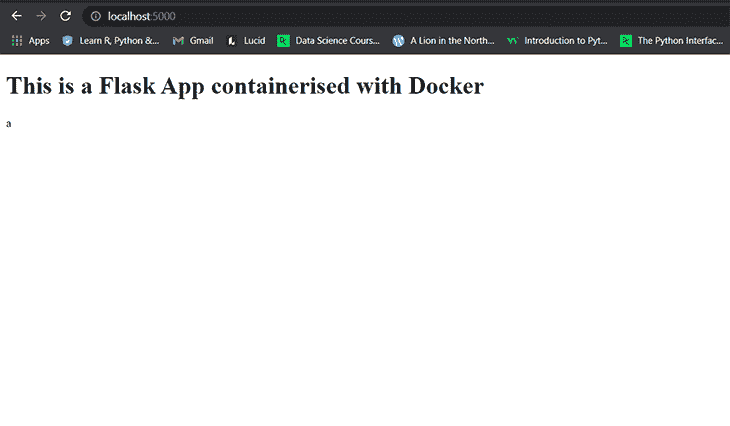

# 使用 Docker 构建和部署 Flask 应用程序

> 原文：<https://blog.logrocket.com/build-deploy-flask-app-using-docker/>

如果您曾经使用 Python 构建过 web 应用程序，那么很可能您使用了一个框架来实现这一点，其中之一可能是 Flask。Flask 是一个基于 Python 编程语言的开源、初学者友好的 web 框架。当你想快速开发一个轻量级代码库的应用时，Flask 是合适的。

Docker 是一个开源工具，它使您能够将应用程序容器化。它有助于在一个隔离的环境中构建、测试、部署和管理您的应用程序，在本文中，除了测试之外，我们将使用它来做任何事情。

## 先决条件

*   您的计算机上安装的 Python 版本≥3.8
*   使用 Flask 和 Python 构建应用程序的工作知识
*   您的机器上至少有 4GB 的内存，以便与 Docker 兼容
*   CLIs 中级知识
*   任何合适的 IDE 或文本编辑器

## 创建烧瓶应用程序

让我们继续创建一个简单的 Flask 应用程序，它在浏览器上呈现一条消息。创建一个名为`flask_docker`的文件夹来包含您的应用程序。

```
mkdir flask_docker
```

接下来，`cd`进入`flask_docker`目录并运行下面的命令来安装 Flask。

```
pip install Flask
```

成功安装 Flask 后，下一步是创建一个 Python 文件，该文件接收并响应应用程序中的请求。创建一个包含以下 Python 代码片段的`view.py`文件:

```
from flask import Flask, render_template
import os

app = Flask(__name__)

@app.route('/')
def home():
    return render_template('index.html')

if __name__ == "__main__":
    port = int(os.environ.get('PORT', 5000))
    app.run(debug=True, host='0.0.0.0', port=port)
```

在上面的代码片段中，`@app.route`注释用于将请求定向到映射的 URL。在本例中，提供的 URL 是`/`，它代表主页。

这个注释还有一个`method`参数，它采用一个 HTTP 方法列表来指定所提供的 URL 允许的方法。默认情况下(如图所示)，`GET`方法是唯一允许的 HTTP 方法。

下面是一个例子，说明如何指定您的路由应该同时允许`GET`和`POST` HTTP 方法:

```
@app.route('/', methods=['POST', 'GET'])
```

当您向该路由发送一个`GET`请求时，绑定到在`@app.route`注释中提供的 URL 的`home()`函数将运行。该函数返回一个对`render_template`的调用，该调用又呈现了`index.html`文件的内容，我们将在下一节中创建该文件。

```
port = int(os.environ.get('PORT', 5000))
app.run(debug=True, host='0.0.0.0', port=port)
```

当我们将这个应用程序部署到 Heroku 时，需要上面的`view.py`文件部分，我们将在下一节中演示。不包括这个会导致你的应用程序在 Heroku 上崩溃。

## HTML 模板

下一步是创建`index.html`文件，并在您调用`view.py`文件中的`home()`函数时提供我们想要在浏览器上呈现的内容。

在根目录中，创建一个`templates`目录，然后创建`index.html`文件。将以下代码片段添加到 HTML 文件中:

```
<!DOCTYPE html>

<html lang="en">
<head>
    <meta charset="UTF-8">
    <title>Flask Docker</title>
</head>
<body>
    <h1>This is a Flask App containerised with Docker</h1>
</body>
</html>
```

## 用 Docker 编写 Python 需求文件

如果您曾经浏览过任何已发布的 Python 项目，您可能会注意到一个`requirement.txt`文件。该文件包含运行项目所需的包和依赖项的列表及其各自的版本。

在根目录中，在终端中运行以下命令:

```
pip freeze > requirements.txt
```

这将生成您已经安装的包及其各自版本的名称，以及运行您的 Flask 应用程序的一些其他内置依赖项。然后，它将它们存储在名为`requirements`的`.txt`文件中。

根据项目和已安装的包的复杂程度，该文件的内容会因项目而异。

您也可以将此文件中包含的包安装到另一个项目中，方法是将`requirements.txt`文件复制到您想要的项目中，并运行以下命令:

```
pip install -r requirements.txt
```

这样做的好处是，您不必为每个包重复运行`pip install`命令。

您的`requirements.txt`文件至少应包含以下内容:

```
click==8.0.3
colorama==0.4.4
Flask==2.0.2
itsdangerous==2.0.1
Jinja2==3.0.3
MarkupSafe==2.0.1
Werkzeug==2.0.2
gunicorn==20.1.0
```

需求文件中生成的版本号可能与这里写的不同，因为，同样，这取决于您正在构建的应用程序的类型和您在构建应用程序时已经安装的包的版本。

使用 Docker 进行容器化的一个好处是，您可以用所有运行时依赖项来打包您的应用程序，使其能够自给自足。因此，您的应用程序运行时无需担心与其宿主环境的不兼容性。

在对应用程序进行容器化之前，您可以测试它是否工作。在根目录下的终端上运行以下命令来执行该测试:

```
python view.py
```

## 设置 Dockerfile 文件

如果你的机器上没有安装 Docker，你可以[按照这些说明开始](https://blog.logrocket.com/docker-for-front-end-developers/)。

创建一个文件，命名为`Dockerfile`。将以下代码片段添加到文件中:

```
# start by pulling the python image
FROM python:3.8-alpine

# copy the requirements file into the image
COPY ./requirements.txt /app/requirements.txt

# switch working directory
WORKDIR /app

# install the dependencies and packages in the requirements file
RUN pip install -r requirements.txt

# copy every content from the local file to the image
COPY . /app

# configure the container to run in an executed manner
ENTRYPOINT [ "python" ]

CMD ["view.py" ]
```

让我们看一下这个文档中的说明:

*   **`FROM python:3.8-alpine`** :由于 Docker 允许我们继承已有的映像，所以我们安装一个 Python 映像，并将其安装在我们的 Docker 映像中。是一个轻量级的 Linux 发行版，它将作为我们安装映像的操作系统
*   **`COPY ./requirements.txt /app/requirements.txt`** :这里，我们将`requirements`文件及其内容(生成的包和依赖项)复制到镜像的`app`文件夹中
*   **`WORKDIR /app`** :我们继续将工作目录设置为`/app`，它将是我们的应用程序在容器中的根目录
*   **`RUN pip install -r requirements.txt`** :该命令将`requirements.txt`文件中定义的所有依赖项安装到我们的应用程序容器中
*   **`COPY . /app`** :这会将所有其他文件及其各自的内容复制到`app`文件夹中，该文件夹是我们的应用程序在容器中的根目录
*   **`ENTRYPOINT [ "python" ]`** :这是在容器中运行应用程序的命令
*   **`CMD [ "view.py" ]`** :最后，将参数列表添加到`EntryPoint`参数中，以执行运行应用程序的命令。这类似于使用`python view.py`命令在终端上运行 Python 应用程序

### 建立 Docker 形象

让我们使用下面的命令继续构建映像:

```
docker image build -t flask_docker .
```

### 运行容器

成功构建映像后，下一步是运行映像的实例。以下是执行此操作的方法:

```
docker run -p 5000:5000 -d flask_docker
```

这个命令运行容器及其嵌入式应用程序，每个都在`port 5000`上使用端口绑定方法。第一个 5000 是我们在机器上分配给容器的端口。第二个 5000 是应用程序将在容器上运行的端口。

下面是我们在浏览器上向`localhost:5000`发送请求时应用程序的输出:


## 将我们的 Flask 应用部署到 Docker Hub

Docker Registry ，也称为 Docker Hub，是一个存储库社区，Docker 用户在这里创建、测试和管理容器。如果你使用过 GitHub，这一部分你会非常熟悉。

按照接下来的步骤将我们构建的映像部署到 Docker Hub，以便您可以在任何地方访问它。

### 步骤 1:在 Docker Hub 上创建一个存储库

如果您还没有帐户，请在 [Docker Hub](https://hub.docker.com) 上注册。成功创建账户后，登录并点击导航栏上的**库**选项卡。


按照页面上的步骤，创建一个名为`flask-docker`的新存储库。

### 步骤 2:登录您的本地机器

下一步是登录本地机器，在机器和 Docker Hub 之间创建一个连接。

```
docker login
```

### 步骤 3:重命名 Docker 图像

将图像推送到 Docker Hub 时，您的图像名称必须遵循一种标准格式。该格式被指定为:

`<your-docker-hub-username>/<repository-name>`。

以下是重命名图像的命令:

```
docker tag flask_docker <your-docker-hub-username>/flask-docker
```

### 第四步:推送至 Docker Hub

最后一步是使用以下命令将映像推送到 Docker Hub:

```
docker push <your-docker-hub-username>/flask-docker
```

这是成功部署后应该看到的内容:


## 将我们的应用部署到 Heroku

Heroku 是一个云平台，开发者可以在云平台上构建和运行应用程序。如果你还没有 Heroku 的帐号，你可以[在这里](https://signup.heroku.com/)创建一个。

让我们通过以下步骤将我们的容器化应用程序部署到 Heroku:

### 第一步:登录 Heroku

```
heroku login
```

如果您之前没有登录您的 Docker Hub 帐户，您需要这样做才能继续。

```
docker login --username=<your-username> --password=<your-password>
```

### 第二步:创建 Heroku 应用程序

```
heroku create <app-name>
```

### 步骤 3:创建一个 Procfile

一个 [Procfile](https://devcenter.heroku.com/articles/procfile) 包含应用程序启动时在 Heroku 上运行的命令。

创建一个文件，将其命名为`Procfile`，不带扩展名。然后将以下内容添加到文件中:

```
web: gunicorn app:app
```

### 第四步:将应用推送到 Heroku

```
heroku container:push web --app <app-name>
```

### 步骤 5:发布图像

```
heroku container:release web --app <app-name>
```

您现在可以通过以下网址在 Heroku 上查看您的申请:

```
https://<app-name>.herokuapp.com/
```


## 结论

在本教程中，我们构建了一个简单的 Flask 应用程序，并用 Docker 将其容器化。我们还将创建的映像部署到 Docker Hub，并将容器化的应用程序部署到 Heroku。正如 Flask 应用程序演示的那样，您也可以在这里探索如何将其他应用程序容器化。这个项目可以在我的 [GitHub repo](https://github.com/olu-damilare/flask-docker) 上获得更多见解。

关于将 Docker 与您的应用程序集成的更多信息， [Docker 文档](https://docs.docker.com/)是您可以开始使用的有用资源。

如果您也对提高 Python Flask 框架的技能感兴趣，这里的[是 Flask 框架的文档，可以帮助您完成。](https://flask.palletsprojects.com/en/2.0.x/)

干杯！

## 使用 [LogRocket](https://lp.logrocket.com/blg/signup) 消除传统错误报告的干扰

[](https://lp.logrocket.com/blg/signup)

[LogRocket](https://lp.logrocket.com/blg/signup) 是一个数字体验分析解决方案，它可以保护您免受数百个假阳性错误警报的影响，只针对几个真正重要的项目。LogRocket 会告诉您应用程序中实际影响用户的最具影响力的 bug 和 UX 问题。

然后，使用具有深层技术遥测的会话重放来确切地查看用户看到了什么以及是什么导致了问题，就像你在他们身后看一样。

LogRocket 自动聚合客户端错误、JS 异常、前端性能指标和用户交互。然后 LogRocket 使用机器学习来告诉你哪些问题正在影响大多数用户，并提供你需要修复它的上下文。

关注重要的 bug—[今天就试试 LogRocket】。](https://lp.logrocket.com/blg/signup-issue-free)