# 用 WhatsApp Cloud API 和 Node.js - LogRocket Blog 构建一个自动化的电子商务应用

> 原文：<https://blog.logrocket.com/build-ecommerce-app-whatsapp-cloud-api-node-js/>

2022 年 5 月，Meta(该公司前身为脸书，拥有 WhatsApp)宣布，他们正在向公众开放 WhatsApp 商业 API。本文旨在欢迎您进入 Meta 的机会世界，在这里 WhatsApp 聊天机器人可以帮助您生成线索、接收订单、安排约会、进行调查、接受客户反馈、提供可扩展的客户支持、发送发票和收据等。

本教程将通过以下几个部分深入探讨从零开始构建 WhatsApp 聊天机器人的技术细节:

本教程结束时，您将创建自己的 WhatsApp 聊天机器人，如下面的视频所示:

 [https://www.youtube.com/embed/GCQzLEpRtdA?version=3&rel=1&showsearch=0&showinfo=1&iv_load_policy=1&fs=1&hl=en-US&autohide=2&wmode=transparent](https://www.youtube.com/embed/GCQzLEpRtdA?version=3&rel=1&showsearch=0&showinfo=1&iv_load_policy=1&fs=1&hl=en-US&autohide=2&wmode=transparent)

视频

我们的教程着重于一个简单的夫妻店，销售家居用品和快时尚。该公司将有一个 WhatsApp 聊天机器人，客户可以浏览和购买电子商务商店。

每个电子商务商店需要产品(价格，名称，描述等)。)，对于本教程，我们将使用来自 [FakeStoreAPI](https://fakestoreapi.com/) 的虚拟产品。

### 先决条件

在我们继续之前，本文假设:

使用任何 Meta 的 API 的第一步是在 Meta dashboard 上创建一个应用程序，这是免费的。

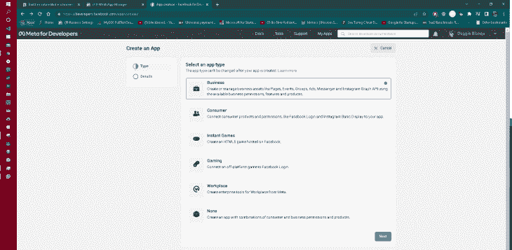

*   接下来，填写您的应用名称和电子邮件地址，然后选择您要与此应用关联的页面/企业

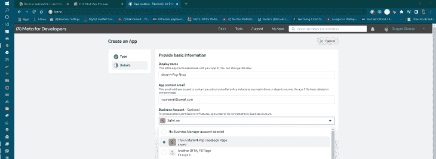

*   提交表单后，您将进入如下所示的屏幕:

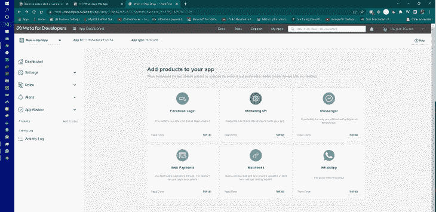

在该屏幕上，选择 **WhatsApp** ，点击其**设置**按钮。

然后你将进入一个新的屏幕，如下所示。

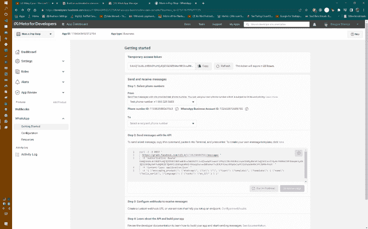

在此屏幕上，请注意:

*   **应用程序 ID** ，这是与我们的元应用程序相关联的 ID。我的是`1184643492312754`
*   **临时接入令牌**，24 小时后到期。我的开头是`EAAQ1bU6LdrIBA` …
*   **测试电话号码**，我们将使用它向客户发送消息。我的是`+1 555 025 3483`
    *   **电话号码 ID** 。我的是`113362588047543`
    *   **WhatsApp 商业账号 ID** 。我的是`102432872486730`

请注意，临时访问令牌将在 24 小时后过期，届时我们需要对其进行续订。当你将应用切换到实时模式时，你可以申请永久访问令牌，我们不需要这样做，因为我们的应用处于开发模式。

电话号码 ID 和 WhatsApp 商业帐户 ID 与测试电话号码绑定在一起。

接下来，让我们添加一个用于接收消息的电话号码。

在开发模式中，出于防止垃圾邮件/滥用的原因，Meta 将我们限制为五个收件人号码。在实时/生产模式下，该号码代表我们客户的电话号码。

点击**选择一个收件人电话号码**，添加自己的 WhatsApp 号码，如下截图所示:


添加您的收件人号码后，您将会看到如下所示的屏幕。如果您是第一次将您的电话号码添加到 Meta 平台，如脸书页面、Meta Business suite 或 Meta developer dashboard，您将收到来自脸书商务的 OTP 消息，提示您验证您是否确实拥有收件人号码。

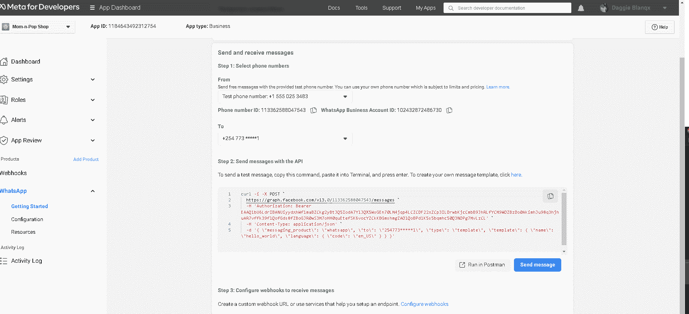

### 测试我们的设置

让我们测试一下到这一步为止是否一切正常。我们将通过点击**发送消息**按钮来完成此操作。

如果一切正常，您应该会在 WhatsApp 收件箱中看到一条来自您的测试号码的消息。

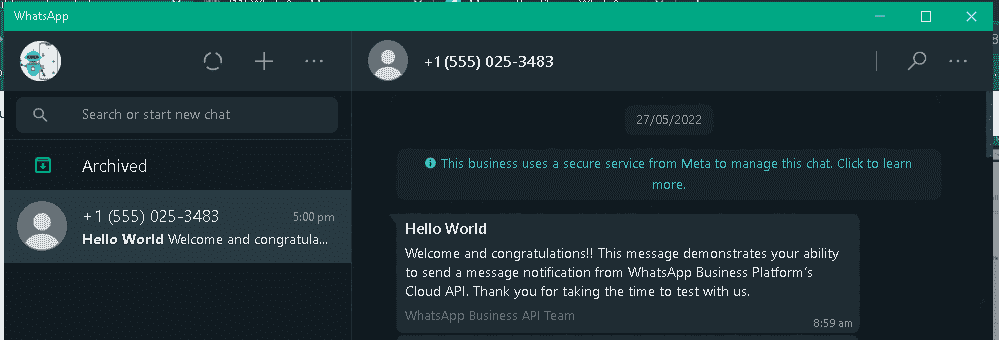

到目前为止，我们做得很好！暂停一下，打开代码编辑器。不要关闭你的浏览器标签，因为我们将在几分钟后回到 Meta Developer dashboard。

## 步骤 2:设置 webhooks 来接收消息

既然我们的设置可以成功发送消息，那么让我们设置一种接收消息的方法。是时候把手弄脏，让自己沉浸在编写代码中了。我们将为本教程编写的所有代码都在这个 GitHub 库中。

创建一个新文件夹来包含我们的项目。在终端中打开此文件夹，并运行以下脚本:

```
npm init ---yes
```

接下来，我们安装一些软件包:

```
npm install express pdfkit request whatsappcloudapi_wrapper
npm install nodemon --dev
```

以下是对每一个问题的简要解释:

*   这个包对于设置我们的服务器很重要。服务器将包含一个充当我们的 webhook 的路由
*   `pdfkit`包将用于在顾客结账时为他们生成发票
*   `request` 包将帮助我们运行对 FakeStoreAPI 的获取请求
*   `whatsappcloudapi_wrapper`帮助我们发送和接收 WhatsApp 信息

接下来，我们将创建三个文件:

1.  `./app.js`
2.  `./.env.js`
3.  `./routes/index.js`

在我们的`./.env.js`文件中，键入以下代码:

```
const production = {
    ...process.env,
    NODE_ENV: process.env.NODE_ENV || 'production',
};

const development = {
    ...process.env,
    NODE_ENV: process.env.NODE_ENV || 'development',
    PORT: '9000',
    Meta_WA_accessToken:'EAAKGUD3eZA28BADAJOmO6L19TmZAIEUpdFGHEGHX5sQ3kk4LDQLlnyh607rKSr0x2SAOPJS0kXOUZAhRDIPPGs4vcXQCo2DnfSJMnnIzFW7vaw8EuL7A0HjGZBwE8VwjRnBNam0ARLmfyOCEh1',
    Meta_WA_SenderPhoneNumberId: '113362588047543',
    Meta_WA_wabaId: '102432872486730',
    Meta_WA_VerifyToken: 'YouCanSetYourOwnToken',
};

const fallback = {
    ...process.env,
    NODE_ENV: undefined,
};

module.exports = (environment) => {
    console.log(`Execution environment selected is: "${environment}"`);
    if (environment === 'production') {
        return production;
    } else if (environment === 'development') {
        return development;
    } else {
        return fallback;
    }
};
```

在同一个`./.env.js`文件中:

1.  用元应用的临时访问令牌替换`Meta_WA_accessToken`的值
2.  用您的电话号码 ID 替换`Meta_WA_SenderPhoneNumberId`的值
3.  用您的 WhatsApp 商业账户 ID 替换`Meta_WA_wabaId`的值
4.  为`Meta_WA_VerifyToken`设置您自己的值。它可以是字符串或数字；在 webhooks 步骤中，您将看到我们如何使用它

上面的代码首先导入当前的环境变量并将其析构，然后添加新的环境变量并将两者的组合作为一个对象导出。

在文件`./app.js`中，插入以下代码:

```
process.env = require('./.env.js')(process.env.NODE_ENV || 'development');
const port = process.env.PORT || 9000;
const express = require('express');

let indexRoutes = require('./routes/index.js');

const main = async () => {
    const app = express();
    app.use(express.json());
    app.use(express.urlencoded({ extended: false }));
    app.use('/', indexRoutes);
    app.use('*', (req, res) => res.status(404).send('404 Not Found'));
    app.listen(port, () =>
        console.log(`App now running and listening on port ${port}`)
    );
};
main();
```

上面代码块的第一行简单地导入了`./.env.js`文件并将其分配给`process.env`，这是 Node.js 中的一个全局可访问对象。

在文件`./routes/index.js`中，插入以下代码:

```
'use strict';
const router = require('express').Router();

router.get('/meta_wa_callbackurl', (req, res) => {
    try {
        console.log('GET: Someone is pinging me!');

        let mode = req.query['hub.mode'];
        let token = req.query['hub.verify_token'];
        let challenge = req.query['hub.challenge'];

        if (
            mode &&
            token &&
            mode === 'subscribe' &&
            process.env.Meta_WA_VerifyToken === token
        ) {
            return res.status(200).send(challenge);
        } else {
            return res.sendStatus(403);
        }
    } catch (error) {
        console.error({error})
        return res.sendStatus(500);
    }
});

router.post('/meta_wa_callbackurl', async (req, res) => {
    try {
        console.log('POST: Someone is pinging me!');
        return res.sendStatus(200);
    } catch (error) {
                console.error({error})
        return res.sendStatus(500);
    }
});
module.exports = router;
```

接下来，打开终端并运行:

```
nodemon app.js
```

Express 服务器将在端口 9000 上运行。

接下来，打开另一个单独的终端并运行:

```
ngrok http 9000
```

这个命令将我们的 Express 应用程序暴露给了更广阔的互联网。这里的目标是建立一个 WhatsApp Cloud 可以 ping 通的 webhook。

记下 ngrok 分配给 Express 服务器的 URL。在我的例子中，ngrok 发给我这个 URL: `[https://7b9b-102-219-204-54.ngrok.io](https://7b9b-102-219-204-54.ngrok.io)`。保持 Express 服务器和 ngrok 终端运行。

接下来，让我们继续我们在 Meta Developer 仪表板中的工作。滚动到标题为**配置 Webhooks 接收消息**的部分，点击**配置 Webhooks** 。该链接将显示一个类似下面截图的页面:

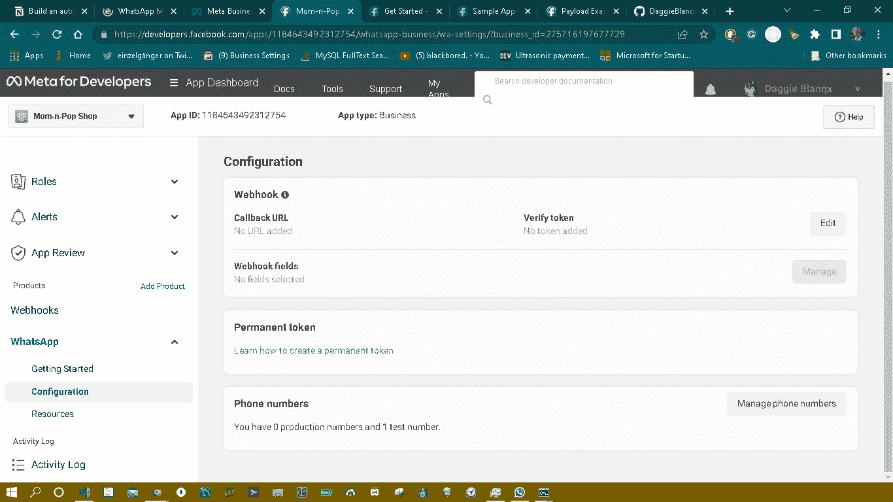

点击**编辑**按钮，弹出一个弹出窗口。

在**回调 URL** 字段中，粘贴 ngrok 发布给您的 URL 并附加回调路由，如`./routes/index.js`指令所示。在本例中，我的完整 URL 是`[https://7b9b-102-219-204-54.ngrok.io/meta_wa_callbackurl](https://7b9b-102-219-204-54.ngrok.io/meta_wa_callbackurl)`。

在**验证令牌**字段中，输入出现在`./.env.js`文件中的 **Meta_WA_VerifyToken** 的值。

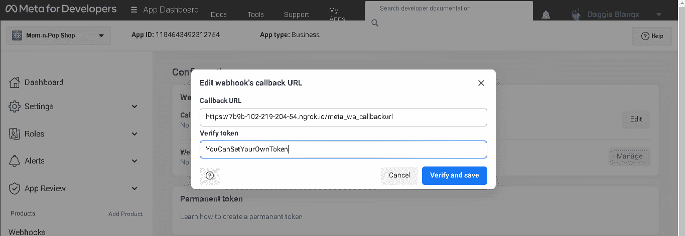

然后点击**验证并保存**。

如果您配置得很好，您将在您的 Express 服务器终端看到一条`console.log`消息，内容如下:

```
GET: Someone is pinging me!
```

### 配置我们的 Express 服务器

现在，让我们的 Express 服务器接收来自 Meta 的订阅消息。

在同一个 Meta Developers 仪表板屏幕上，单击 **Manage** ，将出现一个弹出窗口。

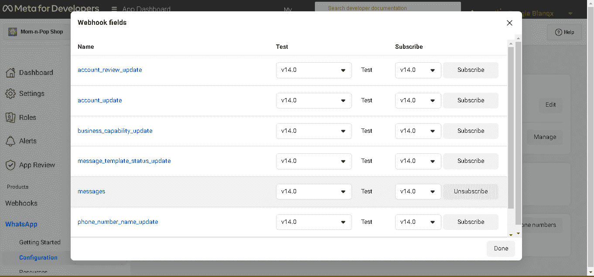

选择**消息**，点击同一行的**测试**。

您应该会在 Express 服务器的终端上看到一条`console.log`消息，上面写着:

```
POST: Someone is pinging me!
```

如果你看到这个，回到同一个弹出窗口，在同一个消息行中点击 **Subscribe** 。之后，点击**完成**。

## 步骤 3:编写我们的业务逻辑

### 配置电子商务数据源

首先，我们将设置我们的逻辑从 FakeStoreAPI 获取数据，生成 PDF 发票，并生成一个虚拟订单提货位置。我们将把这个逻辑封装到一个 JavaScript 类中，然后将这个类导入到我们应用程序的逻辑中。

创建一个文件，命名为`./utils/ecommerce_store.js`。在该文件中，粘贴以下代码:

```
'use strict';
const request = require('request');
const PDFDocument = require('pdfkit');
const fs = require('fs');

module.exports = class EcommerceStore {
    constructor() {}
    async _fetchAssistant(endpoint) {
        return new Promise((resolve, reject) => {
            request.get(
                `https://fakestoreapi.com${endpoint ? endpoint : '/'}`,
                (error, res, body) => {
                    try {
                        if (error) {
                            reject(error);
                        } else {
                            resolve({
                                status: 'success',
                                data: JSON.parse(body),
                            });
                        }
                    } catch (error) {
                        reject(error);
                    }
                }
            );
        });
    }

    async getProductById(productId) {
        return await this._fetchAssistant(`/products/${productId}`);
    }
    async getAllCategories() {
        return await this._fetchAssistant('/products/categories?limit=100');
    }
    async getProductsInCategory(categoryId) {
        return await this._fetchAssistant(
            `/products/category/${categoryId}?limit=10`
        );
    }

    generatePDFInvoice({ order_details, file_path }) {
        const doc = new PDFDocument();
        doc.pipe(fs.createWriteStream(file_path));
        doc.fontSize(25);
        doc.text(order_details, 100, 100);
        doc.end();
        return;
    }

    generateRandomGeoLocation() {
        let storeLocations = [
            {
                latitude: 44.985613,
                longitude: 20.1568773,
                address: 'New Castle',
            },
            {
                latitude: 36.929749,
                longitude: 98.480195,
                address: 'Glacier Hill',
            },
            {
                latitude: 28.91667,
                longitude: 30.85,
                address: 'Buena Vista',
            },
        ];
        return storeLocations[
            Math.floor(Math.random() * storeLocations.length)
        ];
    }
};
```

在上面的代码中，我们创建了一个名为`EcommerceStore`的类。

第一个方法是`_fetchAssistant`，它接收一个端点，用来 ping[fakestoreapi.com](http://fakestoreapi.com)。

以下方法充当第一种方法的查询生成器:

1.  `getProductById` 接收产品 ID，然后获取与该特定产品相关的数据
2.  `getAllCategories` 获取在[fakestoreapi.com](http://fakestoreapi.com)的所有类别
3.  接收一个产品类别，然后获取该特定类别中的所有产品

这些查询构建器将调用第一种方法。

继续，方法`generatePDFInvoice` 接收一段文本和一个文件路径。然后，它创建一个 PDF 文档，在上面写入文本，然后将文档存储在提供的文件路径中。

方法`generateRandomGeoLocation` 简单地返回一个随机的地理位置。当我们将商店的订单提货位置发送给想要提货的顾客时，这种方法将非常有用。

### 配置客户会话

为了处理我们的客户旅程，我们需要保持一个包括客户档案和他们的购物车的会话。因此，每个客户都有自己独特的会话。

在生产中，我们可以使用 MySQL、MongoDB 或其他有弹性的数据库，但为了保持我们的教程简洁，我们将使用 [ES2015 的`Map`数据结构](https://blog.logrocket.com/javascript-maps-vs-sets-choosing-your-data-structure/)。使用`Map`，我们可以存储和检索特定的、可重复的数据，比如唯一的客户数据。

在您的`./routes/index.js`文件中，在`router.get('/meta_wa_callbackurl', (req, res)`上方添加以下代码。

```
const EcommerceStore = require('./../utils/ecommerce_store.js');
let Store = new EcommerceStore();
const CustomerSession = new Map();

router.get('/meta_wa_callbackurl', (req, res) => {//this line already exists. Add the above lines
```

第一行导入`EcommerceStore`类，而第二行初始化它。第三行创建客户的会话，我们将使用它来存储客户的旅程。

### 初始化我们的 WhatsApp 云 API

还记得我们之前安装的`whatsappcloudapi_wrapper`包吗？是时候导入并初始化它了。

在`./routes/index.js`文件中，在快速路由器声明下添加以下代码行:

```
const router = require('express').Router(); // This line already exists. Below it add  the following lines:

const WhatsappCloudAPI = require('whatsappcloudapi_wrapper');
const Whatsapp = new WhatsappCloudAPI({
    accessToken: process.env.Meta_WA_accessToken,
    senderPhoneNumberId: process.env.Meta_WA_SenderPhoneNumberId,
    WABA_ID: process.env.Meta_WA_wabaId, 
    graphAPIVersion: 'v14.0'
});
```

以下值是我们在`./.env.js`文件中定义的环境变量:

*   `process.env.Meta_WA_accessToken`
*   `process.env.Meta_WA_SenderPhoneNumberId`
*   `process.env.Meta_WA_wabaId`

我们用上面的三个值初始化 WhatsAppCloudAPI 类，并将我们的实例命名为`Whatsapp`。

接下来，让我们解析所有进入`/meta_wa_callbackurl` POST webhook 的数据。通过解析请求的主体，我们将能够提取消息和其他细节，如发送者的姓名、发送者的电话号码等。

> **请注意**:从现在开始，我们所做的所有代码编辑都将在`./routes/index.js`文件中完成。

在 `try{`语句的左括号下添加以下代码行:

```
try { // This line already exists. Add the below lines

        let data = Whatsapp.parseMessage(req.body);

        if (data?.isMessage) {
            let incomingMessage = data.message;
            let recipientPhone = incomingMessage.from.phone; // extract the phone number of sender
            let recipientName = incomingMessage.from.name;
            let typeOfMsg = incomingMessage.type; // extract the type of message (some are text, others are images, others are responses to buttons etc...)
            let message_id = incomingMessage.message_id; // extract the message id
        }
```

现在，当客户给我们发送消息时，我们的 webhook 应该会收到。消息包含在 webhook 的请求体中。为了从请求体中提取有用的信息，我们需要将请求体传递给 WhatsApp 实例的`parseMessage`方法。

然后，使用一个`if`语句，我们检查该方法的结果是否包含有效的 WhatsApp 消息。

在`if`语句中，我们定义了包含消息的`incomingMessage`。我们还定义了其他变量:

*   `recipientPhone`是给我们发信息的客户的号码。我们将向他们发送一个消息回复，因此前缀“收件人”
*   `recipientName`是向我们发送信息的客户的姓名。这是他们在 WhatsApp 个人资料中为自己设定的名字
*   `typeOfMsg`是客户发送给我们的信息类型。后面我们会看到，有些消息是简单的文本，有些则是按钮的回复(别担心，这个很快就有意义了！)
*   `message_id`是一个字符串，它唯一地标识了我们收到的消息。当我们想要执行特定于该邮件的任务时，例如将邮件标记为已读，这很有用

到目前为止，一切似乎都很好，但我们会尽快确认。

### 理解并回应客户的意图

由于我们的教程不会深入任何形式的人工智能或自然语言处理(NLP)，我们将用简单的`if…else`逻辑来定义我们的聊天流程。

当客户发送文本消息时，对话逻辑开始。我们不会查看消息本身，所以我们不知道他们打算做什么，但我们可以告诉客户我们的机器人可以做什么。

让我们给我们的客户一个简单的上下文，他们可以用一个具体的意图来回答。

我们将为客户提供两个按钮:

1.  让我们知道他们想和真正的人说话，而不是聊天机器人
2.  另一个用来浏览产品

为此，在`message_id`下面插入以下代码:

```
if (typeOfMsg === 'text_message') {
    await Whatsapp.sendSimpleButtons({
        message: `Hey ${recipientName}, \nYou are speaking to a chatbot.\nWhat do you want to do next?`,
        recipientPhone: recipientPhone, 
        listOfButtons: [
            {
                title: 'View some products',
                id: 'see_categories',
            },
            {
                title: 'Speak to a human',
                id: 'speak_to_human',
            },
        ],
    });
}
```

上面的`if`语句只让我们处理文本消息。

`sendSimpleButtons`方法允许我们向客户发送按钮。记下`title`和`id`属性。`title`是客户将看到的，而`id`是我们将用来知道客户点击了哪个按钮。

让我们检查一下我们做得对不对。打开你的 WhatsApp 应用，向 WhatsApp 商业账户发送短信。


如果你得到了和上面截图一样的回应，恭喜你！你刚刚通过 WhatsApp Cloud API 发送了你的第一条消息。

因为客户可以点击这两个按钮中的任何一个，所以让我们也来关注一下**与人对话**按钮。

在`text_message`逻辑的`if`语句外，插入以下代码:

```
if (typeOfMsg === 'simple_button_message') {
    let button_id = incomingMessage.button_reply.id;

    if (button_id === 'speak_to_human') {
        await Whatsapp.sendText({
            recipientPhone: recipientPhone,
            message: `Arguably, chatbots are faster than humans.\nCall my human with the below details:`,
        });

        await Whatsapp.sendContact({
            recipientPhone: recipientPhone,
            contact_profile: {
                addresses: [
                    {
                        city: 'Nairobi',
                        country: 'Kenya',
                    },
                ],
                name: {
                    first_name: 'Daggie',
                    last_name: 'Blanqx',
                },
                org: {
                    company: 'Mom-N-Pop Shop',
                },
                phones: [
                    {
                        phone: '+1 (555) 025-3483',
                    },
                                        {
                        phone: '+254712345678',
                    },
                ],
            },
        });
    }
};
```

上面的代码执行两个操作:

1.  使用`sendText`方法发送一条短信告诉用户他们将收到一张联系卡
2.  使用`sendContact`方法发送联系人卡片

这段代码还使用用户单击的按钮的 ID(在我们的例子中，ID 是`incomingMessage.button_reply.id`)来检测用户的意图，然后用两个操作选项来响应。

现在，回到 WhatsApp，点击**与人对话**。如果您操作正确，您将看到如下回复:

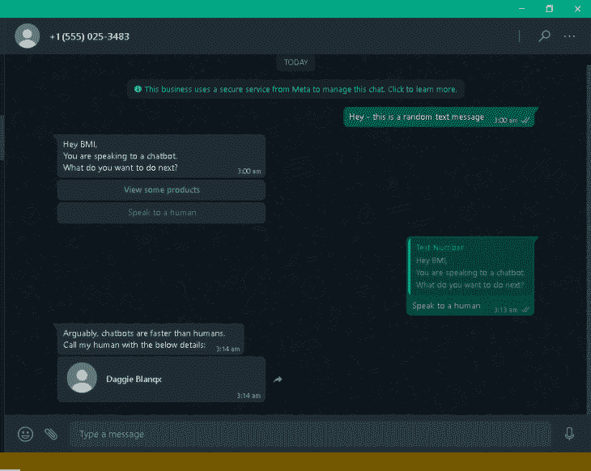

当您单击收到的联系人卡片时，应该会看到以下内容:


接下来，让我们操作一下**查看一些产品**按钮。

在`simple_button_message if`语句内，但就在`speak_to_human if`语句的下面和外面，添加以下代码:

```
if (button_id === 'see_categories') {
    let categories = await Store.getAllCategories(); 
    await Whatsapp.sendSimpleButtons({
        message: `We have several categories.\nChoose one of them.`,
        recipientPhone: recipientPhone, 
        listOfButtons: categories.data
            .map((category) => ({
                title: category,
                id: `category_${category}`,
            }))
            .slice(0, 3)
    });
}
```

下面是上面代码的作用:

1.  `if`语句确保用户点击了**查看一些产品**按钮
2.  通过`getAllCategories`方法从`FakeStoreAPI`获取产品类别
3.  使用数组方法将按钮的数量限制为三个——因为 WhatsApp 只允许我们发送三个简单的按钮
4.  然后它遍历每个类别，创建一个带有`title` 和前缀为`category_`的唯一 ID 的按钮
5.  使用`sendSimpleButtons`方法，我们将这些按钮发送给客户

再次返回 WhatsApp 应用，点击**查看更多产品**。如果您正确完成了上述步骤，您应该会看到类似下面截图的回复:

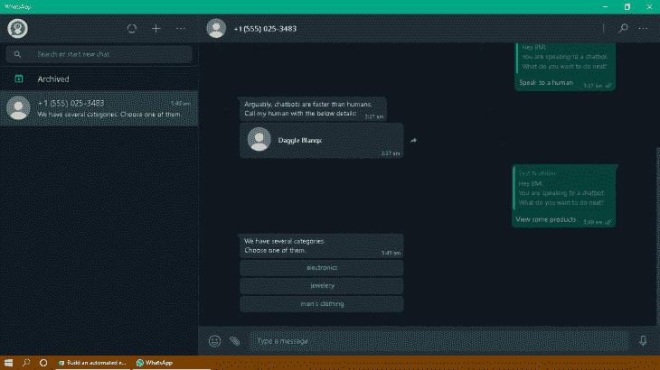

### 按类别提取产品

现在，让我们创建逻辑来获取客户选择的类别中的产品。

仍然在`simple_button_message if`语句内，但是在`see_categories if`语句的下面和外面，添加以下代码:

```
if (button_id.startsWith('category_')) {
    let selectedCategory = button_id.split('category_')[1];
    let listOfProducts = await Store.getProductsInCategory(selectedCategory);

    let listOfSections = [
        {
            title: `🏆 Top 3: ${selectedCategory}`.substring(0,24),
            rows: listOfProducts.data
                .map((product) => {
                    let id = `product_${product.id}`.substring(0,256);
                    let title = product.title.substring(0,21);
                    let description = `${product.price}\n${product.description}`.substring(0,68);

                    return {
                        id,
                        title: `${title}...`,
                        description: `$${description}...`
                    };
                }).slice(0, 10)
        },
    ];

    await Whatsapp.sendRadioButtons({
        recipientPhone: recipientPhone,
        headerText: `#BlackFriday Offers: ${selectedCategory}`,
        bodyText: `Our Santa 🎅🏿 has lined up some great products for you based on your previous shopping history.\n\nPlease select one of the products below:`,
        footerText: 'Powered by: BMI LLC',
        listOfSections,
    });
}
```

上面的`if`语句确认了客户点击的按钮确实是包含类别的按钮。

我们在这里做的第一件事是从按钮的 ID 中提取特定的类别。然后，我们在 FakeStoreAPI 中查询属于该特定类别的产品。

查询后，我们收到数组中的产品列表，`listOfProducts.data`。我们现在遍历这个数组，对于其中的每个产品，我们提取它的价格、标题、描述和 ID。

我们将`product_`追加到`id`中，这将帮助我们在下一步中挑选客户的选择。确保根据 [WhatsApp Cloud API 的单选按钮(或列表)限制](https://developers.facebook.com/docs/whatsapp/guides/interactive-messages/)来修剪 ID、标题和描述的长度。

然后我们返回三个值:ID、标题和描述。由于 WhatsApp 最多只允许 10 行，我们将使用数组方法`.slice(0,10)`将产品数量限制为 10。

之后，我们调用`sendRadioButtons`方法将产品发送给客户。记下属性*`headerText`*`bodyText``footerText`和`listOfSections`。

返回 WhatsApp 应用程序，点击任何类别的产品。如果您按照说明正确操作，您应该会看到类似下面截图的回复:

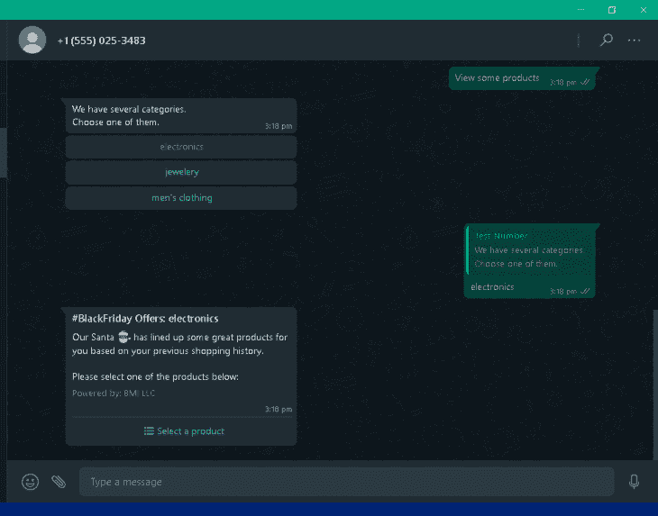

当您点击**选择产品**时，您应该会看到以下屏幕:

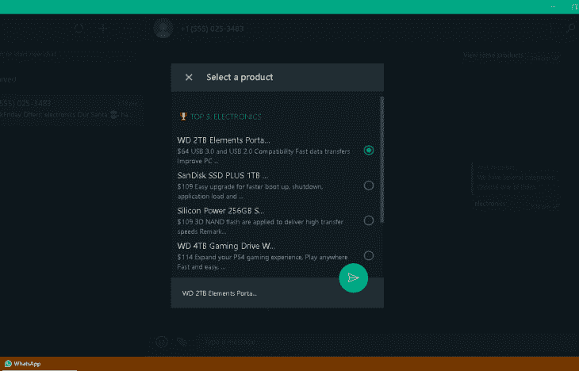此时，客户可以选择他们觉得感兴趣的产品，但我们能知道他们选择了什么吗？还没有，所以让我们在这一部分工作。

在`simple_button_message if`语句之外，让我们添加另一个`if`语句:

```
if (typeOfMsg === 'radio_button_message') {
    let selectionId = incomingMessage.list_reply.id; // the customer clicked and submitted a radio button

}
```

在上面的`if`语句中，在`selectionId`的正下方，添加以下代码:

```
if (selectionId.startsWith('product_')) {
    let product_id = selectionId.split('_')[1];
    let product = await Store.getProductById(product_id);
    const { price, title, description, category, image: imageUrl, rating } = product.data;

    let emojiRating = (rvalue) => {
        rvalue = Math.floor(rvalue || 0); // generate as many star emojis as whole number ratings
        let output = [];
        for (var i = 0; i < rvalue; i++) output.push('⭐');
        return output.length ? output.join('') : 'N/A';
    };

    let text = `_Title_: *${title.trim()}*\n\n\n`;
    text += `_Description_: ${description.trim()}\n\n\n`;
    text += `_Price_: $${price}\n`;
    text += `_Category_: ${category}\n`;
    text += `${rating?.count || 0} shoppers liked this product.\n`;
    text += `_Rated_: ${emojiRating(rating?.rate)}\n`;

    await Whatsapp.sendImage({
        recipientPhone,
        url: imageUrl,
        caption: text,
    });

    await Whatsapp.sendSimpleButtons({
        message: `Here is the product, what do you want to do next?`,
        recipientPhone: recipientPhone, 
        listOfButtons: [
            {
                title: 'Add to cart🛒',
                id: `add_to_cart_${product_id}`,
            },
            {
                title: 'Speak to a human',
                id: 'speak_to_human',
            },
            {
                title: 'See more products',
                id: 'see_categories',
            },
        ],
    });
}
```

上述代码执行以下操作:

1.  从客户单击的单选按钮中提取产品 ID
2.  查询具有该产品 ID 的 FakeStoreAPI
3.  当它接收并提取产品数据时，它格式化文本。WhatsApp 使用[下划线](https://faq.whatsapp.com/556797335179788/?locale=en_US)以斜体呈现文本，而星号以粗体呈现文本
4.  使用`emojiRating`功能渲染星星表情符号。如果评分是 3.8，它将呈现三个明星表情符号
5.  将产品的图像附加到呈现的文本中，并使用`sendImage`方法发送它

之后，我们使用`sendSimpleButtons`向客户发送一个包含三个按钮的列表。一个是给顾客一个向购物车中添加产品的机会。注意以`add_to_cart_`为前缀的按钮 ID。

现在，回到你的 WhatsApp 应用程序，选择一个产品。如果您按照说明正确操作，您应该会看到类似于以下屏幕截图的回复:

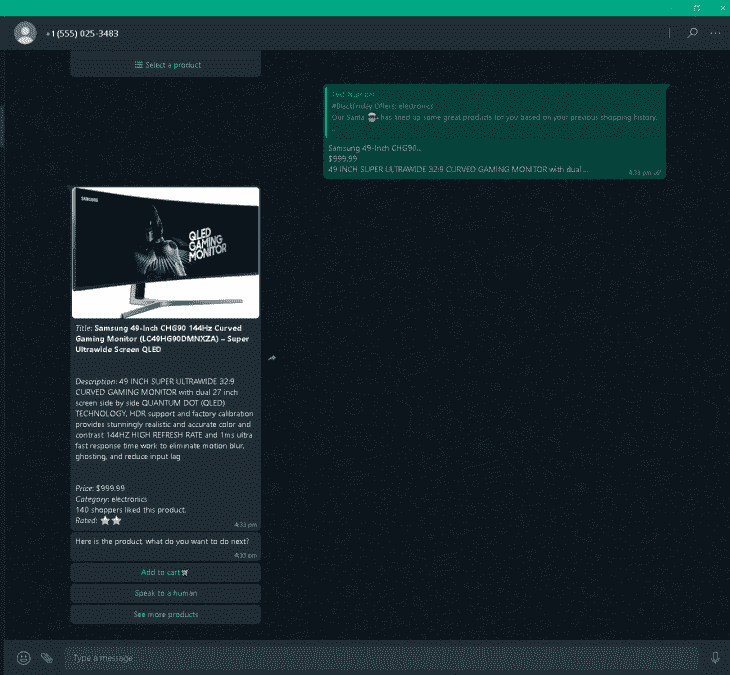

### 构建存储客户购物车的会话

为了跟踪客户添加到购物车中的产品，我们需要一个地方来存储购物车中的商品。这就是`CustomerSession`发挥作用的地方。让我们给它添加一些逻辑。

在`radio_button_message if`语句之外，在`message_id`声明的正下方，添加以下代码:

```
let message_id = incomingMessage.message_id; // This line already exists. Add the below lines...

// Start of cart logic
if (!CustomerSession.get(recipientPhone)) {
    CustomerSession.set(recipientPhone, {
        cart: [],
    });
}

let addToCart = async ({ product_id, recipientPhone }) => {
    let product = await Store.getProductById(product_id);
    if (product.status === 'success') {
        CustomerSession.get(recipientPhone).cart.push(product.data);
    }
};

let listOfItemsInCart = ({ recipientPhone }) => {
    let total = 0;
    let products = CustomerSession.get(recipientPhone).cart;
    total = products.reduce(
        (acc, product) => acc + product.price,
        total
    );
    let count = products.length;
    return { total, products, count };
};

let clearCart = ({ recipientPhone }) => {
    CustomerSession.get(recipientPhone).cart = [];
};
// End of cart logic

if (typeOfMsg === 'text_message') { ... // This line already exists. Add the above lines...
```

上面的代码检查客户的会话是否已经创建。如果尚未创建，它将创建一个新的会话，该会话由客户的电话号码唯一标识。然后我们初始化一个名为`cart`的属性，它以一个空数组开始。

`addToCart`函数接收一个`product_id`和特定客户的号码。然后，它向 FakeStoreAPI 发送特定产品的数据，并将产品推入`cart`数组。

然后，`listOfItemsInCart` 函数接收客户的电话号码，并检索相关联的`cart`，后者用于计算购物车中的产品数量及其价格总和。最后，它返回购物车中的商品及其总价。

`clearCart`函数接收客户的电话号码并清空客户的购物车。

购物车逻辑完成后，让我们构建**添加到购物车**按钮。在`simple_button_message if`语句内和其`button_id`声明下，添加以下代码:

```
if (button_id.startsWith('add_to_cart_')) {
    let product_id = button_id.split('add_to_cart_')[1];
    await addToCart({ recipientPhone, product_id });
    let numberOfItemsInCart = listOfItemsInCart({ recipientPhone }).count;

    await Whatsapp.sendSimpleButtons({
        message: `Your cart has been updated.\nNumber of items in cart: ${numberOfItemsInCart}.\n\nWhat do you want to do next?`,
        recipientPhone: recipientPhone, 
        listOfButtons: [
            {
                title: 'Checkout 🛍️',
                id: `checkout`,
            },
            {
                title: 'See more products',
                id: 'see_categories',
            },
        ],
    });
}
```

上面的代码从客户点击的按钮中提取产品 ID，然后调用`addToCart`函数将产品保存到客户会话的购物车中。然后，它提取客户会话的购物车中的商品数量，并告诉客户他们有多少产品。它还发送两个按钮，其中一个允许用户结帐。

记下按钮 ID，然后返回 WhatsApp 应用程序。点击**添加到购物车**。如果您很好地遵循了说明，您应该会看到类似下面截图的回复:

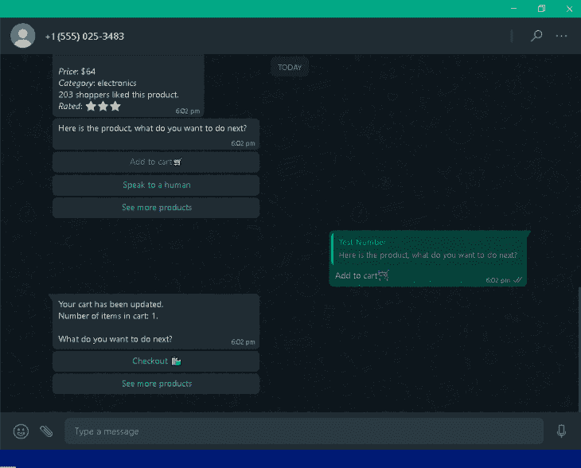

既然我们的客户可以将商品添加到购物车中，我们就可以编写结账逻辑了。

### 编写签出逻辑

在`simple_button_message if`语句内，但在`add_to_cart_ if`语句外，添加以下代码:

```
if (button_id === 'checkout') {
  let finalBill = listOfItemsInCart({ recipientPhone });
  let invoiceText = `List of items in your cart:\n`;

  finalBill.products.forEach((item, index) => {
      let serial = index + 1;
      invoiceText += `\n#${serial}: ${item.title} @ $${item.price}`;
  });

  invoiceText += `\n\nTotal: $${finalBill.total}`;

  Store.generatePDFInvoice({
      order_details: invoiceText,
      file_path: `./invoice_${recipientName}.pdf`,
  });

  await Whatsapp.sendText({
      message: invoiceText,
      recipientPhone: recipientPhone,
  });

  await Whatsapp.sendSimpleButtons({
      recipientPhone: recipientPhone,
      message: `Thank you for shopping with us, ${recipientName}.\n\nYour order has been received & will be processed shortly.`,
      message_id,
      listOfButtons: [
          {
              title: 'See more products',
              id: 'see_categories',
          },
          {
              title: 'Print my invoice',
              id: 'print_invoice',
          },
      ],
  });

  clearCart({ recipientPhone });
}
```

上述代码执行以下操作:

1.  获取购物车中的所有商品，并将它们放入`finalBill`
2.  初始化一个变量`invoiceText`，它将包含我们将发送给客户的文本以及将被起草到发票的 PDF 版本中的文本
    1.  `forEach`循环只是将每个产品的`title`和`price`连接到发票上
3.  `generatePDFInvoice`方法(与我们在`EcommerceStore`类中定义的方法相同)接收订单的细节，起草一个 PDF 文档，并将其保存在我们提供的本地目录/文件夹中的文件路径中
4.  `sendText`方法向客户发送一条包含订单细节的简单文本消息
5.  向客户发送一些按钮。记下**打印我的发票**按钮及其 ID
6.  最后，`clearCart`方法清空购物车

现在，切换回你的 WhatsApp 应用，点击**结账**。如果您很好地遵循了说明，您将会看到类似于以下屏幕截图的回复:


此时，客户应该会收到一份可打印的 PDF 发票。为此，让我们研究一下关于**打印我的发票**按钮的一些逻辑。

### 编写我们的可打印发票逻辑

在`simple_button_message if`语句内，但在`checkout if`语句外，添加以下代码:

```
if (button_id === 'print_invoice') {
  // Send the PDF invoice
  await Whatsapp.sendDocument({
      recipientPhone: recipientPhone,
      caption:`Mom-N-Pop Shop invoice #${recipientName}`,
      file_path: `./invoice_${recipientName}.pdf`,
  });

  // Send the location of our pickup station to the customer, so they can come and pick up their order
  let warehouse = Store.generateRandomGeoLocation();

  await Whatsapp.sendText({
      recipientPhone: recipientPhone,
      message: `Your order has been fulfilled. Come and pick it up, as you pay, here:`,
  });

  await Whatsapp.sendLocation({
      recipientPhone,
      latitude: warehouse.latitude,
      longitude: warehouse.longitude,
      address: warehouse.address,
      name: 'Mom-N-Pop Shop',
  });
}
```

上面的代码从本地文件系统获取上一步中生成的 PDF 文档，并使用`sendDocument`方法将其发送给客户。

当客户在线订购产品时，他们还需要知道如何收到实物产品。出于这个原因，我们使用`EcommerceStore`类的`generateRandomGeoLocation`方法生成一些随机坐标，并使用`sendLocation`方法将这些坐标发送给客户，让他们知道他们可以在哪里实际提货。

现在，打开你的 WhatsApp 应用，点击**打印我的发票**。

如果您正确地遵循了上面的说明，您应该会看到类似下面截图的回复:

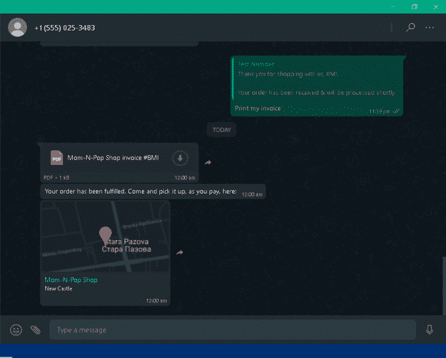

### 向客户显示已读回执

最后，您可能已经注意到消息下面的复选标记是灰色的，而不是蓝色的。这表明我们发送的消息没有返回已读回执，尽管我们的机器人正在阅读它们。

灰色记号可能会让客户感到沮丧，因此，我们需要努力展示蓝色记号。

在`simple_button_message if`语句外部和`data?.isMessage if`语句的右花括号之前，添加以下代码:

```
await Whatsapp.markMessageAsRead({ message_id });
```

这个简单的一行程序会在我们回复邮件后立即将邮件标记为已读。

现在，打开你的 WhatsApp 应用，随机发送一条短信。你看到我看到的了吗？

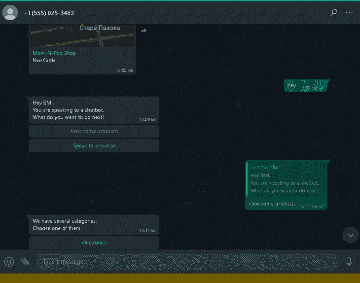

如果您之前的聊天记录已更新为蓝色勾号，则🎉恭喜你！您已经到达了本教程的结尾，并在此过程中学到了一些东西。

## 最后的想法

拥有总计 20 亿的月活跃用户，忽视 WhatsApp 作为一种电子商务策略肯定会落后于你的企业的竞争对手，既然你的大多数客户已经在日常活动中使用 WhatsApp，为什么你的企业不能在那里遇到他们呢？

我希望这篇教程有助于揭开 WhatsApp Cloud API 的神秘面纱，我也希望你在这个过程中获得了一些乐趣。如果你有这方面的问题，请在 Twitter 或 LinkedIn 上告诉我。让我知道你可能感兴趣的其他话题，不要忘记与你的技术圈分享这篇文章。

## [LogRocket](https://lp.logrocket.com/blg/ecommerce-signup) :看看用户为什么不完成你的电子商务流程中的一个步骤的技术和 UX 原因。

[](https://lp.logrocket.com/blg/ecommerce-signup)

LogRocket 就像是一个网络和移动应用程序和网站的 DVR，记录你的电子商务应用程序上发生的一切。LogRocket 没有猜测用户不转化的原因，而是主动揭示了阻止你转化的根本原因，比如 JavaScript 错误或死点击。LogRocket 还可以监控应用的性能，报告客户端 CPU 负载、客户端内存使用等指标。

开始主动监控您的电子商务应用程序— [免费试用](https://lp.logrocket.com/blg/ecommerce-signup)。