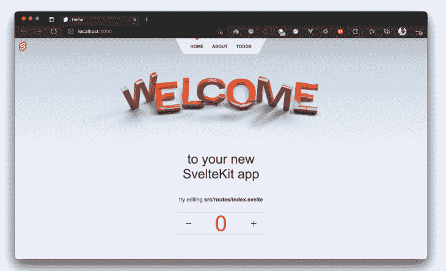
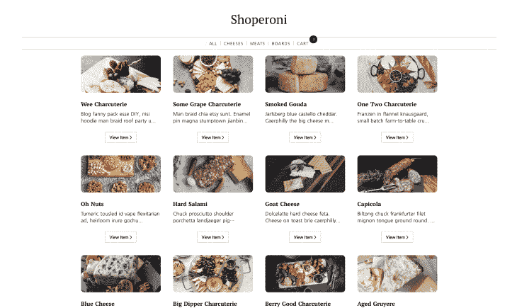
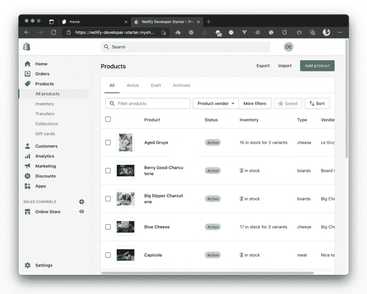
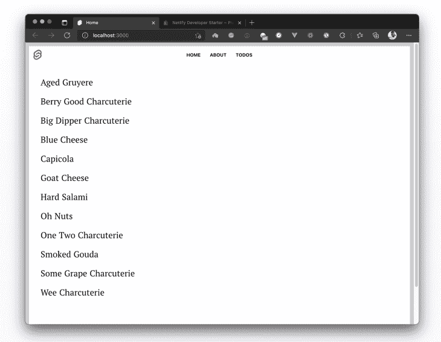
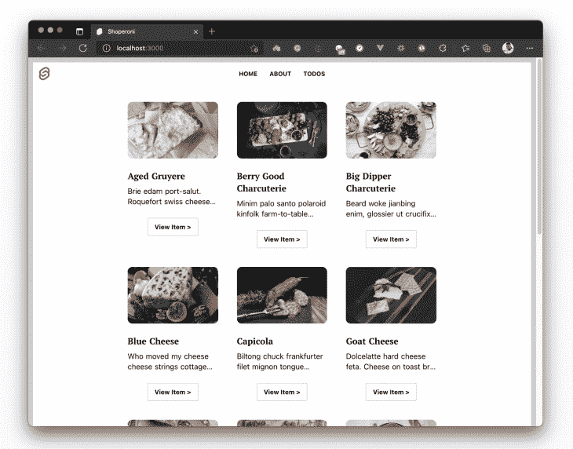
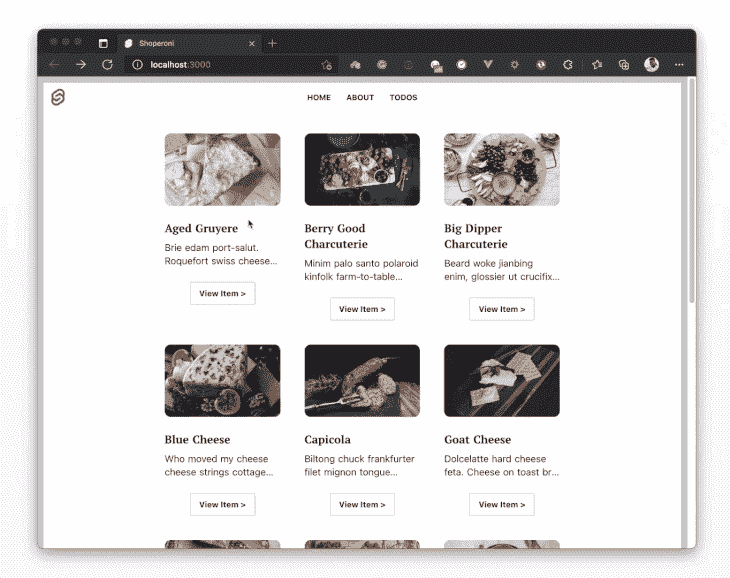

# 用 SvelteKit 和 Shopify Storefront API - LogRocket 博客建立一个电子商务网站

> 原文：<https://blog.logrocket.com/build-ecommerce-site-sveltekit-shopify-apis/>

如果你一直关注 headless 商业生态系统，你会在社区中听到一些关于更新的 Shopify Storefront API 的讨论。该 API 允许商店所有者将他们的 Shopify 商店用作后端服务，以支持他们选择的任何前端应用程序。

这意味着你可以拥有一个拥有你所有产品的 Shopify 商店，然后用你选择的任何前端工具(如 React、Vue、Angular、Next.js、Nuxt 等)构建你的定制电子商务网站。这使您可以通过移动应用程序、在线游戏和网络应用程序等其他渠道在您的 Shopify 商店中销售产品。

当我们看到这个公告时，我在 Netlify 的团队决定尝试一下，用它来构建一些东西。结果是五个不同的入门模板——Astro、Nuxt、Gridsome、Eleventy 和 Angular——都是用 Shopify 支持的后端商店构建的。让我们用[苗条套装](https://blog.logrocket.com/exploring-sveltekit-the-newest-svelte-based-framework/)再造一个吧！

## 设置 Shopify

我们可能应该做的第一件事是建立一个 Shopify 商店。没有一个，所有这一切都不可能。以下是如何快速为自己设置一个:

如果你做到了这些，休息一下，喝杯水。然后回来加入我。让我们建造这个东西！

## 设置苗条工具包

要开始使用 SvelteKit，你可能想快速浏览一下 [SvelteKit 的文档](https://kit.svelte.dev/docs#introduction-getting-started)，了解一下它是如何工作的。否则，请不要走开，我会带你了解建立这个网站所需要的一切。

使用以下命令安装并运行 SvelteKit:

```
npm init [email protected] sveltekit-shopify-demo
cd sveltekit-shopify-demo
npm install
npm run dev -- --open

```

这些命令将为您做几件事:

*   为您创建一个新的 SvelteKit 项目
*   安装所需的软件包
*   在浏览器的`localhost:3000`处打开项目，如下所示:



好了，看起来我们都准备好开始编辑这个项目，使它看起来像我们想要建立的网站。哦，顺便说一下，这是我们正在建设的项目，如果你想看的话:



好吧，让我们开始建吧！

### 式样

为了方便起见，我将在这个项目中使用一个全局样式文件。打开你的`app.css`文件，用[这个 CSS 片段更新它，用于样式化](https://github.com/kenny-io/sveltekit-shopify-ecommerce/blob/master/src/app.css)。造型到此为止。我们现在需要做的就是在项目文件中引用正确的类，这个应用程序应该完全按照预期运行。

## 从 Shopify 获取产品

什么是没有产品的电子商务网站，对不对？我知道。如果您创建了您的 Shopify 帐户并向其中添加了产品，您应该能够在您的 Shopify 管理仪表板中看到您的产品列表页面。

这是我的。感谢我的同事 [Tara](https://twitter.com/Tzmanics) 创建了这家商店，并在里面装满了产品，这样我就可以使用它，并假装所有的工作都是我做的。



现在我们要做的是从我们的 SvelteKit 应用程序调用 API，从我们的 Shopify 商店获取所有这些产品，并在我们的应用程序上显示它们。在此之前，我们先来谈谈身份认证。

### 证明

如果知道您存储的数据受到保护并且只有您一个人可以访问，这不是很好吗？确实是。每个 Shopify 商店都有凭证，您可以使用这些凭证从其他应用程序访问它们——在本例中，是从我们的 SvelteKit 应用程序。

如果您还没有为您的商店生成凭证，请继续操作，[现在就生成凭证](https://paper.dropbox.com/doc/Build-a-super-fast-ecommerce-site-with-SvelteKit-and-Shopify-APIs--BRBH5KcdaB~GoMVDKUWO6XiiAg-9jWqsqTcufJbTPR459mNZ?noDesktopRedirect=1)。回到您的 SvelteKit 项目，创建一个`.env`文件并用您的 Shopify API 密钥更新它，如下所示:

```
VITE_SHOPIFY_STOREFRONT_API_TOKEN = "ADD_YOUR_API_TOKEN_HERE"
VITE_SHOPIFY_API_ENDPOINT = "ADD_YOUR_STORE_API_ENDPOINT_HERE"

```

## 拿你的产品

现在我们已经解决了身份验证问题，我们可以继续获取产品了。这可能是让您知道 Shopify Storefront API 仅基于 GraphQL 的好时机。这意味着没有 REST 替代方案，所以我们将定义 GraphQL 查询来与 API 交互。

在获取产品之前，我们需要一个地方来存储它们，以便我们可以在应用程序的其他地方使用产品数据。这就是苗条商店的用武之地。如果你想了解更多的信息，我会帮你找到——阅读链接信息。

在项目文件夹的根目录下创建一个`store.js`文件，并用下面的代码片段更新它:

```
// store.js
import { writable } from 'svelte/store';
import { postToShopify } from '../src/routes/api/utils/postToShopify';

export const getProducts = async () => {
    try {
        const shopifyResponse = await postToShopify({
            query: `{
         products(sortKey: TITLE, first: 100) {
          edges {
            node {
              id
              handle
              description
              title
              totalInventory
              productType
              variants(first: 5) {
                edges {
                  node {
                    id
                    title
                    quantityAvailable
                    price
                  }
                }
              }
              priceRange {
                maxVariantPrice {
                  amount
                  currencyCode
                }
                minVariantPrice {
                  amount
                  currencyCode
                }
              }
              images(first: 1) {
                edges {
                  node {
                    src
                    altText
                  }
                }
              }
            }
          }
        }
    }
      `
        });
        return shopifyResponse;
    } catch (error) {
        console.log(error);
    }
};

```

好吧，那是怎么回事？让我们走一遍。首先，我们定义一个`getProducts`查询，请求我们在 Shopify 商店中的前 100 个产品。然后，我们将查询传递给我们的`PostToShopify`实用函数，该函数接受查询，添加我们的 API 密钥来认证请求，并调用 Shopify 端点。

但是您可能注意到`postToShopify`函数还不存在，所以让我们继续在项目`src/api/utils`文件夹中创建它。如果该文件夹不存在，您可以创建它或将该函数放在您想要的任何位置(只要确保正确引用它)。我的生活在这个目录:`src/routes/api/utils/postToShopify.js`。

用下面的代码片段更新文件:

```
export const postToShopify = async ({ query, variables }) => {
    try {
        const result = await fetch(import.meta.env.VITE_SHOPIFY_API_ENDPOINT, {
            method: 'POST',
            headers: {
                'Content-Type': 'application/json',
                'X-Shopify-Storefront-Access-Token': import.meta.env.VITE_SHOPIFY_STOREFRONT_API_TOKEN
            },
            body: JSON.stringify({ query, variables })
        }).then((res) => res.json());
        if (result.errors) {
            console.log({ errors: result.errors });
        } else if (!result || !result.data) {
            console.log({ result });
            return 'No results found.';
        }
        return result.data;
    } catch (error) {
        console.log(error);
    }
};

```

*注意，我正在使用我们之前设置的环境变量来验证我们向 Shopify 发出的请求。一定要在环境变量前加上`import.meta.env.`*

完成后，我们现在可以测试我们的实现，以检查我们是否成功地从我们的 Shopify 商店获取产品。进入您的项目的`src/routes/index.svelte`,用下面的代码片段更新它:

```
// src/routes/index.svelte
<script context="module">
    import { products, getProducts } from '../../store';
    export async function load(ctx) {
        await getProducts();
        return { props: { products } };
    }
</script>

<script>
export let products;
</script>
<svelte:head>
    <title>Home</title>
</svelte:head>
<section>
<h2>
    {#each $products as product}
        <p>{product.node.title} </p>
    {/each}
</h2>
</section>

```

我们现在做的是:

*   从我们的商店获取产品数据
*   将`products`作为道具传递给索引页面
*   遍历整个产品数据并显示每个产品的名称

让我们检查一下浏览器，看看是不是这样:



我们确实正确地从我们的商店提取产品。

恭喜，我们已经完成了第一个任务。当然，我们这样做只是为了测试我们的实现。让我们创建两个组件(`ProductCard.svelte`和`ProductList.svelte`)来帮助我们以我们想要的方式组织和展示产品。

## 创建组件来组织和展示产品

在您的项目`src`文件夹中创建一个组件文件夹，并添加我上面提到的两个文件。我将这样设置它:

```
// src/components/ProductCard.svelte
<script>
    export let product;
</script>
<section>
    <div class="product-card">
        <div class="product-card-frame">
            <a href={`/products/${product.handle}`}>
                
            </a>
        </div>
        <div class="product-card-text">
            <h3 class="product-card-title">{product.title}</h3>
            <p class="product-card-description">{product.description.substring(0, 60) + '...'}</p>
        </div>
        <a href={`/products/${product.handle}`}>
            <button>View Item {">"}</button>
        </a>
    </div>
</section>

```

在这里，我们期待一个`product`道具，它将从我们渲染它的地方传入这个组件。当我们得到适当东西时，我们就从其中提取我们需要的不同产品细节，然后使用这些细节来构建我们的产品卡，正如您在上面的代码片段中所看到的。

让我们对产品列表组件做同样的事情。在`src/components`文件夹中创建一个`ProductList.svelte`文件，设置如下:

```
// src/components/ProductList.svelte
<script>
    import ProductCard from '../components/ProductCard.svelte';
    export let products;
</script>
<div class="product-grid">
    {#each products as product}
        <ProductCard product={product.node} />
    {/each}
</div>

```

在这里，我们从我们的索引页面接收一个`products` prop(我们将在这里呈现这个组件),并遍历产品，为每个产品呈现一个产品卡。这样，我们可以转到索引页面`src/routes/index.svelte`并呈现我们的`productList`组件。用下面的代码片段更新它:

```
// src/routes/index.svelte
<script context="module">
    import { products, getProducts } from '../../store';
    export async function load(ctx) {
        await getProducts();
        const productType = ctx.page.query.get('type');
        if (productType) {
            products.update((items) => {
                const updated = items.filter((product) => product.node.productType === productType);
                return updated;
            });
        }
        return { props: { products} };
    }
</script>
<script>
    import ProductList from '../components/ProductList.svelte';
    export let products
</script>
<svelte:head>
    <title>Shoperoni</title>
</svelte:head>
<main>
   <ProductList products={$products} />
</main>

```

在这里，我们正在做以下事情:

*   从我们的商店获取产品数据
*   基于页面查询过滤产品列表(稍后我们将在`Header`组件中使用页面查询过滤产品列表)
*   将过滤后的产品列表作为道具传递给页面
*   呈现我们的`ProductList`组件并将产品数据作为道具传递给它

就是这样！当我们再次查看浏览器时，应该会看到一个更好看的产品列表页面:



## 构建产品详细信息页面

所以我们已经建立了我们的产品列表页面，太好了！如果用户点击上面截图上的`View Item`，会发生什么？目前，什么都没有。实际上，将会发生一些事情:浏览器将导航到这个路由`/products/[the-product-title]`，并且它将导致一个 404，因为那个页面还不存在。


要创建单独的产品页面，让我们更新我们的`store.js`文件并添加另一个查询，该查询将获取我们的产品句柄并使用它从我们的 Shopify 商店获取特定的产品。

这将意味着，每当用户访问我们的个人产品页面，即`/products/aged-gruyere`，产品句柄`aged-gruyere`将作为`page.params.handle`出现在页面上。然后，我们可以使用这个句柄向 Shopify 查询该产品。使用此查询更新`store.js`:

```
// store.js
import { writable } from "svelte/store";
import { postToShopify } from "./src/routes/api/utils/postToShopify";
export const products = writable([]);
export const productDetails = writable([]);
export const getProducts = async () => {
   // get products query
};

// Get product details
export const getProductDetails = async (handle) => {
  try {
    const shopifyResponse = await postToShopify({
      query: ` 
        query getProduct($handle: String!) {
          productByHandle(handle: $handle) {
            id
            handle
            description
            title
            totalInventory
            variants(first: 5) {
              edges {
                node {
                  id
                  title
                  quantityAvailable
                  priceV2 {
                    amount
                    currencyCode
                  }
                }
              }
            }
            priceRange {
              maxVariantPrice {
                amount
                currencyCode
              }
              minVariantPrice {
                amount
                currencyCode
              }
            }
            images(first: 1) {
              edges {
                node {
                  src
                  altText
                }
              }
            }
          }
        }
      `,
      variables: {
        handle: handle,
      },
    });

    productDetails.set(shopifyResponse.productByHandle);
    return shopifyResponse.productByHandle;
  } catch (error) {
    console.log(error);
  }
};

```

这里，我们定义了一个新的查询，它将根据产品的句柄获取特定的产品，我们将句柄作为变量传递给查询。当我们从动态页面调用`getProductDetails()`并将产品句柄传递给它时，我们应该得到返回的产品数据。

好了，让我们创建一个动态页面来代表我们各自的产品页面。在`routes`文件夹中，创建一个新的`routes/products/[handle].svelte`文件，设置如下:

```
// src/routes/products/[handle].svelte
<script context="module">
    import { productDetails, getProductDetails } from '../../../store'; 
    export async function load(ctx) {
        let handle = ctx.page.params.handle;
        await getProductDetails(handle);
        return { props: { productDetails } };
    }
</script>
<script>
    export let productDetails;
    let quantity = 0;
    let product = $productDetails
    let productImage = product.images.edges[0].node.src;
    let productVariants = product.variants.edges.map((v) => v.node);
    let selectedProduct = productVariants[0].id;
        const addToCart = async () => {
        // add selected product to cart
        try {
            const addToCartResponse = await fetch('/api/add-to-cart', {
                method: 'POST',
                body: JSON.stringify({
                    cartId: localStorage.getItem('cartId'),
                    itemId: selectedProduct,
                    quantity: quantity
                })
            });
            const data = await addToCartResponse.json();
            // save new cart to localStorage
            localStorage.setItem('cartId', data.id);
            localStorage.setItem('cart', JSON.stringify(data));
            location.reload();
        } catch (e) {
            console.log(e);
        }
    };
    function price(itemPrice) {
        const amount = Number(itemPrice).toFixed(2);
        return amount + ' ' + 'USD';
    }
</script>
<main> <!-- page content --> </main>

```

此时，您可能想知道为什么我们在这个代码片段上有两个`<script>`标签。原因如下:我们希望我在第一个脚本中定义的`load()`函数在组件呈现之前运行。为此，我们需要在剧本中加入`context="module"`。其他所有内容都可以放入第二个脚本标签中，不需要使用`context`属性。

所以我们在上面的代码片段中所做的是:

*   在初始化期间运行`load()`函数，从我们的商店中获取单个产品
*   将`productDetails`对象作为道具向下传递到页面
*   接收页面中的`productDetails`道具
*   析构`productDetails`对象以获取页面所需的数据

接下来，让我们使用结构化的产品数据来构建产品详细信息页面:

```
// src/routes/products/[handle].svelte
<script context="module">
//...
</script>
<script>
//...
</script>
<main class="product-page">
    <article>
        <section class="product-page-content">
            <div>
                
            </div>
            <div>
                <h1>{product.title}</h1>
                <p>{product.description}</p>
                <form>
                    {#if productVariants.length > 1}
                        <div class="product-page-price-list">
                            {#each productVariants as { id, quantityAvailable, title, priceV2 }}
                                <div class="product-page-price">
                                    <input
                                        {id}
                                        bind:value={selectedProduct}
                                        type="radio"
                                        name="merchandiseId"
                                        disabled={quantityAvailable === 0}
                                    />
                                    <label for={id}>
                                        {title} - {price(priceV2.amount)}
                                    </label>
                                </div>
                            {/each}
                        </div>
                    {:else}
                        <div class="product-page-price is-solo">
                            {price(productVariants[0].priceV2.amount)}
                        </div>
                    {/if}
                    <div class="product-page-quantity-row">
                        <input
                            class="product-page-quantity-input"
                            type="number"
                            name="quantity"
                            min="1"
                            max={productVariants[0].quantityAvailable}
                            bind:value={quantity}
                        />
                        <button type="submit" on:click|preventDefault={addToCart} class="button purchase">
                            Add to Cart
                        </button>
                    </div>
                </form>
            </div>
        </section>
    </article>
</main>

```

现在，如果我们单击产品列表页面上的`View Item`按钮，我们应该会看到如下所示的单个产品详细信息页面:



看起来我们就要完成了。让我们开始部署这个站点吧！

## 部署到网络

现在我们有了一个产品列表页面，我们可以查看我们各自的产品页面，我们可以继续部署这个站点。

要部署一个 SvelteKit 应用程序，您需要使它适应您选择的部署目标。SvelteKit 文档提供了一些[适配器](https://kit.svelte.dev/docs#adapters)，您可以快速使用它们来部署您的应用程序。我选择使用 SvelteKit 提供的 [Netlify 适配器](https://github.com/sveltejs/kit/tree/master/packages/adapter-netlify)部署到 Netlify。

我们需要做的第一件事是将 Netlify 适配器安装到我们的 SvelteKit 项目中:

```
npm i -D @sveltejs/[email protected]

```

然后，编辑您的`svelte.config.js`文件并导入我们刚刚安装的 Netlify 适配器:

```
import adapter from '@sveltejs/adapter-netlify';
export default {
    kit: {
        adapter: adapter(), 
        target: '#svelte'
    }
};

```

我们已经在 SvelteKit 项目中安装并配置了适配器。我们要做的下一件事是创建一个`netlify.toml`文件，并像这样设置它:

```
[build]
  command = "npm run build"
  publish = "build/"
  functions = "/functions/"

# Svelte requires node v12
[build.environment]
  NODE_VERSION = "12.20"

```

我们在这里做的是告诉 Netlify:

*   运行构建这个站点的命令是`npm run build`
*   已建网站可用的目录是`/build`
*   找到我们的定制 Netlify 函数的目录是`/functions`(尽管我们在这个项目中没有使用任何 Netlify 函数)
*   我们希望它用节点 v12.20 构建网站

最后，将项目推送到 GitHub，然后转到您的 [Netlify 仪表板](https://app.netlify.com)，从您推送到的 Github 存储库部署您的站点。如果你需要帮助，这里有一个来自 GitHub 的关于部署到 Netlify 的[一分钟指南，带你完成它。](https://docs.netlify.com/site-deploys/create-deploys/)[如果你想探索这个网站，演示也在 Netlify](https://sveltekit-shopify-ecommerce.netlify.app) 上进行。

## 资源和后续步骤

因此，我们已经完成了一个由 Shopify 后端支持的 SvelteKit 电子商务网站的建设。在下一个教程中，当我们向这个站点添加购物车功能时，我们将把它与更多的 Shopify 特性联系起来。到时候见。

* * *

### 更多来自 LogRocket 的精彩文章:

* * *

## [LogRocket](https://lp.logrocket.com/blg/ecommerce-signup) :看看用户为什么不完成你的电子商务流程中的一个步骤的技术和 UX 原因。

[](https://lp.logrocket.com/blg/ecommerce-signup)

LogRocket 就像是一个网络和移动应用程序和网站的 DVR，记录你的电子商务应用程序上发生的一切。LogRocket 没有猜测用户不转化的原因，而是主动揭示了阻止你转化的根本原因，比如 JavaScript 错误或死点击。LogRocket 还可以监控应用的性能，报告客户端 CPU 负载、客户端内存使用等指标。

开始主动监控您的电子商务应用程序— [免费试用](https://lp.logrocket.com/blg/ecommerce-signup)。