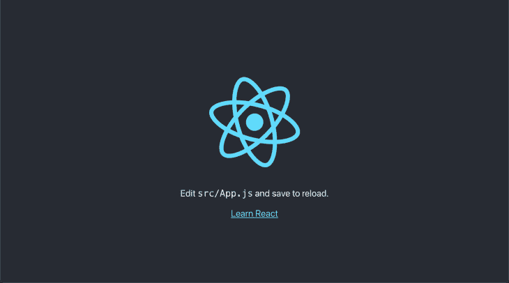
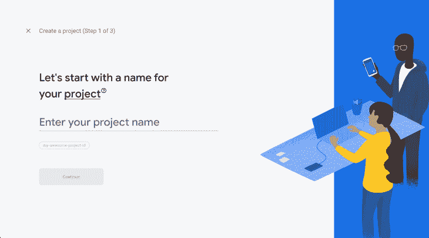
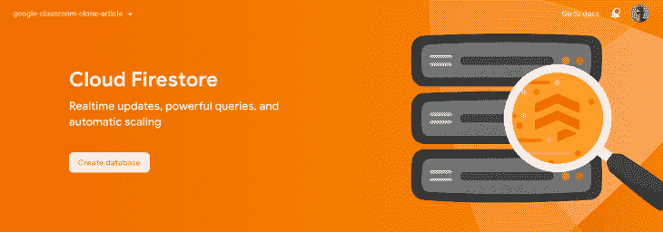
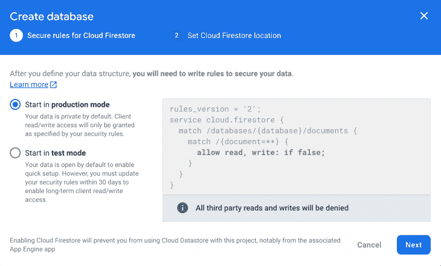
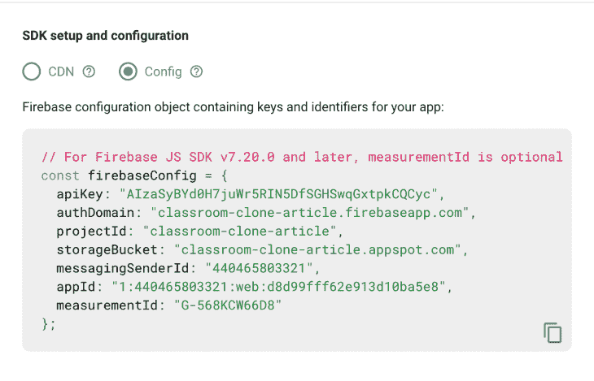
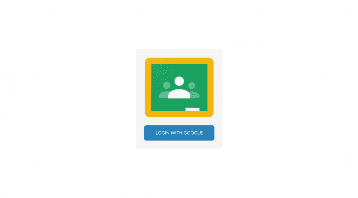
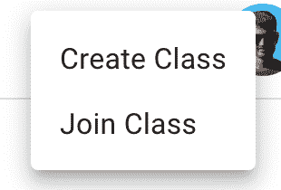
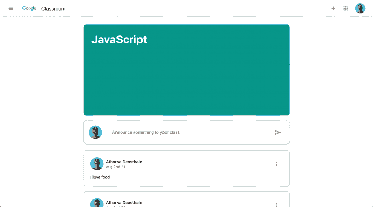

# 用 React 和 Firebase 构建一个谷歌教室的克隆

> 原文：<https://blog.logrocket.com/build-google-classroom-clone-react-firebase/>

现在整个世界都面临着疫情，像学校和大学这样的教育机构正在转向完全在线的教学体验。互联网上有许多服务可以帮助教师做到这一点，比如谷歌教室、微软团队和 Zoom。

现在，似乎每天都有声称能改善教学过程的新服务出现。这就是为什么我认为知道如何制作自己的谷歌教室克隆版会很有用！

本教程将教你如何使用 React 和 [Firebase](https://blog.logrocket.com/firebase-vs-supabase-which-is-better/) ，这样你就可以把所有的部分放在一起，制作一个 banger 应用程序。

## 你需要什么？

*   代码编辑器。我推荐 [Visual Studio 代码](https://code.visualstudio.com)，因为它有一个集成的终端
*   [NodeJS](https://nodejs.org) 已安装，因为我们正在使用 React
*   使用 Firebase 的谷歌账户
*   React 的工作知识——我不会向初学者推荐本教程

## 创建 React 应用程序

现在，让我们开始工作，这个有趣的建设！要创建 React 应用程序，请在安全文件夹中打开终端，并输入以下命令；npm 将为您完成剩余的工作:

```
npx create-react-app app-name

```

记住用您想要给这个构建起的名字替换`app-name`。在我的例子中，我把它命名为`google-classroom-clone` *。*

安装好应用程序后，打开该目录中的 Visual Studio 代码。然后，打开集成终端(Windows 中的 Ctrl+J，MacOS 中的 Cmd+J ),键入以下命令启动应用程序:

```
npm start

```

如果您看到以下屏幕，则您已经成功创建了 React 应用程序:



现在，让我们快速清理一下文件。您可以从项目中删除以下内容；我们不需要他们:

*   `logo.svg`
*   `setupTests.svg`
*   `App.test.js`

继续操作，打开`App.js`删除顶部的`logo.svg`导入，以及文件中`div`标签下的所有内容。您的文件现在应该如下所示:

```
import "./App.css";
function App() {
  return <div className="app"></div>;
}
export default App;

```

删除`App.css`的内容，因为我们不需要 React 给我们的默认样式。

接下来，在终端中键入以下内容来安装将在整个项目中帮助我们的依赖项:

```
npm install firebase moment react-firebase-hooks recoil @material-ui/core @material-ui/icons react-router-dom

```

`firebase`帮助我们轻松地与 Firebase 服务交互，`moment`帮助我们处理项目中的日期。因为我们使用基于函数的 React 组件，`react-firebase-hooks`提供了各种钩子来通知我们用户的状态。

是一个像 Redux 一样简单的状态管理库，所以我决定我们可以用它来简化事情。

`@material-ui/core`和`@material-ui/icons`为我们提供了各种[预置组件和 SVG 图标](https://blog.logrocket.com/using-material-ui-in-react-native/)。最后，`react-router-dom`帮我们提供路线。

## 设置 Firebase

我们将使用 Firebase 作为后端，所以请准备好您的谷歌帐户详情。现在，到 [Firebase 控制台](https://console.firebase.google.com/)并登录。现在，点击**添加项目**，您应该会看到以下屏幕:



输入项目名称。在我的例子中，我将使用**谷歌-教室-克隆-文章**。

现在，系统会提示您是否希望为您的项目启用 Google Analytics。虽然我们并不真的需要谷歌分析，但保持它的启用并没有什么坏处。当要求选择帐户时，记得选择 Firebase 的默认帐户**。点击**创建项目**。**

现在 Firebase 将为项目分配资源。完成后，按**继续**进入您的项目仪表板。现在，让我们在 Firebase 仪表板中设置一些东西。

## 启用身份验证

在侧边栏中，点击**认证**，您将看到以下屏幕:


点击**开始**。这将为您启用身份验证模块，您应该会看到各种可用的身份验证选项:


在这里，我们将使用谷歌认证，因此点击**谷歌**，按下**启用**，填写所需的详细信息，然后点击**保存**。

您已经在 Firebase 项目中成功设置了 Google 身份验证。

## 支持云风暴

Firebase 的云 Firestore 和 MongoDB 一样是一个非关系数据库。要启用云 Firestore，请点击侧边栏中的 **Firestore 数据库**:



点击**创建数据库**，将出现以下模式提示:



记得在**测试模式**下启动 Firestore 数据库。这是因为我们不想担心生产环境和安全规则，以便更多地关注开发方面的事情。但是，您可以在完成项目后将其更改为生产模式。

点击下一个的**，选择一个数据库位置，并按下**创建**。这将最终初始化您的云 Firestore 数据库。**

现在，让我们复制我们的 Firebase 配置。点击工具条上的齿轮图标，进入**项目设置**。向下滚动，您将看到这一部分:


点击第三个图标( **< / >** )，代表一个 web 应用。为应用程序提供一个名称，然后点击**注册应用程序**。忽略其他步骤，我们将手动完成。

现在，返回到**项目设置**，并复制配置。它应该是这样的:



## 将 React 应用程序与 Firebase 链接

现在一切都设置好了，我们终于到了编码的有趣部分！在 React 应用程序中，创建一个名为`firebase.js`的新文件，并使用以下语句导入`firebase`包:

```
import firebase from "firebase";

```

现在粘贴到配置中。我们需要初始化应用程序，以便我们的 React 应用程序可以与 Firebase 通信。为此，请使用以下代码:

```
const app = firebase.initializeApp(firebaseConfig);
const auth = app.auth();
const db = app.firestore();

```

在上面的代码中，我们使用`initializeApp()`函数启动了与 Firebase 的连接。然后，我们从我们的`app`中提取`auth`和`firestore`模块，并将它们存储在单独的变量中。

现在，让我们在应用程序中设置一些功能来帮助我们:

```
const googleProvider = new firebase.auth.GoogleAuthProvider();

// Sign in and check or create account in firestore
const signInWithGoogle = async () => {
  try {
    const response = await auth.signInWithPopup(googleProvider);
    console.log(response.user);
    const user = response.user;
    console.log(`User ID - ${user.uid}`);
    const querySnapshot = await db
      .collection("users")
      .where("uid", "==", user.uid)
      .get();
    if (querySnapshot.docs.length === 0) {
      // create a new user
      await db.collection("users").add({
        uid: user.uid,
        enrolledClassrooms: [],
      });
    }
  } catch (err) {
    alert(err.message);
  }
};

const logout = () => {
  auth.signOut();
};

```

在上面的代码中，我们得到了 Firebase 提供的`GoogleAuthProvider`来帮助我们进行 Google 认证。如果认证中有任何错误，用户将自动转到`catch`模块，错误将显示在屏幕上。

我们使用 Firebase 的`signInWithPopup()`函数，并传入 Google 提供者，以便告诉 Firebase 我们想通过外部提供者登录。在这种情况下，它是谷歌。

* * *

### 更多来自 LogRocket 的精彩文章:

* * *

接下来，我们将检查我们的 Firestore 数据库，查看数据库中是否存在经过身份验证的用户。如果没有，我们在数据库中创建一个新条目，这样我们就认为用户注册了*。*

Firebase 在处理本地存储方面非常聪明。身份验证将在页面重新加载时保持不变，Firebase 在幕后处理它。因此，一旦用户通过身份验证，我们不需要再做任何事情。

现在，我们创建一个`logout()`函数。

最后，导出这些模块，以便我们可以在整个应用程序中使用它们:

```
export { app, auth, db, signInWithGoogle, logout };

```

现在让我们继续配置路由器。

## 配置 React 路由器

我们需要配置我们的 React 应用程序，以便它可以在多个屏幕上处理多条路线。对我们有帮助。

转到`App.js`并从该包中导入必要的组件:

```
import { BrowserRouter as Router, Route, Switch } from "react-router-dom";

```

现在，在空的`<div>`中，添加以下配置:

```
<Router>
  <Switch>
    <Route exact path="/">
      Hello
    </Route>
  </Switch>
</Router>

```

你可能以前用过 [React Router](https://blog.logrocket.com/future-reach-router-react-router/) ，因为它被用于几乎所有的多页面项目。但是如果你不知道，不要担心，让我们分解上面的代码，看看这里发生了什么。

你所有的代码必须放在`<Router>`下。这有助于包跟踪页面和组件。

`<Switch>`告诉路由器这部分需要在换页时更改。所以，有些组件应该只在用户在某个页面上时才显示。在我们的例子中，我们切换屏幕，因为这是用户通常会做的。

当用户在`path`中指定的路线上时，包含在`<Route>`下的组件被渲染。

现在，如果你注意到，你可以在你的屏幕上看到`Hello`。但是如果你把网址改成类似于`[http://localhost:3000/test](http://localhost:3000/test)`的东西，你会看到`Hello`不再出现。这就是 React 路由器的强大之处。

## 创建新组件

让我们做一个新的组件。我强烈推荐将 ES7 React Snippets 扩展安装到 VS 代码中。它将帮助您非常容易地制作 React 组件。

创建一个名为`screens`的新文件夹，创建两个名为`Home.js`和`Home.css`的文件。转到`Home.js`，开始输入`rfce`，按**进入**。一个全新的反应元件将被制造出来。通过在顶部包含以下语句来导入 CSS 文件:

```
import "./Home.css";

```

我们将始终使用这种方法来创建组件。让我们回到`App.js`，将主页添加到我们的 home route 中。不要忘记像这样导入组件，否则您将面临错误:

```
import Home from "./components/Home";

```

你在`App.js`中的 JSX 应该是这样的:

```
<Router>
  <Switch>
    <Route exact path="/">
      <Home />
    </Route>
  </Switch>
</Router>

```

现在转到`Home.js`并添加以下布局:

```
<div className="home">
  <div className="home__container">
    
    <button className="home__login">
      Login with Google
    </button>
  </div>
</div>

```

在本教程中，我们不会关注样式，所以对`Home.css`文件使用下面的 CSS:

```
.home {
  height: 100vh;
  width: 100vw;
  display: flex;
  align-items: center;
  justify-content: center;
}
.home__container {
  background-color: #f5f5f5;
  box-shadow: 0px 0px 2px -1px black;
  display: flex;
  flex-direction: column;
  padding: 30px;
}
.home__login {
  margin-top: 30px;
  padding: 20px;
  background-color: #2980b9;
  font-size: 18px;
  color: white;
  border: none;
  text-transform: uppercase;
  border-radius: 10px;
}

```

保存后，您应该会看到如下屏幕:



## 实现 Google 登录功能

我们已经做了`firebase.js`到[中的函数处理认证](https://blog.logrocket.com/user-authentication-firebase-react-apps/)；现在我们可以实现它了。

将`signInWithGoogle`函数添加到“使用 Google 登录”按钮的`onClick`方法中。不要忘记导入`signInWithGoogle`功能。现在你的 JSX 应该是这样的:

```
<div className="home">
  <div className="home__container">
    
    <button className="home__login" onClick={signInWithGoogle}>
      Login with Google
    </button>
  </div>
</div>

```

当用户登录时，我们希望用 React 路由器和 Firebase 挂钩将他们重定向到仪表板。Firebase 钩子总是监视用户的身份验证状态是否已经改变，因此我们可以使用该数据来检查用户是否已经登录。让我们像这样导入 Firebase 和路由器挂钩:

```
import { useAuthState } from "react-firebase-hooks/auth";
import { useHistory } from "react-router-dom";

```

然后，在组件中添加以下代码行，以便使用挂钩:

```
const [user, loading, error] = useAuthState(auth);
const history = useHistory();

```

第一行给出了用户的状态。所以，如果用户处于`loading`状态，`loading`为真。如果用户没有登录，`user`将是未定义的，或者将没有用户数据。如果有任何错误，它将被存储在`error`中。

现在,`history`让我们可以通过我们的代码访问用户，而不需要他们点击链接。我们可以使用像`history.push()`和`history.replace()`这样的方法来管理路由。

最后，让我们创建一个`useEffect()`钩子，一旦用户通过身份验证，它将重定向用户:

```
useEffect(() => {
  if (loading) return;
  if (user) history.push("/dashboard");
}, [loading, user]);

```

每当用户状态改变时，上面的代码检查用户是否登录。如果是，他将被重定向到`/dashboard`路线。我使用`useEffect()`的原因是因为每当认证状态更新时，我可以检查用户的状态。因此，如果登录的用户访问主页，他将立即被重定向到仪表板，而不显示登录屏幕。

现在，如果您尝试使用您的 Google 帐户登录，您会看到一个空白屏幕，因为我们还没有仪表板。但是在创建仪表板之前，我们将创建一个导航栏，这在我们的大多数屏幕中都很常见。

## 创建导航栏

在`src`目录下创建一个名为`components`的新文件夹，然后创建一个名为`Navbar`的新组件以及`JS`和`CSS`文件。将导航条放置在`App.js`中的`/dashboard`路线中，如下所示:

```
<Route exact path="/dashboard">
  <Navbar />
</Route>

```

现在，如果你已经登录，那么 [n](https://blog.logrocket.com/creating-navbar-react/) [avbar 组件](https://blog.logrocket.com/creating-navbar-react/)就会被放置。让我们添加基本布局。首先，添加 Firebase 挂钩，因为我们将需要它们来获取用户数据:

```
const [user, loading, error] = useAuthState(auth);

```

您的文件应该如下所示:

```
import { Avatar, IconButton, MenuItem, Menu } from "@material-ui/core";
import { Add, Apps, Menu as MenuIcon } from "@material-ui/icons";
import React, { useState } from "react";
import { useAuthState } from "react-firebase-hooks/auth";
import { auth, logout } from "../firebase";
import "./Navbar.css";
function Navbar() {
  const [user, loading, error] = useAuthState(auth);
  const [anchorEl, setAnchorEl] = useState(null);

  const handleClick = (event) => {
    setAnchorEl(event.currentTarget);
  };
  const handleClose = () => {
    setAnchorEl(null);
  };

  return (
    <>
      <CreateClass />
      <JoinClass />
      <nav className="navbar">
        <div className="navbar__left">
          <IconButton>
            <MenuIcon />
          </IconButton>
          {" "}
          <span>Classroom</span>
        </div>
        <div className="navbar__right">
          <IconButton
            aria-controls="simple-menu"
            aria-haspopup="true"
            onClick={handleClick}
          >
            <Add />
          </IconButton>
          <IconButton>
            <Apps />
          </IconButton>
          <IconButton onClick={logout}>
            <Avatar src={user?.photoURL} />
          </IconButton>
          <Menu
            id="simple-menu"
            anchorEl={anchorEl}
            keepMounted
            open={Boolean(anchorEl)}
            onClose={handleClose}
          >
            <MenuItem>
              Create Class
            </MenuItem>
            <MenuItem>
              Join Class
            </MenuItem>
          </Menu>
        </div>
      </nav>
    </>
  );
}
export default Navbar;

```

将以下样式添加到`Navbar.css`:

```
.navbar {
  width: 100vw;
  height: 65px;
  border-bottom: 1px solid #dcdcdc;
  display: flex;
  justify-content: space-between;
  padding: 0 20px;
  align-items: center;
}
.navbar__left {
  display: flex;
  align-items: center;
}
.navbar__left img {
  margin-right: 20px;
  margin-left: 20px;
}
.navbar__left span {
  font-size: 20px;
}
.navbar__right {
  display: flex;
  align-items: center;
}
.navbar__logo {
  height: 30px;
  width: auto;
}

```

我们使用了材料 UI 组件和我自己的样式，所以你的导航栏应该是这样的:


如果您点击 **+** 图标，您应该会看到一个弹出菜单:



目前，单击任何选项都不会有任何作用。让我们制作新的组件，作为创建和加入类的模型。为此，我们需要状态管理来确定模式是开放的还是封闭的。

我们有许多组件，所以使用`recoil`状态管理库来提升每个组件要访问的数据。在`src`中新建一个名为`utils`的文件夹，并新建一个名为`atoms.js`的文件。该文件应该如下所示:

```
import { atom } from "recoil";
const joinDialogAtom = atom({
  key: "joinDialogAtom",
  default: false,
});
const createDialogAtom = atom({
  key: "createDialogAtom",
  default: false,
});
export { createDialogAtom, joinDialogAtom };

```

原子只是存储全局数据的空间。这里，我们制作了两个全局原子，它们指示“加入”或“创建”模态是否打开。默认情况下，它们总是`false`。

现在让我们来创建一个类。

## 创建一个类

在`components`文件夹中创建一个名为`CreateClass`的新组件。我们不需要 CSS 文件，因为我们使用的是材料 UI 组件:

```
import {
  Button,
  Dialog,
  DialogActions,
  DialogContent,
  DialogContentText,
  DialogTitle,
  TextField,
} from "@material-ui/core";
import React, { useState } from "react";
import { useAuthState } from "react-firebase-hooks/auth";
import { useRecoilState } from "recoil";
import { auth, db } from "../firebase";
import { createDialogAtom } from "../utils/atoms";
function CreateClass() {
  const [user, loading, error] = useAuthState(auth);
  const [open, setOpen] = useRecoilState(createDialogAtom);
  const [className, setClassName] = useState("");
  const handleClose = () => {
    setOpen(false);
  };

  return (
    <div>
      <Dialog
        open={open}
        onClose={handleClose}
        aria-labelledby="form-dialog-title"
      >
        <DialogTitle id="form-dialog-title">Create class</DialogTitle>
        <DialogContent>
          <DialogContentText>
            Enter the name of class and we will create a classroom for you!
          </DialogContentText>
          <TextField
            autoFocus
            margin="dense"
            label="Class Name"
            type="text"
            fullWidth
            value={className}
            onChange={(e) => setClassName(e.target.value)}
          />
        </DialogContent>
        <DialogActions>
          <Button onClick={handleClose} color="primary">
            Cancel
          </Button>
          <Button onClick={handleClose} color="primary">
            Create
          </Button>
        </DialogActions>
      </Dialog>
    </div>
  );
}
export default CreateClass;

```

在这里，我们导入反冲原子并检索其中的数据，在我们的例子中，这是一个布尔值，它告诉我们的模态是否是开放的。

我们还将一个状态与文本框同步，以便我们可以随时从中捕获数据。

`<Dialog>`上的`open`道具来自状态，所以如果打开状态设置为`true`，就会出现模态。

我们有两个按钮，通过将打开状态设置为`false`来关闭模态。

现在，让我们创建一个函数，该函数将通过联系我们的云 Firestore 数据库来创建一个类:

```
const createClass = async () => {
  try {
    const newClass = await db.collection("classes").add({
      creatorUid: user.uid,
      name: className,
      creatorName: user.displayName,
      creatorPhoto: user.photoURL,
      posts: [],
    });
    const userRef = await db
      .collection("users")
      .where("uid", "==", user.uid)
      .get();
    const docId = userRef.docs[0].id;
    const userData = userRef.docs[0].data();
    let userClasses = userData.enrolledClassrooms;
    userClasses.push({
      id: newClass.id,
      name: className,
      creatorName: user.displayName,
      creatorPhoto: user.photoURL,
    });
    const docRef = await db.collection("users").doc(docId);
    await docRef.update({
      enrolledClassrooms: userClasses,
    });
    handleClose();
    alert("Classroom created successfully!");
  } catch (err) {
    alert(`Cannot create class - ${err.message}`);
  }
};

```

在这个函数中，我们使用了一个 try-catch 块，这样我们就可以处理在联系 Firebase 时捕获的任何错误。

我们使用从文本框状态和 Firebase 钩子中获得的数据在集合`classes`中创建新条目，然后通过使用用户 ID 从数据库中获取用户数据。

我们还将类 ID 添加到用户的`enrolledClasses`数组中，并更新数据库中的用户数据。

现在将该功能插入到**创建**按钮的`onClick`中。您的`JS`文件应该如下所示:

```
import {
  Button,
  Dialog,
  DialogActions,
  DialogContent,
  DialogContentText,
  DialogTitle,
  TextField,
} from "@material-ui/core";
import React, { useState } from "react";
import { useAuthState } from "react-firebase-hooks/auth";
import { useRecoilState } from "recoil";
import { auth, db } from "../firebase";
import { createDialogAtom } from "../utils/atoms";
function CreateClass() {
  const [user, loading, error] = useAuthState(auth);
  const [open, setOpen] = useRecoilState(createDialogAtom);
  const [className, setClassName] = useState("");
  const handleClose = () => {
    setOpen(false);
  };
  const createClass = async () => {
    try {
      const newClass = await db.collection("classes").add({
        creatorUid: user.uid,
        name: className,
        creatorName: user.displayName,
        creatorPhoto: user.photoURL,
        posts: [],
      });
      // add to current user's class list
      const userRef = await db
        .collection("users")
        .where("uid", "==", user.uid)
        .get();
      const docId = userRef.docs[0].id;
      const userData = userRef.docs[0].data();
      let userClasses = userData.enrolledClassrooms;
      userClasses.push({
        id: newClass.id,
        name: className,
        creatorName: user.displayName,
        creatorPhoto: user.photoURL,
      });
      const docRef = await db.collection("users").doc(docId);
      await docRef.update({
        enrolledClassrooms: userClasses,
      });
      handleClose();
      alert("Classroom created successfully!");
    } catch (err) {
      alert(`Cannot create class - ${err.message}`);
    }
  };
  return (
    <div>
      <Dialog
        open={open}
        onClose={handleClose}
        aria-labelledby="form-dialog-title"
      >
        <DialogTitle id="form-dialog-title">Create class</DialogTitle>
        <DialogContent>
          <DialogContentText>
            Enter the name of class and we will create a classroom for you!
          </DialogContentText>
          <TextField
            autoFocus
            margin="dense"
            label="Class Name"
            type="text"
            fullWidth
            value={className}
            onChange={(e) => setClassName(e.target.value)}
          />
        </DialogContent>
        <DialogActions>
          <Button onClick={handleClose} color="primary">
            Cancel
          </Button>
          <Button onClick={createClass} color="primary">
            Create
          </Button>
        </DialogActions>
      </Dialog>
    </div>
  );
}
export default CreateClass;

```

## 加入一个班级

加入班级的基本概念与创建班级非常相似。下面是`JoinClass.js`应该有的样子:

```
import {
  Button,
  Dialog,
  DialogActions,
  DialogContent,
  DialogContentText,
  DialogTitle,
  TextField,
} from "@material-ui/core";
import React, { useState } from "react";
import { useAuthState } from "react-firebase-hooks/auth";
import { useRecoilState } from "recoil";
import { auth, db } from "../firebase";
import { joinDialogAtom } from "../utils/atoms";
function JoinClass() {
  const [open, setOpen] = useRecoilState(joinDialogAtom);
  const [user, loading, error] = useAuthState(auth);
  const [classId, setClassId] = useState("");
  const handleClose = () => {
    setOpen(false);
  };
  const joinClass = async () => {
    try {
      // check if class exists
      const classRef = await db.collection("classes").doc(classId).get();
      if (!classRef.exists) {
        return alert(`Class doesn't exist, please provide correct ID`);
      }
      const classData = await classRef.data();
      // add class to user
      const userRef = await db.collection("users").where("uid", "==", user.uid);
      const userData = await (await userRef.get()).docs[0].data();
      let tempClassrooms = userData.enrolledClassrooms;
      tempClassrooms.push({
        creatorName: classData.creatorName,
        creatorPhoto: classData.creatorPhoto,
        id: classId,
        name: classData.name,
      });
      await (
        await userRef.get()
      ).docs[0].ref.update({
        enrolledClassrooms: tempClassrooms,
      });
      // alert done
      alert(`Enrolled in ${classData.name} successfully!`);
      handleClose();
    } catch (err) {
      console.error(err);
      alert(err.message);
    }
  };
  return (
    <div className="joinClass">
      <Dialog
        open={open}
        onClose={handleClose}
        aria-labelledby="form-dialog-title"
      >
        <DialogTitle id="form-dialog-title">Join class</DialogTitle>
        <DialogContent>
          <DialogContentText>
            Enter ID of the class to join the classroom
          </DialogContentText>
          <TextField
            autoFocus
            margin="dense"
            label="Class Name"
            type="text"
            fullWidth
            value={classId}
            onChange={(e) => setClassId(e.target.value)}
          />
        </DialogContent>
        <DialogActions>
          <Button onClick={handleClose} color="primary">
            Cancel
          </Button>
          <Button onClick={joinClass} color="primary">
            Join
          </Button>
        </DialogActions>
      </Dialog>
    </div>
  );
}
export default JoinClass;

```

这里的区别在于我们使用了另一个 atom，它检查“join class”模式是否打开，以及该类是否存在。如果是，我们将其添加到用户的`enrolledClasses`数组中，并在 Firestore 中更新用户。就是这么简单！

现在，我们需要将导航栏中的所有内容链接在一起，并设置`onClick`函数。下面是您的`Navbar.js`文件的外观:

```
import { Avatar, IconButton, MenuItem, Menu } from "@material-ui/core";
import { Add, Apps, Menu as MenuIcon } from "@material-ui/icons";
import React, { useState } from "react";
import { useAuthState } from "react-firebase-hooks/auth";
import { useRecoilState } from "recoil";
import { auth, logout } from "../firebase";
import { createDialogAtom, joinDialogAtom } from "../utils/atoms";
import CreateClass from "./CreateClass";
import JoinClass from "./JoinClass";
import "./Navbar.css";
function Navbar() {
  const [user, loading, error] = useAuthState(auth);
  const [anchorEl, setAnchorEl] = useState(null);
  const [createOpened, setCreateOpened] = useRecoilState(createDialogAtom);
  const [joinOpened, setJoinOpened] = useRecoilState(joinDialogAtom);
  const handleClick = (event) => {
    setAnchorEl(event.currentTarget);
  };
  const handleClose = () => {
    setAnchorEl(null);
  };
  return (
    <>
      <CreateClass />
      <JoinClass />
      <nav className="navbar">
        <div className="navbar__left">
          <IconButton>
            <MenuIcon />
          </IconButton>
          {" "}
          <span>Classroom</span>
        </div>
        <div className="navbar__right">
          <IconButton
            aria-controls="simple-menu"
            aria-haspopup="true"
            onClick={handleClick}
          >
            <Add />
          </IconButton>
          <IconButton>
            <Apps />
          </IconButton>
          <IconButton onClick={logout}>
            <Avatar src={user?.photoURL} />
          </IconButton>
          <Menu
            id="simple-menu"
            anchorEl={anchorEl}
            keepMounted
            open={Boolean(anchorEl)}
            onClose={handleClose}
          >
            <MenuItem
              onClick={() => {
                setCreateOpened(true);
                handleClose();
              }}
            >
              Create Class
            </MenuItem>
            <MenuItem
              onClick={() => {
                setJoinOpened(true);
                handleClose();
              }}
            >
              Join Class
            </MenuItem>
          </Menu>
        </div>
      </nav>
    </>
  );
}
export default Navbar;

```

## 创建仪表板

现在让我们来看看仪表板。在`screens`文件夹中创建一个名为`Dashboard`的新组件，记住要为它创建`JS`和`CSS`文件。以下是`Dashboard.css`的造型:

```
.dashboard__404 {
  display: flex;
  height: 100vh;
  width: 100vw;
  align-items: center;
  justify-content: center;
  font-size: 20px;
}
.dashboard__classContainer {
  display: flex;
  padding: 30px;
  flex-wrap: wrap;
  width: 100vw;
}

```

现在，让我们首先创建一个组件来显示各个类。这将是没有什么特别的，只是用样式呈现数据。在`components`中创建一个名为`ClassCard`的新组件，并复制该布局:

```
import { IconButton } from "@material-ui/core";
import { AssignmentIndOutlined, FolderOpenOutlined } from "@material-ui/icons";
import React from "react";
import { useHistory } from "react-router-dom";
import "./ClassCard.css";
function ClassCard({ name, creatorName, creatorPhoto, id, style }) {
  const history = useHistory();
  const goToClass = () => {
    history.push(`/class/${id}`);
  };
  return (
    <div className="classCard" style={style} onClick={goToClass}>
      <div className="classCard__upper">
        <div className="classCard__className">{name}</div>
        <div className="classCard__creatorName">{creatorName}</div>
        
      </div>
      <div className="classCard__middle"></div>
      <div className="classCard__lower">
        <IconButton>
          <FolderOpenOutlined />
        </IconButton>
        <IconButton>
          <AssignmentIndOutlined />
        </IconButton>
      </div>
    </div>
  );
}
export default ClassCard;

```

在这里，我们只是接受道具，并将其渲染出来。需要注意的一点是，当用户按下 card 组件时，她会被重定向到类屏幕。

这里是`ClassCard.css`:

```
.classCard__upper {
  background-color: #008d7d;
  height: 90px;
  position: relative;
  color: white;
  padding: 10px;
  border-bottom: 1px solid #dcdcdc;
}
.classCard {
  width: 300px;
  border: 1px solid #dcdcdc;
  border-radius: 5px;
  overflow: hidden;
  cursor: pointer;
}
.classCard__middle {
  height: 190px;
  border-bottom: 1px solid #dcdcdc;
}
.classCard__creatorPhoto {
  position: absolute;
  right: 5px;
  border-radius: 9999px;
}
.classCard__className {
  font-weight: 600;
  font-size: 30px;
}
.classCard__creatorName {
  position: absolute;
  bottom: 12px;
  font-size: 15px;
}
.classCard__lower {
  display: flex;
  flex-direction: row-reverse;
}

```

现在，让我们将`Dashboard`组件包含到我们的`App.js`文件中:

```
<Router>
  <Switch>
    <Route exact path="/">
      <Home />
    </Route>
    <Route exact path="/dashboard">
      <Navbar />
      <Dashboard />
    </Route>
  </Switch>
</Router>

```

现在打开`Dashboard.js`并创建一个函数来获取用户的所有类:

```
const fetchClasses = async () => {
  try {
    await db
      .collection("users")
      .where("uid", "==", user.uid)
      .onSnapshot((snapshot) => {
        setClasses(snapshot?.docs[0]?.data()?.enrolledClassrooms);
      });
  } catch (error) {
    console.error(error.message);
  }
};

```

这段代码类似于我们从 Firestore 获取数据时的代码。我们设置了一个快照监听器，以便每当 Firestore 数据库中的数据更新时，这些更改都会反映在这里。

现在我们已经有了一个状态类，我们可以很容易地把它们呈现出来。您的`Dashboard.js`文件应该是这样的:

```
import React, { useEffect } from "react";
import "./Dashboard.css";
import { useAuthState } from "react-firebase-hooks/auth";
import { auth, db } from "../firebase";
import { useHistory } from "react-router-dom";
import { useState } from "react";
import ClassCard from "../components/ClassCard";
function Dashboard() {
  const [user, loading, error] = useAuthState(auth);
  const [classes, setClasses] = useState([]);
  const history = useHistory();
  const fetchClasses = async () => {
    try {
      await db
        .collection("users")
        .where("uid", "==", user.uid)
        .onSnapshot((snapshot) => {
          setClasses(snapshot?.docs[0]?.data()?.enrolledClassrooms);
        });
    } catch (error) {
      console.error(error.message);
    }
  };
  useEffect(() => {
    if (loading) return;
    if (!user) history.replace("/");
  }, [user, loading]);
  useEffect(() => {
    if (loading) return;
    fetchClasses();
  }, [user, loading]);
  return (
    <div className="dashboard">
      {classes?.length === 0 ? (
        <div className="dashboard__404">
          No classes found! Join or create one!
        </div>
      ) : (
        <div className="dashboard__classContainer">
          {classes.map((individualClass) => (
            <ClassCard
              creatorName={individualClass.creatorName}
              creatorPhoto={individualClass.creatorPhoto}
              name={individualClass.name}
              id={individualClass.id}
              style={{ marginRight: 30, marginBottom: 30 }}
            />
          ))}
        </div>
      )}
    </div>
  );
}
export default Dashboard;

```

现在，如果您创建了几个类，您应该会在页面上看到它们:


恭喜你。我们的仪表板准备好了。现在我们需要制作一个班级屏幕，显示每个班级的所有公告。

## 创建课程屏幕

首先，让我们创建一个组件来帮助我们创建类屏幕。我们需要显示一个类的公告，所以我们创建了一个`Announcement`组件，它将接收道具并呈现数据。

将以下内容复制到您的`Announcement.js`文件中:

```
import { IconButton } from "@material-ui/core";
import { Menu, MoreVert } from "@material-ui/icons";
import React from "react";
import "./Announcement.css";
function Announcement({ image, name, date, content, authorId }) {
  return (
    <div className="announcement">
      <div className="announcement__informationContainer">
        <div className="announcement__infoSection">
          <div className="announcement__imageContainer">
            
          </div>
          <div className="announcement__nameAndDate">
            <div className="announcement__name">{name}</div>
            <div className="announcement__date">{date}</div>
          </div>
        </div>
        <div className="announcement__infoSection">
          <IconButton>
            <MoreVert />
          </IconButton>
        </div>
      </div>
      <div className="announcement__content">{content}</div>
    </div>
  );
}
export default Announcement;

```

这里没有发生什么，只是基本的布局。这里是`Announcement.css`:

```
.announcement {
  width: 100%;
  padding: 25px;
  border-radius: 10px;
  border: 1px solid #adadad;
  margin-bottom: 20px;
}
.announcement__informationContainer {
  display: flex;
  align-items: center;
  justify-content: space-between;
}
.announcement__infoSection {
  display: flex;
  align-items: center;
}
.announcement__nameAndDate {
  margin-left: 10px;
}
.announcement__name {
  font-weight: 600;
}
.announcement__date {
  color: #424242;
  font-size: 14px;
  margin-top: 2px;
}
.announcement__imageContainer > img {
  height: 50px;
  width: 50px;
  border-radius: 9999px;
}
.announcement__content {
  margin-top: 15px;
}

```

现在，让我们创建类屏幕。在`screens`文件夹中创建一个名为`Class`的新组件。让我们把它纳入我们的`App.js`:

```
<Router>
  <Switch>
    <Route exact path="/">
      <Home />
    </Route>
    <Route exact path="/dashboard">
      <Navbar />
      <Dashboard />
    </Route>
    <Route exact path="/class/:id">
      <Navbar />
      <Dashboard />
    </Route>
  </Switch>
</Router>

```

这里需要注意的一点是`:id`，这是我们通过 URL 发送的一个查询参数。多亏了 React 路由器，我们可以在我们的类屏幕中访问这个`id`。以下是`Class.css`的内容:

```
.class {
  width: 55%;
  margin: auto;
}
.class__nameBox {
  width: 100%;
  background-color: #0a9689;
  color: white;
  height: 350px;
  margin-top: 30px;
  border-radius: 10px;
  display: flex;
  flex-direction: column;
  align-items: flex-start;
  padding: 30px;
  font-weight: bold;
  font-size: 43px;
}
.class__announce {
  display: flex;
  align-items: center;
  width: 100%;
  padding: 20px;
  margin-bottom: 25px;
  box-shadow: 0px 1px 6px -2px black;
  justify-content: space-between;
  border-radius: 15px;
  margin-top: 20px;
}
.class__announce > img {
  height: 50px;
  width: 50px;
  border-radius: 9999px;
}
.class__announce > input {
  border: none;
  padding: 15px 20px;
  width: 100%;
  margin-left: 20px;
  margin-right: 20px;
  font-size: 17px;
  outline: none;
}

```

现在我们来关注一下`Class.js`。同样，这与我们之前对组件所做的相同:

```
import { IconButton } from "@material-ui/core";
import { SendOutlined } from "@material-ui/icons";
import moment from "moment";
import React from "react";
import { useEffect } from "react";
import { useState } from "react";
import { useAuthState } from "react-firebase-hooks/auth";
import { useHistory, useParams } from "react-router-dom";
import Announcement from "../components/Announcement";
import { auth, db } from "../firebase";
import "./Class.css";
function Class() {
  const [classData, setClassData] = useState({});
  const [announcementContent, setAnnouncementContent] = useState("");
  const [posts, setPosts] = useState([]);
  const [user, loading, error] = useAuthState(auth);
  const { id } = useParams();
  const history = useHistory();
  useEffect(() => {
    // reverse the array
    let reversedArray = classData?.posts?.reverse();
    setPosts(reversedArray);
  }, [classData]);
  const createPost = async () => {
    try {
      const myClassRef = await db.collection("classes").doc(id).get();
      const myClassData = await myClassRef.data();
      console.log(myClassData);
      let tempPosts = myClassData.posts;
      tempPosts.push({
        authorId: user.uid,
        content: announcementContent,
        date: moment().format("MMM Do YY"),
        image: user.photoURL,
        name: user.displayName,
      });
      myClassRef.ref.update({
        posts: tempPosts,
      });
    } catch (error) {
      console.error(error);
      alert(`There was an error posting the announcement, please try again!`);
    }
  };
  useEffect(() => {
    db.collection("classes")
      .doc(id)
      .onSnapshot((snapshot) => {
        const data = snapshot.data();
        if (!data) history.replace("/");
        console.log(data);
        setClassData(data);
      });
  }, []);
  useEffect(() => {
    if (loading) return;
    if (!user) history.replace("/");
  }, [loading, user]);
  return (
    <div className="class">
      <div className="class__nameBox">
        <div className="class__name">{classData?.name}</div>
      </div>
      <div className="class__announce">
        
        <input
          type="text"
          value={announcementContent}
          onChange={(e) => setAnnouncementContent(e.target.value)}
          placeholder="Announce something to your class"
        />
        <IconButton onClick={createPost}>
          <SendOutlined />
        </IconButton>
      </div>
      {posts?.map((post) => (
        <Announcement
          authorId={post.authorId}
          content={post.content}
          date={post.date}
          image={post.image}
          name={post.name}
        />
      ))}
    </div>
  );
}
export default Class;

```

这里发生了很多事情，我们来分解一下。

我们在一个`useEffect()`钩子中设置了一个快照监听器，这样我们就可以从数据库中获取现有的帖子。然后，我们反转数组，保存到另一个状态。反转帖子会将最新的帖子放在最上面。

我们正在根据`posts`渲染`Announcement`组件。一旦有人创建了公告，就从数据库中获取 posts 数组，添加一个新条目，并更新数据库中的数据。

因为我们有一个快照监听器，每当我们创建一个帖子，它就会自动在屏幕上更新。

类 ID 在 URL 栏中。其他用户可以使用该 ID 加入班级。

如果一切设置正确，在添加几个帖子后，您应该会看到类似这样的内容:



## 恭喜你。下一步是什么？

你已经使用 React 和 Firebase 成功地克隆了谷歌教室！现在你可以摆弄代码了——尝试新的东西，比如编辑文章，或者添加评论和附件。

我还建议[制作不同的克隆](https://blog.logrocket.com/building-a-trello-clone-with-react-hooks-and-graphql/)。像这样的练习将帮助你在更深层次上理解这些流行的应用程序是如何工作的。

如果你需要这个克隆的代码，可以查看我的 [GitHub 库](https://github.com/atharvadeosthale/google-classroom-clone)，我把所有的代码都放在那里了。如果您想添加更多功能，可以发出拉请求。

## 使用 LogRocket 消除传统反应错误报告的噪音

[LogRocket](https://lp.logrocket.com/blg/react-signup-issue-free)

是一款 React analytics 解决方案，可保护您免受数百个误报错误警报的影响，只针对少数真正重要的项目。LogRocket 告诉您 React 应用程序中实际影响用户的最具影响力的 bug 和 UX 问题。

[ ](https://lp.logrocket.com/blg/react-signup-general) [  ](https://lp.logrocket.com/blg/react-signup-general) [LogRocket](https://lp.logrocket.com/blg/react-signup-issue-free)

自动聚合客户端错误、反应错误边界、还原状态、缓慢的组件加载时间、JS 异常、前端性能指标和用户交互。然后，LogRocket 使用机器学习来通知您影响大多数用户的最具影响力的问题，并提供您修复它所需的上下文。

关注重要的 React bug—[今天就试试 LogRocket】。](https://lp.logrocket.com/blg/react-signup-issue-free)