# 用 HTML、CSS 和 JavaScript 构建一个 Google Doc 克隆

> 原文：<https://blog.logrocket.com/build-google-doc-clone-html-css-javascript/>

***编者按**:本文最后更新于 2022 年 11 月 16 日，以反映自 Firebase v9 以来所做的更改。*

谷歌文档是谷歌基于浏览器的文字处理器，允许你在任何连接互联网的电脑上在线创建、编辑、下载、分享和访问文档。

在本教程中，我们将使用 HTML、CSS 和 JavaScript 构建一个没有框架的 Google Docs 版本。为了实现这一点，我们将[使用 Firebase Cloud Firestore](https://blog.logrocket.com/google-cloud-firestore-realtime-database-flutter/#cloud-firestore) ，这是一个灵活、易于使用的数据库，用于移动、web 和服务器开发。

在我们开始之前，如果你想看一下本教程的完整代码，你可以在 [GitHub repo](https://github.com/emmanuelhashy/gdocsclone) 中找到它。我们开始吧！

## 构建一个火风暴数据库

首先，让我们看看如何构建云 Firestore 数据库。首先，我们将[创建一个新的 Firebase 项目](https://blog.logrocket.com/authentication-vue-3-firebase/#setting-up-firebase-project)并配置 Google Analytics:

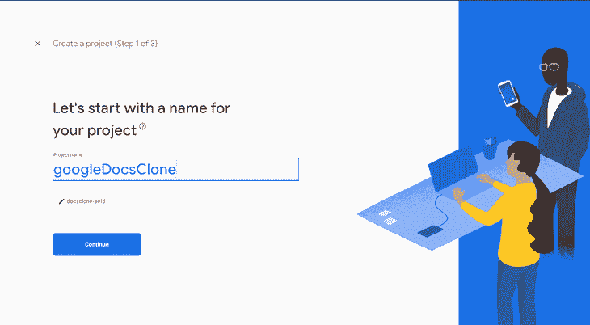

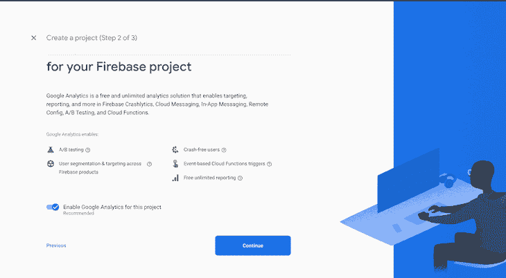

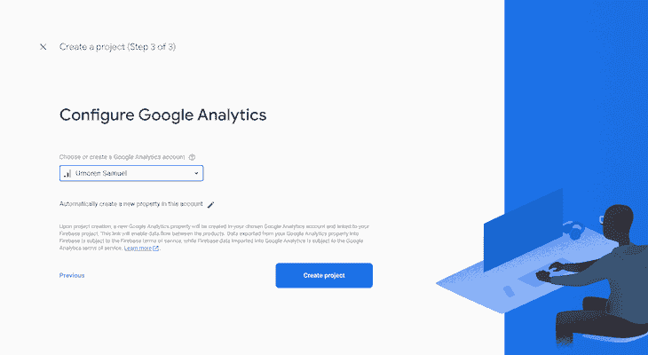

您将被重定向到项目控制台。在左侧栏中，点击 **Firestore 数据库**:

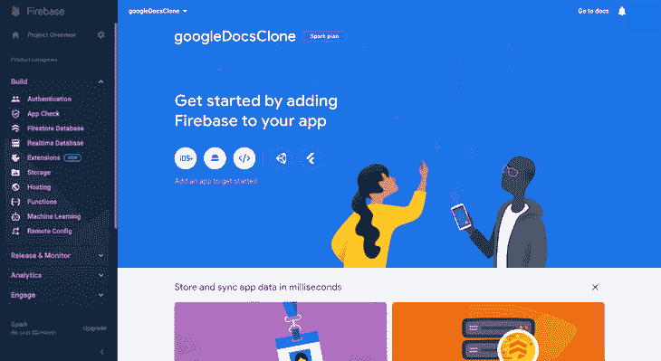

您将被重定向到 Firestore 页面。点击**创建数据库**按钮，在弹出窗口中选择**测试**模式。点击**下一个**按钮:

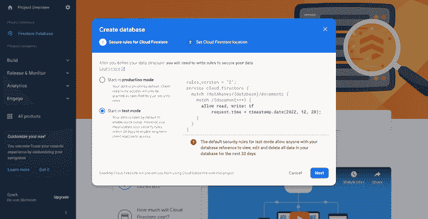

选择一个云 Firestore 位置，点击**下一步**:

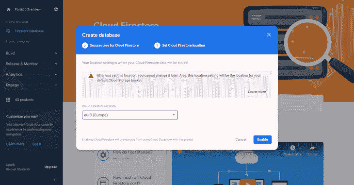

点击**启用**按钮。您应该会看到如下所示的页面:

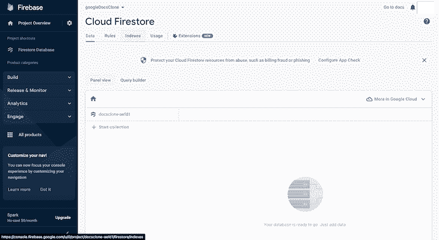

点击**开始收集**动作。创建包含以下字段和虚拟内容的集合:

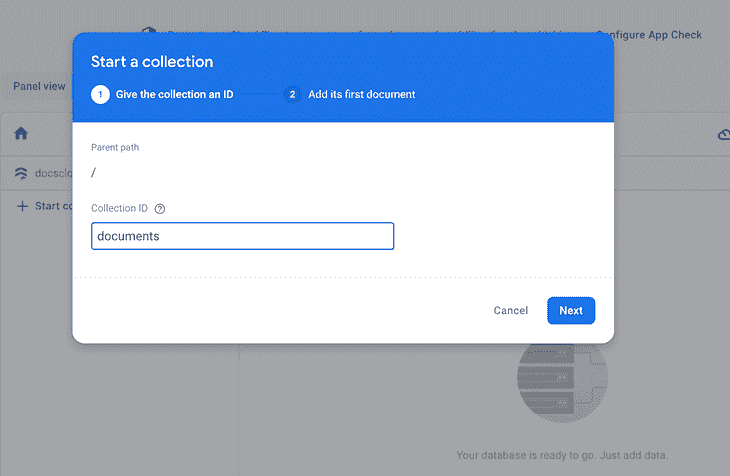

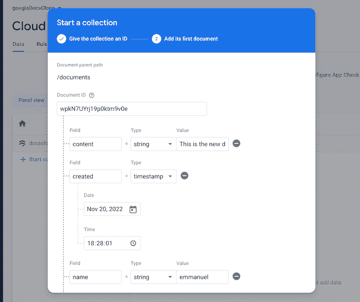

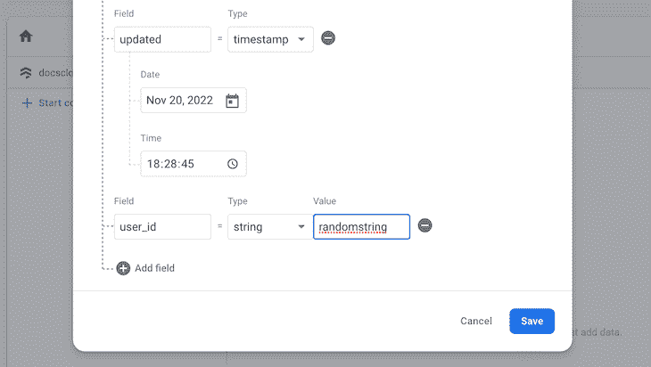

点击**保存**按钮:


我们刚刚执行了 Firestore 数据建模。我们创建了一个名为`Docs`的顶级集合，其中包含所有用户的文档。接下来，我们将添加文档的唯一标识符。它不会是一个随机的标识符，而是一个从经过身份验证的用户那里获取的生成的 ID，当我们在项目中实现 Google 身份验证时，这将派上用场。

我们还创建了一个名为`documents`的子集合，其中包含一个经过身份验证的用户的文档。最后，我们将为文档添加一个惟一的标识符。在此部分，我们有如下字段:

*   `name`:用户的名字
*   `content`:文件的内容
*   `created`:文档创建时的时间戳
*   `updated`:文档上次更新的时间戳

现在我们已经构建了云 Firestore 数据库，让我们更进一步，在我们的 Firebase 项目中[启用 Firebase Google 认证。](https://blog.logrocket.com/user-authentication-firebase-react-apps/)

要实现这一点，您可以转到仪表板侧边栏上的**身份验证**选项卡，然后单击**登录**方法选项卡。接下来，选择**谷歌**按钮。将出现一个弹出对话框。点击**启用**按钮，点击**保存**保存更改:

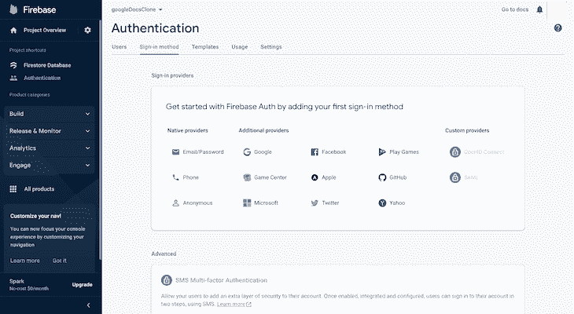

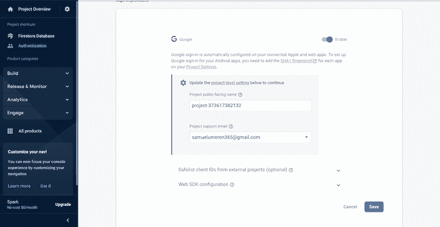

## 项目设置

进入你的项目文件夹，为`signup.html`、`signup.css`、`firebase.js`和`code.auth.js`创建文件。首先，让我们将 Firebase 添加到我们的项目中。转到 Firebase Google 控制台，复制项目配置。

回到控制台中的 Firebase 项目主页:

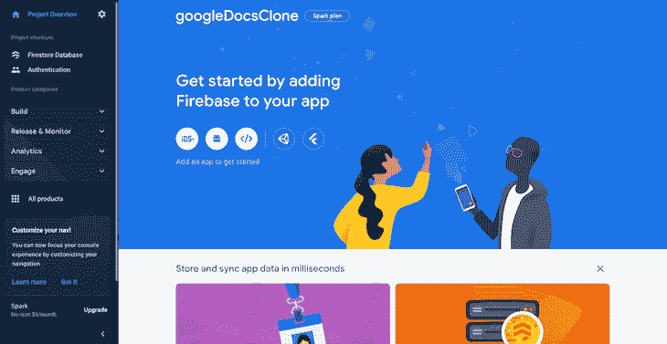

按如下方式注册应用程序:

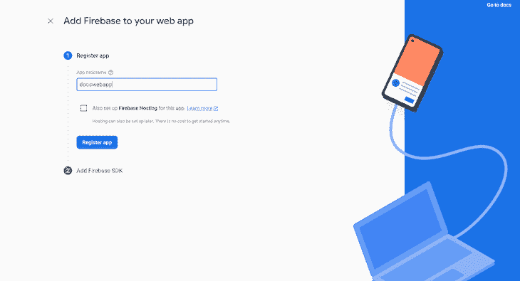

复制您的凭据:

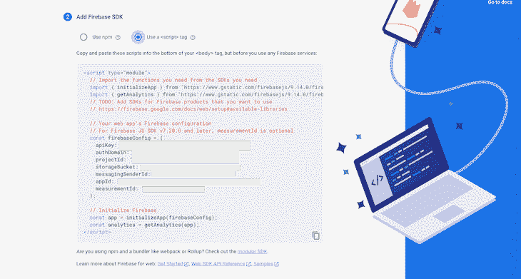

将凭证粘贴到您的`firebase.js`文件中，如下面的代码所示:

```
import { initializeApp } from 'https://www.gstatic.com/firebasejs/9.14.0/firebase-app.js'
const firebaseConfig = {
        apiKey: 'project key',
        authDomain: 'project.firebaseapp.com',
        databaseURL: 'https://project.firebaseio.com',
        projectId: 'project',
        storageBucket: 'project.appspot.com',
        messagingSenderId: 'projectSenderId',
        appId: 'ProjectId'
};
initializeApp(firebaseConfig);
export default firebaseConfig;

```

### 添加 Google 身份验证

在`signup.html`文件中，添加以下代码:

```
<div class="google">
<button class="btn-google" id="sign-in">
        
         <span>Sign up with Google</span>
    </button>
</div&gt;

```

在上面的代码中，我们有一个带有`google`类的`div`和一个带有`btn-google`类的按钮。我们也有一个`sign-up` ID。`div`是包裹`auth`按钮的容器。现在，让我们实现 Google auth 函数。在`auth.js`文件中，复制并粘贴以下代码:

```
import { signInWithPopup, GoogleAuthProvider, getAuth } from '<https://www.gstatic.com/firebasejs/9.14.0/firebase-auth.js>'

const signInGoogleButton = document.getElementById('sign-in');

// Google auth login
export function authenticateWithGoogle() {
        // eslint-disable-next-line no-undef
        const provider = new GoogleAuthProvider();
        const auth = getAuth();
        // eslint-disable-next-line no-undef

        signInWithPopup(auth, provider)
                .then(function (result) {
                        window.location.href = '../index.html';
                        console.log('working', result)
                })
                .catch(function (error) {
                        const errorCode = error.code;
                        const errorMessage = error.message;
                        const email = error.email;
                        const credential = error.credential;
                        console.log(errorCode, errorMessage, email, credential);
                });
}

signInGoogleButton.addEventListener('click', authenticateWithGoogle);

```

在上面的代码中，我们创建了一个名为 Google `authentication()`的函数。当用户点击项目网页上的 Google 注册按钮时，该功能会触发 Firebase Google 弹出窗口。如果注册成功，开发人员控制台将让用户登录并关闭弹出窗口。

现在我们已经实现了 Google 注册，让我们继续下一个任务。

## 创建我们的文本编辑器

我们将创建一个基本的文本编辑器，允许我们键入和编辑单词。让我们首先创建一个`editor.html`文件，并编写下面的代码:

```
<div class="edit-content">
  <p class="loading" id="loading">Saving document....</p>
  <div class="editor" contenteditable="true" id="editor"></div>
</div&gt;

```

在上面的代码中，我们创建了一个`div`，绑定了一个`contenteditable`属性，并将值设置为`true`。属性将任何容器转换成可编辑的文本字段。查看我们的网页，我们可以看到`div`已经变成了一个可编辑的文本字段。接下来，我们将实现文本格式特性，如斜体、粗体、文本对齐等。

## 实现文本格式

### `bold`

我们将实现的第一种文本格式是`bold`:

```
<a href="javascript:void(0)" onclick="format('bold')">
  <span class="fa fa-bold fa-fw"></span>
</a>

```

上面的代码是一个内置的 JavaScript 函数，它接受一个适当的值，并在调用该函数时对其进行格式化。

### `italic`

`italic`功能将文本设为斜体。每当突出显示文本时，就会触发该函数:

```
<a href="javascript:void(0)" onclick="format('italic')">
  <span class="fa fa-italic fa-fw"></span>
</a&gt;

```

### 无序列表和有序列表

`unorderedlist`函数向文本添加项目符号，而`orderedlist`函数向文本添加数字:

```
<a href="javascript:void(0)" onclick="format('insertunorderedlist')">
  <span class="fa fa-list fa-fw"></span>
</a>
<a href="javascript:void(0)" onclick="format('insertOrderedList')">
  <span class="fa fa-list-ol fa-fw"></span>
</a>

```

### `Justify Left`、`Justify Full`、`Justify Center`和`Justify Right`

从函数名中，我们可以看出`Justify Left`函数将文本靠左对齐。默认情况下，所有文本都靠左对齐，因此我们可能不会注意到这些变化。

`Justify Full`功能将文本对齐，`Justify Center`将文本居中，`Justify Right`将文本向右对齐，分别为:

```
<a href="javascript:void(0)" onclick="format('justifyLeft')">
  <span class="fa fa-align-left fa-fw"></span>
</a>

<a href="javascript:void(0)" onclick="format('justifyFull')">
  <span class="fa fa-align-justify fa-fw"></span>
</a>

<a href="javascript:void(0)" onclick="format('justifyCenter')">
<span class="fa fa-align-center fa-fw"></span>
</a>

<a href="javascript:void(0)" onclick="format('justifyRight')">
  <span class="fa fa-align-right fa-fw"></span>
</a>

```

### `underline`

`underline`函数在触发时给文本加下划线:

```
<a href="javascript:void(0)" onclick="format('underline')">
  <span class="fa fa-underline fa-fw"></span>
</a>

```

### 选择颜色，更改字体大小，并选择字体

`Change Font size`是一个选择下拉菜单，显示不同的字体大小，并取所选大小的值。它将此应用于突出显示的文本。`Select Font`功能是显示不同字体的选择下拉菜单。它采用选定的字体值，并将其应用于突出显示的文本:

```
<input class="color-apply" type="color" onchange="chooseColor()"
id="myColor"/>
<select id="input-font" class="input" onchange="changeFont (this);">
    <option value="Arial">Arial</option>
    <option value="Helvetica">Helvetica</option>
    <option value="Times New Roman">Times New Roman</option>
    <option value="Sans serif">Sans serif</option>
    <option value="Courier New">Courier New</option>
    <option value="Verdana">Verdana</option>
    <option value="Georgia">Georgia</option>
    <option value="Palatino">Palatino</option>
    <option value="Garamond">Garamond</option>
    <option value="Comic Sans MS">Comic Sans MS</option>
    <option value="Arial Black">Arial Black</option>
    <option value="Tahoma">Tahoma</option>
    <option value="Comic Sans MS">Comic Sans MS</option>
</select>
<select id="fontSize" onclick="changeSize()">
    <option value="1">1</option>
    <option value="2">2</option>
    <option value="3">3</option>
    <option value="4">4</option>
    <option value="5">5</option>
    <option value="6">6</option>
    <option value="7">7</option>
    <option value="8">8</option>
</select>

```

有了上面的设置，我们应该有类似如下的东西:

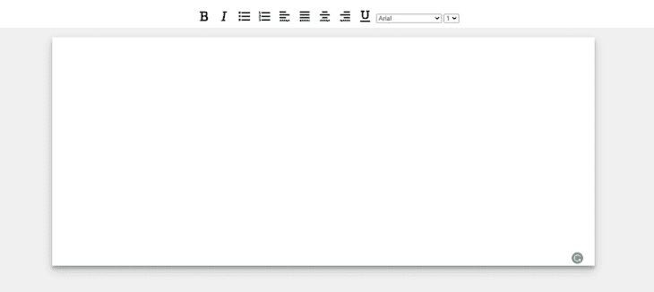

在上图中，我们可以看到编辑器字段和工具栏有不同的文本格式选项。

此时，如果我们在文本上键入并实现不同的文本格式，我们会注意到什么也没有发生。原因是我们还没有实现 JavaScript 内置函数或获取文档和命令并将命令应用于文档的 helper 函数。

## 实现助手功能

创建一个`main.js`文件，并编写下面的代码:

```
function format(command, value) {
  document.execCommand(command, false, value);
}

```

每次点击文本格式时，`Format`函数运行。该函数接受两个参数，一个命令和一个值。该命令是触发的文本格式的名称，其值是突出显示的文本。

如果作为用户交互的一部分被调用，`document.execCommand`仅返回`true`。

### 实现 helper 函数来改变字体大小和选择字体

```
function changeFont() {
  const Font = document.getElementById('input-font').value;
  document.execCommand('fontName', false, Font);
}

function changeSize() {
  const size = document.getElementById('fontSize').value;
  document.execCommand('fontSize', false, size);
}

```

第一个辅助函数是`changeFont`函数，它在触发`changeFont`格式时运行。它采用选定的字体并将其应用于突出显示的文本。

第二个函数是`changeSize`函数。它的工作方式与`changeFont`函数相同，只是改变了高亮文本的字体大小。

如果我们键入任何文本并应用任何格式选项，我们应该看到应用到突出显示的文本的格式。

现在，我们已经实现了文本编辑器和一些文本格式。接下来，我们将把文档保存到我们构建的 Firebase Cloud Firestore 数据库中。

## 将用户文档保存到云风暴

让我们在用户创建文档时实现将文档保存到 Firestore。您会记得，当创建带有`contenteditable`属性的可编辑的`div`时，我们给了它一个`id`属性。我们将监听可编辑的`div`，并在用户使用`id`属性创建文档时获取值。

* * *

### 更多来自 LogRocket 的精彩文章:

* * *

首先，我们将检查用户是否被授权。如果用户被授权，我们获取用户的`id`,并将其赋给`main.js`文件夹中的一个变量:

```
let userId = '';
let userName = '';
firebase.auth().onAuthStateChanged(function(user) {
  if (user) {
    userId = user.uid;
    userName = user.displayName;
    init();
  } else {
    console.log(user + '' + 'logged out');
  }
});

function init(){
  const token = localStorage.getItem('token');
  if(!token){
    const docId = firebase.firestore().collection('docs')
                                      .doc(userId)
                                      .collection('documents')
                                      .doc().id;
      localStorage.setItem('token', docId);
    }else{
        delay(function(){
          getSingleDocDetails(token);
        }, 1000 );
    }
}

```

`firebase.auth().onAuthStateChanged`函数是一个 Firebase 函数，它检查用户是否登录。如果用户存在，我们得到一个`user.id`并将`id`赋给我们上面创建的一个名为`userId`的变量。

`init()`功能检查`localStorage`中是否存储有文件`id`。如果没有，它从 Firestore 创建一个 doc `id`，并将其设置在`localStorage`中。如果有，则调用`getSingleDocDetails()`函数。稍后我们将会看到`getSingleDocDetails()`函数。

要获取并保存用户文档，在`main.js`文件夹中，编写以下代码:

```
const editor = document.getElementById('editor');
let dos = '';

editor.addEventListener('input', e => {
  dos = e.target.innerHTML;
  delay(function(){
    addDoc(word);
  }, 1000 );
});

var delay = (function(){
  var timer = 0;
  return function(callback, ms){
    clearTimeout (timer);
    timer = setTimeout(callback, ms);
  };
})();

```

我们创建了一个名为`editor`的变量。我们使用我们指定的`id`属性将值指定为带有`contenteditable`属性的`div`。

`document.getElementById`搜索传递给它的带有`id`名称的 HTML 标签。
接下来，我们通过调用事件监听器`editor.addEventListener(input, (e))`来监听`div`以发现用户何时开始输入。

`.addEventListener(input, (e))`事件监听可编辑字段内的任何更改。一旦进行了更改，我们将 div `innerHtml`作为目标，并将该值作为参数传递给一个函数。

请记住，我们使用了`.innerHTML`而不是`.value`，因为我们使用的是 div。我们还调用了`delay()`函数，该函数停止了`addDoc()`函数，以便它在将数据保存到 Cloud Firestore 之前等待用户完成输入。

## 调用`addDoc()`函数

```
function addDoc(word) {

  const docId = localStorage.getItem('token');

    firebase
    .firestore()
    .collection('docs').doc(userId)
    .collection('documents').doc(docId).set({
      name: userName,
      createdAt: new Date(),
      updated: new Date(),
      content: word,
    })
    .then(() => {
      loading.style.display = 'none';
    })
    .catch(function(error) {
      console.error('Error writing document: ', error);
    });
}

```

在`addDoc()`函数中，我们首先从本地存储中获取我们创建的 ID。接下来，我们调用 Firebase 查询函数`.set()`，并在第一个`.doc()`方法中传递当前登录用户的 ID 作为参数，在第二个`.doc()`方法中传递作为参数创建的`docId`。

我们将文档的名称设置为当前登录用户的`userName`，然后创建一个新的`Date()`对象。然后，它被更新为新的`Date`对象。最后，内容被更新为用户创建的文档。

如果我们检查 Firestore 数据库，我们会看到保存的文档。接下来，我们将了解如何从 Cloud Firestore 中检索数据。

## 从云 Firestore 获取用户文档

在获取用户文档之前，我们将使用下面的代码实现仪表板页面:

```
<nav class="navbar">
      <div class="nav-col-logo">
        <a href="#"><i class="fa fa-book"></i> GDocs</a>
      </div>
      <div class="nav-col-input">
        <form id="searchForm">
          <input type="search" placeholder="Search" id="search" />
        </form>
      </div>
      <div class="nav-col-img">
        <a href="#"><i class="fa fa-user"></i></a>
      </div>
    </nav>
    <div class="documents">
      <div class="section group">
        <div class="col span_1_of_3"><h4>Today</h4></div>
        <div class="col span_1_of_3"><h4>Owned by anyone</h4></div>
        <div class="col span_1_of_3"><h4>Last opened</h4></div>
      </div>
      <div id="documents"></div>
    </div>
    <div class="creat-new-doc">
      <button class="btn-color" type="button" id="createNewDoc">
        +
      </button>
    </div>

```

如果上面的代码已经实现，我们的网页中应该会有类似下图的内容:

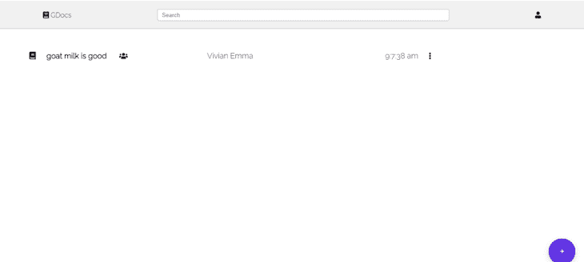

在上图中，我们可以看到蓝色背景的按钮。该按钮将用户带到编辑器页面，在那里他们可以创建一个新文档。上面的默认数据显示了在我们获取用户创建的文档并将其保存到 Cloud Firebase 后，文档布局将如何显示。

### 获取实际数据

要获得实际数据，从下面的代码开始:

```
let holdDoc = [];
function getDocuments(id) {
        const q = query(collection(firestore, 'docs', id, 'documents'));
        const unsubscribe = onSnapshot(q, (querySnapshot) => {
                querySnapshot.forEach((doc) => {
                        let dcus = doc.data();
                        dcus.id = doc.id;
                        holdDoc.push(dcus);
                        showDoc();
                });
        });
}

```

我们创建了一个名为`getDocument()`的函数；在里面，我们使用集合引用查询 Firestore。接下来，我们循环遍历得到的对象，并将它和文档 ID 一起放入我们创建的空数组中。然后，我们调用显示实际数据的`showDoc()`函数。现在，让我们将实际数据显示如下:

```
const docBook = document.getElementById('documents');
function showDoc() {
  docBook.innerHTML = null;
  for (let i = 0; i < holdDoc.length; i++){
    let date = new Date( holdDoc[i].updated.toMillis());
    let hour = date.getHours();
    let sec = date.getSeconds();
    let minutes = date.getMinutes();
    var ampm = hour >= 12 ? 'pm' : 'am';
    hour = hour % 12;
    hour = hour ? hour : 12;
    var strTime = hour + ':' + minutes + ':' + sec + ' ' + ampm;
    let subString = holdDoc[i].content.replace(/^(.{14}[^\\s]*).*/, '$1');
    docBook.innerHTML += `
      <div class="section group">
        <div class="col span_1_of_3">
          <p><a id="${holdDoc[i].id}" onclick="onclick="localStorage.setItem('token', id); window.location.href = '../editor.html'">
            <i class="fa fa-book"></i>
              ${subString}
            <i class="fa fa-users"></i>
          </a></p>
        </div>
        <div class="col span_1_of_3">
          <p>${holdDoc[i].name}</p>
        </div>
        <div class="col span_1_of_3">
          <div class="dropdown">
            <p> ${strTime}
              <i class="fa fa-ellipsis-v dropbtn"
                onclick="myFunction()" >
              </i>
            </p>
            <div id="myDropdown" class="dropdown-content">
              <a href="#" target="_blank" >Delete Doc</a>
              <a href="#">Open in New Tab</a>
            </div>
          </div>
        </div>
      </div>
       `;
  }
}

```

我们首先获取想要显示文档的`div`的 ID。之后，我们调用了`showDoc()`函数。在`showDoc()`函数中，我们首先遍历得到的对象，然后将它附加到我们创建的变量中。如果我们加载网页，我们可以看到显示的数据。

查看我们编写的`showDoc()`函数，可以看到我们在函数内部将文档的 ID 作为参数传递。然后我们调用了外部函数。在函数内部，我们获取`id`并将其存储在`localStorage`中。然后，我们可以将用户导航到编辑器页面。

在`editor.js`页面中，编写下面的代码:

```
function getSingleDocDetails(docId){
  firebase
    .firestore()
    .collection('docs')
    .doc(userId)
    .collection('documents')
    .doc(docId)
    .get()
    .then((doc) => {
      if (doc.exists) {
        editor.innerHTML += doc.data().content;
      } else {
        console.log('No such document!');
      }
    }).catch(function(error) {
      console.log('Error getting document:', error);
    });
}

```

在编辑器页面中，我们定义了一个`init()`函数来检查在`localStorage`中是否存储了一个`id`。如果有，它调用`getSingleDocDetails()`函数并从 cloud Firestore 获取文档，显示给用户继续。如果用户做了任何更改，它将更新文档。

### 在线和离线编辑

让我们看看如何实现在线和离线编辑。如果用户离线，我们仍然希望能够保存用户的文档，如果用户恢复在线，我们希望能够在不中断用户的情况下将文档同步到 Firebase。为此，请编写以下代码:

```
function updateOnlineStatus() {
  }
updateOnlineStatus();

```

在上面的代码中，我们首先创建了一个名为`updateOnlineStatus()`的函数，并在作用域外调用该函数。现在，我们将复制获取用户文档的方法，并将其粘贴到函数中，就像下面的代码一样:

```
function updateOnlineStatus() {
  editor.addEventListener('input', e => {
      dos = e.target.innerHTML;
      delay(function(){
        addDoc(dos);
      }, 1000 );
    });
  }

```

之后，我们将监听浏览器来跟踪用户何时在线和离线。编写下面的代码:

```
editor.addEventListener('input', e => {
      dos = e.target.innerHTML;
      delay(function(){
        addDoc(dos);
      }, 1000 );
   if (navigator.onLine === true) {
      const word =  localStorage.getItem('document');
      addDoc(word);
      localStorage.removeItem('document');

      return;
    } else {
      localStorage.setItem('document', dos);

      return;
    }

});

```

我们使用了一个`if`语句来检查`navigator.online === true`是否。`navigator.online`是一个返回`true`或`false`值的属性。当用户在线时，`true`值返回，当用户离线时，`false`值返回。

我们设置条件来检查用户在编辑或创建文档时是否在线。如果用户在线，我们从本地存储中获取文档，并将其发送到 Cloud Firestore。但是，如果用户离线，我们继续将文档保存到本地存储。

## 结论

在本文中，我们学习了如何创建一个基本的文本编辑器。我们学习了如何构建云 Firestore 数据库，如何使用 Firebase `.set()`方法，以及如何集成在线和离线编辑。我希望你喜欢这篇文章，如果你有任何问题，一定要留下评论。

## 你的前端是否占用了用户的 CPU？

随着 web 前端变得越来越复杂，资源贪婪的特性对浏览器的要求越来越高。如果您对监控和跟踪生产环境中所有用户的客户端 CPU 使用、内存使用等感兴趣，

[try LogRocket](https://lp.logrocket.com/blg/css-signup)

.

[](https://lp.logrocket.com/blg/css-signup)[https://logrocket.com/signup/](https://lp.logrocket.com/blg/css-signup)

LogRocket 就像是网络和移动应用的 DVR，记录你的网络应用或网站上发生的一切。您可以汇总和报告关键的前端性能指标，重放用户会话和应用程序状态，记录网络请求，并自动显示所有错误，而不是猜测问题发生的原因。

现代化您调试 web 和移动应用的方式— [开始免费监控](https://lp.logrocket.com/blg/css-signup)。

## 通过理解上下文，更容易地调试 JavaScript 错误

调试代码总是一项单调乏味的任务。但是你越了解自己的错误，就越容易改正。

LogRocket 让你以新的独特的方式理解这些错误。我们的前端监控解决方案跟踪用户与您的 JavaScript 前端的互动，让您能够准确找出导致错误的用户行为。

[](https://lp.logrocket.com/blg/javascript-signup)

LogRocket 记录控制台日志、页面加载时间、堆栈跟踪、慢速网络请求/响应(带有标题+正文)、浏览器元数据和自定义日志。理解您的 JavaScript 代码的影响从来没有这么简单过！

[Try it for free](https://lp.logrocket.com/blg/javascript-signup)

.