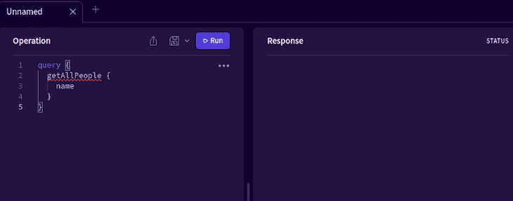
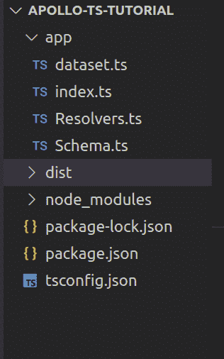
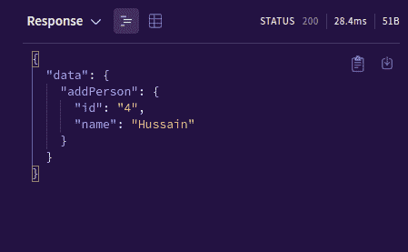
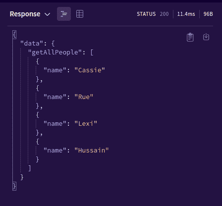
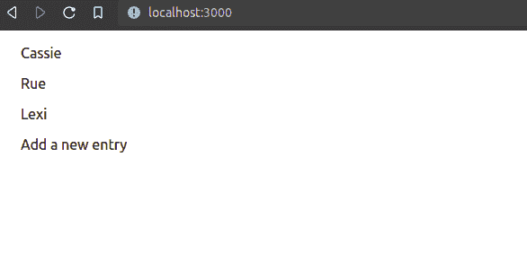
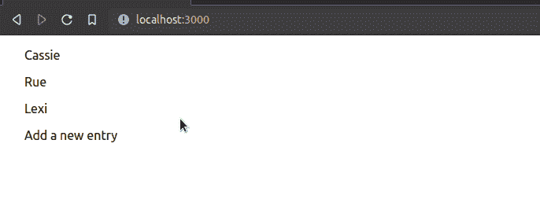
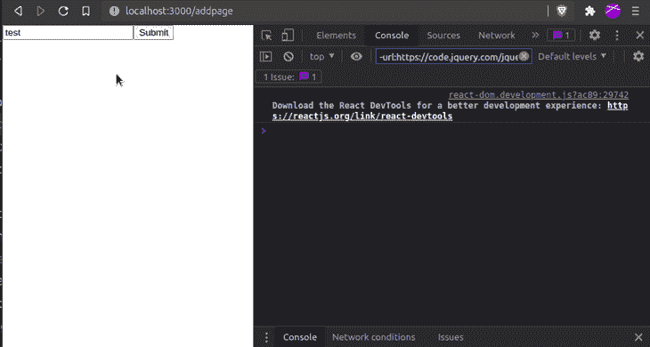
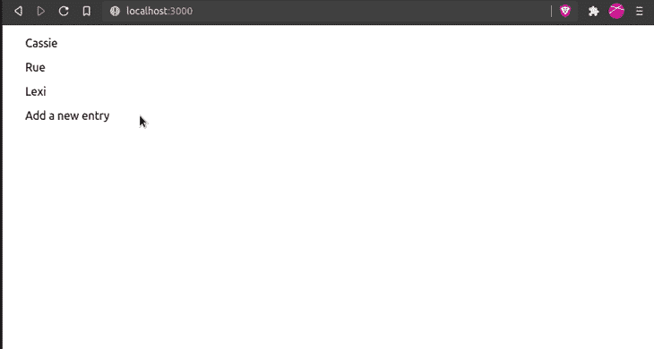

# 用 TypeScript 和 graphql-request - LogRocket Blog 在 Node.js 中构建一个 GraphQL 应用程序

> 原文：<https://blog.logrocket.com/build-graphql-app-node-js-typescript-graphql-request/>

在本文中，您将在后端使用 GraphQL 和 Node.js 构建一个全栈应用程序。同时，我们的前端将使用`[graphql-request](https://github.com/prisma-labs/graphql-request)`库在我们的后端执行网络操作。

我们将涵盖以下步骤:

## 为什么要使用 graphql-request 和 TypeScript？

每当开发人员使用 Apollo 构建 GraphQL 服务器时，该库都会生成一个“前端”,如下所示:



该接口允许用户通过代码向服务器发出查询或变异请求。然而，让我们解决房间里的大象:它看起来不太用户友好。由于前端没有任何按钮或任何有用的界面元素，许多用户可能很难在你的应用程序中导航。因此，这会缩小你的用户群。那么我们如何解决这个问题呢？

这就是`[graphql-request](https://github.com/prisma-labs/graphql-request)`的用武之地。它是一个开源库，允许用户在 GraphQL 服务器上执行查询。它具有以下特点:

*   轻量级-这个库只有 21 千字节多一点，这确保了你的应用程序保持高性能
*   基于承诺的 API——这带来了对[异步应用](https://stackoverflow.com/questions/56816731/what-are-the-advantages-of-using-async-await)的支持
*   TypeScript 支持— `graphql-request`是众多支持 TypeScript 的库之一。Typescript 的一个主要优点是它允许稳定和可预测的代码

例如，看看下面的程序:

```
let myNumber = 9; //here, myNumber is an integer
myNumber = 'hello'; //now it is a string.
myNumber = myNumber + 10; //even though we are adding a string to an integer,
//JavaScript won't return an error. In the real world, it might bring unexpected outputs.
//However, in Typescript, we can tell the compiler..
//what data types we need to choose.
let myNumber:number = 39; //tell TS that we want to declare an integer.
myNumber = 9+'hello'; //returns an error. Therefore, it's easier to debug the program
//this promises stability and security. 

```

在本文中，我们将使用 GraphQL 和 TypeScript 构建一个全栈应用程序。这里，我们将使用`[apollo-server-express](https://www.npmjs.com/package/apollo-server-express)`包来构建一个后端服务器。此外，对于前端，我们将使用 Next 和`graphql-request`来消费我们的 GraphQL API。

## 构建我们的服务器

### 项目初始化

要初始化空白 Node.js 项目，请运行以下终端命令:

```
mkdir graphql-ts-tutorial #create project folder 
cd graphql-ts-tutorial 
npm init -y #initialize the app

```

完成后，我们现在必须告诉 Node 我们需要在代码库中使用 TypeScript:

```
#configure our Typescript:
npx tsc --init --rootDir app --outDir dist --esModuleInterop --resolveJsonModule --lib es6 --module commonjs --allowJs true --noImplicitAny true
mkdir app #our main code folder
mkdir dist #Typescript will use this folder to compile our program.

```

接下来，安装这些依赖项:

```
#development dependencies. Will tell Node that we will use Typescript
npm install -d ts-node @types/node typescript @types/express nodemon
#Installing Apollo Server and its associated modules. Will help us build our GraphQL
#server
npm install apollo-server-express apollo-server-core express graphql

```

在这一步之后，导航到您的`app`文件夹。在这里，创建以下文件:

*   我们的主文件。这将执行并运行我们的 Express GraphQL 服务器
*   这将作为我们的数据库，提供给客户
*   这个模块将处理用户命令。我们将在本文后面了解解析器
*   `Schema.ts`:顾名思义，这个文件将存储向客户端发送数据所需的原理图

最后，您的文件夹结构应该是这样的:



### 创建我们的数据库

在本节中，我们将创建一个虚拟数据库，用于发送请求的数据。为此，转到`app/dataset.ts`并编写以下代码:

```
let people: { id: number; name: string }[] = [
  { id: 1, name: "Cassie" },
  { id: 2, name: "Rue" },
  { id: 3, name: "Lexi" },
];
export default people;

```

*   首先，我们创建了一个名为`people`的对象数组
*   这个数组将有两个字段:`number`类型的`id`和`string`类型的`name`

### 定义我们的模式

现在，我们将为我们的 GraphQL 服务器创建一个模式。

简而言之，GraphQL 模式是客户端可以从 API 请求的数据集的描述。这个概念类似于[猫鼬图书馆](https://mongoosejs.com/)。
要构建一个模式，导航到`app/Schema.ts`文件。在那里，编写以下代码:

```
import { gql } from "apollo-server-express"; //will create a schema
const Schema = gql`
  type Person {
    id: ID!
    name: String
  }
  #handle user commands
  type Query {
    getAllPeople: [Person] #will return multiple Person instances
    getPerson(id: Int): Person #has an argument of 'id` of type Integer.
  }
`;
export default Schema; 
//export this Schema so we can use it in our project

```

让我们一段一段地分解这段代码:

*   `Schema`变量包含我们的 GraphQL 模式
*   首先，我们创建了一个`Person`模式。它将有两个字段:`ID`类型的`id`和`String`类型的`name`
*   后来，我们指示 GraphQL，如果客户机运行`getAllPeople`命令，服务器将返回一组`Person`对象
*   此外，如果用户使用`getPerson`命令，GraphQL 将返回一个`Person`实例

### 创建解析器

既然我们已经编写了模式，下一步就是定义解析器。
简单来说，解析器是一组为 GraphQL 查询生成响应的函数。换句话说，解析器充当 GraphQL 查询处理程序。
在`Resolvers.ts`中，编写以下代码:

```
import people from "./dataset"; //get all of the available data from our database.
const Resolvers = {
  Query: {
    getAllPeople: () => people, //if the user runs the getAllPeople command
    //if the user runs the getPerson command:
    getPerson: (_: any, args: any) => { 
      console.log(args);
      //get the object that contains the specified ID.
      return people.find((person) => person.id === args.id);
    },
  },
};
export default Resolvers;

```

*   这里，我们创建了一个`Query`对象来处理所有进入服务器的查询
*   如果用户执行`getAllPeople`命令，程序将返回数据库中的所有对象
*   此外，`getPerson`命令需要一个参数`id`。这将返回一个具有匹配 ID 的`Person`实例
*   最后，我们导出了我们的解析器，以便它可以与我们的应用程序链接

### 配置我们的服务器

我们快完成了！现在我们已经构建了模式和解析器，下一步是将它们连接在一起。

在`index.js`中，写下这段代码:

```
import { ApolloServer } from "apollo-server-express";
import Schema from "./Schema";
import Resolvers from "./Resolvers";
import express from "express";
import { ApolloServerPluginDrainHttpServer } from "apollo-server-core";
import http from "http";

async function startApolloServer(schema: any, resolvers: any) {
  const app = express();
  const httpServer = http.createServer(app);
  const server = new ApolloServer({
    typeDefs: schema,
    resolvers,
    //tell Express to attach GraphQL functionality to the server
    plugins: [ApolloServerPluginDrainHttpServer({ httpServer })],
  }) as any;
  await server.start(); //start the GraphQL server.
  server.applyMiddleware({ app });
  await new Promise<void>((resolve) =>
    httpServer.listen({ port: 4000 }, resolve) //run the server on port 4000
  );
  console.log(`Server ready at http://localhost:4000${server.graphqlPath}`);
}
//in the end, run the server and pass in our Schema and Resolver.
startApolloServer(Schema, Resolvers);

```

让我们来测试一下！要运行代码，使用以下 Bash 命令:

```
npx nodemon app/index.ts 

```

这将在`localhost:4000/graphql` URL 创建一个服务器。

在这里，您可以在 UI 中看到可用的模式:


这意味着我们的代码有效！

我们所有的 GraphQL 查询都将在**操作**面板中进行。要查看它的运行情况，请在此框中键入以下代码片段:

```
#make a query:
query {
  #get all of the people available in the server
  getAllPeople {
    #procure their IDs and names.
    id
    name
  }
}

```

要查看结果，点击**运行**按钮:


我们甚至可以通过`getPerson`查询来搜索特定的实体:

```
query ($getPersonId: Int) { #the argument will be of type Integer
  getPerson(id: 1) {
    #get the person with the ID of 1
    name
    id
  }
}

```


### 创造突变

在 GraphQL 世界中，突变是对数据库产生副作用的命令。常见的例子包括:

*   将用户添加到数据库中—当客户注册网站时，用户会执行一个突变，将他们的数据保存到他们的数据库中
*   编辑或删除对象—如果用户修改或删除数据库中的数据，他们实际上是在服务器上创建一个变异

要处理突变，请转到您的`Schema.ts`模块。这里，在`Schema`变量中，添加以下代码行:

```
const Schema = gql`
  #other code..
  type Mutation {
    #the addPerson commmand will accept an argument of type String.
    #it will return a 'Person' instance. 
    addPerson(name: String): Person
  }
`;

```

我们的下一步是创建一个解析器来处理这种变异。为此，在`Resolvers.ts`文件中，添加以下代码块:

```
const Resolvers = {
  Query: {
    //..further code..
  },
  //code to add:
  //all our mutations go here.
  Mutation: {
    //create our mutation:
    addPerson: (_: any, args: any) => {
      const newPerson = {
        id: people.length + 1, //id field
        name: args.name, //name field
      };
      people.push(newPerson);
      return newPerson; //return the new object's result
    },
  },
};

```

*   `addPerson`变异接受一个`name`参数
*   当一个`name`被传递时，程序会用一个匹配的`name`键创建一个新的对象
*   接下来，它将使用`push`方法将该对象添加到`people`数据集
*   最后，它会将新对象的属性返回给客户端

就是这样！为了进行测试，在**操作**窗口中运行以下代码:

```
#perform a mutation on the server
mutation($name: String) {
  addPerson(name:"Hussain") { #add a new person with the name "Hussain"
    #if the execution succeeds, return its 'id' and 'name` to the user.
    id
    name
  }
}

```



让我们验证 GraphQL 是否已经向数据库添加了新条目:

```
query {
  getAllPeople { #get all the results within the 'people' database. 
  #return only their names
  name 
  }
}

```



## 打造我们的客户

我们已经成功地构建了我们的服务器。在本节中，我们将使用 Next 构建一个客户端应用程序，它将监听服务器并向 UI 呈现数据。

第一步，初始化一个空白的 Next.js 应用程序，如下所示:

```
npx [email protected] graphql-client --ts
touch constants.tsx #our query variables go here.

```

为了执行 GraphQL 操作，我们将使用 [graphql-request](https://github.com/prisma-labs/graphql-request#features) 库。这是一个最小的开源模块，它将帮助我们在服务器上进行突变和查询:

```
npm install graphql-request graphql
npm install react-hook-form #to capture user input

```

### 创建查询变量

在本节中，我们将对查询和变异进行编码，以帮助我们进行 GraphQL 操作。为此，转到`constants.tsx`并添加以下代码:

```
import { gql } from "graphql-request";
//create our query
const getAllPeopleQuery = gql`
  query {
    getAllPeople { #run the getAllPeople command
      id
      name
    }
  }
`;
//Next, declare a mutation
const addPersonMutation = gql`
  mutation addPeople($name: String!) {
    addPerson(name: $name) { #add a new entry. Argument will be 'name'
      id
      name
    }
  }
`;
export { getAllPeopleQuery, addPersonMutation };

```

*   在第一部分中，我们创建了`getAllPeopleQuery`变量。当用户运行这个查询时，程序将指示服务器获取数据库中的所有条目
*   随后，`addPerson`突变告诉 GraphQL 添加一个新条目，其中包含它所关注的`name`字段
*   最后，我们使用`export`关键字将我们的变量与项目的其余部分联系起来

### 执行查询

在`pages/index.ts`中，编写以下代码:

```
import type { NextPage, GetStaticProps, InferGetStaticPropsType } from "next";
import { request } from "graphql-request"; //allows us to perform a request on our server
import { getAllPeopleQuery } from "../constants"; 
import Link from "next/link";
const Home: NextPage = ({
  result, //extract the 'result' prop 
}: InferGetStaticPropsType<typeof getStaticProps>) => {
  return (
    <div className={styles.container}>
      {result.map((item: any) => { //render the 'result' array to the UI 
        return <p key={item.id}>{item.name}</p>;
      })}
    <Link href="/addpage">Add a new entry </Link>
    </div>
  );
};
//fetch data from the server
export const getStaticProps: GetStaticProps = async () => {
  //the first argument is the URL of our GraphQL server
  const res = await request("http://localhost:4000/graphql", getAllPeopleQuery);
  const result = res.getAllPeople;
  return {
    props: {
      result,
    }, // will be passed to the page component as props
  };
};
export default Home;

```

下面是这段代码的一段一段的分解:

*   在`getStaticProps`方法中，我们指示 Next 在我们的 GraphQL 服务器上运行`getAllPeople`命令
*   稍后，我们将它的响应返回给`Home`功能组件。这意味着我们现在可以将结果呈现给 UI
*   接下来，程序使用`map`方法将`getAllPeople`命令的所有结果呈现给 UI。每个段落元素将显示每个条目的`name`字段
*   此外，我们还使用了一个`Link`组件将用户重定向到`addpage`路线。这将允许用户向表中添加一个新的`Person`实例

要测试代码，请运行以下终端命令:

```
npm run dev

```

这将是结果:



我们的 GraphQL 服务器甚至可以实时更新。


### 执行突变

既然我们已经成功地执行了查询，我们甚至可以通过`graphql-request`库执行突变。

在您的`pages`文件夹中，创建一个名为`addpage.tsx`的新文件。顾名思义，该组件将允许用户向数据库添加新条目。这里，从编写以下代码块开始:

```
import type { NextPage, GetStaticProps, InferGetStaticPropsType } from "next";
import { request } from "graphql-request";
import { addPersonMutation } from "../constants";
const AddPage: NextPage = () => {
  return (
    <div>
      <p>We will add a new entry here. </p>
    </div>
  );
};
export default AddPage;

```

在这段代码中，我们创建了一个包含一段文本的空白页。我们这样做是为了确保我们的 URL 路由系统是否正常工作。



这意味着我们成功地使用了路由！接下来，将这个片段写入您的`addpage.tsx`文件:

```
import { useForm } from "react-hook-form";
const { register, handleSubmit } = useForm();
//if the user submits the form, then the program will output the value of their input.
const onSubmit = (data: any) => console.log(data);
return (
  <div>
    <form onSubmit={handleSubmit(onSubmit)}> {/*Bind our handler to this form.*/}
      {/* The user's input will be saved within the 'name' property */}
      <input defaultValue="test" {...register("name")} />
      <input type="submit" />
    </form>
  </div>
);

```

这将是输出:



现在我们已经成功地捕获了用户的输入，我们的最后一步是将他们的条目添加到服务器。

为此，更改位于`pages/addpage.tsx`文件中的`onSubmit`处理程序，如下所示:

```
const onSubmit = async (data: any) => {
  const response = await request(
    "http://localhost:4000/graphql",
    addPersonMutation,
    data
  );
  console.log(response);
};

```

*   这里，我们通过`request`函数对 GraphQL 服务器执行一个突变请求
*   此外，我们还在请求头中传递了`addPerson`突变命令。这将告诉 GraphQL 在我们的服务器上执行`addMutation`动作

这将是结果:



我们完事了。

## 结论

这里是这个项目的完整源代码。

在本文中，您了解了如何使用 GraphQL 和 TypeScript 创建全栈应用程序。它们都是编程世界中极其重要的技能，因为它们现在需求量很大。

如果你在这段代码中遇到了什么困难，我建议你解构这段代码，然后玩一玩，这样你就可以完全掌握这个概念了。

非常感谢您的阅读！编码快乐！

## 200 只显示器出现故障，生产中网络请求缓慢

部署基于节点的 web 应用程序或网站是容易的部分。确保您的节点实例继续为您的应用程序提供资源是事情变得更加困难的地方。如果您对确保对后端或第三方服务的请求成功感兴趣，

[try LogRocket](https://lp.logrocket.com/blg/node-signup)

.

[](https://lp.logrocket.com/blg/node-signup)[https://logrocket.com/signup/](https://lp.logrocket.com/blg/node-signup)

LogRocket 就像是网络和移动应用程序的 DVR，记录下用户与你的应用程序交互时发生的一切。您可以汇总并报告有问题的网络请求，以快速了解根本原因，而不是猜测问题发生的原因。

LogRocket 检测您的应用程序以记录基线性能计时，如页面加载时间、到达第一个字节的时间、慢速网络请求，还记录 Redux、NgRx 和 Vuex 操作/状态。

[Start monitoring for free](https://lp.logrocket.com/blg/node-signup)

.