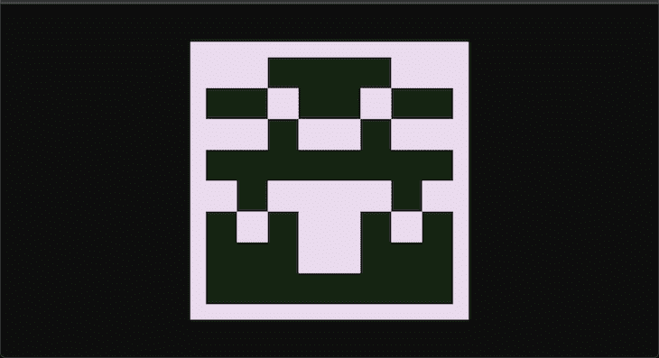
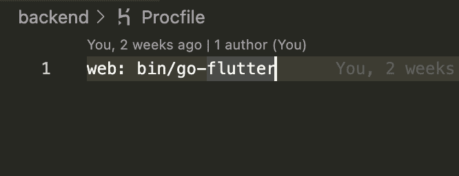
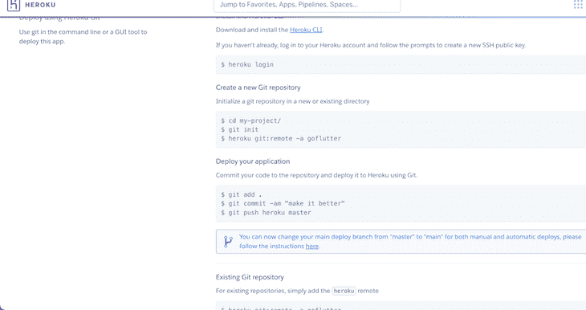
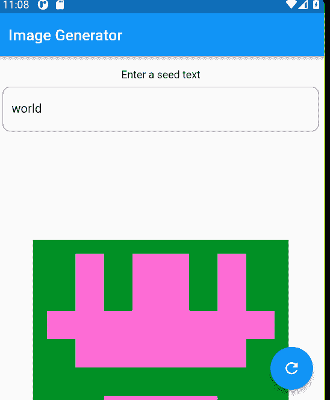

# 用 Flutter 和 Go 构建一个图像生成器

> 原文：<https://blog.logrocket.com/build-image-generator-flutter-go/>

## 介绍

Golang 是当今发展最快的编程语言之一。它由谷歌开发，据说和 C 一样快，但具有 Python 的简单性。

另一方面，Flutter 是一个 Dart 框架，允许您构建跨平台的移动应用程序。用 Flutter 编写的应用程序可以在 Android、iOS、web 上运行，最近也可以在桌面上运行。在本文中，我们将了解如何构建一个从 Golang 后端读取数据的 Flutter 应用程序。

## 先决条件

要做到这一点，您需要安装以下几样东西:

*   flutter——这是我们选择的移动框架
*   golang——我们将使用 Go 作为后端
*   Heroku-我们将在 Heroku 上托管我们的应用程序，因此您需要创建一个帐户。确保也安装 Heroku CLI
*   关于 Flutter 和 Go 的知识——这不是一个初学者教程，所以你需要有一些关于如何在 Flutter 和 Golang 中编码的知识

## 为什么旋舞 Golang？

Flutter 允许我们使用相同的代码库构建运行在移动、web 和桌面上的跨平台应用程序。

现在，让我们来看看 Golang 如此受欢迎的一些原因，以及为什么您可能希望在您的下一个项目中使用它:

*   这是一门容易学得很快的语言
*   Golang 对于构建微服务很有用
*   Golang 有一个活跃的开发者社区
*   Golang 编译成一个可以在任何环境下运行的二进制文件
*   因为 Go 是编译成机器代码的，所以它自然会胜过解释型语言或具有虚拟运行时的语言

## 构建后端

这个应用程序的后端非常简单。我们只有一个端点根据路径返回随机图像。为了生成随机图像，我们将使用一个名为`cameron`的库。

在您的项目根目录和一个`server.go`文件中创建一个后端文件夹，添加以下代码:

```
package main

import (
   "bytes"
   "fmt"
   "image/png"
   "log"
   "net/http"
   "os"

   "github.com/aofei/cameron"
)

func main() {
   port := os.Getenv("PORT")
   if port == "" {
       port = "3000"
   }
   log.Println("Starting server on port", port)
   log.Fatalln(http.ListenAndServe(fmt.Sprintf(":%v", port), http.HandlerFunc(identicon)))
}

func identicon(rw http.ResponseWriter, req *http.Request) {
   buf := bytes.Buffer{}
   png.Encode(&buf, cameron.Identicon([]byte(req.RequestURI), 540, 60))
   rw.Header().Set("Content-Type", "image/png")
   buf.WriteTo(rw)
}

```

我们从导入我们需要的包开始，包括`cameron`包。在我们的 main 方法中，我们从环境变量中获取应用程序端口，如果没有设置，我们将端口设置为`3000`。

然后，我们调用`http.ListenAndServe`函数，并传入一个处理程序，该处理程序在每次点击端点时调用`identicon`函数。`identicon`函数接收 HTTP 请求和响应，并使用`cameron`库从请求的路径生成一个随机图像。

现在，运行命令`go mod init go-flutter`来初始化当前目录中的 Go 模块。接下来，运行`go mod tidy`来安装我们的应用程序所依赖的所有包。最后，运行命令`go run server.go`来启动 Golang 服务器。


导航至`[http://localhost:3000](http://localhost:3000)`查看应用程序。您应该会看到一个随机生成的图像。



在我们将应用程序连接到后端之前，我们需要在线公开托管它。创建一个名为`Procfile`的文件，并添加以下内容:



现在将后端文件提交给 git，通过运行`heroku login`登录 Heroku，并运行命令`Heroku create <app_name>`创建一个新的应用程序。


导航至 Heroku 仪表盘查看您的应用，并按照**部署**选项卡上的说明部署应用。



点击`Open app`在浏览器中查看应用程序。

## 构建 Flutter 应用

好了，现在后端已经部署好了，让我们来构建 Flutter 应用程序。在您的项目根目录中，运行命令`flutter create <app_name>`来创建一个新的 Flutter 应用程序。用以下代码替换`main.dart`文件中的代码:

```
import 'package:flutter/material.dart';

void main() {
 runApp(const MyApp());
}

class MyApp extends StatelessWidget {
 const MyApp({Key? key}) : super(key: key);

 // This widget is the root of your application.
 @override
 Widget build(BuildContext context) {
   return MaterialApp(
     debugShowCheckedModeBanner: false,
     title: 'Flutter Demo',
     theme: ThemeData(
       primarySwatch: Colors.blue,
     ),
     home: const MyHomePage(title: 'Image Generator'),
   );
 }
}

class MyHomePage extends StatefulWidget {
 const MyHomePage({Key? key, required this.title}) : super(key: key);

 final String title;

 @override
 State<MyHomePage> createState() => _MyHomePageState();
}

class _MyHomePageState extends State<MyHomePage> {
 final TextEditingController _formController = TextEditingController();
 String _text = "";

 void _changeSeed() {
   setState(() {
     _text = _formController.text;
   });
 }

 @override
 Widget build(BuildContext context) {
   return Scaffold(
     appBar: AppBar(
       title: Text(widget.title),
     ),
     body: SingleChildScrollView(
       child: Padding(
         padding: const EdgeInsets.all(8.0),
         child: Center(
           child: Column(
             mainAxisAlignment: MainAxisAlignment.center,
             children: <Widget>[
               const Padding(
                 padding: EdgeInsets.all(8.0),
                 child: Text(
                   'Enter a seed text',
                 ),
               ),
               TextFormField(
                 decoration: InputDecoration(
                     border: OutlineInputBorder(
                         borderRadius: BorderRadius.circular(10))),
                 controller: _formController,
               ),
               Container(
                 margin: const EdgeInsets.all(40.0),
                 width: 540,
                 height: 540,
                 decoration: BoxDecoration(
                     image: DecorationImage(
                         image: NetworkImage(
                             "https://<your_app_name>.herokuapp.com/" + _text))),
               )
             ],
           ),
         ),
       ),
     ),
     floatingActionButton: FloatingActionButton(
       onPressed: _changeSeed,
       tooltip: 'Refresh',
       child: const Icon(Icons.refresh),
     ), // This trailing comma makes auto-formatting nicer for build methods.
   );
 }
}

```

首先，我们调用`runApp`方法来启动 Flutter 应用程序，并传入`MyApp`小部件。在`HomePage`小部件中，我们创建了一个函数来改变我们从`input`小部件中获取的文本。然后，我们返回一个`Scaffold`小部件，其中包含我们在应用程序中使用的文本字段、图像容器和浮动操作按钮。

确保将`[https://.herokuapp.com](https://.herokuapp.com)`替换为 Golang 后端的 URL。现在启动您的 Android 模拟器，运行命令`flutter run`在模拟器中构建并安装应用程序。



在输入字段中输入文本，然后单击刷新按钮生成新图像。

## 结论

在本文中，我们看了如何构建一个连接到 Golang 后端的 Flutter 应用程序，同时讨论了我们应该使用 Golang 和 Flutter 的一些原因。

虽然 Golang 是一种相对较新的语言，但它已经流行了很多年，并迅速成为构建 web 后端的首选工具。Flutter 也是一个用于构建跨平台 web 应用程序的工具。将这两者结合在一起，你会得到一个强大的组合。