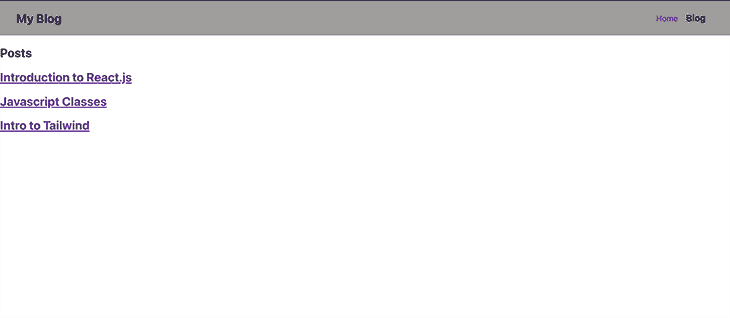
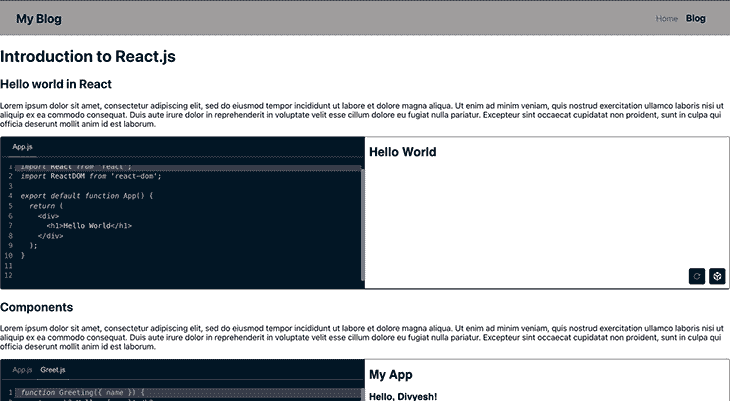
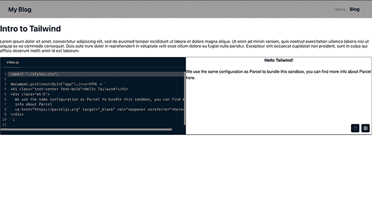

# 用 React 和 Sandpack - LogRocket 博客创建一个交互式博客

> 原文：<https://blog.logrocket.com/build-interactive-blog-with-react-sandpack/>

如果不使用支持交互性的特定库，在博客上实现交互性会很复杂。这些库为与博客的各个部分进行交互提供了一个简单的界面。

人们出于各种原因建立博客，从为包、库或框架构建文档，到写个人博客。这些博客中的许多还展示了使用静态和非交互式代码片段来使用其工具的各种方式。

在本文中，我将介绍一种使用 Sandpack 使代码示例在博客上更具交互性的方法，Sandpack 是 CodeSandbox 最新的用于交互式代码示例的开源组件工具包。我们将使用 React 创建一个博客，并使用 Sandpack 使其具有交互性。

## 先决条件

本教程假设您具备以下条件:

*   [节点](https://nodejs.org/en/) ≥ v12.20
*   npm ≥ v6.14.15
*   HTML、CSS、JavaScript 和 React 的基础知识

## 什么是沙包？

[Sandpack](https://sandpack.codesandbox.io/) 是一个组件工具包，可用于创建和显示实时编码样本。它是由 [CodeSandbox](https://codesandbox.io/) 背后的团队构建和维护的开源工具——它实际上是支持 CodeSandbox 的同一个浏览器内捆绑器。

沙盒包括以下功能:

*   代码编辑器体验
*   在编辑器中实时预览代码
*   支持所有主要的 JavaScript 框架
*   支持 npm 依赖关系
*   直接 CodeSandbox 集成，使您能够直接在 CodeSandbox 中打开代码示例

自 2021 年 12 月发布以来，Sandpack 迅速获得了技术生态系统的认可，并且已经在一些平台上使用！您可以在以下位置看到它的运行:

在我们开始建立我们的博客之前，让我们回顾一些重要的沙包概念。
这些概念包括对`sandpack-react`包及其一些组件的简要概述。你可以在他们的[文档](https://sandpack.codesandbox.io/docs/)中查看填砂组件和属性的完整列表。

在我们开始之前，让我们启动一个 React 应用程序，我们将在其中演示 Sandpack，并在稍后使用它来构建我们的博客。

## 用 Vite 创建一个 React 应用程序

我们将使用 [Vite](https://vitejs.dev/guide/#scaffolding-your-first-vite-project) 来引导我们的 React 应用程序。

```
# npm 6.x
npm init [email protected] sandpack-blog --template react

# npm 7+, extra double-dash is needed:
npm init [email protected] sandpack-blog -- --template react

```

这个命令创建一个名为`sandpack-blog`的 React 应用程序。成功创建应用程序后，使用以下命令切换到应用程序目录:

```
# switch into app directory
cd sandpack-blog

```

使用`npm install`命令安装所有依赖项。

## 安装`sandpack-react`

[`sandpack-react`是为 Sandpack 创建的现成 React 包。我们现在将把它作为一个依赖项添加到 React 应用程序中。](https://www.npmjs.com/package/@codesandbox/sandpack-react)

```
npm i @codesandbox/sandpack-react

```

一旦我们安装完依赖项，我们就可以运行我们的应用程序了。

```
npm run dev

```

在浏览器上，导航至`localhost:3000`。如果 React 应用程序已经正确创建，您应该在浏览器中看到以下内容:


现在，让我们回顾一下我们将在项目中使用的主要填砂组件。

## 填砂组件综述

`Sandpack`组件是一个预置组件。它包装了其他单独的`sandpack`组件，并为我们提供了一个可以随时使用的预配置组件。这意味着填砂组件几乎不需要配置。

让我们看看它在 React 应用程序中是如何工作的。在您最喜欢的代码编辑器中打开自举应用程序，转到`/src/App.jsx`，用下面的代码替换那里的代码:

```
import React from 'react';
import { Sandpack } from "@codesandbox/sandpack-react";
import "@codesandbox/sandpack-react/dist/index.css";

function App() {
  return (
    <>
      <h1>My Sandpack blog</h1>
      <Sandpack />
    </>
  )
}
export default App;

```

这将为我们呈现一个沙包编辑器和一个预览面板。代码编辑器中的代码是一个普通的 JavaScript 代码模板，它是由`Sandpack`组件使用的默认模板。


让我们回顾一下`/src/App.jsx`中的代码；

```
import React from 'react';
import { Sandpack } from "@codesandbox/sandpack-react";
import "@codesandbox/sandpack-react/dist/index.css";

```

在这里，我们导入`React`、`Sandpack`和`Sandpack css`样式表，其中包括标准`Sandpack`组件的样式。

```
function App() {
  return (
    <>
      <h1>My Sandpack blog</h1>
      <Sandpack />
    </>
  )
}
export default App;

```

这里，我们有我们的功能性`App`组件，它包含一个[片段](https://reactjs.org/docs/fragments.html#short-syntax)，该片段包装了`<h1>`和`Sandpack`组件。片段使我们能够返回多个元素，而无需向 DOM 添加额外的节点。

## 通过 props 定制沙包编辑器

Sandpack 接受定制编辑器的各种道具。让我们来看看其中的几个:

*   *   `template`:`template`prop 使我们能够指定我们希望我们的应用程序使用的预定义模板。`Sandpack`目前支持以下模板:
        *   `"vanilla"` —这是默认设置
        *   `"angular"`
        *   `"react"`
        *   `"react-ts"`
        *   `"vanilla-ts"`
        *   `"vue"`
        *   `"vue3"`
        *   `"svelte"`
    *   `theme`:`theme`prop 使我们能够改变我们正在使用的代码编辑器的主题。Sandpack 目前附带以下预定义模板:
        *   `"light"` —这是默认设置
        *   `"dark"`
        *   `"sandpack-dark"`
        *   `"night-owl"`
        *   `"aqua-blue"`
        *   `"github-light"`
        *   `"monokai-pro"`
    *   `options`:[选项道具](https://sandpack.codesandbox.io/docs/api/react/interfaces/SandpackProps#options)使我们能够配置沙袋的一些内部组件。它接受许多不同的选项；让我们来看看其中的几个:
        *   `showLineNumbers`:切换编辑的行号；你可以通过`true`或者`false`，但是默认是`false`
        *   `showInlineErrors`:突出显示行内错误；你可以通过`true`或者`false`
        *   `showTabs`:切换编辑器上文件标签的可见性；你可以通过`true`或者`false`。只有打开多个文件时，文件标签才会默认显示，并且可以使用`showTabs`道具来强制标签的可见性
        *   `externalResources`:外部资源的数组，比如到外部 CSS 或 JS 资源的静态链接，它们被注入到 HTML 的`head`中，然后全局可用
    *   `customSetup`:使我们能够拥有自定义的`Sandpack`配置；如果我们不想使用`Sandpack's`预定义的模板，我们可以自己制作
    *   `files`:这是一个`object`，包含编辑器中使用的所有自定义文件。文件路径设置为键，代码设置为值
    *   `dependencies`:这是一个依赖对象，包含一个正在使用的`npm`包列表。`key`应该是包的名字，而值是`version`，格式和`package.json`T5 里面的完全一样

现在我们已经对`Sandpack`的工作原理有了基本的了解，让我们继续创建我们的博客。你可以查看[这个代码沙盒演示](https://codesandbox.io/s/sandpack-basics-0ml79?file=/src/App.js)的各种配置。

## 建立我们的博客

我们将使用`MDX`来建立我们的博客。`MDX`是一种 markdown 语言，它使我们能够使用`JSX`，这允许我们在 markdown 中使用可重用的组件。

我们将介绍以下步骤:

1.  [安装我们的包和依赖项](#installing-packages-dependencies)
2.  [配置`MDX`插件](#configuring-mdx-plugins)
3.  [构建我们的项目文件夹](#structuring-project-folder)
4.  [向我们的 React 博客添加内容](#adding-content-react-blog)
5.  [在`MDX`](#writing-posts-mdx) 写帖子

## 步骤 1:安装软件包和依赖项

在我们的自举`React`应用程序中安装以下依赖项:

*   `@mdx-js/react`:这是一个基于上下文的组件提供者，用于将 React 与`MDX`结合起来，使我们能够在一个点上传递所有的组件，这样我们就不必将它们导入到所有的`MDX`文件中。这不是强制性的，因为组件可以直接导入每个文件

    ```
    npm install @mdx-js/[email protected]
    ```

*   `react-router-dom`:用于在 React

    ```
    npm install [email protected]
    ```

    中创建路由器
*   `unist-util-visit`:这是一个`unist`实用程序，我们将使用它为 MDX 创建一个插件，这样我们就可以使用我们代码中的元数据

    ```
    npm install unist-util-visit
    ```

*   `@vitejs/plugin-react-refresh`:这是另一个比默认的 Vite 插件更容易和`mdx`一起使用的 Vite 插件，默认的 Vite 插件来自自举应用

    ```
    npm install -D @vitejs/plugin-react-refresh
    ```

## 步骤 2:配置`MDX`插件

我们现在将配置`MDX`插件。这使得 Vite 能够理解`mdx`语法。
将以下代码行添加到`vite.config.js`文件中:

```
import { defineConfig } from "vite";
import reactRefresh from '@vitejs/plugin-react-refresh';
import mdx from "@mdx-js/rollup";
import { visit } from "unist-util-visit";

function rehypeMetaAsAttributes() {
  return (tree) => {
    visit(tree, "element", (node) => {
      if (node.tagName === "code" && node.data && node.data.meta) {
        node.properties.meta = node.data.meta;
      }
    });
  };
};

// https://vitejs.dev/config/
export default defineConfig({
  plugins: [
    reactRefresh(),
    mdx({
      rehypePlugins: [rehypeMetaAsAttributes],
      providerImportSource: "@mdx-js/react",
    }),
  ],
});

```

这里发生了三件事:

1.  我们导入了所有必需的包
2.  我们创建了一个名为`rehypeMetaAsAttributes`的[重新类型](https://github.com/rehypejs/rehype/blob/main/doc/plugins.md#list-of-plugins)插件，它使我们能够设置元数据，我们可以将这些元数据传递给代码块，以编译代码的属性。当我们创建我们的沙包组件时，我们将会看到它的重要性
3.  然后，我们将这些插件传递到 Vite 配置中

此时，我们的应用程序可能会因错误而中断:`Error [ERR_REQUIRE_ESM]`。这是因为`mdx`包仅作为 ES 模块发布。

因此，为了让这为我们所用，我们可以用几种不同的方法来解决这个问题:

我们可以在我们的`package.json`文件中添加一个模块类型:

```
{
  "name": "sandpack-blog",
  "version": "0.0.0",
  "type" : "module",
  "scripts": {
    ...
  },
  "dependencies": {
    ...
  },
  "devDependencies": {
    ...
  }
}

```

或者，我们可以将`vite.config.js`文件的名称改为`vite.config.mjs`。

以上两个选项都可以，但我将使用第一个。

## 步骤 3:构建项目文件夹

我们将有两个主要的文件夹来保存我们的项目。第一个是`components`文件夹，我们将在其中构建我们的可重用组件，第二个是`pages`文件夹，它包含我们所有的页面。

将以下文件夹添加到 src 文件夹中:

```
src
├── components
|  ├── Blog
|  |  |  └── index.jsx
|  ├── CodeEditor
|  |  |  └── index.jsx
|  ├── ErrorBoundary
|  |  |  └── index.jsx
|  └── Navbar
|  |  |  └── index.jsx
├── pages
|  ├── blog
|  |  ├──Blogs.jsx
|  |  ├── intro-to-react.mdx
|  |  ├── javascript-classes.mdx
|  |  ├── index.js
|  |  └── intro-to-tailwind.mdx
   └── index.mdx

```

## 步骤 4:向我们的 React 博客添加内容

现在，我们用组成我们博客的内容来填充文件。在`/App.jsx`文件中，添加以下内容；

```
import React from 'react';
import { 
  BrowserRouter,
  Routes,
  Route,
} from "react-router-dom";
import "@codesandbox/sandpack-react/dist/index.css";
import Home from './pages/index.mdx'
import Blogs from './pages/blog/Blogs.jsx'
import { MDXProvider } from '@mdx-js/react';
import CodeEditor from './components/CodeEditor';
import Blog from './components/Blog';
import Navbar from './components/Navbar'
import './App.css'

function App() {
  const components = {
  CodeEditor
}

  return (
  <main>
    <MDXProvider components={components}>
      <BrowserRouter>
        <Navbar />
        <Routes>
          <Route path="/" element={<Home />} />
          <Route path="blog">
            <Route path="" element={<Blogs />} />
            <Route path=":title" element={<Blog />}/>
          </Route>
          <Route path="*" element={<p>404</p>}/>
        </Routes>
      </BrowserRouter>
    </MDXProvider>
  </main>
  );
}

export default App;

```

首先，我们导入我们的包和文件，然后创建一个路由器。这个路由器将使我们能够导航到不同的路线。我们还有`MDXProvider`，它是`MDX`的提供者。我们将我们的博客组件传递给它，这样我们就不必在每个`MDX`文件中导入它们。

* * *

### 更多来自 LogRocket 的精彩文章:

* * *

在`/components/Navbar/index.jsx`文件中，添加以下内容；

```
import React, { Component } from 'react';
import { NavLink } from "react-router-dom";

const Nav = () => {
  let activeStyle = {
    fontWeight: 'bold',
    color: 'black',
    fontSize: '18px'
  };

    return (
      <nav className="navbar">
        <h1>My Blog</h1>
        <div>
          <NavLink 
            to='/' 
            style={({ isActive }) =>
              isActive ? activeStyle : undefined
            }
          >
            Home 
          </NavLink>

          <NavLink 
            to='/blog'
            style={({ isActive }) =>
              isActive ? activeStyle : undefined
            }
          >
            Blog
          </NavLink>
        </div>
      </nav>
    )
}

export default Nav;

```

这就产生了我们的`Navbar`。我们首先在这里导入所有的包，然后创建了`Nav`。我们从`react-router-dom`导入的`NavLink`组件用于创建我们的导航链接。

在`/components/Blog/index.jsx`文件中，添加以下内容；

```
import React, { lazy, Suspense } from 'react';
import { useParams } from "react-router-dom";
import ErrorBoundary from '../ErrorBoundary'

export default function Blog(){
  let { title } = useParams();

  const Blog = lazy(()=> import(`../../pages/blog/${title}.mdx`))

  return(
    <ErrorBoundary fallback={<p>404</p>}>
      <Suspense fallback={<p>Loading.....</p>}>
        <Blog />
      </Suspense>
    </ErrorBoundary>
  )
}

```

这个组件将动态地获取我们的文章并呈现出来。在这里，我们导入我们的包，然后创建`blog`组件。使用`useParams`钩子，我们从每个帖子 URL 中获取标题参数。

标题作为每个文件的名称，我们可以使用 [React 的惰性组件](https://blog.logrocket.com/lazy-loading-components-in-react-16-6-6cea535c0b52/)动态地惰性加载它。我们还有我们的`ErrorBoundary`，如果出现错误或者标题不存在，它可以作为后备。`Suspense`也作为延迟加载期间的后备。

在`/components/ErrorBoundary/index.jsx`文件中，添加以下内容；

```
import React from "react";
import ReactDOM from "react-dom";

class ErrorBoundary extends React.Component {
    constructor(props) {
    super(props);
    this.state = { error: false };
  }
  static getDerivedStateFromError(error) {
    return { error };
  }

  componentDidCatch(error) {
    // Log or store the error
    console.error(error);
  }

  render() {
    if(this.state.error){
      return this.props.fallback
    }
    return this.props.children;
  }
}

export default ErrorBoundary;

```

这是`ErrorBoundary`组件，它让我们可以捕捉组件树中任何地方的错误，并显示一个后备 UI。这对我们的实现很重要，因为用户可能会在 URL 中输入错误或不存在的标题。如果抛出一个错误，我们的组件会处理它并显示一个回退。你可以[在 React 文档](https://reactjs.org/docs/error-boundaries.html)中阅读更多关于`ErrorBoundary`的内容。

在`/components/CodeEditor/index.jsx`文件中，添加以下内容；

```
import React from "react";
import { nightOwlTheme, Sandpack } from "@codesandbox/sandpack-react";

export default function CodeEditor(props) {
  let { children, template = "react", externalResources = [] } = props;

  // convert the children to an array
  let codeSnippets = React.Children.toArray(children);

  // using the array.reduce method to reduce the children to an object containing
  // filename as key then other properties like the code, if the file is hidden as 
  // properties
  const files = codeSnippets.reduce((result, codeSnippet) => {
    if (codeSnippet.type !== "pre") {
      return result;
    }

    const { props } = codeSnippet.props.children;
    let filePath; // path in the folder structure
    let fileHidden = false; // if the file is available as a tab
    let fileActive = false; // if the file tab is shown by default

    if (props.meta) {
      // get our metadata from the prop
      const [name, ...params] = props.meta.split(" ");
      filePath = (template === "react" ? "/" : "/src/") + name;
      if (params.includes("hidden")) {
        fileHidden = true;
      }
      if (params.includes("active")) {
        fileActive = true;
      }
    } else {
      // if no name is given to the file, we give them defaults based on 
      // the language
      if (props.className === "language-js") {
        filePath = "/App.js";
      } else if (props.className === "language-css") {
        filePath = "/styles.css";
      } else if (props.className === "language-vue") {
        filePath = "/src/App.vue";
      } else {
        throw new Error(`Code block is missing a filename: ${props.children}`);
      }
    }

    if (result[filePath]) {
      throw new Error(
        `File ${filePath} was defined multiple times. Each file snippet should have a unique path name`
      );
    }

    result[filePath] = {
      code: props.children,
      hidden: fileHidden,
      active: fileActive,
    };
    return result;
  }, {});

  return (
    <Sandpack
      template={template}
      theme={nightOwlTheme}
      customSetup={{
        files,
        dependencies: {},
      }}
      options={{
        showLineNumbers: true,
        showInlineErrors: false,
        showTabs: true,
        externalResources,
      }}
    />
  );
}

```

这是将在我们的博客中使用的`CodeEditor`组件。该文件从导入所有使用的包开始。然后在组件中，我们析构我们的道具。

根据我们传递给它的内容,[子](https://beta.reactjs.org/learn/passing-props-to-a-component#passing-jsx-as-children)道具将是我们代码编辑器的内容，它包含 React 组件中的内容。这意味着我们可以通过直接在标签之间传递代码来使用我们的`CodeEditor`组件；标签之间的一切都是孩子。

```
// line 3 to 15 is the children in this example
<CodeEditor>
```js App.js
import React from 'react';
import ReactDOM from 'react-dom';

export default function App() {
  return (
    <div>
      <h1>Hello World</h1>
    </div>
  );
}

```
</CodeEditor>
```

模板道具是我们代码编辑器的模板，和上面的沙盒模板一样。默认情况下，它被设置为`react`，所以如果没有传递任何东西，就使用`react`。`externalResources`道具接受所有使用的外部资源的数组。

## 第五步:用`mdx`写文章

现在，我们可以开始在 Markdown 中写文章，并查看每个页面的结果。在`/pages/index.mdx`文件中，添加以下内容:

```
# Home

Lorem ipsum dolor sit amet, consectetur adipiscing elit. Suspendisse nec arcu a felis hendrerit blandit. Integer orci libero, gravida sit amet enim et, tempor mattis diam. Donec augue ipsum, semper ac elit mollis, posuere maximus turpis. Pellentesque faucibus varius vulputate. Sed placerat mi tincidunt diam ullamcorper, aliquam tincidunt nisl sagittis. Nunc velit est, vulputate non purus vitae, vehicula finibus lacus. Curabitur blandit efficitur dignissim. In hac habitasse platea dictumst. Etiam volutpat eleifend tortor, nec cursus turpis aliquet ac. Fusce eget suscipit nisi.

Duis commodo pretium metus, ac pulvinar justo lobortis quis. Lorem ipsum dolor sit amet, consectetur adipiscing elit. Integer ullamcorper luctus eros in aliquam. Integer congue urna vitae quam rhoncus tristique. Vestibulum semper, arcu nec pellentesque gravida, sapien tortor feugiat purus, at auctor elit mauris ut purus. Quisque odio nibh, elementum vitae tellus hendrerit, vestibulum placerat ex. Duis non sapien ante.

## Section 2

Nunc ultrices tellus consequat, eleifend neque nec, pellentesque dui. Quisque hendrerit scelerisque dui, nec sagittis quam varius ac. Nunc eget vulputate neque. Morbi a vulputate sapien. Sed non tristique elit, eu rutrum nulla. Sed fringilla diam eu tempus tincidunt. Lorem ipsum dolor sit amet, consectetur adipiscing elit.

```

该页面显示了`/blog`路线上所有帖子的列表。

在`/pages/blog/intro-to-react.mdx`文件中，添加以下内容:

```
export const meta = {
  title: 'Introduction to React.js',
  description: 'Getting started with React framework',
  date: 'Jan 02, 2022',
  readTime: 2,
  file: 'intro-to-react'
}

# {meta.title}

## Hello world in React

Lorem ipsum dolor sit amet, consectetur adipiscing elit, sed do eiusmod tempor incididunt ut labore et dolore magna aliqua. Ut enim ad minim veniam, quis nostrud exercitation ullamco laboris nisi ut aliquip ex ea commodo consequat. Duis aute irure dolor in reprehenderit in voluptate velit esse cillum dolore eu fugiat nulla pariatur. Excepteur sint occaecat cupidatat non proident, sunt in culpa qui officia deserunt mollit anim id est laborum.

<CodeEditor>
```js
import React from 'react';
import ReactDOM from 'react-dom';

export default function App() {
  return (
    <div>
      <h1>Hello World</h1>
    </div>
  );
}

```
</CodeEditor>

## Components

Lorem ipsum dolor sit amet, consectetur adipiscing elit, sed do eiusmod tempor incididunt ut labore et dolore magna aliqua. Ut enim ad minim veniam, quis nostrud exercitation ullamco laboris nisi ut aliquip ex ea commodo consequat. Duis aute irure dolor in reprehenderit in voluptate velit esse cillum dolore eu fugiat nulla pariatur. Excepteur sint occaecat cupidatat non proident, sunt in culpa qui officia deserunt mollit anim id est laborum.

<CodeEditor>

```js App.js
import Greet from './Greet.js';

export default function MyApp() {
  return (
    <div>
      <h1>My App</h1>
      <Greet />
    </div>
  );
}
```

```js Greet.js active
function Greeting({ name }) {
  return <h3>Hello, {name}!</h3>;
}

export default function Greet() {
  return (
    <div>
      <Greeting name="Divyesh" />
      <Greeting name="Sarah" />
      <Greeting name="Taylor" />
    </div>
  );
}
```

```js Expo.js hidden
function Greeting({ name }) {
  return <h1>Hello, {name}!</h1>;
}

export default function Expo() {
  return (
    <div>
      <Greeting name="Divyesh" />
      <Greeting name="Sarah" />
      <Greeting name="Taylor" />
    </div>
  );
}
```

</CodeEditor>

## Props

<CodeEditor />

## Conclusion

Lorem ipsum dolor sit amet, consectetur adipiscing elit, sed do eiusmod tempor incididunt ut labore et dolore magna aliqua. Iaculis at erat pellentesque adipiscing commodo. Sodales ut etiam sit amet nisl purus in mollis nunc. Aliquam eleifend mi in nulla posuere sollicitudin aliquam ultrices sagittis. Tellus orci ac auctor augue mauris augue neque gravida. Risus viverra adipiscing at in tellus. Ultrices vitae auctor eu augue. Tempus urna et pharetra pharetra massa massa ultricies. Elementum facilisis leo vel fringilla. Quis blandit turpis cursus in hac habitasse. Elit duis tristique sollicitudin nibh sit amet commodo nulla facilisi. Massa id neque aliquam vestibulum morbi blandit cursus risus at. Vitae sapien pellentesque habitant morbi tristique senectus. Elementum nisi quis eleifend quam adipiscing vitae proin. Aliquam nulla facilisi cras fermentum.

```

在`/pages/blog/javascript-classes.mdx`文件中，添加以下内容:

```
export const meta = {
  title: "Javascript Classes",
  description: "Classes in Javascript",
  date: "Jan 01, 2022",
  readTime: 2,
  file: "javascript-classes",
};

# {meta.title}

Lorem ipsum dolor sit amet, consectetur adipiscing elit, sed do eiusmod tempor incididunt ut labore et dolore magna aliqua. Ut enim ad minim veniam, quis nostrud exercitation ullamco laboris nisi ut aliquip ex ea commodo consequat. Duis aute irure dolor in reprehenderit in voluptate velit esse cillum dolore eu fugiat nulla pariatur. Excepteur sint occaecat cupidatat non proident, sunt in culpa qui officia deserunt mollit anim id est laborum.

<CodeEditor>
```js class.js active
Class Person {
  constructor(name) {
    this.name = name;
  }
  sayName() {
    console.log(this.name);
  }
}
```
</CodeEditor>

Lorem ipsum dolor sit amet, consectetur adipiscing elit, sed do eiusmod tempor incididunt ut labore et dolore magna aliqua. Ut enim ad minim veniam, quis nostrud exercitation ullamco laboris nisi ut aliquip ex ea commodo consequat. Duis aute irure dolor in reprehenderit in voluptate velit esse cillum dolore eu fugiat nulla pariatur. Excepteur sint occaecat cupidatat non proident, sunt in culpa qui officia deserunt mollit anim id est laborum.

```

在`/pages/blog/intro-to-tailwind.mdx`文件中，添加以下内容:

```
export const meta = {
  title: "Intro to Tailwind",
  description: "Tailwind CSS",
  date: "Jan 01, 2022",
  readTime: 2,
  file: "intro-to-tailwind",
};

# {meta.title}

Lorem ipsum dolor sit amet, consectetur adipiscing elit, sed do eiusmod tempor incididunt ut labore et dolore magna aliqua. Ut enim ad minim veniam, quis nostrud exercitation ullamco laboris nisi ut aliquip ex ea commodo consequat. Duis aute irure dolor in reprehenderit in voluptate velit esse cillum dolore eu fugiat nulla pariatur. Excepteur sint occaecat cupidatat non proident, sunt in culpa qui officia deserunt mollit anim id est laborum.

<CodeEditor template="vanilla" externalResources={['https://cdn.tailwindcss.com']} >
```js index.js
import "./styles.css";

document.getElementById("app").innerHTML = `
<h1 class="text-center font-bold">Hello Tailwind!</h1>
<div class='mt-5'>
  We use the same configuration as Parcel to bundle this sandbox, you can find more
  info about Parcel 
  <a href="https://parceljs.org" target="_blank" rel="noopener noreferrer">here</a>.
</div>
`;

```
</CodeEditor>

```

在`/pages/blog/index.js`文件中，添加以下内容:

```
import * as post1 from './intro-to-react.mdx'
import * as post2 from './javascript-classes.mdx'
import * as post3 from './intro-to-tailwind.mdx'

export default [
  post1,
  post2,
  post3
]

```

这个文件将是我们导出所有帖子的地方。我们手动这样做，因为我们不能在客户端读取文件系统，但这将更容易，并且可以很容易地用 [Next.js](https://nextjs.org/docs/advanced-features/using-mdx) 动态化，并且 [Gatsby](https://www.gatsbyjs.com/docs/how-to/routing/mdx/) 也使获取帖子变得容易。

现在，我们应该有三个帖子，每个帖子都有各自的内容。







查看 CodeSandbox 和[上的](https://d02n0.sse.codesandbox.io/blog)[演示，查看我们的博客](https://codesandbox.io/s/sandpack-blog-d02n0)。我在演示中包含了一个 CodeViewer 组件，这适用于我们只想查看代码而不想编辑的情况。

## 结论

我们用 React、MDX 和 Sandpack 构建了一个博客，使我们的代码示例更具交互性。我希望你能从这篇文章中学到一些新的东西！

访问 [Sandpack 的官方网站](https://sandpack.codesandbox.io/docs/)了解更多关于如何进一步定制您的代码示例。

如果你对这个话题有任何问题或更多的见解，请在评论中给我留言。我也很想看看你的作品。

### 资源和进一步阅读

使用 LogRocket 消除传统反应错误报告的噪音

## 是一款 React analytics 解决方案，可保护您免受数百个误报错误警报的影响，只针对少数真正重要的项目。LogRocket 告诉您 React 应用程序中实际影响用户的最具影响力的 bug 和 UX 问题。

[LogRocket](https://lp.logrocket.com/blg/react-signup-issue-free)

自动聚合客户端错误、反应错误边界、还原状态、缓慢的组件加载时间、JS 异常、前端性能指标和用户交互。然后，LogRocket 使用机器学习来通知您影响大多数用户的最具影响力的问题，并提供您修复它所需的上下文。

[ ](https://lp.logrocket.com/blg/react-signup-general) [  ](https://lp.logrocket.com/blg/react-signup-general) [LogRocket](https://lp.logrocket.com/blg/react-signup-issue-free)

关注重要的 React bug—[今天就试试 LogRocket】。](https://lp.logrocket.com/blg/react-signup-issue-free)

Focus on the React bugs that matter — [try LogRocket today](https://lp.logrocket.com/blg/react-signup-issue-free).